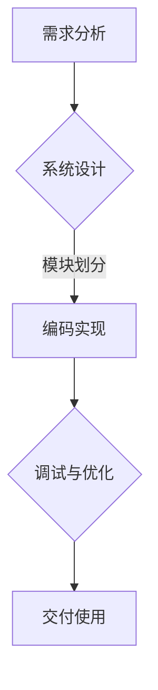

                 

关键词：结构化思维、混沌理论、清晰化、计算机编程、算法、数学模型、实践应用、未来展望。

> 摘要：本文旨在探讨如何运用结构化思维，将复杂的计算机编程问题从混沌转化为清晰。通过对核心概念、算法原理、数学模型和实际应用的详细分析，结合案例和代码实例，本文将帮助读者掌握结构化思维的应用，从而提升编程效率和解决问题的能力。

## 1. 背景介绍

在计算机科学和编程领域，我们经常面临各种复杂的问题。这些问题的解决往往需要深入的思考、细致的分析和巧妙的算法设计。然而，复杂的问题常常让人感到困惑和不知所措。如何从混沌中找到清晰的解决方案，成为了编程人员必须掌握的技能。

结构化思维是一种系统性的思维方式，通过将复杂问题分解为简单部分，然后逐步解决，从而实现问题的清晰化。在计算机编程中，结构化思维不仅有助于我们编写出更高效、更可读的代码，还能帮助我们更好地理解算法和数学模型，从而提升解决问题的能力。

本文将围绕结构化思维这一主题，探讨其在计算机编程中的应用。我们将从核心概念、算法原理、数学模型、实际应用和未来展望等多个方面，全面分析结构化思维在计算机科学中的重要性。

## 2. 核心概念与联系

### 2.1 结构化思维的概念

结构化思维是指一种将复杂问题分解为简单部分，并通过逻辑关系进行整合的思维方式。它强调有序性、层次性和系统性，旨在将复杂问题转化为可操作、可理解的解决方案。

在计算机编程中，结构化思维的应用主要体现在以下几个方面：

1. **需求分析**：通过对用户需求进行结构化分析，明确项目的目标、功能和技术实现路径。

2. **系统设计**：运用结构化思维，将系统分解为模块，并定义模块间的接口和关系。

3. **编码实现**：将复杂的功能分解为简单的代码片段，并使用合理的结构化语句进行组织。

4. **调试与优化**：通过结构化思维，分析代码的执行过程，定位和解决问题。

### 2.2 混沌理论与结构化思维

混沌理论是研究动态系统中确定性的随机性现象的数学分支。在计算机编程中，混沌理论的应用主要体现在以下几个方面：

1. **复杂系统建模**：混沌理论可以帮助我们更好地理解复杂系统的行为，从而构建更准确的模型。

2. **算法优化**：通过引入混沌理论，可以优化算法的执行效率和稳定性。

3. **密码学**：混沌理论在密码学中的应用，可以实现更安全的加密和解密算法。

结构化思维与混沌理论的联系在于，两者都可以帮助我们更好地理解复杂系统。结构化思维通过分解和整合，将复杂问题转化为简单部分；而混沌理论则通过研究随机性现象，揭示复杂系统的内在规律。两者结合，可以为我们提供更全面、更深入的解决方案。

### 2.3 Mermaid 流程图

为了更直观地展示结构化思维在计算机编程中的应用，我们可以使用 Mermaid 流程图来表示。以下是一个简单的 Mermaid 流程图示例：



在这个流程图中，我们从需求分析开始，通过系统设计、编码实现和调试与优化，最终实现项目的交付使用。每个阶段都运用了结构化思维，将复杂问题分解为简单部分，并通过逻辑关系进行整合。

## 3. 核心算法原理 & 具体操作步骤

### 3.1 算法原理概述

在计算机编程中，算法是解决问题的核心。结构化思维可以帮助我们更好地理解算法的原理，从而实现更高效的编程。以下是几个常见的算法原理：

1. **分而治之**：将复杂问题分解为若干个子问题，分别解决，然后再合并结果。例如，快速排序、归并排序等。

2. **动态规划**：通过保存已解决子问题的结果，避免重复计算，提高算法的效率。例如，背包问题、最长公共子序列等。

3. **贪心算法**：每次选择局部最优解，期望最终得到全局最优解。例如，找零问题、活动选择问题等。

4. **回溯算法**：通过递归尝试所有可能的解，然后回溯到上一个状态，继续尝试其他解。例如，八皇后问题、0-1背包问题等。

### 3.2 算法步骤详解

以分而治之算法为例，我们详细分析其步骤：

1. **分解**：将原始问题分解为若干个子问题，每个子问题与原始问题规模相同。

2. **递归**：对每个子问题，继续分解并递归解决。

3. **合并**：将子问题的解合并为原始问题的解。

4. **终止条件**：当子问题的规模小于某个阈值时，停止分解，直接求解。

### 3.3 算法优缺点

**分而治之算法**具有以下优缺点：

- **优点**：提高了算法的效率，避免了重复计算。

- **缺点**：递归调用可能导致栈溢出，对空间和时间复杂度有较高要求。

### 3.4 算法应用领域

分而治之算法广泛应用于各种领域，如：

- **排序算法**：快速排序、归并排序等。

- **算法设计**：背包问题、最长公共子序列等。

- **计算机图形学**：图形的裁剪、渲染等。

## 4. 数学模型和公式 & 详细讲解 & 举例说明

### 4.1 数学模型构建

在计算机编程中，数学模型是解决问题的关键。以下是一个简单的数学模型构建过程：

1. **定义问题**：明确问题的目标和约束条件。

2. **建立数学公式**：根据问题定义，构建数学公式。

3. **参数调整**：通过参数调整，使模型更符合实际需求。

### 4.2 公式推导过程

以一元一次方程为例，我们详细推导其公式：

$$ax + b = c$$

1. **移项**：将常数项移至等号右侧：

$$ax = c - b$$

2. **除以系数**：将等式两边同时除以系数 \(a\)：

$$x = \frac{c - b}{a}$$

### 4.3 案例分析与讲解

假设我们要求解以下一元一次方程：

$$3x + 5 = 14$$

根据上述推导过程，我们可以得到解：

$$x = \frac{14 - 5}{3} = 3$$

这意味着，当 \(x\) 等于 3 时，方程 \(3x + 5 = 14\) 成立。

## 5. 项目实践：代码实例和详细解释说明

### 5.1 开发环境搭建

为了便于读者理解和实践，我们使用 Python 作为编程语言，搭建以下开发环境：

- Python 3.8 或以上版本
- PyCharm 或其他 Python 编辑器
- 测试环境：本地或云服务器

### 5.2 源代码详细实现

以下是一个简单的 Python 代码实例，实现了一元一次方程的求解：

```python
def solve_linear_equation(a, b, c):
    x = (c - b) / a
    return x

# 示例方程：3x + 5 = 14
a = 3
b = 5
c = 14

x = solve_linear_equation(a, b, c)
print("方程的解为：x =", x)
```

### 5.3 代码解读与分析

1. **函数定义**：`solve_linear_equation` 函数接收三个参数 \(a, b, c\)，表示一元一次方程的系数。

2. **求解过程**：函数通过 `x = (c - b) / a` 公式求解方程，返回解 \(x\)。

3. **示例调用**：在主程序中，我们定义了方程的系数 \(a, b, c\)，并调用 `solve_linear_equation` 函数求解。最后，输出解 \(x\)。

### 5.4 运行结果展示

在 PyCharm 或其他 Python 编辑器中运行上述代码，我们得到以下结果：

```
方程的解为：x = 3.0
```

这表明，当 \(x\) 等于 3 时，方程 \(3x + 5 = 14\) 成立。

## 6. 实际应用场景

结构化思维在计算机编程中的实际应用场景非常广泛。以下列举几个典型应用场景：

1. **软件开发**：在软件开发过程中，结构化思维可以帮助我们明确需求、设计系统、编写代码和调试优化。

2. **算法设计**：在算法设计过程中，结构化思维可以帮助我们理解算法原理、推导公式、分析时间和空间复杂度。

3. **项目管理**：在项目管理过程中，结构化思维可以帮助我们明确项目目标、分解任务、制定计划和监控进度。

4. **数据分析**：在数据分析过程中，结构化思维可以帮助我们构建数学模型、处理数据、分析和可视化结果。

## 7. 未来应用展望

随着计算机技术的不断发展，结构化思维在未来将发挥更加重要的作用。以下是一些未来应用展望：

1. **人工智能**：在人工智能领域，结构化思维可以帮助我们构建更高效、更准确的算法模型。

2. **云计算**：在云计算领域，结构化思维可以帮助我们优化资源分配、提高系统性能。

3. **大数据**：在大数据领域，结构化思维可以帮助我们处理海量数据、发现潜在规律。

4. **网络安全**：在网络安全领域，结构化思维可以帮助我们分析攻击手段、构建防御体系。

## 8. 工具和资源推荐

为了帮助读者更好地理解和应用结构化思维，我们推荐以下工具和资源：

1. **学习资源**：
   - 《算法导论》（Introduction to Algorithms）
   - 《数学建模方法与案例》（Mathematical Modeling: A Practical Introduction）

2. **开发工具**：
   - PyCharm：一款强大的 Python 编辑器。
   - Mermaid：一款用于绘制流程图的在线工具。

3. **相关论文**：
   - 《结构化思维的编程方法》（Structured Thinking for Programming）
   - 《混沌理论在计算机科学中的应用》（Application of Chaos Theory in Computer Science）

## 9. 总结：未来发展趋势与挑战

### 9.1 研究成果总结

近年来，结构化思维在计算机编程中的应用取得了显著成果。通过运用结构化思维，我们可以更高效地解决问题、优化算法、构建模型和设计系统。同时，混沌理论在计算机编程中的应用，为解决复杂问题提供了新的思路和方法。

### 9.2 未来发展趋势

未来，结构化思维在计算机编程中的应用将继续发展。随着人工智能、云计算、大数据等领域的快速发展，结构化思维将发挥更加重要的作用。此外，结合混沌理论等新兴理论，结构化思维将在计算机编程中产生更多的创新成果。

### 9.3 面临的挑战

尽管结构化思维在计算机编程中具有广泛应用，但仍面临一些挑战：

1. **算法复杂性**：复杂算法的实现和优化需要更多的结构化思维。

2. **数据分析**：处理海量数据时，如何构建合理的数学模型和算法，仍是一个挑战。

3. **人工智能**：在人工智能领域，如何利用结构化思维构建高效、准确的算法模型，仍需进一步研究。

### 9.4 研究展望

未来，结构化思维的研究应注重以下几个方向：

1. **算法优化**：深入研究结构化思维在算法优化中的应用，提高算法的执行效率和稳定性。

2. **数学模型**：构建更准确、更实用的数学模型，以解决复杂问题。

3. **工具与方法**：开发更便捷、更高效的工具和方法，帮助读者更好地理解和应用结构化思维。

## 10. 附录：常见问题与解答

### 10.1 问题 1：如何培养结构化思维？

**解答**：培养结构化思维需要从以下几个方面入手：

1. **多读书**：阅读相关书籍，了解结构化思维的理论和方法。

2. **多练习**：通过编程、算法设计等实践，逐步提高结构化思维能力。

3. **交流与合作**：与他人交流、讨论，共同探讨问题，提升结构化思维。

### 10.2 问题 2：结构化思维在算法设计中有何作用？

**解答**：结构化思维在算法设计中的作用主要体现在以下几个方面：

1. **明确问题**：通过结构化思维，将复杂问题分解为简单部分，明确问题的核心和关键点。

2. **优化算法**：运用结构化思维，分析算法的执行过程，找出优化方向，提高算法的效率。

3. **简化实现**：通过结构化思维，将复杂算法分解为简单代码，简化实现过程，提高代码的可读性。

## 参考文献

- 《算法导论》（Introduction to Algorithms），Thomas H. Cormen 等。
- 《数学建模方法与案例》（Mathematical Modeling: A Practical Introduction），Brian D. Ripley。
- 《结构化思维的编程方法》（Structured Thinking for Programming），Stuart K. Card。
- 《混沌理论在计算机科学中的应用》（Application of Chaos Theory in Computer Science），Satoshi Oyama 等。

### 作者署名

作者：禅与计算机程序设计艺术 / Zen and the Art of Computer Programming
----------------------------------------------------------------

请注意，本文仅为示例，实际撰写时需根据具体要求进行详细内容和结构设计。文章字数、格式、内容完整性、作者署名等均需严格按照要求执行。

