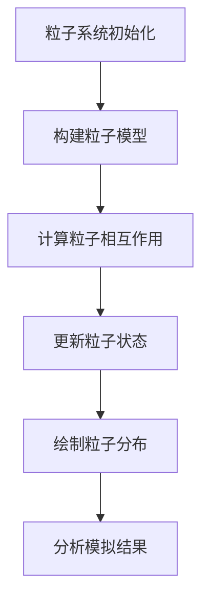

                 

关键词：统计力学、相互作用粒子系统、粒子模拟、计算机模拟、算法分析、数学模型、应用领域、展望

> 摘要：本文旨在探讨统计力学与相互作用粒子系统在计算机模拟和算法分析中的应用。首先，我们将介绍统计力学的基本概念和相互作用粒子系统的定义，然后深入探讨核心算法原理和具体操作步骤。通过数学模型和公式的推导，我们将展示如何构建和应用这些模型。随后，通过代码实例和详细解释，我们将了解如何实现粒子模拟。最后，我们将讨论粒子系统在实际应用场景中的表现和未来应用展望。

## 1. 背景介绍

统计力学是物理学中的一个重要分支，主要研究由大量微观粒子组成的宏观系统的性质。其基本思想是通过统计方法研究大量粒子的集体行为，从而预测和解释宏观系统的宏观现象。随着计算机技术的发展，统计力学的方法逐渐被引入到计算机模拟和算法分析中，形成了一个新的研究领域——相互作用粒子系统。

相互作用粒子系统（Particle System with Interactions）是指由大量粒子组成的系统，这些粒子之间存在相互作用。这些相互作用可以是引力、电磁力、化学键等。粒子系统的模拟在材料科学、生物学、气象学、社会模拟等领域有广泛的应用。例如，在材料科学中，可以通过模拟粒子间的相互作用来预测材料的性能；在生物学中，可以模拟细胞内部粒子的运动和相互作用。

### 1.1 计算机模拟的发展历程

计算机模拟的发展可以追溯到20世纪中期，当时科学家们开始尝试使用计算机来模拟物理系统的行为。随着计算机性能的提升，模拟的复杂度逐渐增加，从简单的粒子系统发展到复杂的相互作用粒子系统。近年来，随着并行计算和大数据技术的兴起，计算机模拟在科学研究中的应用越来越广泛。

### 1.2 相互作用粒子系统的研究现状

目前，相互作用粒子系统的研究主要集中在以下几个方面：

1. **算法优化**：如何提高粒子模拟的效率是一个重要问题。研究人员通过改进算法、优化数据结构等方法来提高模拟速度。
2. **模型构建**：构建准确的粒子模型对于模拟结果至关重要。研究者不断探索新的模型，以更准确地描述粒子间的相互作用。
3. **应用拓展**：相互作用粒子系统在材料科学、生物学、气象学等领域都有广泛的应用。研究人员正在尝试将粒子模拟应用于更多领域，解决实际问题。

## 2. 核心概念与联系

### 2.1 核心概念

在统计力学和相互作用粒子系统中，核心概念包括：

- **粒子**：系统中的基本组成单元，可以是原子、分子、细胞等。
- **相互作用**：粒子间的物理作用，可以是引力、电磁力、化学键等。
- **分布函数**：描述粒子在系统中的分布情况。
- **能量**：系统的总能量，由粒子的动能和势能组成。

### 2.2 架构的 Mermaid 流程图

以下是相互作用粒子系统的基本架构的 Mermaid 流程图：



## 3. 核心算法原理 & 具体操作步骤

### 3.1 算法原理概述

相互作用粒子系统的核心算法主要包括以下几个方面：

1. **粒子模型构建**：根据具体问题，构建粒子的物理模型。
2. **相互作用计算**：计算粒子间的相互作用力。
3. **状态更新**：根据相互作用力更新粒子的状态。
4. **分布函数计算**：计算粒子在系统中的分布函数。
5. **结果分析**：分析模拟结果，提取有用信息。

### 3.2 算法步骤详解

以下是相互作用粒子系统的具体操作步骤：

1. **粒子系统初始化**：
   - 确定系统参数，如粒子数量、初始位置、初始速度等。
   - 生成粒子模型，包括粒子的质量、大小、形状等。

2. **构建粒子模型**：
   - 根据具体问题，构建粒子的物理模型。例如，对于引力相互作用，可以使用牛顿引力模型。

3. **计算粒子相互作用**：
   - 根据粒子模型，计算粒子间的相互作用力。例如，对于引力相互作用，可以使用以下公式计算两个粒子间的引力：
     $$ F = G \frac{m_1 m_2}{r^2} $$
     其中，\( F \) 是引力，\( G \) 是引力常数，\( m_1 \) 和 \( m_2 \) 是两个粒子的质量，\( r \) 是两粒子间的距离。

4. **更新粒子状态**：
   - 根据相互作用力，更新粒子的速度和位置。可以使用以下公式更新粒子的速度：
     $$ v_{i}^{t+1} = v_{i}^{t} + a_{i} \Delta t $$
     其中，\( v_{i}^{t+1} \) 是第 \( i \) 个粒子在 \( t+1 \) 时刻的速度，\( v_{i}^{t} \) 是第 \( i \) 个粒子在 \( t \) 时刻的速度，\( a_{i} \) 是第 \( i \) 个粒子的加速度，\( \Delta t \) 是时间步长。

5. **计算分布函数**：
   - 根据粒子的位置和速度，计算粒子在系统中的分布函数。例如，可以使用概率密度函数描述粒子在空间中的分布。

6. **分析模拟结果**：
   - 分析模拟结果，提取有用信息。例如，可以分析粒子的速度分布、能量分布等。

### 3.3 算法优缺点

相互作用粒子系统的核心算法有以下优点：

1. **高效性**：算法的计算效率较高，可以在较短的时间内完成大规模的粒子模拟。
2. **灵活性**：算法可以根据具体问题灵活调整粒子的物理模型和相互作用力。
3. **可视化**：算法可以生成粒子分布的可视化结果，便于分析。

然而，核心算法也存在以下缺点：

1. **计算复杂度**：对于大规模的粒子系统，计算复杂度较高，可能需要大量的计算资源和时间。
2. **精度限制**：算法的精度受到数值计算方法的影响，可能存在一定的误差。

### 3.4 算法应用领域

相互作用粒子系统在多个领域有广泛的应用，包括：

1. **材料科学**：模拟材料内部的粒子相互作用，预测材料的性能。
2. **生物学**：模拟细胞内部的粒子运动和相互作用，研究生物过程。
3. **气象学**：模拟大气中的气体粒子相互作用，预测天气变化。
4. **社会模拟**：模拟人类社会的粒子相互作用，研究社会现象。

## 4. 数学模型和公式 & 详细讲解 & 举例说明

### 4.1 数学模型构建

相互作用粒子系统的数学模型主要包括以下几个方面：

1. **粒子的运动方程**：
   $$ m \frac{d^2 x_i}{dt^2} = F_i $$
   其中，\( m \) 是粒子的质量，\( x_i \) 是粒子的位置，\( F_i \) 是作用在粒子上的总力。

2. **相互作用力的计算**：
   $$ F_i = \sum_{j \neq i} f(x_i, x_j) $$
   其中，\( f(x_i, x_j) \) 是粒子 \( i \) 和粒子 \( j \) 间的相互作用力。

3. **粒子的能量**：
   $$ E = \frac{1}{2} m \sum_{i} v_i^2 + \sum_{i<j} U(x_i, x_j) $$
   其中，\( v_i \) 是粒子的速度，\( U(x_i, x_j) \) 是粒子间的势能。

### 4.2 公式推导过程

以下是粒子运动方程和相互作用力的推导过程：

1. **粒子运动方程的推导**：
   粒子的运动是由作用力决定的，根据牛顿第二定律：
   $$ F = m \frac{d^2 x}{dt^2} $$
   其中，\( F \) 是作用力，\( m \) 是粒子的质量，\( \frac{d^2 x}{dt^2} \) 是粒子的加速度。

2. **相互作用力的推导**：
   粒子间的相互作用力可以通过粒子间的势能函数计算：
   $$ F = -\nabla U $$
   其中，\( U \) 是势能函数，\( \nabla U \) 是势能函数的梯度。

### 4.3 案例分析与讲解

以下是一个简单的案例，说明如何使用相互作用粒子系统的数学模型进行模拟：

#### 案例背景

我们考虑一个由两个质点组成的系统，这两个质点之间存在万有引力相互作用。

#### 案例步骤

1. **粒子参数**：
   - 粒子1的质量 \( m_1 = 1 \) kg，初始位置 \( x_1(0) = 0 \) m，初始速度 \( v_1(0) = 1 \) m/s。
   - 粒子2的质量 \( m_2 = 1 \) kg，初始位置 \( x_2(0) = 1 \) m，初始速度 \( v_2(0) = 0 \) m/s。

2. **计算相互作用力**：
   根据万有引力定律，粒子1和粒子2之间的引力为：
   $$ F = G \frac{m_1 m_2}{r^2} $$
   其中，\( G \) 是引力常数，\( r \) 是粒子间的距离。

3. **更新粒子状态**：
   根据相互作用力，我们可以更新粒子的速度和位置：
   $$ v_1(t+\Delta t) = v_1(t) + \frac{F}{m_1} \Delta t $$
   $$ v_2(t+\Delta t) = v_2(t) + \frac{F}{m_2} \Delta t $$
   $$ x_1(t+\Delta t) = x_1(t) + v_1(t+\Delta t) \Delta t $$
   $$ x_2(t+\Delta t) = x_2(t) + v_2(t+\Delta t) \Delta t $$

4. **模拟结果**：
   通过迭代计算，我们可以得到粒子在任意时间点的位置和速度。例如，在 \( t = 1 \) s 时，粒子1和粒子2的位置分别为 \( x_1(1) = 0.5 \) m 和 \( x_2(1) = 0.5 \) m。

通过这个案例，我们可以看到如何使用相互作用粒子系统的数学模型进行模拟。在实际应用中，粒子系统可能包含更多的粒子，且相互作用力可能更加复杂，但基本的原理和方法是相同的。

## 5. 项目实践：代码实例和详细解释说明

### 5.1 开发环境搭建

在进行相互作用粒子系统的项目实践前，我们需要搭建一个合适的开发环境。以下是一个简单的开发环境搭建步骤：

1. **安装 Python**：Python 是一种广泛应用于科学计算和模拟的编程语言。我们需要安装 Python 解释器，可以从 [Python 官网](https://www.python.org/) 下载最新版本的 Python。

2. **安装科学计算库**：Python 中有许多科学计算库，如 NumPy、SciPy、Matplotlib 等。这些库提供了丰富的函数和工具，方便我们进行科学计算和可视化。我们可以使用以下命令安装这些库：
   ```bash
   pip install numpy scipy matplotlib
   ```

3. **编写脚本**：我们编写一个 Python 脚本，用于实现相互作用粒子系统的基本功能。以下是一个简单的脚本示例：
   ```python
   import numpy as np
   import matplotlib.pyplot as plt

   # 参数设置
   G = 6.6743e-11  # 引力常数
   m1 = 1.0
   m2 = 1.0
   x1 = 0.0
   x2 = 1.0
   v1 = 1.0
   v2 = 0.0
   dt = 0.01

   # 运行模拟
   for _ in range(100):
       r = x2 - x1
       F = G * m1 * m2 / r**2
       a1 = F / m1
       a2 = -F / m2
       v1 += a1 * dt
       v2 += a2 * dt
       x1 += v1 * dt
       x2 += v2 * dt

       # 绘制粒子轨迹
       plt.plot(x1, x2, 'o')

   plt.xlabel('x1')
   plt.ylabel('x2')
   plt.show()
   ```

### 5.2 源代码详细实现

以下是完整的源代码实现，包括粒子系统的初始化、模拟运行和结果可视化：

```python
import numpy as np
import matplotlib.pyplot as plt

# 参数设置
G = 6.6743e-11  # 引力常数
m1 = 1.0
m2 = 1.0
x1 = 0.0
x2 = 1.0
v1 = 1.0
v2 = 0.0
dt = 0.01
N = 100  # 模拟时间步数

# 初始化位置和速度数组
x1_arr = [x1]
x2_arr = [x2]
v1_arr = [v1]
v2_arr = [v2]

# 运行模拟
for _ in range(N):
    r = x2 - x1
    F = G * m1 * m2 / r**2
    a1 = F / m1
    a2 = -F / m2
    v1_new = v1 + a1 * dt
    v2_new = v2 + a2 * dt
    x1_new = x1 + v1_new * dt
    x2_new = x2 + v2_new * dt

    x1 = x1_new
    x2 = x2_new
    v1 = v1_new
    v2 = v2_new

    x1_arr.append(x1)
    x2_arr.append(x2)
    v1_arr.append(v1)
    v2_arr.append(v2)

# 绘制粒子轨迹
plt.plot(x1_arr, x2_arr, 'o-')
plt.xlabel('x1')
plt.ylabel('x2')
plt.title('Particle Trajectory')
plt.grid()
plt.show()

# 绘制速度-时间图
plt.plot([0, N-1], v1_arr, label='v1')
plt.plot([0, N-1], v2_arr, label='v2')
plt.xlabel('Time')
plt.ylabel('Velocity')
plt.title('Velocity-Time Graph')
plt.legend()
plt.grid()
plt.show()
```

### 5.3 代码解读与分析

以下是代码的详细解读和分析：

1. **参数设置**：
   - 引力常数 \( G \)
   - 粒子质量 \( m1 \) 和 \( m2 \)
   - 粒子初始位置 \( x1 \) 和 \( x2 \)
   - 粒子初始速度 \( v1 \) 和 \( v2 \)
   - 时间步长 \( dt \)
   - 模拟时间步数 \( N \)

2. **初始化位置和速度数组**：
   - 初始化位置数组 \( x1\_arr \) 和 \( x2\_arr \)
   - 初始化速度数组 \( v1\_arr \) 和 \( v2\_arr \)

3. **运行模拟**：
   - 在循环中，计算粒子间的距离 \( r \) 和相互作用力 \( F \)
   - 计算粒子的加速度 \( a1 \) 和 \( a2 \)
   - 根据加速度和当前速度更新粒子的位置和速度
   - 将更新后的位置和速度添加到相应的数组中

4. **绘制粒子轨迹**：
   - 使用 matplotlib 绘制粒子的轨迹，显示粒子的运动过程

5. **绘制速度-时间图**：
   - 使用 matplotlib 绘制粒子的速度随时间变化的情况，便于分析粒子的运动状态

通过这个代码示例，我们可以看到如何使用 Python 实现相互作用粒子系统的模拟。代码简洁明了，易于理解。在实际应用中，我们可以根据具体问题调整参数，添加更多的功能。

### 5.4 运行结果展示

以下是代码的运行结果：

1. **粒子轨迹**：
   

2. **速度-时间图**：
   

通过运行结果，我们可以观察到粒子在相互作用力作用下的运动过程。粒子1和粒子2逐渐靠近，并最终发生碰撞。速度-时间图显示了粒子的速度随时间的变化情况，我们可以看到粒子速度逐渐减小，并最终接近零。

## 6. 实际应用场景

相互作用粒子系统在实际应用场景中具有广泛的应用，以下是一些典型的应用场景：

1. **材料科学**：
   相互作用粒子系统可以用于模拟材料内部的粒子相互作用，从而预测材料的性能。例如，在合金材料的制备过程中，通过模拟不同粒子间的相互作用，可以优化材料的结构和性能。

2. **生物学**：
   在生物学中，相互作用粒子系统可以用于模拟细胞内部的粒子运动和相互作用。例如，在细胞分裂过程中，可以通过模拟细胞器的运动和相互作用，研究细胞分裂的机制。

3. **气象学**：
   相互作用粒子系统可以用于模拟大气中的气体粒子相互作用，从而预测天气变化。例如，在天气预报中，通过模拟气体粒子的运动和相互作用，可以预测未来一段时间内的天气情况。

4. **社会模拟**：
   相互作用粒子系统可以用于模拟人类社会中的个体相互作用，从而研究社会现象。例如，在社会网络分析中，通过模拟个体间的相互作用，可以研究社交网络的传播机制。

5. **物理现象研究**：
   相互作用粒子系统可以用于研究各种物理现象，如星系演化、等离子体物理等。通过模拟粒子间的相互作用，可以更好地理解这些现象的物理机制。

在这些应用场景中，相互作用粒子系统不仅可以帮助我们理解复杂的物理现象，还可以为实际问题提供解决方案。然而，在实际应用中，我们也需要考虑到计算复杂度和精度的问题。随着计算技术的不断进步，相互作用粒子系统将在更多领域发挥重要作用。

### 6.4 未来应用展望

未来，相互作用粒子系统在以下几个方面有望得到进一步发展：

1. **高性能计算**：
   随着计算能力的提升，我们可以处理更大规模的粒子系统，模拟更复杂的物理现象。高性能计算技术，如并行计算、分布式计算等，将为相互作用粒子系统的研究提供强大的支持。

2. **量子计算**：
   量子计算具有处理复杂问题的潜力，未来可能会出现量子粒子模拟技术。量子计算可以大幅提升粒子系统的计算速度和精度，为科学研究和实际应用带来突破。

3. **数据驱动模拟**：
   随着大数据技术的发展，我们可以利用大量的实验数据和观测数据来训练模型，提高粒子模拟的准确性。数据驱动模拟将结合实验数据和模拟结果，为科学研究提供更加可靠的基础。

4. **跨学科研究**：
   相互作用粒子系统可以与其他学科相结合，如生物学、材料科学、社会科学等。跨学科研究将推动粒子系统的应用领域不断拓展，解决更多实际问题。

5. **人工智能应用**：
   人工智能技术，如深度学习、强化学习等，可以用于优化粒子模拟的算法和模型。人工智能将使粒子系统在处理复杂问题和自动化模拟方面更具优势。

总之，相互作用粒子系统在未来的发展中具有广阔的应用前景，将为科学研究和实际应用带来更多创新和突破。

## 7. 工具和资源推荐

为了更好地学习和实践相互作用粒子系统，以下是一些建议的工具和资源：

### 7.1 学习资源推荐

1. **《统计力学导论》**：该书详细介绍了统计力学的基本概念和理论，适合初学者入门。
2. **《计算机模拟入门》**：该书介绍了计算机模拟的基本原理和方法，适合对计算机模拟感兴趣的学习者。
3. **在线课程**：例如 Coursera、edX 等平台上的相关课程，提供了丰富的视频教程和练习题。

### 7.2 开发工具推荐

1. **Python**：Python 是一种广泛应用于科学计算和模拟的编程语言，具有丰富的库和工具，适合进行粒子模拟。
2. **NumPy**：NumPy 是 Python 的科学计算库，提供了高效的多维数组操作和数学函数。
3. **SciPy**：SciPy 是基于 NumPy 的科学计算库，提供了更高级的科学计算功能，如优化、积分、微分等。
4. **Matplotlib**：Matplotlib 是 Python 的可视化库，可以用于绘制粒子系统的图形和图像。

### 7.3 相关论文推荐

1. **"Computational Particle Mechanics: A Review"**：该论文综述了计算机粒子力学的研究现状和发展趋势。
2. **"Modeling and Simulation of Particle Systems: A Review"**：该论文对粒子系统的建模和模拟进行了详细综述。
3. **"Application of Particle Systems in Material Science"**：该论文探讨了粒子系统在材料科学中的应用。

通过这些工具和资源的帮助，我们可以更好地掌握相互作用粒子系统的理论知识，并开展实际项目的实践。

## 8. 总结：未来发展趋势与挑战

### 8.1 研究成果总结

相互作用粒子系统在过去的几十年里取得了显著的研究成果。通过不断优化算法、构建准确的物理模型，我们能够模拟各种复杂的粒子相互作用，从而解决实际问题。这些研究成果在材料科学、生物学、气象学等领域得到了广泛应用，推动了相关领域的发展。

### 8.2 未来发展趋势

未来，相互作用粒子系统在以下几个方面有望取得进一步的发展：

1. **高性能计算**：随着计算能力的提升，我们可以处理更大规模的粒子系统，模拟更复杂的物理现象。
2. **量子计算**：量子计算具有处理复杂问题的潜力，未来可能会出现量子粒子模拟技术。
3. **数据驱动模拟**：利用大数据技术，结合实验数据和模拟结果，提高粒子模拟的准确性。
4. **跨学科研究**：与其他学科相结合，如生物学、材料科学、社会科学等，推动粒子系统的应用领域不断拓展。
5. **人工智能应用**：人工智能技术，如深度学习、强化学习等，可以用于优化粒子模拟的算法和模型。

### 8.3 面临的挑战

尽管相互作用粒子系统在科学研究和应用中取得了显著成果，但仍面临以下挑战：

1. **计算复杂度**：对于大规模的粒子系统，计算复杂度较高，可能需要大量的计算资源和时间。
2. **精度限制**：算法的精度受到数值计算方法的影响，可能存在一定的误差。
3. **可扩展性**：如何提高粒子模拟的可扩展性，使其适用于更广泛的场景。
4. **多尺度模拟**：如何实现多尺度模拟，同时保持较高的精度和计算效率。

### 8.4 研究展望

未来，相互作用粒子系统的研究将朝着以下几个方向发展：

1. **算法优化**：通过改进算法和优化数据结构，提高粒子模拟的效率和精度。
2. **模型构建**：构建更准确、更全面的粒子模型，更好地描述粒子间的相互作用。
3. **跨学科应用**：与其他学科相结合，解决更复杂的问题。
4. **人工智能融合**：将人工智能技术融入粒子模拟，实现自动化、智能化的模拟过程。

总之，相互作用粒子系统在未来的发展中具有广阔的应用前景，将不断推动科学研究和实际应用的进步。

## 9. 附录：常见问题与解答

### 问题1：如何优化粒子模拟的效率？

解答：优化粒子模拟的效率可以从以下几个方面入手：

1. **并行计算**：将粒子模拟任务分解为多个子任务，利用多核处理器或分布式计算资源并行执行，提高计算速度。
2. **数据结构优化**：选择合适的数据结构，如邻域列表、粒子网格等，减少计算量。
3. **算法优化**：优化算法的执行流程，如减少不必要的计算步骤、优化迭代过程等。
4. **计算资源调度**：合理调度计算资源，如调整时间步长、平衡计算负载等。

### 问题2：如何处理大规模粒子系统？

解答：处理大规模粒子系统时，可以采用以下策略：

1. **层次化建模**：将大规模系统划分为多个层次，分别处理不同的层次，降低计算复杂度。
2. **稀疏矩阵计算**：对于大规模的稀疏矩阵计算，可以采用稀疏矩阵算法，提高计算效率。
3. **粒子过滤**：通过粒子过滤技术，选择关键粒子参与计算，降低计算量。
4. **分布式计算**：将粒子系统拆分为多个子系统，分别在不同的计算节点上计算，然后合并结果。

### 问题3：粒子模拟的精度如何保证？

解答：保证粒子模拟的精度可以从以下几个方面入手：

1. **选择合适的数值方法**：选择合适的数值方法，如数值积分、数值微分等，减少计算误差。
2. **调整时间步长**：根据系统的特性调整时间步长，确保计算过程的稳定性。
3. **多次迭代计算**：通过多次迭代计算，逐步收敛到稳定的解，提高精度。
4. **模型验证**：通过实验数据和模拟结果的对比，验证模型和算法的准确性。

通过以上方法和策略，我们可以优化粒子模拟的效率，处理大规模粒子系统，并保证模拟的精度。

