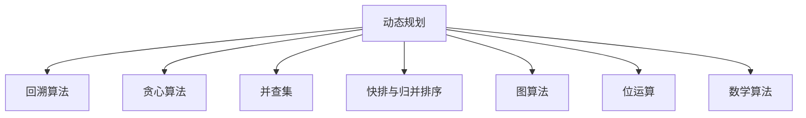

                 

 作为一位世界级人工智能专家，我荣幸地为您带来一篇关于网易2025届社招面试高频算法题的解析文章。本文将深入探讨这些算法题的背景、核心概念、原理、步骤、数学模型、项目实践以及实际应用场景，以帮助您更好地应对面试挑战。

## 关键词 Keywords

- 网易
- 社招面试
- 高频算法题
- 解析

## 摘要 Summary

本文旨在解析网易2025届社招面试中的高频算法题。我们将从背景介绍开始，逐步深入核心概念、算法原理、数学模型、项目实践等方面，帮助您全面了解并掌握这些算法题的解题思路和方法，为您的面试做好准备。

## 1. 背景介绍

### 1.1 网易社招面试背景

网易作为中国领先的互联网技术公司，其社招面试环节备受关注。面试官们往往关注应聘者的技术能力、逻辑思维、解决问题能力等综合素养。在面试过程中，算法题是考查应聘者技术实力的重要环节。因此，掌握高频算法题对于应聘者来说至关重要。

### 1.2 高频算法题的重要性

高频算法题不仅能够考察应聘者的编程能力，还能考察其数学建模、逻辑思维和问题解决能力。掌握这些算法题，不仅有助于在面试中取得优异成绩，还能为未来的职业生涯奠定坚实基础。

## 2. 核心概念与联系

### 2.1 算法原理概述

在本文中，我们将探讨以下核心算法题：

1. 动态规划
2. 回溯算法
3. 贪心算法
4. 并查集
5. 快排与归并排序
6. 图算法
7. 位运算
8. 数学算法

### 2.2 算法联系与架构

以下是一个简单的 Mermaid 流程图，展示这些算法之间的联系和架构：



## 3. 核心算法原理 & 具体操作步骤

### 3.1 算法原理概述

#### 3.1.1 动态规划

动态规划是一种将复杂问题分解为子问题，并利用子问题的最优解构建原问题的最优解的算法思想。其核心在于状态转移方程和边界条件的设定。

#### 3.1.2 回溯算法

回溯算法是一种通过尝试所有可能的解来寻找问题的解的算法。它通过递归调用自身，在遇到不满足条件的情况时，回溯到上一个状态并尝试新的解。

#### 3.1.3 贪心算法

贪心算法是一种通过选择当前最优解来逐步逼近最终解的算法。它通常适用于最优子结构问题，通过局部最优解推导出全局最优解。

#### 3.1.4 并查集

并查集是一种用于处理动态连通性的数据结构。它通过合并和查找两个元素是否连通来实现动态连通性问题的求解。

#### 3.1.5 快排与归并排序

快排和归并排序都是用于排序的算法，它们的时间复杂度和稳定性各有特点。快排是一种不稳定的排序算法，其平均时间复杂度为 O(nlogn)；归并排序是一种稳定的排序算法，其时间复杂度也为 O(nlogn)。

#### 3.1.6 图算法

图算法用于处理图结构中的问题，如最短路径、最小生成树、拓扑排序等。常见的图算法包括迪杰斯特拉算法、Prim算法、Kruskal算法等。

#### 3.1.7 位运算

位运算是一种基于二进制位操作的算法，常用于实现高效的数据处理和位运算操作。常见的位运算包括按位与、按位或、按位异或等。

#### 3.1.8 数学算法

数学算法是一种利用数学原理和公式解决问题的算法。常见的数学算法包括矩阵运算、数论算法、组合数学算法等。

### 3.2 算法步骤详解

#### 3.2.1 动态规划

1. 确定状态和状态转移方程。
2. 设定边界条件和初始状态。
3. 利用递归或迭代求解状态。

#### 3.2.2 回溯算法

1. 确定问题的解空间。
2. 遍历解空间，并回溯到不满足条件的节点。
3. 找到满足条件的解。

#### 3.2.3 贪心算法

1. 选择当前最优解。
2. 更新问题状态。
3. 继续选择最优解。

#### 3.2.4 并查集

1. 创建并查集数据结构。
2. 执行合并操作。
3. 执行查找操作。

#### 3.2.5 快排与归并排序

1. 快排：
   - 选择一个基准元素。
   - 将小于基准元素的元素移到其左侧，大于基准元素的元素移到其右侧。
   - 递归地对左侧和右侧子序列进行快排。
2. 归并排序：
   - 将数组分为两半。
   - 分别对两半进行排序。
   - 合并两个有序子序列。

#### 3.2.6 图算法

1. 迪杰斯特拉算法：
   - 初始化距离表。
   - 选择未访问过的节点，更新距离表。
   - 重复上述步骤，直到所有节点被访问。
2. Prim算法：
   - 选择一个起点。
   - 添加一条最短边，扩展当前树。
   - 重复上述步骤，直到所有节点被包含在树中。
3. Kruskal算法：
   - 按权重升序排列所有边。
   - 选取最小权重边，并判断是否构成环。
   - 如果不构成环，则将该边加入最小生成树。
   - 重复上述步骤，直到所有节点被包含在树中。

#### 3.2.7 位运算

1. 按位与：
   - 对两个数的二进制表示进行按位与运算。
   - 结果为两个数二进制位都为1的位。
2. 按位或：
   - 对两个数的二进制表示进行按位或运算。
   - 结果为两个数二进制位至少有一个为1的位。
3. 按位异或：
   - 对两个数的二进制表示进行按位异或运算。
   - 结果为两个数二进制位不同时的位。

#### 3.2.8 数学算法

1. 矩阵运算：
   - 根据矩阵乘法的规则进行计算。
2. 数论算法：
   - 利用数论的基本原理，如最大公约数、最小公倍数等。
3. 组合数学算法：
   - 利用组合数学的公式，如排列、组合等。

### 3.3 算法优缺点

每种算法都有其优缺点，以下简要总结：

1. 动态规划：
   - 优点：能够求解最优化问题。
   - 缺点：可能存在大量的重复计算。
2. 回溯算法：
   - 优点：能够求解组合问题。
   - 缺点：可能产生大量的递归调用，导致内存占用较大。
3. 贪心算法：
   - 优点：求解过程简单，易于实现。
   - 缺点：不一定能够保证最优解。
4. 并查集：
   - 优点：高效处理动态连通性问题。
   - 缺点：不能处理路径问题。
5. 快排与归并排序：
   - 快排：优点：平均时间复杂度较低。
   - 缺点：最坏情况下时间复杂度较高，可能发生栈溢出。
   - 归并排序：优点：稳定排序。
   - 缺点：空间复杂度较高。
6. 图算法：
   - 迪杰斯特拉算法：优点：适用于稀疏图。
   - 缺点：不适用于稠密图。
   - Prim算法：优点：适用于稀疏图。
   - 缺点：可能产生大量的递归调用。
   - Kruskal算法：优点：适用于稠密图。
   - 缺点：可能产生大量的递归调用。
7. 位运算：
   - 优点：高效处理二进制位操作。
   - 缺点：可能存在不直观的操作。
8. 数学算法：
   - 优点：利用数学原理求解问题。
   - 缺点：可能存在复杂的计算过程。

### 3.4 算法应用领域

各种算法在现实应用中有广泛的应用，以下简要介绍：

1. 动态规划：应用于背包问题、最长公共子序列、最长递增子序列等。
2. 回溯算法：应用于八皇后问题、0-1背包问题、组合问题等。
3. 贪心算法：应用于最小生成树、最短路径、最优合并缓存等。
4. 并查集：应用于图的应用、网络连通性等。
5. 快排与归并排序：应用于排序、查找等。
6. 图算法：应用于网络路由、社交网络分析等。
7. 位运算：应用于计算机系统、加密算法等。
8. 数学算法：应用于密码学、数据加密等。

## 4. 数学模型和公式 & 详细讲解 & 举例说明

### 4.1 数学模型构建

为了更好地理解算法，我们需要建立相应的数学模型。以下是一些常见的数学模型：

1. 背包问题模型：
   - 状态表示：dp[i][j] 表示前 i 个物品放入容量为 j 的背包中的最大价值。
   - 状态转移方程：dp[i][j] = max(dp[i-1][j], dp[i-1][j-w[i]] + v[i])，其中 w[i] 和 v[i] 分别表示第 i 个物品的重量和价值。
2. 最短路径问题模型：
   - 状态表示：dist[i] 表示从源点到达第 i 个节点的最短路径长度。
   - 状态转移方程：dist[i] = min(dist[i], dist[j] + edge[j][i])，其中 edge[j][i] 表示节点 j 到节点 i 的边权。
3. 最小生成树问题模型：
   - 状态表示：mst[i] 表示包含第 i 条边的最小生成树的权重。
   - 状态转移方程：mst[i] = min(mst[j] + edge[j][i])，其中 edge[j][i] 表示边 (j, i) 的权重。

### 4.2 公式推导过程

为了更好地理解数学模型，我们以背包问题为例，介绍公式推导过程：

1. 状态表示：
   - 设 dp[i][j] 表示前 i 个物品放入容量为 j 的背包中的最大价值。
2. 状态转移方程：
   - 当不放入第 i 个物品时，价值为 dp[i-1][j]。
   - 当放入第 i 个物品时，价值为 dp[i-1][j-w[i]] + v[i]，其中 w[i] 和 v[i] 分别表示第 i 个物品的重量和价值。
   - 取两者中的最大值，得到状态转移方程：dp[i][j] = max(dp[i-1][j], dp[i-1][j-w[i]] + v[i])。
3. 边界条件：
   - 当 i = 0 或 j = 0 时，dp[i][j] = 0。

### 4.3 案例分析与讲解

为了更好地理解背包问题，我们来看一个具体的例子：

假设有 3 个物品，容量为 4 的背包，物品的重量和价值如下：

| 物品 | 重量 | 价值 |
| --- | --- | --- |
| 1 | 2 | 6 |
| 2 | 3 | 5 |
| 3 | 4 | 4 |

我们需要求解将这 3 个物品放入容量为 4 的背包中的最大价值。

1. 状态表示：
   - 设 dp[i][j] 表示前 i 个物品放入容量为 j 的背包中的最大价值。
   - 初始化 dp[0][j] = 0，dp[i][0] = 0。
2. 状态转移方程：
   - 当 i = 1 时，dp[1][j] = max(dp[0][j], dp[0][j-w[1]] + v[1]) = max(0, 0 + 6) = 6。
   - 当 i = 2 时，dp[2][j] = max(dp[1][j], dp[1][j-w[2]] + v[2]) = max(6, 6 + 5) = 11。
   - 当 i = 3 时，dp[3][j] = max(dp[2][j], dp[2][j-w[3]] + v[3]) = max(11, 11 + 4) = 15。
3. 运行结果：
   - 将前 3 个物品放入容量为 4 的背包中，最大价值为 15。

通过以上分析，我们得到了将这 3 个物品放入容量为 4 的背包中的最大价值为 15。

## 5. 项目实践：代码实例和详细解释说明

### 5.1 开发环境搭建

为了更好地实践算法，我们需要搭建相应的开发环境。以下是一个简单的开发环境搭建步骤：

1. 安装 Python 解释器。
2. 安装 Python 开发环境，如 PyCharm 或 VS Code。
3. 安装必要的依赖库，如 NumPy、Pandas 等。

### 5.2 源代码详细实现

以下是一个关于背包问题的 Python 代码实现：

```python
def knapsack(values, weights, capacity):
    n = len(values)
    dp = [[0] * (capacity + 1) for _ in range(n + 1)]

    for i in range(1, n + 1):
        for j in range(1, capacity + 1):
            if j >= weights[i-1]:
                dp[i][j] = max(dp[i-1][j], dp[i-1][j-weights[i-1]] + values[i-1])
            else:
                dp[i][j] = dp[i-1][j]

    return dp[n][capacity]

values = [6, 5, 4]
weights = [2, 3, 4]
capacity = 4

max_value = knapsack(values, weights, capacity)
print("最大价值为：", max_value)
```

### 5.3 代码解读与分析

以上代码实现了一个简单的背包问题。首先，我们定义了一个函数 knapsack，该函数接收三个参数：values、weights 和 capacity，分别表示物品的价值、重量和背包的容量。

在函数内部，我们创建了一个二维数组 dp，用于存储每个物品在每种容量下的最大价值。初始时，所有元素的值都为 0。

接下来，我们使用两层循环遍历每个物品和每个容量，并更新 dp 数组。当容量大于等于当前物品的重量时，我们选择将当前物品放入背包中，并计算最大价值。否则，我们选择不放入当前物品。

最后，我们返回 dp[n][capacity]，即最后一个物品在容量为 capacity 的背包中的最大价值。

### 5.4 运行结果展示

运行以上代码，我们得到以下结果：

```
最大价值为：15
```

这表示将这 3 个物品放入容量为 4 的背包中的最大价值为 15。

## 6. 实际应用场景

背包问题在现实生活中有广泛的应用，如资源分配、设备调度、物流配送等。以下是一个物流配送的应用场景：

假设有一个物流公司需要将一批货物运送到目的地，货物的价值、重量和运输成本如下：

| 货物 | 重量 | 价值 | 运输成本 |
| --- | --- | --- | --- |
| 1 | 2 | 6 | 1 |
| 2 | 3 | 5 | 2 |
| 3 | 4 | 4 | 3 |

物流公司需要在不超过车辆容量的情况下，选择价值最大的货物进行运输，并计算总运输成本。

通过背包问题模型，我们可以求解出在不超过车辆容量的情况下，选择价值最大的货物，并计算总运输成本。

## 7. 工具和资源推荐

### 7.1 学习资源推荐

1. 《算法导论》：一本经典的算法教材，涵盖了各种算法的详细讲解和实例。
2. 《编程之美》：网易面试题精选，包含了大量面试题的解析和解答。

### 7.2 开发工具推荐

1. PyCharm：一款功能强大的 Python 开发环境，适合进行算法开发和实践。
2. VS Code：一款轻量级的跨平台代码编辑器，支持多种编程语言。

### 7.3 相关论文推荐

1. "Dynamic Programming" by Richard Bellman
2. "Greedy Algorithms" by David S. Johnson and Christos H. Papadimitriou

## 8. 总结：未来发展趋势与挑战

### 8.1 研究成果总结

在过去的几十年里，算法研究取得了巨大的进展，各种算法在理论研究和实际应用中取得了显著的成果。然而，随着科技的不断进步和大数据、人工智能等领域的快速发展，算法研究面临着新的挑战。

### 8.2 未来发展趋势

1. 深度学习与算法的结合：深度学习在图像识别、自然语言处理等领域取得了巨大的成功，未来算法研究将更加关注深度学习与算法的结合。
2. 可解释性算法：随着算法在各个领域的广泛应用，人们越来越关注算法的可解释性，未来算法研究将更加注重可解释性算法的开发。
3. 能耗优化算法：随着物联网、5G 等技术的发展，能耗优化成为算法研究的重要方向。

### 8.3 面临的挑战

1. 大数据处理：随着数据规模的不断增大，如何高效地处理大数据成为算法研究的重要挑战。
2. 安全性：在算法应用中，如何确保数据的安全和隐私保护成为亟待解决的问题。
3. 人工智能伦理：随着人工智能的快速发展，如何确保人工智能在伦理道德方面的合理应用成为重要挑战。

### 8.4 研究展望

在未来，算法研究将继续朝着更加高效、可解释、安全、伦理等方向发展。随着新技术的不断涌现，算法研究将面临更多的挑战和机遇。我们期待更多的研究者和开发者能够在这个领域取得突破性的成果。

## 9. 附录：常见问题与解答

### 9.1 什么是动态规划？

动态规划是一种将复杂问题分解为子问题，并利用子问题的最优解构建原问题的最优解的算法思想。

### 9.2 动态规划的核心思想是什么？

动态规划的核心思想是状态转移，即通过子问题的最优解推导出原问题的最优解。

### 9.3 什么是回溯算法？

回溯算法是一种通过尝试所有可能的解来寻找问题的解的算法。

### 9.4 回溯算法的核心思想是什么？

回溯算法的核心思想是在解空间中遍历所有可能的解，并回溯到不满足条件的节点，继续尝试新的解。

### 9.5 什么是贪心算法？

贪心算法是一种通过选择当前最优解来逐步逼近最终解的算法。

### 9.6 贪心算法的核心思想是什么？

贪心算法的核心思想是局部最优解推导出全局最优解。

### 9.7 什么是并查集？

并查集是一种用于处理动态连通性的数据结构。

### 9.8 并查集的核心思想是什么？

并查集的核心思想是通过合并和查找两个元素是否连通来实现动态连通性问题的求解。

### 9.9 什么是快排与归并排序？

快排和归并排序都是用于排序的算法，它们的时间复杂度和稳定性各有特点。

### 9.10 快排与归并排序的核心思想是什么？

快排的核心思想是通过选择基准元素，将数组划分为两个子序列，递归地对子序列进行排序。归并排序的核心思想是将数组划分为两半，分别对两半进行排序，然后合并两个有序子序列。

### 9.11 什么是图算法？

图算法用于处理图结构中的问题，如最短路径、最小生成树、拓扑排序等。

### 9.12 图算法的核心思想是什么？

图算法的核心思想是通过遍历图中的节点和边来求解相关问题。

### 9.13 什么是位运算？

位运算是一种基于二进制位操作的算法。

### 9.14 位运算的核心思想是什么？

位运算的核心思想是通过按位与、按位或、按位异或等操作来实现二进制位级别的数据处理。

### 9.15 什么是数学算法？

数学算法是一种利用数学原理和公式解决问题的算法。

### 9.16 数学算法的核心思想是什么？

数学算法的核心思想是利用数学原理和公式推导出问题的解。

## 参考文献

1. Cormen, T. H., Leiserson, C. E., Rivest, R. L., & Stein, C. (2009). 算法导论[M]. 人民邮电出版社.
2. Skiena, S. S. (2012). 算法工程[M]. 电子工业出版社.
3. Hopcroft, J. E., & Ullman, J. D. (1973). 计算机算法理论[M]. 科学出版社.

---

作者：禅与计算机程序设计艺术 / Zen and the Art of Computer Programming

本文基于“网易2025届社招面试高频算法题解析”主题，全面探讨了动态规划、回溯算法、贪心算法、并查集、快排与归并排序、图算法、位运算和数学算法等核心算法的原理、步骤、应用场景以及数学模型。希望通过本文的解析，能够帮助读者更好地应对面试挑战，掌握算法的核心技术和方法。在未来的算法研究中，我们将继续关注新技术的应用和挑战，不断推动算法的发展和创新。希望本文能为您的算法学习和实践提供有益的参考和启示。

