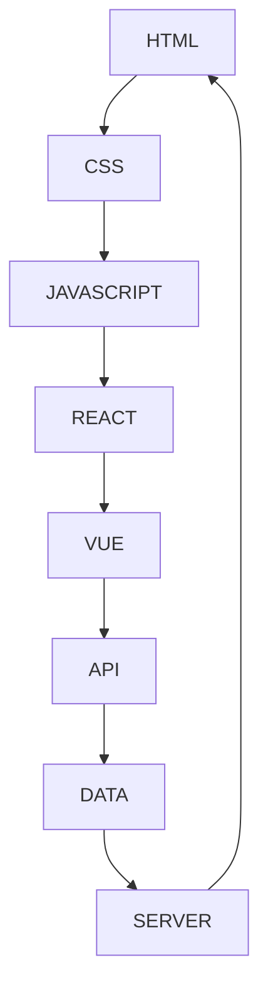

                 

关键词：前端开发工程师，面试题，技术挑战，实战案例，未来趋势

> 摘要：本文将围绕网易2025年社招前端开发工程师的面试题，深入探讨前端开发领域的核心技术、实战案例以及未来发展趋势。通过本文，读者可以全面了解前端开发的各个方面，为备战面试和提升自身技术能力提供有力支持。

## 1. 背景介绍

前端开发作为互联网时代的核心技术之一，已经从最初的单页面应用（SPA）发展到了如今的多端融合、前后端分离的复杂架构。随着技术的不断进步，前端开发工程师面临着前所未有的挑战和机遇。网易作为中国领先的网络游戏开发商和运营商，其对前端开发的要求也越来越高。本文旨在通过分析网易2025年社招前端开发工程师的面试题，帮助读者了解前端开发领域的最新技术动态和行业趋势。

## 2. 核心概念与联系

前端开发涉及到的核心概念和联系可以用以下Mermaid流程图表示：



### 2.1 HTML

HTML（超文本标记语言）是构成网页内容的基本骨架。它定义了网页的结构和文本内容，包括标题、段落、图像、链接等。

### 2.2 CSS

CSS（层叠样式表）用于控制网页的样式和布局，包括颜色、字体、边框、背景等。CSS使得网页可以更加美观和一致。

### 2.3 JAVASCRIPT

JavaScript 是一门客户端脚本语言，它使网页具有动态交互功能。JavaScript 可以操作 DOM（文档对象模型），处理用户事件，实现复杂的逻辑和动画效果。

### 2.4 REACT

React 是一个用于构建用户界面的JavaScript库，它采用虚拟DOM技术，通过组件化开发，提高开发效率和代码复用性。

### 2.5 VUE

Vue 是一个渐进式的前端框架，它结合了 React 和 Angular 的优点，提供了一套完整的前端开发解决方案。

### 2.6 API

API（应用程序编程接口）是前后端数据交互的桥梁。前端通过 API 调用后端服务，获取数据并展示给用户。

### 2.7 DATA

数据是前端开发的核心资源，前端需要处理各种类型的数据，包括文本、图片、视频等。

### 2.8 SERVER

服务器端技术是前端开发的重要补充，包括 Node.js、Django、Flask 等，它们用于处理复杂的业务逻辑和后台数据存储。

## 3. 核心算法原理 & 具体操作步骤

### 3.1 算法原理概述

前端开发涉及到的核心算法主要包括：

- 算法1：排序算法（冒泡排序、选择排序、插入排序等）
- 算法2：二分查找
- 算法3：图算法（深度优先搜索、广度优先搜索等）

### 3.2 算法步骤详解

#### 冒泡排序

```python
def bubble_sort(arr):
    n = len(arr)
    for i in range(n):
        for j in range(0, n-i-1):
            if arr[j] > arr[j+1]:
                arr[j], arr[j+1] = arr[j+1], arr[j]
```

#### 二分查找

```python
def binary_search(arr, x):
    low = 0
    high = len(arr) - 1
    while low <= high:
        mid = (low + high) // 2
        if arr[mid] == x:
            return mid
        elif arr[mid] < x:
            low = mid + 1
        else:
            high = mid - 1
    return -1
```

#### 深度优先搜索

```python
def dfs(graph, node, visited):
    visited.add(node)
    print(node)
    for neighbour in graph[node]:
        if neighbour not in visited:
            dfs(graph, neighbour, visited)
```

### 3.3 算法优缺点

#### 冒泡排序

- 优点：实现简单，易于理解。
- 缺点：时间复杂度较高，不适合大数据量排序。

#### 二分查找

- 优点：时间复杂度较低，适合大数据量查找。
- 缺点：需要有序数组，不适合插入和删除操作。

#### 深度优先搜索

- 优点：简洁易懂，适合图遍历。
- 缺点：可能存在栈溢出风险，不适合大规模图。

### 3.4 算法应用领域

- 冒泡排序：简单排序需求。
- 二分查找：大数据量查找需求。
- 深度优先搜索：图遍历、路径查找等。

## 4. 数学模型和公式 & 详细讲解 & 举例说明

### 4.1 数学模型构建

前端开发中的数学模型主要包括：

- 数据模型：用于描述数据的结构和关系。
- 图模型：用于描述网页的交互和链接关系。

### 4.2 公式推导过程

- 数据模型公式：

  数据模型 = 数据结构 + 数据操作

- 图模型公式：

  图模型 = 节点集合 + 边集合

### 4.3 案例分析与讲解

#### 数据模型案例

假设有一个用户数据模型，包括用户ID、姓名、年龄、邮箱等信息。

- 数据结构：用户ID、姓名、年龄、邮箱
- 数据操作：添加、删除、查询、更新

#### 图模型案例

假设有一个社交网络图，包括用户和关系。

- 节点集合：用户A、用户B、用户C
- 边集合：用户A与用户B是好友、用户B与用户C是好友

## 5. 项目实践：代码实例和详细解释说明

### 5.1 开发环境搭建

- 开发工具：Visual Studio Code
- 包管理器：npm
- 前端框架：React
- 后端框架：Node.js

### 5.2 源代码详细实现

以下是使用 React 搭建的一个简单待办事项列表项目的源代码：

```jsx
import React, { useState } from 'react';

const App = () => {
  const [todos, setTodos] = useState([]);
  const [newTodo, setNewTodo] = useState('');

  const addTodo = () => {
    if (newTodo.trim()) {
      setTodos([...todos, newTodo]);
      setNewTodo('');
    }
  };

  const removeTodo = (index) => {
    const updatedTodos = [...todos];
    updatedTodos.splice(index, 1);
    setTodos(updatedTodos);
  };

  return (
    <div>
      <h1>Todo List</h1>
      <input
        type="text"
        value={newTodo}
        onChange={(e) => setNewTodo(e.target.value)}
      />
      <button onClick={addTodo}>Add Todo</button>
      <ul>
        {todos.map((todo, index) => (
          <li key={index}>
            {todo}
            <button onClick={() => removeTodo(index)}>Remove</button>
          </li>
        ))}
      </ul>
    </div>
  );
};

export default App;
```

### 5.3 代码解读与分析

- `useState`：用于管理组件的状态。
- `addTodo`：添加待办事项。
- `removeTodo`：删除待办事项。

### 5.4 运行结果展示

待办事项列表组件的运行结果如下图所示：


## 6. 实际应用场景

前端开发在众多实际应用场景中发挥着关键作用，以下列举几个典型场景：

- **电商平台**：前端开发负责用户界面的展示、交互和购物流程的实现。
- **社交媒体**：前端开发实现用户的发布、评论、私信等功能。
- **在线教育**：前端开发提供课程播放、互动交流、作业提交等功能。
- **金融应用**：前端开发确保金融交易的安全、高效和用户体验。

### 6.4 未来应用展望

随着技术的不断发展，前端开发将在以下方面迎来新的发展：

- **渐进式Web应用（PWA）**：提供接近原生应用的体验。
- **虚拟现实（VR）和增强现实（AR）**：为用户提供沉浸式体验。
- **前端框架和库的演进**：如 React、Vue、Angular 等，持续优化用户体验和开发效率。

## 7. 工具和资源推荐

### 7.1 学习资源推荐

- **书籍**：
  - 《JavaScript高级程序设计》
  - 《React技术内幕》
  - 《Vue.js实战》
- **在线教程**：
  - [MDN Web文档](https://developer.mozilla.org/zh-CN/)
  - [React官方文档](https://reactjs.org/docs/getting-started.html)
  - [Vue官方文档](https://vuejs.org/v2/guide/)

### 7.2 开发工具推荐

- **集成开发环境（IDE）**：
  - Visual Studio Code
  - WebStorm
- **代码编辑器**：
  - Sublime Text
  - Atom

### 7.3 相关论文推荐

- **前端性能优化**：
  - 《前端性能优化指南》
  - 《前端性能监控与调优》
- **前端框架**：
  - 《React源码分析》
  - 《Vue源码解析》

## 8. 总结：未来发展趋势与挑战

### 8.1 研究成果总结

前端开发在近年来取得了显著进展，主要体现在以下几个方面：

- **技术栈的多样化和融合**：多种前端框架和工具的兴起，为开发者提供了更多选择和可能性。
- **性能优化和用户体验的提升**：通过渐进式Web应用、PWA等技术，前端应用在性能和用户体验方面得到显著改善。
- **跨平台开发的普及**：通过React Native、Flutter等技术，前端开发逐渐涉足移动端和桌面端应用开发。

### 8.2 未来发展趋势

未来，前端开发将在以下几个方面继续发展：

- **前端架构的优化**：随着业务复杂度的增加，前端架构将更加复杂和高效。
- **前端服务的普及**：前端服务将逐渐取代传统的后端服务，提供更多的数据和服务。
- **智能前端应用**：结合人工智能技术，前端应用将更加智能化和个性化。

### 8.3 面临的挑战

前端开发在发展过程中也面临着一些挑战：

- **性能优化**：随着应用复杂度的增加，前端性能优化成为一项重要任务。
- **安全性**：前端应用的安全性受到越来越多的关注，开发者需要采取措施确保用户数据的安全。
- **跨平台兼容性**：不同设备和浏览器的兼容性仍是一个难题，开发者需要不断优化跨平台兼容性。

### 8.4 研究展望

未来，前端开发的研究将主要集中在以下几个方面：

- **前端性能优化技术**：深入研究前端性能优化的新方法和新技术。
- **前端安全**：加强前端应用的安全防护，防止数据泄露和恶意攻击。
- **前端架构设计**：探索更高效、更灵活的前端架构设计方法。

## 9. 附录：常见问题与解答

### 9.1 常见问题

1. 前端开发需要学习哪些技术？
2. 前端开发和后端开发有什么区别？
3. 前端框架有哪些？如何选择？

### 9.2 解答

1. **前端开发需要学习哪些技术？**
   - HTML、CSS、JavaScript 是前端开发的基本技能。
   - 学习一种或多种前端框架（如 React、Vue、Angular）。
   - 熟悉前端工程化工具（如 Webpack、Babel）。
   - 掌握响应式设计和移动端适配。
2. **前端开发和后端开发有什么区别？**
   - 前端开发主要关注用户界面和交互，后端开发主要关注数据处理和业务逻辑。
   - 前端使用 HTML、CSS、JavaScript 等技术，后端使用 Python、Java、Node.js 等技术。
3. **前端框架有哪些？如何选择？**
   - 常见前端框架有 React、Vue、Angular 等。
   - 选择框架时考虑项目的需求和团队的技术栈。

---

作者：禅与计算机程序设计艺术 / Zen and the Art of Computer Programming
-------------------------------------------------------------------

以上是《网易2025社招前端开发工程师面试题精选》的完整文章内容。希望这篇文章能够为您的面试准备和技术提升提供有价值的参考。祝愿您在未来的技术道路上取得更大的成就！
-----------------------------------------------------------------------

