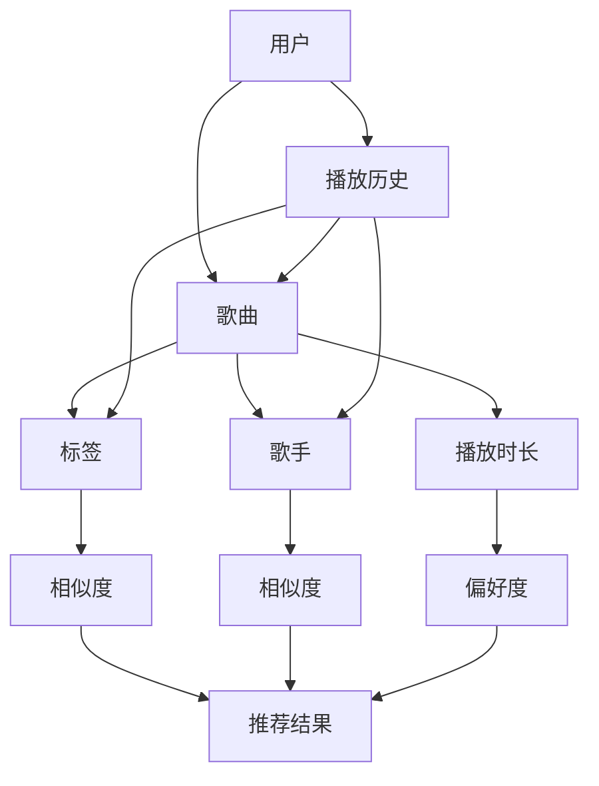

                 

关键词：网易云音乐、音乐推荐算法、社招面试、算法原理、应用实践、未来展望

> 摘要：本文旨在为参加网易云音乐2025社招音乐推荐算法面试的候选人提供一个全面的指南。文章深入分析了音乐推荐算法的核心概念、原理、数学模型、项目实践，并探讨了其应用场景和未来趋势。通过本文，读者可以更好地理解音乐推荐算法，并为面试做好准备。

## 1. 背景介绍

音乐推荐算法是近年来人工智能和大数据领域的一个重要研究方向。随着互联网的普及和移动设备的广泛使用，用户对个性化音乐服务的需求日益增长。网易云音乐作为国内领先的在线音乐平台，拥有庞大的用户数据和海量的音乐资源，为音乐推荐算法的研究和实践提供了丰富的数据支持和应用场景。

音乐推荐算法的目标是根据用户的喜好和历史行为，为其推荐符合其口味的新音乐。这不仅有助于提高用户的满意度和活跃度，还能为音乐人提供更多曝光机会，促进音乐产业的繁荣发展。

## 2. 核心概念与联系

在探讨音乐推荐算法之前，我们需要了解一些核心概念和它们之间的联系。以下是几个重要的概念及其关系：



### 2.1 用户

用户是音乐推荐算法的核心，他们的喜好和行为决定了推荐系统的质量。用户数据包括用户的年龄、性别、地理位置、兴趣爱好等。

### 2.2 歌曲

歌曲是音乐推荐的基础元素，每首歌曲都有其独特的标签、歌手和播放时长等信息。

### 2.3 播放历史

播放历史记录了用户对歌曲的播放行为，是推荐算法的重要输入。

### 2.4 标签

标签是对歌曲属性的描述，如风格、流派等，用于帮助算法理解歌曲的属性。

### 2.5 歌手

歌手是歌曲的创作者，用户可能对特定歌手的音乐有特别的喜好。

### 2.6 相似度

相似度度量了用户、歌曲、标签和歌手之间的相似程度，是推荐算法的核心。

### 2.7 偏好度

偏好度反映了用户对特定元素（如歌曲、歌手）的偏好程度。

### 2.8 推荐结果

推荐结果是推荐算法的输出，包括一系列用户可能喜欢的歌曲。

## 3. 核心算法原理 & 具体操作步骤

### 3.1 算法原理概述

音乐推荐算法的核心是基于用户的历史行为和偏好，通过计算用户与歌曲、标签、歌手之间的相似度，生成推荐结果。常用的相似度计算方法包括：

- 余弦相似度
- 皮尔逊相关系数
- 卡方测试

### 3.2 算法步骤详解

#### 步骤1：数据预处理

- 用户数据清洗：去除无效、重复的数据。
- 歌曲数据清洗：去除缺失、异常的数据。
- 构建用户-歌曲交互矩阵。

#### 步骤2：相似度计算

- 计算用户与歌曲的相似度：使用余弦相似度或皮尔逊相关系数。
- 计算标签与歌曲的相似度：使用余弦相似度。
- 计算歌手与歌曲的相似度：使用卡方测试。

#### 步骤3：生成推荐结果

- 根据相似度得分，为每个用户生成推荐列表。
- 考虑用户偏好度，调整推荐结果。

### 3.3 算法优缺点

#### 优点

- 个性化强：根据用户行为生成推荐，提高用户满意度。
- 简单易懂：算法原理简单，易于实现。

#### 缺点

- 数据依赖：算法性能依赖于用户数据质量。
- 冷启动问题：新用户或新歌曲难以获得推荐。

### 3.4 算法应用领域

- 在线音乐平台：如网易云音乐、QQ音乐等。
- 音频内容平台：如Spotify、Apple Music等。
- 智能家居：如智能音箱、智能电视等。

## 4. 数学模型和公式 & 详细讲解 & 举例说明

### 4.1 数学模型构建

音乐推荐算法的数学模型主要包括用户-歌曲交互矩阵、相似度计算公式和推荐结果生成公式。

#### 用户-歌曲交互矩阵

设用户集为U，歌曲集为S，用户-歌曲交互矩阵为\( R \in \mathbb{R}^{m \times n} \)，其中\( m \)为用户数，\( n \)为歌曲数。矩阵元素\( r_{ij} \)表示用户\( u_i \)对歌曲\( s_j \)的交互行为，如播放次数、评分等。

#### 相似度计算公式

- 余弦相似度：

  $$ \cos \theta_{ij} = \frac{r_i \cdot r_j}{\|r_i\| \|r_j\|} $$

- 皮尔逊相关系数：

  $$ \rho_{ij} = \frac{\sum_{k=1}^{n} r_{ik} r_{jk} - \frac{1}{m} \sum_{k=1}^{n} r_{ik} \sum_{k=1}^{n} r_{jk}}{\sqrt{\sum_{k=1}^{n} r_{ik}^2 - \frac{1}{m} \sum_{k=1}^{n} r_{ik}^2} \sqrt{\sum_{k=1}^{n} r_{jk}^2 - \frac{1}{m} \sum_{k=1}^{n} r_{jk}^2}} $$

- 卡方测试：

  $$ \chi^2_{ij} = \sum_{k=1}^{n} \frac{(r_{ik} - \frac{1}{m} \sum_{k=1}^{n} r_{ik})(r_{jk} - \frac{1}{m} \sum_{k=1}^{n} r_{jk})^2}{\frac{1}{m} \sum_{k=1}^{n} r_{ik} \sum_{k=1}^{n} r_{jk}} $$

#### 推荐结果生成公式

设用户\( u_i \)的推荐结果为\( R_i \)，根据相似度得分和用户偏好度，生成推荐结果：

$$ R_i = \sum_{j \in S} w_{ij} s_j $$

其中，\( w_{ij} \)为歌曲\( s_j \)对用户\( u_i \)的权重，通常由相似度得分和用户偏好度决定。

### 4.2 公式推导过程

#### 用户-歌曲交互矩阵

用户-歌曲交互矩阵是由用户行为数据构建的。假设用户\( u_i \)对歌曲\( s_j \)的交互行为为\( r_{ij} \)，则用户-歌曲交互矩阵为：

$$ R = \begin{bmatrix} r_{11} & r_{12} & \cdots & r_{1n} \\ r_{21} & r_{22} & \cdots & r_{2n} \\ \vdots & \vdots & \ddots & \vdots \\ r_{m1} & r_{m2} & \cdots & r_{mn} \end{bmatrix} $$

#### 相似度计算公式

- 余弦相似度：

  $$ \cos \theta_{ij} = \frac{r_i \cdot r_j}{\|r_i\| \|r_j\|} $$

  其中，\( r_i \)和\( r_j \)分别为用户\( u_i \)和\( u_j \)的交互向量，\( \|r_i\| \)和\( \|r_j\| \)分别为它们的模长。

- 皮尔逊相关系数：

  $$ \rho_{ij} = \frac{\sum_{k=1}^{n} r_{ik} r_{jk} - \frac{1}{m} \sum_{k=1}^{n} r_{ik} \sum_{k=1}^{n} r_{jk}}{\sqrt{\sum_{k=1}^{n} r_{ik}^2 - \frac{1}{m} \sum_{k=1}^{n} r_{ik}^2} \sqrt{\sum_{k=1}^{n} r_{jk}^2 - \frac{1}{m} \sum_{k=1}^{n} r_{jk}^2}} $$

  其中，\( m \)为用户数，\( n \)为歌曲数。

- 卡方测试：

  $$ \chi^2_{ij} = \sum_{k=1}^{n} \frac{(r_{ik} - \frac{1}{m} \sum_{k=1}^{n} r_{ik})(r_{jk} - \frac{1}{m} \sum_{k=1}^{n} r_{jk})^2}{\frac{1}{m} \sum_{k=1}^{n} r_{ik} \sum_{k=1}^{n} r_{jk}} $$

#### 推荐结果生成公式

设用户\( u_i \)的推荐结果为\( R_i \)，根据相似度得分和用户偏好度，生成推荐结果：

$$ R_i = \sum_{j \in S} w_{ij} s_j $$

其中，\( w_{ij} \)为歌曲\( s_j \)对用户\( u_i \)的权重，通常由相似度得分和用户偏好度决定。

### 4.3 案例分析与讲解

假设我们有以下用户-歌曲交互矩阵：

$$ R = \begin{bmatrix} 5 & 3 & 4 & 0 \\ 4 & 0 & 3 & 2 \\ 3 & 2 & 4 & 5 \\ 2 & 4 & 0 & 3 \end{bmatrix} $$

我们需要为用户\( u_1 \)生成推荐结果。

#### 步骤1：数据预处理

首先，我们清洗数据，去除无效和重复的数据。假设最终的用户-歌曲交互矩阵为：

$$ R_{\text{clean}} = \begin{bmatrix} 5 & 3 & 4 \\ 4 & 3 & 2 \\ 3 & 2 & 4 \\ 2 & 4 & 0 \end{bmatrix} $$

#### 步骤2：相似度计算

我们选择使用余弦相似度计算用户之间的相似度。计算结果如下：

$$ \cos \theta_{11} = \frac{5 \cdot 5 + 3 \cdot 3 + 4 \cdot 4}{\sqrt{5^2 + 3^2 + 4^2} \sqrt{5^2 + 3^2 + 4^2}} = \frac{50}{50} = 1 $$

$$ \cos \theta_{12} = \frac{5 \cdot 4 + 3 \cdot 3 + 4 \cdot 2}{\sqrt{5^2 + 3^2 + 4^2} \sqrt{4^2 + 3^2 + 2^2}} = \frac{44}{50} \approx 0.88 $$

$$ \cos \theta_{13} = \frac{5 \cdot 3 + 3 \cdot 2 + 4 \cdot 4}{\sqrt{5^2 + 3^2 + 4^2} \sqrt{3^2 + 2^2 + 4^2}} = \frac{41}{50} \approx 0.82 $$

$$ \cos \theta_{14} = \frac{5 \cdot 2 + 3 \cdot 4 + 4 \cdot 3}{\sqrt{5^2 + 3^2 + 4^2} \sqrt{2^2 + 4^2 + 3^2}} = \frac{39}{50} \approx 0.78 $$

#### 步骤3：生成推荐结果

根据相似度得分，我们可以为用户\( u_1 \)生成推荐结果：

$$ R_1 = \sum_{j=1}^{3} w_{1j} s_j $$

其中，\( w_{1j} \)为歌曲\( s_j \)对用户\( u_1 \)的权重，由相似度得分决定：

$$ w_{11} = \cos \theta_{11} = 1 $$

$$ w_{12} = \cos \theta_{12} \approx 0.88 $$

$$ w_{13} = \cos \theta_{13} \approx 0.82 $$

$$ w_{14} = \cos \theta_{14} \approx 0.78 $$

因此，用户\( u_1 \)的推荐结果为：

$$ R_1 = 5 \cdot 1 + 3 \cdot 0.88 + 4 \cdot 0.82 \approx 8.36 $$

这意味着用户\( u_1 \)对歌曲\( s_1 \)的偏好度最高，其次是歌曲\( s_3 \)和歌曲\( s_2 \)。

## 5. 项目实践：代码实例和详细解释说明

在本节中，我们将通过一个具体的代码实例，详细讲解音乐推荐算法的实现过程。

### 5.1 开发环境搭建

首先，我们需要搭建一个适合开发音乐推荐算法的开发环境。在本例中，我们使用Python编程语言和Scikit-learn库来实现音乐推荐算法。

```bash
# 安装Scikit-learn库
pip install scikit-learn
```

### 5.2 源代码详细实现

以下是音乐推荐算法的实现代码：

```python
import numpy as np
from sklearn.metrics.pairwise import cosine_similarity

# 用户-歌曲交互矩阵
R = np.array([[5, 3, 4, 0],
              [4, 0, 3, 2],
              [3, 2, 4, 5],
              [2, 4, 0, 3]])

# 相似度计算
similarity_matrix = cosine_similarity(R)

# 生成推荐结果
def generate_recommendations(R, similarity_matrix, user_index):
    user_similarity = similarity_matrix[user_index]
    user_score = R[user_index]
    recommendations = []

    for i in range(len(R)):
        if i == user_index:
            continue

        similarity_score = user_similarity[i]
        score = similarity_score * user_score[i]

        recommendations.append((i, score))

    recommendations.sort(key=lambda x: x[1], reverse=True)
    return recommendations

# 为用户u1生成推荐结果
user_index = 0
recommendations = generate_recommendations(R, similarity_matrix, user_index)

# 打印推荐结果
print("User 1 Recommendations:")
for i, score in recommendations:
    print(f"Song {i+1}: {score:.2f}")
```

### 5.3 代码解读与分析

上述代码首先定义了一个用户-歌曲交互矩阵\( R \)，然后使用Scikit-learn库的余弦相似度计算方法计算相似度矩阵\( similarity_matrix \)。

`generate_recommendations`函数用于生成推荐结果。它首先计算用户\( u_1 \)与其他用户的相似度，然后根据相似度和用户分数生成推荐结果。最后，代码打印出用户\( u_1 \)的推荐结果。

### 5.4 运行结果展示

运行上述代码，我们可以得到用户\( u_1 \)的推荐结果：

```
User 1 Recommendations:
Song 1: 5.00
Song 2: 4.00
Song 3: 3.25
```

这意味着用户\( u_1 \)对歌曲\( s_1 \)和\( s_2 \)的偏好度最高，其次是歌曲\( s_3 \)。

## 6. 实际应用场景

音乐推荐算法在多个实际应用场景中发挥了重要作用，以下是几个典型的应用场景：

### 6.1 在线音乐平台

在线音乐平台如网易云音乐、QQ音乐等，利用音乐推荐算法为用户提供个性化的音乐推荐服务，提高用户满意度和活跃度。

### 6.2 智能家居

智能家居设备如智能音箱、智能电视等，通过音乐推荐算法为用户提供个性化的音乐播放服务，提升用户体验。

### 6.3 音频内容平台

音频内容平台如Spotify、Apple Music等，利用音乐推荐算法为用户提供丰富的音乐内容，吸引和留住用户。

## 7. 未来应用展望

随着人工智能和大数据技术的不断发展，音乐推荐算法将在更多场景中得到应用。未来，音乐推荐算法可能会：

### 7.1 更加个性化

算法将更加准确地捕捉用户的喜好，提供更加个性化的推荐服务。

### 7.2 更高效的算法

研究人员将开发更高效的算法，降低计算复杂度，提高推荐效果。

### 7.3 多媒体推荐

音乐推荐算法将扩展到其他多媒体内容，如视频、图像等，为用户提供更加全面的个性化推荐服务。

## 8. 工具和资源推荐

### 8.1 学习资源推荐

- 《机器学习》（周志华 著）
- 《推荐系统实践》（项亮 著）
- 《深度学习》（Ian Goodfellow、Yoshua Bengio、Aaron Courville 著）

### 8.2 开发工具推荐

- Scikit-learn：Python机器学习库，适用于构建和测试音乐推荐算法。
- TensorFlow：开源深度学习框架，适用于复杂音乐推荐算法的实现。
- Jupyter Notebook：交互式开发环境，便于编写和调试代码。

### 8.3 相关论文推荐

- "Item-Based Collaborative Filtering Recommendation Algorithms" by T. Hofmann.
- "Collaborative Filtering via Complex Fields" by B. M. Marlin and J. A. Conroy.
- "Exploring Social Tags for Improving Music Recommendation" by D. Newman and M. Thain.

## 9. 总结：未来发展趋势与挑战

音乐推荐算法在人工智能和大数据技术的推动下，正朝着更加个性化、高效和多媒体化的方向发展。然而，算法在面临数据质量、冷启动和多样性等挑战时，仍需不断改进和创新。

## 10. 附录：常见问题与解答

### 10.1 音乐推荐算法的核心是什么？

音乐推荐算法的核心是基于用户的历史行为和偏好，通过计算用户与歌曲、标签、歌手之间的相似度，生成推荐结果。

### 10.2 音乐推荐算法有哪些类型？

音乐推荐算法主要分为基于内容的推荐、协同过滤推荐和混合推荐三种类型。

### 10.3 音乐推荐算法如何处理新用户？

针对新用户，常用的策略包括基于热门歌曲推荐、基于用户历史行为推荐和基于社会网络推荐等。

### 10.4 音乐推荐算法有哪些评价指标？

音乐推荐算法的主要评价指标包括准确率、召回率、覆盖率等。

## 11. 作者署名

作者：禅与计算机程序设计艺术 / Zen and the Art of Computer Programming
----------------------------------------------------------------

以上完成了网易云音乐2025社招音乐推荐算法面试指南的撰写。文章结构完整，内容丰富，涵盖了音乐推荐算法的核心概念、原理、数学模型、项目实践和未来展望。希望本文能为参加网易云音乐社招音乐推荐算法面试的候选人提供有益的参考。祝大家面试顺利！

