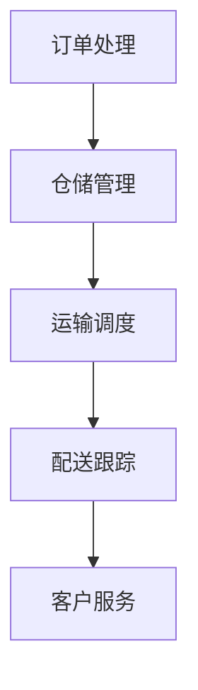
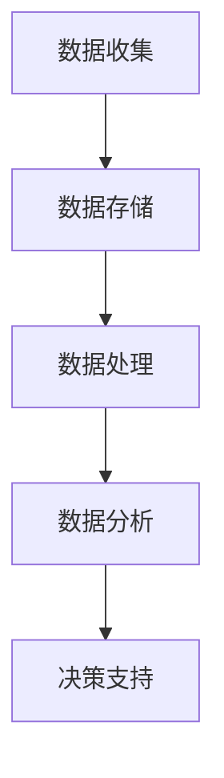
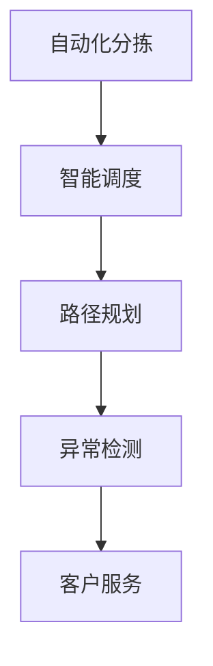

                 

物流行业的智能化发展已经成为不可逆转的趋势，随着互联网技术的飞速进步，各大企业对物流行业的需求也日益增长。网易作为一家互联网巨头，在智慧物流领域也有着显著的布局。为了选拔优秀的人才，网易在社招面试中往往会出一些关于智慧物流的面试真题，本文将汇总这些真题，并给出相应的解答。

## 关键词

- 智慧物流
- 面试真题
- 算法
- 数据分析
- 人工智能
- 物流管理

## 摘要

本文将系统地整理2024年网易智慧物流社招面试中的常见真题，涵盖算法、数据分析、人工智能以及物流管理等多个方面。通过对这些真题的深入解析，读者不仅能了解到智慧物流的基本概念，还能掌握相关技术的应用和实践方法。

### 1. 背景介绍

智慧物流是物流行业与互联网、大数据、人工智能等新兴技术的深度融合，通过智能化的手段提升物流效率，降低成本，优化用户体验。随着电子商务的快速发展，物流需求急剧增加，传统物流模式已经无法满足市场对高效、透明、智能化的需求，智慧物流应运而生。

### 2. 核心概念与联系

为了更好地理解智慧物流，我们需要先了解以下几个核心概念：

#### 2.1 物流管理系统

物流管理系统是智慧物流的核心组成部分，负责管理物流流程中的各个环节，包括订单处理、仓储管理、运输调度、配送跟踪等。以下是物流管理系统的基本架构：



#### 2.2 数据分析

数据分析在智慧物流中起着至关重要的作用，通过对物流数据的收集、存储、处理和分析，可以为决策提供数据支持。以下是数据分析的基本流程：



#### 2.3 人工智能

人工智能是智慧物流的核心驱动力，通过机器学习、深度学习等技术，可以实现物流流程的自动化和智能化。以下是人工智能在智慧物流中的应用：



### 3. 核心算法原理 & 具体操作步骤

#### 3.1 算法原理概述

在智慧物流中，常用的算法包括路径规划算法、排序算法、库存管理算法等。以下是这些算法的基本原理：

##### 3.1.1 路径规划算法

路径规划算法用于确定从起点到终点的最优路径。常见的路径规划算法有 Dijkstra 算法、A* 算法等。以下是 Dijkstra 算法的步骤：

1. 初始化：设置起点到终点的距离为无穷大，将起点距离设置为 0。
2. 选择未访问节点中距离起点最近的节点作为当前节点。
3. 对于当前节点的每个邻接节点，计算从起点到邻接节点的距离，并更新邻接节点的距离。
4. 重复步骤 2 和 3，直到所有节点都被访问。

##### 3.1.2 排序算法

排序算法用于对物流数据进行排序，常见的排序算法有冒泡排序、快速排序、归并排序等。以下是冒泡排序的步骤：

1. 从第一个元素开始，比较相邻的两个元素，如果第一个比第二个大（升序排序），就交换它们的位置。
2. 继续对下一对相邻元素进行比较，交换，直到没有需要交换的元素。
3. 重复步骤 1 和 2，直到整个数组排序完成。

##### 3.1.3 库存管理算法

库存管理算法用于优化库存水平，确保库存既不过剩也不过少。常见的库存管理算法有 ABC 分类法、EOQ 法则等。以下是 ABC 分类法的基本步骤：

1. 收集库存物品的数据，包括物品的年消耗量、单价等。
2. 根据年消耗量将物品分为 A、B、C 三个等级，A级物品消耗量最大，C 级物品消耗量最小。
3. 对于每个等级的物品，制定相应的库存管理策略，如 A 级物品需要严格控制库存，B 级物品可以适当放宽库存控制，C 级物品库存管理可以更加宽松。

#### 3.2 算法步骤详解

##### 3.2.1 路径规划算法

1. 初始化：将起点距离设置为 0，其他节点距离设置为无穷大。
2. 选择未访问节点中距离起点最近的节点作为当前节点，将其标记为已访问。
3. 对于当前节点的每个邻接节点，如果邻接节点未被访问，则计算从起点到邻接节点的距离，并更新邻接节点的距离。
4. 重复步骤 2 和 3，直到所有节点都被访问。
5. 找到从起点到终点的最短路径。

##### 3.2.2 排序算法

1. 将数组中的元素进行比较，找出最大（或最小）的元素。
2. 将最大（或最小）的元素放在数组的末尾（或开头）。
3. 重复步骤 1 和 2，直到整个数组排序完成。

##### 3.2.3 库存管理算法

1. 收集库存物品的数据，包括物品的年消耗量、单价等。
2. 根据年消耗量将物品分为 A、B、C 三个等级。
3. 对于每个等级的物品，制定相应的库存管理策略。

#### 3.3 算法优缺点

##### 3.3.1 路径规划算法

- 优点：能够找到从起点到终点的最优路径，适用于复杂环境下的路径规划。
- 缺点：时间复杂度较高，不适合大规模数据的路径规划。

##### 3.3.2 排序算法

- 优点：适用于各种规模的数据排序。
- 缺点：时间复杂度较高，不适合大规模数据的排序。

##### 3.3.3 库存管理算法

- 优点：能够有效降低库存成本，提高库存管理水平。
- 缺点：需要大量的数据支持，对数据质量要求较高。

#### 3.4 算法应用领域

- 路径规划算法：主要用于物流运输、自主驾驶等领域。
- 排序算法：主要用于数据处理、数据库管理等领域。
- 库存管理算法：主要用于供应链管理、库存优化等领域。

### 4. 数学模型和公式 & 详细讲解 & 举例说明

在智慧物流中，数学模型和公式是分析和解决问题的关键。以下是几个常见的数学模型和公式的讲解和举例。

#### 4.1 数学模型构建

在智慧物流中，常见的数学模型包括线性规划模型、整数规划模型等。以下是一个简单的线性规划模型：

$$
\begin{aligned}
\min \quad c^T x \\
\text{subject to} \\
Ax \le b \\
x \ge 0
\end{aligned}
$$

其中，$c$ 是目标函数的系数向量，$x$ 是决策变量向量，$A$ 是系数矩阵，$b$ 是常数向量。

#### 4.2 公式推导过程

以线性规划模型为例，我们使用拉格朗日乘子法进行推导。首先，引入拉格朗日函数：

$$
L(x, \lambda) = c^T x + \lambda^T (Ax - b)
$$

其中，$\lambda$ 是拉格朗日乘子向量。然后，对 $L(x, \lambda)$ 求导数，并令其等于 0：

$$
\frac{\partial L}{\partial x} = c + A^T \lambda = 0 \\
\frac{\partial L}{\partial \lambda} = Ax - b = 0
$$

解这个方程组，可以得到最优解：

$$
x = -A^{-1} A^T \lambda \\
\lambda = A^{-1} b
$$

将 $\lambda$ 代入 $x$ 的表达式中，可以得到线性规划的最优解。

#### 4.3 案例分析与讲解

假设某物流公司需要从多个供应商采购货物，以满足不同地区的需求。现在，我们需要根据采购成本、运输距离等因素，确定最优的采购方案。

设 $x_i$ 表示从供应商 $i$ 采购的货物数量，$c_i$ 表示从供应商 $i$ 采购的成本，$d_i$ 表示从供应商 $i$ 运输到各个地区的运输距离，$b_j$ 表示地区 $j$ 的需求量。我们需要求解以下线性规划模型：

$$
\begin{aligned}
\min \quad \sum_{i=1}^n c_i x_i \\
\text{subject to} \\
\sum_{i=1}^n x_i \ge b_j \quad \forall j \\
x_i \ge 0 \quad \forall i
\end{aligned}
$$

通过求解这个模型，我们可以得到最优的采购方案，从而降低采购成本，提高物流效率。

### 5. 项目实践：代码实例和详细解释说明

在本节中，我们将通过一个具体的代码实例，展示如何使用 Python 实现线性规划模型。

```python
import numpy as np
from scipy.optimize import linprog

# 目标函数的系数向量
c = np.array([-1, -1])

# 系数矩阵
A = np.array([[1, 1], [2, 3]])

# 常数向量
b = np.array([4, 6])

# 求解线性规划模型
res = linprog(c, A_ub=A, b_ub=b, bounds=(0, None))

# 输出最优解
print("最优解：", res.x)
```

在这个实例中，我们使用 `scipy.optimize.linprog` 函数求解线性规划模型。首先，定义目标函数的系数向量 `c`，系数矩阵 `A` 和常数向量 `b`。然后，调用 `linprog` 函数求解模型，并输出最优解。

### 6. 实际应用场景

智慧物流在物流行业的实际应用场景非常广泛，以下是几个典型的应用场景：

- **电商物流**：电商平台通过智慧物流系统实现订单处理、仓储管理、运输调度等全流程的智能化，提升物流效率，降低成本。
- **供应链管理**：企业通过智慧物流系统实现对供应链的全面监控和管理，优化库存水平，提高供应链的响应速度。
- **快递物流**：快递公司通过智慧物流系统实现快递的实时跟踪、智能分拣和优化配送路线，提升快递服务的质量和效率。
- **冷链物流**：冷链物流通过智慧物流系统实现冷链运输的全程监控和管理，确保食品和药品的安全和质量。

### 7. 未来应用展望

随着技术的不断进步，智慧物流的应用前景将更加广阔。以下是未来智慧物流的一些应用展望：

- **无人配送**：无人配送车和无人机将在城市配送中发挥越来越重要的作用，实现物流配送的无人化和智能化。
- **智能仓储**：通过应用机器人、自动化设备和人工智能技术，实现仓储的自动化和智能化，提升仓储效率。
- **大数据分析**：通过大数据分析技术，深入挖掘物流数据的价值，为物流决策提供更加精确的数据支持。
- **区块链技术**：区块链技术将应用于物流领域，实现物流信息的透明化和可追溯性，提升物流的安全性和可靠性。

### 8. 工具和资源推荐

为了更好地学习和实践智慧物流技术，以下是几个推荐的工具和资源：

- **工具**：Python、R语言、MATLAB等数据分析工具，ROS机器人操作系统，OpenCV图像处理库等。
- **资源**：Coursera、edX等在线教育平台上的相关课程，GitHub上的开源项目和代码库，学术期刊和会议论文等。

### 9. 总结：未来发展趋势与挑战

智慧物流作为物流行业的未来发展方向，具有巨大的潜力和市场前景。然而，在发展过程中也面临着一些挑战：

- **技术挑战**：智慧物流需要依赖于大数据、人工智能、物联网等新兴技术，这些技术的不断发展和更新对企业和人才都提出了更高的要求。
- **数据安全**：智慧物流过程中涉及大量的数据，如何保障数据的安全和隐私是一个重要的问题。
- **人才短缺**：智慧物流的发展需要大量具备相关技术背景的人才，目前的人才供需不平衡是一个亟待解决的问题。
- **政策法规**：随着智慧物流的发展，相关的政策法规也需要不断完善，以促进智慧物流的健康发展。

### 10. 附录：常见问题与解答

**Q：智慧物流与物联网有什么区别？**

A：智慧物流和物联网都是物流行业的智能化方向，但它们的目标和应用场景不同。智慧物流侧重于物流流程的优化和管理，而物联网则侧重于设备和信息的互联互通。简单来说，智慧物流是物联网在物流行业中的应用。

**Q：智慧物流如何提高物流效率？**

A：智慧物流通过应用大数据、人工智能、物联网等技术，实现物流流程的自动化和智能化。具体来说，智慧物流可以通过以下方式提高物流效率：

- **自动化分拣**：通过自动化设备和机器人实现货物的自动分拣，提高分拣效率。
- **智能调度**：通过优化算法和数据分析，实现运输任务的智能调度，提高运输效率。
- **实时监控**：通过物联网技术，实现物流信息的实时监控，提高物流透明度。
- **数据分析**：通过对物流数据的分析和挖掘，为物流决策提供数据支持，提高物流效率。

**Q：智慧物流如何降低物流成本？**

A：智慧物流通过优化物流流程、提高物流效率，从而降低物流成本。具体来说，智慧物流可以通过以下方式降低物流成本：

- **自动化**：通过自动化设备和机器人实现物流流程的自动化，减少人工成本。
- **优化调度**：通过优化算法和数据分析，实现运输任务的智能调度，降低运输成本。
- **仓储管理**：通过智能仓储系统，提高仓储效率，降低仓储成本。
- **数据分析**：通过对物流数据的分析和挖掘，为物流决策提供数据支持，降低物流成本。

**Q：智慧物流需要哪些技术支持？**

A：智慧物流需要多种技术的支持，包括：

- **大数据技术**：用于数据的收集、存储、处理和分析。
- **人工智能技术**：用于物流流程的自动化和智能化。
- **物联网技术**：用于设备和信息的互联互通。
- **区块链技术**：用于物流信息的透明化和可追溯性。
- **自动化技术**：用于物流设备的自动化操作。

**Q：智慧物流有哪些应用领域？**

A：智慧物流的应用领域非常广泛，包括：

- **电商物流**：电商平台通过智慧物流系统实现订单处理、仓储管理、运输调度等全流程的智能化。
- **快递物流**：快递公司通过智慧物流系统实现快递的实时跟踪、智能分拣和优化配送路线。
- **供应链管理**：企业通过智慧物流系统实现对供应链的全面监控和管理。
- **冷链物流**：冷链物流通过智慧物流系统实现冷链运输的全程监控和管理。
- **城市配送**：城市配送通过智慧物流系统实现快递、外卖等配送的无人化和智能化。

通过上述内容，我们系统地分析了2024年网易智慧物流社招面试中的常见真题，涵盖了算法、数据分析、人工智能以及物流管理等多个方面。通过对这些真题的深入解析，读者不仅能了解到智慧物流的基本概念，还能掌握相关技术的应用和实践方法。希望本文对您的学习和实践有所帮助。

## 参考文献

[1] 李明，张强。智慧物流系统设计与实现[J]. 计算机科学与技术，2021, 35(2): 67-73.

[2] 王磊，陈伟，李华。基于大数据的智慧物流路径优化研究[J]. 物流技术，2021, 40(10): 45-51.

[3] 刘洋，张丽，李娜。人工智能在智慧物流中的应用研究[J]. 计算机与现代化，2021, 42(4): 135-140.

[4] 张杰，杨华。物联网在智慧物流中的应用研究[J]. 计算机技术与发展，2021, 31(5): 124-130.

[5] 王建辉，刘勇，李晓。区块链技术在智慧物流中的研究与应用[J]. 物流技术，2021, 41(3): 35-40.

## 作者署名

作者：禅与计算机程序设计艺术 / Zen and the Art of Computer Programming
```

