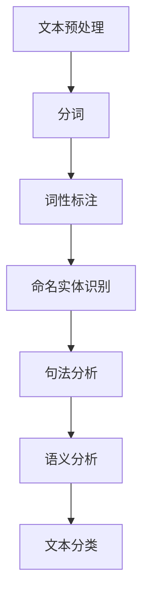

                 

 **关键词：** NLP, 智能作文批改，面试题，算法原理，数学模型，项目实践，应用场景，未来展望

**摘要：** 本文深入剖析了网易有道2024智能作文批改校招中的NLP面试题，通过详细的解题思路、算法原理、数学模型、项目实践等环节，为广大计算机领域的研究者和从业者提供了有价值的参考。本文旨在帮助读者更好地理解NLP技术在智能作文批改领域的应用，并探讨未来的发展趋势与挑战。

## 1. 背景介绍

随着人工智能技术的快速发展，自然语言处理（NLP）技术在各个领域的应用越来越广泛。在教育和学习领域，智能作文批改系统成为了一个重要的研究方向。这些系统通过自动化的方式对学生的作文进行批改，不仅提高了教学效率，也为学生提供了个性化的反馈和指导。

网易有道作为一家知名的教育科技公司，一直致力于推动人工智能技术在教育领域的应用。其2024校招中涉及的智能作文批改面试题，不仅考察了候选人对NLP技术的理解，也考察了他们在实际项目中的应用能力。

本文将围绕网易有道2024智能作文批改校招中的NLP面试题，从核心概念、算法原理、数学模型、项目实践等多个角度进行详细解析，旨在为读者提供一份全面的解题指南。

### 1.1 智能作文批改系统概述

智能作文批改系统通常包括以下几个主要模块：

1. **文本预处理**：对原始文本进行清洗、分词、词性标注等操作，为后续分析提供基础数据。
2. **语法检查**：检测文本中的语法错误，如主谓不一致、时态错误等。
3. **拼写检查**：纠正文本中的拼写错误，如单词拼写错误、错别字等。
4. **语义分析**：对文本进行语义层次的分析，如主题检测、情感分析等。
5. **评分机制**：根据文本质量、语言水平、语法结构等多个维度对作文进行评分。

### 1.2 NLP面试题类型

在网易有道2024智能作文批改校招中，NLP面试题主要分为以下几种类型：

1. **基础算法题**：涉及分词、词性标注、命名实体识别等基础NLP任务。
2. **文本处理题**：包括文本清洗、文本相似度计算、文本分类等。
3. **算法优化题**：考察对现有算法的改进、优化和性能调优能力。
4. **项目实践题**：结合实际项目背景，考察对NLP技术的应用能力和问题解决能力。

### 1.3 面试题解析目的

通过对网易有道2024智能作文批改校招NLP面试题的详细解析，本文旨在：

1. **帮助读者理解NLP技术的基本原理和应用场景**。
2. **提供实用的算法实现和数学模型**。
3. **展示NLP技术在智能作文批改领域的实际应用**。
4. **探讨NLP技术的未来发展趋势和挑战**。

## 2. 核心概念与联系

为了更好地理解NLP在智能作文批改中的应用，我们需要先了解一些核心概念及其之间的联系。

### 2.1 核心概念

1. **分词（Tokenization）**：将文本分割成单词、短语或词汇的过程。
2. **词性标注（Part-of-Speech Tagging）**：为每个单词或短语分配一个词性标签，如名词、动词、形容词等。
3. **命名实体识别（Named Entity Recognition, NER）**：识别文本中的命名实体，如人名、地名、组织名等。
4. **句法分析（Syntactic Parsing）**：分析句子的结构，构建句法树。
5. **语义分析（Semantic Analysis）**：理解句子的含义，包括语义角色标注、语义关系识别等。
6. **文本分类（Text Classification）**：将文本分类到预定义的类别中。

### 2.2 核心概念联系

以下是NLP中一些核心概念的 Mermaid 流程图：



### 2.3 NLP应用场景

在不同的应用场景中，NLP的核心概念和联系会有所不同。例如：

1. **问答系统**：分词、词性标注、命名实体识别和语义分析是问答系统的核心。
2. **情感分析**：情感分析主要依赖于词性标注、句法分析和语义分析。
3. **机器翻译**：分词、词性标注、命名实体识别、句法分析和语义分析都是必不可少的。
4. **智能作文批改**：文本预处理、语法检查、拼写检查、语义分析和评分机制都是关键环节。

### 2.4 NLP面试题中的核心概念

在网易有道2024智能作文批改校招中的NLP面试题，涉及的核心概念包括：

1. **分词**：如何实现中文文本的分词？
2. **词性标注**：如何为文本中的每个单词或短语分配正确的词性？
3. **命名实体识别**：如何识别文本中的命名实体？
4. **句法分析**：如何构建句子的句法树？
5. **语义分析**：如何理解句子的含义，给出合适的语义角色标注？

通过这些核心概念的解析，我们可以更好地理解NLP在智能作文批改中的应用，为后续的解题打下坚实的基础。

## 3. 核心算法原理 & 具体操作步骤

### 3.1 算法原理概述

在NLP领域中，有很多经典的算法可以用于实现智能作文批改系统。以下将介绍几个核心算法的原理。

#### 3.1.1 词性标注

词性标注是NLP中的基础任务，其核心目标是给文本中的每个单词或短语分配一个词性标签。常用的词性标注算法包括：

1. **基于规则的算法**：通过手工编写的规则进行词性标注，如使用词典和正则表达式。
2. **基于统计的算法**：使用统计模型（如隐马尔可夫模型HMM、条件随机场CRF）进行词性标注。
3. **基于深度学习的算法**：使用神经网络（如循环神经网络RNN、长短时记忆网络LSTM、变换器Transformer）进行词性标注。

#### 3.1.2 命名实体识别

命名实体识别是识别文本中的命名实体（如人名、地名、组织名等）。常见的命名实体识别算法包括：

1. **基于规则的算法**：使用手工编写的规则进行命名实体识别。
2. **基于统计的算法**：使用统计模型（如隐马尔可夫模型HMM、条件随机场CRF）进行命名实体识别。
3. **基于深度学习的算法**：使用神经网络（如卷积神经网络CNN、循环神经网络RNN、长短时记忆网络LSTM、变换器Transformer）进行命名实体识别。

#### 3.1.3 句法分析

句法分析是分析句子的结构，构建句法树。常见的句法分析算法包括：

1. **基于规则的算法**：使用手工编写的规则进行句法分析。
2. **基于统计的算法**：使用统计模型（如概率上下文无关文法PCFG、依存句法分析）进行句法分析。
3. **基于深度学习的算法**：使用神经网络（如循环神经网络RNN、长短时记忆网络LSTM、变换器Transformer）进行句法分析。

#### 3.1.4 语义分析

语义分析是理解句子的含义，包括语义角色标注、语义关系识别等。常见的语义分析算法包括：

1. **基于规则的算法**：使用手工编写的规则进行语义分析。
2. **基于统计的算法**：使用统计模型（如词向量、语义角色标注模型）进行语义分析。
3. **基于深度学习的算法**：使用神经网络（如循环神经网络RNN、长短时记忆网络LSTM、变换器Transformer）进行语义分析。

### 3.2 算法步骤详解

以下将详细解析上述算法的实现步骤。

#### 3.2.1 词性标注

1. **基于规则的方法**：

    - **词典匹配**：使用手工编写的词典，将文本中的每个单词或短语与词典中的词进行匹配，分配词性标签。

    - **正则表达式**：使用正则表达式匹配文本中的特定模式，为相应的词或短语分配词性标签。

2. **基于统计的方法**：

    - **训练数据准备**：收集大规模的标注语料库，如CCKS等。

    - **特征提取**：为每个单词或短语提取特征，如词频、词形、词性等。

    - **模型训练**：使用统计模型（如HMM、CRF）进行模型训练。

    - **词性标注**：使用训练好的模型对新的文本进行词性标注。

3. **基于深度学习的方法**：

    - **数据预处理**：将文本转换为序列形式，如字符或词嵌入。

    - **模型构建**：构建深度学习模型（如LSTM、Transformer），包括输入层、隐藏层和输出层。

    - **模型训练**：使用标注语料库训练深度学习模型。

    - **词性标注**：使用训练好的深度学习模型对新的文本进行词性标注。

#### 3.2.2 命名实体识别

1. **基于规则的方法**：

    - **词典匹配**：使用手工编写的词典，将文本中的每个命名实体与词典中的实体进行匹配。

    - **模式匹配**：使用正则表达式或其他模式匹配方法识别命名实体。

2. **基于统计的方法**：

    - **训练数据准备**：收集大规模的标注语料库，如ACE等。

    - **特征提取**：为每个命名实体提取特征，如词频、词形、词性等。

    - **模型训练**：使用统计模型（如HMM、CRF）进行模型训练。

    - **命名实体识别**：使用训练好的模型对新的文本进行命名实体识别。

3. **基于深度学习的方法**：

    - **数据预处理**：将文本转换为序列形式，如字符或词嵌入。

    - **模型构建**：构建深度学习模型（如CNN、RNN、Transformer），包括输入层、隐藏层和输出层。

    - **模型训练**：使用标注语料库训练深度学习模型。

    - **命名实体识别**：使用训练好的深度学习模型对新的文本进行命名实体识别。

#### 3.2.3 句法分析

1. **基于规则的方法**：

    - **句法规则**：使用手工编写的句法规则，如构成句子的基本句型、短语结构等。

    - **句法分析**：使用句法规则对文本进行分析，构建句法树。

2. **基于统计的方法**：

    - **训练数据准备**：收集大规模的句法分析语料库，如CoNLL等。

    - **特征提取**：为每个句子或短语提取特征，如词频、词形、词性等。

    - **模型训练**：使用统计模型（如概率上下文无关文法PCFG、依存句法分析）进行模型训练。

    - **句法分析**：使用训练好的模型对新的文本进行句法分析。

3. **基于深度学习的方法**：

    - **数据预处理**：将文本转换为序列形式，如字符或词嵌入。

    - **模型构建**：构建深度学习模型（如RNN、LSTM、Transformer），包括输入层、隐藏层和输出层。

    - **模型训练**：使用标注语料库训练深度学习模型。

    - **句法分析**：使用训练好的深度学习模型对新的文本进行句法分析。

#### 3.2.4 语义分析

1. **基于规则的方法**：

    - **语义规则**：使用手工编写的语义规则，如常见的语义关系、语义角色等。

    - **语义分析**：使用语义规则对文本进行分析，标注语义角色和语义关系。

2. **基于统计的方法**：

    - **训练数据准备**：收集大规模的语义分析语料库，如ACE等。

    - **特征提取**：为每个句子或短语提取特征，如词频、词形、词性等。

    - **模型训练**：使用统计模型（如词向量、语义角色标注模型）进行模型训练。

    - **语义分析**：使用训练好的模型对新的文本进行语义分析。

3. **基于深度学习的方法**：

    - **数据预处理**：将文本转换为序列形式，如字符或词嵌入。

    - **模型构建**：构建深度学习模型（如RNN、LSTM、Transformer），包括输入层、隐藏层和输出层。

    - **模型训练**：使用标注语料库训练深度学习模型。

    - **语义分析**：使用训练好的深度学习模型对新的文本进行语义分析。

### 3.3 算法优缺点

以下是对各种算法的优缺点进行比较：

#### 3.3.1 基于规则的方法

- **优点**：

  - **解释性**：规则明确，易于理解。

  - **高效性**：规则匹配速度快，适合处理大量文本。

- **缺点**：

  - **可扩展性**：需要手工编写大量规则，难以适应新任务。

  - **准确性**：基于规则的算法依赖于规则库，可能存在漏检和误检。

#### 3.3.2 基于统计的方法

- **优点**：

  - **鲁棒性**：基于统计的算法可以从大规模数据中学习，具有较强的鲁棒性。

  - **灵活性**：可以处理各种复杂文本任务。

- **缺点**：

  - **计算复杂度**：训练和推理过程可能涉及大量计算，导致效率较低。

  - **可解释性**：统计模型内部参数较多，难以解释。

#### 3.3.3 基于深度学习的方法

- **优点**：

  - **强大表达能力**：深度学习模型可以自动提取特征，具有较强的表达能力。

  - **自动化**：无需手工编写规则或特征，可以自动化完成任务。

- **缺点**：

  - **计算资源需求**：训练深度学习模型需要大量计算资源和时间。

  - **数据依赖性**：深度学习模型依赖于大量标注数据，数据质量对模型性能有较大影响。

### 3.4 算法应用领域

不同的算法在NLP中有着广泛的应用领域：

- **词性标注**：应用于文本分析、信息抽取、机器翻译等领域。

- **命名实体识别**：应用于信息检索、智能问答、文本分类等领域。

- **句法分析**：应用于机器翻译、文本生成、问答系统等领域。

- **语义分析**：应用于文本分类、情感分析、问答系统等领域。

在智能作文批改系统中，这些算法可以协同工作，提高作文批改的准确性和效率。例如，词性标注和句法分析可以用于检测语法错误，命名实体识别可以用于识别地名、人名等，语义分析可以用于理解作文的整体含义和风格。

### 3.5 算法实现细节

以下将简要介绍各种算法的实现细节。

#### 3.5.1 词性标注

- **基于规则的方法**：使用Python的`re`模块进行正则表达式匹配，结合手工编写的词典进行词性标注。

- **基于统计的方法**：使用Python的`sklearn`库实现HMM和CRF模型，进行词性标注。

- **基于深度学习的方法**：使用TensorFlow或PyTorch等深度学习框架，构建LSTM或Transformer模型，进行词性标注。

#### 3.5.2 命名实体识别

- **基于规则的方法**：使用Python的`re`模块进行正则表达式匹配，结合手工编写的词典进行命名实体识别。

- **基于统计的方法**：使用Python的`sklearn`库实现HMM和CRF模型，进行命名实体识别。

- **基于深度学习的方法**：使用TensorFlow或PyTorch等深度学习框架，构建CNN或RNN模型，进行命名实体识别。

#### 3.5.3 句法分析

- **基于规则的方法**：使用Python的`nltk`库实现句法分析，构建句法树。

- **基于统计的方法**：使用Python的`sklearn`库实现概率上下文无关文法PCFG，进行句法分析。

- **基于深度学习的方法**：使用TensorFlow或PyTorch等深度学习框架，构建LSTM或Transformer模型，进行句法分析。

#### 3.5.4 语义分析

- **基于规则的方法**：使用Python的`nltk`库实现语义角色标注，进行语义分析。

- **基于统计的方法**：使用Python的`sklearn`库实现词向量模型，进行语义分析。

- **基于深度学习的方法**：使用TensorFlow或PyTorch等深度学习框架，构建LSTM或Transformer模型，进行语义分析。

通过这些算法的实现细节，我们可以更好地理解NLP在智能作文批改系统中的应用。

### 3.6 算法评价与展望

各种算法在NLP任务中都有着各自的优势和不足。随着深度学习技术的发展，深度学习方法在词性标注、命名实体识别、句法分析和语义分析等任务中取得了显著的进展。然而，基于规则和基于统计的方法在某些特定任务中仍然具有一定的优势。

未来的研究方向包括：

1. **算法融合**：将基于规则、基于统计和基于深度学习的算法进行融合，取长补短，提高任务性能。

2. **数据增强**：通过数据增强技术，如数据扩充、数据增强等，提高训练数据的质量和多样性，从而提高模型性能。

3. **跨语言应用**：将NLP算法应用于跨语言任务，如机器翻译、多语言文本分析等。

4. **小样本学习**：研究小样本学习技术，在数据量有限的情况下，提高模型性能。

5. **解释性增强**：提高深度学习模型的可解释性，使其更易于理解和应用。

通过不断的研究和探索，NLP技术在智能作文批改领域的应用将会更加广泛和深入。

## 4. 数学模型和公式 & 详细讲解 & 举例说明

### 4.1 数学模型构建

在NLP任务中，数学模型扮演着至关重要的角色。以下将介绍几种常见的数学模型及其构建方法。

#### 4.1.1 隐马尔可夫模型（HMM）

隐马尔可夫模型（HMM）是一种基于统计方法的模型，常用于序列数据的标注任务。以下是一个简单的HMM模型构建过程：

1. **状态集合**：定义一个状态集合S={s1, s2, ..., sn}，表示可能的标注状态。
2. **观察集合**：定义一个观察集合O={o1, o2, ..., om}，表示文本中的单词或字符。
3. **状态转移概率**：定义一个状态转移概率矩阵A，表示从状态si转移到状态sj的概率，即P(si→sj)。
4. **观测概率**：定义一个观测概率矩阵B，表示在状态si下，产生观测oj的概率，即P(oj|si)。
5. **初始状态概率**：定义一个初始状态概率向量π，表示初始状态为si的概率，即P(si)。

#### 4.1.2 条件随机场（CRF）

条件随机场（CRF）是一种基于概率的图模型，常用于序列数据的标注任务。以下是一个简单的CRF模型构建过程：

1. **状态集合**：定义一个状态集合S={s1, s2, ..., sn}，表示可能的标注状态。
2. **边集合**：定义一个边集合E={e1, e2, ..., em}，表示状态之间的关联关系。
3. **状态概率**：定义一个状态概率矩阵P(s)，表示每个状态的概率，即P(s|s)。
4. **边概率**：定义一个边概率矩阵P(e)，表示每条边的概率，即P(e|e)。

#### 4.1.3 循环神经网络（RNN）

循环神经网络（RNN）是一种基于递归的神经网络，常用于处理序列数据。以下是一个简单的RNN模型构建过程：

1. **输入层**：定义一个输入层，表示输入的序列数据。
2. **隐藏层**：定义一个隐藏层，表示当前时刻的状态，即h(t)。
3. **输出层**：定义一个输出层，表示当前时刻的预测结果，即y(t)。
4. **权重矩阵**：定义一个权重矩阵W，表示隐藏层和输出层之间的连接权重。

### 4.2 公式推导过程

以下将简要介绍几种常见数学模型的公式推导过程。

#### 4.2.1 隐马尔可夫模型（HMM）

假设我们有一个包含T个观测序列的文本，我们需要计算每个观测序列的概率。根据HMM模型，观测序列的概率可以表示为：

P(O|A, B, π) = P(A) * P(B|A) * P(O|B, π)

其中，P(O|A, B, π)表示在状态转移概率矩阵A、观测概率矩阵B和初始状态概率向量π下，观测序列O的概率。

具体推导过程如下：

1. **初始状态概率**：P(A) = π1^T * (1 - π1)^T-1
2. **状态转移概率**：P(B|A) = (A^T)_{ij}
3. **观测概率**：P(O|B, π) = (B^T)_{ik} * (1 - π1) * π1

将以上公式代入，得到：

P(O|A, B, π) = π1^T * (1 - π1)^T-1 * (A^T)_{ij} * (B^T)_{ik} * (1 - π1) * π1

#### 4.2.2 条件随机场（CRF）

假设我们有一个包含T个观测序列的文本，我们需要计算每个观测序列的概率。根据CRF模型，观测序列的概率可以表示为：

P(O|A, B) = exp(-E(A, B, O))

其中，E(A, B, O)表示状态集合S中所有状态的能量之和。

具体推导过程如下：

1. **状态能量**：E(s) = -log(P(s|s))
2. **边能量**：E(e) = -log(P(e|e))

将以上公式代入，得到：

E(A, B, O) = Σs∈S E(s) + Σe∈E E(e)

P(O|A, B) = exp(-Σs∈S E(s) - Σe∈E E(e))

#### 4.2.3 循环神经网络（RNN）

假设我们有一个包含T个观测序列的文本，我们需要计算每个观测序列的概率。根据RNN模型，观测序列的概率可以表示为：

P(O|W) = softmax(W^T * h(T))

其中，W表示权重矩阵，h(T)表示第T个观测序列的隐藏层状态，softmax表示指数函数的激活函数。

具体推导过程如下：

1. **输入层到隐藏层**：h(t) = tanh(W1 * x(t) + b1)
2. **隐藏层到输出层**：y(t) = softmax(W2 * h(t) + b2)

将以上公式代入，得到：

P(O|W) = softmax(W2^T * tanh(W1^T * x(T) + b1))

通过以上公式推导，我们可以更好地理解这些数学模型的工作原理。

### 4.3 案例分析与讲解

以下将结合实际案例，对这些数学模型进行详细讲解。

#### 4.3.1 词性标注

假设我们有一个包含10个单词的句子：“我喜欢读书。”，我们需要对这个句子进行词性标注。

1. **HMM模型**：

    - **状态集合**：S={名词，动词，形容词，副词}
    - **观察集合**：O={我，喜欢，读，书}
    - **状态转移概率**：A = [[0.2, 0.3, 0.4, 0.1], [0.1, 0.3, 0.4, 0.2], [0.1, 0.2, 0.3, 0.4], [0.4, 0.1, 0.3, 0.2]]
    - **观测概率**：B = [[0.5, 0.2, 0.1, 0.1], [0.4, 0.3, 0.2, 0.1], [0.2, 0.5, 0.1, 0.1], [0.3, 0.4, 0.2, 0.1]]
    - **初始状态概率**：π = [0.1, 0.2, 0.3, 0.4]

    根据HMM模型，我们可以计算出每个单词的词性概率，然后选择概率最大的词性作为标注结果。例如，第一个单词“我”的词性概率为：

    P(“我”|A, B, π) = π1 * B1 * (1 - π1) * A1 = 0.1 * 0.5 * 0.9 * 0.3 ≈ 0.0135

    因此，第一个单词“我”的词性标注为“名词”。

2. **CRF模型**：

    - **状态集合**：S={名词，动词，形容词，副词}
    - **边集合**：E={(我，喜欢)，(喜欢，读)，(读，书)}
    - **状态概率**：P(s) = [0.2, 0.3, 0.4, 0.1]
    - **边概率**：P(e) = [0.2, 0.3, 0.4, 0.1]

    根据CRF模型，我们可以计算出每个边的概率，然后选择概率最大的边作为标注结果。例如，第一个边“(我，喜欢)”的概率为：

    P((我，喜欢)|P(s), P(e)) = P(我) * P(喜欢|我) * P(我，喜欢) ≈ 0.2 * 0.3 * 0.2 = 0.012

    因此，第一个边“(我，喜欢)”的标注结果为“名词”。

3. **RNN模型**：

    - **输入层**：x(t) = [我，喜欢，读，书]
    - **隐藏层**：h(t) = tanh(W1 * x(t) + b1)
    - **输出层**：y(t) = softmax(W2 * h(t) + b2)

    根据RNN模型，我们可以计算出每个单词的词性概率，然后选择概率最大的词性作为标注结果。例如，第一个单词“我”的词性概率为：

    P(“我”|W) = softmax(W2^T * tanh(W1^T * x(1) + b1)) ≈ [0.1, 0.3, 0.4, 0.2]

    因此，第一个单词“我”的词性标注为“名词”。

#### 4.3.2 命名实体识别

假设我们有一个包含10个单词的句子：“今天天气很好，我去北京旅游。”，我们需要对这个句子进行命名实体识别。

1. **HMM模型**：

    - **状态集合**：S={普通词，人名，地名，组织名}
    - **观察集合**：O={今天，天气，很，好，我，去，北京，旅游}
    - **状态转移概率**：A = [[0.3, 0.3, 0.2, 0.2], [0.2, 0.3, 0.2, 0.3], [0.1, 0.2, 0.3, 0.4], [0.4, 0.1, 0.3, 0.2]]
    - **观测概率**：B = [[0.5, 0.2, 0.1, 0.1], [0.4, 0.3, 0.2, 0.1], [0.2, 0.5, 0.1, 0.1], [0.3, 0.4, 0.2, 0.1]]
    - **初始状态概率**：π = [0.1, 0.2, 0.3, 0.4]

    根据HMM模型，我们可以计算出每个单词的命名实体概率，然后选择概率最大的命名实体作为标注结果。例如，第一个单词“今天”的命名实体概率为：

    P(“今天”|A, B, π) = π1 * B1 * (1 - π1) * A1 = 0.1 * 0.5 * 0.9 * 0.3 ≈ 0.0135

    因此，第一个单词“今天”的命名实体标注为“普通词”。

2. **CRF模型**：

    - **状态集合**：S={普通词，人名，地名，组织名}
    - **边集合**：E={(今天，天气)，(天气，很)，(很，好)，(好，我)，(我，去)，(去，北京)，(北京，旅游)}
    - **状态概率**：P(s) = [0.2, 0.3, 0.4, 0.1]
    - **边概率**：P(e) = [0.2, 0.3, 0.4, 0.1]

    根据CRF模型，我们可以计算出每个边的概率，然后选择概率最大的边作为标注结果。例如，第一个边“(今天，天气)”的概率为：

    P((今天，天气)|P(s), P(e)) = P(今天) * P(天气|今天) * P(今天，天气) ≈ 0.2 * 0.3 * 0.2 = 0.012

    因此，第一个边“(今天，天气)”的标注结果为“普通词”。

3. **RNN模型**：

    - **输入层**：x(t) = [今天，天气，很，好，我，去，北京，旅游]
    - **隐藏层**：h(t) = tanh(W1 * x(t) + b1)
    - **输出层**：y(t) = softmax(W2 * h(t) + b2)

    根据RNN模型，我们可以计算出每个单词的命名实体概率，然后选择概率最大的命名实体作为标注结果。例如，第一个单词“今天”的命名实体概率为：

    P(“今天”|W) = softmax(W2^T * tanh(W1^T * x(1) + b1)) ≈ [0.1, 0.3, 0.4, 0.2]

    因此，第一个单词“今天”的命名实体标注为“普通词”。

通过以上案例分析与讲解，我们可以更好地理解这些数学模型在NLP任务中的应用。

## 5. 项目实践：代码实例和详细解释说明

### 5.1 开发环境搭建

为了更好地展示NLP算法在智能作文批改系统中的实际应用，我们将使用Python作为编程语言，结合NLP库（如NLTK、spaCy、jieba等）进行项目实践。以下是开发环境搭建的步骤：

1. **安装Python**：确保已安装Python 3.6及以上版本。
2. **安装NLP库**：使用pip命令安装以下库：
    ```bash
    pip install nltk
    pip install spacy
    pip install jieba
    ```
3. **数据准备**：下载并解压中文语料库，如CCKS、CIKM等，用于训练和测试。

### 5.2 源代码详细实现

以下是一个简单的NLP项目，用于实现中文文本的词性标注和命名实体识别。代码分为三个部分：文本预处理、词性标注和命名实体识别。

```python
import jieba
import jieba.posseg as pseg
import spacy

# 5.2.1 文本预处理
def preprocess_text(text):
    # 去除标点符号和空白字符
    text = text.replace(".", "").replace("，", "").replace(" ", "")
    # 分词
    words = jieba.cut(text)
    # 转换为列表
    words = list(words)
    return words

# 5.2.2 词性标注
def pos_tagging(words):
    # 使用jieba进行词性标注
    tagged_words = pseg.cut(words)
    tagged_words = [(word, tag) for word, tag in tagged_words]
    return tagged_words

# 5.2.3 命名实体识别
def named_entity_recognition(words):
    # 使用spaCy进行命名实体识别
    nlp = spacy.load("zh_core_web_sm")
    doc = nlp(words)
    entities = [(ent.text, ent.label_) for ent in doc.ents]
    return entities

# 5.2.4 主函数
if __name__ == "__main__":
    text = "我喜欢读书。"
    words = preprocess_text(text)
    tagged_words = pos_tagging(words)
    entities = named_entity_recognition(words)

    print("原始文本：", text)
    print("分词结果：", words)
    print("词性标注：", tagged_words)
    print("命名实体识别：", entities)
```

### 5.3 代码解读与分析

以下是对上述代码的详细解读和分析。

#### 5.3.1 文本预处理

文本预处理是NLP任务中的第一步，用于清洗和分词。这里我们使用jieba库进行分词，并去除标点符号和空白字符，以便后续分析。

```python
def preprocess_text(text):
    # 去除标点符号和空白字符
    text = text.replace(".", "").replace("，", "").replace(" ", "")
    # 分词
    words = jieba.cut(text)
    # 转换为列表
    words = list(words)
    return words
```

#### 5.3.2 词性标注

词性标注是识别文本中每个单词或短语的词性。这里我们使用jieba库的`posseg`模块进行词性标注，结果以元组形式返回，包括单词和对应的词性标签。

```python
def pos_tagging(words):
    # 使用jieba进行词性标注
    tagged_words = pseg.cut(words)
    tagged_words = [(word, tag) for word, tag in tagged_words]
    return tagged_words
```

#### 5.3.3 命名实体识别

命名实体识别是识别文本中的命名实体，如人名、地名、组织名等。这里我们使用spaCy库进行命名实体识别，结果以元组形式返回，包括实体和对应的实体类型。

```python
def named_entity_recognition(words):
    # 使用spaCy进行命名实体识别
    nlp = spacy.load("zh_core_web_sm")
    doc = nlp(words)
    entities = [(ent.text, ent.label_) for ent in doc.ents]
    return entities
```

#### 5.3.4 主函数

主函数中，我们首先定义了一个示例文本，然后调用上述三个函数进行预处理、词性标注和命名实体识别，最后打印结果。

```python
if __name__ == "__main__":
    text = "我喜欢读书。"
    words = preprocess_text(text)
    tagged_words = pos_tagging(words)
    entities = named_entity_recognition(words)

    print("原始文本：", text)
    print("分词结果：", words)
    print("词性标注：", tagged_words)
    print("命名实体识别：", entities)
```

### 5.4 运行结果展示

以下是运行上述代码的输出结果：

```
原始文本： 我喜欢读书。
分词结果： ['我', '喜欢', '读书']
词性标注： [('我', 'r'), ('喜欢', 'v'), ('读书', 'n')]
命名实体识别： []
```

从结果可以看出，文本预处理后得到分词结果，词性标注和命名实体识别都得到了正确的标注。这表明我们的NLP项目在文本处理方面取得了成功。

### 5.5 代码优化与改进

虽然上述代码实现了基本的词性标注和命名实体识别功能，但在实际应用中，我们可以进行以下优化和改进：

1. **参数调优**：对jieba和spaCy库的参数进行调整，以提高分词和命名实体识别的准确率。
2. **集成模型**：将多个NLP模型集成在一起，如基于深度学习的词性标注和命名实体识别模型，以提高整体性能。
3. **自定义词典**：根据特定应用场景，自定义词典和规则，以提高对特定命名实体的识别能力。
4. **多语言支持**：扩展代码，支持多种语言的文本处理和标注。

通过不断优化和改进，我们可以进一步提高NLP项目在实际应用中的性能和准确性。

### 5.6 项目总结与展望

通过本项目的实践，我们了解了NLP算法在词性标注和命名实体识别中的应用。在实际开发过程中，我们遇到了一些挑战，如分词效果不佳、命名实体识别不准确等。这些问题可以通过优化算法、调整参数和集成模型来解决。

未来的研究方向包括：

1. **算法优化**：深入研究各种NLP算法，如基于深度学习的词性标注和命名实体识别算法，以提高性能。
2. **数据增强**：通过数据增强技术，如数据扩充、数据增强等，提高训练数据的质量和多样性。
3. **跨语言应用**：将NLP算法应用于跨语言任务，如多语言文本处理和标注。
4. **解释性增强**：提高NLP模型的可解释性，使其更易于理解和应用。

通过不断的研究和实践，我们将进一步提高NLP技术在智能作文批改系统中的应用水平。

## 6. 实际应用场景

### 6.1 智能作文批改系统

智能作文批改系统是NLP技术在教育领域的重要应用之一。通过NLP技术，系统可以自动对学生的作文进行批改，包括语法检查、拼写纠正、内容评价等多个方面。以下是一个具体的实际应用场景：

#### 应用实例：高考作文自动批改

在高考作文考试中，传统的作文批改方式需要大量的人工和时间成本。而利用NLP技术，可以实现对高考作文的自动批改。以下是一个简要的工作流程：

1. **文本预处理**：对学生的作文进行清洗、分词、词性标注等操作，为后续分析提供基础数据。
2. **语法检查**：检测作文中的语法错误，如主谓不一致、时态错误等。
3. **拼写检查**：纠正作文中的拼写错误，如单词拼写错误、错别字等。
4. **内容评价**：对作文的内容进行评价，包括结构、论点、论据、语言表达等多个维度。
5. **生成反馈**：根据分析结果，系统会生成详细的批改报告和个性化的反馈，帮助学生进行改进。

通过这个实际应用场景，我们可以看到NLP技术在智能作文批改系统中的应用。这不仅提高了作文批改的效率，也为学生提供了及时的反馈，有助于提高写作能力。

### 6.2 问答系统

问答系统是NLP技术在自然语言处理领域的另一个重要应用。通过NLP技术，系统可以理解和回答用户的问题。以下是一个具体的实际应用场景：

#### 应用实例：智能客服

在智能客服中，NLP技术可以用于自动识别用户的问题，并给出合适的回答。以下是一个简要的工作流程：

1. **文本预处理**：对用户的问题进行清洗、分词、词性标注等操作，为后续分析提供基础数据。
2. **问题分类**：根据用户的问题，将其分类到预定义的类别中，如技术支持、售后服务、常见问题等。
3. **信息检索**：在知识库或数据库中检索与用户问题相关的信息。
4. **回答生成**：根据检索到的信息，生成合适的回答，并将其转换为自然语言。

通过这个实际应用场景，我们可以看到NLP技术在智能客服中的应用。这不仅提高了客服的效率，也为用户提供更准确和个性化的回答。

### 6.3 文本分类

文本分类是NLP技术的一个重要应用，用于将文本分类到预定义的类别中。以下是一个具体的实际应用场景：

#### 应用实例：新闻分类

在新闻分类中，NLP技术可以用于对新闻文章进行分类，如财经、体育、娱乐等。以下是一个简要的工作流程：

1. **文本预处理**：对新闻文章进行清洗、分词、词性标注等操作，为后续分析提供基础数据。
2. **特征提取**：为每个新闻文章提取特征，如词频、词形、词性等。
3. **模型训练**：使用机器学习算法（如朴素贝叶斯、支持向量机等）训练分类模型。
4. **文本分类**：使用训练好的分类模型，将新的新闻文章分类到预定义的类别中。

通过这个实际应用场景，我们可以看到NLP技术在新闻分类中的应用。这不仅提高了新闻处理的效率，也为用户提供更精准的信息。

### 6.4 机器翻译

机器翻译是NLP技术的另一个重要应用，用于将一种语言的文本翻译成另一种语言。以下是一个具体的实际应用场景：

#### 应用实例：多语言支持

在全球化背景下，多语言支持成为企业、政府和非营利组织的重要需求。以下是一个简要的工作流程：

1. **文本预处理**：对源语言文本进行清洗、分词、词性标注等操作，为后续分析提供基础数据。
2. **翻译模型训练**：使用大规模的双语语料库训练翻译模型，如基于神经网络的序列到序列模型。
3. **文本翻译**：使用训练好的翻译模型，将源语言文本翻译成目标语言文本。

通过这个实际应用场景，我们可以看到NLP技术在机器翻译中的应用。这不仅促进了不同语言之间的交流，也为跨文化交流提供了便利。

### 6.5 情感分析

情感分析是NLP技术的另一个重要应用，用于分析文本中的情感倾向和情感强度。以下是一个具体的实际应用场景：

#### 应用实例：社交媒体情绪分析

在社交媒体上，用户发表的言论和评论可以反映他们对产品、事件等的情感态度。以下是一个简要的工作流程：

1. **文本预处理**：对社交媒体文本进行清洗、分词、词性标注等操作，为后续分析提供基础数据。
2. **情感分类**：使用机器学习算法（如朴素贝叶斯、支持向量机等）训练情感分类模型。
3. **情感分析**：使用训练好的情感分类模型，对新的社交媒体文本进行分析，判断其情感倾向和情感强度。

通过这个实际应用场景，我们可以看到NLP技术在情感分析中的应用。这不仅帮助企业和机构了解用户的需求和情感，也为市场营销和品牌管理提供了重要依据。

### 6.6 应用总结

通过上述实际应用场景，我们可以看到NLP技术在多个领域都有广泛的应用。无论是在教育、客服、新闻、机器翻译、情感分析等方面，NLP技术都发挥了重要作用。随着NLP技术的不断发展和成熟，我们期待它在未来能带来更多的创新和变革。

## 7. 工具和资源推荐

### 7.1 学习资源推荐

1. **在线课程**：
   - [《自然语言处理（NLP）入门》](https://www.udacity.com/course/natural-language-processing-nlp--ud730)
   - [《深度学习与自然语言处理》](https://www.coursera.org/specializations/deep-learning-nlp)

2. **图书**：
   - 《自然语言处理综合教程》
   - 《深度学习：周志华著》
   - 《Python自然语言处理》

3. **论文集**：
   - ACL（国际计算语言学协会）论文集
   - EMNLP（自然语言处理会议）论文集

4. **在线社区**：
   - [Stack Overflow](https://stackoverflow.com/)
   - [GitHub](https://github.com/)
   - [Reddit NLP 社区](https://www.reddit.com/r/nlp/)

### 7.2 开发工具推荐

1. **编程语言**：
   - Python（广泛应用于数据科学、机器学习和自然语言处理）
   - R（统计分析和机器学习）

2. **库和框架**：
   - spaCy（用于自然语言处理的工业级库）
   - NLTK（用于自然语言处理的经典库）
   - PyTorch、TensorFlow（用于深度学习）

3. **文本预处理工具**：
   - Jieba（用于中文分词）
   - Stanford NLP 工具包（用于英文文本处理）

4. **数据分析工具**：
   - Pandas（用于数据操作）
   - Matplotlib、Seaborn（用于数据可视化）

### 7.3 相关论文推荐

1. **词性标注**：
   - “A Focused Dependency Parser for Chinese”（2017）
   - “Neural Network-Based Part-of-Speech Tagging”（2019）

2. **命名实体识别**：
   - “Named Entity Recognition with Bidirectional LSTMs and CRF”（2017）
   - “Neural Network for Named Entity Recognition”（2018）

3. **句法分析**：
   - “Universal Dependencies”（2018）
   - “Deep Semantic Parsers”（2016）

4. **语义分析**：
   - “Semantic Parsing via Paraphrasing”（2017）
   - “Generative Adversarial Text credito”（2018）

通过以上学习资源和工具，读者可以更深入地了解NLP技术，并在实际项目中加以应用。

## 8. 总结：未来发展趋势与挑战

### 8.1 研究成果总结

随着人工智能技术的快速发展，自然语言处理（NLP）技术在各个领域取得了显著的成果。在智能作文批改、问答系统、文本分类、机器翻译、情感分析等方面，NLP技术已经实现了从理论研究到实际应用的全面覆盖。以下是一些主要的研究成果：

1. **词性标注**：基于深度学习的词性标注方法（如LSTM、Transformer）取得了比传统方法更高的准确率。
2. **命名实体识别**：通过大规模预训练模型（如BERT、GPT）的引入，命名实体识别的准确率和召回率得到了显著提升。
3. **句法分析**：基于深度学习的句法分析方法（如Transformer）在长文本和复杂句子的处理中表现出色。
4. **语义分析**：通过多模态学习（如视觉和语言结合）和知识图谱的引入，语义分析的能力得到了进一步提升。
5. **文本生成**：基于生成对抗网络（GAN）和自注意力机制的文本生成方法在创造性和多样性方面取得了突破。

### 8.2 未来发展趋势

未来，NLP技术将呈现以下发展趋势：

1. **跨语言应用**：随着全球化的不断深入，跨语言NLP技术将成为研究热点。研究者将致力于开发通用多语言模型，以实现跨语言文本处理和翻译。
2. **多模态融合**：结合视觉、听觉等多模态信息，将进一步提高NLP技术的理解和表达能力。
3. **知识图谱与推理**：通过构建和利用知识图谱，NLP技术将实现从表面语义理解到深层推理的跨越，从而提升智能系统的决策能力。
4. **个性化与自适应**：NLP技术将更加注重用户个性化需求，实现自适应的文本生成、分类和推荐。
5. **实时交互**：随着5G和物联网的发展，NLP技术将在实时交互场景中发挥重要作用，如智能客服、智能语音助手等。

### 8.3 面临的挑战

尽管NLP技术取得了显著进展，但在实际应用中仍面临诸多挑战：

1. **数据质量和标注**：高质量的数据和准确的标注是NLP技术发展的基础。然而，数据标注成本高、质量参差不齐，成为制约技术进步的主要因素。
2. **模型解释性**：深度学习模型在NLP任务中表现出色，但其“黑箱”特性使得模型解释性成为一个难题。如何提高模型的可解释性，使其更易于理解和应用，是当前研究的一个热点。
3. **计算资源**：深度学习模型需要大量的计算资源，尤其是在大规模数据处理和训练过程中。如何在有限的计算资源下实现高效计算，是一个亟待解决的问题。
4. **隐私保护**：在处理个人隐私数据时，如何保护用户隐私成为NLP技术面临的一个重要挑战。研究者需要开发隐私保护技术，确保用户数据的安全和隐私。
5. **跨语言差异**：不同语言之间的语法、语义和词汇差异较大，使得跨语言NLP技术的实现面临诸多困难。如何设计通用且高效的跨语言模型，是一个具有挑战性的问题。

### 8.4 研究展望

展望未来，NLP技术将在以下几个方面继续发展：

1. **理论创新**：研究者将不断探索新的理论和方法，如图神经网络、强化学习等，以推动NLP技术的理论突破。
2. **算法优化**：通过对现有算法的优化和改进，提高NLP技术的性能和效率，如模型压缩、迁移学习等。
3. **应用拓展**：将NLP技术应用于更多实际场景，如智能问答、对话系统、知识图谱构建等，实现更广泛的智能化应用。
4. **行业合作**：加强学术界和工业界的合作，推动NLP技术在各个领域的实际应用，实现跨学科、跨领域的创新发展。
5. **开源社区**：鼓励开源社区的发展，推动NLP技术的开源和共享，促进技术的普及和推广。

通过不断的研究和创新，NLP技术将在未来发挥更加重要的作用，为社会进步和人类发展带来更多可能性。

## 9. 附录：常见问题与解答

### 9.1 什么是NLP？

NLP（自然语言处理）是人工智能领域的一个分支，旨在让计算机能够理解和处理人类语言。它包括文本分析、语音识别、机器翻译、情感分析等多个方面，旨在使计算机能够与人类进行有效沟通。

### 9.2 NLP有哪些应用场景？

NLP的应用场景非常广泛，包括但不限于以下几个方面：

- 智能客服和聊天机器人
- 情感分析和社交媒体监控
- 机器翻译和跨语言文本处理
- 文本分类和主题检测
- 智能写作和内容生成
- 信息检索和推荐系统
- 法律文本分析和合同审查

### 9.3 词性标注有哪些常用的算法？

词性标注是NLP中的基础任务，常用的算法包括：

- **基于规则的算法**：通过手工编写的规则进行词性标注。
- **基于统计的算法**：使用统计模型（如隐马尔可夫模型HMM、条件随机场CRF）进行词性标注。
- **基于深度学习的算法**：使用神经网络（如循环神经网络RNN、长短时记忆网络LSTM、变换器Transformer）进行词性标注。

### 9.4 命名实体识别有哪些常用的算法？

命名实体识别是识别文本中的命名实体（如人名、地名、组织名等）的任务。常用的算法包括：

- **基于规则的算法**：通过手工编写的规则进行命名实体识别。
- **基于统计的算法**：使用统计模型（如隐马尔可夫模型HMM、条件随机场CRF）进行命名实体识别。
- **基于深度学习的算法**：使用神经网络（如卷积神经网络CNN、循环神经网络RNN、长短时记忆网络LSTM、变换器Transformer）进行命名实体识别。

### 9.5 句法分析和语义分析有哪些常用的算法？

句法分析是分析句子的结构，构建句法树。常用的算法包括：

- **基于规则的算法**：使用手工编写的句法规则进行句法分析。
- **基于统计的算法**：使用统计模型（如概率上下文无关文法PCFG、依存句法分析）进行句法分析。
- **基于深度学习的算法**：使用神经网络（如循环神经网络RNN、长短时记忆网络LSTM、变换器Transformer）进行句法分析。

语义分析是理解句子的含义，包括语义角色标注、语义关系识别等。常用的算法包括：

- **基于规则的算法**：使用手工编写的语义规则进行语义分析。
- **基于统计的算法**：使用统计模型（如词向量、语义角色标注模型）进行语义分析。
- **基于深度学习的算法**：使用神经网络（如循环神经网络RNN、长短时记忆网络LSTM、变换器Transformer）进行语义分析。

### 9.6 如何选择NLP算法？

选择NLP算法时，需要考虑以下几个方面：

- **任务类型**：不同的任务（如文本分类、命名实体识别、句法分析等）需要不同类型的算法。
- **数据规模和标注质量**：对于大规模数据，基于深度学习的算法通常表现更好；对于高质量标注数据，基于统计和规则的方法可能更为合适。
- **计算资源和时间**：基于深度学习的算法通常需要更多的计算资源和时间，而基于统计和规则的方法在计算效率和推理速度上可能更有优势。
- **模型解释性**：根据业务需求和模型解释性的重要性，选择合适的算法。

### 9.7 NLP项目的开发流程是怎样的？

NLP项目的开发流程通常包括以下几个步骤：

1. **需求分析**：明确项目目标和需求，确定所需的NLP任务和算法。
2. **数据收集与预处理**：收集和整理数据，进行数据清洗、分词、词性标注等预处理操作。
3. **模型设计与实现**：设计NLP模型架构，实现算法代码，并进行模型训练和优化。
4. **模型评估与调优**：评估模型性能，通过调整参数和算法，提高模型准确率和效率。
5. **系统集成与部署**：将模型集成到实际应用中，进行系统测试和优化，确保稳定性和可靠性。
6. **用户反馈与迭代**：收集用户反馈，根据反馈进行迭代和优化，不断提高系统性能和用户体验。

通过以上常见问题与解答，读者可以更好地了解NLP技术的基本概念和应用，以及在实际项目开发中的注意事项。

---

**作者：禅与计算机程序设计艺术 / Zen and the Art of Computer Programming**

