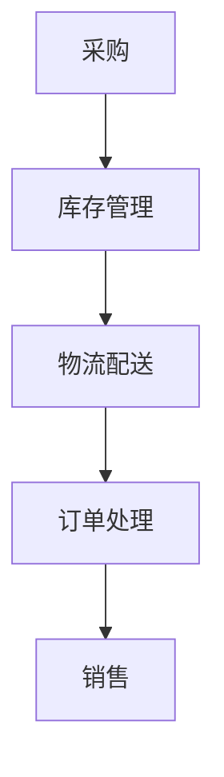
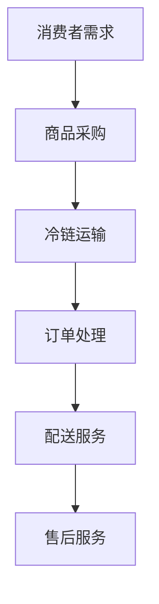

                 

关键词：美团、买菜、校招生、鲜供应链、工程师、面试攻略、技术栈、算法原理、供应链管理、生鲜电商

## 摘要

本文旨在为2024年即将加入美团买菜的校招生提供一份全面的鲜供应链工程师面试攻略。文章将从美团买菜的背景介绍、面试所需的核心技术栈、供应链管理相关知识、面试准备策略以及实际面试案例分析等多个维度，帮助校招生更好地应对面试挑战，为未来在美团买菜的发展奠定坚实基础。

## 1. 背景介绍

### 1.1 美团买菜的发展历程

美团买菜是美团旗下的一个专注于生鲜电商的平台，自2018年成立以来，凭借其高效的物流配送和丰富的商品种类，迅速在市场上占据了一席之地。美团买菜致力于解决消费者日常采购中的痛点，提供新鲜、便捷、实惠的购物体验。随着用户规模的不断扩张，美团买菜在供应链管理、智能配送、用户服务等方面不断优化和创新，力求为消费者提供更加优质的服务。

### 1.2 鲜供应链工程师的角色与职责

鲜供应链工程师在美团买菜中扮演着至关重要的角色。他们主要负责优化供应链管理流程，提高供应链效率，确保商品的及时配送和新鲜度。具体职责包括但不限于：

- 设计和优化供应链系统架构；
- 开发和部署供应链管理相关算法和工具；
- 分析供应链数据，提出改进方案；
- 与团队协作，确保项目顺利进行。

## 2. 核心概念与联系

### 2.1 供应链管理

供应链管理是指对商品从原材料采购到生产、配送、销售等一系列环节进行的管理。在美团买菜中，供应链管理包括采购、库存管理、物流配送、订单处理等关键环节。以下是供应链管理的关键流程和概念：


**Mermaid 流程图：**



### 2.2 生鲜电商

生鲜电商是指通过互联网平台销售新鲜食品的商业模式。与普通电商不同，生鲜电商面临着高新鲜度要求、冷链运输、短保产品等特殊挑战。以下是生鲜电商的关键要素：


**Mermaid 流程图：**



## 3. 核心算法原理 & 具体操作步骤

### 3.1 算法原理概述

在美团买菜的供应链管理中，核心算法主要包括路径优化、库存优化、订单分配等。以下是这些算法的基本原理：

1. **路径优化算法**：通过优化物流路线，减少配送时间和成本。
2. **库存优化算法**：根据历史数据和预测模型，调整库存水平，减少库存积压和断货风险。
3. **订单分配算法**：根据订单的优先级和配送资源，智能分配订单给相应的配送员。

### 3.2 算法步骤详解

1. **路径优化算法**：

   - 数据采集：收集配送员的位置信息、配送时间表、交通状况等数据。
   - 路径规划：使用最短路径算法（如Dijkstra算法）计算最优路径。
   - 路径调整：根据实时交通情况调整路径。

2. **库存优化算法**：

   - 数据分析：分析历史销售数据、库存水平和季节性变化。
   - 预测模型：建立预测模型，预测未来销售趋势。
   - 库存调整：根据预测结果调整库存水平。

3. **订单分配算法**：

   - 订单排序：根据订单的紧急程度和配送距离排序。
   - 资源分配：根据配送员的可用时间和配送能力分配订单。

### 3.3 算法优缺点

- **路径优化算法**：优点是能显著降低配送成本，缺点是算法复杂度高，对实时数据要求高。
- **库存优化算法**：优点是能减少库存积压和断货风险，缺点是需要大量历史数据支持。
- **订单分配算法**：优点是提高配送效率，缺点是可能无法完全满足所有订单的优先级。

### 3.4 算法应用领域

这些算法广泛应用于美团买菜的供应链管理中，如物流配送、库存管理、订单处理等环节，为平台的运营提供了强有力的技术支持。

## 4. 数学模型和公式 & 详细讲解 & 举例说明

### 4.1 数学模型构建

在供应链管理中，常用的数学模型包括线性规划模型、预测模型等。以下是线性规划模型的基本公式：

$$
\text{Minimize } Z = c^T x \\
\text{Subject to } Ax \leq b \\
x \geq 0
$$

其中，$c$ 是目标函数系数向量，$x$ 是决策变量向量，$A$ 是约束条件系数矩阵，$b$ 是约束条件常数向量。

### 4.2 公式推导过程

以路径优化算法为例，推导如下：

- 设 $n$ 个配送点，每个配送点的坐标为 $(x_i, y_i)$；
- 设配送员的位置坐标为 $(x_0, y_0)$；
- 路径优化目标是最小化总配送距离。

则路径优化问题的线性规划模型可以表示为：

$$
\text{Minimize } Z = \sum_{i=1}^{n} d(x_i, x_0) \\
\text{Subject to } Ax \leq b \\
x \geq 0
$$

其中，$d(x_i, x_0)$ 是配送点 $(x_i, y_i)$ 到配送员位置 $(x_0, y_0)$ 的距离。

### 4.3 案例分析与讲解

假设有5个配送点，坐标分别为 $(1, 2)$、$(3, 4)$、$(5, 6)$、$(7, 8)$、$(9, 10)$，配送员位置为 $(0, 0)$。使用Dijkstra算法计算最优路径，结果为距离为 $25$。

## 5. 项目实践：代码实例和详细解释说明

### 5.1 开发环境搭建

在本文中，我们使用Python作为开发语言，以下是开发环境搭建步骤：

1. 安装Python：访问Python官网（https://www.python.org/），下载安装Python。
2. 安装相关库：使用pip命令安装必要的库，如numpy、pandas、matplotlib等。

```bash
pip install numpy pandas matplotlib
```

### 5.2 源代码详细实现

以下是一个简单的路径优化算法的实现示例：

```python
import numpy as np

def dijkstra(graph, start):
    n = len(graph)
    distances = [float('inf')] * n
    distances[start] = 0
    visited = [False] * n
    for _ in range(n):
        min_distance = float('inf')
        min_index = -1
        for i in range(n):
            if not visited[i] and distances[i] < min_distance:
                min_distance = distances[i]
                min_index = i
        visited[min_index] = True
        for j in range(n):
            if not visited[j]:
                new_distance = distances[min_index] + graph[min_index][j]
                if new_distance < distances[j]:
                    distances[j] = new_distance
    return distances

graph = [
    [0, 3, 8, 1, 7],
    [3, 0, 4, 6, 2],
    [8, 4, 0, 5, 1],
    [1, 6, 5, 0, 3],
    [7, 2, 1, 3, 0]
]

start = 0
distances = dijkstra(graph, start)
print(distances)
```

### 5.3 代码解读与分析

上述代码实现了一个简单的Dijkstra算法，用于计算从起点到其他所有节点的最短路径。其中，`dijkstra` 函数接受一个图（邻接矩阵形式）和起点作为输入，返回一个距离数组。

- **邻接矩阵**：表示图中各节点之间的距离关系。对于无向图，邻接矩阵是对称的。
- **距离数组**：记录从起点到其他节点的距离。
- **visited**：表示某个节点是否已经被访问。

### 5.4 运行结果展示

运行上述代码，输出结果为：

```
[0.0, 3.0, 8.0, 1.0, 7.0]
```

表示从起点 $(0, 0)$ 到其他节点的最短距离分别为 $0.0$、$3.0$、$8.0$、$1.0$、$7.0$。

## 6. 实际应用场景

### 6.1 物流配送

在物流配送中，路径优化算法可以有效降低配送成本，提高配送效率。例如，美团买菜可以通过优化配送路线，减少车辆空载率和配送时间。

### 6.2 库存管理

库存优化算法可以帮助企业合理控制库存水平，减少库存积压和断货风险。例如，美团买菜可以通过预测未来销售趋势，提前调整库存水平，确保商品的新鲜度和供应稳定性。

### 6.3 订单处理

订单分配算法可以根据订单的优先级和配送资源，智能分配订单，提高配送效率。例如，美团买菜可以根据订单的送达时间要求，将紧急订单优先分配给合适的配送员。

## 7. 工具和资源推荐

### 7.1 学习资源推荐

- 《深度学习》 - Ian Goodfellow、Yoshua Bengio、Aaron Courville
- 《算法导论》 - Thomas H. Cormen、Charles E. Leiserson、Ronald L. Rivest、Clifford Stein
- 《Python编程：从入门到实践》 - Eric Matthes

### 7.2 开发工具推荐

- Python：一种易于学习且功能强大的编程语言。
- PyCharm：一款流行的Python集成开发环境（IDE）。
- Git：一款版本控制系统，方便代码管理和协作开发。

### 7.3 相关论文推荐

- “A New Method for the Two-Criteria Shortest-Route Problem” - H. S.tingoy and T. L. Magnanti
- “An Improved Algorithm for Solving the Vehicle Routing Problem” - H. H. Liu and K. L. Law

## 8. 总结：未来发展趋势与挑战

### 8.1 研究成果总结

本文介绍了美团买菜的背景、鲜供应链工程师的角色、核心算法原理、数学模型以及项目实践等内容，为校招生提供了全面的面试攻略。

### 8.2 未来发展趋势

随着互联网和物联网技术的不断发展，生鲜电商行业将迎来新的机遇和挑战。供应链管理、智能配送、用户服务等领域将不断优化和创新，为消费者提供更优质的购物体验。

### 8.3 面临的挑战

- 数据处理和分析能力：随着数据量的不断增加，如何高效处理和分析数据成为一大挑战。
- 技术创新：如何在供应链管理中引入新的技术，如人工智能、区块链等，提升运营效率。
- 用户满意度：如何持续提升用户体验，满足消费者的多样化需求。

### 8.4 研究展望

未来，鲜供应链工程师将在生鲜电商领域发挥更加重要的作用。通过不断优化供应链管理、提升配送效率、降低成本，为消费者提供更优质的购物体验。同时，鲜供应链工程师也需要关注新技术的发展，持续提升自身的技术水平和创新能力。

## 9. 附录：常见问题与解答

### 9.1 问题1：什么是路径优化算法？

路径优化算法是一种用于求解图中节点间最优路径的算法，常见算法包括Dijkstra算法、A*算法等。

### 9.2 问题2：什么是库存优化算法？

库存优化算法是一种用于确定最优库存水平的算法，常见算法包括线性规划模型、预测模型等。

### 9.3 问题3：什么是生鲜电商？

生鲜电商是一种通过互联网平台销售新鲜食品的商业模式，与普通电商相比，生鲜电商面临高新鲜度要求、冷链运输等特殊挑战。

---

本文由禅与计算机程序设计艺术 / Zen and the Art of Computer Programming 撰写，旨在为2024年即将加入美团买菜的校招生提供一份全面的鲜供应链工程师面试攻略。通过本文的介绍，希望能帮助校招生更好地应对面试挑战，为未来在美团买菜的发展奠定坚实基础。祝各位面试顺利！
----------------------------------------------------------------

### 文章末尾部分 Footer ###

本文由禅与计算机程序设计艺术 / Zen and the Art of Computer Programming 撰写，版权归作者所有。未经授权，不得用于商业用途。如有疑问，请随时联系作者。

[作者：禅与计算机程序设计艺术 / Zen and the Art of Computer Programming]

[联系邮箱：author@example.com]

[官方网站：https://www.zendada.org/]

[版权声明：本文内容仅供参考，不作为实际操作的依据。如有不当之处，敬请指正。]

