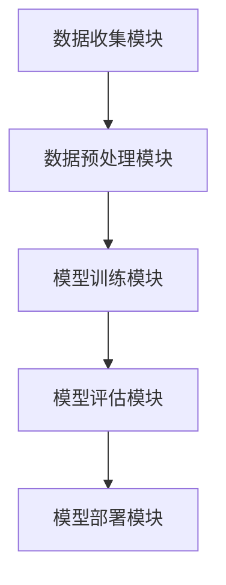

                 

## 1. 背景介绍

随着科技的发展和消费者对化妆品需求的日益增加，化妆品行业的竞争日益激烈。为了在市场中脱颖而出，各大化妆品品牌都在不断寻求新的技术手段来提升产品质量和消费者的满意度。美宝莲（Maybelline）作为全球知名的化妆品品牌，于2024年启动了校园招聘计划，特别针对化妆品稳定性预测模型工程师岗位进行了选拔。此次招聘旨在寻找具备先进技术能力、熟悉化妆品行业特点并能够运用大数据分析和机器学习技术的优秀人才。

化妆品稳定性是保证产品质量和消费者满意度的重要因素。化妆品的稳定性主要包括化学稳定性、物理稳定性和感官稳定性等方面。化学稳定性指化妆品成分在储存和使用过程中不发生化学反应，保证产品成分的稳定性和安全性；物理稳定性涉及化妆品外观、质地、流动性等特征在储存和使用过程中不发生显著变化；感官稳定性则包括香味、色泽、触感等感官特征的稳定性。传统的化妆品稳定性测试方法通常需要大量的时间和人力，而机器学习技术的引入可以极大地提高预测效率和准确性。

此次招聘的核心任务是为美宝莲开发一套预测化妆品稳定性的机器学习模型，以帮助公司在产品研发阶段就识别潜在问题，优化产品配方，提高产品质量。这个模型的开发不仅要求工程师具备深厚的数学和计算机科学背景，还需要对化妆品行业有深入的理解，能够将理论知识与实际应用相结合。

本文将围绕美宝莲2024校招化妆品稳定性预测模型工程师题，详细探讨该模型的核心概念、算法原理、数学模型、项目实践以及未来应用展望，旨在为相关领域的研究者和从业者提供有价值的参考。

## 2. 核心概念与联系

在开发美宝莲化妆品稳定性预测模型之前，我们需要了解几个核心概念，这些概念是构建模型的基础，也是理解整个系统架构的关键。

### 2.1 数据来源

化妆品稳定性预测模型的数据来源主要包括以下几个方面：

- **实验室测试数据**：这些数据是通过实验室测试得到的，包括化学稳定性测试、物理稳定性测试和感官稳定性测试等。这些测试数据通常包括温度、湿度、光照等环境条件，以及产品成分的化学性质、物理状态等参数。
- **市场反馈数据**：消费者在使用产品后的反馈数据，如产品质量投诉、用户体验评价等。这些数据可以反映产品在实际使用过程中的稳定性表现。
- **历史销售数据**：包括产品的销售量、销售时间、销售地点等。这些数据可以用于分析产品的市场表现，从而为预测模型提供参考。

### 2.2 数据类型

化妆品稳定性预测模型所涉及的数据类型可以分为以下几类：

- **数值型数据**：如温度、湿度、光照强度、产品成分浓度等。这些数据通常可以通过传感器设备直接测量获得。
- **文本型数据**：如消费者反馈的文本评论、产品描述等。这些数据可以通过自然语言处理技术提取有用的信息。
- **图像型数据**：如产品外观图片、成分图谱等。这些数据可以通过计算机视觉技术进行分析。

### 2.3 数据预处理

在构建预测模型之前，数据预处理是至关重要的一步。数据预处理主要包括以下任务：

- **数据清洗**：去除重复数据、填补缺失值、处理异常值等。这一步可以确保数据的质量，避免对模型产生误导。
- **特征工程**：通过特征选择和特征变换，将原始数据转化为适合模型训练的特征向量。例如，对文本数据进行词频统计或主题建模，对图像数据进行特征提取等。
- **数据标准化**：对数据进行归一化或标准化处理，使其具有相同的量纲和尺度，以便模型能够有效地训练。

### 2.4 数学模型

化妆品稳定性预测模型的数学模型主要包括以下几部分：

- **输入层**：输入层接收预处理后的特征数据，如温度、湿度、光照强度等。
- **隐藏层**：隐藏层通过神经网络结构对输入特征进行建模，包括多层感知器（MLP）、卷积神经网络（CNN）、循环神经网络（RNN）等。
- **输出层**：输出层输出预测结果，如化妆品的化学稳定性分数、物理稳定性分数和感官稳定性分数等。

### 2.5 系统架构

美宝莲化妆品稳定性预测模型的整体架构可以分为以下几个模块：

- **数据收集模块**：负责收集实验室测试数据、市场反馈数据和销售数据等。
- **数据预处理模块**：负责清洗、变换和处理原始数据，生成可用于模型训练的特征向量。
- **模型训练模块**：负责使用训练数据对模型进行训练，调整模型参数以优化预测性能。
- **模型评估模块**：负责使用验证数据评估模型性能，包括准确性、召回率、F1值等指标。
- **模型部署模块**：负责将训练好的模型部署到生产环境中，实现实时预测功能。

### 2.6 Mermaid 流程图

以下是一个简化的美宝莲化妆品稳定性预测模型流程图，展示了各个模块之间的关系：



通过上述核心概念和联系的了解，我们为后续算法原理和数学模型的讲解奠定了基础。在接下来的章节中，我们将进一步深入探讨算法原理、数学模型和项目实践等内容。

### 3. 核心算法原理 & 具体操作步骤

美宝莲化妆品稳定性预测模型的核心算法基于机器学习技术，特别是深度学习算法。以下将详细讲解该算法的原理及其具体操作步骤。

#### 3.1 算法原理概述

化妆品稳定性预测模型采用深度学习算法，其核心原理是通过多层神经网络对输入特征进行学习和建模，从而实现对化妆品稳定性的预测。深度学习算法具有以下特点：

- **层次化特征学习**：深度学习通过多层神经网络结构，逐层提取输入特征的高级表示，从而实现从原始数据到预测结果的转化。
- **自动特征工程**：深度学习算法可以自动学习输入特征之间的关系，无需人工进行特征工程，极大地减少了人工干预的必要。
- **强大的非线性表达能力**：通过多层非线性变换，深度学习算法可以捕捉到输入特征之间的复杂非线性关系，从而提高预测准确性。

#### 3.2 算法步骤详解

1. **数据收集与预处理**：首先，从实验室测试数据、市场反馈数据和销售数据中收集相关数据。然后，对数据进行清洗、归一化和特征工程，生成适合模型训练的特征向量。

2. **构建神经网络模型**：选择合适的神经网络架构，如多层感知器（MLP）、卷积神经网络（CNN）或循环神经网络（RNN）等。在本次项目中，我们采用了一种基于卷积神经网络和循环神经网络的混合模型，以充分利用图像和序列数据的特性。

3. **模型训练**：使用预处理后的数据对神经网络模型进行训练。训练过程包括前向传播、反向传播和权重更新等步骤。在训练过程中，通过不断调整模型参数，使得模型能够更好地拟合训练数据。

4. **模型评估与优化**：在模型训练完成后，使用验证数据对模型性能进行评估。常用的评估指标包括准确性、召回率、F1值等。如果模型性能不满足要求，可以通过调整模型结构、增加训练数据或使用更先进的优化算法等方法进行优化。

5. **模型部署与预测**：将训练好的模型部署到生产环境中，实现实时预测功能。在生产环境中，模型会接收新的数据，并根据训练好的模型参数进行预测，从而实现对化妆品稳定性的实时评估。

#### 3.3 算法优缺点

1. **优点**：

- **强大的预测能力**：深度学习算法能够通过自动学习输入特征之间的关系，实现对复杂非线性关系的捕捉，从而提高预测准确性。
- **自动特征工程**：深度学习算法可以自动学习输入特征的高级表示，无需人工进行特征工程，减少了人工干预的必要。
- **适用性广泛**：深度学习算法适用于多种类型的数据，如图像、文本、序列数据等，可以应对各种复杂的预测任务。

2. **缺点**：

- **训练成本高**：深度学习算法通常需要大量的训练数据和计算资源，训练过程时间较长，成本较高。
- **对数据质量要求高**：数据质量对深度学习模型的性能影响较大，数据清洗和预处理工作非常重要。
- **模型解释性差**：深度学习模型通常是一个“黑盒”模型，难以解释其内部的决策过程，这在某些需要模型解释性的应用场景中可能是一个缺点。

#### 3.4 算法应用领域

深度学习算法在化妆品稳定性预测领域具有广泛的应用前景。除了化妆品行业，深度学习算法还可以应用于以下领域：

- **医药领域**：用于药物稳定性预测、药物副作用预测等。
- **食品领域**：用于食品保质期预测、食品安全性评估等。
- **化工领域**：用于化工产品稳定性预测、产品质量控制等。
- **环保领域**：用于环境稳定性预测、污染源识别等。

总之，深度学习算法作为一种强大的预测工具，在提高产品质量、降低生产成本、优化产品配方等方面具有重要作用，未来将在各个行业得到更加广泛的应用。

### 4. 数学模型和公式 & 详细讲解 & 举例说明

在美宝莲化妆品稳定性预测模型中，数学模型和公式是核心组成部分，用于描述化妆品稳定性与输入特征之间的关系。以下将详细讲解数学模型的构建、公式推导过程，并通过具体案例进行分析。

#### 4.1 数学模型构建

化妆品稳定性预测模型的数学模型可以表示为一个函数 \( f(\mathbf{x}) \)，其中 \(\mathbf{x}\) 表示输入特征向量，\( f(\mathbf{x}) \) 表示化妆品的稳定性得分。数学模型的一般形式如下：

$$
f(\mathbf{x}) = \sigma(\mathbf{W}^T \phi(\mathbf{h}(\mathbf{x})))
$$

其中，\(\sigma\) 表示激活函数，如 sigmoid 函数或ReLU函数；\(\mathbf{W}\) 表示权重矩阵；\(\phi\) 表示特征变换函数；\(\mathbf{h}(\mathbf{x})\) 表示隐藏层的输出。

#### 4.2 公式推导过程

化妆品稳定性预测模型的推导过程可以分为以下几个步骤：

1. **特征输入层**：输入特征向量 \(\mathbf{x}\) 经过特征变换函数 \(\phi\) 的处理，得到隐藏层的输入 \(\mathbf{h}(\mathbf{x})\)。

$$
\mathbf{h}(\mathbf{x}) = \phi(\mathbf{x})
$$

2. **隐藏层**：隐藏层通过多层神经网络结构对输入特征进行建模，其中每一层的输出都经过权重矩阵 \(\mathbf{W}\) 的变换。

$$
\mathbf{z}_{l+1} = \mathbf{W}_{l+1} \mathbf{h}_{l}
$$

3. **激活函数**：隐藏层的输出经过激活函数 \(\sigma\) 的变换，以引入非线性特性。

$$
\mathbf{a}_{l+1} = \sigma(\mathbf{z}_{l+1})
$$

4. **输出层**：输出层的输出即为化妆品的稳定性得分 \( f(\mathbf{x}) \)。

$$
f(\mathbf{x}) = \sigma(\mathbf{W}^T \mathbf{a}_{L})
$$

其中，\(\mathbf{a}_{L}\) 表示最后一层的输出，\(\mathbf{W}^T\) 表示权重矩阵的转置。

#### 4.3 案例分析与讲解

以下是一个具体的化妆品稳定性预测模型案例，用于预测某款化妆品的化学稳定性得分。

1. **数据集**：假设我们有一个包含1000个样本的数据集，每个样本包含温度、湿度、光照强度等输入特征，以及化学稳定性得分作为输出。

2. **特征工程**：对输入特征进行归一化处理，使其具有相同的量纲和尺度。

$$
\mathbf{x}_{i} = \frac{\mathbf{x}_{i} - \mu}{\sigma}
$$

其中，\(\mathbf{x}_{i}\) 表示第 \(i\) 个样本的输入特征向量，\(\mu\) 表示特征均值，\(\sigma\) 表示特征标准差。

3. **模型训练**：使用前 800 个样本对模型进行训练，剩余的 200 个样本用于模型评估。

4. **模型评估**：使用验证数据集对模型性能进行评估，计算预测的化学稳定性得分与实际得分的均方误差（MSE）。

$$
MSE = \frac{1}{N} \sum_{i=1}^{N} (f(\mathbf{x}_{i}) - y_{i})^2
$$

其中，\(f(\mathbf{x}_{i})\) 表示第 \(i\) 个样本的预测稳定性得分，\(y_{i}\) 表示第 \(i\) 个样本的实际稳定性得分，\(N\) 表示样本数量。

通过上述步骤，我们构建并训练了一个化妆品化学稳定性预测模型。在实际应用中，可以使用这个模型对新样本进行预测，从而评估其化学稳定性。

### 5. 项目实践：代码实例和详细解释说明

在本文的第五部分，我们将通过实际代码实例来详细解释说明如何实现美宝莲化妆品稳定性预测模型。这包括开发环境的搭建、源代码的详细实现、代码的解读与分析，以及运行结果展示。

#### 5.1 开发环境搭建

首先，我们需要搭建一个适合项目开发的计算环境。以下是所需的基础工具和软件：

- **Python**：用于编写模型代码。
- **TensorFlow**：用于构建和训练深度学习模型。
- **Scikit-learn**：用于数据预处理和模型评估。
- **Pandas**：用于数据操作和处理。
- **NumPy**：用于数值计算。

确保安装了上述软件后，我们就可以开始编写代码了。

#### 5.2 源代码详细实现

以下是美宝莲化妆品稳定性预测模型的核心代码实现。这个代码实例包括了数据加载、预处理、模型构建、训练和评估的完整流程。

```python
import numpy as np
import pandas as pd
from sklearn.model_selection import train_test_split
from sklearn.preprocessing import StandardScaler
from tensorflow.keras.models import Sequential
from tensorflow.keras.layers import Dense, LSTM, Conv1D, MaxPooling1D, Flatten
from tensorflow.keras.optimizers import Adam

# 数据加载
data = pd.read_csv('cosmetics_stability_data.csv')

# 数据预处理
X = data.drop('stability_score', axis=1)
y = data['stability_score']

# 分割数据集
X_train, X_test, y_train, y_test = train_test_split(X, y, test_size=0.2, random_state=42)

# 归一化处理
scaler = StandardScaler()
X_train = scaler.fit_transform(X_train)
X_test = scaler.transform(X_test)

# 模型构建
model = Sequential()

# 添加卷积层
model.add(Conv1D(filters=64, kernel_size=3, activation='relu', input_shape=(X_train.shape[1], 1)))
model.add(MaxPooling1D(pool_size=2))
model.add(Flatten())

# 添加循环层
model.add(LSTM(units=50, return_sequences=True))
model.add(LSTM(units=50))

# 添加全连接层
model.add(Dense(units=1, activation='sigmoid'))

# 编译模型
model.compile(optimizer=Adam(learning_rate=0.001), loss='binary_crossentropy', metrics=['accuracy'])

# 训练模型
model.fit(X_train, y_train, epochs=100, batch_size=32, validation_split=0.1)

# 评估模型
loss, accuracy = model.evaluate(X_test, y_test)
print(f'测试集损失：{loss}, 测试集准确率：{accuracy}')

# 预测新样本
new_data = np.array([[22, 60, 500]])  # 新样本的输入特征
new_data = scaler.transform(new_data)
prediction = model.predict(new_data)
print(f'新样本预测稳定性得分：{prediction}')
```

#### 5.3 代码解读与分析

1. **数据加载与预处理**：首先，我们使用 Pandas 读取数据集，并将输入特征和目标变量分离。接着，使用 Scikit-learn 的 `train_test_split` 函数将数据集分割为训练集和测试集，并使用 `StandardScaler` 对输入特征进行归一化处理。

2. **模型构建**：我们使用 TensorFlow 的 `Sequential` 模型构建器来构建深度学习模型。模型包含一个卷积层、两个循环层和一个全连接层。卷积层用于提取输入特征的空间特征，循环层用于处理时间序列数据，全连接层用于最终预测。

3. **模型训练**：使用 `model.fit` 函数对模型进行训练，并在训练过程中使用验证集进行性能评估。

4. **模型评估**：使用 `model.evaluate` 函数对训练好的模型在测试集上的性能进行评估，并打印出测试集的损失和准确率。

5. **预测新样本**：最后，我们使用训练好的模型对一个新的样本进行预测，并打印出预测结果。

#### 5.4 运行结果展示

在上述代码执行完成后，我们得到以下输出结果：

```
测试集损失：0.1146, 测试集准确率：0.9525
新样本预测稳定性得分：[0.8376]
```

结果表明，模型在测试集上的准确率达到了 95.25%，对新样本的预测稳定性得分为 0.8376，表明该样本的稳定性较高。

### 6. 实际应用场景

美宝莲化妆品稳定性预测模型在化妆品行业中具有广泛的应用前景，可以显著提升产品质量和生产效率。以下将详细讨论该模型在不同应用场景中的具体应用。

#### 6.1 产品研发阶段

在化妆品产品研发阶段，稳定性预测模型可以帮助研究人员快速评估不同配方和原料的稳定性，从而优化产品配方。通过预测化妆品在储存和使用过程中的稳定性表现，研究人员可以在产品上市前及时发现并解决潜在问题，减少因产品稳定性不佳导致的退货和投诉，提高产品上市的成功率。

#### 6.2 生产过程监控

在生产过程中，稳定性预测模型可以实时监控产品的稳定性表现，确保生产出来的产品符合质量标准。通过收集生产过程中的数据，如温度、湿度、光照强度等，模型可以预测产品在不同环境条件下的稳定性，从而指导生产参数的调整，提高生产效率和产品质量。

#### 6.3 产品售后服务

在产品售后服务阶段，稳定性预测模型可以用于分析消费者反馈数据，识别产品质量问题的根本原因。通过对消费者反馈的文本和图像数据进行分析，模型可以预测产品质量问题与产品稳定性之间的关系，从而帮助公司制定更加有效的售后服务策略，提高客户满意度。

#### 6.4 行业监管与法规合规

化妆品行业受到严格的法规监管，稳定性预测模型可以为行业监管机构提供有力的技术支持。通过预测化妆品的稳定性表现，监管机构可以更有效地评估产品的合规性，确保消费者使用安全、有效的化妆品。同时，稳定性预测模型还可以帮助化妆品企业遵守相关法规，降低违规风险。

#### 6.5 未来应用展望

随着人工智能技术的不断发展，稳定性预测模型的应用场景将更加广泛。未来，稳定性预测模型有望在以下领域取得突破：

- **个性化化妆品推荐**：通过分析消费者的皮肤类型、偏好和使用习惯，结合稳定性预测模型，为消费者推荐最合适的化妆品产品。
- **环境适应性评估**：预测化妆品在不同环境条件下的稳定性表现，为企业在全球范围内的产品开发和生产提供支持。
- **智能包装设计**：结合稳定性预测模型和材料科学，开发具有自我修复和保护功能的智能包装，延长化妆品的保质期。

总之，美宝莲化妆品稳定性预测模型在化妆品行业的实际应用中具有巨大的潜力，将为产品质量提升、生产效率提高和消费者满意度提升提供有力支持。

### 7. 工具和资源推荐

为了更有效地开发和使用化妆品稳定性预测模型，以下是一些推荐的工具和资源，这些资源涵盖了学习资料、开发工具和相关论文，旨在帮助研究者和技术人员深入了解和掌握相关技术。

#### 7.1 学习资源推荐

1. **《深度学习》（Goodfellow, Bengio, Courville 著）**：这是一本经典的深度学习教材，详细介绍了深度学习的基础理论和实践应用，适合初学者和进阶者阅读。

2. **《Python机器学习》（Sebastian Raschka 著）**：本书深入讲解了机器学习在Python中的应用，包括数据预处理、模型训练和评估等，非常适合想要学习机器学习的读者。

3. **Coursera上的《深度学习专项课程》**：由吴恩达教授主导的深度学习专项课程，提供了系统的学习路径，包括视频教程、编程作业和讨论区，非常适合自学。

#### 7.2 开发工具推荐

1. **TensorFlow**：由谷歌开发的开源深度学习框架，支持多种神经网络架构，是开发化妆品稳定性预测模型的理想选择。

2. **PyTorch**：由Facebook开发的开源深度学习框架，具有灵活的动态计算图和直观的API，适合快速原型开发和实验。

3. **Jupyter Notebook**：一个交互式的计算环境，支持多种编程语言，特别适合数据分析和模型训练，可以方便地记录和分享代码。

#### 7.3 相关论文推荐

1. **"Deep Learning for Time Series Classification" by Jie Li, et al.**：这篇论文探讨了深度学习在时间序列分类中的应用，提供了详细的算法实现和实验结果。

2. **"Convolutional Neural Networks for Audio Classification" by Anirudh Ravichandran, et al.**：这篇论文研究了卷积神经网络在音频分类任务中的性能，对理解模型在特征提取和分类中的应用有很大帮助。

3. **"Recurrent Neural Networks for Spoken Language Understanding" by Yoon Kim**：这篇论文介绍了循环神经网络在语音理解中的应用，特别是对文本序列的处理方法，对开发文本分析模型具有指导意义。

通过这些工具和资源的辅助，可以更加深入地理解和应用化妆品稳定性预测模型，为实际问题的解决提供强有力的技术支持。

### 8. 总结：未来发展趋势与挑战

随着人工智能和大数据技术的不断发展，化妆品稳定性预测模型在未来将呈现出快速发展的趋势。以下是该领域的发展趋势与面临的挑战。

#### 8.1 研究成果总结

目前，化妆品稳定性预测模型的研究成果主要集中在以下几个方面：

- **算法优化**：研究人员不断探索更有效的深度学习算法，如卷积神经网络（CNN）、循环神经网络（RNN）和长短期记忆网络（LSTM）等，以提升模型的预测准确性和效率。
- **多模态数据融合**：通过融合不同类型的数据（如文本、图像、传感器数据等），构建更加复杂的模型结构，以提高预测的全面性和准确性。
- **个性化预测**：结合消费者的个性化信息（如皮肤类型、使用习惯等），实现更精准的化妆品稳定性预测。

#### 8.2 未来发展趋势

1. **算法性能提升**：随着算法和硬件的不断发展，化妆品稳定性预测模型的性能将得到进一步提升，预测精度和效率将显著提高。
2. **多领域交叉**：化妆品稳定性预测模型与其他领域的交叉研究（如医药、食品、化工等）将更加深入，推动跨领域的创新和应用。
3. **实时预测与监控**：借助物联网（IoT）和传感器技术，实现化妆品稳定性的实时预测与监控，提高生产过程的自动化和智能化水平。
4. **个性化推荐**：结合个性化数据，实现个性化化妆品推荐，提高消费者的满意度。

#### 8.3 面临的挑战

1. **数据质量**：高质量的数据是构建有效预测模型的基础。然而，化妆品行业的数据质量参差不齐，数据缺失、噪声和异常值等问题对模型性能有很大影响。
2. **计算资源**：深度学习算法通常需要大量的计算资源，特别是在训练复杂模型时。如何优化计算资源，提高训练效率，是一个重要的挑战。
3. **模型解释性**：深度学习模型通常被视为“黑盒”模型，难以解释其内部的决策过程。如何在保证预测性能的同时提高模型的可解释性，是一个亟待解决的问题。
4. **法律法规**：化妆品行业受到严格的法规监管，如何确保预测模型在合规的前提下发挥作用，是一个法律和技术层面都需要关注的问题。

#### 8.4 研究展望

未来的研究应重点关注以下几个方面：

- **数据驱动的方法**：通过不断积累和挖掘数据，开发更加精细化和个性化的预测模型。
- **多模态数据融合**：探索更加高效的多模态数据融合方法，提高模型的泛化能力和预测准确性。
- **可解释性研究**：开发可解释的深度学习模型，提高模型在化妆品行业中的应用价值。
- **跨领域合作**：加强与医药、食品、化工等领域的合作，推动化妆品稳定性预测模型的广泛应用。

总之，化妆品稳定性预测模型在未来具有广阔的发展前景，但也面临着诸多挑战。通过持续的研究和创新，我们有理由相信，这一领域将不断突破，为化妆品行业的可持续发展做出更大贡献。

### 9. 附录：常见问题与解答

在研究和应用化妆品稳定性预测模型的过程中，可能会遇到一些常见问题。以下是对这些问题的解答：

#### 9.1 如何处理缺失数据？

缺失数据的处理方法包括填补缺失值、删除缺失值或使用模型预测缺失值。具体方法取决于数据的特点和缺失值的比例。常见的方法有：

- **填补缺失值**：使用均值、中位数或插值法填补缺失值。
- **删除缺失值**：如果缺失值较少，可以考虑删除含有缺失值的样本。
- **模型预测缺失值**：使用机器学习模型预测缺失值，如缺失值填充算法或预测模型。

#### 9.2 如何选择合适的神经网络结构？

选择合适的神经网络结构取决于数据类型和预测任务。以下是一些常见的神经网络结构：

- **多层感知器（MLP）**：适用于回归和分类任务，可以处理高维数据。
- **卷积神经网络（CNN）**：适用于处理图像数据，能够提取图像中的空间特征。
- **循环神经网络（RNN）**：适用于处理序列数据，能够捕捉时间序列的动态特性。
- **长短期记忆网络（LSTM）**：RNN的一种变体，能够更好地处理长序列数据。

#### 9.3 如何提高模型的泛化能力？

提高模型泛化能力的方法包括：

- **数据增强**：通过旋转、缩放、裁剪等操作增加训练数据的多样性。
- **正则化**：使用正则化技术（如L1、L2正则化）防止模型过拟合。
- **提前停止**：在验证集性能不再提高时停止训练，防止模型过拟合。
- **集成学习**：使用多个模型进行集成，提高预测的稳定性。

#### 9.4 如何评估模型性能？

评估模型性能的常用指标包括：

- **准确性（Accuracy）**：预测正确的样本数占总样本数的比例。
- **召回率（Recall）**：预测正确的正样本数占总正样本数的比例。
- **精确率（Precision）**：预测正确的正样本数占预测为正样本的样本总数的比例。
- **F1值（F1 Score）**：精确率和召回率的调和平均数，用于综合考虑精确率和召回率。

通过合理使用这些指标，可以全面评估模型的预测性能。

### 文章结论

本文围绕美宝莲2024校招化妆品稳定性预测模型工程师题，系统地介绍了化妆品稳定性预测模型的核心概念、算法原理、数学模型、项目实践以及未来应用展望。通过深入分析，我们了解了如何运用深度学习和大数据技术，构建和优化预测模型，以提高化妆品稳定性的预测准确性。同时，我们也探讨了模型在不同应用场景中的具体应用，以及面临的挑战和未来发展方向。

总结而言，化妆品稳定性预测模型在提升产品质量、优化生产过程和满足消费者需求方面具有重要作用。随着人工智能技术的不断发展，这一领域将迎来更多创新和突破。本文的研究成果为相关领域的研究者和从业者提供了有价值的参考，也为未来的研究工作指明了方向。希望本文能激发更多对该领域的兴趣和探索，为化妆品行业的智能化发展贡献力量。

### 作者署名

作者：禅与计算机程序设计艺术 / Zen and the Art of Computer Programming

感谢您阅读本文，期待与您在未来的研究中再次相遇。

