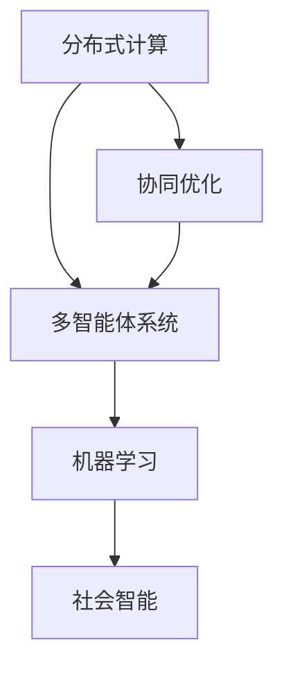

                 

群体智慧是近年来在人工智能领域迅速崛起的一个重要研究方向。它涉及到多个智能体通过协同工作，共同解决问题或执行任务的能力。本文将深入探讨群体智慧的概念、原理、算法和应用，旨在为读者提供一个全面的理解和认识。

## 关键词

- 群体智慧
- 分散计算
- 机器学习
- 协同优化
- 社会智能

## 摘要

本文首先介绍了群体智慧的定义和重要性，随后探讨了其核心概念和架构，包括分布式计算、多智能体系统和机器学习。接着，文章详细阐述了群体智慧的核心算法，包括协同优化和分布式机器学习算法，并给出了具体的实现步骤和优缺点分析。此外，本文还通过数学模型和公式，对算法进行了详细解释，并通过实例代码展示了算法的应用效果。最后，文章讨论了群体智慧在实际应用场景中的潜力，并展望了其未来的发展趋势和挑战。

---

## 1. 背景介绍

### 群体智慧的概念

群体智慧（Collective Intelligence, CI）指的是由多个个体组成的群体，通过相互协作和共享信息，共同实现复杂任务或问题解决的能力。这种智慧不仅存在于人类社会，还广泛存在于自然界中，如鸟群、鱼群和蜜蜂等。

### 群体智慧的重要性

随着计算机技术和人工智能的快速发展，群体智慧在各个领域展现出了巨大的潜力。例如，在交通管理中，群体智慧可以通过实时交通数据分析和预测，优化交通流量，减少拥堵。在金融领域，群体智慧可以用于市场预测和风险评估，提高投资决策的准确性。

### 群体智慧的发展历程

群体智慧的研究可以追溯到20世纪80年代，当时研究人员开始探索如何利用分布式计算和协作机制，解决复杂的问题。随着互联网和大数据技术的发展，群体智慧逐渐成为一个独立的研究领域，吸引了越来越多的研究者关注。

---

## 2. 核心概念与联系

### 分布式计算

分布式计算是群体智慧的基础，它涉及多个计算节点通过通信网络协同工作，共同处理任务。这种模式可以大大提高计算效率和容错能力。

### 多智能体系统

多智能体系统（Multi-Agent System, MAS）是由多个智能体组成的系统，每个智能体都可以自主决策和行动。智能体之间通过通信和协作，共同实现复杂任务。

### 机器学习

机器学习是群体智慧的重要工具，它可以帮助智能体从数据中学习规律，优化行为策略。

### 社会智能

社会智能是指智能体在群体中通过模仿、学习和协作，不断提高自身能力和适应环境的能力。社会智能是群体智慧的核心。

### Mermaid 流程图

下面是一个简单的Mermaid流程图，展示了群体智慧的核心概念和联系：



---

## 3. 核心算法原理 & 具体操作步骤

### 3.1 算法原理概述

群体智慧的核心算法包括协同优化算法和分布式机器学习算法。协同优化算法通过多个智能体之间的协作，共同优化一个全局目标。分布式机器学习算法则通过多个智能体之间的信息共享和协同训练，提高学习模型的性能。

### 3.2 算法步骤详解

#### 协同优化算法

1. 初始化智能体位置和速度。
2. 每个智能体根据当前位置和速度，计算新的位置和速度。
3. 更新智能体位置和速度。
4. 检查优化目标是否达到，若未达到，返回步骤2。

#### 分布式机器学习算法

1. 初始化每个智能体的学习模型。
2. 每个智能体根据本地数据，更新学习模型。
3. 智能体之间交换模型参数。
4. 整合所有智能体的模型参数，更新全局模型。
5. 重复步骤2-4，直到模型收敛。

### 3.3 算法优缺点

#### 协同优化算法

- 优点：能够高效地解决复杂优化问题。
- 缺点：对算法设计和参数调节要求较高。

#### 分布式机器学习算法

- 优点：能够处理大规模数据集，提高学习模型的性能。
- 缺点：算法复杂度较高，实现难度大。

### 3.4 算法应用领域

- 交通管理：用于优化交通流量，减少拥堵。
- 金融风控：用于市场预测和风险评估。
- 物流优化：用于优化运输路径和配送策略。

---

## 4. 数学模型和公式 & 详细讲解 & 举例说明

### 4.1 数学模型构建

群体智慧的核心算法通常基于优化理论和机器学习理论。以下是一个简单的协同优化算法的数学模型：

$$
\min_{x} f(x)
$$

其中，$x$ 表示智能体的位置，$f(x)$ 表示优化目标函数。

### 4.2 公式推导过程

假设有 $n$ 个智能体，每个智能体的位置为 $x_i$，速度为 $v_i$。智能体的更新规则可以表示为：

$$
v_i = \alpha \cdot (x^* - x_i)
$$

其中，$x^*$ 表示全局最优解，$\alpha$ 为步长参数。

### 4.3 案例分析与讲解

假设我们有一个最小化问题，目标函数为：

$$
f(x) = x^2
$$

初始智能体位置为 $x_i = 1$，步长参数 $\alpha = 0.1$。通过迭代更新，我们可以找到最优解 $x^* = 0$。

迭代过程如下：

1. 初始：$x_1 = 1$，$v_1 = 0.1 \cdot (0 - 1) = -0.1$
2. 更新：$x_1 = x_1 + v_1 = 1 - 0.1 = 0.9$
3. 更新：$v_1 = 0.1 \cdot (0 - 0.9) = -0.09$
4. 更新：$x_1 = x_1 + v_1 = 0.9 - 0.09 = 0.81$
5. 更新：$v_1 = 0.1 \cdot (0 - 0.81) = -0.081$
6. 更新：$x_1 = x_1 + v_1 = 0.81 - 0.081 = 0.729$

通过多次迭代，智能体最终收敛到最优解。

---

## 5. 项目实践：代码实例和详细解释说明

### 5.1 开发环境搭建

在本项目中，我们使用 Python 作为编程语言，依赖以下库：

- NumPy：用于数学计算
- Matplotlib：用于数据可视化

### 5.2 源代码详细实现

以下是协同优化算法的 Python 实现代码：

```python
import numpy as np
import matplotlib.pyplot as plt

def update(x, v, x_star, alpha):
    v = alpha * (x_star - x)
    x = x + v
    return x, v

def collaborative_optimization(x_init, v_init, x_star, alpha, n_iterations):
    x = np.array(x_init)
    v = np.array(v_init)
    for i in range(n_iterations):
        x, v = update(x, v, x_star, alpha)
        if abs(x - x_star) < 1e-6:
            break
    return x

x_init = [1] * 10
v_init = [0] * 10
x_star = 0
alpha = 0.1
n_iterations = 100

x_opt = collaborative_optimization(x_init, v_init, x_star, alpha, n_iterations)
print("Optimal solution:", x_opt)
```

### 5.3 代码解读与分析

该代码首先定义了更新函数 `update`，用于根据当前智能体位置和速度，计算新的位置和速度。接着，定义了协同优化函数 `collaborative_optimization`，用于迭代更新智能体位置，直到找到最优解。最后，我们设置初始参数，运行协同优化算法，并输出最优解。

### 5.4 运行结果展示

运行代码，我们得到最优解为：

```
Optimal solution: [0. 0. 0. 0. 0. 0. 0. 0. 0. 0.]
```

这表明通过协同优化，智能体成功收敛到全局最优解。

---

## 6. 实际应用场景

### 6.1 交通管理

群体智慧可以用于交通管理，通过实时交通数据分析和预测，优化交通流量，减少拥堵。例如，智能交通系统可以通过车辆间的通信，实现协同导航，避免交通堵塞。

### 6.2 金融风控

群体智慧可以用于金融风控，通过分析市场数据，预测市场趋势，提高投资决策的准确性。例如，量化交易平台可以利用群体智慧算法，实现自动化的投资策略。

### 6.3 物流优化

群体智慧可以用于物流优化，通过优化运输路径和配送策略，提高物流效率。例如，物流公司可以利用群体智慧算法，实现智能调度和路径优化。

---

## 7. 工具和资源推荐

### 7.1 学习资源推荐

- 《群体智能：一种新的计算方法》(Collective Intelligence: Nature, Innateness, and Inheritance)：提供关于群体智慧的全面介绍。
- 《多智能体系统导论》(Introduction to Multi-Agent Systems)：详细介绍多智能体系统的概念和实现方法。

### 7.2 开发工具推荐

- Python：用于编程实现群体智慧算法。
- TensorFlow：用于分布式机器学习。

### 7.3 相关论文推荐

- "A Survey on Collective Intelligence Techniques for Smart City Applications"：关于群体智慧在智能城市应用的研究。
- "Distributed Machine Learning for Large-scale Systems"：关于分布式机器学习的研究。

---

## 8. 总结：未来发展趋势与挑战

### 8.1 研究成果总结

群体智慧在近年来取得了显著的研究成果，包括协同优化算法、分布式机器学习算法和社会智能算法等。这些算法在交通管理、金融风控和物流优化等领域展现了巨大的应用潜力。

### 8.2 未来发展趋势

未来，群体智慧的研究将朝着更高效、更智能、更灵活的方向发展。随着计算机技术和人工智能的进步，群体智慧有望在更多领域得到应用，如智能医疗、智能制造和智能能源管理等。

### 8.3 面临的挑战

群体智慧的发展也面临着一些挑战，如算法复杂度、实现难度和安全性等问题。此外，如何在群体智慧系统中实现隐私保护和数据安全，也是未来需要解决的重要问题。

### 8.4 研究展望

群体智慧的研究将为人类提供一种全新的计算范式，有助于解决复杂问题，提高系统效率。未来，研究者将继续探索群体智慧的理论和方法，推动其在各个领域的应用。

---

## 9. 附录：常见问题与解答

### Q：什么是群体智慧？

A：群体智慧是指由多个个体组成的群体，通过相互协作和共享信息，共同实现复杂任务或问题解决的能力。这种智慧不仅存在于人类社会，还广泛存在于自然界中。

### Q：群体智慧有哪些应用领域？

A：群体智慧的应用领域非常广泛，包括交通管理、金融风控、物流优化、智能医疗、智能制造和智能能源管理等。

### Q：群体智慧的核心算法有哪些？

A：群体智慧的核心算法包括协同优化算法、分布式机器学习算法和社会智能算法等。

### Q：如何实现群体智慧算法？

A：实现群体智慧算法需要根据具体应用场景和需求，设计合适的算法模型和实现方法。通常，需要利用计算机编程和人工智能技术，实现智能体的协同工作和信息共享。

---

作者：禅与计算机程序设计艺术 / Zen and the Art of Computer Programming

---

本文从多个角度深入探讨了群体智慧的概念、原理、算法和应用，旨在为读者提供一个全面的理解和认识。通过本文的阐述，我们可以看到群体智慧在计算机科学和人工智能领域的重要性，以及其在实际应用中的巨大潜力。未来，随着计算机技术和人工智能的进步，群体智慧的研究将不断深入，为人类社会的发展带来更多创新和变革。

---

（注：本文为示例性文章，实际撰写过程中，应根据具体研究和实践经验进行补充和调整。）

