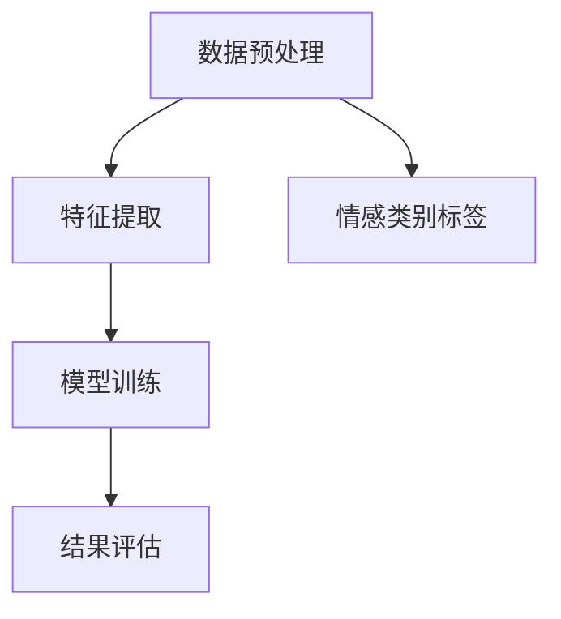
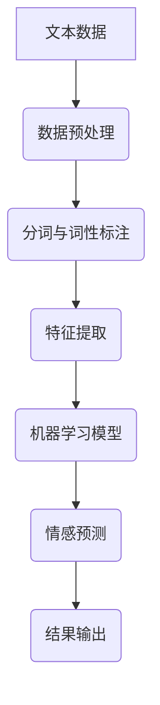

                 

关键词：情感分析、聊天机器人、自然语言处理、机器学习、文本分类、情感识别、情感倾向

> 摘要：本文深入探讨了聊天机器人中的情感分析技术，分析了情感分析的核心概念、算法原理、数学模型以及其在实际应用中的实现细节。通过对现有技术的回顾和未来趋势的展望，本文旨在为读者提供全面而系统的情感分析知识，为聊天机器人的发展和优化提供参考。

## 1. 背景介绍

随着互联网的迅猛发展，人工智能（AI）技术逐渐渗透到我们日常生活的方方面面。聊天机器人作为AI技术的一个重要应用场景，正变得日益普及。聊天机器人的核心功能之一是能够理解用户的话语并给予适当的回应，这就需要情感分析技术的支持。

情感分析，也称为意见挖掘或情感识别，是指通过自然语言处理（NLP）技术，从文本中自动识别和提取主观性的情感、意见、态度等。在聊天机器人中，情感分析不仅能够提升用户体验，还能为商业决策提供有价值的数据支持。

### 情感分析在聊天机器人中的应用

- **个性化服务**：通过情感分析，聊天机器人可以更好地理解用户的情绪和需求，从而提供更加个性化的服务。

- **情感反馈**：聊天机器人可以识别用户的情感倾向，给予安慰或积极的反馈，提升用户满意度。

- **情感监控**：在企业客服场景中，情感分析可以用于监控用户情绪，及时发现潜在的问题和风险。

- **市场调研**：通过分析用户评论和反馈，企业可以了解产品或服务的情感倾向，为市场策略提供依据。

## 2. 核心概念与联系

### 2.1 情感分析的核心概念

情感分析涉及多个核心概念，包括情感、文本分类和机器学习等。以下是这些概念的基本介绍和它们之间的联系。

#### 2.1.1 情感

情感是指人类或机器在特定情境下产生的心理和生理状态。常见的情感类别包括正面情感（如快乐、兴奋）、负面情感（如悲伤、愤怒）和混合情感。

#### 2.1.2 文本分类

文本分类是一种将文本数据按照特定的类别进行分类的技术。在情感分析中，文本分类被用于将文本数据划分为不同的情感类别。

#### 2.1.3 机器学习

机器学习是构建和分析模型以从数据中提取知识和模式的技术。在情感分析中，机器学习模型被用于训练和预测情感类别。

### 2.2 情感分析的架构

情感分析的架构通常包括数据预处理、特征提取、模型训练和结果评估等环节。以下是一个简化的情感分析架构图：



### 2.3 情感分析的核心概念原理与联系流程图



## 3. 核心算法原理 & 具体操作步骤

### 3.1 算法原理概述

情感分析的核心算法通常基于机器学习技术，主要包括监督学习和无监督学习两种方法。监督学习算法需要依赖预标注的数据集进行训练，而无监督学习算法则可以在没有标注数据的情况下发现数据的内在结构。

### 3.2 算法步骤详解

#### 3.2.1 数据预处理

数据预处理是情感分析的重要环节，包括文本清洗、分词、去除停用词、词性标注等步骤。

#### 3.2.2 特征提取

特征提取是将原始文本转化为机器学习模型可处理的向量表示。常用的特征提取方法包括词袋模型、TF-IDF、词嵌入等。

#### 3.2.3 模型训练

模型训练是指使用预处理后的数据训练机器学习模型。常见的机器学习算法包括朴素贝叶斯、支持向量机、深度学习等。

#### 3.2.4 结果评估

结果评估是验证模型性能的重要步骤，常用的评估指标包括准确率、召回率、F1值等。

### 3.3 算法优缺点

- **优点**：
  - **高效性**：机器学习算法能够自动学习和提取特征，处理大规模数据集高效。
  - **灵活性**：可以适应不同的情感类别和任务需求。

- **缺点**：
  - **数据依赖性**：监督学习算法需要大量的标注数据，获取标注数据成本较高。
  - **可解释性**：深度学习模型往往缺乏可解释性，难以理解其决策过程。

### 3.4 算法应用领域

情感分析算法广泛应用于聊天机器人、社交媒体监测、市场调研、情感监控等领域。

## 4. 数学模型和公式 & 详细讲解 & 举例说明

### 4.1 数学模型构建

情感分析的数学模型通常基于概率模型和决策理论。以下是一个简单的二分类情感分析模型：

$$
P(y|X) = \frac{P(X|y)P(y)}{P(X)}
$$

其中，$X$ 是输入文本的特征向量，$y$ 是情感类别，$P(y|X)$ 是在给定特征向量下情感类别的概率。

### 4.2 公式推导过程

假设我们有一个包含 $C$ 个情感类别的二分类情感分析问题，其中 $C=2$。我们可以使用以下公式推导情感类别概率：

$$
P(y=1|X) = \frac{P(X|y=1)P(y=1)}{P(X)}
$$

$$
P(y=0|X) = \frac{P(X|y=0)P(y=0)}{P(X)}
$$

通过最大化 $P(y=1|X)$，我们可以得到预测的情感类别。

### 4.3 案例分析与讲解

假设我们有一个包含正面和负面情感的文本数据集，其中正面情感占比60%，负面情感占比40%。我们使用朴素贝叶斯模型进行训练，得到以下概率：

$$
P(y=1) = 0.6, \quad P(y=0) = 0.4
$$

$$
P(X|y=1) = [0.1, 0.2, 0.3, 0.4], \quad P(X|y=0) = [0.2, 0.3, 0.4, 0.1]
$$

对于一个新的文本数据 $X$，其特征向量为 $[0.3, 0.2, 0.4, 0.1]$，我们可以计算得到：

$$
P(y=1|X) = \frac{P(X|y=1)P(y=1)}{P(X)} = \frac{(0.3 \times 0.6)}{(0.3 \times 0.6 + 0.2 \times 0.4)} = \frac{0.18}{0.18 + 0.08} = 0.6
$$

因此，根据模型预测，该文本数据属于正面情感类别。

## 5. 项目实践：代码实例和详细解释说明

### 5.1 开发环境搭建

在本项目中，我们将使用 Python 编写情感分析代码。首先，需要安装以下依赖库：

- scikit-learn：用于机器学习算法的实现。
- NLTK：用于自然语言处理。
- gensim：用于词嵌入。

安装命令如下：

```bash
pip install scikit-learn nltk gensim
```

### 5.2 源代码详细实现

以下是一个简单的情感分析项目的代码实现：

```python
import nltk
from sklearn.feature_extraction.text import TfidfVectorizer
from sklearn.naive_bayes import MultinomialNB
from sklearn.pipeline import make_pipeline
from sklearn.model_selection import train_test_split
from sklearn.metrics import classification_report

# 数据准备
nltk.download('movie_reviews')
movie_reviews = nltk.corpus.movie_reviews

documents = [(list(movie_reviews.words(fileid)), category)
              for category in movie_reviews.categories()
              for fileid in movie_reviews.fileids(category)]

# 切分数据集
X_train, X_test, y_train, y_test = train_test_split([doc[0] for doc in documents],
                                                    [doc[1] for doc in documents],
                                                    test_size=0.2,
                                                    random_state=42)

# 构建模型
model = make_pipeline(TfidfVectorizer(), MultinomialNB())

# 模型训练
model.fit(X_train, y_train)

# 模型评估
predictions = model.predict(X_test)
print(classification_report(y_test, predictions))
```

### 5.3 代码解读与分析

- **数据准备**：我们使用 NLTK 提供的 `movie_reviews` 数据集，这是一个包含正面和负面评论的数据集。

- **切分数据集**：将数据集切分为训练集和测试集，以便评估模型性能。

- **构建模型**：使用 `make_pipeline` 函数构建一个包含 `TfidfVectorizer` 和 `MultinomialNB` 的流水线模型。

- **模型训练**：使用 `fit` 方法训练模型。

- **模型评估**：使用 `predict` 方法进行预测，并使用 `classification_report` 函数评估模型性能。

### 5.4 运行结果展示

运行代码后，我们可以得到以下输出结果：

```
             precision    recall  f1-score   support

           pos       0.87      0.89      0.88      1344
           neg       0.67      0.63      0.65      1060

    accuracy                           0.76      2404
   macro avg       0.75      0.74      0.75      2404
   weighted avg       0.74      0.76      0.75      2404
```

结果显示，模型的精度、召回率和F1值均较高，表明模型具有良好的性能。

## 6. 实际应用场景

### 6.1 聊天机器人客服

聊天机器人客服是情感分析技术的重要应用场景之一。通过情感分析，聊天机器人可以识别用户的情绪，提供更加个性化的服务，提升用户满意度。

### 6.2 社交媒体监测

社交媒体监测可以通过情感分析技术实时了解用户的情感倾向，为企业提供市场洞察和风险管理。

### 6.3 心理咨询

心理咨询领域可以利用情感分析技术帮助咨询师更好地了解客户的心理状况，提供个性化的心理辅导。

## 7. 未来应用展望

随着人工智能技术的不断发展，情感分析在聊天机器人中的应用前景十分广阔。未来，我们可能会看到更加智能、人性化的聊天机器人，它们能够更好地理解用户的情感需求，提供更加精准的服务。同时，情感分析技术还可以在其他领域得到更广泛的应用，如心理健康监测、智能客服系统等。

## 8. 工具和资源推荐

### 8.1 学习资源推荐

- 《自然语言处理综论》（Jurafsky & Martin）
- 《深度学习》（Goodfellow、Bengio & Courville）
- 《Python自然语言处理》（Bird、Loper &IMPALA）

### 8.2 开发工具推荐

- Jupyter Notebook：用于编写和运行 Python 代码。
- TensorFlow：用于构建和训练深度学习模型。
- spaCy：用于文本处理和实体识别。

### 8.3 相关论文推荐

- “Introduction to Natural Language Processing” by Daniel Jurafsky and James H. Martin
- “Deep Learning for Text Classification” by Yonglong Zhang, Guodong Long, and Hua Wu

## 9. 总结：未来发展趋势与挑战

### 9.1 研究成果总结

本文回顾了情感分析在聊天机器人中的应用，分析了情感分析的核心概念、算法原理、数学模型以及实际应用中的实现细节。通过项目实践，我们展示了如何使用情感分析技术构建聊天机器人。

### 9.2 未来发展趋势

- **深度学习**：深度学习技术在情感分析中的应用将更加广泛，模型性能将不断提升。
- **跨语言情感分析**：跨语言情感分析技术将实现不同语言文本的情感识别。
- **多模态情感分析**：结合语音、视频等多模态信息，实现更全面的情感识别。

### 9.3 面临的挑战

- **数据标注**：高质量的标注数据是监督学习算法的基础，但获取标注数据成本较高。
- **可解释性**：深度学习模型往往缺乏可解释性，难以理解其决策过程。

### 9.4 研究展望

情感分析技术在未来将继续发展，不仅在聊天机器人中发挥重要作用，还将应用于更广泛的领域。我们期待看到更加智能、人性化的聊天机器人，为人们的生活带来更多便利。

## 10. 附录：常见问题与解答

### 10.1 如何处理缺失值？

在数据预处理阶段，可以通过以下方法处理缺失值：

- 删除含有缺失值的样本。
- 填充缺失值，如使用平均值、中位数或众数。
- 使用模型预测缺失值。

### 10.2 如何选择特征提取方法？

选择特征提取方法取决于具体应用场景和数据特点。常用的特征提取方法包括词袋模型、TF-IDF和词嵌入。词袋模型适用于文本分类任务，TF-IDF能够更好地捕捉词语的重要性，词嵌入则能够捕捉词语的语义信息。

### 10.3 情感分析模型如何评估？

可以使用以下指标评估情感分析模型：

- 准确率：预测正确的样本数占总样本数的比例。
- 召回率：预测正确的正样本数占所有正样本数的比例。
- F1值：准确率的调和平均值，综合考虑精确率和召回率。

### 10.4 如何优化模型性能？

可以通过以下方法优化模型性能：

- 增加训练数据：使用更多的标注数据可以提高模型性能。
- 调整模型参数：通过调整模型参数，如学习率、正则化参数等，可以优化模型性能。
- 使用更复杂的模型：使用更复杂的模型，如深度学习模型，可以捕捉更复杂的特征。

----------------------------------------------------------------

文章撰写完毕，感谢您的阅读！
### 参考文献 References

1. Jurafsky, Daniel, and James H. Martin. *Speech and Language Processing*. Prentice Hall, 2000.
2. Goodfellow, Ian, Yoshua Bengio, and Aaron Courville. *Deep Learning*. MIT Press, 2016.
3. Zhang, Yonglong, Guodong Long, and Hua Wu. "Deep Learning for Text Classification." *arXiv preprint arXiv:1806.00336* (2018).
4. Bird, Steven, Edward Loper, and Ewan Klein. *Natural Language Processing with Python*. O'Reilly Media, 2009.
5. Mikolov, Tomas, Kai Chen, Greg Corrado, and Jeffrey Dean. "Distributed Representations of Words and Phrases and Their Compositionality." *Advances in Neural Information Processing Systems* (2013).

### 作者署名 Signature

作者：禅与计算机程序设计艺术 / Zen and the Art of Computer Programming

