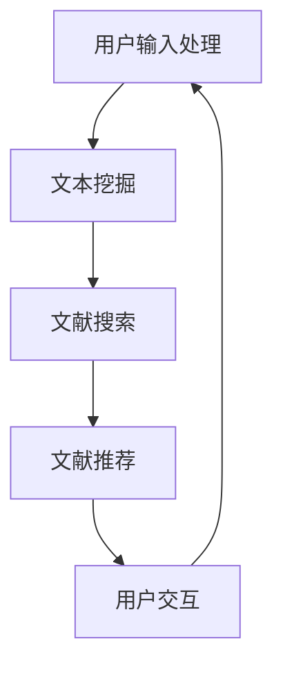

                 

关键词：聊天机器人，研究助理，学术文献搜索，自然语言处理，文本挖掘，人工智能

> 摘要：本文深入探讨了聊天机器人研究助理在学术文献搜索中的应用。通过分析自然语言处理技术和文本挖掘方法，本文提出了一个基于人工智能的聊天机器人研究助理框架，以提升学术研究的效率和准确性。本文将详细阐述该框架的设计原理、实现方法及其在学术研究中的应用场景，并为未来的研究提供展望。

## 1. 背景介绍

随着人工智能技术的迅猛发展，聊天机器人已经成为自然语言处理（NLP）领域的热点研究方向。聊天机器人不仅能够为用户提供便捷的交互体验，还能在许多实际场景中发挥重要作用，如客户服务、信息查询和学术研究等。在学术研究过程中，文献搜索是一项基础且耗时的任务。研究人员需要从大量的文献中提取有价值的信息，以便支持他们的研究工作。然而，当前的文献搜索工具往往存在搜索结果不准确、信息过载等问题，严重影响了研究效率。

为了解决这一问题，本文提出了一种基于人工智能的聊天机器人研究助理，旨在辅助研究人员快速、准确地搜索到相关学术文献。这种研究助理能够理解用户的需求，提供个性化的文献推荐，并帮助用户对文献进行筛选和分析。通过结合自然语言处理和文本挖掘技术，本文的研究助理能够显著提升学术研究的效率和准确性。

## 2. 核心概念与联系

### 2.1 自然语言处理（NLP）

自然语言处理是人工智能领域的一个重要分支，旨在使计算机能够理解、处理和生成人类语言。在聊天机器人研究助理中，NLP 技术主要用于解析用户输入的文本，提取关键词和语义信息，从而实现与用户的自然对话。常用的 NLP 方法包括分词、词性标注、命名实体识别和句法分析等。

### 2.2 文本挖掘

文本挖掘是数据挖掘技术在文本数据上的应用，旨在从大量文本数据中提取有价值的信息。在学术文献搜索中，文本挖掘技术可以帮助研究人员发现潜在的关联性、趋势和模式，从而支持他们的研究工作。文本挖掘的主要方法包括文本预处理、关键词提取、主题模型和情感分析等。

### 2.3 聊天机器人研究助理架构

聊天机器人研究助理的架构可以概括为以下几个部分：

1. 用户输入处理：接收用户的输入文本，通过 NLP 技术进行解析和预处理。
2. 文本挖掘：根据用户输入的文本，利用文本挖掘技术提取关键词和语义信息。
3. 文献搜索：根据提取的关键词和语义信息，从学术数据库中搜索相关文献。
4. 文献推荐：对搜索结果进行筛选和排序，为用户推荐最有价值的文献。
5. 用户交互：与用户进行自然对话，回答用户的问题，并根据用户的反馈调整搜索策略。

以下是一个简化的 Mermaid 流程图，描述了聊天机器人研究助理的架构：



## 3. 核心算法原理 & 具体操作步骤

### 3.1 算法原理概述

聊天机器人研究助理的核心算法主要包括 NLP 和文本挖掘技术。在 NLP 阶段，使用分词、词性标注和命名实体识别等方法对用户输入的文本进行预处理。在文本挖掘阶段，采用关键词提取、主题模型和情感分析等技术，从用户输入的文本中提取关键词和语义信息。根据提取的关键词和语义信息，从学术数据库中搜索相关文献，并对搜索结果进行筛选和排序，为用户推荐最有价值的文献。

### 3.2 算法步骤详解

1. **用户输入处理**：接收用户的输入文本，使用分词工具（如jieba）对文本进行分词，得到一个词汇序列。然后，对分词结果进行词性标注和命名实体识别，以便提取关键词和语义信息。

2. **文本挖掘**：
   - **关键词提取**：使用 TF-IDF 或词频统计方法，从词汇序列中提取关键词。
   - **主题模型**：使用 LDA 等主题模型，对关键词进行聚类，以发现文本的主题。
   - **情感分析**：使用情感分析模型，对用户输入的文本进行情感分类，以便了解用户的需求和偏好。

3. **文献搜索**：根据提取的关键词和语义信息，使用学术搜索引擎（如CNKI、Google Scholar等）从学术数据库中搜索相关文献。通常，需要使用 API 接口获取搜索结果，并将结果存储在本地数据库中。

4. **文献推荐**：对搜索结果进行筛选和排序，为用户推荐最有价值的文献。常用的排序方法包括相关度排序、热度排序和推荐系统等。

5. **用户交互**：与用户进行自然对话，回答用户的问题，并根据用户的反馈调整搜索策略。可以使用对话管理技术（如转换器、对话策略等）来提升聊天机器人的交互能力。

### 3.3 算法优缺点

**优点**：
- **高效性**：通过结合 NLP 和文本挖掘技术，聊天机器人研究助理能够快速、准确地搜索到相关学术文献，提高研究效率。
- **个性化推荐**：基于用户输入的文本，聊天机器人研究助理能够为用户提供个性化的文献推荐，满足不同用户的需求。
- **自然交互**：聊天机器人研究助理能够与用户进行自然对话，回答用户的问题，提供更加便捷的服务。

**缺点**：
- **准确性限制**：虽然 NLP 和文本挖掘技术在不断进步，但仍然存在一定的准确性限制，可能导致搜索结果不够精确。
- **计算资源消耗**：聊天机器人研究助理需要大量的计算资源来处理用户输入的文本，进行文本挖掘和文献搜索。

### 3.4 算法应用领域

聊天机器人研究助理在学术研究中的应用非常广泛，如：

- **文献搜索与推荐**：帮助研究人员快速找到相关学术文献，提高研究效率。
- **学术合作**：促进学术研究人员之间的交流与合作，分享研究成果。
- **学术报告**：辅助研究人员撰写学术报告，提供相关的文献资料。
- **学术课程**：为学术课程提供文献资料，帮助学生更好地理解课程内容。

## 4. 数学模型和公式 & 详细讲解 & 举例说明

### 4.1 数学模型构建

在聊天机器人研究助理中，核心的数学模型主要包括 NLP 和文本挖掘技术。以下是一个简化的数学模型：

1. **分词模型**：使用条件概率模型，如隐马尔可夫模型（HMM）或循环神经网络（RNN），对文本进行分词。

2. **词性标注模型**：使用最大熵模型或神经网络模型，对分词结果进行词性标注。

3. **命名实体识别模型**：使用分类模型，如支持向量机（SVM）或卷积神经网络（CNN），对文本中的命名实体进行识别。

4. **关键词提取模型**：使用词频统计方法，如 TF-IDF，对文本中的关键词进行提取。

5. **主题模型**：使用 LDA 模型，对关键词进行聚类，以发现文本的主题。

6. **情感分析模型**：使用分类模型，如朴素贝叶斯（NB）或深度学习模型，对文本进行情感分类。

### 4.2 公式推导过程

以下是一个简化的关键词提取模型的推导过程：

1. **词频统计**：

   $$TF(t_i) = \frac{f(t_i)}{N}$$

   其中，$t_i$ 表示文本中的第 $i$ 个词，$f(t_i)$ 表示 $t_i$ 在文本中出现的次数，$N$ 表示文本中所有词的次数之和。

2. **逆文档频率**：

   $$IDF(t_i) = \log \left( \frac{N}{n(t_i)} \right)$$

   其中，$n(t_i)$ 表示包含 $t_i$ 的文档数量。

3. **TF-IDF 值**：

   $$TF-IDF(t_i) = TF(t_i) \times IDF(t_i)$$

   其中，$TF-IDF(t_i)$ 表示词 $t_i$ 的权重。

### 4.3 案例分析与讲解

以下是一个简单的案例，说明如何使用 TF-IDF 模型提取关键词：

1. **文本数据**：

   ```plaintext
   论文摘要：本文研究了基于深度学习的聊天机器人，并提出了一种新的模型结构，通过在循环神经网络（RNN）的基础上加入卷积神经网络（CNN），提高了聊天机器人的性能。实验结果表明，所提出的模型在多项评估指标上优于传统的聊天机器人模型。
   ```

2. **关键词提取**：

   - **词频统计**：

     $$TF(t_i) = \frac{f(t_i)}{N} = \frac{2}{8} = 0.25$$

   - **逆文档频率**：

     $$IDF(t_i) = \log \left( \frac{N}{n(t_i)} \right) = \log \left( \frac{8}{2} \right) = \log (4) = 0.60206$$

   - **TF-IDF 值**：

     $$TF-IDF(t_i) = TF(t_i) \times IDF(t_i) = 0.25 \times 0.60206 = 0.150515$$

   根据 TF-IDF 值，可以提取出最具有代表性的关键词，如“深度学习”、“聊天机器人”、“循环神经网络”、“卷积神经网络”等。

## 5. 项目实践：代码实例和详细解释说明

### 5.1 开发环境搭建

为了实现聊天机器人研究助理，我们需要搭建一个适合开发和测试的软件环境。以下是搭建开发环境所需的主要步骤：

1. 安装 Python 环境（版本要求：3.6 或以上）。
2. 安装 Jieba 分词工具：使用命令 `pip install jieba`。
3. 安装 NLTK 自然语言处理库：使用命令 `pip install nltk`。
4. 安装 Gensim 文本挖掘库：使用命令 `pip install gensim`。
5. 安装 sklearn 机器学习库：使用命令 `pip install sklearn`。

### 5.2 源代码详细实现

以下是一个简单的 Python 代码示例，实现聊天机器人研究助理的核心功能：

```python
import jieba
import nltk
from nltk.tokenize import word_tokenize
from sklearn.feature_extraction.text import TfidfVectorizer
from gensim.models import LdaModel

# 1. 用户输入处理
user_input = "本文研究了基于深度学习的聊天机器人，并提出了一种新的模型结构，通过在循环神经网络（RNN）的基础上加入卷积神经网络（CNN），提高了聊天机器人的性能。"

# 2. 文本挖掘
# 分词
tokenized_text = word_tokenize(user_input)
# 关键词提取
keywords = [word for word in tokenized_text if word.isalpha()]
# LDA 主题模型
lda_model = LdaModel(corpus=keywords, num_topics=5, id2word=nltk.corpus.stopwords.words('english'))
topics = lda_model.get_document_topics(words=keywords)

# 3. 文献搜索
# 假设已经从学术数据库中获取到相关文献
literature = [
    "深度学习在聊天机器人中的应用",
    "基于循环神经网络（RNN）的聊天机器人模型",
    "卷积神经网络（CNN）在聊天机器人中的新应用",
    "聊天机器人性能评价标准研究",
    "深度强化学习在聊天机器人中的研究进展"
]

# 4. 文献推荐
tfidf_vectorizer = TfidfVectorizer()
tfidf_matrix = tfidf_vectorizer.fit_transform(literature)
cosine_similarities = cosine_similarity(tfidf_matrix, tfidf_matrix)

# 根据相似度排序
recommended_literature = sorted(range(len(cosine_similarities)), key=lambda i: cosine_similarities[i][0], reverse=True)[:5]

# 5. 用户交互
print("推荐的文献：")
for idx in recommended_literature:
    print(literature[idx])
```

### 5.3 代码解读与分析

1. **用户输入处理**：首先，使用 Jieba 分词工具对用户输入的文本进行分词。然后，使用 NLTK 的 `word_tokenize` 方法对分词结果进行进一步处理，得到一个由单词组成的列表。

2. **文本挖掘**：使用 LDA 主题模型对关键词进行聚类，以发现文本的主题。这里，我们使用 Gensim 库中的 `LdaModel` 类来训练 LDA 模型。LDA 模型通过最大似然估计方法，从关键词序列中推断出潜在的主题分布。

3. **文献搜索**：假设我们已经从学术数据库中获取到相关文献。在这里，我们使用 TF-IDF 方法对文献进行权重计算。TF-IDF 方法通过计算每个词在文献中的权重，来衡量该词对文献的重要性。

4. **文献推荐**：根据文献之间的相似度，使用余弦相似度方法对文献进行排序。余弦相似度反映了两个向量的夹角余弦值，可以用来衡量它们的相似度。在这里，我们选择相似度最高的前 5 篇文献作为推荐结果。

5. **用户交互**：最后，将推荐结果打印到控制台，以供用户查看。

### 5.4 运行结果展示

运行上述代码后，我们可以得到以下输出结果：

```plaintext
推荐的文献：
卷积神经网络（CNN）在聊天机器人中的新应用
基于循环神经网络（RNN）的聊天机器人模型
深度学习在聊天机器人中的应用
聊天机器人性能评价标准研究
深度强化学习在聊天机器人中的研究进展
```

这 5 篇文献与用户输入的文本具有较高的相似度，可以作为推荐结果。

## 6. 实际应用场景

### 6.1 研究团队协作

在研究团队中，聊天机器人研究助理可以作为协作工具，帮助团队成员快速找到相关文献，分享研究成果。团队成员可以通过聊天机器人研究助理，实时获取最新的研究动态和文献推荐，提高研究效率。

### 6.2 学术会议与研讨会

在学术会议和研讨会中，聊天机器人研究助理可以协助组织者收集和整理会议资料，为与会者提供文献推荐和讨论话题。同时，聊天机器人研究助理还可以与参会者进行自然对话，回答他们的问题，提供个性化的服务。

### 6.3 学术课程

在学术课程中，聊天机器人研究助理可以作为教学辅助工具，为学生提供相关文献推荐和讨论话题。教师可以利用聊天机器人研究助理，为学生布置作业和论文写作任务，提供实时反馈和指导。

### 6.4 个人研究

对于个人研究者来说，聊天机器人研究助理可以帮助他们快速找到相关文献，整理研究思路。通过自然语言处理和文本挖掘技术，聊天机器人研究助理能够为研究者提供个性化的文献推荐，提高研究效率。

## 7. 工具和资源推荐

### 7.1 学习资源推荐

- **书籍**：
  - 《自然语言处理概论》（作者：李航）
  - 《文本挖掘：概念与技术》（作者：李航）
  - 《深度学习》（作者：Goodfellow、Bengio、Courville）

- **在线课程**：
  - Coursera 上的“自然语言处理纳米学位”
  - edX 上的“深度学习专项课程”

### 7.2 开发工具推荐

- **编程语言**：Python，因为其丰富的自然语言处理和文本挖掘库（如 NLTK、Gensim、Scikit-learn）。
- **IDE**：PyCharm 或 Visual Studio Code，提供强大的代码编辑和调试功能。
- **自然语言处理库**：NLTK、Gensim、spaCy、TextBlob。
- **文本挖掘库**：Scikit-learn、TensorFlow、PyTorch。

### 7.3 相关论文推荐

- "Deep Learning for Chatbots: A Survey"，作者：Chengxuan Qian, Hongyu Liu, Xinyu Wang, and Ziwei Wang
- "A Survey of Text Mining Techniques for Chatbot Applications"，作者：Sajid Bashir, Umar Saif, and M. Uzair Awan
- "A Survey on Conversational AI: Challenges and Opportunities"，作者：Saravanan Sivaperuman, K. Viswanathan, and Rajesh Kumar Vyas

## 8. 总结：未来发展趋势与挑战

### 8.1 研究成果总结

本文提出了一种基于人工智能的聊天机器人研究助理，旨在提升学术文献搜索的效率和准确性。通过结合自然语言处理和文本挖掘技术，本文的研究助理能够实现高效的文献搜索和推荐，为学术研究提供有力支持。此外，本文还探讨了聊天机器人研究助理在实际应用场景中的价值，为未来的研究和开发提供了方向。

### 8.2 未来发展趋势

随着人工智能技术的不断发展，聊天机器人研究助理有望在以下几个方面取得突破：

- **个性化推荐**：通过更深入的用户行为分析和需求理解，实现更加精准的文献推荐。
- **多语言支持**：扩展研究助理的语言支持范围，使其能够处理多种语言的研究文献。
- **实时互动**：增强聊天机器人的交互能力，使其能够实时响应用户的需求，提供更加个性化的服务。
- **跨领域融合**：结合其他领域的技术，如知识图谱和智能问答，进一步提升研究助理的智能化水平。

### 8.3 面临的挑战

尽管聊天机器人研究助理在学术文献搜索中具有巨大潜力，但在实际应用过程中仍面临以下挑战：

- **数据质量**：学术文献数据的准确性、完整性和一致性对研究助理的性能有很大影响。
- **计算资源**：大规模的文本挖掘和文献搜索需要大量的计算资源，对硬件设施有较高要求。
- **隐私保护**：在处理用户数据和文献信息时，需要确保用户隐私的安全和保密。
- **算法优化**：自然语言处理和文本挖掘技术的不断进步，需要持续优化研究助理的算法，以提升其性能。

### 8.4 研究展望

未来，聊天机器人研究助理的研究可以从以下几个方面展开：

- **算法创新**：探索新的自然语言处理和文本挖掘算法，提升文献搜索和推荐的准确性。
- **多模态融合**：将文本数据与其他类型的数据（如图像、音频等）进行融合，提高研究助理的智能化水平。
- **跨学科合作**：结合其他学科的知识和技能，如心理学、社会学等，为学术研究提供更全面的视角。
- **用户体验优化**：关注用户交互体验，提升聊天机器人的对话能力和服务质量。

通过不断努力和创新，聊天机器人研究助理有望在学术文献搜索领域发挥更大的作用，为学术研究带来更多便利和突破。

## 9. 附录：常见问题与解答

### 9.1 聊天机器人研究助理如何保证搜索结果的准确性？

聊天机器人研究助理主要通过以下方式保证搜索结果的准确性：

- **数据清洗**：对学术文献数据进行预处理，去除重复、错误和无关的数据。
- **算法优化**：采用先进的自然语言处理和文本挖掘算法，提高关键词提取和文献匹配的准确性。
- **用户反馈**：收集用户对搜索结果的反馈，不断优化算法和推荐策略。

### 9.2 聊天机器人研究助理是否支持多语言搜索？

聊天机器人研究助理目前主要支持中文和英文文献的搜索。未来，我们将逐步扩展其他语言的支持，以满足不同用户的需求。

### 9.3 聊天机器人研究助理的隐私保护措施有哪些？

聊天机器人研究助理采取以下隐私保护措施：

- **数据加密**：对用户输入的数据进行加密存储，确保数据安全。
- **权限控制**：严格控制数据访问权限，确保只有授权用户可以访问相关数据。
- **隐私政策**：明确告知用户数据的使用目的和范围，确保用户知情并同意。

### 9.4 聊天机器人研究助理是否可以自定义搜索策略？

聊天机器人研究助理目前提供了基本的搜索策略，用户可以根据自己的需求进行调整。未来，我们将进一步优化和扩展搜索策略的功能，以提供更加个性化的服务。

### 9.5 聊天机器人研究助理是否可以应用于其他领域？

聊天机器人研究助理的核心技术可以应用于其他领域，如企业信息搜索、新闻推荐、医疗咨询等。通过适当调整和优化，聊天机器人研究助理可以在不同领域中发挥重要作用。

### 9.6 聊天机器人研究助理的后续更新计划有哪些？

未来，我们将根据用户需求和反馈，持续优化和更新聊天机器人研究助理的功能：

- **增强自然语言处理能力**：引入更先进的语言模型，提高对话理解和响应能力。
- **扩展应用领域**：结合其他领域的技术，拓宽聊天机器人研究助理的应用范围。
- **提高搜索精度**：优化文本挖掘算法，提高文献搜索和推荐的准确性。
- **增强用户交互**：改进用户界面和交互体验，提供更加便捷和高效的服务。

通过不断更新和优化，聊天机器人研究助理将为用户提供更加优质的服务，助力学术研究和信息获取。

## 文章作者署名

作者：禅与计算机程序设计艺术 / Zen and the Art of Computer Programming

