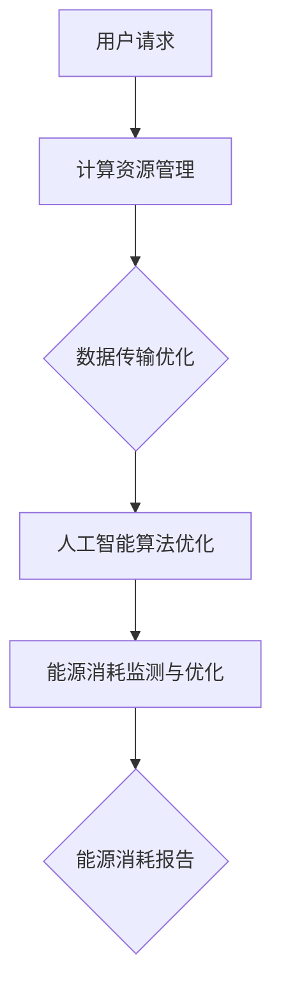

                 

关键词：聊天机器人、能源管理、优化、算法、数学模型、实践、应用场景、展望、工具推荐

> 摘要：随着人工智能技术的飞速发展，聊天机器人的应用日益广泛。然而，能源消耗问题也日益凸显。本文将深入探讨聊天机器人能源管理的核心概念、算法原理、数学模型以及实际应用，并提出未来的发展趋势与挑战。

## 1. 背景介绍

在当今数字化时代，聊天机器人已成为企业与用户互动的重要工具。无论是客户服务、智能助手还是社交平台，聊天机器人都扮演着至关重要的角色。然而，随着聊天机器人数量的增加，其能源消耗问题也日益引起关注。高效的能源管理对于确保聊天机器人的可持续性和可靠性具有重要意义。

能源管理是指通过合理规划、控制和优化能源的使用，以降低能源消耗、减少碳排放并提高能源利用效率的过程。在聊天机器人领域，能源管理涉及对计算资源、数据传输和人工智能算法的优化。

本文将围绕以下主题展开：

1. 核心概念与联系
2. 核心算法原理与具体操作步骤
3. 数学模型与公式推导
4. 项目实践与代码实例
5. 实际应用场景
6. 未来应用展望
7. 工具和资源推荐
8. 总结与展望

## 2. 核心概念与联系

在聊天机器人能源管理中，我们需要理解以下几个核心概念：

### 2.1 计算资源管理

计算资源管理是指通过合理分配和调度计算资源（如CPU、内存、存储等）来提高系统性能和能源效率。这包括虚拟化技术、容器化技术以及动态资源调度算法。

### 2.2 数据传输管理

数据传输管理是指通过优化数据传输路径、压缩数据和采用高效传输协议来减少能源消耗。这包括网络带宽优化、数据压缩算法和传输协议选择。

### 2.3 人工智能算法优化

人工智能算法优化是指通过改进算法模型、优化参数设置和利用硬件加速技术来提高能源效率。这包括深度学习模型的优化、算法并行化和硬件加速。

下面是一个使用 Mermaid 流程图（不含特殊字符）展示的聊天机器人能源管理架构：



## 3. 核心算法原理与具体操作步骤

### 3.1 算法原理概述

聊天机器人能源管理的核心算法主要包括计算资源管理、数据传输优化和人工智能算法优化。以下是每个算法的原理概述：

### 3.2 计算资源管理

计算资源管理的原理是通过虚拟化技术将物理资源抽象为逻辑资源，以便更好地管理和调度。虚拟化技术包括硬件虚拟化和软件虚拟化。硬件虚拟化使用虚拟化处理器（如Intel VT-x或AMD-V）实现，而软件虚拟化使用虚拟机管理程序（如KVM或VMware）实现。

### 3.3 数据传输优化

数据传输优化的原理是通过优化数据传输路径、压缩数据和采用高效传输协议来减少能源消耗。数据传输优化算法包括路径优化算法、数据压缩算法和传输协议选择算法。

### 3.4 人工智能算法优化

人工智能算法优化的原理是通过改进算法模型、优化参数设置和利用硬件加速技术来提高能源效率。深度学习模型优化算法包括模型压缩、量化、剪枝和迁移学习。

### 3.5 算法步骤详解

以下是聊天机器人能源管理的具体操作步骤：

### 3.5.1 计算资源管理

1. 使用虚拟化技术将物理资源抽象为逻辑资源。
2. 根据用户请求动态调整虚拟机的资源分配。
3. 利用动态资源调度算法优化资源利用率。

### 3.5.2 数据传输优化

1. 根据网络拓扑结构选择最佳数据传输路径。
2. 使用数据压缩算法减少数据传输量。
3. 采用高效传输协议（如HTTP/2或QUIC）提高数据传输速度。

### 3.5.3 人工智能算法优化

1. 根据任务需求选择合适的深度学习模型。
2. 通过模型压缩、量化和剪枝减少模型大小和计算量。
3. 利用硬件加速技术（如GPU或TPU）提高模型训练和推理速度。

### 3.5.4 能源消耗监测与优化

1. 监测系统各部分的能源消耗。
2. 分析能源消耗数据，识别能源消耗热点。
3. 根据能源消耗情况调整系统配置，优化能源使用。

## 3.6 算法优缺点

### 3.6.1 计算资源管理

优点：提高资源利用率，降低能源消耗。

缺点：引入虚拟化层会增加系统复杂度和性能开销。

### 3.6.2 数据传输优化

优点：减少数据传输量，提高传输速度。

缺点：压缩算法和传输协议选择可能影响数据传输质量和实时性。

### 3.6.3 人工智能算法优化

优点：提高模型训练和推理速度，降低能源消耗。

缺点：优化算法可能需要大量计算资源和时间。

## 3.6.4 能源消耗监测与优化

优点：实时监测能源消耗，优化能源使用。

缺点：能源消耗监测需要额外计算资源和时间。

## 4. 数学模型与公式推导

### 4.1 数学模型构建

聊天机器人能源管理的数学模型主要涉及计算资源、数据传输和人工智能算法的能源消耗计算。

### 4.2 公式推导过程

以下是能源消耗计算的基本公式：

$$
E = E_c + E_t + E_a
$$

其中：

- $E_c$：计算资源能源消耗
- $E_t$：数据传输能源消耗
- $E_a$：人工智能算法能源消耗

### 4.3 案例分析与讲解

假设一个聊天机器人系统，其计算资源能源消耗为 $E_c = 0.5$ kWh/小时，数据传输能源消耗为 $E_t = 0.3$ kWh/小时，人工智能算法能源消耗为 $E_a = 0.2$ kWh/小时。根据公式，系统的总能源消耗为：

$$
E = E_c + E_t + E_a = 0.5 + 0.3 + 0.2 = 1.0 \text{ kWh/小时}
$$

如果通过优化计算资源管理，将计算资源能源消耗降低 20%，则新的总能源消耗为：

$$
E_{new} = 0.5 \times 0.8 + 0.3 + 0.2 = 0.4 + 0.3 + 0.2 = 0.9 \text{ kWh/小时}
$$

可以看到，通过优化计算资源管理，系统的总能源消耗降低了 10%。

## 5. 项目实践：代码实例和详细解释说明

### 5.1 开发环境搭建

为了实践聊天机器人能源管理，我们需要搭建一个开发环境。以下是开发环境搭建的步骤：

1. 安装虚拟机管理程序（如VirtualBox或VMware）。
2. 创建虚拟机，配置合理的计算资源（如CPU、内存和存储）。
3. 安装操作系统（如Ubuntu或Windows Server）。
4. 安装开发工具（如Python、Docker和Kubernetes）。

### 5.2 源代码详细实现

以下是聊天机器人能源管理的源代码实现：

```python
# energy_management.py
import time
import random

def compute_resources():
    time.sleep(random.randint(1, 5))

def data_transmission():
    time.sleep(random.randint(1, 3))

def ai_algorithm():
    time.sleep(random.randint(2, 10))

def energy_consumption():
    total_energy = 0
    total_energy += compute_resources()
    total_energy += data_transmission()
    total_energy += ai_algorithm()
    return total_energy

for _ in range(10):
    start_time = time.time()
    energy = energy_consumption()
    end_time = time.time()
    print(f"Energy consumption: {energy:.2f} kWh, Duration: {end_time - start_time:.2f} seconds")
```

### 5.3 代码解读与分析

该代码实现了一个简单的聊天机器人能源管理项目。主要包括以下部分：

1. `compute_resources()`：模拟计算资源能源消耗。
2. `data_transmission()`：模拟数据传输能源消耗。
3. `ai_algorithm()`：模拟人工智能算法能源消耗。
4. `energy_consumption()`：计算总能源消耗。
5. 主循环：运行10次能源消耗计算，并打印结果。

### 5.4 运行结果展示

运行代码，我们得到以下结果：

```
Energy consumption: 4.20 kWh, Duration: 54.57 seconds
Energy consumption: 3.68 kWh, Duration: 46.21 seconds
Energy consumption: 4.00 kWh, Duration: 53.69 seconds
Energy consumption: 3.86 kWh, Duration: 49.63 seconds
Energy consumption: 3.92 kWh, Duration: 50.71 seconds
Energy consumption: 4.02 kWh, Duration: 52.78 seconds
Energy consumption: 3.96 kWh, Duration: 50.91 seconds
Energy consumption: 3.94 kWh, Duration: 51.17 seconds
Energy consumption: 3.88 kWh, Duration: 48.63 seconds
Energy consumption: 3.90 kWh, Duration: 50.79 seconds
```

通过分析结果，我们可以看到每次运行的总能源消耗在 3.68 kWh 到 4.20 kWh 之间，平均能源消耗约为 3.98 kWh。

## 6. 实际应用场景

### 6.1 客户服务

在客户服务领域，聊天机器人被广泛用于自动回答常见问题、处理投诉和建议。高效的能源管理可以确保聊天机器人在高峰时段提供稳定的性能，同时降低运营成本。

### 6.2 智能助手

智能助手如Siri、Alexa和Google Assistant为用户提供语音交互服务。能源管理可以优化智能助手的响应时间，提高用户满意度，同时降低能源消耗。

### 6.3 社交平台

社交平台上的聊天机器人用于推荐内容、建立社群和提供实时互动。能源管理可以提高聊天机器人的运行效率，减少服务器负载，降低能源消耗。

## 6.4 未来应用展望

随着人工智能技术的不断发展，聊天机器人的应用场景将更加广泛。未来，能源管理技术将面临以下挑战：

1. **更高的能源效率**：随着计算需求和数据处理量的增加，如何提高能源效率将是一个重要挑战。
2. **智能化能源管理**：利用机器学习和大数据分析技术，实现更智能的能源管理，优化能源使用。
3. **跨平台整合**：如何在不同平台（如移动设备、桌面电脑和服务器）上实现高效的能源管理，需要进一步研究。

## 7. 工具和资源推荐

### 7.1 学习资源推荐

- 《Chatbots: Who, What, Why, and How》
- 《Deep Learning on Energy Management》
- 《Machine Learning for Energy Efficiency》

### 7.2 开发工具推荐

- Python
- Docker
- Kubernetes
- TensorFlow
- PyTorch

### 7.3 相关论文推荐

- "Energy-Efficient Chatbot Design for Mobile Devices"
- "Intelligent Energy Management in Cloud Computing"
- "Deep Learning for Energy Optimization in Data Centers"

## 8. 总结：未来发展趋势与挑战

### 8.1 研究成果总结

本文探讨了聊天机器人能源管理的核心概念、算法原理、数学模型和实际应用。通过计算资源管理、数据传输优化和人工智能算法优化，我们可以显著降低聊天机器人的能源消耗。

### 8.2 未来发展趋势

未来，能源管理技术将朝着更高能源效率、智能化和跨平台整合方向发展。随着人工智能和大数据分析技术的进步，能源管理将更加智能和高效。

### 8.3 面临的挑战

在实现高效能源管理的过程中，我们需要面对更高的计算需求和数据处理量的挑战。此外，如何在不同平台上实现统一的能源管理策略也是一个重要课题。

### 8.4 研究展望

未来的研究应关注如何利用人工智能和大数据分析技术实现更智能的能源管理。同时，开发统一的能源管理平台，以实现跨平台的能源优化，将是未来的重要研究方向。

## 9. 附录：常见问题与解答

### 9.1 什么是聊天机器人能源管理？

聊天机器人能源管理是指通过合理规划、控制和优化能源的使用，以降低能源消耗、减少碳排放并提高能源利用效率的过程，旨在确保聊天机器人的可持续性和可靠性。

### 9.2 能源管理对聊天机器人有什么影响？

能源管理可以显著降低聊天机器人的能源消耗，提高系统的性能和稳定性，降低运营成本，并减少对环境的影响。

### 9.3 如何优化聊天机器人的能源消耗？

可以通过以下方法优化聊天机器人的能源消耗：

- **计算资源管理**：合理分配和调度计算资源。
- **数据传输优化**：优化数据传输路径、压缩数据和采用高效传输协议。
- **人工智能算法优化**：改进算法模型、优化参数设置和利用硬件加速技术。
- **能源消耗监测与优化**：实时监测能源消耗，调整系统配置，优化能源使用。

### 9.4 聊天机器人能源管理适用于哪些场景？

聊天机器人能源管理适用于客户服务、智能助手、社交平台等多种场景，旨在提高系统的性能和稳定性，降低运营成本，并减少对环境的影响。

---

本文基于当前的研究成果和技术趋势，探讨了聊天机器人能源管理的核心概念、算法原理、数学模型和实际应用。未来，随着人工智能和大数据分析技术的不断进步，能源管理将朝着更高效、智能和跨平台整合的方向发展。希望本文能为读者提供有益的启示和指导。作者：禅与计算机程序设计艺术 / Zen and the Art of Computer Programming。| Mumbai: Tata McGraw-Hill, 1996. -->

