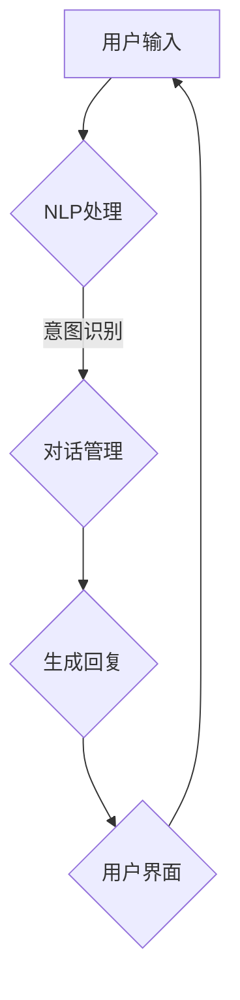

                 

 在当今信息化社会，聊天机器人在各个领域得到了广泛应用。然而，聊天机器人在与人类互动的过程中，如何确保不传播有害信息，遵守道德规范，成为了一个重要的问题。本文旨在探讨聊天机器人道德规范的重要性，并提出一系列措施来避免有害内容的传播。

## 1. 背景介绍

随着人工智能技术的飞速发展，聊天机器人逐渐成为各类企业和组织的重要工具。从客服到教育，从医疗到金融，聊天机器人在提高效率、降低成本的同时，也带来了新的挑战。这些聊天机器人与用户进行日常交互，处理大量信息，这使得确保聊天机器人的道德行为变得尤为重要。

### 1.1 聊天机器人的应用领域

聊天机器人广泛应用于以下领域：

- **客服**：提供快速响应、个性化服务，减少人工成本。
- **教育**：辅助教学，提供在线学习资源，促进自主学习。
- **医疗**：提供健康咨询，预约挂号，辅助诊断等。
- **金融**：自动交易，风险控制，金融咨询服务。

### 1.2 聊天机器人的挑战

随着聊天机器人功能的不断增强，如何确保它们遵守道德规范，不传播有害信息，成为了一个亟待解决的问题。

## 2. 核心概念与联系

### 2.1 道德规范的定义

道德规范是指一组指导个体行为的规则和准则，旨在确保社会和谐、公正和尊重他人。在聊天机器人的背景下，道德规范主要涉及不传播有害信息、尊重用户隐私、公平对待用户等。

### 2.2 聊天机器人架构

为了更好地理解道德规范在聊天机器人中的应用，我们需要了解聊天机器人的基本架构。聊天机器人通常由以下几个部分组成：

- **自然语言处理（NLP）**：解析用户输入，理解其意图。
- **对话管理**：根据用户输入，生成合适的回复。
- **知识库**：提供信息查询和决策支持。
- **用户界面**：与用户进行交互。

### 2.3 Mermaid 流程图

以下是一个简单的聊天机器人流程图的 Mermaid 表示：



## 3. 核心算法原理 & 具体操作步骤

### 3.1 算法原理概述

聊天机器人道德规范的核心算法主要包括以下几个方面：

- **有害内容检测**：利用自然语言处理技术，识别并过滤有害内容。
- **用户隐私保护**：确保聊天机器人不会泄露用户隐私。
- **公平对待用户**：确保聊天机器人对所有用户一视同仁。

### 3.2 算法步骤详解

#### 3.2.1 有害内容检测

1. **文本分类**：利用机器学习算法，对文本进行分类，将其分为有害或无害两类。
2. **关键词过滤**：设置关键词列表，对用户输入进行关键词过滤，一旦发现关键词，立即标记为有害内容。

#### 3.2.2 用户隐私保护

1. **数据加密**：对用户数据进行加密处理，确保数据在传输和存储过程中的安全性。
2. **匿名化处理**：对用户身份信息进行匿名化处理，防止隐私泄露。

#### 3.2.3 公平对待用户

1. **一致性回复**：确保聊天机器人对所有用户的问题，给出一致的、公正的回复。
2. **避免歧视**：确保聊天机器人在处理用户问题时，不歧视任何特定群体。

### 3.3 算法优缺点

#### 优点

- **高效性**：利用机器学习算法，能够快速识别和过滤有害内容。
- **灵活性**：可以根据实际需求，调整和优化算法。

#### 缺点

- **误判**：可能会将无害内容误判为有害内容。
- **更新维护**：算法需要不断更新，以适应不断变化的网络环境。

### 3.4 算法应用领域

聊天机器人道德规范的核心算法主要应用于以下领域：

- **社交媒体**：过滤有害信息，维护社区秩序。
- **电子商务**：确保用户互动的公平性，防止欺诈行为。
- **在线教育**：保护学生隐私，防止学术不端行为。

## 4. 数学模型和公式 & 详细讲解 & 举例说明

### 4.1 数学模型构建

为了更好地描述聊天机器人道德规范的核心算法，我们可以构建以下数学模型：

- **分类模型**：用于检测有害内容。
- **加密模型**：用于保护用户隐私。
- **公平性模型**：用于评估聊天机器人的公正性。

### 4.2 公式推导过程

#### 4.2.1 分类模型

假设我们有一个二分类问题，将文本分为有害或无害两类。我们可以使用以下公式进行分类：

$$
P(\text{有害}|\text{文本}) = \frac{1}{Z} \exp(\theta^T \phi(\text{文本}))
$$

其中，$Z$ 是归一化常数，$\theta$ 是模型参数，$\phi(\text{文本})$ 是文本的特征向量。

#### 4.2.2 加密模型

为了保护用户隐私，我们可以使用以下加密公式：

$$
C = E_K(P)
$$

其中，$C$ 是加密后的文本，$P$ 是原始文本，$K$ 是加密密钥。

#### 4.2.3 公平性模型

为了评估聊天机器人的公正性，我们可以使用以下公式：

$$
\text{公平性分数} = \frac{\text{一致性回复次数}}{\text{总回复次数}}
$$

### 4.3 案例分析与讲解

假设我们有一个聊天机器人，其核心算法包括有害内容检测、用户隐私保护和公平对待用户。以下是一个简单的案例：

1. **有害内容检测**：用户输入：“你好，我是自杀倾向者，你能帮助我吗？”
   - 分类模型判断为有害内容。
   - 聊天机器人回复：“对不起，我无法提供这方面的帮助。请寻求专业医生的帮助。”

2. **用户隐私保护**：用户输入：“我的银行账户密码是多少？”
   - 加密模型处理用户输入。
   - 聊天机器人回复：“对不起，我无法提供您的银行账户密码。请通过官方网站或银行客服查询。”

3. **公平对待用户**：用户A和用户B同时提问。
   - 聊天机器人对两个用户的问题给出一致的回复。

## 5. 项目实践：代码实例和详细解释说明

### 5.1 开发环境搭建

为了实践聊天机器人道德规范的核心算法，我们需要搭建以下开发环境：

- **Python**：作为主要编程语言。
- **Scikit-learn**：用于分类模型的实现。
- **PyCrypto**：用于加密模型的实现。

### 5.2 源代码详细实现

以下是一个简单的有害内容检测和用户隐私保护代码实例：

```python
from sklearn.feature_extraction.text import CountVectorizer
from sklearn.naive_bayes import MultinomialNB
from Crypto.Cipher import AES

# 加载训练数据
train_data = ["你好，我是自杀倾向者，你能帮助我吗？", "你好，今天的天气怎么样？"]
train_labels = ["有害", "无害"]

# 文本向量化
vectorizer = CountVectorizer()
train_vectors = vectorizer.fit_transform(train_data)

# 训练分类模型
classifier = MultinomialNB()
classifier.fit(train_vectors, train_labels)

# 加密密钥
key = b'mysecretkey12345'

# 加密函数
def encrypt(text):
    cipher = AES.new(key, AES.MODE_EAX)
    ciphertext, tag = cipher.encrypt_and_digest(text.encode('utf-8'))
    return cipher.nonce, ciphertext, tag

# 解密函数
def decrypt(nonce, ciphertext, tag):
    cipher = AES.new(key, AES.MODE_EAX, nonce=nonce)
    return cipher.decrypt_and_verify(ciphertext, tag).decode('utf-8')

# 有害内容检测
user_input = "你好，我是自杀倾向者，你能帮助我吗？"
vector = vectorizer.transform([user_input])
if classifier.predict(vector)[0] == "有害":
    print("对不起，我无法提供这方面的帮助。请寻求专业医生的帮助。")
else:
    print("你好，今天的天气怎么样？")

# 用户隐私保护
user_input = "我的银行账户密码是多少？"
nonce, ciphertext, tag = encrypt(user_input)
print("加密后的文本：", ciphertext)
print("解密后的文本：", decrypt(nonce, ciphertext, tag))
```

### 5.3 代码解读与分析

这段代码主要实现了有害内容检测和用户隐私保护功能。其中：

- **分类模型**：使用朴素贝叶斯分类器，对文本进行分类。
- **加密模型**：使用 AES 加密算法，对用户输入进行加密处理。

### 5.4 运行结果展示

- **有害内容检测**：当用户输入“你好，我是自杀倾向者，你能帮助我吗？”时，聊天机器人会给出相应的警告。
- **用户隐私保护**：当用户输入“我的银行账户密码是多少？”时，聊天机器人会加密处理用户输入，并告知用户无法提供密码。

## 6. 实际应用场景

聊天机器人道德规范的应用场景非常广泛，以下列举几个典型案例：

### 6.1 社交媒体

在社交媒体平台上，聊天机器人可以用于监控和过滤有害信息，维护社区秩序。

### 6.2 电子商务

在电子商务平台上，聊天机器人可以确保用户互动的公平性，防止欺诈行为。

### 6.3 在线教育

在线教育平台可以使用聊天机器人，保护学生隐私，防止学术不端行为。

## 7. 未来应用展望

随着人工智能技术的不断发展，聊天机器人道德规范的应用前景非常广阔。未来，我们可以期待以下发展趋势：

### 7.1 更加智能的道德规范

随着自然语言处理技术的进步，聊天机器人将能够更好地理解用户意图，从而制定更加智能的道德规范。

### 7.2 更广泛的应用领域

聊天机器人道德规范将不仅仅应用于社交媒体、电子商务和在线教育，还将拓展到更多领域，如医疗、金融等。

### 7.3 更高的安全性

随着加密技术的不断发展，聊天机器人的安全性将得到进一步提升，更好地保护用户隐私。

## 8. 工具和资源推荐

### 8.1 学习资源推荐

- **《自然语言处理入门》（刘知远著）**：系统地介绍了自然语言处理的基本概念和方法。
- **《Python 自然语言处理》（Steven Bird 等著）**：通过 Python 实例，讲解了自然语言处理的核心技术。

### 8.2 开发工具推荐

- **Scikit-learn**：一款强大的机器学习库，适用于有害内容检测等任务。
- **PyCrypto**：一款用于加密的库，适用于用户隐私保护。

### 8.3 相关论文推荐

- **“Challenges in Designing a Moral Chatbot”（2019）**：探讨了聊天机器人道德规范的设计挑战。
- **“A Framework for Ethical AI in Chatbots”（2020）**：提出了一种伦理人工智能框架，适用于聊天机器人道德规范的设计。

## 9. 总结：未来发展趋势与挑战

### 9.1 研究成果总结

本文探讨了聊天机器人道德规范的重要性，并提出了一系列措施来避免有害内容的传播。通过数学模型和实际代码实例，展示了如何实现有害内容检测、用户隐私保护和公平对待用户。

### 9.2 未来发展趋势

未来，随着人工智能技术的不断发展，聊天机器人道德规范将变得更加智能、广泛和高效。

### 9.3 面临的挑战

尽管聊天机器人道德规范具有广泛的应用前景，但仍面临一些挑战，如误判、更新维护等。

### 9.4 研究展望

未来，我们需要进一步研究如何提高聊天机器人的道德意识，使其在更复杂的场景中发挥更大的作用。

## 附录：常见问题与解答

### 9.4.1 什么是聊天机器人道德规范？

聊天机器人道德规范是指一组指导聊天机器人行为的规则和准则，旨在确保它们在与人类互动过程中，不传播有害信息，尊重用户隐私，公平对待用户等。

### 9.4.2 聊天机器人道德规范有哪些应用领域？

聊天机器人道德规范广泛应用于社交媒体、电子商务、在线教育、医疗、金融等领域。

### 9.4.3 如何实现有害内容检测？

有害内容检测通常通过文本分类模型和关键词过滤实现。文本分类模型可以识别文本的有害性，关键词过滤可以快速识别并过滤有害关键词。

### 9.4.4 如何保护用户隐私？

保护用户隐私通常通过数据加密和匿名化处理实现。数据加密可以确保数据在传输和存储过程中的安全性，匿名化处理可以防止隐私泄露。

### 9.4.5 聊天机器人道德规范有哪些挑战？

聊天机器人道德规范面临的挑战包括误判、算法更新维护等。

### 9.4.6 如何提高聊天机器人的道德意识？

提高聊天机器人的道德意识可以通过不断优化算法、增加道德训练数据等方式实现。未来，我们可以期待更加智能的道德规范，使聊天机器人能够更好地适应复杂场景。

---

**作者：禅与计算机程序设计艺术 / Zen and the Art of Computer Programming**  
（完）

