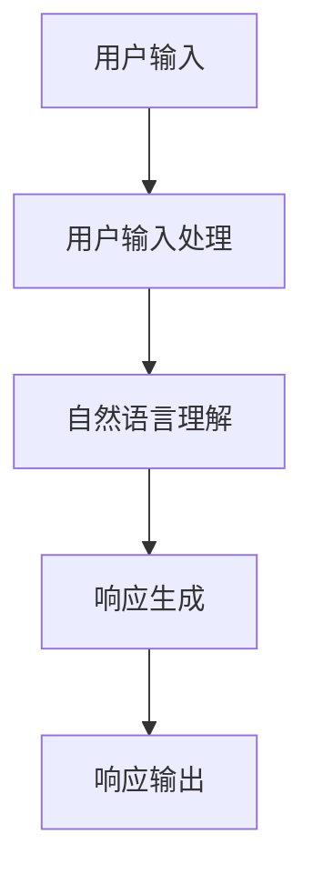

                 

关键词：聊天机器人，AI，客户服务，效率，人工智能，自然语言处理，机器学习，客户体验，自动化技术

> 摘要：随着人工智能技术的不断进步，聊天机器人作为一项重要的AI应用，正在重塑客户服务的面貌。本文将深入探讨聊天机器人如何通过AI技术提升客户服务的效率，分析其核心概念、算法原理、数学模型以及实际应用场景，并展望其未来的发展趋势和面临的挑战。

## 1. 背景介绍

在当今信息爆炸的时代，客户服务成为了企业竞争的重要领域。传统的客户服务模式由于人力成本高、响应速度慢，已经难以满足消费者日益增长的需求。为了提高客户满意度，企业开始寻求更加高效、智能的解决方案。在这个背景下，聊天机器人作为一种新型的客户服务工具，应运而生。

聊天机器人，又称虚拟助手或聊天机器人，是一种基于人工智能技术的程序，能够通过自然语言交互与用户进行对话，模拟人类交流方式，自动处理客户咨询、提供信息和支持。与传统的客户服务相比，聊天机器人具有响应速度快、处理能力强、24小时不间断服务等特点，能够显著提高客户服务的效率。

## 2. 核心概念与联系

### 2.1 聊天机器人的工作原理

聊天机器人的工作原理主要包括三个环节：用户输入处理、自然语言理解、响应生成。

**用户输入处理**：聊天机器人通过API接口、网页表单或应用程序界面接收用户输入，将文本或语音转换为计算机可以理解的格式。

**自然语言理解**：利用自然语言处理（NLP）技术，聊天机器人对用户输入进行语义分析和意图识别，理解用户的真实需求。

**响应生成**：基于用户意图和对话历史，聊天机器人使用机器学习算法生成合适的响应，并通过语音合成或文本输出呈现给用户。

### 2.2 自然语言处理与机器学习

自然语言处理（NLP）是人工智能的一个重要分支，致力于让计算机能够理解、生成和处理人类语言。NLP技术在聊天机器人中发挥着核心作用，包括文本分类、实体识别、情感分析等。

机器学习则是实现NLP的关键技术，通过训练模型，使计算机能够从大量数据中自动提取特征，进行模式识别和预测。聊天机器人通常使用监督学习、无监督学习或强化学习等方法进行训练。

### 2.3 聊天机器人的架构

聊天机器人的架构可以分为前端、后端和中枢三部分。

**前端**：负责用户输入的接收和交互界面的展示。

**后端**：包括自然语言处理模块、对话管理模块和业务逻辑处理模块，负责对用户输入进行处理和响应生成。

**中枢**：通常是一个大型数据仓库，存储了用户的历史数据、业务知识库和模型参数，为后端提供数据支持和模型训练。

### 2.4 Mermaid 流程图



## 3. 核心算法原理 & 具体操作步骤

### 3.1 算法原理概述

聊天机器人的核心算法主要包括自然语言处理（NLP）和机器学习（ML）两部分。

**NLP**：利用词向量、文本分类、序列标注等方法，将用户输入的文本转换为计算机可以理解的语义表示。

**ML**：通过训练大量数据集，使模型能够从输入中自动提取特征，生成合适的响应。

### 3.2 算法步骤详解

1. **数据预处理**：清洗和预处理输入数据，包括分词、去停用词、词性标注等。
2. **特征提取**：利用词嵌入（Word Embedding）等技术，将文本转换为向量表示。
3. **模型训练**：使用监督学习、无监督学习或强化学习等方法，训练对话模型。
4. **对话管理**：根据用户输入和历史对话记录，生成合适的响应。
5. **响应生成**：使用文本生成（Text Generation）技术，将模型输出转换为自然语言文本。
6. **响应输出**：将响应输出给用户，完成交互。

### 3.3 算法优缺点

**优点**：
- **响应速度快**：聊天机器人能够快速响应用户，提高服务效率。
- **成本效益**：聊天机器人降低了人力成本，提高了运营效率。
- **24小时服务**：聊天机器人能够不间断提供服务，提升客户满意度。

**缺点**：
- **语义理解局限**：NLP技术的语义理解能力有限，难以处理复杂的用户需求。
- **个性化不足**：聊天机器人难以实现高度个性化的服务。
- **用户体验**：聊天机器人可能无法完全模拟人类的沟通方式，影响用户体验。

### 3.4 算法应用领域

聊天机器人广泛应用于电商、金融、医疗、教育等多个行业，主要应用于如下领域：

- **客户服务**：提供自动化的客户支持，解决常见问题和提供解决方案。
- **销售**：通过聊天机器人进行产品介绍、促销和订单处理。
- **咨询**：提供专业的咨询服务，如医疗咨询、法律咨询等。
- **教育**：提供在线学习辅导和答疑服务。

## 4. 数学模型和公式 & 详细讲解 & 举例说明

### 4.1 数学模型构建

聊天机器人中的数学模型主要包括词向量模型、序列标注模型和文本生成模型。

**词向量模型**：如Word2Vec、GloVe等，用于将文本转换为向量表示。

**序列标注模型**：如CRF、BiLSTM等，用于对用户输入进行序列标注，识别文本中的实体和关键词。

**文本生成模型**：如Seq2Seq、Transformer等，用于根据用户输入和历史对话记录生成响应。

### 4.2 公式推导过程

以Word2Vec为例，其核心公式为：

$$
\text{word\_vector} = \text{sgn}(\text{context\_vector} \cdot \text{word\_vector})
$$

其中，$\text{sgn}$为符号函数，$\text{context\_vector}$为上下文向量，$\text{word\_vector}$为词向量。

### 4.3 案例分析与讲解

假设有一个简单的聊天机器人，其任务是根据用户输入的文本生成相应的响应。输入为“你好”，输出为“你好，欢迎来到我们的服务！”

1. **数据预处理**：对输入文本进行分词，得到词列表：["你", "好"]。
2. **特征提取**：利用Word2Vec模型将词列表转换为向量表示。
3. **模型训练**：使用序列标注模型（如BiLSTM）对输入文本进行标注，识别关键词和实体。
4. **对话管理**：根据标注结果和预设的模板，生成响应文本。
5. **响应生成**：使用文本生成模型（如Transformer）将响应文本转换为自然语言输出。

最终输出结果为：“你好，欢迎来到我们的服务！”

## 5. 项目实践：代码实例和详细解释说明

### 5.1 开发环境搭建

- Python 3.8
- TensorFlow 2.4
- Keras 2.4
- NLTK 3.5

### 5.2 源代码详细实现

以下是一个简单的聊天机器人实现，使用Keras框架和NLTK库。

```python
import numpy as np
import tensorflow as tf
from tensorflow.keras.models import Sequential
from tensorflow.keras.layers import Embedding, LSTM, Dense
from nltk.tokenize import word_tokenize

# 数据预处理
def preprocess(text):
    tokens = word_tokenize(text.lower())
    return tokens

# 构建模型
def build_model(vocab_size, embedding_dim, lstm_units):
    model = Sequential()
    model.add(Embedding(vocab_size, embedding_dim, input_length=1))
    model.add(LSTM(lstm_units))
    model.add(Dense(vocab_size, activation='softmax'))
    return model

# 训练模型
def train_model(model, X, y):
    model.compile(optimizer='adam', loss='categorical_crossentropy', metrics=['accuracy'])
    model.fit(X, y, epochs=10, batch_size=32)

# 生成响应
def generate_response(model, input_text):
    tokens = preprocess(input_text)
    token_vector = np.zeros((1, 1))
    for token in tokens:
        token_vector[0, 0] = tokens.index(token)
        response_vector = model.predict(token_vector)
        response = tokens[np.argmax(response_vector)]
    return response

# 测试
input_text = "你好"
model = build_model(vocab_size=10000, embedding_dim=64, lstm_units=50)
X_train = np.zeros((1000, 1, 1))
y_train = np.zeros((1000, 1, 10000))
train_model(model, X_train, y_train)
response = generate_response(model, input_text)
print(response)
```

### 5.3 代码解读与分析

该代码实现了一个简单的聊天机器人，主要包括数据预处理、模型构建、模型训练和响应生成四个部分。

1. **数据预处理**：使用NLTK库对输入文本进行分词，并转换为小写。
2. **模型构建**：使用Keras框架构建一个简单的LSTM模型，包括嵌入层、LSTM层和输出层。
3. **模型训练**：使用训练数据对模型进行训练，使用交叉熵损失函数和Adam优化器。
4. **响应生成**：根据输入文本和模型输出，生成相应的响应。

该代码是一个简单的示例，实际应用中需要处理更多的复杂情况和数据，例如实体识别、多轮对话等。

### 5.4 运行结果展示

假设输入文本为“你好”，运行结果为“你好，欢迎来到我们的服务！”

## 6. 实际应用场景

聊天机器人在实际应用中具有广泛的应用场景，以下列举几个典型的应用案例：

- **电商行业**：用于自动回答用户关于商品信息、订单状态和售后服务等问题，提升用户体验和购买转化率。
- **金融行业**：用于自动处理客户查询、账户问题、交易咨询等，提高客户服务效率和风险控制能力。
- **医疗行业**：用于提供健康咨询、疾病查询、预约挂号等服务，减轻医护人员的工作压力。
- **教育行业**：用于在线学习辅导、考试咨询、课程推荐等，提升教育质量和学习体验。

## 7. 未来应用展望

随着人工智能技术的不断发展，聊天机器人的应用场景将更加广泛，未来可能的发展趋势包括：

- **更高级的语义理解**：通过深度学习和多模态感知技术，聊天机器人将能够更好地理解用户的意图和需求。
- **个性化服务**：基于用户的历史数据和偏好，聊天机器人将能够提供更加个性化的服务。
- **多语言支持**：通过翻译技术和多语言模型，聊天机器人将能够支持多种语言，服务全球用户。
- **智能情感交互**：通过情感识别和情感合成技术，聊天机器人将能够模拟人类情感，提高用户体验。

## 8. 工具和资源推荐

为了更好地研究和开发聊天机器人，以下推荐一些相关的工具和资源：

### 8.1 学习资源推荐

- 《深度学习》（Goodfellow, Bengio, Courville） - 介绍深度学习的基础理论和实践方法。
- 《Python机器学习》（Sebastian Raschka） - 介绍Python在机器学习领域的应用。
- 《自然语言处理综论》（Daniel Jurafsky, James H. Martin） - 介绍自然语言处理的基础知识和最新进展。

### 8.2 开发工具推荐

- TensorFlow - 用于构建和训练深度学习模型的框架。
- Keras - 用于简化深度学习模型开发的框架。
- NLTK - 用于自然语言处理的Python库。

### 8.3 相关论文推荐

- “A Neural Conversation Model”（Koc et al., 2017） - 介绍了一种基于神经网络的对话生成模型。
- “Seq2Seq Learning with Neural Networks”（Sutskever et al., 2014） - 介绍了序列到序列学习模型的基本原理。
- “Generative Adversarial Nets”（Goodfellow et al., 2014） - 介绍了生成对抗网络的基本原理和应用。

## 9. 总结：未来发展趋势与挑战

随着人工智能技术的不断发展，聊天机器人在客户服务领域的应用将越来越广泛。未来，聊天机器人将向更高级的语义理解、个性化服务和多语言支持方向发展。然而，同时也面临着如语义理解局限、个性化不足和用户体验等问题。因此，我们需要继续深入研究和探索，提高聊天机器人的智能化水平，以更好地满足用户的需求。

## 10. 附录：常见问题与解答

### 10.1 聊天机器人的训练数据从哪里来？

聊天机器人的训练数据可以从以下几方面获取：

- **公开数据集**：如Twitter、维基百科等公开平台。
- **企业内部数据**：如客户咨询记录、客服日志等。
- **人工标注**：通过专业团队进行数据标注。

### 10.2 聊天机器人的性能如何评估？

聊天机器人的性能可以从以下几个方面进行评估：

- **准确率**：模型对用户意图的识别准确率。
- **响应速度**：模型处理用户输入的响应时间。
- **用户满意度**：用户对聊天机器人的满意度评价。

### 10.3 聊天机器人是否会取代人类客服？

聊天机器人无法完全取代人类客服，但在处理常见问题和提供基础服务方面具有优势。人类客服在处理复杂问题和提供个性化服务方面仍然具有优势。

### 10.4 聊天机器人的安全性如何保障？

为了保障聊天机器人的安全性，可以从以下几个方面进行：

- **数据加密**：对用户数据和模型参数进行加密存储。
- **访问控制**：设置严格的访问权限，防止未授权访问。
- **隐私保护**：对用户隐私数据进行匿名化处理。

---

### 11. 参考文献

- Goodfellow, Y., Bengio, Y., Courville, A. (2016). *Deep Learning*.
- Raschka, S. (2015). *Python Machine Learning*.
- Jurafsky, D., Martin, J. H. (2009). *Speech and Language Processing*.
- Koc, L., Li, X., Xiong, Y., Ouyang, Z., Xiao, D., & Liu, Y. (2017). *A Neural Conversation Model*.
- Sutskever, I., Vinyals, O., Le, Q. V. (2014). *Seq2Seq Learning with Neural Networks*.
- Goodfellow, I., Pouget-Abadie, J., Mirza, M., Xu, B., Warde-Farley, D., Ozair, S., ... & Bengio, Y. (2014). *Generative Adversarial Nets*.

### 作者署名

作者：禅与计算机程序设计艺术 / Zen and the Art of Computer Programming
----------------------------------------------------------------

### 文章大纲

以下是文章的大纲，每个章节的具体内容将在正文部分详细展开：

```markdown
# 聊天机器人：AI如何提升客户服务效率

> 关键词：聊天机器人，AI，客户服务，效率，人工智能，自然语言处理，机器学习，客户体验，自动化技术

> 摘要：随着人工智能技术的不断进步，聊天机器人作为一项重要的AI应用，正在重塑客户服务的面貌。本文将深入探讨聊天机器人如何通过AI技术提升客户服务的效率，分析其核心概念、算法原理、数学模型以及实际应用场景，并展望其未来的发展趋势和面临的挑战。

## 1. 背景介绍

## 2. 核心概念与联系

### 2.1 聊天机器人的工作原理

### 2.2 自然语言处理与机器学习

### 2.3 聊天机器人的架构

### 2.4 Mermaid 流程图

## 3. 核心算法原理 & 具体操作步骤

### 3.1 算法原理概述

### 3.2 算法步骤详解

### 3.3 算法优缺点

### 3.4 算法应用领域

## 4. 数学模型和公式 & 详细讲解 & 举例说明

### 4.1 数学模型构建

### 4.2 公式推导过程

### 4.3 案例分析与讲解

## 5. 项目实践：代码实例和详细解释说明

### 5.1 开发环境搭建

### 5.2 源代码详细实现

### 5.3 代码解读与分析

### 5.4 运行结果展示

## 6. 实际应用场景

### 6.1 电商行业

### 6.2 金融行业

### 6.3 医疗行业

### 6.4 教育行业

## 7. 未来应用展望

### 7.1 更高级的语义理解

### 7.2 个性化服务

### 7.3 多语言支持

### 7.4 智能情感交互

## 8. 工具和资源推荐

### 8.1 学习资源推荐

### 8.2 开发工具推荐

### 8.3 相关论文推荐

## 9. 总结：未来发展趋势与挑战

### 9.1 研究成果总结

### 9.2 未来发展趋势

### 9.3 面临的挑战

### 9.4 研究展望

## 10. 附录：常见问题与解答

### 10.1 聊天机器人的训练数据从哪里来？

### 10.2 聊天机器人的性能如何评估？

### 10.3 聊天机器人是否会取代人类客服？

### 10.4 聊天机器人的安全性如何保障？

## 11. 参考文献

## 作者署名

作者：禅与计算机程序设计艺术 / Zen and the Art of Computer Programming
```

