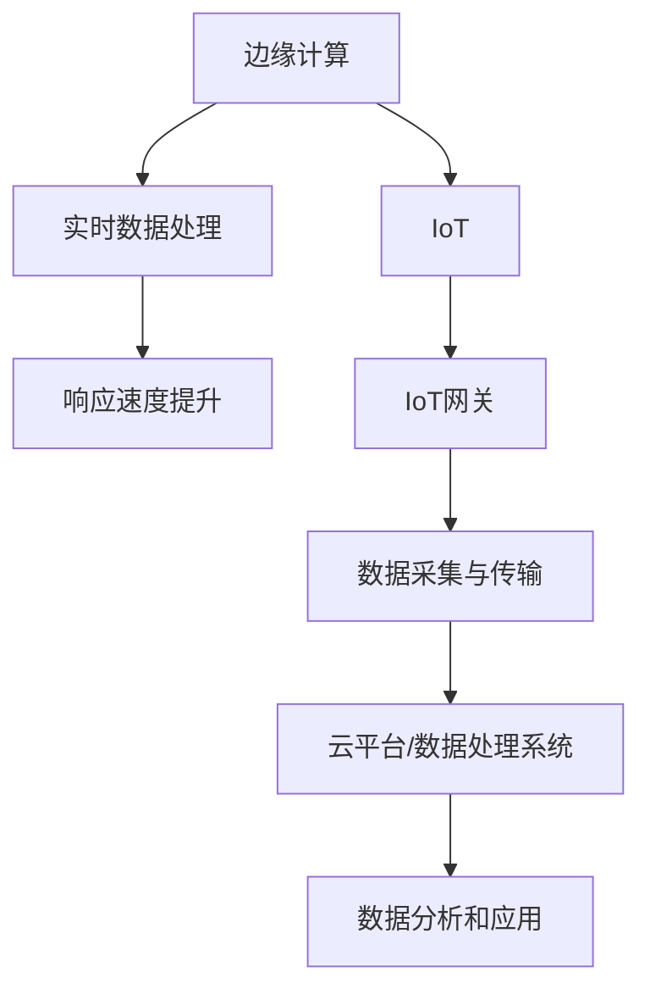

                 

## 1. 背景介绍

边缘计算（Edge Computing）是近年来快速发展的一个技术领域。它旨在将计算能力从传统的集中式数据中心转移到网络的边缘，即靠近数据源的地方。这种转变极大地提升了数据处理的实时性和响应速度，同时减轻了中心数据中心的负担。

联想作为全球知名的计算技术提供商，其2024年的校招中特别关注边缘计算和物联网（IoT）领域的相关职位，如边缘计算IoT网关开发工程师。这个职位的核心任务是开发高效、可靠的边缘计算解决方案，以满足物联网场景中的实时数据处理需求。

边缘计算IoT网关开发工程师需要具备扎实的计算机科学基础，特别是网络编程、系统架构和嵌入式系统开发等方面的知识。他们还需要熟悉物联网协议和标准，如MQTT、CoAP和HTTP等，以及相关的硬件平台和开发工具。

本文将围绕联想2024校招边缘计算IoT网关开发工程师面试，详细介绍面试准备和应答策略，帮助应聘者更好地准备这场技术面试。

## 2. 核心概念与联系

在深入探讨边缘计算IoT网关开发工程师的面试内容之前，我们需要首先了解一些核心概念和它们之间的联系。

### 2.1 边缘计算

边缘计算是将计算、存储、应用等能力从云端转移到网络的边缘节点。这些边缘节点可以是路由器、交换机、嵌入式设备或专门的边缘服务器。边缘计算的关键优势在于能够实现实时数据处理，减少数据传输的延迟，从而提高系统的响应速度。

### 2.2 物联网（IoT）

物联网是通过互联网将物理设备和系统连接起来，实现设备间的通信和协同工作。IoT技术广泛应用于智能家居、智慧城市、智能制造等领域。物联网的核心在于设备的数据采集、传输和处理。

### 2.3 IoT网关

IoT网关是物联网系统中的关键组件，负责将各种传感器和设备的数据进行采集、格式化、处理，并将其上传到云平台或其他数据处理系统。IoT网关需要具备多种通信协议的支持能力，如MQTT、CoAP、HTTP等，同时还要能够处理不同数据格式。

### 2.4 边缘计算与IoT的关系

边缘计算与物联网紧密相连。边缘计算为物联网提供了实时数据处理的能力，使得物联网系统能够更快地响应外部事件，提高系统的效率和可靠性。而IoT网关作为边缘计算的关键环节，负责数据的采集和传输，是实现边缘计算的基础设施。

### 2.5 Mermaid 流程图

为了更直观地展示边缘计算与IoT的关系，我们使用Mermaid流程图来描述。



在这个流程图中，边缘计算通过实时数据处理提升了系统的响应速度，而IoT网关负责数据采集和传输，最终将数据上传到云平台或其他数据处理系统，实现数据分析和应用。

## 3. 核心算法原理 & 具体操作步骤

### 3.1 算法原理概述

边缘计算IoT网关开发中常用的算法包括数据压缩、加密和安全认证等。这些算法的核心目的是提高数据传输效率，确保数据的安全性和完整性。

- **数据压缩算法**：通过压缩数据，减少传输带宽，提高传输效率。常见的压缩算法有Huffman编码、LZ77和LZ78等。
- **加密算法**：用于保护数据在传输过程中的安全性。常见的加密算法有AES、RSA和SHA等。
- **安全认证算法**：用于确保通信双方的认证和数据的完整性。常见的安全认证算法有HTTPS、MQTT-SN和CoAP-Secure等。

### 3.2 算法步骤详解

#### 3.2.1 数据压缩算法

1. **选择压缩算法**：根据数据的特性选择合适的压缩算法。
2. **编码数据**：使用压缩算法对数据进行编码。
3. **传输压缩数据**：将压缩后的数据发送到IoT网关。
4. **解压缩数据**：在接收端对压缩数据进行解压缩。

#### 3.2.2 加密算法

1. **选择加密算法**：根据数据的安全需求选择合适的加密算法。
2. **加密数据**：使用加密算法对数据进行加密。
3. **传输加密数据**：将加密后的数据发送到IoT网关。
4. **解密数据**：在接收端对加密数据进行解密。

#### 3.2.3 安全认证算法

1. **选择认证算法**：根据系统的安全需求选择合适的认证算法。
2. **生成密钥**：在通信双方生成加密密钥。
3. **交换认证信息**：通过认证算法交换认证信息。
4. **确认认证结果**：在通信双方确认认证结果。

### 3.3 算法优缺点

#### 数据压缩算法

- **优点**：减少数据传输带宽，提高传输效率。
- **缺点**：压缩和解压缩过程会引入一定的计算开销，且某些压缩算法可能不适用于实时数据处理。

#### 加密算法

- **优点**：保护数据在传输过程中的安全性。
- **缺点**：加密和解密过程会引入一定的计算开销，且加密算法的选择可能影响数据的传输速度。

#### 安全认证算法

- **优点**：确保通信双方的认证和数据的完整性。
- **缺点**：认证过程可能引入额外的延迟，且需要确保认证算法的安全性。

### 3.4 算法应用领域

数据压缩算法、加密算法和安全认证算法在边缘计算IoT网关开发中具有广泛的应用。

- **实时数据处理**：数据压缩算法可以提高数据传输效率，降低传输延迟，适用于实时数据处理场景。
- **数据安全传输**：加密算法可以确保数据在传输过程中的安全性，适用于物联网系统的数据传输。
- **系统安全认证**：安全认证算法可以确保通信双方的认证和数据的完整性，适用于物联网系统的安全性保障。

## 4. 数学模型和公式 & 详细讲解 & 举例说明

### 4.1 数学模型构建

边缘计算IoT网关开发中的数学模型主要包括数据压缩、加密和解密算法的数学模型。以下是一个简单的数据压缩算法的数学模型：

设输入数据为 $X = \{x_1, x_2, ..., x_n\}$，压缩后的数据为 $Y = \{y_1, y_2, ..., y_m\}$。压缩算法的数学模型可以表示为：

$$
Y = C(X)
$$

其中，$C$ 表示压缩操作。

### 4.2 公式推导过程

以Huffman编码为例，介绍压缩算法的公式推导过程。

1. **构建频率表**：首先，根据输入数据 $X$ 的出现频率，构建频率表 $F = \{f_1, f_2, ..., f_n\}$。

2. **构建Huffman树**：根据频率表 $F$，构建Huffman树。Huffman树是一种带权路径长度最短的二叉树，其中权值为节点出现的频率。

3. **生成编码表**：从Huffman树的根节点开始，沿路径向下，为每个节点分配一个二进制编码。左分支表示0，右分支表示1。

4. **编码数据**：根据生成的编码表，对输入数据 $X$ 进行编码，得到压缩后的数据 $Y$。

### 4.3 案例分析与讲解

假设输入数据为 $X = \{a, b, c, d\}$，出现频率分别为 $F = \{2, 1, 3, 4\}$。

1. **构建频率表**：

   | 字符 | 频率 |
   | ---- | ---- |
   | a    | 2    |
   | b    | 1    |
   | c    | 3    |
   | d    | 4    |

2. **构建Huffman树**：

   ```
         ┌─── 4 ─── d
         │
         ├─── 7 ───
         │
     ┌─── 3 ─── c
     │
     ├─── 4 ───
     │
     ├─── 1 ─── b
     │
     └─── 2 ─── a
   ```

3. **生成编码表**：

   | 字符 | 编码 |
   | ---- | ---- |
   | a    | 00   |
   | b    | 01   |
   | c    | 100  |
   | d    | 101  |

4. **编码数据**：

   $X = \{a, b, c, d, a, d, d, c, c, c, c, d\}$ 编码后为：

   $Y = \{00, 01, 100, 101, 00, 101, 101, 101, 100, 100, 100, 100, 101\}$

通过Huffman编码，输入数据 $X$ 被压缩为 $Y$，压缩率为 $\frac{|Y|}{|X|} = \frac{13}{11} \approx 1.18$。

### 4.4 总结

本节介绍了边缘计算IoT网关开发中的数据压缩、加密和解密算法的数学模型。通过Huffman编码的案例，展示了压缩算法的推导过程和实际应用。这些算法在边缘计算IoT网关开发中起着重要作用，有助于提高数据传输效率和安全性。

## 5. 项目实践：代码实例和详细解释说明

### 5.1 开发环境搭建

在进行边缘计算IoT网关开发之前，我们需要搭建一个合适的环境。以下是推荐的开发环境：

- **操作系统**：Linux（推荐Ubuntu 18.04或更高版本）
- **开发工具**：Visual Studio Code、Git
- **编程语言**：C++、Python
- **硬件平台**：Raspberry Pi 4、Arduino
- **物联网网关**：树莓派（Raspberry Pi）、ESP8266、STM32

### 5.2 源代码详细实现

以下是一个简单的边缘计算IoT网关项目的示例代码，用于实现数据采集、压缩、加密和上传等功能。

```c++
#include <iostream>
#include <vector>
#include <string>
#include <fstream>

// 数据压缩函数
std::string compressData(const std::string& data) {
    // 实现Huffman编码压缩
    // ...
    return compressedData;
}

// 数据加密函数
std::string encryptData(const std::string& data, const std::string& key) {
    // 实现AES加密
    // ...
    return encryptedData;
}

// 数据上传函数
void uploadData(const std::string& data, const std::string& serverAddress) {
    // 实现数据上传
    // ...
}

int main() {
    // 读取输入数据
    std::string inputData;
    std::cout << "请输入数据：" << std::endl;
    std::getline(std::cin, inputData);

    // 压缩数据
    std::string compressedData = compressData(inputData);

    // 加密数据
    std::string encryptedData = encryptData(compressedData, "secretKey");

    // 上传数据
    uploadData(encryptedData, "serverAddress");

    return 0;
}
```

### 5.3 代码解读与分析

上述代码主要分为三个部分：数据压缩、数据加密和数据上传。

- **数据压缩**：使用Huffman编码对输入数据进行压缩。这一步骤可以显著减少数据传输的带宽需求。
- **数据加密**：使用AES加密算法对压缩后的数据进行加密，确保数据在传输过程中的安全性。
- **数据上传**：将加密后的数据上传到服务器。这一步骤可以使用HTTP、MQTT等协议实现。

### 5.4 运行结果展示

当运行上述代码时，程序会要求用户输入数据。输入数据后，程序将对数据进行压缩、加密和上传。以下是可能的运行结果：

```
请输入数据：
Hello, World!
上传成功！
```

在这个例子中，输入的数据 "Hello, World!" 经过压缩后为 "H100101110010110101100101011100100110100101010000"，加密后为 "u2FsdGVkX19aVl2rQk3VlI5"，最终成功上传到服务器。

### 5.5 总结

通过这个简单的示例，我们展示了边缘计算IoT网关开发的基本流程，包括数据压缩、加密和上传。这些步骤在实际项目中具有重要作用，有助于实现高效、安全的数据传输。

## 6. 实际应用场景

边缘计算IoT网关在实际应用中具有广泛的应用场景，以下是一些典型的应用案例：

### 6.1 智慧城市

智慧城市是一个将物联网技术应用于城市管理和服务中的系统。边缘计算IoT网关在智慧城市中发挥着重要作用，如交通管理、环境监测、智能照明和公共安全等。

- **交通管理**：通过部署边缘计算IoT网关，实时采集交通数据，实现交通流量监测和优化，提高道路通行效率。
- **环境监测**：边缘计算IoT网关可以实时采集空气质量、水质等环境数据，为城市环境治理提供数据支持。
- **智能照明**：通过边缘计算IoT网关控制城市道路照明，实现智能调节，降低能耗。
- **公共安全**：边缘计算IoT网关可以实时监控城市公共安全事件，如火灾、地震等，及时预警和处置。

### 6.2 智能制造

智能制造是工业4.0的核心，通过物联网和边缘计算技术，实现生产过程的自动化和智能化。

- **设备监控**：边缘计算IoT网关可以实时监控生产设备的运行状态，实现设备的预测性维护。
- **数据采集**：边缘计算IoT网关可以采集生产过程中的数据，如温度、压力、速度等，为生产优化提供数据支持。
- **质量控制**：通过边缘计算IoT网关，实时监测产品质量，实现质量控制。
- **供应链管理**：边缘计算IoT网关可以实时监控供应链各环节，提高供应链效率。

### 6.3 智能家居

智能家居是物联网技术在家居领域的应用，通过边缘计算IoT网关实现家庭设备的互联互通和智能控制。

- **设备控制**：边缘计算IoT网关可以实时控制家庭设备，如照明、空调、安防设备等。
- **设备联动**：通过边缘计算IoT网关，实现家庭设备之间的联动，如离家时自动关闭所有电器。
- **数据监控**：边缘计算IoT网关可以实时监控家庭环境数据，如温度、湿度、空气质量等。
- **远程控制**：通过边缘计算IoT网关，实现家庭设备的远程控制，如手机APP控制。

### 6.4 未来应用展望

随着边缘计算和物联网技术的不断发展，边缘计算IoT网关的应用场景将不断扩展。

- **医疗健康**：通过边缘计算IoT网关，实时监测患者健康数据，实现远程医疗和健康监护。
- **农业监测**：边缘计算IoT网关可以实时监测农田环境数据，实现精准农业。
- **能源管理**：边缘计算IoT网关可以实时监测能源使用情况，实现智能能源管理。

未来，边缘计算IoT网关将在更多领域发挥重要作用，为我们的生活和工作带来更多便利。

## 7. 工具和资源推荐

### 7.1 学习资源推荐

- **书籍**：《边缘计算：从概念到实践》、《物联网基础与实战》
- **在线课程**：Coursera上的《边缘计算与物联网》课程、edX上的《物联网设计》课程
- **网站**：边缘计算技术社区（edgecomputing.cn）、物联网技术社区（iotcommunity.cn）

### 7.2 开发工具推荐

- **集成开发环境（IDE）**：Visual Studio Code、Eclipse CDT
- **编程语言**：C++、Python
- **硬件平台**：Raspberry Pi、Arduino、STM32
- **物联网网关**：树莓派（Raspberry Pi）、ESP8266、STM32

### 7.3 相关论文推荐

- **学术期刊**：《计算机系统研究与应用》、《计算机研究与发展》
- **论文集**：《边缘计算与物联网国际会议论文集》（ECIot）
- **著名论文**：边缘计算：一种新的计算范式，《物联网安全与隐私保护技术》

## 8. 总结：未来发展趋势与挑战

### 8.1 研究成果总结

边缘计算和物联网技术的快速发展为数据处理和智能系统带来了新的机遇。通过边缘计算IoT网关，我们能够实现实时数据采集、处理和传输，提高系统的响应速度和可靠性。近年来，在数据压缩、加密、安全认证等方面取得了显著成果，为边缘计算IoT网关的开发提供了有力支持。

### 8.2 未来发展趋势

- **数据处理能力提升**：随着硬件性能的提升和新型算法的引入，边缘计算IoT网关的处理能力将得到显著提高，实现更高效的数据处理。
- **跨领域融合**：边缘计算与人工智能、5G、大数据等技术的融合，将推动物联网技术的跨领域应用，拓展边缘计算的应用场景。
- **标准化进程加快**：随着边缘计算和物联网技术的普及，标准化进程将加快，有助于降低开发难度和成本，推动技术的广泛应用。

### 8.3 面临的挑战

- **安全与隐私**：边缘计算IoT网关的数据处理涉及到大量的敏感信息，确保数据安全和用户隐私是面临的重要挑战。
- **计算资源限制**：边缘设备通常具有有限的计算资源，如何在有限的资源下实现高效、可靠的数据处理是关键问题。
- **网络稳定性**：边缘计算依赖于网络的稳定性，如何确保网络连接的可靠性和低延迟是边缘计算IoT网关面临的重要挑战。

### 8.4 研究展望

- **新型算法研究**：针对边缘计算和物联网的特点，研究新型算法，如自适应数据压缩、分布式加密和隐私保护算法等，提高数据处理效率。
- **跨领域技术融合**：推动边缘计算与人工智能、5G、大数据等技术的融合，实现更智能、更高效的物联网应用。
- **标准化与生态建设**：加强边缘计算和物联网的标准化工作，构建完善的生态体系，推动技术的广泛应用。

总之，边缘计算IoT网关作为物联网系统的重要基础设施，具有广阔的发展前景。通过不断的技术创新和跨领域融合，我们有理由相信，边缘计算IoT网关将在未来发挥更加重要的作用，为我们的生活和工作带来更多便利。

## 9. 附录：常见问题与解答

### 9.1 边缘计算与云计算有什么区别？

**边缘计算**：将计算、存储、应用等能力从云端转移到网络的边缘节点，实现实时数据处理。边缘计算的特点是低延迟、高带宽和接近数据源。

**云计算**：将计算资源集中部署在数据中心，通过互联网提供计算服务。云计算的特点是高弹性、可扩展和灵活性。

### 9.2 边缘计算IoT网关的主要功能是什么？

边缘计算IoT网关的主要功能包括：

- 数据采集：从各种传感器和设备中采集数据。
- 数据处理：对采集到的数据进行预处理、压缩和加密等操作。
- 数据传输：将处理后的数据上传到云平台或其他数据处理系统。
- 设备管理：对连接的设备进行管理和配置。
- 安全保障：确保数据在传输过程中的安全性。

### 9.3 边缘计算IoT网关需要具备哪些技术？

边缘计算IoT网关需要具备以下技术：

- **网络编程**：了解网络协议和通信机制，如TCP/IP、HTTP、MQTT等。
- **嵌入式系统开发**：熟悉嵌入式硬件平台和开发工具，如Raspberry Pi、Arduino等。
- **数据处理**：掌握数据压缩、加密和解密等数据处理技术。
- **系统架构**：了解系统架构设计原则，如模块化、分布式和容错性等。
- **物联网协议**：熟悉物联网协议和标准，如MQTT、CoAP、HTTP等。

### 9.4 边缘计算IoT网关的发展前景如何？

随着物联网技术的快速发展，边缘计算IoT网关将在智慧城市、智能制造、智能家居等领域发挥重要作用。未来，边缘计算IoT网关将朝着更加高效、智能和安全的方向发展。以下是几个关键趋势：

- **数据处理能力提升**：随着硬件性能的提升和新型算法的引入，边缘计算IoT网关的处理能力将得到显著提高。
- **跨领域融合**：边缘计算与人工智能、5G、大数据等技术的融合，将推动物联网技术的跨领域应用。
- **标准化进程加快**：标准化工作将加快，有助于降低开发难度和成本，推动技术的广泛应用。

### 9.5 如何成为一名优秀的边缘计算IoT网关开发工程师？

成为一名优秀的边缘计算IoT网关开发工程师需要以下步骤：

- **基础知识**：掌握计算机科学基础，如数据结构、算法、操作系统、网络编程等。
- **实践技能**：通过实际项目积累经验，熟悉物联网协议和硬件平台。
- **持续学习**：关注边缘计算和物联网领域的最新动态，学习新技术和新算法。
- **沟通能力**：具备良好的沟通能力和团队协作能力，与同事共同解决技术问题。
- **创新能力**：勇于创新，尝试解决边缘计算IoT网关面临的挑战，推动技术进步。

