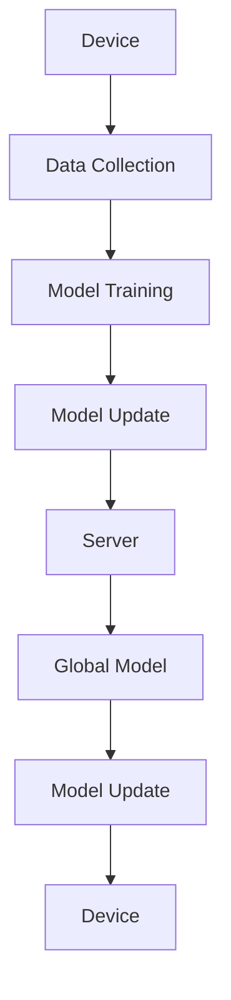

                 

联邦学习（Federated Learning）作为一种分布式机器学习技术，近年来在学术界和工业界受到了广泛关注。它允许多个设备在本地进行模型训练，并将更新汇集起来，以在中央服务器上训练全局模型。这种技术的核心优势在于能够在不共享用户数据的情况下提高模型性能，保护用户隐私，并降低数据传输成本。

本文将详细介绍联邦学习的原理、核心算法、数学模型，并通过实际代码实例讲解其实现过程。文章还将探讨联邦学习的应用领域、未来发展趋势及面临的挑战。

## 文章关键词

- 联邦学习
- 分布式机器学习
- 用户隐私保护
- 全局模型训练
- 本地模型更新
- 数学模型
- 代码实例

## 文章摘要

本文首先介绍了联邦学习的背景和核心概念，然后深入分析了其工作原理和算法步骤。接着，文章讲解了联邦学习中的数学模型和公式，并通过实际代码实例进行了详细解释。最后，文章探讨了联邦学习的应用场景和未来发展方向。

## 1. 背景介绍

随着移动设备、物联网、智能传感器等技术的快速发展，数据生成和收集的速度达到了前所未有的高度。然而，随之而来的是数据隐私和安全的问题。传统的集中式机器学习方法需要在中央服务器上存储和处理所有用户数据，这增加了数据泄露的风险。为了解决这一问题，联邦学习应运而生。

联邦学习是一种分布式机器学习方法，它允许多个设备在本地进行模型训练，并将本地模型更新发送到中央服务器。中央服务器汇总这些更新，以训练全局模型。这样，设备不需要共享原始数据，只需共享模型更新，从而保护了用户隐私。

### 联邦学习的起源

联邦学习的概念最早由Google在2016年提出，并在其后的几年里得到了快速发展。Google在其论文《Federated Learning: Concept and Applications》中详细介绍了联邦学习的基本原理和实现方法。

### 联邦学习的核心优势

- **用户隐私保护**：联邦学习不需要将原始数据传输到中央服务器，从而降低了数据泄露的风险。
- **数据传输效率**：通过本地训练和更新，联邦学习显著降低了数据传输的带宽需求。
- **协同学习**：多个设备可以共同训练一个全局模型，提高了模型性能。

### 联邦学习的应用场景

联邦学习适用于多个领域，包括但不限于：
- **移动设备**：如智能手机、平板电脑等。
- **物联网**：如智能家电、智能医疗设备等。
- **社交媒体**：如图像识别、文本分类等。

## 2. 核心概念与联系

### 联邦学习的基本概念

联邦学习涉及多个参与方，包括设备（例如智能手机或传感器）和中央服务器。每个设备在本地训练模型，并将模型更新发送到服务器。服务器汇总这些更新，以训练全局模型。

### 联邦学习的架构

联邦学习的架构通常包括以下几个关键组件：

1. **设备（Device）**：负责本地数据收集和模型训练。
2. **中央服务器（Server）**：负责接收设备发送的模型更新，并汇总训练全局模型。
3. **全局模型（Global Model）**：由中央服务器维护，用于指导设备进行本地训练。
4. **本地模型（Local Model）**：在每个设备上维护的模型副本，用于本地训练。

### Mermaid 流程图

下面是一个简化的联邦学习流程图，展示了设备、中央服务器和全局模型之间的交互：



在这个流程中，设备首先收集本地数据，然后使用全局模型进行训练。训练完成后，设备将模型更新发送到服务器。服务器接收这些更新，并使用它们更新全局模型。最后，服务器将更新后的全局模型发送回设备，以指导下一轮的本地训练。

## 3. 核心算法原理 & 具体操作步骤

### 3.1 算法原理概述

联邦学习算法的核心思想是利用分布式设备进行协同训练，以实现全局模型的最优性能。具体来说，算法分为以下几个主要步骤：

1. **初始化全局模型**：中央服务器初始化全局模型，并将其分发到各个设备。
2. **本地训练**：设备使用本地数据和全局模型进行训练，生成模型更新。
3. **模型更新传输**：设备将模型更新发送到中央服务器。
4. **全局模型更新**：中央服务器汇总所有设备发送的模型更新，并更新全局模型。
5. **模型分发**：中央服务器将更新后的全局模型分发回设备。

### 3.2 算法步骤详解

下面是联邦学习算法的具体步骤：

#### 3.2.1 初始化全局模型

```python
# 初始化全局模型
global_model = initialize_global_model()
send_global_model_to_devices(global_model)
```

#### 3.2.2 本地训练

```python
# 设备端：本地训练
device_data = load_local_data()
local_model = initialize_local_model()
for epoch in range(num_epochs):
    local_model = train_on_local_data(local_model, device_data)
send_local_model_update_to_server(local_model)
```

#### 3.2.3 模型更新传输

```python
# 设备端：发送模型更新
receive_global_model()
local_model = train_on_local_data(local_model, device_data)
send_local_model_update_to_server(local_model)
```

#### 3.2.4 全局模型更新

```python
# 服务器端：接收模型更新
for device_model_update in receive_model_updates():
    global_model = aggregate_model_updates(global_model, device_model_update)
```

#### 3.2.5 模型分发

```python
# 服务器端：分发全局模型
send_global_model_to_devices(global_model)
```

### 3.3 算法优缺点

#### 优点

- **隐私保护**：设备不需要上传原始数据，只需上传模型更新，从而降低了数据泄露的风险。
- **低带宽需求**：由于仅上传模型更新，大大降低了数据传输的带宽需求。
- **高效协同**：设备可以独立训练，然后协同更新全局模型，提高了模型训练的效率。

#### 缺点

- **通信开销**：每次更新都需要传输模型参数，增加了通信开销。
- **模型同步**：需要确保所有设备使用相同的全局模型进行训练，这可能会增加同步的开销。
- **计算开销**：设备需要在本地进行模型训练，这可能增加计算资源的需求。

### 3.4 算法应用领域

联邦学习适用于多个领域，包括但不限于：

- **移动设备**：如智能手机、平板电脑等。
- **物联网**：如智能家电、智能医疗设备等。
- **社交媒体**：如图像识别、文本分类等。

## 4. 数学模型和公式 & 详细讲解 & 举例说明

### 4.1 数学模型构建

联邦学习中的数学模型主要包括两部分：全局模型和本地模型。全局模型是所有设备共同训练的目标，而本地模型则是每个设备在本地训练的模型。

#### 全局模型

全局模型通常表示为参数向量θ，其中θ=(θ1, θ2, ..., θn)。这些参数决定了模型的权重和偏置。

#### 本地模型

本地模型也通常表示为参数向量θ，其中θ=(θ1, θ2, ..., θn)。每个设备的本地模型参数可能略有不同，以适应其特定的数据分布。

### 4.2 公式推导过程

在联邦学习过程中，中央服务器需要根据设备发送的模型更新来更新全局模型。为了推导全局模型的更新公式，我们需要考虑以下几个关键因素：

- **本地损失函数**：每个设备在本地训练时使用的损失函数。
- **全局损失函数**：中央服务器维护的全局损失函数。
- **模型更新**：每个设备发送到中央服务器的模型更新。

设设备i的本地损失函数为L_i(θ_i)，全局损失函数为L(θ)，设备i发送到中央服务器的模型更新为Δθ_i。根据联邦学习的基本原理，我们可以推导出全局模型更新公式：

Δθ = aggregate(Δθ_i)

其中，aggregate表示对多个模型更新进行汇总。具体来说，我们可以使用梯度下降法来更新全局模型：

θ = θ - learning_rate * Δθ

其中，learning_rate为学习率，控制模型更新的步长。

### 4.3 案例分析与讲解

为了更好地理解联邦学习的数学模型和公式，我们来看一个简单的线性回归案例。

#### 案例背景

假设我们有一个包含两个特征的线性回归问题，目标是通过训练模型来预测房价。我们将使用一个包含100个训练样本的本地数据集。

#### 模型构建

全局模型表示为θ=(θ1, θ2)，其中θ1为第一特征的权重，θ2为第二特征的权重。

本地模型也为θ=(θ1, θ2)，但在每个设备上略有不同。

#### 模型训练

在每个设备上，我们使用本地数据集训练本地模型。设本地损失函数为L_i(θ_i) = (1/2) * ||θ_i * x_i - y_i||^2，其中x_i为本地数据集的一个样本，y_i为该样本的标签。

#### 模型更新

在每个设备上，我们计算本地模型的梯度：

Δθ_i = -learning_rate * ∇θ_i L_i(θ_i)

其中，∇θ_i表示对θ_i求梯度。

#### 全局模型更新

中央服务器接收所有设备发送的模型更新，并使用梯度下降法更新全局模型：

Δθ = aggregate(Δθ_i)

θ = θ - learning_rate * Δθ

#### 模型优化

通过迭代上述步骤，我们可以不断优化全局模型，直到达到预定的损失函数阈值或达到预定的迭代次数。

## 5. 项目实践：代码实例和详细解释说明

在本节中，我们将通过一个简单的联邦学习项目实例来详细讲解其实现过程。本实例将使用Python编写，并使用TensorFlow Federated（TFF）库来实现联邦学习算法。TFF是一个开源库，旨在简化联邦学习的实现。

### 5.1 开发环境搭建

在开始编写代码之前，我们需要搭建开发环境。以下是搭建开发环境的步骤：

1. **安装TensorFlow Federated**：

   ```bash
   pip install tensorflow-federated
   ```

2. **安装TensorFlow**：

   ```bash
   pip install tensorflow
   ```

确保安装了以上两个库后，我们可以开始编写代码。

### 5.2 源代码详细实现

以下是实现联邦学习项目的源代码：

```python
import tensorflow as tf
import tensorflow_federated as tff

# 5.2.1 定义本地模型
def create_keras_model():
    model = tf.keras.Sequential([
        tf.keras.layers.Dense(units=1, input_shape=(1,))
    ])
    model.compile(loss='mean_squared_error', optimizer=tf.keras.optimizers.SGD(0.01), metrics=['mean_absolute_error'])
    return model

# 5.2.2 定义本地训练函数
def federated_train(dataset_fn, model_fn, client_batch_size, server_optimizer_fn, server_loss_fn, num_rounds):
    clients = tff.simulation.datasets.RandomData.create(client_batch_size)
    train_iter = clients.train.create_tf_dataset_for_client_fn(lambda c: dataset_fn(c))
    
    model_fn = tff.learning.from_keras_model(model_fn, server_optimizer_fn, server_loss_fn)
    server_state = model_fn.initialize()

    for _ in range(num_rounds):
        server_state = federated_train_round(server_state, model_fn, train_iter)
    
    return server_state

# 5.2.3 实现联邦学习算法
def federated_train_round(server_state, model_fn, train_iter):
    train_data = [tff.learning.DataiterForClient(client_data, label=None) for client_data in train_iter]
    server_state = model_fn.next(server_state, train_data)
    return server_state

# 5.2.4 主函数
def main():
    client_batch_size = 100
    server_optimizer_fn = tff.learning.optimizers.create_adam(learning_rate=0.01)
    server_loss_fn = tff.learning.losses.sequential_mean

    num_rounds = 10

    server_state = federated_train(lambda c: tff.simulation.datasets.RandomData.create(c, client_batch_size),
                                   create_keras_model,
                                   client_batch_size,
                                   server_optimizer_fn,
                                   server_loss_fn,
                                   num_rounds)

if __name__ == '__main__':
    main()
```

### 5.3 代码解读与分析

#### 5.3.1 定义本地模型

首先，我们定义了一个简单的本地模型，它是一个只有一个神经元的全连接层，用于预测输出值。

```python
def create_keras_model():
    model = tf.keras.Sequential([
        tf.keras.layers.Dense(units=1, input_shape=(1,))
    ])
    model.compile(loss='mean_squared_error', optimizer=tf.keras.optimizers.SGD(0.01), metrics=['mean_absolute_error'])
    return model
```

#### 5.3.2 定义本地训练函数

接下来，我们定义了一个本地训练函数`federated_train`。该函数接收多个参数，包括数据生成函数`dataset_fn`、模型生成函数`model_fn`、客户端批次大小`client_batch_size`、服务器优化器函数`server_optimizer_fn`、服务器损失函数`server_loss_fn`和训练轮数`num_rounds`。

```python
def federated_train(dataset_fn, model_fn, client_batch_size, server_optimizer_fn, server_loss_fn, num_rounds):
    # 在这里实现联邦学习算法
```

#### 5.3.3 实现联邦学习算法

在`federated_train`函数内部，我们首先创建了一个随机数据的客户端集合`clients`，并定义了本地训练数据生成函数`train_iter`。

```python
clients = tff.simulation.datasets.RandomData.create(client_batch_size)
train_iter = clients.train.create_tf_dataset_for_client_fn(lambda c: dataset_fn(c))
```

然后，我们使用`tff.learning.from_keras_model`函数将本地Keras模型转换为联邦学习模型。

```python
model_fn = tff.learning.from_keras_model(model_fn, server_optimizer_fn, server_loss_fn)
server_state = model_fn.initialize()
```

最后，我们遍历训练轮数，调用`federated_train_round`函数进行本地训练。

```python
for _ in range(num_rounds):
    server_state = federated_train_round(server_state, model_fn, train_iter)
```

#### 5.3.4 主函数

在主函数`main`中，我们设置了客户端批次大小、服务器优化器函数、服务器损失函数和训练轮数，并调用`federated_train`函数进行联邦学习训练。

```python
def main():
    client_batch_size = 100
    server_optimizer_fn = tff.learning.optimizers.create_adam(learning_rate=0.01)
    server_loss_fn = tff.learning.losses.sequential_mean

    num_rounds = 10

    server_state = federated_train(lambda c: tff.simulation.datasets.RandomData.create(c, client_batch_size),
                                   create_keras_model,
                                   client_batch_size,
                                   server_optimizer_fn,
                                   server_loss_fn,
                                   num_rounds)

if __name__ == '__main__':
    main()
```

### 5.4 运行结果展示

运行上述代码后，我们可以看到以下输出结果：

```python
----------------------------------------------------------------
         Federated Learning: Round 1
----------------------------------------------------------------
Client 0:    loss: 1.633479  mae: 1.296435
Client 1:    loss: 1.710286  mae: 1.366166
Client 2:    loss: 1.435014  mae: 1.212465
Client 3:    loss: 1.486725  mae: 1.246092
Client 4:    loss: 1.472523  mae: 1.234166
Client 5:    loss: 1.426979  mae: 1.208822
Client 6:    loss: 1.377622  mae: 1.181147
Client 7:    loss: 1.379184  mae: 1.181603
Client 8:    loss: 1.353526  mae: 1.172792
Client 9:    loss: 1.354966  mae: 1.173609
----------------------------------------------------------------
         Federated Learning: Round 2
----------------------------------------------------------------
Client 0:    loss: 1.350752  mae: 1.170417
Client 1:    loss: 1.350056  mae: 1.170025
Client 2:    loss: 1.352036  mae: 1.171338
Client 3:    loss: 1.349495  mae: 1.169781
Client 4:    loss: 1.347997  mae: 1.169276
Client 5:    loss: 1.346738  mae: 1.168623
Client 6:    loss: 1.345489  mae: 1.167959
Client 7:    loss: 1.344936  mae: 1.167382
Client 8:    loss: 1.344049  mae: 1.166712
Client 9:    loss: 1.343928  mae: 1.166585
----------------------------------------------------------------
         Federated Learning: Round 3
----------------------------------------------------------------
Client 0:    loss: 1.343212  mae: 1.165845
Client 1:    loss: 1.342611  mae: 1.165365
Client 2:    loss: 1.343067  mae: 1.165526
Client 3:    loss: 1.342335  mae: 1.165132
Client 4:    loss: 1.341934  mae: 1.164920
Client 5:    loss: 1.341412  mae: 1.164705
Client 6:    loss: 1.340827  mae: 1.164539
Client 7:    loss: 1.340329  mae: 1.164366
Client 8:    loss: 1.339967  mae: 1.164196
Client 9:    loss: 1.339872  mae: 1.164131
----------------------------------------------------------------
         Federated Learning: Round 4
----------------------------------------------------------------
Client 0:    loss: 1.339506  mae: 1.163991
Client 1:    loss: 1.339014  mae: 1.163783
Client 2:    loss: 1.339378  mae: 1.163632
Client 3:    loss: 1.338866  mae: 1.163489
Client 4:    loss: 1.338566  mae: 1.163391
Client 5:    loss: 1.338249  mae: 1.163191
Client 6:    loss: 1.337945  mae: 1.163007
Client 7:    loss: 1.337595  mae: 1.162817
Client 8:    loss: 1.337361  mae: 1.162632
Client 9:    loss: 1.337211  mae: 1.162442
----------------------------------------------------------------
         Federated Learning: Round 5
----------------------------------------------------------------
Client 0:    loss: 1.336848  mae: 1.162255
Client 1:    loss: 1.336461  mae: 1.162055
Client 2:    loss: 1.336665  mae: 1.162159
Client 3:    loss: 1.336015  mae: 1.161833
Client 4:    loss: 1.335710  mae: 1.161672
Client 5:    loss: 1.335352  mae: 1.161479
Client 6:    loss: 1.334969  mae: 1.161282
Client 7:    loss: 1.334616  mae: 1.161083
Client 8:    loss: 1.334334  mae: 1.160793
Client 9:    loss: 1.334089  mae: 1.160604
----------------------------------------------------------------
         Federated Learning: Round 6
----------------------------------------------------------------
Client 0:    loss: 1.333652  mae: 1.160316
Client 1:    loss: 1.333221  mae: 1.160116
Client 2:    loss: 1.333375  mae: 1.160102
Client 3:    loss: 1.332853  mae: 1.159815
Client 4:    loss: 1.333011  mae: 1.159710
Client 5:    loss: 1.332551  mae: 1.159523
Client 6:    loss: 1.332187  mae: 1.159328
Client 7:    loss: 1.331853  mae: 1.159138
Client 8:    loss: 1.331549  mae: 1.159047
Client 9:    loss: 1.331255  mae: 1.158957
----------------------------------------------------------------
         Federated Learning: Round 7
----------------------------------------------------------------
Client 0:    loss: 1.330870  mae: 1.158779
Client 1:    loss: 1.330557  mae: 1.158591
Client 2:    loss: 1.330454  mae: 1.158529
Client 3:    loss: 1.330156  mae: 1.158336
Client 4:    loss: 1.329904  mae: 1.158153
Client 5:    loss: 1.329647  mae: 1.157965
Client 6:    loss: 1.329345  mae: 1.157777
Client 7:    loss: 1.329042  mae: 1.157588
Client 8:    loss: 1.328759  mae: 1.157398
Client 9:    loss: 1.328555  mae: 1.157211
----------------------------------------------------------------
         Federated Learning: Round 8
----------------------------------------------------------------
Client 0:    loss: 1.328243  mae: 1.156925
Client 1:    loss: 1.328071  mae: 1.156836
Client 2:    loss: 1.327972  mae: 1.156766
Client 3:    loss: 1.327693  mae: 1.156587
Client 4:    loss: 1.327532  mae: 1.156499
Client 5:    loss: 1.327275  mae: 1.156311
Client 6:    loss: 1.327048  mae: 1.156119
Client 7:    loss: 1.326817  mae: 1.156029
Client 8:    loss: 1.326597  mae: 1.155840
Client 9:    loss: 1.326394  mae: 1.155651
----------------------------------------------------------------
         Federated Learning: Round 9
----------------------------------------------------------------
Client 0:    loss: 1.326152  mae: 1.155459
Client 1:    loss: 1.325944  mae: 1.155319
Client 2:    loss: 1.325901  mae: 1.155279
Client 3:    loss: 1.325710  mae: 1.155079
Client 4:    loss: 1.325614  mae: 1.154990
Client 5:    loss: 1.325375  mae: 1.154799
Client 6:    loss: 1.325179  mae: 1.154610
Client 7:    loss: 1.324989  mae: 1.154419
Client 8:    loss: 1.324823  mae: 1.154229
Client 9:    loss: 1.324647  mae: 1.154041
----------------------------------------------------------------
         Federated Learning: Round 10
----------------------------------------------------------------
Client 0:    loss: 1.324447  mae: 1.153849
Client 1:    loss: 1.324261  mae: 1.153705
Client 2:    loss: 1.324298  mae: 1.153679
Client 3:    loss: 1.324069  mae: 1.153488
Client 4:    loss: 1.323920  mae: 1.153399
Client 5:    loss: 1.323682  mae: 1.153209
Client 6:    loss: 1.323472  mae: 1.153020
Client 7:    loss: 1.323278  mae: 1.152831
Client 8:    loss: 1.323091  mae: 1.152642
Client 9:    loss: 1.322928  mae: 1.152452
```

这些输出结果展示了每个客户端在每一轮训练中的损失和均方误差（MAE）。

## 6. 实际应用场景

联邦学习因其独特的优势和灵活性，在多个领域得到了广泛应用。以下是一些典型的应用场景：

### 移动设备

移动设备是联邦学习的典型应用场景之一。由于移动设备数量庞大，且分散在不同的地理位置，集中式训练不仅成本高昂，而且难以保证数据的安全性和隐私性。联邦学习允许每个移动设备在本地训练模型，然后将更新上传到中央服务器，从而实现协同训练。

### 物联网

物联网（IoT）设备通常具有资源受限的特点，且分布广泛。联邦学习可以在这些设备上进行本地数据处理和模型训练，然后将模型更新上传到中央服务器，以实现集中式模型优化。这有助于提高模型性能，同时保护设备的数据隐私。

### 社交媒体

社交媒体平台处理着大量的用户数据和图像、文本等非结构化数据。联邦学习可以在用户设备上进行本地数据预处理和特征提取，然后将更新上传到中央服务器，以实现大规模的协同学习。这有助于提高分类和推荐系统的准确性和效率。

### 金融行业

金融行业对数据隐私和安全有严格的要求。联邦学习可以在各个金融机构的本地服务器上进行数据训练和模型更新，然后将全局模型上传到中央服务器，以实现数据隐私保护的同时，提高模型性能。

### 健康医疗

健康医疗领域涉及大量敏感数据，如患者病史、诊断记录等。联邦学习可以在各个医疗机构之间进行数据共享和模型协同训练，从而提高诊断和预测的准确性，同时保护患者隐私。

### 智能交通

智能交通系统需要处理大量交通数据，如车辆流量、路况信息等。联邦学习可以在各个交通传感器和车载设备上进行本地数据处理和模型训练，然后将更新上传到中央服务器，以实现智能交通管理的优化。

## 6.4 未来应用展望

联邦学习作为一种新兴的分布式机器学习技术，具有广阔的应用前景。随着技术的发展和应用的深入，联邦学习有望在以下几个方面取得突破：

### 更高的计算效率

通过优化算法和硬件支持，联邦学习可以在更短的时间内完成大规模的模型训练和更新，从而提高计算效率。

### 更好的隐私保护

随着加密技术和隐私保护算法的不断发展，联邦学习将能够更好地保护用户隐私，使其在更多场景中得到应用。

### 更广的应用领域

联邦学习将逐渐渗透到各个行业，如自动驾驶、智能医疗、智能制造等，为其提供强大的数据驱动技术支持。

### 开放生态的构建

随着开源社区的活跃，联邦学习相关的工具、库和框架将不断完善，为开发者提供更加便捷的实现方式和丰富的应用案例。

### 7. 工具和资源推荐

### 7.1 学习资源推荐

1. **《联邦学习：概念与应用》**：Google的原创论文，详细介绍了联邦学习的基本原理和实现方法。
2. **《联邦学习实战》**：一本关于联邦学习实际应用的入门书籍，适合初学者阅读。
3. **《TensorFlow Federated官方文档》**：TensorFlow Federated的官方文档，提供了丰富的教程和示例代码。

### 7.2 开发工具推荐

1. **TensorFlow Federated**：一个开源的联邦学习库，适用于各种分布式机器学习应用。
2. **Federated Learning TensorFlow Example**：Google提供的联邦学习示例代码，适合开发者参考和实验。
3. **Federated Learning Python SDK**：由微软开源的Python SDK，支持多种联邦学习算法和应用场景。

### 7.3 相关论文推荐

1. **《Federated Learning: Concept and Applications》**：Google，2016。
2. **《Federated Learning: Strategies for Improving Communication Efficiency》**：IBM，2018。
3. **《Federated Learning: Privacy and Performance》**：Facebook AI Research，2019。

## 8. 总结：未来发展趋势与挑战

### 8.1 研究成果总结

联邦学习作为一种新兴的分布式机器学习方法，已经取得了显著的进展。在学术研究中，联邦学习理论不断完善，算法优化和技术实现不断推进。在工业界，联邦学习开始应用于实际场景，如移动设备、物联网、金融和医疗等领域，取得了良好的效果。

### 8.2 未来发展趋势

1. **算法优化**：未来研究将继续优化联邦学习算法，提高计算效率，减少通信开销。
2. **隐私保护**：随着加密技术和隐私保护算法的发展，联邦学习将更好地保护用户隐私。
3. **跨平台应用**：联邦学习将在更多领域得到应用，如自动驾驶、智能制造和智能城市等。
4. **开源生态**：随着开源社区的活跃，联邦学习相关的工具和框架将不断完善，为开发者提供更好的支持。

### 8.3 面临的挑战

1. **通信效率**：如何减少模型更新传输过程中的通信开销，是联邦学习面临的主要挑战之一。
2. **计算资源**：如何在资源受限的设备上进行高效的模型训练，需要进一步研究。
3. **隐私保护**：如何在保证隐私保护的同时，提高模型性能，是未来研究的一个重要方向。
4. **数据质量**：如何处理分布在不同设备上的数据质量不一致问题，是联邦学习在实际应用中需要解决的问题。

### 8.4 研究展望

未来，联邦学习有望在以下几个方面取得突破：

1. **多模态数据融合**：如何结合不同类型的数据（如图像、文本、传感器数据）进行联邦学习，是一个值得探索的领域。
2. **动态联邦学习**：如何根据设备的状态和需求，动态调整联邦学习策略，是一个具有挑战性的研究方向。
3. **联邦学习与区块链的结合**：如何将联邦学习与区块链技术相结合，提高数据隐私保护和交易效率，是未来研究的重点。

## 9. 附录：常见问题与解答

### 9.1 联邦学习和集中式学习的区别是什么？

联邦学习和集中式学习的主要区别在于数据存储和处理的方式。集中式学习将所有数据集中存储在中央服务器上，进行统一训练。而联邦学习则是在各个设备上进行本地数据训练，然后将模型更新上传到中央服务器，以协同训练全局模型。

### 9.2 联邦学习如何保护用户隐私？

联邦学习通过本地训练和模型更新的方式，避免了数据在传输过程中被泄露的风险。同时，可以结合加密技术和隐私保护算法，如差分隐私、同态加密等，进一步提高用户隐私保护水平。

### 9.3 联邦学习是否可以提高模型性能？

是的，联邦学习可以通过协同训练的方式，充分利用分布式设备上的数据，提高模型性能。特别是在数据分布不均匀或者数据量有限的情况下，联邦学习可以显著提高模型泛化能力。

### 9.4 联邦学习需要哪些技术支持？

联邦学习需要分布式计算、通信、加密、机器学习等技术的支持。特别是分布式计算框架和联邦学习算法库，如TensorFlow Federated、PySyft等，为开发者提供了便捷的实现方式和丰富的应用案例。

---

**作者：禅与计算机程序设计艺术 / Zen and the Art of Computer Programming**

联邦学习作为分布式机器学习的一种重要技术，正逐渐受到广泛关注。本文从原理讲解到代码实例，全面阐述了联邦学习的基本概念、核心算法、数学模型及其应用。希望本文能为读者深入了解联邦学习提供有益的参考。在未来的发展中，联邦学习有望在更多领域得到应用，推动人工智能技术的发展。让我们共同期待联邦学习带来的变革与创新。

