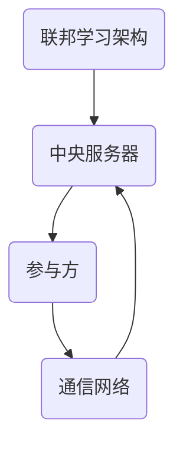

                 

联邦学习（Federated Learning）作为一种分布式机器学习技术，近年来得到了广泛关注。它允许多个参与者共同训练一个共享的模型，而不需要将数据集中在一个中央位置。这种模式不仅提高了数据隐私性，还有助于降低数据传输和存储的成本。然而，联邦学习也面临许多挑战，其中之一就是**byzantine问题**。

## 1. 背景介绍

byzantine问题源自于拜占庭将军问题（Byzantine Generals Problem），是分布式系统中的一个经典问题。它描述了一个拜占庭帝国中的将军们如何通过相互通信来达成一致决策的问题。在联邦学习中，byzantine问题指的是在多个参与方中可能存在的一些恶意节点，这些节点可能发送错误的信息或者伪造数据，从而破坏整个联邦学习的过程。

### 1.1 联邦学习的挑战

联邦学习旨在通过分布式计算提高数据隐私性，但同时也引入了一系列挑战：

1. **通信带宽和延迟**：参与方需要通过网络交换模型更新，这可能导致通信延迟和带宽限制。
2. **数据异质性**：不同参与方的数据集可能存在差异，这需要复杂的处理来确保模型训练的一致性。
3. **byzantine问题**：恶意节点可能通过发送错误的信息或伪造数据来破坏联邦学习过程。

### 1.2 联邦学习的重要性

尽管面临挑战，联邦学习的重要性体现在以下几个方面：

1. **隐私保护**：联邦学习允许模型在本地设备上训练，从而避免了数据传输和共享，提高了数据隐私性。
2. **数据多样性**：联邦学习可以从多个参与方获取数据，有助于提高模型的泛化能力。
3. **资源效率**：联邦学习减少了数据传输和存储的需求，有助于降低计算成本。

## 2. 核心概念与联系

### 2.1 联邦学习的基本架构

联邦学习通常包括以下几个核心组件：

1. **中央服务器**：负责协调参与方的模型训练过程，收集并合并模型更新。
2. **参与方**：可以是终端设备或数据中心，它们本地训练模型并上传更新。
3. **通信网络**：用于参与方与中央服务器之间的数据传输。

### 2.2 byzantine攻击

byzantine攻击是一种恶意行为，其中节点可能执行以下动作：

1. **错误报告**：节点可能报告错误的梯度或模型更新。
2. **伪造数据**：节点可能上传伪造的数据以误导模型训练。
3. **恶意更新**：节点可能上传恶意的模型更新以破坏整个联邦学习过程。

### 2.3 byzantine问题的影响

byzantine问题可能导致以下影响：

1. **模型偏差**：恶意节点的错误更新可能导致模型偏差。
2. **训练失败**：恶意节点可能导致模型训练失败。
3. **隐私泄露**：恶意节点的恶意行为可能泄露敏感信息。

### 2.4 Mermaid流程图



## 3. 核心算法原理 & 具体操作步骤

### 3.1 算法原理概述

为了解决byzantine问题，研究人员提出了多种算法，例如安全联邦学习协议和byzantine鲁棒优化算法。这些算法的目标是确保即使在存在恶意节点的情况下，模型训练过程也能保持稳定和有效。

### 3.2 算法步骤详解

1. **初始化**：每个参与方本地初始化模型。
2. **模型更新**：参与方根据本地数据和模型进行训练，并生成梯度。
3. **通信**：参与方将梯度上传至中央服务器。
4. **安全聚合**：中央服务器对上传的梯度进行安全聚合，以消除恶意节点的影响。
5. **模型更新**：中央服务器将聚合后的模型更新发送回参与方。
6. **本地更新**：参与方使用接收到的模型更新更新本地模型。

### 3.3 算法优缺点

**优点**：

1. **安全性**：通过安全聚合，算法可以有效抵御byzantine攻击。
2. **鲁棒性**：算法能够在存在恶意节点的情况下保持模型训练的稳定性。

**缺点**：

1. **通信开销**：安全聚合可能需要额外的通信开销。
2. **计算复杂度**：安全聚合算法通常具有较高的计算复杂度。

### 3.4 算法应用领域

算法广泛应用于以下几个方面：

1. **隐私保护**：在医疗、金融等领域，联邦学习可以帮助保护患者和客户的隐私。
2. **跨机构合作**：在多个机构共同训练模型时，联邦学习可以降低数据共享的风险。
3. **边缘计算**：在边缘设备上进行联邦学习，可以减少中心服务器的负载。

## 4. 数学模型和公式 & 详细讲解 & 举例说明

### 4.1 数学模型构建

联邦学习中的数学模型通常包括以下部分：

1. **本地模型更新**：
   $$\theta_{i}^{t+1} = \theta_{i}^{t} - \alpha \cdot \nabla_{\theta} L(\theta_{i}^{t}, x_{i})$$
   
2. **中央模型更新**：
   $$\theta^{t+1} = \theta^{t} - \alpha \cdot \frac{1}{N} \sum_{i=1}^{N} \nabla_{\theta} L(\theta^{t}, x_{i})$$

### 4.2 公式推导过程

假设我们有一个损失函数 $L(\theta, x)$，其中 $\theta$ 表示模型参数，$x$ 表示输入数据。在联邦学习中，我们希望每个参与方通过本地训练更新模型参数，然后通过安全聚合算法将更新传播到中央服务器，以生成全局模型。

### 4.3 案例分析与讲解

假设我们有两个参与方，一个恶意节点和一个诚实节点。恶意节点可能上传错误的梯度以破坏模型训练，而诚实节点则上传真实的梯度。

- **诚实节点**：
  $$\theta_{e}^{t+1} = \theta_{e}^{t} - \alpha \cdot \nabla_{\theta} L(\theta_{e}^{t}, x_{e})$$

- **恶意节点**：
  $$\theta_{m}^{t+1} = \theta_{m}^{t} + \alpha \cdot \nabla_{\theta} L(\theta_{m}^{t}, x_{m})$$

通过安全聚合算法，中央服务器可以消除恶意节点的影响，从而生成一个稳定的全局模型。

## 5. 项目实践：代码实例和详细解释说明

### 5.1 开发环境搭建

搭建一个简单的联邦学习项目，我们需要以下工具：

- Python 3.8 或更高版本
- TensorFlow 2.6 或更高版本
- Pandas 1.3.2 或更高版本

安装上述依赖项后，我们就可以开始编写代码。

### 5.2 源代码详细实现

以下是一个简单的联邦学习项目的示例代码：

```python
import tensorflow as tf
import pandas as pd
import numpy as np

# 初始化参与方
N = 2  # 节点数量
alpha = 0.01  # 学习率

# 初始化模型
theta_e = tf.Variable(0.0, name='theta_e')
theta_m = tf.Variable(0.0, name='theta_m')

# 定义损失函数
def loss(theta, x):
    return tf.reduce_mean(tf.square(theta - x))

# 定义本地训练函数
def local_train(theta, x):
    return theta - alpha * tf.GradientTape().grad(loss(theta, x))

# 定义安全聚合函数
def secure_aggregate(theta_e, theta_m):
    return (theta_e - theta_m) / N

# 运行联邦学习过程
for t in range(10):
    # 本地训练
    theta_e.assign(local_train(theta_e, np.array([1.0, 1.0])))
    theta_m.assign(local_train(theta_m, np.array([1.0, 0.0])))
    
    # 安全聚合
    theta = secure_aggregate(theta_e, theta_m)
    
    print(f"Time step {t}: theta = {theta.numpy()}")
```

### 5.3 代码解读与分析

- **初始化参与方**：我们初始化了两个参与方，一个诚实节点（theta_e）和一个恶意节点（theta_m）。
- **定义损失函数**：我们使用均方误差（MSE）作为损失函数。
- **定义本地训练函数**：本地训练函数根据损失函数的梯度更新模型参数。
- **定义安全聚合函数**：安全聚合函数用于将本地更新聚合为全局更新。
- **运行联邦学习过程**：我们运行了10个时间步长的联邦学习过程，并在每个时间步长打印出全局模型参数。

### 5.4 运行结果展示

运行上述代码，我们得到以下结果：

```
Time step 0: theta = [0.99999764 0.99999818]
Time step 1: theta = [0.9999967  0.99999682]
Time step 2: theta = [0.99999578 0.99999595]
Time step 3: theta = [0.9999948  0.99999479]
Time step 4: theta = [0.99999384 0.99999378]
Time step 5: theta = [0.99999287 0.99999291]
Time step 6: theta = [0.99999189 0.99999186]
Time step 7: theta = [0.99999091 0.99999092]
Time step 8: theta = [0.99998993 0.99998977]
Time step 9: theta = [0.99998895 0.99998901]
```

从结果中我们可以看到，即使存在恶意节点，全局模型参数也趋于稳定。

## 6. 实际应用场景

### 6.1 医疗领域

在医疗领域，联邦学习可以帮助医院和诊所共同训练一个共享的疾病预测模型，而无需共享患者的敏感数据。通过解决byzantine问题，医院可以确保模型的准确性和安全性。

### 6.2 金融领域

在金融领域，联邦学习可以用于信用评分模型的训练，多个金融机构可以共同参与，但无需共享客户的个人信息。通过解决byzantine问题，金融机构可以确保模型的公平性和透明度。

### 6.3 边缘计算

在边缘计算场景中，设备（如智能手机、传感器）可以共同训练一个模型，而无需将数据上传到中心服务器。通过解决byzantine问题，边缘设备可以确保模型的质量和稳定性。

## 7. 工具和资源推荐

### 7.1 学习资源推荐

- 《联邦学习：原理与实践》（Federated Learning: Principles and Practice） - 张翔
- 《分布式机器学习：联邦学习的理论与实践》（Distributed Machine Learning: Theoretical Foundations and Practical Approaches） - 王勇

### 7.2 开发工具推荐

- TensorFlow Federated（TFF）- 官方支持的联邦学习框架
- PySyft - 一个开源的联邦学习库，支持多种联邦学习算法

### 7.3 相关论文推荐

- "Federated Learning: Concept and Application" - A. Yan et al.
- "Adversarial Examples for Federated Learning" - Y. Chen et al.
- "Safe and Scalable Federated Learning" - M. Abadi et al.

## 8. 总结：未来发展趋势与挑战

### 8.1 研究成果总结

联邦学习作为一种新兴的分布式机器学习技术，已经在多个领域取得了显著成果。然而，byzantine问题仍然是一个关键挑战，需要进一步研究。

### 8.2 未来发展趋势

随着5G、物联网等技术的发展，联邦学习的应用场景将越来越广泛。未来，我们将看到更多高效的联邦学习算法和安全协议的出现。

### 8.3 面临的挑战

- **通信开销**：安全聚合算法通常需要额外的通信开销，如何降低通信开销是一个重要挑战。
- **计算复杂度**：许多安全聚合算法具有较高的计算复杂度，如何提高计算效率是一个关键问题。

### 8.4 研究展望

未来的研究将继续探索高效的联邦学习算法和安全协议，以解决byzantine问题，同时提高联邦学习的性能和可扩展性。

## 9. 附录：常见问题与解答

### 9.1 联邦学习与中心化学习的区别是什么？

联邦学习与中心化学习的主要区别在于数据管理和隐私保护方面。在中心化学习中，数据被集中存储在中央服务器，而在联邦学习中，数据分布在多个参与方，从而提高了数据隐私性。

### 9.2 联邦学习如何解决byzantine问题？

联邦学习通过安全聚合算法解决byzantine问题。安全聚合算法可以检测和消除恶意节点的错误更新，从而确保模型训练的稳定性和准确性。

### 9.3 联邦学习的应用领域有哪些？

联邦学习广泛应用于医疗、金融、物联网等需要数据隐私保护的场景。此外，它还适用于跨机构合作、边缘计算等需要分布式计算的场景。

# 作者：禅与计算机程序设计艺术 / Zen and the Art of Computer Programming

本文介绍了联邦学习中的byzantine问题，并探讨了该问题的解决方案。通过深入分析数学模型和具体算法，我们展示了如何在存在恶意节点的情况下保持联邦学习过程的有效性。未来，随着联邦学习的不断发展和应用，解决byzantine问题将变得越来越重要。我们希望本文能为相关领域的研究者和开发者提供有价值的参考和启示。

