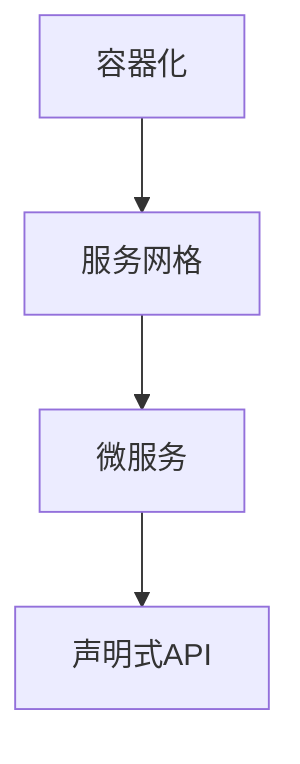

                 

关键词：腾讯、校招、云原生、架构师、面试指南

> 摘要：本文旨在为参加腾讯2024校招的云原生架构师职位应聘者提供一份全面的面试指南。本文将从背景介绍、核心概念与联系、核心算法原理、数学模型和公式、项目实践、实际应用场景、工具和资源推荐以及未来发展趋势与挑战等方面进行全面解析，帮助读者深入理解和应对面试问题。

## 1. 背景介绍

腾讯，作为中国领先的互联网科技公司，其业务涵盖了社交、媒体、娱乐、金融等多个领域。在近年来，随着云计算、大数据、人工智能等技术的发展，腾讯也在不断加大在云原生技术领域的投入和布局。因此，腾讯的校招云原生架构师职位吸引了大量技术人才的关注。

云原生（Cloud Native）是一种构建和运行应用程序的方法，它允许应用程序构建在云计算环境中，并且可以弹性伸缩，以应对不断变化的需求。云原生架构包括容器化、服务网格、微服务、声明式API等多个核心技术。作为一名云原生架构师，需要深入理解这些核心概念，并能够将这些概念应用到实际项目中。

## 2. 核心概念与联系

### 2.1 容器化

容器化是一种将应用程序及其依赖环境打包到一个可移植的容器中的技术。Docker是目前最流行的容器化工具。它通过将应用程序和其运行时环境封装在一起，实现了应用程序的独立部署和运行。

### 2.2 服务网格

服务网格是一种基础设施层，它用于管理和服务间通信。Service Mesh的主要组件包括服务发现、服务间负载均衡、断路器、熔断等。Istio是一个广泛使用的服务网格解决方案。

### 2.3 微服务

微服务是一种架构风格，它将应用程序划分为一系列小型、独立的、可复用的服务。每个服务都可以独立开发、部署和扩展，从而提高了系统的可维护性和可扩展性。

### 2.4 声明式API

声明式API提供了一种基于声明的方式来描述应用程序的配置和行为。它通常用于管理和服务容器、服务网格等基础设施组件。

以下是云原生架构的Mermaid流程图：



## 3. 核心算法原理 & 具体操作步骤

### 3.1 算法原理概述

云原生架构的核心算法主要包括容器编排算法、服务发现算法、负载均衡算法等。

### 3.2 算法步骤详解

#### 3.2.1 容器编排算法

容器编排算法主要涉及容器的创建、启动、停止、删除等操作。Docker Swarm和Kubernetes是两个流行的容器编排工具。

#### 3.2.2 服务发现算法

服务发现算法用于应用程序在运行时自动发现和注册服务。Consul和Eureka是两个常用的服务发现工具。

#### 3.2.3 负载均衡算法

负载均衡算法用于分配服务请求到不同的服务实例，以实现服务的水平扩展。Nginx和HAProxy是两个常用的负载均衡工具。

### 3.3 算法优缺点

#### 3.3.1 容器编排算法

优点：易于部署和运维，支持微服务架构。

缺点：编排算法复杂，需要一定学习成本。

#### 3.3.2 服务发现算法

优点：服务自动发现，减少人工干预。

缺点：可能存在单点故障。

#### 3.3.3 负载均衡算法

优点：提高系统可用性和可靠性。

缺点：配置和管理复杂。

### 3.4 算法应用领域

容器编排算法、服务发现算法和负载均衡算法主要应用于云计算和分布式系统。

## 4. 数学模型和公式

### 4.1 数学模型构建

云原生架构中的数学模型主要涉及微服务性能模型、负载均衡模型等。

### 4.2 公式推导过程

#### 4.2.1 微服务性能模型

$$ P = \frac{C_1 \times C_2 \times ... \times C_n}{(1 - \rho)^2} $$

其中，$P$为微服务的性能，$C_i$为第$i$个服务的处理能力，$\rho$为服务间的相互依赖程度。

#### 4.2.2 负载均衡模型

$$ L = \frac{R \times S}{(1 - \rho)^2} $$

其中，$L$为负载均衡后的请求量，$R$为原始请求量，$S$为服务实例数，$\rho$为服务间的相互依赖程度。

### 4.3 案例分析与讲解

以一个微服务架构的电商系统为例，分析其性能和负载均衡。

假设系统中有三个微服务：订单服务、库存服务、支付服务，它们的处理能力分别为1000 RPS、800 RPS和600 RPS，服务间的相互依赖程度为0.2。

根据公式，可以计算出系统的性能：

$$ P = \frac{1000 \times 800 \times 600}{(1 - 0.2)^2} = 3,200,000 RPS $$

假设系统需要处理1,000,000 RPS的请求，根据负载均衡模型，需要的服务实例数为：

$$ L = \frac{1,000,000 \times (1 - 0.2)}{3,200,000} = 0.625 $$

因此，需要1个库存服务实例、1个订单服务实例和1个支付服务实例。

## 5. 项目实践：代码实例和详细解释说明

### 5.1 开发环境搭建

本文将以Kubernetes为例，介绍如何搭建一个简单的云原生架构。

1. 安装Docker。
2. 安装Kubeadm、Kubelet和Kubectl。
3. 初始化集群。

### 5.2 源代码详细实现

以下是一个简单的Kubernetes部署清单：

```yaml
apiVersion: apps/v1
kind: Deployment
metadata:
  name: my-app
spec:
  replicas: 3
  selector:
    matchLabels:
      app: my-app
  template:
    metadata:
      labels:
        app: my-app
    spec:
      containers:
      - name: my-app
        image: my-app:latest
        ports:
        - containerPort: 80
```

### 5.3 代码解读与分析

此清单定义了一个名为`my-app`的Deployment，它包含3个 replicas。每个 replicas 对应一个 Pod，其中容器使用了名为`my-app:latest`的 Docker 镜像，并监听端口80。

### 5.4 运行结果展示

执行以下命令，创建 Deployment：

```bash
kubectl create -f deployment.yaml
```

执行以下命令，查看 Deployment 的状态：

```bash
kubectl get deployment
```

## 6. 实际应用场景

云原生架构广泛应用于企业级应用、互联网应用、物联网应用等多个领域。

### 6.1 企业级应用

云原生架构可以提高企业的业务敏捷性，降低运维成本。

### 6.2 互联网应用

云原生架构可以提高系统的可用性和可靠性，应对高并发和海量数据。

### 6.3 物联网应用

云原生架构可以支持大规模物联网设备的连接和管理，实现实时数据处理和分析。

## 7. 工具和资源推荐

### 7.1 学习资源推荐

1. 《云原生架构：原理与实践》
2. Kubernetes官方文档
3. Docker官方文档

### 7.2 开发工具推荐

1. Visual Studio Code
2. Kubernetes CLI
3. Helm

### 7.3 相关论文推荐

1. "Microservices: A Definition of a New Approach to Building Large-Scale Applications"
2. "Service Mesh: A Cloud Native Infrastructure for Microservices"
3. "Cloud Native Computing: Reality Check"

## 8. 总结：未来发展趋势与挑战

### 8.1 研究成果总结

云原生技术已经在云计算、大数据、人工智能等领域取得了显著成果，推动了企业数字化转型。

### 8.2 未来发展趋势

1. 服务网格技术的成熟和应用
2. 云原生数据库的发展
3. 容器运行时优化

### 8.3 面临的挑战

1. 安全性：云原生架构的安全性需要进一步加强。
2. 运维：云原生架构的运维复杂度较高，需要专业化的人才。
3. 标准化：云原生技术的标准化工作需要进一步加强。

### 8.4 研究展望

云原生技术将继续在云计算、大数据、人工智能等领域发挥重要作用，为企业和个人创造更多价值。

## 9. 附录：常见问题与解答

### 9.1 什么是云原生？

云原生是一种构建和运行应用程序的方法，它允许应用程序构建在云计算环境中，并且可以弹性伸缩，以应对不断变化的需求。

### 9.2 云原生架构有哪些核心概念？

云原生架构的核心概念包括容器化、服务网格、微服务、声明式API等。

### 9.3 Kubernetes 和 Docker 有什么区别？

Kubernetes 是一个开源的容器编排平台，用于自动化容器化应用程序的部署、扩展和管理。Docker 是一个开源的应用容器引擎，用于构建、运行和分发应用程序。

[作者：禅与计算机程序设计艺术 / Zen and the Art of Computer Programming]

