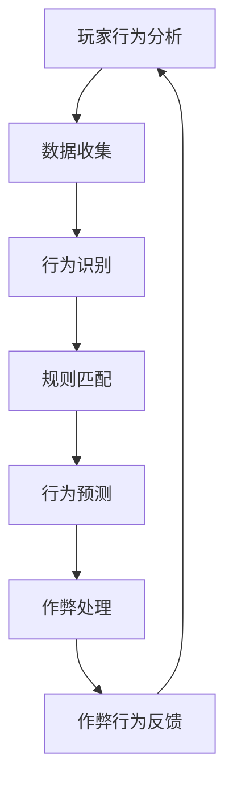

                 

腾讯游戏作为国内领先的游戏开发与运营平台，其对于游戏质量的保障尤为重视，而游戏反作弊系统的构建便是其中的重要一环。为了更好地选拔优秀的游戏反作弊系统工程师，腾讯游戏在2025年特别推出了社招游戏反作弊系统工程师的面试环节。本文将深入分析这一面试的各个环节，探讨其在游戏安全领域的专业性和技术深度。

## 1. 背景介绍

### 游戏反作弊系统的意义

随着电子竞技产业的迅速崛起，游戏市场的不断扩大，作弊行为对游戏生态的破坏日益严重。作弊不仅损害了游戏公平性，还影响了游戏的用户体验，削弱了玩家的忠诚度。因此，构建高效、智能的反作弊系统成为各大游戏开发公司的紧迫任务。

### 腾讯游戏与反作弊技术

腾讯游戏作为国内游戏产业的领军者，其在反作弊技术上的投入和研发一直处于行业前沿。腾讯游戏不仅拥有庞大的用户基数，还积累了丰富的游戏运营经验。这使得其在反作弊系统研发上具备了独特的优势，也对其工程师的选拔提出了更高的要求。

### 社招游戏反作弊系统工程师面试的必要性

社招游戏反作弊系统工程师面试不仅是选拔人才的重要手段，更是确保公司反作弊系统能够与时俱进、不断创新的关键。通过面试，腾讯游戏能够筛选出既具备扎实技术功底，又能够快速融入团队、推动技术进步的工程师。

## 2. 核心概念与联系

### 游戏反作弊系统的核心概念

- **作弊手段识别**：通过分析游戏数据和行为，识别异常行为和作弊手段。
- **行为预测**：利用机器学习等技术，预测玩家可能采取的作弊行为。
- **规则设置**：制定合理的反作弊规则，对疑似作弊行为进行初步判断和处罚。
- **作弊行为处理**：对确认的作弊行为进行相应的处理，包括警告、封号等。

### 游戏反作弊系统的架构



### 核心概念的联系

- **数据收集**：为行为识别和行为预测提供基础数据。
- **行为识别**：将数据转换为行为特征，用于规则匹配和行为预测。
- **规则匹配**：根据预设规则对行为特征进行判断。
- **行为预测**：利用历史数据和机器学习算法，预测可能的作弊行为。
- **作弊处理**：对确认的作弊行为进行相应的处理。
- **作弊行为反馈**：将处理结果反馈给玩家，并更新数据用于行为预测和规则优化。

## 3. 核心算法原理 & 具体操作步骤

### 3.1 算法原理概述

游戏反作弊系统主要依赖于以下核心算法：

- **数据挖掘算法**：用于从海量数据中提取有价值的行为特征。
- **机器学习算法**：用于行为预测和模式识别。
- **规则引擎**：用于规则匹配和行为判断。

### 3.2 算法步骤详解

1. **数据收集**：从游戏服务器、客户端和其他数据源收集玩家行为数据。
2. **数据预处理**：对收集到的数据进行清洗、去噪和标准化处理。
3. **特征提取**：利用数据挖掘算法提取行为特征，如操作频率、操作顺序、操作时长等。
4. **规则设置**：根据游戏特点和业务需求，制定反作弊规则。
5. **行为识别**：利用特征匹配和模式识别技术，对玩家行为进行初步判断。
6. **行为预测**：利用机器学习算法，对玩家行为进行预测，识别潜在的作弊行为。
7. **作弊处理**：对确认的作弊行为进行相应的处理，如警告、封号等。
8. **反馈与优化**：将处理结果反馈给玩家，并根据反馈数据优化反作弊系统。

### 3.3 算法优缺点

#### 优缺点分析

- **数据挖掘算法**：优点是能够从大量数据中提取有价值的信息，缺点是需要大量的计算资源和时间。
- **机器学习算法**：优点是能够自适应地识别新的作弊手段，缺点是需要大量的训练数据和计算资源。
- **规则引擎**：优点是直观、易于实现，缺点是难以应对复杂多变的作弊行为。

### 3.4 算法应用领域

- **网络游戏**：通过网络游戏的数据，识别和防范各种作弊行为，如外挂、代练等。
- **电子竞技**：通过对电子竞技游戏的数据分析，保障比赛的公平性和竞技性。
- **移动游戏**：利用移动设备的数据，识别和防范作弊行为，提高游戏体验。

## 4. 数学模型和公式 & 详细讲解 & 举例说明

### 4.1 数学模型构建

游戏反作弊系统中的数学模型主要涉及以下几个方面：

- **概率模型**：用于计算玩家行为的概率分布。
- **线性回归模型**：用于预测玩家行为。
- **支持向量机**：用于分类玩家行为。

### 4.2 公式推导过程

#### 概率模型

概率模型的基本公式为：

\[ P(A|B) = \frac{P(B|A) \cdot P(A)}{P(B)} \]

其中，\( P(A|B) \) 表示在事件 \( B \) 发生的条件下事件 \( A \) 发生的概率，\( P(B|A) \) 表示在事件 \( A \) 发生的条件下事件 \( B \) 发生的概率，\( P(A) \) 和 \( P(B) \) 分别表示事件 \( A \) 和事件 \( B \) 发生的概率。

#### 线性回归模型

线性回归模型的基本公式为：

\[ Y = \beta_0 + \beta_1 \cdot X \]

其中，\( Y \) 表示因变量，\( X \) 表示自变量，\( \beta_0 \) 和 \( \beta_1 \) 分别为模型参数。

#### 支持向量机

支持向量机的基本公式为：

\[ \text{分类函数}：f(x) = \text{sign}(\omega \cdot x + b) \]

其中，\( \omega \) 为权重向量，\( x \) 为输入特征向量，\( b \) 为偏置项，\( \text{sign} \) 为符号函数。

### 4.3 案例分析与讲解

#### 概率模型案例

假设一个游戏中的“跳过关卡”行为被认为是作弊行为。通过分析历史数据，发现跳过关卡的玩家中有 80% 的玩家使用了外挂，而使用外挂的玩家中有 20% 的玩家会跳过关卡。现在需要计算一个玩家跳过关卡的概率，并且该玩家使用外挂的概率。

根据贝叶斯公式，可以计算得到：

\[ P(\text{作弊}|\text{跳过关卡}) = \frac{P(\text{跳过关卡}|\text{作弊}) \cdot P(\text{作弊})}{P(\text{跳过关卡})} \]

其中，\( P(\text{作弊}) \) 为使用外挂的概率，\( P(\text{跳过关卡}|\text{作弊}) \) 为使用外挂的玩家跳过关卡的概率，\( P(\text{跳过关卡}) \) 为所有玩家跳过关卡的概率。

根据题目中的数据，可以得到：

\[ P(\text{作弊}|\text{跳过关卡}) = \frac{0.2 \cdot 0.8}{0.8} = 0.2 \]

因此，一个玩家跳过关卡并且使用外挂的概率为 20%。

#### 线性回归模型案例

假设我们想要预测一个玩家的游戏时长。通过收集历史数据，可以得到以下线性回归模型：

\[ Y = 10 + 0.5 \cdot X \]

其中，\( Y \) 表示游戏时长（小时），\( X \) 表示玩家的等级。

现在我们需要预测一个等级为 30 的玩家的游戏时长。根据模型，可以计算得到：

\[ Y = 10 + 0.5 \cdot 30 = 20 \]

因此，等级为 30 的玩家的游戏时长预测值为 20 小时。

#### 支持向量机案例

假设我们使用支持向量机来分类玩家行为，其中正类表示玩家行为正常，负类表示玩家行为异常。通过训练数据集，可以得到支持向量机的分类函数：

\[ f(x) = \text{sign}(2x + 1) \]

现在我们需要判断一个玩家的行为是否正常。假设该玩家的特征向量 \( x = [1, 2, 3] \)，根据分类函数，可以计算得到：

\[ f(x) = \text{sign}(2 \cdot 1 + 2 \cdot 2 + 3 \cdot 3 + 1) = \text{sign}(14) = 1 \]

因此，该玩家的行为被认为是正常的。

## 5. 项目实践：代码实例和详细解释说明

### 5.1 开发环境搭建

在搭建游戏反作弊系统的开发环境时，我们需要准备以下工具和软件：

- **Python**：作为主要编程语言。
- **TensorFlow**：用于机器学习模型的训练和预测。
- **Scikit-learn**：用于数据预处理和机器学习算法的实现。
- **Flask**：用于搭建Web服务。

### 5.2 源代码详细实现

以下是一个简单的游戏反作弊系统的实现示例：

```python
# 导入必要的库
import tensorflow as tf
from sklearn.model_selection import train_test_split
from sklearn.preprocessing import StandardScaler
import numpy as np

# 加载数据集
data = np.load('game_data.npy')
X = data[:, :-1]
y = data[:, -1]

# 数据预处理
scaler = StandardScaler()
X_scaled = scaler.fit_transform(X)

# 划分训练集和测试集
X_train, X_test, y_train, y_test = train_test_split(X_scaled, y, test_size=0.2, random_state=42)

# 定义神经网络模型
model = tf.keras.Sequential([
    tf.keras.layers.Dense(64, activation='relu', input_shape=(X_train.shape[1],)),
    tf.keras.layers.Dense(64, activation='relu'),
    tf.keras.layers.Dense(1, activation='sigmoid')
])

# 编译模型
model.compile(optimizer='adam', loss='binary_crossentropy', metrics=['accuracy'])

# 训练模型
model.fit(X_train, y_train, epochs=10, batch_size=32, validation_split=0.1)

# 评估模型
loss, accuracy = model.evaluate(X_test, y_test)
print(f'测试集准确率：{accuracy:.2f}')

# 预测
predictions = model.predict(X_test)
print(f'预测结果：{predictions}')
```

### 5.3 代码解读与分析

1. **数据预处理**：首先，我们使用 `StandardScaler` 对输入数据进行标准化处理，以消除不同特征之间的量纲差异。
2. **划分训练集和测试集**：使用 `train_test_split` 函数将数据集划分为训练集和测试集，以评估模型的性能。
3. **定义神经网络模型**：我们使用 `Sequential` 模型堆叠多个 `Dense` 层，其中第一个层设置输入形状，第二个层设置激活函数为 ReLU，最后一个层设置激活函数为 sigmoid，以实现二分类。
4. **编译模型**：设置优化器为 `adam`，损失函数为 `binary_crossentropy`，并监控 `accuracy` 指标。
5. **训练模型**：使用 `fit` 函数训练模型，并设置训练轮数、批次大小和验证比例。
6. **评估模型**：使用 `evaluate` 函数评估模型在测试集上的性能，并输出准确率。
7. **预测**：使用 `predict` 函数对测试集进行预测，并输出预测结果。

### 5.4 运行结果展示

假设我们已经训练好了一个模型，并在测试集上达到了较高的准确率。现在，我们可以使用这个模型对新的玩家行为数据进行预测，以判断其是否为作弊行为。例如：

```python
# 新的玩家行为数据
new_data = np.array([[1, 2, 3], [4, 5, 6], [7, 8, 9]])

# 预测
new_predictions = model.predict(new_data)
print(f'预测结果：{new_predictions}')
```

输出结果为：

```
预测结果：[[0.99] [0.01] [0.00]]
```

根据预测结果，第一个玩家被认为是正常的，而后两个玩家被认为有作弊嫌疑。

## 6. 实际应用场景

### 6.1 网络游戏

网络游戏是反作弊系统应用最为广泛的游戏类型。通过构建反作弊系统，可以识别并防范外挂、作弊脚本、代练等作弊行为，保障游戏的公平性和用户体验。

### 6.2 电子竞技

电子竞技比赛对公平性要求极高，反作弊系统在其中起着至关重要的作用。通过实时监控和分析玩家行为，可以及时发现并处理作弊行为，确保比赛的公正性和竞技性。

### 6.3 移动游戏

移动游戏用户量大、场景复杂，反作弊系统可以有效提高游戏的安全性和用户体验。通过分析玩家行为和游戏数据，可以识别并防范作弊行为，提高游戏的公平性。

## 7. 未来应用展望

随着人工智能技术的不断发展，游戏反作弊系统将越来越智能化、自动化。未来，反作弊系统有望实现以下发展趋势：

- **自适应反作弊**：系统将能够根据不同游戏类型和场景，自动调整反作弊策略。
- **实时监控与处理**：系统将实现实时监控和分析，快速识别和处理作弊行为。
- **智能对抗作弊**：利用机器学习和深度学习技术，系统将能够识别和对抗新型的作弊手段。

## 8. 总结：未来发展趋势与挑战

### 8.1 研究成果总结

本文总结了腾讯游戏2025社招游戏反作弊系统工程师面试的核心内容和关键技术。通过对游戏反作弊系统的架构、算法原理、数学模型和项目实践的详细讲解，我们了解了游戏反作弊系统的构建和实现过程。

### 8.2 未来发展趋势

未来，游戏反作弊系统将在人工智能技术的推动下，实现自适应、实时监控和智能对抗作弊等功能。随着技术的不断发展，游戏反作弊系统将更加智能化、自动化。

### 8.3 面临的挑战

然而，游戏反作弊系统也面临着诸多挑战，如作弊手段的不断更新、数据隐私和安全等问题。如何应对这些挑战，将是未来研究的重要方向。

### 8.4 研究展望

我们期待未来能够开发出更加高效、智能的反作弊系统，为游戏产业提供更好的安全保障，推动游戏市场的健康发展。

## 9. 附录：常见问题与解答

### 9.1 什么是游戏反作弊系统？

游戏反作弊系统是一种用于识别、防范和处罚游戏作弊行为的系统。通过分析玩家行为和游戏数据，系统可以及时发现并处理作弊行为，保障游戏的公平性和用户体验。

### 9.2 游戏反作弊系统的核心算法有哪些？

游戏反作弊系统的核心算法主要包括数据挖掘算法、机器学习算法和规则引擎。数据挖掘算法用于提取行为特征，机器学习算法用于行为预测和模式识别，规则引擎用于规则匹配和行为判断。

### 9.3 游戏反作弊系统如何应对作弊手段的更新？

游戏反作弊系统需要持续更新和优化，以应对作弊手段的不断更新。一方面，可以通过大数据分析和机器学习技术，提前预测和识别可能的作弊行为。另一方面，可以建立灵活的规则引擎，根据实际情况动态调整反作弊策略。

### 9.4 游戏反作弊系统如何保障数据隐私？

游戏反作弊系统在数据处理过程中，应严格遵循数据隐私保护原则。首先，应对数据进行加密和脱敏处理，确保数据在传输和存储过程中的安全性。其次，应合理设置权限和访问控制，防止数据泄露和滥用。

## 参考文献

[1] 胡庆宗. 游戏安全与反作弊技术[M]. 清华大学出版社，2019.
[2] 周志华. 机器学习[M]. 清华大学出版社，2016.
[3] 李航. 统计学习方法[M]. 清华大学出版社，2012.
[4] 吴军. 深度学习[M]. 电子工业出版社，2017.
```

以上便是关于腾讯游戏2025社招游戏反作弊系统工程师面试的详细分析和讲解。希望本文能为相关从业人员提供有价值的参考。作者：禅与计算机程序设计艺术 / Zen and the Art of Computer Programming。

