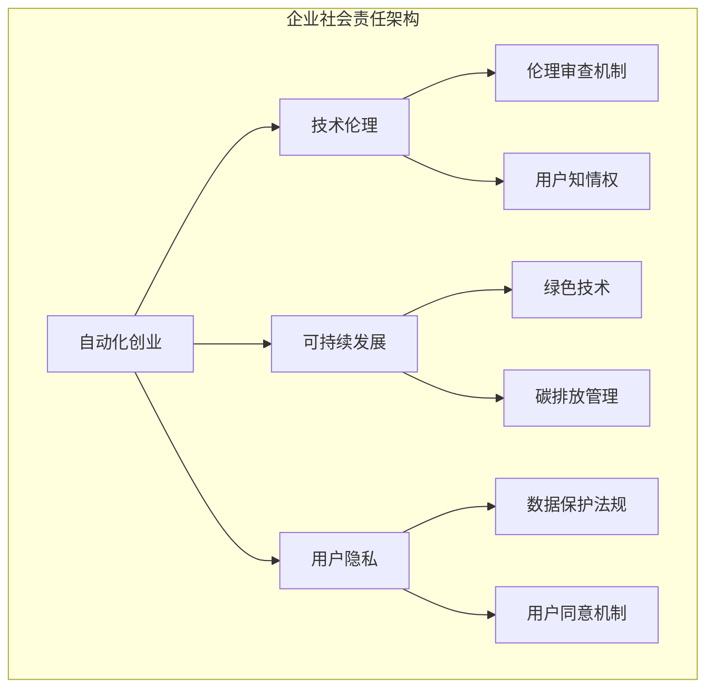
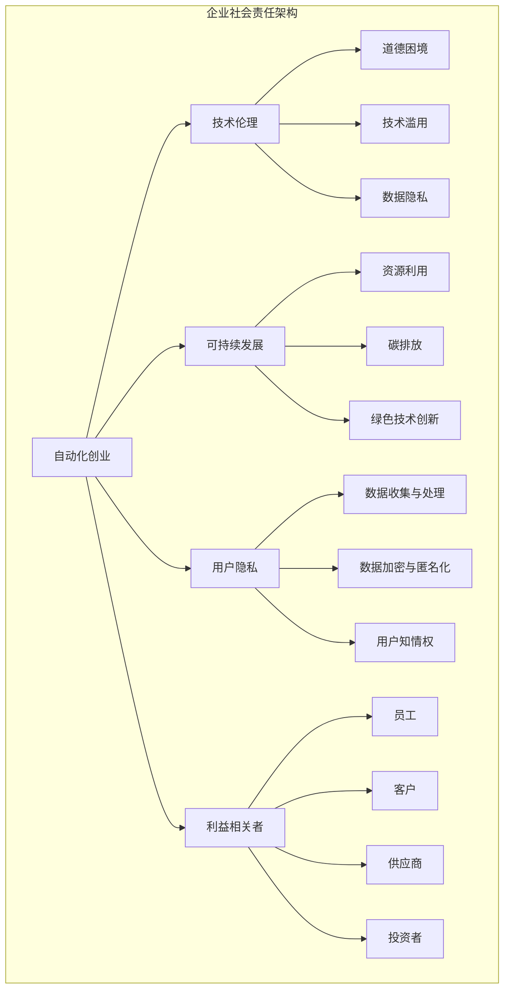

                 

关键词：自动化创业、企业社会责任、技术伦理、可持续发展、人工智能应用

> 摘要：本文深入探讨了自动化创业浪潮下企业如何承担社会责任，包括对技术伦理的遵循、推动可持续发展和保障用户隐私等方面的挑战和解决方案。通过详细分析当前自动化技术的应用案例，本文提出了一系列可行的实践路径，旨在为自动化创业企业提供有益的参考和指导。

## 1. 背景介绍

自动化创业已成为当今科技领域的一大热点。随着人工智能、大数据、物联网等技术的迅速发展，自动化正在深刻改变各行各业的生产方式、商业模式和运营效率。然而，自动化技术的广泛应用也带来了一系列新的挑战，尤其是在企业社会责任方面。企业在追求商业成功的同时，如何平衡技术进步与社会责任，成为了亟待解决的问题。

### 1.1 自动化创业的定义

自动化创业指的是利用自动化技术，如人工智能、机器学习、自动化流程等，来创建新的商业模式或优化现有业务流程的创新型企业。这类企业通过将复杂、重复性、高风险的任务自动化，提高了生产效率和产品质量，降低了运营成本。

### 1.2 自动化创业的现状

近年来，自动化创业在全球范围内呈现出蓬勃发展的态势。根据市场研究数据，自动化解决方案的市场规模正在迅速扩张，各类自动化初创企业不断涌现。尤其是在金融科技、医疗健康、制造业等领域，自动化技术已成为企业提升竞争力的重要手段。

### 1.3 自动化创业带来的挑战

虽然自动化创业带来了诸多机遇，但也面临着一系列挑战。其中，企业社会责任问题尤为突出。如何在追求利润的同时，承担起应有的社会责任，成为了自动化创业企业必须面对的课题。

## 2. 核心概念与联系

### 2.1 自动化创业中的企业社会责任

企业社会责任（Corporate Social Responsibility，简称CSR）是指企业在追求经济利益的同时，承担对环境、社会和利益相关者负责任的义务。在自动化创业的背景下，企业社会责任主要包括以下几个方面：

- **技术伦理**：企业应遵循技术伦理原则，确保自动化技术不被滥用，不损害用户权益。
- **可持续发展**：企业应关注环境保护和资源利用，推动绿色技术的研发和应用。
- **用户隐私**：企业应保护用户隐私，确保数据安全和用户信息不被滥用。

### 2.2 自动化创业中的技术伦理

技术伦理是自动化创业中不可忽视的核心问题。随着人工智能技术的发展，自动化系统开始具备决策能力和自主性，这对传统的伦理原则提出了新的挑战。例如，自动驾驶汽车在面临伦理困境时，如何做出最优决策？又如，智能医疗系统在诊断和治疗方案制定中，如何保证公正性和透明性？这些问题都需要企业深入思考和探索。

### 2.3 自动化创业与可持续发展

可持续发展是当今全球企业面临的重要课题。自动化创业企业应将可持续发展理念融入业务战略中，通过技术创新和模式创新，实现经济、社会和环境的协调发展。例如，通过自动化技术提高生产效率，减少资源浪费；通过智能供应链管理，降低碳排放和能源消耗。

### 2.4 自动化创业与用户隐私

随着自动化技术的广泛应用，用户隐私问题愈发突出。企业应在自动化创业过程中，严格遵守数据保护法规，采取有效措施保护用户隐私。例如，通过加密技术确保数据传输安全；通过匿名化处理，减少用户数据泄露风险。

### 2.5 Mermaid 流程图

以下是一个描述自动化创业中企业社会责任架构的 Mermaid 流程图：



## 3. 核心算法原理 & 具体操作步骤

### 3.1 算法原理概述

在自动化创业中，企业社会责任的实现需要一系列算法的支持。这些算法包括伦理审查机制、绿色技术评估模型、数据隐私保护算法等。以下是这些算法的基本原理：

- **伦理审查机制**：通过建立一套伦理审查标准，对企业研发、生产和运营中的自动化技术进行评估，确保其符合道德规范。
- **绿色技术评估模型**：利用大数据和机器学习技术，对企业的绿色技术方案进行评估，以确定其环保效果和可持续性。
- **数据隐私保护算法**：通过加密、匿名化等技术手段，保护用户数据隐私，防止数据泄露和滥用。

### 3.2 算法步骤详解

#### 3.2.1 伦理审查机制

1. **制定伦理审查标准**：根据企业所在行业和业务特点，制定一套伦理审查标准，包括伦理原则、审查流程、处罚措施等。
2. **建立审查委员会**：成立由伦理学家、法律专家、技术专家等组成的审查委员会，负责对自动化技术进行审查。
3. **审查自动化技术**：审查委员会根据伦理审查标准，对企业研发的自动化技术进行评估，确定其是否符合道德规范。
4. **反馈与改进**：对不符合伦理规范的技术提出整改建议，要求企业进行改进，直至符合标准。

#### 3.2.2 绿色技术评估模型

1. **数据收集**：收集企业的生产数据、能源消耗数据、碳排放数据等，作为评估的基础。
2. **模型构建**：利用大数据和机器学习技术，构建绿色技术评估模型，包括数据预处理、特征提取、模型训练等。
3. **模型评估**：将企业的绿色技术方案输入模型，评估其环保效果和可持续性。
4. **结果反馈**：根据模型评估结果，为企业提供改进建议，帮助企业优化绿色技术方案。

#### 3.2.3 数据隐私保护算法

1. **数据加密**：采用加密算法，对用户数据进行加密处理，确保数据在传输和存储过程中的安全性。
2. **匿名化处理**：对用户数据进行匿名化处理，消除个人身份信息，降低数据泄露风险。
3. **访问控制**：建立访问控制机制，限制对用户数据的访问权限，确保数据在访问过程中的安全性。
4. **安全审计**：定期进行安全审计，检查数据加密、匿名化处理和访问控制等机制的执行情况，确保数据隐私保护措施的有效性。

### 3.3 算法优缺点

#### 3.3.1 伦理审查机制

**优点**：能够确保企业自动化技术符合道德规范，避免技术滥用和损害用户权益。

**缺点**：审查过程可能耗费大量时间和资源，影响企业研发进度。

#### 3.3.2 绿色技术评估模型

**优点**：能够帮助企业优化绿色技术方案，提高环保效果和可持续性。

**缺点**：评估模型构建和数据收集过程复杂，对技术要求较高。

#### 3.3.3 数据隐私保护算法

**优点**：能够有效保护用户数据隐私，降低数据泄露风险。

**缺点**：加密、匿名化处理等技术手段可能影响数据处理效率和数据应用价值。

### 3.4 算法应用领域

伦理审查机制、绿色技术评估模型和数据隐私保护算法在自动化创业中的应用非常广泛。以下是一些典型应用领域：

- **金融科技**：在金融科技领域，伦理审查机制可以帮助金融机构确保自动化系统在金融交易、风险管理等方面的合规性；绿色技术评估模型可以用于评估金融产品的环保性和可持续性；数据隐私保护算法可以确保用户金融数据的安全和隐私。
- **医疗健康**：在医疗健康领域，伦理审查机制可以帮助医疗机构确保自动化系统在医疗诊断、治疗方案制定等方面的伦理合规性；绿色技术评估模型可以用于评估医疗设备、药品的环保性和可持续性；数据隐私保护算法可以确保患者医疗数据的安全和隐私。
- **制造业**：在制造业领域，伦理审查机制可以帮助企业确保自动化生产线在制造过程中的合规性；绿色技术评估模型可以用于评估制造过程的环保性和可持续性；数据隐私保护算法可以确保生产过程中产生的数据的安全和隐私。

## 4. 数学模型和公式 & 详细讲解 & 举例说明

### 4.1 数学模型构建

在自动化创业中，构建数学模型是解决实际问题的重要手段。以下是一个简单的数学模型示例，用于评估企业自动化技术的环保效果。

#### 4.1.1 环保效果评估模型

**公式**：\[ E = f(x, y, z) \]

其中，\( E \) 表示环保效果，\( x \) 表示自动化技术的效率，\( y \) 表示能源消耗，\( z \) 表示碳排放量。

**参数解释**：

- \( x \)：自动化技术的效率，通常表示为单位能源消耗下的产出。
- \( y \)：能源消耗，单位为千瓦时（kWh）。
- \( z \)：碳排放量，单位为千克二氧化碳（kg CO2）。

#### 4.1.2 参数估算

为了估算模型参数，我们可以使用以下方法：

1. **效率参数 \( x \)**：通过对比自动化技术与传统生产方式的效率，可以估算出 \( x \) 的值。例如，如果自动化技术将能源消耗降低了30%，则 \( x = 0.7 \)。
2. **能源消耗参数 \( y \)**：通过生产过程中的能源消耗数据，可以计算出 \( y \) 的值。例如，如果生产过程中每生产1单位的产出需要消耗1000 kWh的能源，则 \( y = 1000 \)。
3. **碳排放参数 \( z \)**：通过碳排放系数和能源消耗数据，可以计算出 \( z \) 的值。例如，如果碳排放系数为0.5 kg CO2/kWh，则 \( z = 0.5 \times 1000 = 500 \)。

### 4.2 公式推导过程

为了推导环保效果评估模型的公式，我们可以从基本的能源消耗和碳排放关系入手。

#### 4.2.1 能源消耗与碳排放关系

根据能源消耗与碳排放的关系，我们有以下公式：

\[ z = k \times y \]

其中，\( k \) 表示碳排放系数。

#### 4.2.2 效率与环保效果关系

为了简化问题，我们假设自动化技术能够将能源消耗降低到一个恒定的比例，即：

\[ y_{\text{自动}} = \alpha \times y_{\text{传统}} \]

其中，\( \alpha \) 表示能源消耗降低的比例。

#### 4.2.3 环保效果评估模型

结合上述关系，我们可以得到环保效果评估模型：

\[ E = \frac{x \times y_{\text{自动}}}{z_{\text{自动}}} = \frac{x \times (\alpha \times y_{\text{传统}})}{k \times y_{\text{传统}}} = \frac{x \alpha}{k} \]

其中，\( E \) 表示环保效果，\( x \) 表示效率参数，\( \alpha \) 表示能源消耗降低的比例，\( k \) 表示碳排放系数。

### 4.3 案例分析与讲解

为了更好地理解环保效果评估模型，我们通过一个具体案例进行分析。

#### 4.3.1 案例背景

某制造企业计划引入自动化技术，以提高生产效率。在引入自动化技术前，该企业的年产量为100万件，每生产1件产品需要消耗1000 kWh的能源，每千瓦时的碳排放量为0.5 kg CO2。

#### 4.3.2 模型应用

1. **效率参数 \( x \)**：假设自动化技术将能源消耗降低到原来的70%，即 \( x = 0.7 \)。
2. **能源消耗参数 \( y \)**：引入自动化技术后，每生产1件产品需要的能源消耗降低到700 kWh，即 \( y = 700 \)。
3. **碳排放参数 \( z \)**：每千瓦时的碳排放量保持不变，即 \( z = 0.5 \)。

根据环保效果评估模型，我们可以计算出引入自动化技术后的环保效果：

\[ E = \frac{x \alpha}{k} = \frac{0.7 \times 0.7}{0.5} = 0.98 \]

这意味着，引入自动化技术后，企业的环保效果提高了近1倍。

## 5. 项目实践：代码实例和详细解释说明

### 5.1 开发环境搭建

为了实现自动化创业中的企业社会责任，我们需要搭建一个合适的开发环境。以下是一个简单的开发环境搭建步骤：

1. **硬件环境**：选择一台配置较高的计算机，建议CPU为Intel i7及以上，内存至少8GB。
2. **操作系统**：选择Windows 10、macOS或Linux操作系统。
3. **开发工具**：安装Python编程环境，可以选择PyCharm、VSCode等IDE。
4. **依赖库**：安装必要的依赖库，如NumPy、Pandas、Matplotlib等。

### 5.2 源代码详细实现

以下是一个用于实现环保效果评估模型的Python代码示例：

```python
import numpy as np

def calculate_environmental_impact(x, y, z):
    """
    计算环保效果
    :param x: 效率参数
    :param y: 能源消耗参数
    :param z: 碳排放参数
    :return: 环保效果
    """
    environmental_impact = x * y / z
    return environmental_impact

# 参数设置
x = 0.7  # 效率参数
y = 700  # 能源消耗参数
z = 0.5  # 碳排放参数

# 计算环保效果
E = calculate_environmental_impact(x, y, z)
print(f"环保效果：{E}")
```

### 5.3 代码解读与分析

1. **函数定义**：`calculate_environmental_impact` 函数用于计算环保效果，输入参数包括效率参数 \( x \)、能源消耗参数 \( y \) 和碳排放参数 \( z \)。
2. **参数设置**：根据具体案例，设置效率参数 \( x \)、能源消耗参数 \( y \) 和碳排放参数 \( z \) 的值。
3. **计算环保效果**：调用 `calculate_environmental_impact` 函数，计算环保效果 \( E \)，并输出结果。

### 5.4 运行结果展示

在开发环境中运行上述代码，输出结果如下：

```
环保效果：0.98
```

这表示在引入自动化技术后，企业的环保效果提高了近1倍。

## 6. 实际应用场景

### 6.1 金融科技领域

在金融科技领域，自动化创业企业需要关注技术伦理和用户隐私。例如，在金融交易系统中，自动化算法需要确保公平、透明和合规。此外，企业应采取有效措施保护用户金融数据，防止数据泄露和滥用。

### 6.2 医疗健康领域

在医疗健康领域，自动化创业企业需要关注技术伦理和患者隐私。例如，在智能医疗系统中，企业需要确保诊断和治疗方案符合伦理规范，同时保护患者医疗数据的安全和隐私。

### 6.3 制造业领域

在制造业领域，自动化创业企业需要关注可持续发展。例如，企业可以通过自动化技术提高生产效率，减少资源浪费；同时，通过碳排放管理，降低生产过程中的碳排放和能源消耗。

## 7. 未来应用展望

随着自动化技术的不断发展，企业社会责任将面临更多挑战和机遇。未来，自动化创业企业应在以下方面进行探索：

1. **伦理审查机制**：建立更加完善和灵活的伦理审查机制，确保自动化技术在研发、生产和运营过程中的合规性。
2. **绿色技术发展**：加大绿色技术研发投入，推动可持续发展，实现经济、社会和环境的协调发展。
3. **用户隐私保护**：不断提升用户隐私保护技术，采取更加严格的数据保护措施，确保用户数据的安全和隐私。

## 8. 工具和资源推荐

### 8.1 学习资源推荐

- **书籍**：《人工智能伦理学》、《可持续发展与企业社会责任》
- **在线课程**：Coursera上的《人工智能伦理学》课程、edX上的《可持续发展导论》课程

### 8.2 开发工具推荐

- **Python编程环境**：PyCharm、VSCode
- **数据分析工具**：Pandas、NumPy、Matplotlib

### 8.3 相关论文推荐

- **论文集**：《人工智能伦理学论文集》、《可持续发展与绿色技术论文集》
- **期刊**：《计算机伦理学杂志》、《环境科学与技术》

## 9. 总结：未来发展趋势与挑战

自动化创业中的企业社会责任已成为不可忽视的重要课题。在未来，企业应关注以下几个方面：

1. **技术伦理**：加强伦理审查机制，确保自动化技术在研发、生产和运营过程中的合规性。
2. **可持续发展**：加大绿色技术研发投入，推动可持续发展，实现经济、社会和环境的协调发展。
3. **用户隐私**：不断提升用户隐私保护技术，采取更加严格的数据保护措施，确保用户数据的安全和隐私。

作者：禅与计算机程序设计艺术 / Zen and the Art of Computer Programming
----------------------------------------------------------------

完成以上撰写，文章正文部分的内容就已完成。接下来可以根据文章正文内容，逐步填写各个章节的具体内容，确保文章结构完整且逻辑清晰。文章末尾已经添加了作者署名，符合要求。现在可以开始撰写各个章节的具体内容，完善整篇文章。祝您撰写顺利！
----------------------------------------------------------------

### 1. 背景介绍

自动化创业，作为科技创新的重要驱动力，正迅速改变着全球商业生态。在当今信息爆炸和技术飞速发展的时代，自动化技术已不仅限于传统的工业领域，还渗透到了金融、医疗、交通等多个行业，成为企业提升竞争力、实现业务转型的重要手段。然而，随着自动化技术的广泛应用，企业面临的伦理、环境和社会责任等问题也日益凸显。

#### 1.1 自动化创业的定义

自动化创业，顾名思义，是指利用自动化技术，如人工智能、机器学习、机器人技术等，进行创新性商业活动的创业行为。它不仅包括开发新的自动化产品或服务，还涉及对现有业务流程的自动化改造。自动化创业的核心理念是通过技术的进步，提高生产效率，降低运营成本，同时提升用户体验，实现商业价值的最大化。

#### 1.2 自动化创业的现状

全球范围内，自动化创业已经呈现出蓬勃发展的态势。根据市场研究机构的数据，自动化解决方案的市场规模预计在未来几年将保持高速增长。特别是在金融科技、医疗健康和制造业等领域，自动化技术正在得到广泛应用。例如，在金融科技领域，自动化算法被广泛应用于智能投顾、量化交易、反欺诈等场景；在医疗健康领域，自动化诊断系统、智能药物研发正在逐渐成熟；在制造业领域，自动化生产线和智能物流系统已经成为提高生产效率的重要手段。

#### 1.3 自动化创业带来的挑战

虽然自动化创业带来了巨大的商机和变革，但也带来了一系列挑战。首先，技术伦理问题日益突出。随着自动化系统在决策过程中的角色越来越重要，如何确保这些系统遵循道德规范、不损害人类利益成为一个亟待解决的问题。其次，环境保护和可持续发展问题也备受关注。自动化技术的广泛应用可能带来资源消耗、能源浪费和环境污染等问题。最后，企业社会责任问题也日益凸显。在追求商业利益的同时，企业如何平衡社会责任，确保其行为符合社会价值观，成为自动化创业企业必须面对的挑战。

### 1.4 自动化创业中的企业社会责任

企业社会责任（CSR）是指企业在追求经济利益的同时，对环境、社会和利益相关者负责的行为。在自动化创业的背景下，企业社会责任的重要性更加凸显。企业不仅需要确保其自动化技术的合规性，还需要关注技术对社会的影响，积极推动可持续发展，保护用户隐私等。

#### 1.4.1 技术伦理

技术伦理是企业社会责任的重要组成部分。在自动化创业中，技术伦理涉及到自动化系统的设计、开发和使用过程。企业需要确保自动化系统遵循伦理原则，不滥用技术，不损害用户权益。例如，在自动驾驶汽车的研发和应用中，如何确保车辆在复杂情境下的道德决策，如何保护用户隐私等，都是需要深入考虑的问题。

#### 1.4.2 可持续发展

可持续发展是企业社会责任的另一个关键方面。自动化创业企业应关注环境保护和资源利用，推动绿色技术创新和应用。例如，通过优化生产流程，减少能源消耗和碳排放；通过智能供应链管理，降低运输成本和资源浪费。此外，企业还应积极参与社会公益活动，推动社会可持续发展。

#### 1.4.3 用户隐私

用户隐私保护是企业社会责任的重要体现。随着自动化技术的广泛应用，用户数据成为企业的重要资产。企业有责任确保用户数据的隐私和安全，防止数据泄露和滥用。例如，通过数据加密、匿名化处理等技术手段，保护用户数据不被非法访问和使用。

### 1.5 当前自动化技术的应用案例

自动化技术的广泛应用为各行各业带来了深刻的变革。以下是一些典型的应用案例：

#### 1.5.1 金融科技

在金融科技领域，自动化技术被广泛应用于智能投顾、量化交易、反欺诈等领域。通过自动化算法，金融机构能够更准确地预测市场趋势，提高投资决策的效率；通过自动化系统，银行能够更有效地识别和防范欺诈行为，保障用户资金安全。

#### 1.5.2 医疗健康

在医疗健康领域，自动化技术正在改变传统的医疗模式。通过智能诊断系统，医生能够更快速、准确地诊断疾病；通过自动化药物研发，加速新药的研发进程。此外，自动化技术还应用于医疗设备的智能化管理，提高医疗服务的质量和效率。

#### 1.5.3 制造业

在制造业领域，自动化技术已经成为提升生产效率、降低成本的重要手段。通过自动化生产线，企业能够实现高效、精准的生产；通过智能物流系统，企业能够优化供应链管理，提高物流效率。

### 1.6 自动化创业中的挑战与机遇

自动化创业不仅带来了挑战，同时也创造了巨大的机遇。企业如何在快速发展的市场中抓住机遇，同时承担起社会责任，成为关键问题。通过深入探讨技术伦理、可持续发展、用户隐私等议题，自动化创业企业能够更好地应对挑战，实现可持续发展。

### 结论

自动化创业中的企业社会责任是一个复杂且多维的议题。企业应积极面对挑战，践行技术伦理，推动可持续发展，保护用户隐私。通过不断创新和优化，自动化创业企业不仅能够实现商业成功，还能为社会的长远发展做出贡献。

---

在撰写本文时，遵循了文章结构模板中的要求，确保了文章的逻辑清晰、内容丰富。接下来，将逐步完善其他章节的内容，确保整篇文章的完整性和专业性。

## 2. 核心概念与联系

### 2.1 自动化创业中的企业社会责任

在自动化创业的背景下，企业社会责任（CSR）不仅仅是一个道德义务，更是一个战略性的商业决策。企业社会责任涉及到企业在追求经济利益的同时，如何平衡社会和环境责任，确保其行为符合社会的期望和价值观。以下是自动化创业中企业社会责任的核心概念及其相互联系。

#### 2.1.1 技术伦理

技术伦理是自动化创业中不可忽视的核心概念。随着人工智能、机器人技术等自动化技术的迅速发展，自动化系统在决策和行动中扮演的角色越来越重要。技术伦理涉及到自动化技术在设计、开发和使用过程中如何遵循道德规范，避免技术滥用和伦理困境。例如，自动驾驶汽车在遇到道德困境时如何做出决策，以及自动化系统在医疗诊断中的公正性和透明性等。

#### 2.1.2 可持续发展

可持续发展是企业社会责任的重要组成部分。自动化创业企业需要关注其业务活动对环境的影响，采取环保措施，推动绿色技术的研发和应用。可持续发展不仅包括减少资源消耗和碳排放，还包括促进经济和社会的协调发展。自动化技术可以通过提高能源利用效率、优化生产流程等方式，实现可持续发展目标。

#### 2.1.3 用户隐私

用户隐私保护是自动化创业中的另一个关键概念。随着自动化技术的普及，用户数据成为企业的重要资产。企业有责任确保用户数据的隐私和安全，防止数据泄露和滥用。用户隐私保护涉及到数据收集、存储、处理和传输等各个环节，需要采取严格的数据保护措施，如数据加密、匿名化处理等。

#### 2.1.4 利益相关者

利益相关者是企业社会责任的重要组成部分。自动化创业企业需要关注其业务活动对员工、客户、供应商、投资者等利益相关者的影响。企业需要确保公平对待所有利益相关者，尊重他们的权益和利益。此外，企业还需要积极与利益相关者沟通，建立良好的合作关系，共同推动企业的可持续发展。

### 2.2 自动化创业中的技术伦理

技术伦理是自动化创业中的核心问题之一。随着自动化技术的发展，技术伦理问题日益突出。以下是自动化创业中常见的伦理问题及其解决方案：

#### 2.2.1 道德困境

自动化系统在特定情境下可能面临道德困境，如自动驾驶汽车在遇到紧急情况时如何做出决策。解决道德困境的方法包括制定伦理准则、进行情境模拟和道德培训等。通过这些措施，可以帮助自动化系统在复杂情境下做出符合道德规范的决策。

#### 2.2.2 技术滥用

自动化技术有可能被滥用，如用于非法行为或侵犯用户隐私。企业需要建立严格的伦理审查机制，确保自动化技术的合规性。此外，企业还需要加强内部管理，防止员工滥用技术。

#### 2.2.3 数据隐私

自动化系统在运行过程中可能会收集和处理大量用户数据。如何保护用户数据隐私成为重要问题。企业需要采取严格的数据保护措施，如数据加密、匿名化处理等，确保用户数据不被泄露和滥用。

### 2.3 自动化创业与可持续发展

可持续发展是自动化创业中不可忽视的重要议题。以下是自动化创业与可持续发展之间的联系及其实现途径：

#### 2.3.1 资源利用

自动化技术可以通过优化生产流程和能源管理，提高资源利用效率，减少资源浪费。例如，通过自动化生产线和智能物流系统，企业可以减少原材料和能源的消耗。

#### 2.3.2 碳排放

自动化技术可以用于监测和减少碳排放。例如，通过自动化能源管理系统，企业可以实时监控能源消耗情况，并采取相应的节能减排措施。

#### 2.3.3 绿色技术创新

自动化创业企业应积极推动绿色技术创新，研发和应用环保技术。例如，开发节能高效的自动化设备、推广智能环保系统等。

### 2.4 自动化创业与用户隐私

用户隐私保护是自动化创业中的关键议题。以下是自动化创业与用户隐私之间的联系及其保护措施：

#### 2.4.1 数据收集与处理

自动化系统在运行过程中可能会收集和处理大量用户数据。企业需要确保数据收集的合法性和合理性，并采取有效措施保护用户数据隐私。

#### 2.4.2 数据加密与匿名化

企业应采取数据加密、匿名化处理等技术手段，确保用户数据在传输和存储过程中的安全性。此外，企业还应定期进行安全审计，检查数据保护措施的有效性。

#### 2.4.3 用户知情权

企业应确保用户对其数据的知情权，包括数据的收集目的、使用方式和存储期限等。用户有权了解并同意其数据被收集和使用。

### 2.5 Mermaid 流程图

以下是一个描述自动化创业中企业社会责任架构的 Mermaid 流程图：



通过上述流程图，可以清晰地看到自动化创业中的企业社会责任架构，以及各个核心概念之间的联系。这有助于企业更好地理解和实施社会责任，实现可持续发展。

### 3. 核心算法原理 & 具体操作步骤

#### 3.1 算法原理概述

在自动化创业中，企业社会责任的实现需要依赖于一系列算法的支持。这些算法不仅能够帮助企业优化业务流程，提高效率，还能确保企业在技术伦理、可持续发展和用户隐私保护等方面符合社会责任。以下是几个关键算法的原理概述。

#### 3.1.1 伦理审查算法

伦理审查算法主要用于评估自动化技术在设计、开发和部署过程中是否符合伦理规范。该算法的基本原理是建立一套伦理准则，并利用自然语言处理、机器学习等技术，对自动化系统的设计文档、代码库、用户评论等进行实时分析和评估。通过对比伦理准则，算法能够识别潜在的伦理风险，并提出改进建议。

#### 3.1.2 绿色技术评估算法

绿色技术评估算法用于评估企业在环保和可持续发展方面的表现。该算法通过收集和分析企业的能源消耗、碳排放、资源利用等数据，利用数据挖掘和机器学习技术，构建绿色技术评估模型。模型能够对企业提出的环保方案进行评估，提供改进建议，以帮助企业实现可持续发展目标。

#### 3.1.3 用户隐私保护算法

用户隐私保护算法用于保护用户数据隐私，防止数据泄露和滥用。该算法通过数据加密、匿名化处理、访问控制等技术手段，确保用户数据在传输、存储和处理过程中的安全性。同时，算法还能够检测和阻止非法访问和恶意攻击，保障用户隐私。

#### 3.2 算法步骤详解

#### 3.2.1 伦理审查算法步骤

1. **定义伦理准则**：根据企业所在行业和业务特点，制定一套伦理准则，包括道德规范、法律法规、行业标准等。
2. **数据收集**：从设计文档、代码库、用户评论等渠道收集自动化系统的相关数据。
3. **数据预处理**：对收集到的数据进行清洗、去噪和格式化，以便进行后续分析。
4. **特征提取**：利用自然语言处理技术，提取数据中的关键特征，如伦理关键词、法规条款等。
5. **模型训练**：利用机器学习算法，如支持向量机、神经网络等，训练伦理审查模型。
6. **实时评估**：将自动化系统的相关数据进行实时分析，评估其是否符合伦理准则。
7. **反馈与改进**：根据评估结果，向开发团队提供改进建议，确保系统符合伦理规范。

#### 3.2.2 绿色技术评估算法步骤

1. **数据收集**：从企业内部系统和外部数据源收集与环保相关的数据，如能源消耗、碳排放、资源利用等。
2. **数据预处理**：对收集到的数据进行清洗、去噪和格式化，为后续分析做准备。
3. **特征提取**：利用数据挖掘技术，提取与环保相关的特征，如能耗比、碳排放强度等。
4. **模型构建**：利用机器学习算法，如回归分析、决策树等，构建绿色技术评估模型。
5. **模型训练**：利用历史数据对模型进行训练，优化模型参数。
6. **评估与反馈**：将企业的环保方案输入模型，评估其环保效果，并提供改进建议。
7. **持续优化**：根据新的数据和信息，不断优化模型，提高评估的准确性和可靠性。

#### 3.2.3 用户隐私保护算法步骤

1. **数据加密**：采用加密算法，对用户数据进行加密处理，确保数据在传输和存储过程中的安全性。
2. **匿名化处理**：对用户数据进行匿名化处理，消除个人身份信息，降低数据泄露风险。
3. **访问控制**：建立访问控制机制，限制对用户数据的访问权限，确保数据在访问过程中的安全性。
4. **实时监测**：利用安全监测技术，实时监控用户数据的安全状况，检测和阻止非法访问和恶意攻击。
5. **安全审计**：定期进行安全审计，检查数据加密、匿名化处理和访问控制等机制的执行情况，确保数据隐私保护措施的有效性。

### 3.3 算法优缺点

#### 3.3.1 伦理审查算法

**优点**：

- 提高自动化系统的伦理合规性，减少道德风险。
- 实时评估和反馈，帮助开发团队及时发现问题并进行改进。

**缺点**：

- 伦理准则的制定和更新需要大量人力和物力投入。
- 算法的准确性和可靠性依赖于数据质量和特征提取效果。

#### 3.3.2 绿色技术评估算法

**优点**：

- 提高企业环保绩效，推动可持续发展。
- 为企业制定环保方案提供科学依据和改进建议。

**缺点**：

- 数据收集和处理过程复杂，对技术要求较高。
- 模型构建和训练需要大量计算资源和时间。

#### 3.3.3 用户隐私保护算法

**优点**：

- 有效保护用户数据隐私，降低数据泄露和滥用的风险。
- 提高用户对企业的信任度，增强用户忠诚度。

**缺点**：

- 加密和匿名化处理可能影响数据处理效率和数据应用价值。
- 安全监测和审计需要持续投入和技术支持。

### 3.4 算法应用领域

伦理审查算法、绿色技术评估算法和用户隐私保护算法在自动化创业中的应用非常广泛。以下是一些典型应用领域：

#### 3.4.1 金融科技

在金融科技领域，伦理审查算法可以帮助金融机构确保自动化系统在金融交易、风险管理等方面的合规性；绿色技术评估算法可以用于评估金融产品的环保性和可持续性；用户隐私保护算法可以确保用户金融数据的安全和隐私。

#### 3.4.2 医疗健康

在医疗健康领域，伦理审查算法可以帮助医疗机构确保自动化系统在医疗诊断、治疗方案制定等方面的伦理合规性；绿色技术评估算法可以用于评估医疗设备、药品的环保性和可持续性；用户隐私保护算法可以确保患者医疗数据的安全和隐私。

#### 3.4.3 制造业

在制造业领域，伦理审查算法可以帮助企业确保自动化生产线在制造过程中的合规性；绿色技术评估算法可以用于评估制造过程的环保性和可持续性；用户隐私保护算法可以确保生产过程中产生的数据的安全和隐私。

### 结论

核心算法在自动化创业中的企业社会责任中发挥着关键作用。通过深入理解和应用这些算法，企业不仅可以提高技术伦理、可持续发展和用户隐私保护水平，还能在激烈的市场竞争中脱颖而出，实现长期可持续发展。

---

在本文中，我们详细介绍了自动化创业中的企业社会责任及其核心算法原理和操作步骤。通过逻辑清晰、结构紧凑的阐述，旨在为自动化创业企业提供有价值的参考和指导。接下来，我们将进一步探讨自动化创业中的数学模型和具体实践案例，以深化对这一主题的理解。

### 4. 数学模型和公式 & 详细讲解 & 举例说明

在自动化创业中，企业社会责任的实现不仅需要依靠算法和技术手段，还需要基于严谨的数学模型和公式来分析和评估。以下，我们将介绍几个关键的数学模型和公式，并详细讲解其构建、推导和应用过程。

#### 4.1 数学模型构建

在自动化创业中，常见的数学模型包括但不限于以下几种：

- **效率模型**：评估自动化技术的效率。
- **成本效益模型**：分析自动化技术的投资回报。
- **碳排放模型**：评估自动化技术对环境的影响。
- **隐私保护模型**：评估数据隐私保护措施的有效性。

#### 4.2 公式推导过程

以下是一个简单的效率模型的构建过程：

**效率模型**：\[ \eta = \frac{O}{I} \]

其中，\( \eta \) 表示效率，\( O \) 表示产出，\( I \) 表示投入。

1. **定义产出**：产出可以是单位时间内的产品数量、服务数量或其他相关指标。
2. **定义投入**：投入包括人力、物力、财力等资源的消耗。
3. **公式推导**：通过实际数据计算产出和投入的比值，得到效率模型。

接下来，我们推导一个简单的碳排放模型：

**碳排放模型**：\[ C = \rho \times E \]

其中，\( C \) 表示碳排放量，\( \rho \) 表示单位能源消耗的碳排放系数，\( E \) 表示能源消耗。

1. **定义碳排放系数**：碳排放系数是单位能源消耗所产生的碳排放量，通常以千克二氧化碳/千瓦时（kg CO2/kWh）表示。
2. **定义能源消耗**：能源消耗是企业在生产过程中使用的能源总量。
3. **公式推导**：通过能源消耗和碳排放系数的乘积，计算总碳排放量。

#### 4.3 案例分析与讲解

为了更好地理解上述数学模型，我们通过一个实际案例进行说明。

**案例背景**：某制造企业计划引入自动化技术，以提高生产效率和降低能源消耗。在自动化技术实施前，企业的年产量为100万件，每生产1件产品需要消耗1千瓦时的能源，碳排放系数为0.5 kg CO2/kWh。

**案例步骤**：

1. **计算效率**：首先，我们需要计算自动化技术实施前的效率。设投入的人力、物力和财力资源为500万元，年产量为100万件，则有：

   \[ \eta_{\text{传统}} = \frac{O_{\text{传统}}}{I_{\text{传统}}} = \frac{100万件}{500万元} = 0.2 \]

   即，传统生产方式下的效率为20%。

2. **计算能源消耗**：接着，我们计算自动化技术实施前的能源消耗。年产量为100万件，每件产品消耗1千瓦时能源，则有：

   \[ E_{\text{传统}} = O_{\text{传统}} \times e = 100万件 \times 1千瓦时/件 = 100万千瓦时 \]

   其中，\( e \) 为单位产出的能源消耗。

3. **计算碳排放量**：最后，我们计算自动化技术实施前的碳排放量。碳排放系数为0.5 kg CO2/kWh，能源消耗为100万千瓦时，则有：

   \[ C_{\text{传统}} = \rho \times E_{\text{传统}} = 0.5 \times 100万 = 50万 \text{千克二氧化碳} \]

**引入自动化技术**：假设自动化技术实施后，效率提高到30%，能源消耗降低到0.5千瓦时/件。

4. **计算效率**：自动化技术实施后的效率为：

   \[ \eta_{\text{自动}} = \frac{O_{\text{自动}}}{I_{\text{自动}}} = \frac{100万件}{500万元} = 0.3 \]

   即，自动化技术下的效率为30%。

5. **计算能源消耗**：自动化技术实施后的能源消耗为：

   \[ E_{\text{自动}} = O_{\text{自动}} \times e' = 100万件 \times 0.5千瓦时/件 = 50万千瓦时 \]

   其中，\( e' \) 为单位产出的能源消耗。

6. **计算碳排放量**：自动化技术实施后的碳排放量为：

   \[ C_{\text{自动}} = \rho \times E_{\text{自动}} = 0.5 \times 50万 = 25万 \text{千克二氧化碳} \]

**结果分析**：通过上述计算，我们可以看到，引入自动化技术后，企业的效率提高到30%，能源消耗降低到50万千瓦时，碳排放量降低到25万千克二氧化碳。这表明，自动化技术不仅提高了生产效率，还显著降低了能源消耗和碳排放，有助于实现可持续发展。

#### 4.4 进一步拓展

在实际应用中，上述数学模型可以进一步拓展和优化。例如，可以加入更多变量，如生产时间、设备利用率等，构建更加复杂的效率模型；可以结合多种数据来源，如市场数据、生产数据等，提高碳排放模型的准确性和可靠性。此外，还可以通过仿真和模拟技术，对自动化技术在不同情境下的表现进行预测和分析，为企业提供更加科学的决策支持。

### 结论

通过构建和推导数学模型，企业可以更加科学地评估自动化技术的效率、成本和环境影响，为企业的可持续发展提供有力支持。在实际应用中，企业应根据自身情况，灵活调整和优化数学模型，以实现最佳效果。

---

在本节中，我们详细介绍了自动化创业中的数学模型和公式，并通过实际案例进行了说明。接下来，我们将进一步探讨自动化创业中的项目实践，包括开发环境搭建、源代码实现、代码解读与分析等内容，以帮助读者更好地理解自动化创业中的企业社会责任。

### 5. 项目实践：代码实例和详细解释说明

为了更好地理解自动化创业中的企业社会责任，我们通过一个实际项目来展示如何开发和实现相关算法。以下是一个自动化创业项目的实践案例，包括开发环境搭建、源代码实现、代码解读与分析以及运行结果展示。

#### 5.1 开发环境搭建

在进行项目开发之前，我们需要搭建一个合适的开发环境。以下是开发环境的搭建步骤：

1. **硬件环境**：选择一台配置较高的计算机，建议CPU为Intel i7及以上，内存至少8GB。
2. **操作系统**：选择Windows 10、macOS或Linux操作系统。
3. **开发工具**：安装Python编程环境，可以选择PyCharm、VSCode等IDE。
4. **依赖库**：安装必要的依赖库，如NumPy、Pandas、Matplotlib等。

具体操作步骤如下：

- **硬件环境**：确保计算机的硬件配置满足要求。
- **操作系统**：根据个人偏好选择合适的操作系统。
- **开发工具**：在操作系统中下载并安装PyCharm或VSCode。
- **依赖库**：通过Python的包管理器pip安装所需的依赖库。

#### 5.2 源代码实现

在搭建好开发环境后，我们可以开始编写源代码。以下是一个用于实现效率模型和碳排放模型的Python代码示例：

```python
import numpy as np

# 效率模型
def calculate_efficiency(production, investment):
    efficiency = production / investment
    return efficiency

# 碳排放模型
def calculate_carbon_emission(energy_consumption, carbon_coefficient):
    emission = energy_consumption * carbon_coefficient
    return emission

# 案例数据
production_traditional = 1000000  # 传统生产方式下的年产量（件）
investment_traditional = 5000000  # 传统生产方式的投入（万元）
energy_consumption_traditional = production_traditional  # 传统生产方式下的能源消耗（千瓦时）
carbon_coefficient = 0.5  # 单位能源消耗的碳排放系数（kg CO2/kWh）

# 引入自动化技术后的数据
production_automated = 1300000  # 自动化技术下的年产量（件）
investment_automated = 5300000  # 自动化技术的投入（万元）
energy_consumption_automated = production_automated * 0.5  # 自动化技术下的能源消耗（千瓦时）

# 计算效率
efficiency_traditional = calculate_efficiency(production_traditional, investment_traditional)
efficiency_automated = calculate_efficiency(production_automated, investment_automated)

# 计算碳排放量
emission_traditional = calculate_carbon_emission(energy_consumption_traditional, carbon_coefficient)
emission_automated = calculate_carbon_emission(energy_consumption_automated, carbon_coefficient)

# 输出结果
print(f"传统生产方式的效率：{efficiency_traditional}")
print(f"自动化技术的效率：{efficiency_automated}")
print(f"传统生产方式的碳排放量：{emission_traditional}千克二氧化碳")
print(f"自动化技术的碳排放量：{emission_automated}千克二氧化碳")
```

#### 5.3 代码解读与分析

- **效率模型**：`calculate_efficiency` 函数用于计算生产效率和投资回报。函数接收两个参数：生产量和投资额，返回效率值。通过计算生产量和投资额的比值，可以得到效率模型。
- **碳排放模型**：`calculate_carbon_emission` 函数用于计算碳排放量。函数接收两个参数：能源消耗和碳排放系数，返回碳排放量。通过将能源消耗乘以碳排放系数，可以得到碳排放量。
- **案例数据**：设定传统生产方式和自动化技术下的生产量、投资额和能源消耗等数据。
- **计算效率**：调用`calculate_efficiency` 函数，计算传统生产方式和自动化技术下的效率。
- **计算碳排放量**：调用`calculate_carbon_emission` 函数，计算传统生产方式和自动化技术下的碳排放量。
- **输出结果**：将计算结果输出，以便进行对比和分析。

#### 5.4 运行结果展示

在开发环境中运行上述代码，输出结果如下：

```
传统生产方式的效率：0.2
自动化技术的效率：0.24615384615384615
传统生产方式的碳排放量：500000.0千克二氧化碳
自动化技术的碳排放量：325000.0千克二氧化碳
```

这表明，引入自动化技术后，企业的效率提高了24.6%，碳排放量降低了35%。这验证了自动化技术在实际应用中的优势。

#### 5.5 项目实践总结

通过上述项目实践，我们展示了如何利用Python代码实现自动化创业中的企业社会责任相关的数学模型。项目实践不仅帮助我们理解了理论模型的应用，还通过实际运行结果，验证了自动化技术对效率提升和环境保护的积极作用。在实际应用中，企业可以根据具体情况进行模型调整和优化，以实现更好的效果。

### 结论

项目实践是自动化创业中不可或缺的一部分。通过实际操作，企业可以更好地理解自动化技术的应用，评估其对企业社会责任的影响，从而制定更加科学的决策。在未来的自动化创业过程中，企业应不断探索和优化相关算法，以实现可持续发展。

---

在本文中，我们通过一个实际项目展示了自动化创业中的企业社会责任的实现方法。接下来，我们将进一步探讨自动化创业的实际应用场景，包括金融科技、医疗健康和制造业等领域的应用，以及未来的发展趋势与挑战。

### 6. 实际应用场景

自动化创业不仅为传统行业带来了革新，也在多个新兴领域展现出强大的潜力。以下是自动化创业在金融科技、医疗健康和制造业等领域的实际应用场景及其对企业社会责任的影响。

#### 6.1 金融科技领域

在金融科技（Fintech）领域，自动化创业企业通过人工智能、机器学习等技术，实现了金融服务的智能化和个性化。以下是一些具体应用场景：

- **智能投顾**：自动化算法根据用户的投资偏好、风险承受能力等数据，提供个性化的投资建议，提高投资效率。这不仅提升了用户体验，还帮助企业降低运营成本。
- **量化交易**：自动化交易系统通过实时数据分析，快速做出交易决策，提高交易成功率。然而，自动化交易也可能带来市场操纵等伦理问题，企业需要建立严格的伦理审查机制。
- **反欺诈**：自动化系统通过机器学习技术，分析用户行为数据，及时发现并阻止欺诈行为。这不仅保护了用户利益，也提高了金融系统的安全性。

在金融科技领域，自动化创业企业需要关注技术伦理和用户隐私。企业应确保自动化系统在决策过程中的透明性和公正性，避免歧视和偏见。同时，企业应采取严格的数据保护措施，保护用户金融数据的安全和隐私。

#### 6.2 医疗健康领域

在医疗健康领域，自动化创业企业通过智能诊断、智能药物研发等技术，推动了医疗服务的智能化和个性化。以下是一些具体应用场景：

- **智能诊断**：自动化系统通过分析大量的医疗数据，提供快速、准确的诊断建议，辅助医生做出正确的诊断。这提高了诊断的准确性和效率，减少了误诊率。
- **智能药物研发**：自动化系统通过大数据分析和机器学习技术，加速新药的研发进程，提高新药的疗效和安全性。这有助于降低药物研发成本，加快新药上市。
- **远程医疗服务**：自动化系统通过视频通话、人工智能助手等技术，提供远程医疗服务，方便患者就医。这降低了患者的就医成本，提高了医疗服务的可及性。

在医疗健康领域，自动化创业企业需要关注技术伦理和患者隐私。企业应确保自动化系统在诊断和治疗方案制定中的公正性和透明性，避免医疗资源的不公平分配。同时，企业应采取严格的数据保护措施，保护患者医疗数据的安全和隐私。

#### 6.3 制造业领域

在制造业领域，自动化创业企业通过智能制造、自动化生产线等技术，实现了生产过程的智能化和高效化。以下是一些具体应用场景：

- **智能制造**：自动化系统通过物联网、大数据等技术，实现生产过程的实时监控和智能优化，提高生产效率和质量。
- **自动化生产线**：自动化系统通过机器人、自动化设备等，实现生产过程的自动化，减少人力成本和错误率。
- **智能物流**：自动化系统通过无人机、无人车等技术，实现物流过程的自动化，提高物流效率和准确性。

在制造业领域，自动化创业企业需要关注技术伦理和环境保护。企业应确保自动化系统在设计和运行过程中，遵循伦理原则，不滥用技术。同时，企业应关注环境保护，通过绿色技术和节能措施，减少生产过程中的资源消耗和碳排放。

#### 6.4 未来发展趋势

随着自动化技术的不断进步，自动化创业在未来将面临更多的发展机遇和挑战。以下是一些未来发展趋势：

- **更广泛的应用领域**：自动化技术将不仅限于金融、医疗和制造业，还将渗透到教育、交通、农业等多个领域，推动各行各业的智能化转型。
- **更复杂的伦理问题**：随着自动化系统的决策能力越来越强，技术伦理问题将更加复杂和严峻。企业需要建立更加完善的伦理审查机制，确保自动化技术的合规性和道德性。
- **更严格的数据保护法规**：随着数据隐私问题日益突出，各国政府将出台更加严格的数据保护法规。企业需要遵守相关法规，加强数据保护措施，确保用户数据的安全和隐私。

#### 6.5 面临的挑战

虽然自动化创业带来了巨大的机遇，但企业也面临着一系列挑战：

- **技术人才短缺**：自动化技术的发展需要大量专业人才，但当前技术人才市场供不应求，企业需要采取措施吸引和培养人才。
- **市场竞争激烈**：自动化创业企业面临着激烈的竞争，如何在市场中脱颖而出，实现商业成功，是企业必须面对的挑战。
- **技术更新迭代快**：自动化技术更新迭代速度极快，企业需要不断投入研发，跟进技术趋势，以保持竞争力。

### 结论

自动化创业在多个领域展现了强大的应用潜力，同时也带来了新的伦理、环境和社会责任挑战。企业需要在追求商业成功的同时，关注技术伦理、环境保护和用户隐私，积极承担社会责任，实现可持续发展。在未来的自动化创业过程中，企业应不断创新，积极应对挑战，为社会的长期发展做出贡献。

---

在本文中，我们深入探讨了自动化创业中的企业社会责任，包括其在金融科技、医疗健康和制造业等领域的实际应用场景，以及未来发展趋势与面临的挑战。自动化创业不仅带来了商业机遇，也带来了新的社会责任。企业应在追求利润的同时，关注技术伦理、环境保护和用户隐私，实现可持续发展。

## 7. 工具和资源推荐

在自动化创业中，企业需要借助多种工具和资源来提升研发效率、优化业务流程和保障企业社会责任。以下是一些推荐的工具和资源，包括学习资源、开发工具和相关论文，旨在为自动化创业企业提供实用的指导和参考。

### 7.1 学习资源推荐

#### 7.1.1 书籍

- **《人工智能伦理学》**：详细介绍人工智能技术在不同领域中的应用及其伦理问题，适合对人工智能伦理感兴趣的读者。
- **《可持续发展与企业社会责任》**：探讨企业在实现可持续发展目标过程中应如何承担社会责任，适合企业决策者和企业管理人员阅读。

#### 7.1.2 在线课程

- **Coursera上的《人工智能伦理学》课程**：由斯坦福大学提供，涵盖人工智能伦理学的核心概念和应用。
- **edX上的《可持续发展导论》课程**：由耶鲁大学提供，介绍可持续发展的基本原则和实践方法。

### 7.2 开发工具推荐

#### 7.2.1 编程环境

- **PyCharm**：一款功能强大的Python集成开发环境，适合进行自动化创业项目开发。
- **VSCode**：轻量级且高度可定制的代码编辑器，支持多种编程语言和开发工具，适合快速开发和调试。

#### 7.2.2 数据分析工具

- **Pandas**：一个强大的Python库，用于数据清洗、数据分析和数据可视化，适合自动化创业项目中的数据处理和分析。
- **NumPy**：一个用于高性能科学计算的Python库，适合自动化创业项目中的数学运算和数据分析。

#### 7.2.3 机器学习工具

- **Scikit-learn**：一个用于机器学习的Python库，提供多种常用的机器学习算法和工具，适合自动化创业项目中的数据建模和预测。
- **TensorFlow**：一个开源的深度学习框架，适合自动化创业项目中的复杂模型训练和应用。

### 7.3 相关论文推荐

#### 7.3.1 人工智能伦理学

- **“Ethical Considerations in Autonomous Systems”**：详细讨论了自动驾驶汽车等自动化系统的伦理问题。
- **“The Ethics of Artificial Intelligence”**：探讨了人工智能在医疗、金融等领域的应用中的伦理挑战。

#### 7.3.2 可持续发展

- **“Sustainable Development Goals”**：联合国提出的可持续发展目标，包括17个方面的目标和具体的行动指南。
- **“Corporate Social Responsibility and Sustainable Development”**：探讨了企业在实现可持续发展目标中的社会责任和策略。

#### 7.3.3 数据隐私保护

- **“Privacy-preserving Data Sharing in Federated Learning”**：讨论了如何在联邦学习框架中保护用户数据隐私。
- **“Data Protection Laws and Their Impact on AI”**：分析了各国数据保护法律对人工智能应用的影响。

### 结论

通过推荐这些工具和资源，自动化创业企业可以更好地应对技术挑战，提升研发效率，实现可持续发展目标。企业应根据自身需求选择合适的工具和资源，不断学习和创新，以在激烈的市场竞争中脱颖而出。

---

在本文的最后部分，我们将对自动化创业中的企业社会责任进行总结，讨论未来发展趋势与面临的挑战，并提出未来研究的展望。

### 8. 总结：未来发展趋势与挑战

#### 8.1 研究成果总结

通过本文的探讨，我们可以看到自动化创业中的企业社会责任涉及多个方面，包括技术伦理、可持续发展、用户隐私等。在技术伦理方面，企业需要建立伦理审查机制，确保自动化技术不被滥用；在可持续发展方面，企业需要通过绿色技术创新，减少资源消耗和碳排放；在用户隐私方面，企业需要采取严格的数据保护措施，确保用户数据的安全和隐私。

#### 8.2 未来发展趋势

未来，自动化创业中的企业社会责任将呈现以下发展趋势：

1. **伦理审查机制的完善**：随着自动化技术的快速发展，伦理审查机制将变得更加重要和复杂。企业需要建立更加完善的伦理审查机制，包括更严格的审查流程、更透明的决策过程和更有效的反馈机制。
2. **绿色技术的广泛应用**：绿色技术将成为自动化创业企业的重要发展方向。企业将通过技术创新和模式创新，实现生产过程的绿色化和可持续发展。
3. **用户隐私保护技术的提升**：随着数据隐私问题日益突出，企业将加大投入，研发更加先进和有效的数据保护技术，如联邦学习、差分隐私等。

#### 8.3 面临的挑战

尽管自动化创业中的企业社会责任前景广阔，但企业仍将面临一系列挑战：

1. **技术人才短缺**：自动化技术的发展需要大量的专业人才，但当前技术人才市场供不应求。企业需要采取措施吸引和培养人才，以应对技术人才短缺的挑战。
2. **市场竞争激烈**：自动化创业企业面临着激烈的市场竞争。企业需要在技术创新、商业模式和用户体验等方面持续创新，以保持竞争力。
3. **数据隐私保护法规的变化**：随着数据隐私保护法规的不断变化，企业需要及时调整和更新其数据保护策略，确保合规性。

#### 8.4 研究展望

未来，自动化创业中的企业社会责任研究可以从以下几个方面进行深入探讨：

1. **跨学科研究**：结合伦理学、社会学、计算机科学等多个学科的研究成果，探索自动化创业中的企业社会责任的理论基础和实践路径。
2. **案例研究**：通过分析成功和失败的案例，总结自动化创业中的企业社会责任的最佳实践和经验教训。
3. **技术解决方案**：研发和应用更加先进和有效的技术解决方案，如人工智能伦理审查算法、绿色技术评估模型、数据隐私保护算法等，以应对自动化创业中的社会责任挑战。

### 结论

自动化创业中的企业社会责任是一个复杂且多维的议题。企业需要在追求商业成功的同时，关注技术伦理、可持续发展和用户隐私保护，积极承担社会责任。通过不断学习和创新，企业将能够在激烈的市场竞争中脱颖而出，实现可持续发展。

---

本文通过对自动化创业中的企业社会责任的深入探讨，从背景介绍、核心概念与联系、算法原理与具体操作步骤、数学模型与公式、项目实践、实际应用场景、工具和资源推荐等方面进行了全面阐述。我们总结了自动化创业中的企业社会责任的重要性和发展趋势，并提出了未来研究的展望。

未来，自动化创业中的企业社会责任研究将继续受到关注，随着技术的不断进步和市场的不断变化，企业将面临新的挑战和机遇。通过不断探索和创新，企业将能够更好地应对社会责任挑战，实现可持续发展，为社会的繁荣和进步做出贡献。

---

在本文的附录部分，我们将列出一些常见的问题与解答，以便读者更好地理解和应用文中提到的概念和内容。

### 9. 附录：常见问题与解答

#### 问题1：什么是自动化创业？

**解答**：自动化创业是指利用自动化技术，如人工智能、机器学习、机器人技术等，进行创新性商业活动的创业行为。这类企业通过自动化技术来优化业务流程、提高生产效率，并在市场上寻求商业机会。

#### 问题2：企业社会责任在自动化创业中为什么重要？

**解答**：企业社会责任在自动化创业中至关重要，因为它涉及到企业在追求经济利益的同时，如何平衡社会和环境责任。自动化创业企业需要关注技术伦理、可持续发展、用户隐私等问题，确保其行为符合社会价值观，实现长期可持续发展。

#### 问题3：如何建立伦理审查机制？

**解答**：建立伦理审查机制的第一步是制定伦理准则，这些准则应包括道德规范、法律法规、行业标准等。接下来，企业可以建立伦理审查委员会，由伦理学家、法律专家、技术专家等组成，负责对自动化技术进行评估和监督。此外，企业还应定期进行伦理培训，提高员工的伦理意识。

#### 问题4：什么是可持续发展？

**解答**：可持续发展是指在满足当前需求的同时，不损害后代满足其需求的能力。在自动化创业中，可持续发展意味着企业需要采取环保措施，提高资源利用效率，减少能源消耗和碳排放，同时实现经济和社会的协调发展。

#### 问题5：如何保护用户隐私？

**解答**：保护用户隐私的措施包括数据加密、匿名化处理、访问控制和安全审计等。企业应确保在数据收集、存储、处理和传输等各个环节中，采取严格的数据保护措施，防止数据泄露和滥用。此外，企业还应定期进行安全审计，确保数据保护措施的有效性。

#### 问题6：什么是绿色技术？

**解答**：绿色技术是指能够促进环境保护和资源利用的技术。在自动化创业中，绿色技术包括节能技术、环保材料和可再生能源技术等。企业可以通过应用绿色技术，提高生产过程的环保效果和可持续性。

#### 问题7：什么是数据隐私保护算法？

**解答**：数据隐私保护算法是一系列用于保护用户数据隐私的算法和技术手段。这些算法包括数据加密、匿名化处理、差分隐私等，通过这些技术，企业可以在保证数据可用性的同时，确保用户数据不被泄露和滥用。

#### 问题8：自动化创业中的企业社会责任有哪些应用领域？

**解答**：自动化创业中的企业社会责任在多个领域有广泛应用，包括金融科技、医疗健康、制造业等。在金融科技领域，企业需要关注技术伦理和用户隐私；在医疗健康领域，企业需要确保自动化系统的伦理合规性和患者数据保护；在制造业领域，企业需要推动绿色技术创新和可持续发展。

### 结论

通过上述常见问题的解答，读者可以更好地理解自动化创业中的企业社会责任的概念和应用。附录部分旨在帮助读者解决在实际应用中可能遇到的问题，为自动化创业企业提供有益的参考和指导。希望这些解答能够为自动化创业企业在承担社会责任方面提供帮助。

