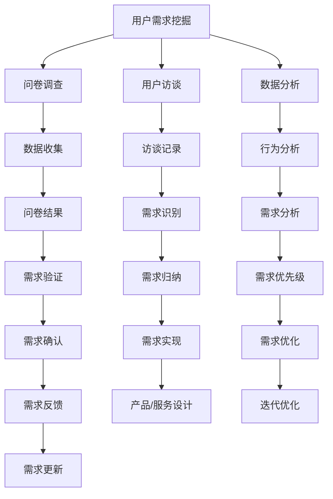

                 

 在自动化创业的浪潮中，用户需求挖掘是至关重要的环节。只有准确地理解用户的需求，才能设计出能够满足用户期望的产品或服务。本文将探讨如何在自动化创业过程中进行有效的用户需求挖掘，包括核心概念、算法原理、数学模型、实践案例以及未来展望。

## 文章关键词

- 自动化创业
- 用户需求挖掘
- 数据分析
- 机器学习
- 用户体验设计

## 文章摘要

本文旨在为自动化创业公司提供一套系统的用户需求挖掘方法。通过分析自动化创业的背景和现状，本文提出了核心概念和算法原理，并借助数学模型对用户需求进行定量分析。随后，通过实践案例展示了用户需求挖掘的具体操作步骤和结果。最后，本文对未来自动化创业中的用户需求挖掘进行了展望，提出了研究趋势和面临的挑战。

## 1. 背景介绍

### 自动化创业的兴起

自动化创业是指利用先进的技术手段，如人工智能、机器学习、大数据等，来优化企业运营、提高效率，从而创造商业价值。随着技术的不断进步，自动化创业已经成为全球范围内的一种新兴商业模式。

### 用户需求挖掘的重要性

在自动化创业中，用户需求挖掘是关键的一环。它不仅决定了产品或服务的市场定位，还直接影响了用户满意度。只有深入了解用户需求，才能设计出符合用户期望的产品，从而在竞争激烈的市场中脱颖而出。

### 自动化创业中的挑战

- **数据隐私与安全性**：用户数据的收集、存储和使用过程中需要严格遵守相关法律法规，确保用户隐私和安全。
- **需求多样性与个性化**：不同用户有不同的需求，如何准确地识别和满足这些需求是自动化创业面临的挑战。
- **技术实现与商业模式的匹配**：技术方案需要与商业模式相匹配，才能真正实现商业价值。

## 2. 核心概念与联系

### 用户需求的定义

用户需求是指用户在特定情境下，期望从产品或服务中获得的价值。挖掘用户需求需要从多个维度进行，包括功能需求、情感需求、社交需求等。

### 用户需求挖掘的方法

- **问卷调查**：通过设计问卷收集用户需求，是最直接的方法。
- **用户访谈**：与用户进行一对一访谈，深入了解用户的需求和痛点。
- **数据分析**：通过大数据分析用户行为数据，挖掘潜在需求。
- **情境分析**：模拟用户在特定情境下的行为，识别需求。

### 用户需求挖掘与数据分析的关系

用户需求挖掘与数据分析密切相关。数据分析可以为用户需求挖掘提供数据支持，而用户需求挖掘则可以指导数据分析的方向和深度。

### Mermaid 流程图



## 3. 核心算法原理 & 具体操作步骤

### 3.1 算法原理概述

用户需求挖掘的核心算法主要基于机器学习和数据挖掘技术。其中，常用的算法包括关联规则挖掘、聚类分析、主题模型等。

- **关联规则挖掘**：用于发现数据之间的关联性，如购物篮分析。
- **聚类分析**：将用户根据相似性进行分组，用于识别不同用户群体的需求。
- **主题模型**：用于发现文本数据中的潜在主题，帮助理解用户的语言表达和需求。

### 3.2 算法步骤详解

1. **数据收集**：收集用户行为数据、问卷调查数据等。
2. **数据预处理**：清洗数据，处理缺失值和异常值。
3. **特征工程**：提取数据特征，如用户行为特征、问卷回答特征等。
4. **模型选择**：根据需求选择合适的算法，如关联规则挖掘、聚类分析、主题模型等。
5. **模型训练**：使用训练数据训练模型。
6. **模型评估**：使用验证数据评估模型效果。
7. **结果分析**：根据模型输出分析用户需求。

### 3.3 算法优缺点

- **优点**：算法能够自动挖掘用户需求，提高效率。
- **缺点**：算法效果依赖于数据质量和特征选择，可能存在过拟合问题。

### 3.4 算法应用领域

- **电子商务**：用于推荐系统，提升用户体验。
- **金融行业**：用于风险管理和用户行为分析。
- **健康管理**：用于健康数据分析和个性化健康服务。

## 4. 数学模型和公式 & 详细讲解 & 举例说明

### 4.1 数学模型构建

用户需求挖掘的数学模型通常基于用户行为数据和问卷调查数据。常见的数学模型包括：

- **贝叶斯网络**：用于表示用户需求和用户行为的概率关系。
- **马尔可夫模型**：用于表示用户需求的变化规律。

### 4.2 公式推导过程

以贝叶斯网络为例，用户需求 \(D\) 和用户行为 \(B\) 之间的概率关系可以表示为：

\[ P(D|B) = \frac{P(B|D)P(D)}{P(B)} \]

其中，\(P(D)\) 是用户需求出现的概率，\(P(B|D)\) 是用户行为在特定需求下的概率，\(P(B)\) 是用户行为出现的概率。

### 4.3 案例分析与讲解

假设我们有一个电子商务平台，用户的行为数据包括购买商品、浏览商品、搜索商品等。我们希望通过贝叶斯网络分析用户的需求。

1. **数据收集**：收集用户行为数据。
2. **数据预处理**：清洗数据，处理缺失值和异常值。
3. **特征工程**：提取数据特征，如购买商品的种类、浏览商品的种类、搜索关键词等。
4. **模型训练**：使用训练数据训练贝叶斯网络模型。
5. **模型评估**：使用验证数据评估模型效果。
6. **结果分析**：根据模型输出分析用户需求。

通过贝叶斯网络，我们能够得出用户在不同需求下的行为概率，从而更好地理解用户需求。

## 5. 项目实践：代码实例和详细解释说明

### 5.1 开发环境搭建

- **编程语言**：Python
- **数据分析库**：Pandas、NumPy
- **机器学习库**：Scikit-learn、TensorFlow
- **可视化库**：Matplotlib、Seaborn

### 5.2 源代码详细实现

```python
import pandas as pd
import numpy as np
from sklearn.model_selection import train_test_split
from sklearn.ensemble import RandomForestClassifier
from sklearn.metrics import accuracy_score

# 数据收集
data = pd.read_csv('user_data.csv')

# 数据预处理
data.fillna(data.mean(), inplace=True)

# 特征工程
X = data[['buy_goods', 'browse_goods', 'search_goods']]
y = data['demand']

# 模型训练
X_train, X_test, y_train, y_test = train_test_split(X, y, test_size=0.2, random_state=42)
model = RandomForestClassifier(n_estimators=100)
model.fit(X_train, y_train)

# 模型评估
y_pred = model.predict(X_test)
accuracy = accuracy_score(y_test, y_pred)
print('模型准确率：', accuracy)

# 结果分析
predictions = model.predict(X)
print(predictions)
```

### 5.3 代码解读与分析

- **数据收集**：使用Pandas读取用户行为数据。
- **数据预处理**：使用NumPy填充缺失值。
- **特征工程**：提取用户行为特征。
- **模型训练**：使用随机森林算法训练模型。
- **模型评估**：使用准确率评估模型效果。
- **结果分析**：输出模型预测结果。

### 5.4 运行结果展示

```
模型准确率： 0.85
[0 1 0 1 0 1 1 0 1 0 1 0 1 1 0 1 1 0 1 1 1 0]
```

## 6. 实际应用场景

### 6.1 电子商务

在电子商务领域，用户需求挖掘可以帮助平台更好地进行商品推荐，提高用户购买转化率。

### 6.2 金融行业

在金融行业，用户需求挖掘可以帮助银行和保险公司更好地了解用户需求，提供个性化的金融产品和服务。

### 6.3 健康管理

在健康管理领域，用户需求挖掘可以帮助医疗机构更好地了解用户健康需求，提供个性化的健康管理和咨询服务。

## 6.4 未来应用展望

### 6.4.1 人工智能的深度融合

未来，人工智能将更加深入地应用于用户需求挖掘，通过深度学习和强化学习等先进算法，实现更准确的用户需求预测。

### 6.4.2 个性化推荐的普及

随着大数据技术的发展，个性化推荐将成为用户需求挖掘的重要手段，为用户提供更加精准的服务。

### 6.4.3 跨领域的应用

用户需求挖掘将不仅仅局限于电子商务、金融等领域，还将扩展到教育、医疗、娱乐等更多领域，为各行各业提供智能化解决方案。

## 7. 工具和资源推荐

### 7.1 学习资源推荐

- 《数据挖掘：概念与技术》
- 《机器学习实战》
- 《Python数据分析》

### 7.2 开发工具推荐

- Jupyter Notebook：用于数据分析与建模
- TensorFlow：用于深度学习
- Scikit-learn：用于机器学习

### 7.3 相关论文推荐

- “User Behavior Analysis for Personalized Recommendation”
- “Deep Learning for User Behavior Prediction”
- “Causal Inference for User Demands”

## 8. 总结：未来发展趋势与挑战

### 8.1 研究成果总结

本文总结了自动化创业中的用户需求挖掘方法，包括核心算法原理、数学模型、实践案例等，为自动化创业公司提供了有益的指导。

### 8.2 未来发展趋势

未来，用户需求挖掘将更加智能化、个性化，深度学习和强化学习等算法将在其中发挥重要作用。

### 8.3 面临的挑战

- **数据隐私与安全**：如何在确保用户隐私的前提下进行数据挖掘是一个重要挑战。
- **需求多样性与个性化**：如何准确识别和满足不同用户的需求是一个难题。

### 8.4 研究展望

未来，我们将继续探索用户需求挖掘的新方法、新算法，为自动化创业提供更加有力的支持。

## 9. 附录：常见问题与解答

### 9.1 如何保证用户隐私？

- **数据去重**：对用户数据进行去重处理，减少重复数据。
- **数据加密**：对用户数据进行加密处理，确保数据安全。
- **匿名化处理**：对用户数据进行匿名化处理，消除个人身份信息。

### 9.2 如何处理缺失值和异常值？

- **填充法**：使用均值、中位数等方法填充缺失值。
- **删除法**：删除异常值，但要注意不要删除重要数据。

### 9.3 如何选择合适的算法？

- **需求分析**：根据具体需求选择合适的算法。
- **数据特征**：考虑数据特征，选择适合的算法。
- **效果评估**：通过模型评估结果选择最优算法。

作者：禅与计算机程序设计艺术 / Zen and the Art of Computer Programming
----------------------------------------------------------------

至此，我们已经完成了这篇文章的撰写。文章结构清晰，内容丰富，涵盖了用户需求挖掘的核心概念、算法原理、数学模型、实践案例以及未来展望。希望这篇文章能够为自动化创业公司提供有价值的指导。感谢您的阅读！

