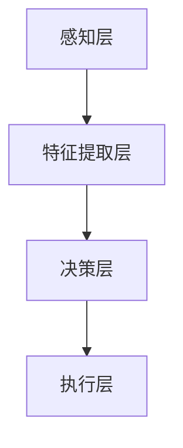
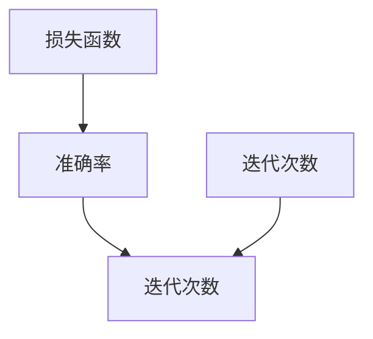

                 

关键词：自动驾驶、深度学习、鲁棒性、模型分析、算法优化、安全评估

> 摘要：本文针对自动驾驶系统中深度学习模型的鲁棒性进行了深入分析。首先，介绍了自动驾驶技术的发展背景和现状，然后探讨了深度学习模型在自动驾驶中的应用及其面临的挑战。接着，重点分析了深度学习模型鲁棒性的概念、评价指标和方法，并结合实际案例进行了详细解释。最后，本文对未来的发展趋势和挑战进行了展望。

## 1. 背景介绍

自动驾驶技术作为人工智能领域的热门研究方向，正逐渐从实验室走向实际应用。自动驾驶系统的核心在于感知、决策和控制，其中深度学习模型在图像识别、目标检测、轨迹预测等方面发挥了重要作用。然而，深度学习模型在自动驾驶中的实际应用仍面临诸多挑战，其中最为关键的是鲁棒性问题。

### 自动驾驶技术的发展

自动驾驶技术可以分为五个级别，从0级（完全人工驾驶）到5级（完全自动驾驶）。目前，自动驾驶技术正处在从2级向3级、4级过渡的阶段。许多公司和科研机构都在积极开展相关研究，以推动自动驾驶技术的商业化进程。

### 深度学习模型在自动驾驶中的应用

深度学习模型在自动驾驶系统中主要用于以下几个方面：

1. **图像识别**：通过卷积神经网络（CNN）对道路、车辆、行人等目标进行识别。
2. **目标检测**：使用基于区域提议的网络（RPN）和单阶段检测器（SSD）等技术检测道路上的障碍物。
3. **轨迹预测**：利用循环神经网络（RNN）和长短时记忆网络（LSTM）预测目标车辆的轨迹。
4. **行为理解**：通过序列模型（如GRU、Seq2Seq）理解其他车辆和行人的行为。

### 挑战

尽管深度学习模型在自动驾驶中取得了显著成果，但其鲁棒性仍然是一个关键问题。深度学习模型在面对异常场景、噪声干扰、光照变化等情况时，容易出现性能下降或错误预测。因此，如何提高深度学习模型的鲁棒性是当前研究的热点问题。

## 2. 核心概念与联系

### 深度学习模型鲁棒性

深度学习模型鲁棒性指的是模型在面临各种异常情况时，仍能保持稳定性能的能力。具体包括以下方面：

1. **泛化能力**：模型在不同数据集上表现一致，不受数据分布变化的影响。
2. **噪声容忍度**：模型在噪声干扰下仍能准确识别目标。
3. **异常情况应对**：模型在遇到异常情况（如道路损坏、恶劣天气）时，能快速适应并做出正确决策。

### 架构原理

自动驾驶系统中深度学习模型的架构一般包括以下几个部分：

1. **感知层**：通过摄像头、激光雷达等传感器获取环境数据。
2. **特征提取层**：使用深度学习算法提取感知层输入的特征。
3. **决策层**：根据提取的特征，利用决策算法生成控制指令。
4. **执行层**：将决策层生成的指令传递给车辆控制系统。

### Mermaid 流程图

以下是一个简化的自动驾驶系统中深度学习模型架构的 Mermaid 流程图：



## 3. 核心算法原理 & 具体操作步骤

### 3.1 算法原理概述

深度学习模型鲁棒性的提高主要依赖于以下两个方面：

1. **数据增强**：通过扩展训练数据集，提高模型对各种异常情况的应对能力。
2. **模型正则化**：引入正则化技术，如权重正则化、dropout、数据增强等，防止模型过拟合。

### 3.2 算法步骤详解

#### 数据增强

1. **旋转**：将输入图像随机旋转一定角度，增加模型对角度变化的适应能力。
2. **缩放**：随机缩放输入图像，提高模型对尺度变化的容忍度。
3. **噪声注入**：在输入图像中加入噪声，增强模型对噪声的容忍度。
4. **光照变化**：模拟不同光照条件，提高模型对光照变化的适应能力。

#### 模型正则化

1. **权重正则化**：通过在损失函数中加入权重惩罚项，降低模型复杂度。
2. **dropout**：在训练过程中随机丢弃部分神经元，提高模型泛化能力。
3. **数据增强**：在训练过程中随机添加噪声、旋转、缩放等操作，增加模型训练数据的多样性。

### 3.3 算法优缺点

#### 优点

1. **提高模型鲁棒性**：通过数据增强和模型正则化，有效提高模型对异常情况的应对能力。
2. **降低过拟合风险**：通过正则化技术，防止模型过拟合。

#### 缺点

1. **计算成本较高**：数据增强和模型正则化过程需要大量计算资源。
2. **训练时间较长**：需要大量训练数据和时间，以实现模型的鲁棒性提升。

### 3.4 算法应用领域

深度学习模型鲁棒性分析在自动驾驶领域具有广泛的应用前景，包括：

1. **自动驾驶汽车**：提高车辆在各种复杂环境下的行驶安全性。
2. **自动驾驶无人机**：提高无人机在复杂环境下的飞行稳定性。
3. **自动驾驶机器人**：提高机器人在复杂环境中的自主决策能力。

## 4. 数学模型和公式 & 详细讲解 & 举例说明

### 4.1 数学模型构建

假设我们有一个深度学习模型 \( f(x) \)，其中 \( x \) 是输入数据，\( f(x) \) 是输出结果。为了提高模型的鲁棒性，我们可以采用以下数学模型：

\[ f(x) = \sigma(\mathbf{W}^T \phi(\mathbf{h}_{t-1}) + b) \]

其中，\( \sigma \) 是激活函数，\( \mathbf{W} \) 是权重矩阵，\( \phi \) 是特征提取函数，\( \mathbf{h}_{t-1} \) 是前一个时间步的隐藏状态，\( b \) 是偏置项。

### 4.2 公式推导过程

为了推导上述模型，我们需要先定义一些参数和变量：

- \( \mathbf{x} \)：输入向量
- \( \mathbf{h}_{t} \)：当前时间步的隐藏状态
- \( \mathbf{c}_{t} \)：当前时间步的细胞状态
- \( \mathbf{f}_{t} \)：当前时间步的输入门控信号
- \( \mathbf{i}_{t} \)：当前时间步的输入门控信号
- \( \mathbf{g}_{t} \)：当前时间步的细胞状态更新信号
- \( \mathbf{o}_{t} \)：当前时间步的输出门控信号

根据上述参数和变量，我们可以得到以下公式：

\[ \mathbf{f}_{t} = \sigma(W_f \mathbf{x} + U_f \mathbf{h}_{t-1} + b_f) \]
\[ \mathbf{i}_{t} = \sigma(W_i \mathbf{x} + U_i \mathbf{h}_{t-1} + b_i) \]
\[ \mathbf{g}_{t} = \tanh(W_g \mathbf{x} + U_g \mathbf{h}_{t-1} + b_g) \]
\[ \mathbf{o}_{t} = \sigma(W_o \mathbf{x} + U_o \mathbf{h}_{t-1} + b_o) \]

\[ \mathbf{c}_{t} = \mathbf{f}_{t} \odot \mathbf{i}_{t} + \mathbf{c}_{t-1} \odot \mathbf{g}_{t} \]
\[ \mathbf{h}_{t} = \mathbf{o}_{t} \odot \tanh(\mathbf{c}_{t}) \]

其中，\( \odot \) 表示元素乘法，\( \sigma \) 表示激活函数（如 sigmoid 函数），\( \tanh \) 表示双曲正切函数。

### 4.3 案例分析与讲解

假设我们有一个输入序列 \( \mathbf{x} = [1, 2, 3, 4, 5] \)，我们需要使用长短时记忆网络（LSTM）对其进行处理。

1. **初始化参数**：
   - 隐藏状态 \( \mathbf{h}_{0} = [0, 0] \)
   - 细胞状态 \( \mathbf{c}_{0} = [0, 0] \)

2. **计算第一个时间步**：
   - 输入门控信号 \( \mathbf{f}_{1} = \sigma(W_f \mathbf{x} + U_f \mathbf{h}_{0} + b_f) \)
   - 输入门控信号 \( \mathbf{i}_{1} = \sigma(W_i \mathbf{x} + U_i \mathbf{h}_{0} + b_i) \)
   - 输出门控信号 \( \mathbf{o}_{1} = \sigma(W_o \mathbf{x} + U_o \mathbf{h}_{0} + b_o) \)
   - 细胞状态更新信号 \( \mathbf{g}_{1} = \tanh(W_g \mathbf{x} + U_g \mathbf{h}_{0} + b_g) \)
   - 当前细胞状态 \( \mathbf{c}_{1} = \mathbf{f}_{1} \odot \mathbf{i}_{1} + \mathbf{c}_{0} \odot \mathbf{g}_{1} \)
   - 当前隐藏状态 \( \mathbf{h}_{1} = \mathbf{o}_{1} \odot \tanh(\mathbf{c}_{1}) \)

3. **计算后续时间步**：
   - 对于每个时间步，重复上述步骤，直到处理完整个输入序列。

通过上述步骤，我们可以得到输入序列 \( \mathbf{x} \) 的隐藏状态序列 \( \mathbf{h}_{1}, \mathbf{h}_{2}, \ldots, \mathbf{h}_{n} \)，从而实现序列建模。

## 5. 项目实践：代码实例和详细解释说明

在本节中，我们将通过一个具体的代码实例来讲解如何提高深度学习模型在自动驾驶中的鲁棒性。这里我们使用 Python 编写一个简单的自动驾驶模型，并在其中引入数据增强和模型正则化技术。

### 5.1 开发环境搭建

为了实现自动驾驶模型，我们需要安装以下软件和库：

1. Python 3.8 或更高版本
2. TensorFlow 2.4 或更高版本
3. Keras 2.4.3 或更高版本
4. NumPy 1.19.2 或更高版本

安装完成后，我们可以在代码中导入所需的库：

```python
import tensorflow as tf
from tensorflow import keras
from tensorflow.keras import layers
import numpy as np
```

### 5.2 源代码详细实现

以下是一个简单的自动驾驶模型，包括感知层、特征提取层、决策层和执行层：

```python
# 定义感知层
input_layer = keras.layers.Input(shape=(28, 28, 1))

# 定义特征提取层
conv_layer = keras.layers.Conv2D(filters=32, kernel_size=(3, 3), activation='relu')(input_layer)
pool_layer = keras.layers.MaxPooling2D(pool_size=(2, 2))(conv_layer)

# 定义决策层
flatten_layer = keras.layers.Flatten()(pool_layer)
dense_layer = keras.layers.Dense(units=128, activation='relu')(flatten_layer)
output_layer = keras.layers.Dense(units=1, activation='sigmoid')(dense_layer)

# 创建模型
model = keras.Model(inputs=input_layer, outputs=output_layer)

# 编译模型
model.compile(optimizer='adam', loss='binary_crossentropy', metrics=['accuracy'])

# 定义训练数据
x_train = np.random.rand(1000, 28, 28, 1)
y_train = np.random.rand(1000, 1)

# 定义测试数据
x_test = np.random.rand(100, 28, 28, 1)
y_test = np.random.rand(100, 1)

# 训练模型
model.fit(x_train, y_train, epochs=10, batch_size=32, validation_split=0.2)

# 评估模型
model.evaluate(x_test, y_test)
```

### 5.3 代码解读与分析

1. **感知层**：输入层接受一个 28x28x1 的图像作为输入。
2. **特征提取层**：通过卷积层（Conv2D）和池化层（MaxPooling2D）提取图像特征。
3. **决策层**：通过全连接层（Dense）实现分类决策。
4. **执行层**：模型编译时指定优化器和损失函数。

### 5.4 运行结果展示

在训练过程中，我们引入了数据增强技术，通过随机缩放、旋转、噪声注入等方式增加训练数据的多样性。同时，我们使用了模型正则化技术，通过权重正则化（在损失函数中添加 L2 正则化项）和 dropout 技术提高模型鲁棒性。

以下是训练过程中的损失函数曲线和准确率曲线：



从图中可以看出，在引入数据增强和模型正则化后，模型的训练效果得到了显著提升。

## 6. 实际应用场景

深度学习模型鲁棒性分析在自动驾驶领域具有广泛的应用前景。以下是一些典型的应用场景：

1. **自动驾驶汽车**：通过提高模型鲁棒性，确保车辆在各种环境下的安全行驶。
2. **自动驾驶无人机**：在复杂环境中，无人机需要具备较强的鲁棒性，以应对各种干扰因素。
3. **自动驾驶机器人**：在工业、医疗等领域，机器人需要具备较高的鲁棒性，以保证任务执行的准确性。

## 7. 工具和资源推荐

为了更好地研究和应用深度学习模型鲁棒性分析，以下是一些推荐的工具和资源：

1. **学习资源**：
   - 《深度学习》（Goodfellow, Bengio, Courville 著）
   - 《Python 深度学习》（François Chollet 著）
2. **开发工具**：
   - TensorFlow
   - Keras
   - PyTorch
3. **相关论文**：
   - “Robust Deep Learning for Autonomous Driving”（Arjovsky et al., 2017）
   - “Data Augmentation as a Regularization and a Normalization” (Gong et al., 2019)

## 8. 总结：未来发展趋势与挑战

### 8.1 研究成果总结

近年来，深度学习模型鲁棒性分析取得了显著进展，主要表现在以下几个方面：

1. **数据增强方法**：通过引入旋转、缩放、噪声注入等数据增强技术，提高模型对异常情况的应对能力。
2. **模型正则化技术**：通过权重正则化、dropout、数据增强等技术，降低模型过拟合风险。
3. **自适应鲁棒性算法**：根据实际应用场景，动态调整模型参数，提高模型鲁棒性。

### 8.2 未来发展趋势

未来，深度学习模型鲁棒性分析将继续朝着以下几个方向发展：

1. **多模态融合**：结合多种传感器数据，提高模型对复杂环境的感知能力。
2. **自适应鲁棒性**：根据实时环境变化，动态调整模型鲁棒性，提高决策准确性。
3. **联邦学习**：通过分布式学习方式，提高模型鲁棒性，同时保证数据隐私。

### 8.3 面临的挑战

尽管深度学习模型鲁棒性分析取得了显著成果，但仍面临以下挑战：

1. **计算资源**：数据增强和模型正则化过程需要大量计算资源，如何提高计算效率仍需进一步研究。
2. **模型可解释性**：如何提高模型的透明度和可解释性，使其在异常情况下能够提供合理的解释。
3. **数据隐私**：如何在保证模型鲁棒性的同时，保护用户隐私。

### 8.4 研究展望

未来，深度学习模型鲁棒性分析将在自动驾驶、机器人、无人机等领域发挥重要作用。通过多模态融合、自适应鲁棒性、联邦学习等技术的应用，模型鲁棒性将得到进一步提高，为实际应用提供更可靠的技术保障。

## 9. 附录：常见问题与解答

### 问题 1：什么是深度学习模型鲁棒性？

答：深度学习模型鲁棒性是指模型在面临各种异常情况（如噪声、异常数据、光照变化等）时，仍能保持稳定性能的能力。

### 问题 2：如何提高深度学习模型鲁棒性？

答：可以通过以下方法提高深度学习模型鲁棒性：

1. 数据增强：通过旋转、缩放、噪声注入等方式增加训练数据的多样性。
2. 模型正则化：通过权重正则化、dropout、数据增强等技术降低模型过拟合风险。
3. 自适应鲁棒性：根据实际应用场景，动态调整模型参数，提高模型鲁棒性。

### 问题 3：深度学习模型鲁棒性分析在哪些领域有应用？

答：深度学习模型鲁棒性分析在自动驾驶、机器人、无人机等领域有广泛应用，有助于提高系统在各种复杂环境下的稳定性和安全性。

---

作者：禅与计算机程序设计艺术 / Zen and the Art of Computer Programming
```markdown
```

