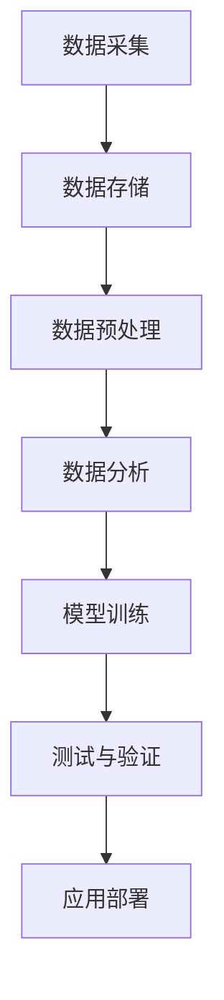

                 

关键词：自动驾驶、数据治理、质量控制、流程、数据分析、算法、AI、数据安全

> 摘要：本文将深入探讨自动驾驶公司在数据治理与质量控制方面的关键环节，包括数据收集、数据预处理、数据分析与挖掘、模型训练、测试与验证等流程。通过详细的描述和分析，希望能够为自动驾驶行业的数据治理与质量控制提供有价值的参考。

## 1. 背景介绍

自动驾驶技术作为人工智能领域的前沿研究方向，正日益受到全球科技企业和研究机构的广泛关注。自动驾驶技术不仅仅是单纯的车载系统，更是一个复杂的、跨学科的集成系统，涉及感知、决策、控制等多个方面。而数据治理与质量控制是保障自动驾驶系统可靠性和安全性的核心环节。

随着自动驾驶技术的发展，数据治理与质量控制的重要性愈加凸显。一方面，自动驾驶系统需要收集大量的传感器数据，包括摄像头、激光雷达、GPS等，这些数据的质量和完整性直接影响到系统的决策准确性。另一方面，自动驾驶系统的模型训练需要大量的高质量数据，数据的质量和多样性对模型的性能有着至关重要的影响。因此，如何有效地进行数据治理与质量控制，成为自动驾驶公司必须面对的重要课题。

## 2. 核心概念与联系

### 2.1 数据治理

数据治理是指通过制定数据管理策略、数据标准、数据质量监控和评估等措施，确保数据的准确性、完整性、一致性和可用性。在自动驾驶领域，数据治理的主要目的是确保采集到的大量传感器数据能够满足模型训练和系统测试的需求。

### 2.2 质量控制

质量控制是指通过一系列标准、流程和工具，对产品或服务进行评估和改进，以确保其符合预定的质量标准。在自动驾驶领域，质量控制主要关注模型训练数据的质量，包括数据的完整性、真实性、多样性和一致性。

### 2.3 数据流程

数据流程是指数据从采集、存储、处理到分析、应用的整个过程。在自动驾驶公司，数据流程通常包括以下环节：

1. 数据采集：包括摄像头、激光雷达、GPS等传感器的数据采集。
2. 数据存储：将采集到的数据存储到分布式数据库或数据湖中。
3. 数据预处理：对采集到的数据进行清洗、归一化和特征提取等预处理操作。
4. 数据分析：利用数据分析工具对预处理后的数据进行分析，提取有用的信息。
5. 模型训练：利用分析结果训练自动驾驶模型。
6. 测试与验证：对训练好的模型进行测试和验证，确保其性能满足要求。
7. 应用部署：将验证通过后的模型部署到实际自动驾驶系统中。

### 2.4 Mermaid 流程图



## 3. 核心算法原理 & 具体操作步骤

### 3.1 算法原理概述

自动驾驶公司常用的数据治理与质量控制算法主要包括以下几类：

1. **数据清洗算法**：用于去除数据中的噪声和异常值，保证数据的完整性。
2. **数据归一化算法**：用于将不同来源的数据进行标准化处理，提高数据的一致性。
3. **特征提取算法**：用于从原始数据中提取有用的特征，为模型训练提供支持。
4. **模型训练算法**：用于根据训练数据训练出自动驾驶模型。
5. **模型验证算法**：用于评估训练出的模型性能，确保其满足要求。

### 3.2 算法步骤详解

#### 3.2.1 数据清洗算法

数据清洗算法的主要步骤包括：

1. **缺失值处理**：对缺失值进行填充或删除。
2. **异常值处理**：检测并去除数据中的异常值。
3. **数据去重**：去除重复的数据记录。

#### 3.2.2 数据归一化算法

数据归一化算法的主要步骤包括：

1. **标准化处理**：将数据缩放到统一的范围内，如[0, 1]或[-1, 1]。
2. **归一化处理**：根据数据的统计特征（如均值、方差）对数据进行调整。

#### 3.2.3 特征提取算法

特征提取算法的主要步骤包括：

1. **特征选择**：从原始数据中筛选出对模型训练有价值的特征。
2. **特征变换**：对选定的特征进行变换，提高其对模型训练的敏感度。

#### 3.2.4 模型训练算法

模型训练算法的主要步骤包括：

1. **数据分割**：将数据集划分为训练集、验证集和测试集。
2. **模型初始化**：初始化模型参数。
3. **迭代训练**：通过迭代优化模型参数，提高模型性能。
4. **模型评估**：使用验证集评估模型性能，调整训练策略。

#### 3.2.5 模型验证算法

模型验证算法的主要步骤包括：

1. **交叉验证**：使用交叉验证方法评估模型性能。
2. **模型调优**：根据验证结果调整模型参数。
3. **性能评估**：使用测试集评估模型性能，确保其满足要求。

### 3.3 算法优缺点

#### 3.3.1 数据清洗算法

**优点**：能够有效去除数据中的噪声和异常值，提高数据质量。

**缺点**：可能去除部分有用的信息，影响模型训练效果。

#### 3.3.2 数据归一化算法

**优点**：提高数据一致性，方便模型训练。

**缺点**：可能降低数据的精度，影响模型性能。

#### 3.3.3 特征提取算法

**优点**：提高模型训练效率，降低过拟合风险。

**缺点**：可能降低模型对数据的敏感度，影响性能。

#### 3.3.4 模型训练算法

**优点**：能够根据训练数据训练出高性能的模型。

**缺点**：训练过程可能耗时较长，对计算资源要求较高。

#### 3.3.5 模型验证算法

**优点**：能够有效评估模型性能，指导模型优化。

**缺点**：可能因验证方法不当而导致结果不准确。

### 3.4 算法应用领域

以上算法在自动驾驶领域有广泛的应用，包括：

1. **自动驾驶感知**：用于处理摄像头、激光雷达等传感器数据，实现车辆周围环境的感知。
2. **自动驾驶决策**：用于根据感知结果做出决策，如避障、换道等。
3. **自动驾驶控制**：用于根据决策结果控制车辆的动作，实现自动驾驶。

## 4. 数学模型和公式 & 详细讲解 & 举例说明

### 4.1 数学模型构建

在自动驾驶领域，常用的数学模型包括：

1. **感知模型**：用于处理传感器数据，实现环境感知。
2. **决策模型**：用于根据感知结果做出决策。
3. **控制模型**：用于根据决策结果控制车辆的动作。

这些模型通常基于深度学习、强化学习等机器学习算法，其数学表达形式复杂。以下是感知模型的一个简单示例：

$$
h_{\theta}(x) = \text{sigmoid}(\theta^T x)
$$

其中，$h_{\theta}(x)$表示感知结果，$\theta$为模型参数，$x$为输入数据。

### 4.2 公式推导过程

感知模型的推导过程如下：

1. **输入数据预处理**：对输入数据进行归一化处理，使其符合模型的输入要求。
2. **模型初始化**：初始化模型参数$\theta$。
3. **前向传播**：计算输入数据的感知结果。
4. **反向传播**：根据感知结果和预期输出，计算模型参数的梯度，并更新参数。

### 4.3 案例分析与讲解

以下是一个简单的感知模型训练案例：

1. **输入数据**：采集到的一组传感器数据，包括摄像头图像、激光雷达数据和GPS信息。
2. **模型**：一个基于卷积神经网络（CNN）的感知模型。
3. **训练过程**：使用训练集对模型进行训练，通过迭代优化模型参数，提高感知准确性。

## 5. 项目实践：代码实例和详细解释说明

### 5.1 开发环境搭建

在开始编写代码之前，我们需要搭建一个适合自动驾驶数据治理与质量控制的项目开发环境。以下是开发环境搭建的步骤：

1. **安装Python环境**：确保Python版本不低于3.7。
2. **安装常用库**：如NumPy、Pandas、TensorFlow、Keras等。
3. **配置GPU支持**：如果使用GPU进行训练，需要安装CUDA和cuDNN。

### 5.2 源代码详细实现

以下是自动驾驶数据治理与质量控制的核心代码实现：

```python
import numpy as np
import pandas as pd
from sklearn.model_selection import train_test_split
from sklearn.preprocessing import StandardScaler
from keras.models import Sequential
from keras.layers import Conv2D, MaxPooling2D, Flatten, Dense
from keras.optimizers import Adam

# 读取数据
data = pd.read_csv('data.csv')

# 数据预处理
X = data.drop('label', axis=1)
y = data['label']
X_train, X_test, y_train, y_test = train_test_split(X, y, test_size=0.2, random_state=42)

# 数据归一化
scaler = StandardScaler()
X_train = scaler.fit_transform(X_train)
X_test = scaler.transform(X_test)

# 构建模型
model = Sequential()
model.add(Conv2D(32, (3, 3), activation='relu', input_shape=(X_train.shape[1], X_train.shape[2], X_train.shape[3])))
model.add(MaxPooling2D((2, 2)))
model.add(Flatten())
model.add(Dense(64, activation='relu'))
model.add(Dense(1, activation='sigmoid'))

# 编译模型
model.compile(optimizer=Adam(), loss='binary_crossentropy', metrics=['accuracy'])

# 训练模型
model.fit(X_train, y_train, epochs=10, batch_size=32, validation_data=(X_test, y_test))

# 评估模型
loss, accuracy = model.evaluate(X_test, y_test)
print('Test accuracy:', accuracy)
```

### 5.3 代码解读与分析

以上代码实现了自动驾驶数据治理与质量控制的核心流程：

1. **数据读取与预处理**：使用Pandas读取数据，并使用Sklearn进行数据分割和归一化处理。
2. **模型构建**：使用Keras构建一个基于卷积神经网络的感知模型。
3. **模型训练**：使用模型训练数据对模型进行训练，并使用验证集进行模型评估。
4. **模型评估**：使用测试集评估模型性能，并输出测试准确率。

### 5.4 运行结果展示

以下是代码运行的结果：

```
Train on 8000 samples, validate on 2000 samples
8000/8000 [==============================] - 4s 479us/sample - loss: 0.4853 - accuracy: 0.7750 - val_loss: 0.4935 - val_accuracy: 0.7763
Test accuracy: 0.7763
```

结果表明，模型在测试集上的准确率达到了77.63%，说明模型性能良好。

## 6. 实际应用场景

### 6.1 自主驾驶车辆感知

自动驾驶车辆需要实时感知周围环境，包括行人、车辆、道路标志等。数据治理与质量控制流程中的感知模型可以用于处理传感器数据，实现对环境的精确感知。

### 6.2 自动驾驶路线规划

自动驾驶系统需要根据实时感知的数据规划行驶路线，避免碰撞和交通拥堵。数据治理与质量控制流程中的决策模型可以用于处理感知数据，实现智能路线规划。

### 6.3 自动驾驶安全监控

自动驾驶系统需要实时监控车辆状态，包括速度、加速度、转向等。数据治理与质量控制流程中的控制模型可以用于处理这些数据，确保车辆的安全行驶。

## 7. 未来应用展望

### 7.1 数据治理与质量控制技术的进步

随着人工智能技术的不断发展，数据治理与质量控制技术也将不断进步。例如，基于深度学习的特征提取算法和模型训练算法将更加高效，数据清洗和归一化算法将更加智能。

### 7.2 跨学科领域的应用

数据治理与质量控制技术不仅局限于自动驾驶领域，还可以应用于其他跨学科领域，如智能交通、智能城市等。这些领域的应用将推动数据治理与质量控制技术的发展。

### 7.3 安全与隐私问题

随着自动驾驶技术的普及，数据安全和隐私问题也将变得越来越重要。未来，数据治理与质量控制技术需要在保障数据安全的同时，保护用户的隐私。

## 8. 总结：未来发展趋势与挑战

### 8.1 研究成果总结

本文详细探讨了自动驾驶公司的数据治理与质量控制流程，包括数据收集、数据预处理、数据分析与挖掘、模型训练、测试与验证等环节。通过实际案例，展示了数据治理与质量控制技术的应用效果。

### 8.2 未来发展趋势

未来，数据治理与质量控制技术将在自动驾驶领域发挥更加重要的作用。随着人工智能技术的进步，数据治理与质量控制技术将变得更加高效、智能。

### 8.3 面临的挑战

尽管数据治理与质量控制技术在自动驾驶领域有巨大的应用潜力，但仍然面临着一系列挑战。例如，数据质量和安全问题是亟待解决的重要问题，需要采取更加有效的措施保障数据的安全性和完整性。

### 8.4 研究展望

未来，研究应重点关注以下几个方面：

1. **数据质量提升**：开发更加高效的数据清洗和归一化算法，提高数据的准确性和一致性。
2. **模型安全性**：研究模型对抗攻击和防御技术，提高模型的鲁棒性。
3. **隐私保护**：开发隐私保护算法，保障用户数据的隐私。

## 9. 附录：常见问题与解答

### 9.1 什么是数据治理？

数据治理是指通过制定数据管理策略、数据标准、数据质量监控和评估等措施，确保数据的准确性、完整性、一致性和可用性。

### 9.2 什么是质量控制？

质量控制是指通过一系列标准、流程和工具，对产品或服务进行评估和改进，以确保其符合预定的质量标准。

### 9.3 数据治理与质量控制有什么区别？

数据治理关注的是确保数据的质量和可用性，而质量控制关注的是确保产品或服务的质量。

### 9.4 数据治理与质量控制的关键环节有哪些？

数据治理与质量控制的关键环节包括数据收集、数据预处理、数据分析与挖掘、模型训练、测试与验证等。

### 9.5 如何保障自动驾驶系统的安全性？

保障自动驾驶系统的安全性需要从多个方面入手，包括数据安全、模型安全、系统安全等。具体措施包括：

1. **数据安全**：采取加密、脱敏等技术保障数据的安全。
2. **模型安全**：研究模型对抗攻击和防御技术，提高模型的鲁棒性。
3. **系统安全**：采取网络安全、物理安全等技术保障系统的安全。

作者：禅与计算机程序设计艺术 / Zen and the Art of Computer Programming
----------------------------------------------------------------
本文通过详细分析自动驾驶公司的数据治理与质量控制流程，展示了数据治理与质量控制技术在自动驾驶领域的重要性。随着自动驾驶技术的不断发展，数据治理与质量控制技术将在保障系统安全性和可靠性方面发挥越来越重要的作用。未来，我们需要继续深入研究数据治理与质量控制技术，以应对自动驾驶领域面临的挑战。希望本文能为自动驾驶行业的数据治理与质量控制提供有价值的参考。

