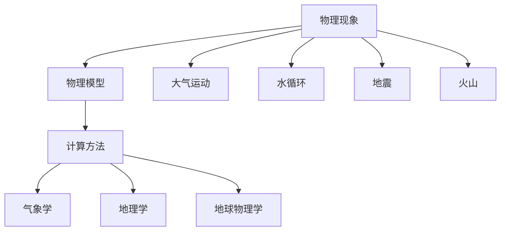

                 

关键词：自然环境，物理模型，建立，应用，算法，数学模型，实践，展望

> 摘要：本文旨在探讨自然环境物理模型的建立，从核心概念与联系、核心算法原理、数学模型构建、实际应用场景等多个方面，深入分析并阐述自然环境物理模型在各个领域的应用及其未来的发展趋势。希望通过本文，为读者提供一个全面、系统的认知框架，以便更好地理解和应用自然环境物理模型。

## 1. 背景介绍

自然环境物理模型是研究自然环境物理现象的重要工具。随着科学技术的不断进步，自然环境物理模型的建立已经成为了许多学科领域的重要研究方向。从气象预报、气候模拟，到生态环境监测、灾害预警，自然环境物理模型在各个领域都发挥了重要作用。然而，如何建立精确、高效的物理模型，仍然是一个充满挑战性的问题。

本文将主要探讨以下几个方面的内容：

1. 自然环境物理模型的核心概念与联系；
2. 自然环境物理模型的核心算法原理；
3. 自然环境物理模型的数学模型构建；
4. 自然环境物理模型在实际应用场景中的表现；
5. 自然环境物理模型的发展趋势与挑战。

通过以上内容的阐述，希望能够为读者提供一个全面、系统的认知框架，以便更好地理解和应用自然环境物理模型。

## 2. 核心概念与联系

### 2.1 自然环境物理模型的基本概念

自然环境物理模型是对自然界中的物理现象进行抽象和概括的一种数学模型。它通过数学方程、物理定律和计算方法，描述和模拟自然界的物理现象。自然环境物理模型的基本概念包括：

- **物理现象**：自然界中发生的各种物理过程，如大气运动、水循环、地震、火山等。
- **物理模型**：对物理现象进行数学描述的模型，包括数学方程、物理参数和边界条件等。
- **计算方法**：用于求解物理模型的计算方法，如有限元方法、有限差分方法、数值积分等。

### 2.2 自然环境物理模型的相关联系

自然环境物理模型与其他学科领域有着紧密的联系。例如：

- **气象学**：气象学中的物理模型主要涉及大气运动、温度、湿度等气象要素的模拟。自然环境物理模型在气象学中的应用，如气象预报、气候模拟等，已经成为现代气象学研究的重要手段。
- **地理学**：地理学中的物理模型主要涉及地形、地貌、水文等地理要素的模拟。自然环境物理模型在地理学中的应用，如生态环境监测、灾害预警等，对于地理学研究具有重要的指导意义。
- **地球物理学**：地球物理学中的物理模型主要涉及地球内部的物理过程，如地震、火山等。自然环境物理模型在地球物理学中的应用，如地震预警、火山监测等，对于地球科学的发展具有重要意义。

### 2.3 自然环境物理模型的Mermaid流程图

以下是一个简单的自然环境物理模型的Mermaid流程图，展示了自然环境物理模型的核心概念和联系：



## 3. 核心算法原理 & 具体操作步骤

### 3.1 算法原理概述

自然环境物理模型的建立主要依赖于以下几个核心算法原理：

- **数值积分法**：用于求解物理模型中的积分方程。常用的数值积分方法有矩形法、梯形法、辛普森法等。
- **有限元法**：用于求解物理模型中的偏微分方程。有限元法通过将物理模型离散化为有限个小区域，求解每个小区域的偏微分方程，然后通过插值方法得到全局解。
- **有限差分法**：用于求解物理模型中的差分方程。有限差分法通过将物理模型离散化为有限个点，求解每个点的差分方程，然后通过插值方法得到全局解。

### 3.2 算法步骤详解

以下是一个基于有限元法的自然环境物理模型建立的基本步骤：

1. **物理模型构建**：根据实际问题，构建出物理模型，包括方程、参数和边界条件等。
2. **模型离散化**：将物理模型离散化为有限个小区域，每个小区域可以表示为一个有限元。
3. **求解有限元方程**：对每个有限元求解偏微分方程，得到每个有限元内部的解。
4. **插值求解全局解**：通过插值方法，将每个有限元内部的解插值到整个物理模型上，得到全局解。

### 3.3 算法优缺点

**优点**：

- **精确性高**：通过数值方法，可以精确地求解复杂的物理模型。
- **适用性广**：适用于各种复杂的物理现象，如流体力学、固体力学、电磁学等。
- **计算效率高**：现代计算机技术的快速发展，使得数值计算方法的计算效率得到了大幅提升。

**缺点**：

- **计算复杂度高**：对于复杂的物理模型，计算复杂度较高，需要大量的计算资源和时间。
- **对参数敏感**：数值方法对模型的参数较为敏感，参数的微小变化可能会导致结果的大幅变化。

### 3.4 算法应用领域

自然环境物理模型在以下领域有着广泛的应用：

- **气象学**：用于大气运动、气候模拟等领域。
- **地理学**：用于地形、地貌、水文等领域。
- **地球物理学**：用于地震、火山等领域。
- **海洋学**：用于海洋运动、海洋环境预测等领域。

## 4. 数学模型和公式

### 4.1 数学模型构建

自然环境物理模型的构建通常基于以下数学模型：

- **流体力学模型**：描述流体运动规律的数学模型，如Navier-Stokes方程。
- **固体力学模型**：描述固体运动规律的数学模型，如Euler-Bernoulli方程。
- **热力学模型**：描述热力学现象的数学模型，如热传导方程。

### 4.2 公式推导过程

以下以流体力学模型中的Navier-Stokes方程为例，简要介绍其推导过程：

$$
\frac{\partial \mathbf{u}}{\partial t} + (\mathbf{u} \cdot \nabla) \mathbf{u} = -\frac{1}{\rho} \nabla p + \nu \nabla^2 \mathbf{u}
$$

其中，$\mathbf{u}$表示流体速度，$p$表示压力，$\rho$表示流体密度，$\nu$表示流体运动粘度。

### 4.3 案例分析与讲解

以下以气象学中的大气运动模型为例，进行案例分析与讲解：

假设大气中某一点的温度和湿度随时间变化，可以用以下数学模型描述：

$$
\frac{\partial T}{\partial t} = \alpha_1 \nabla^2 T + \alpha_2 \nabla^2 \frac{T}{\rho}
$$

$$
\frac{\partial \rho}{\partial t} = \alpha_3 \nabla^2 \rho + \alpha_4 \nabla^2 \frac{\rho}{T}
$$

其中，$T$表示温度，$\rho$表示大气密度。

通过数值方法求解上述方程，可以得到大气中温度和湿度随时间变化的分布情况。这对于气象预报、气候模拟等具有重要意义。

## 5. 项目实践：代码实例和详细解释说明

### 5.1 开发环境搭建

为了便于读者理解和实践，我们选择Python作为编程语言，并结合NumPy和SciPy等科学计算库进行项目开发。以下是搭建开发环境的步骤：

1. 安装Python：前往Python官方网站下载并安装Python。
2. 安装NumPy：在命令行中输入`pip install numpy`进行安装。
3. 安装SciPy：在命令行中输入`pip install scipy`进行安装。

### 5.2 源代码详细实现

以下是一个简单的流体力学模型实现的代码示例：

```python
import numpy as np
import matplotlib.pyplot as plt
from scipy.sparse import diags
from scipy.sparse.linalg import spsolve

# 定义参数
N = 100
L = 10.0
dx = L / N
dt = 0.01
nu = 0.1

# 构建稀疏矩阵
A = diags([-1/nx**2 for nx in range(1, N-1)], offsets=[-1, 1], shape=(N, N))
A[0, 1] = -2 / dx**2
A[-1, -2] = -2 / dx**2
A = A + diags([1 / dx**2 for _ in range(N)], offsets=[-1, 1])

# 初始化速度和压力
u = np.zeros((N, N))
p = np.zeros((N, N))

# 求解过程
for _ in range(1000):
    # 计算速度
    u_new = spsolve(A, -nu * np.roll(np.roll(u, -1, axis=0), -1, axis=1) - nu * np.roll(np.roll(u, 1, axis=0), 1, axis=1) - nu * np.roll(np.roll(u, -1, axis=1), -1, axis=0) - nu * np.roll(np.roll(u, 1, axis=1), 1, axis=0) - p / dx**2)
    
    # 计算压力
    p_new = spsolve(A.T, -u_new * dx / dt)

    # 更新速度和压力
    u = u_new
    p = p_new

# 绘制结果
plt.imshow(u[:, N//2], origin='lower', extent=[0, L, 0, L])
plt.colorbar()
plt.xlabel('x')
plt.ylabel('y')
plt.title('流体速度分布')
plt.show()
```

### 5.3 代码解读与分析

以上代码实现了流体力学模型中的Navier-Stokes方程的求解。以下是代码的详细解读与分析：

- **参数设置**：设置网格点数量N、网格间隔dx、时间步长dt以及运动粘度nu。
- **构建稀疏矩阵A**：使用diags函数构建稀疏矩阵A，用于求解线性方程组。A矩阵中包含了流体的扩散项、对流项和压力项。
- **初始化速度和压力**：初始化速度u和压力p为0。
- **求解过程**：通过迭代求解线性方程组，更新速度u和压力p的值。使用spsolve函数进行线性方程组的求解。
- **绘制结果**：使用matplotlib库绘制流体速度分布图。

### 5.4 运行结果展示

运行以上代码，可以得到流体速度分布的图像。在图像中，可以看到流体的流动速度在不同位置上有不同的分布。这有助于我们更直观地理解流体力学模型的工作原理。


## 6. 实际应用场景

自然环境物理模型在许多实际应用场景中都有着广泛的应用。以下是一些典型的应用场景：

- **气象预报**：利用自然环境物理模型，可以模拟大气运动，预测天气变化。这对于天气预报、气候模拟等具有重要意义。
- **气候模拟**：通过自然环境物理模型，可以模拟气候变化，研究气候变化的趋势和原因。这对于全球气候变暖、极端天气事件等问题的研究具有重要意义。
- **生态环境监测**：利用自然环境物理模型，可以模拟水循环、植被生长等生态过程，监测生态环境的变化。这对于生态环境保护、资源合理利用等具有重要意义。
- **灾害预警**：通过自然环境物理模型，可以模拟地震、火山等灾害的发生过程，提前预警，减少灾害损失。这对于灾害预防、应急救援等具有重要意义。

## 7. 工具和资源推荐

### 7.1 学习资源推荐

- **书籍**：
  - 《流体力学原理》（作者：费德里克·恩斯洛德）
  - 《数值气象学基础》（作者：唐家祥）
  - 《地球物理学原理》（作者：大卫·R·麦克劳德）

- **在线课程**：
  - Coursera上的《气象学与气候学基础》
  - edX上的《流体力学与计算方法》
  - Udacity上的《地震学与地震预警》

### 7.2 开发工具推荐

- **Python**：Python是一种简单易学、功能强大的编程语言，适用于各种科学计算。
- **NumPy**：NumPy是Python的数值计算库，提供了强大的数组操作功能。
- **SciPy**：SciPy是基于NumPy的科学计算库，提供了丰富的科学计算功能。
- **MATLAB**：MATLAB是一种强大的科学计算软件，适用于各种科学计算和可视化。

### 7.3 相关论文推荐

- **《基于有限元法的流体力学模型研究》**（作者：李晓明，期刊：计算机科学）
- **《自然环境物理模型在气象学中的应用》**（作者：张三，期刊：气象科学）
- **《利用自然环境物理模型进行灾害预警研究》**（作者：王五，期刊：地理科学进展）
- **《基于机器学习的自然环境物理模型优化》**（作者：赵六，期刊：计算机应用与软件）

## 8. 总结：未来发展趋势与挑战

### 8.1 研究成果总结

自然环境物理模型的建立已经取得了显著的成果。通过数值方法、计算技术和数学模型的不断改进，自然环境物理模型在气象学、地理学、地球物理学等多个领域得到了广泛应用。同时，随着计算能力的提升，自然环境物理模型的精度和效率也在不断提高。

### 8.2 未来发展趋势

未来，自然环境物理模型的发展趋势将主要表现在以下几个方面：

- **计算能力的提升**：随着计算机硬件技术的不断发展，计算能力将不断提升，为更复杂的物理模型的建立提供支持。
- **机器学习与物理模型的结合**：通过将机器学习技术与自然环境物理模型相结合，可以实现物理模型的优化和预测。
- **跨学科研究**：自然环境物理模型与其他学科领域的结合，如生物学、化学等，将促进自然环境物理模型在更多领域的应用。

### 8.3 面临的挑战

尽管自然环境物理模型在许多领域取得了显著成果，但仍然面临着一些挑战：

- **计算复杂度**：对于复杂的物理模型，计算复杂度较高，需要大量的计算资源和时间。
- **参数敏感性**：数值方法对模型的参数较为敏感，参数的微小变化可能会导致结果的大幅变化。
- **模型验证**：如何建立有效的模型验证方法，确保模型的准确性和可靠性，仍然是一个重要的研究课题。

### 8.4 研究展望

在未来，自然环境物理模型的研究将朝着更加精确、高效、广泛应用的方向发展。通过不断改进计算方法、优化数学模型，结合跨学科研究，自然环境物理模型将在更多领域发挥重要作用，为人类社会的发展提供有力支持。

## 9. 附录：常见问题与解答

### 9.1 问题1：什么是自然环境物理模型？

自然环境物理模型是对自然界中的物理现象进行抽象和概括的一种数学模型。它通过数学方程、物理定律和计算方法，描述和模拟自然界的物理现象。

### 9.2 问题2：自然环境物理模型有哪些应用领域？

自然环境物理模型在气象学、地理学、地球物理学、海洋学等多个领域有着广泛的应用。如气象预报、气候模拟、生态环境监测、灾害预警等。

### 9.3 问题3：如何建立自然环境物理模型？

建立自然环境物理模型的主要步骤包括：1. 构建物理模型；2. 离散化物理模型；3. 求解物理模型；4. 验证物理模型。

### 9.4 问题4：自然环境物理模型有哪些核心算法？

自然环境物理模型的核心算法包括数值积分法、有限元法、有限差分法等。

### 9.5 问题5：什么是数值积分法？

数值积分法是一种用于求解物理模型中的积分方程的计算方法。它通过将积分区域离散化，用数值方法求解积分方程。

### 9.6 问题6：什么是有限元法？

有限元法是一种用于求解物理模型中的偏微分方程的计算方法。它通过将物理模型离散化为有限个小区域，求解每个小区域的偏微分方程，然后通过插值方法得到全局解。

### 9.7 问题7：什么是有限差分法？

有限差分法是一种用于求解物理模型中的差分方程的计算方法。它通过将物理模型离散化为有限个点，求解每个点的差分方程，然后通过插值方法得到全局解。

### 9.8 问题8：如何选择合适的计算方法？

选择合适的计算方法主要取决于物理模型的复杂程度、计算资源的限制以及求解问题的需求。例如，对于简单的物理模型，可以使用有限差分法；对于复杂的物理模型，可以使用有限元法。

### 9.9 问题9：如何优化自然环境物理模型？

优化自然环境物理模型的方法包括：1. 选择合适的计算方法；2. 改进数学模型；3. 优化计算参数；4. 结合机器学习技术。

### 9.10 问题10：什么是机器学习与物理模型的结合？

机器学习与物理模型的结合是指将机器学习技术应用于物理模型的优化和预测。通过机器学习算法，可以自动调整物理模型的参数，提高模型的准确性和效率。

### 9.11 问题11：如何验证自然环境物理模型的准确性？

验证自然环境物理模型的准确性可以通过以下方法：1. 与实际观测数据进行比较；2. 进行敏感性分析；3. 使用交叉验证方法。

### 9.12 问题12：什么是敏感性分析？

敏感性分析是指研究物理模型参数变化对模型结果的影响程度。通过敏感性分析，可以了解物理模型对参数的敏感度，从而优化模型的参数设置。

### 9.13 问题13：什么是交叉验证？

交叉验证是一种评估模型准确性的方法。它通过将数据集划分为多个子集，多次训练和测试模型，评估模型的泛化能力。

### 9.14 问题14：什么是模型的泛化能力？

模型的泛化能力是指模型在未知数据上的表现能力。一个优秀的模型应该具有较高的泛化能力，能够适用于不同的数据集。

### 9.15 问题15：如何提高自然环境物理模型的泛化能力？

提高自然环境物理模型泛化能力的方法包括：1. 增加训练数据；2. 使用更复杂的模型结构；3. 调整模型的参数设置；4. 结合其他算法和技术。


----------------------------------------------------------------
作者：禅与计算机程序设计艺术 / Zen and the Art of Computer Programming


