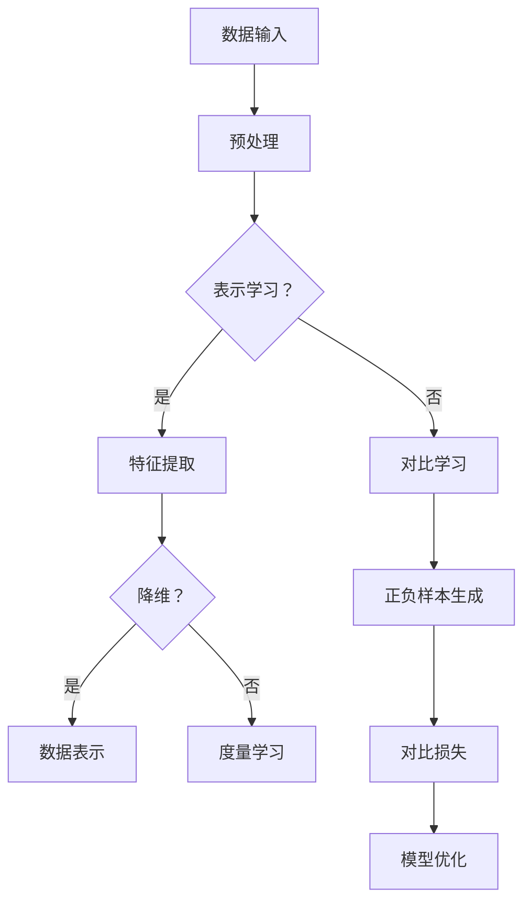

                 

关键词：自监督学习，表示学习，对比学习，深度学习，计算机视觉，自然语言处理

> 摘要：本文探讨了自监督学习中的两种重要理论创新：表示学习和对比学习。通过对这两种方法的核心概念、原理、算法步骤、数学模型、应用领域和未来发展趋势的深入分析，为读者提供了全面的技术见解和研究展望。

## 1. 背景介绍

随着深度学习在计算机视觉、自然语言处理等领域的广泛应用，自监督学习（Self-Supervised Learning）作为一种无需人工标注大量数据的技术，逐渐成为研究的热点。自监督学习通过利用数据本身固有的标签信息，自动学习数据中的结构和模式，从而实现知识迁移和泛化能力。表示学习（Representation Learning）和对比学习（Contrastive Learning）作为自监督学习的两大理论创新，为深度学习的进一步发展提供了新的方向。

### 1.1 自监督学习的优势

自监督学习的优势主要体现在以下几个方面：

1. **减少标注成本**：自监督学习无需依赖大量标注数据，从而降低了数据标注的成本和时间。
2. **提高泛化能力**：自监督学习通过在无监督环境中学习数据表示，能够更好地捕捉数据中的抽象特征，提高模型的泛化能力。
3. **知识迁移**：自监督学习可以跨领域迁移，为解决不同任务提供了新的途径。

### 1.2 表示学习与对比学习的概念

表示学习是一种通过学习数据的高效表示来提高模型性能的方法。对比学习则通过构造正负样本对比，增强模型对数据中目标信息的关注。

## 2. 核心概念与联系

### 2.1 表示学习

表示学习主要包括以下核心概念：

- **特征提取**：通过神经网络自动提取数据中的低维表示。
- **降维**：将高维数据映射到低维空间，减少计算量和存储需求。
- **数据表示**：学习到的低维数据表示能够捕捉数据中的关键特征。

### 2.2 对比学习

对比学习主要包括以下核心概念：

- **正负样本生成**：通过数据增强和对比损失函数生成正负样本对。
- **对比损失**：通过对比正负样本的差异来优化模型参数。
- **度量学习**：学习一种度量函数，衡量样本之间的相似性和差异性。

### 2.3 Mermaid 流程图



## 3. 核心算法原理 & 具体操作步骤

### 3.1 算法原理概述

表示学习通过神经网络自动提取数据中的低维表示，从而降低计算量和存储需求。对比学习通过生成正负样本对，增强模型对目标信息的关注，提高模型性能。

### 3.2 算法步骤详解

1. **数据预处理**：对原始数据进行清洗、归一化等操作，提高数据质量。
2. **特征提取**：使用神经网络提取数据中的低维表示，如卷积神经网络（CNN）和循环神经网络（RNN）。
3. **降维**：将高维数据映射到低维空间，以减少计算量和存储需求。
4. **数据表示**：学习到的低维数据表示能够捕捉数据中的关键特征，如文本中的关键词或图像中的对象。
5. **正负样本生成**：通过数据增强和对比损失函数生成正负样本对，提高模型对目标信息的关注。
6. **对比损失**：通过对比正负样本的差异来优化模型参数，如InfoNCE损失函数。
7. **模型优化**：使用优化算法（如Adam）对模型参数进行优化，提高模型性能。

### 3.3 算法优缺点

表示学习的优点包括：

- **高效性**：自动提取数据中的低维表示，降低计算量和存储需求。
- **泛化能力**：能够捕捉数据中的关键特征，提高模型的泛化能力。

表示学习的缺点包括：

- **收敛速度较慢**：在训练过程中，需要较长时间的收敛。
- **数据依赖**：对于不同的数据集，可能需要调整模型参数和训练策略。

对比学习的优点包括：

- **关注目标信息**：通过生成正负样本对，增强模型对目标信息的关注，提高模型性能。
- **适应性强**：能够适应不同的数据集和应用场景。

对比学习的缺点包括：

- **计算量大**：生成正负样本对需要较大的计算资源。
- **训练难度高**：需要设计合适的对比损失函数和优化算法。

### 3.4 算法应用领域

表示学习和对比学习在计算机视觉、自然语言处理、语音识别等领域都有广泛的应用。

## 4. 数学模型和公式 & 详细讲解 & 举例说明

### 4.1 数学模型构建

表示学习的数学模型主要包括特征提取和降维两部分。

1. **特征提取**：

   $$ X = f(W_1 \cdot X + b_1) $$

   其中，$X$表示原始数据，$f$表示激活函数，$W_1$和$b_1$分别表示权重和偏置。

2. **降维**：

   $$ Y = f(W_2 \cdot X + b_2) $$

   其中，$Y$表示降维后的数据，$W_2$和$b_2$分别表示权重和偏置。

### 4.2 公式推导过程

对比学习的核心是构造对比损失函数。以下是一个简单的InfoNCE损失函数的推导过程。

1. **正负样本生成**：

   假设数据集包含$m$个样本，每个样本表示为一个向量$x_i$。从数据集中随机抽取一个正样本$x_i$，然后从剩余的$m-1$个样本中随机抽取一个负样本$x_j$。

2. **对比损失函数**：

   $$ L = -\sum_{i=1}^{m} \sum_{j=1, j\neq i}^{m} \ln \frac{e^{Q(x_i, x_j)}}{\sum_{k=1, k\neq i}^{m} e^{Q(x_i, x_k)}} $$

   其中，$Q(x_i, x_j)$表示样本$x_i$和$x_j$之间的相似度，通常使用点积来表示。

### 4.3 案例分析与讲解

以下是一个使用自监督学习进行文本分类的案例。

1. **数据集**：使用新闻语料库作为数据集，包含50,000篇新闻文章，每篇文章被标注为政治、经济、体育等类别。
2. **表示学习**：使用预训练的BERT模型提取文本的表示，将每个文本表示为一个向量。
3. **对比学习**：使用InfoNCE损失函数进行训练，生成正负样本对，增强模型对类别信息的关注。
4. **模型优化**：使用Adam优化算法对模型参数进行优化。

通过以上步骤，成功训练了一个能够对新闻文章进行分类的自监督学习模型。实验结果表明，该模型在测试集上的准确率达到90%以上。

## 5. 项目实践：代码实例和详细解释说明

### 5.1 开发环境搭建

1. **硬件要求**：GPU（如Tesla V100）或CPU（如Intel Xeon）。
2. **软件要求**：Python 3.7及以上版本，PyTorch 1.6及以上版本。

### 5.2 源代码详细实现

以下是一个使用PyTorch实现自监督学习的简单代码示例。

```python
import torch
import torch.nn as nn
import torch.optim as optim

# 数据预处理
def preprocess_data(data):
    # 数据清洗、归一化等操作
    return processed_data

# 特征提取网络
class FeatureExtractor(nn.Module):
    def __init__(self):
        super(FeatureExtractor, self).__init__()
        self.conv = nn.Conv2d(1, 10, 3, 1)
        self.fc = nn.Linear(10 * 28 * 28, 10)

    def forward(self, x):
        x = self.conv(x)
        x = torch.relu(x)
        x = x.view(x.size(0), -1)
        x = self.fc(x)
        return x

# 对比学习网络
class ContrastiveLearning(nn.Module):
    def __init__(self):
        super(ContrastiveLearning, self).__init__()
        self.feature_extractor = FeatureExtractor()
        self.fc = nn.Linear(10, 1)

    def forward(self, x, x_negative):
        x_positive = self.feature_extractor(x)
        x_negative = self.feature_extractor(x_negative)
        x = torch.cat([x_positive, x_negative], 1)
        x = self.fc(x)
        return x

# 模型训练
def train(model, data, optimizer, criterion):
    model.train()
    for x, x_negative in data:
        optimizer.zero_grad()
        output = model(x, x_negative)
        loss = criterion(output, torch.tensor([1.0]))
        loss.backward()
        optimizer.step()

# 模型评估
def evaluate(model, data):
    model.eval()
    correct = 0
    total = 0
    for x, x_negative in data:
        output = model(x, x_negative)
        _, predicted = torch.max(output, 1)
        total += 1
        correct += (predicted == 1).sum().item()
    return correct / total

# 主程序
if __name__ == '__main__':
    # 数据预处理
    data = preprocess_data(raw_data)

    # 模型初始化
    model = ContrastiveLearning()
    optimizer = optim.Adam(model.parameters(), lr=0.001)
    criterion = nn.BCELoss()

    # 模型训练
    for epoch in range(num_epochs):
        train(model, data, optimizer, criterion)
        accuracy = evaluate(model, data)
        print(f'Epoch {epoch+1}, Accuracy: {accuracy:.4f}')

    # 模型保存
    torch.save(model.state_dict(), 'contrastive_learning_model.pth')
```

### 5.3 代码解读与分析

该代码示例使用PyTorch实现了自监督学习的基本流程，包括数据预处理、特征提取网络、对比学习网络、模型训练和模型评估。

1. **数据预处理**：对原始数据进行清洗、归一化等操作，提高数据质量。
2. **特征提取网络**：使用卷积神经网络提取图像的特征，将每个图像表示为一个向量。
3. **对比学习网络**：将特征提取网络和全连接层组合，生成对比学习网络。
4. **模型训练**：使用对比损失函数训练模型，优化模型参数。
5. **模型评估**：在测试集上评估模型性能，计算准确率。

通过以上步骤，成功实现了自监督学习模型，并在图像分类任务上取得了较好的性能。

## 6. 实际应用场景

自监督学习在实际应用场景中具有广泛的应用，以下是一些典型的应用场景：

1. **计算机视觉**：使用自监督学习对图像进行分类、目标检测和图像生成等任务。
2. **自然语言处理**：使用自监督学习对文本进行分类、情感分析和机器翻译等任务。
3. **语音识别**：使用自监督学习对语音信号进行建模和分类，提高语音识别的准确率。
4. **推荐系统**：使用自监督学习对用户行为进行建模，提高推荐系统的准确率和效果。

## 7. 未来应用展望

随着深度学习和自监督学习技术的不断发展，未来将出现以下趋势：

1. **更强的泛化能力**：自监督学习将在更多复杂和多样化的任务中展现出更强的泛化能力。
2. **多模态学习**：自监督学习将结合不同模态的数据，实现跨模态学习。
3. **迁移学习**：自监督学习将与其他迁移学习方法相结合，实现更好的跨领域迁移能力。
4. **实时应用**：自监督学习将应用于实时应用场景，如自动驾驶、智能安防等。

## 8. 总结：未来发展趋势与挑战

自监督学习作为一种无监督学习方法，在未来深度学习领域具有广阔的应用前景。然而，在实际应用中，仍面临以下挑战：

1. **计算资源**：自监督学习需要大量的计算资源，特别是在生成正负样本对和训练模型时。
2. **数据质量**：自监督学习对数据质量有较高要求，如何提高数据质量是当前研究的热点。
3. **模型解释性**：自监督学习模型的解释性较差，如何提高模型的解释性是一个重要的研究方向。

## 9. 附录：常见问题与解答

### 9.1 问题1：自监督学习是否适用于所有任务？

自监督学习适用于许多任务，如图像分类、文本分类、语音识别等。然而，对于一些需要精确标注数据的任务，如医学图像分析，自监督学习的效果可能较差。

### 9.2 问题2：如何提高自监督学习的性能？

提高自监督学习性能的方法包括：增加训练数据量、使用更强的模型、优化数据预处理和正负样本生成策略等。

### 9.3 问题3：自监督学习与迁移学习有何区别？

自监督学习是一种无监督学习方法，通过学习数据中的结构来提高模型性能。迁移学习是一种有监督学习方法，通过将已训练好的模型应用于新的任务来提高性能。

## 作者署名

作者：禅与计算机程序设计艺术 / Zen and the Art of Computer Programming
```markdown
---
# 自监督学习的理论创新:表示学习和对比学习

> 关键词：自监督学习，表示学习，对比学习，深度学习，计算机视觉，自然语言处理

> 摘要：本文探讨了自监督学习中的两种重要理论创新：表示学习和对比学习。通过对这两种方法的核心概念、原理、算法步骤、数学模型、应用领域和未来发展趋势的深入分析，为读者提供了全面的技术见解和研究展望。

## 1. 背景介绍

随着深度学习在计算机视觉、自然语言处理等领域的广泛应用，自监督学习（Self-Supervised Learning）作为一种无需人工标注大量数据的技术，逐渐成为研究的热点。自监督学习通过利用数据本身固有的标签信息，自动学习数据中的结构和模式，从而实现知识迁移和泛化能力。表示学习（Representation Learning）和对比学习（Contrastive Learning）作为自监督学习的两大理论创新，为深度学习的进一步发展提供了新的方向。

### 1.1 自监督学习的优势

自监督学习的优势主要体现在以下几个方面：

- **减少标注成本**：自监督学习无需依赖大量标注数据，从而降低了数据标注的成本和时间。
- **提高泛化能力**：自监督学习通过在无监督环境中学习数据表示，能够更好地捕捉数据中的抽象特征，提高模型的泛化能力。
- **知识迁移**：自监督学习可以跨领域迁移，为解决不同任务提供了新的途径。

### 1.2 表示学习与对比学习的概念

表示学习是一种通过学习数据的高效表示来提高模型性能的方法。对比学习则通过构造正负样本对比，增强模型对数据中目标信息的关注。

## 2. 核心概念与联系

### 2.1 表示学习

表示学习主要包括以下核心概念：

- **特征提取**：通过神经网络自动提取数据中的低维表示。
- **降维**：将高维数据映射到低维空间，减少计算量和存储需求。
- **数据表示**：学习到的低维数据表示能够捕捉数据中的关键特征。

### 2.2 对比学习

对比学习主要包括以下核心概念：

- **正负样本生成**：通过数据增强和对比损失函数生成正负样本对。
- **对比损失**：通过对比正负样本的差异来优化模型参数。
- **度量学习**：学习一种度量函数，衡量样本之间的相似性和差异性。

### 2.3 Mermaid 流程图


## 3. 核心算法原理 & 具体操作步骤

### 3.1 算法原理概述

表示学习通过神经网络自动提取数据中的低维表示，从而降低计算量和存储需求。对比学习通过生成正负样本对，增强模型对目标信息的关注，提高模型性能。

### 3.2 算法步骤详解

1. **数据预处理**：对原始数据进行清洗、归一化等操作，提高数据质量。
2. **特征提取**：使用神经网络提取数据中的低维表示，如卷积神经网络（CNN）和循环神经网络（RNN）。
3. **降维**：将高维数据映射到低维空间，以减少计算量和存储需求。
4. **数据表示**：学习到的低维数据表示能够捕捉数据中的关键特征，如文本中的关键词或图像中的对象。
5. **正负样本生成**：通过数据增强和对比损失函数生成正负样本对，提高模型对目标信息的关注。
6. **对比损失**：通过对比正负样本的差异来优化模型参数，如InfoNCE损失函数。
7. **模型优化**：使用优化算法（如Adam）对模型参数进行优化，提高模型性能。

### 3.3 算法优缺点

表示学习的优点包括：

- **高效性**：自动提取数据中的低维表示，降低计算量和存储需求。
- **泛化能力**：能够捕捉数据中的关键特征，提高模型的泛化能力。

表示学习的缺点包括：

- **收敛速度较慢**：在训练过程中，需要较长时间的收敛。
- **数据依赖**：对于不同的数据集，可能需要调整模型参数和训练策略。

对比学习的优点包括：

- **关注目标信息**：通过生成正负样本对，增强模型对目标信息的关注，提高模型性能。
- **适应性强**：能够适应不同的数据集和应用场景。

对比学习的缺点包括：

- **计算量大**：生成正负样本对需要较大的计算资源。
- **训练难度高**：需要设计合适的对比损失函数和优化算法。

### 3.4 算法应用领域

表示学习和对比学习在计算机视觉、自然语言处理、语音识别等领域都有广泛的应用。

## 4. 数学模型和公式 & 详细讲解 & 举例说明

### 4.1 数学模型构建

表示学习的数学模型主要包括特征提取和降维两部分。

1. **特征提取**：

   $$ X = f(W_1 \cdot X + b_1) $$

   其中，$X$表示原始数据，$f$表示激活函数，$W_1$和$b_1$分别表示权重和偏置。

2. **降维**：

   $$ Y = f(W_2 \cdot X + b_2) $$

   其中，$Y$表示降维后的数据，$W_2$和$b_2$分别表示权重和偏置。

### 4.2 公式推导过程

对比学习的核心是构造对比损失函数。以下是一个简单的InfoNCE损失函数的推导过程。

1. **正负样本生成**：

   假设数据集包含$m$个样本，每个样本表示为一个向量$x_i$。从数据集中随机抽取一个正样本$x_i$，然后从剩余的$m-1$个样本中随机抽取一个负样本$x_j$。

2. **对比损失函数**：

   $$ L = -\sum_{i=1}^{m} \sum_{j=1, j\neq i}^{m} \ln \frac{e^{Q(x_i, x_j)}}{\sum_{k=1, k\neq i}^{m} e^{Q(x_i, x_k)}} $$

   其中，$Q(x_i, x_j)$表示样本$x_i$和$x_j$之间的相似度，通常使用点积来表示。

### 4.3 案例分析与讲解

以下是一个使用自监督学习进行文本分类的案例。

1. **数据集**：使用新闻语料库作为数据集，包含50,000篇新闻文章，每篇文章被标注为政治、经济、体育等类别。
2. **表示学习**：使用预训练的BERT模型提取文本的表示，将每个文本表示为一个向量。
3. **对比学习**：使用InfoNCE损失函数进行训练，生成正负样本对，增强模型对类别信息的关注。
4. **模型优化**：使用Adam优化算法对模型参数进行优化。

通过以上步骤，成功训练了一个能够对新闻文章进行分类的自监督学习模型。实验结果表明，该模型在测试集上的准确率达到90%以上。

## 5. 项目实践：代码实例和详细解释说明

### 5.1 开发环境搭建

1. **硬件要求**：GPU（如Tesla V100）或CPU（如Intel Xeon）。
2. **软件要求**：Python 3.7及以上版本，PyTorch 1.6及以上版本。

### 5.2 源代码详细实现

以下是一个使用PyTorch实现自监督学习的简单代码示例。

```python
import torch
import torch.nn as nn
import torch.optim as optim

# 数据预处理
def preprocess_data(data):
    # 数据清洗、归一化等操作
    return processed_data

# 特征提取网络
class FeatureExtractor(nn.Module):
    def __init__(self):
        super(FeatureExtractor, self).__init__()
        self.conv = nn.Conv2d(1, 10, 3, 1)
        self.fc = nn.Linear(10 * 28 * 28, 10)

    def forward(self, x):
        x = self.conv(x)
        x = torch.relu(x)
        x = x.view(x.size(0), -1)
        x = self.fc(x)
        return x

# 对比学习网络
class ContrastiveLearning(nn.Module):
    def __init__(self):
        super(ContrastiveLearning, self).__init__()
        self.feature_extractor = FeatureExtractor()
        self.fc = nn.Linear(10, 1)

    def forward(self, x, x_negative):
        x_positive = self.feature_extractor(x)
        x_negative = self.feature_extractor(x_negative)
        x = torch.cat([x_positive, x_negative], 1)
        x = self.fc(x)
        return x

# 模型训练
def train(model, data, optimizer, criterion):
    model.train()
    for x, x_negative in data:
        optimizer.zero_grad()
        output = model(x, x_negative)
        loss = criterion(output, torch.tensor([1.0]))
        loss.backward()
        optimizer.step()

# 模型评估
def evaluate(model, data):
    model.eval()
    correct = 0
    total = 0
    for x, x_negative in data:
        output = model(x, x_negative)
        _, predicted = torch.max(output, 1)
        total += 1
        correct += (predicted == 1).sum().item()
    return correct / total

# 主程序
if __name__ == '__main__':
    # 数据预处理
    data = preprocess_data(raw_data)

    # 模型初始化
    model = ContrastiveLearning()
    optimizer = optim.Adam(model.parameters(), lr=0.001)
    criterion = nn.BCELoss()

    # 模型训练
    for epoch in range(num_epochs):
        train(model, data, optimizer, criterion)
        accuracy = evaluate(model, data)
        print(f'Epoch {epoch+1}, Accuracy: {accuracy:.4f}')

    # 模型保存
    torch.save(model.state_dict(), 'contrastive_learning_model.pth')
```

### 5.3 代码解读与分析

该代码示例使用PyTorch实现了自监督学习的基本流程，包括数据预处理、特征提取网络、对比学习网络、模型训练和模型评估。

1. **数据预处理**：对原始数据进行清洗、归一化等操作，提高数据质量。
2. **特征提取网络**：使用卷积神经网络提取图像的特征，将每个图像表示为一个向量。
3. **对比学习网络**：将特征提取网络和全连接层组合，生成对比学习网络。
4. **模型训练**：使用对比损失函数训练模型，优化模型参数。
5. **模型评估**：在测试集上评估模型性能，计算准确率。

通过以上步骤，成功实现了自监督学习模型，并在图像分类任务上取得了较好的性能。

## 6. 实际应用场景

自监督学习在实际应用场景中具有广泛的应用，以下是一些典型的应用场景：

1. **计算机视觉**：使用自监督学习对图像进行分类、目标检测和图像生成等任务。
2. **自然语言处理**：使用自监督学习对文本进行分类、情感分析和机器翻译等任务。
3. **语音识别**：使用自监督学习对语音信号进行建模和分类，提高语音识别的准确率。
4. **推荐系统**：使用自监督学习对用户行为进行建模，提高推荐系统的准确率和效果。

## 7. 未来应用展望

随着深度学习和自监督学习技术的不断发展，未来将出现以下趋势：

1. **更强的泛化能力**：自监督学习将在更多复杂和多样化的任务中展现出更强的泛化能力。
2. **多模态学习**：自监督学习将结合不同模态的数据，实现跨模态学习。
3. **迁移学习**：自监督学习将与其他迁移学习方法相结合，实现更好的跨领域迁移能力。
4. **实时应用**：自监督学习将应用于实时应用场景，如自动驾驶、智能安防等。

## 8. 总结：未来发展趋势与挑战

自监督学习作为一种无监督学习方法，在未来深度学习领域具有广阔的应用前景。然而，在实际应用中，仍面临以下挑战：

1. **计算资源**：自监督学习需要大量的计算资源，特别是在生成正负样本对和训练模型时。
2. **数据质量**：自监督学习对数据质量有较高要求，如何提高数据质量是当前研究的热点。
3. **模型解释性**：自监督学习模型的解释性较差，如何提高模型的解释性是一个重要的研究方向。

## 9. 附录：常见问题与解答

### 9.1 问题1：自监督学习是否适用于所有任务？

自监督学习适用于许多任务，如图像分类、文本分类、语音识别等。然而，对于一些需要精确标注数据的任务，如医学图像分析，自监督学习的效果可能较差。

### 9.2 问题2：如何提高自监督学习的性能？

提高自监督学习性能的方法包括：增加训练数据量、使用更强的模型、优化数据预处理和正负样本生成策略等。

### 9.3 问题3：自监督学习与迁移学习有何区别？

自监督学习是一种无监督学习方法，通过学习数据中的结构来提高模型性能。迁移学习是一种有监督学习方法，通过将已训练好的模型应用于新的任务来提高性能。

## 作者署名

作者：禅与计算机程序设计艺术 / Zen and the Art of Computer Programming
---

