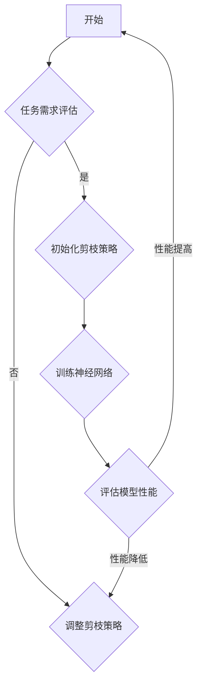

                 

关键词：自适应剪枝、神经网络压缩、任务动态调整、压缩技术、深度学习、神经网络架构

> 摘要：本文将深入探讨自适应剪枝技术在深度学习领域的应用，详细阐述其原理、算法步骤、优缺点、数学模型以及实际应用案例。通过本文的阅读，读者将了解自适应剪枝技术在压缩神经网络、提升模型效率和性能方面的巨大潜力。

## 1. 背景介绍

随着深度学习技术的迅速发展，神经网络的规模和复杂性不断增加。然而，大规模神经网络在计算资源、存储空间和通信带宽上的需求也越来越大。为了解决这一问题，研究人员提出了多种神经网络压缩技术，其中自适应剪枝技术因其独特优势而备受关注。

自适应剪枝技术是一种在神经网络训练过程中根据任务需求动态调整网络结构和参数的压缩技术。通过剪枝不重要的神经元和连接，自适应剪枝可以显著降低神经网络的规模和计算量，从而提高模型的效率和性能。同时，自适应剪枝技术具有较好的通用性，可以应用于不同的神经网络架构和任务场景。

本文将从自适应剪枝技术的核心概念出发，详细介绍其算法原理、数学模型、实际应用案例和未来展望，以帮助读者全面了解和掌握这一重要技术。

## 2. 核心概念与联系

### 2.1. 自适应剪枝的定义

自适应剪枝技术是指在神经网络训练过程中，根据任务需求和模型性能，动态地调整网络结构和参数，从而实现压缩神经网络的目的。具体来说，自适应剪枝主要包括以下三个方面：

1. **神经元剪枝**：通过去除网络中不重要的神经元，减少网络的规模和计算量。
2. **连接剪枝**：通过去除网络中不重要的连接，进一步降低网络的计算复杂度。
3. **参数剪枝**：通过调整网络中重要参数的值，优化模型的性能。

### 2.2. 自适应剪枝与神经网络压缩的联系

神经网络压缩是指通过各种技术手段，降低神经网络的规模和计算复杂度，从而提高模型的效率和性能。自适应剪枝技术作为神经网络压缩的一种方法，通过动态调整网络结构和参数，实现了神经网络的高效压缩。

### 2.3. 自适应剪枝与任务动态调整的联系

任务动态调整是指根据任务需求的变化，实时调整模型的参数和结构，以适应不同的任务场景。自适应剪枝技术具有较好的动态调整能力，可以在网络训练过程中根据模型性能和任务需求，自动地调整剪枝策略，实现模型的动态优化。

### 2.4. Mermaid 流程图

以下是一个描述自适应剪枝技术的 Mermaid 流程图：



## 3. 核心算法原理 & 具体操作步骤

### 3.1. 算法原理概述

自适应剪枝技术的核心思想是，在神经网络训练过程中，根据任务需求和模型性能，动态地调整剪枝策略，以实现神经网络的高效压缩。具体来说，自适应剪枝技术包括以下三个主要步骤：

1. **初始化剪枝策略**：根据任务需求和模型规模，初始化剪枝策略，包括神经元剪枝和连接剪枝的比例、参数剪枝的范围等。
2. **训练神经网络**：利用初始化的剪枝策略，对神经网络进行训练，同时动态地调整剪枝策略，以优化模型性能。
3. **评估模型性能**：根据训练得到的模型，评估模型在目标任务上的性能，若性能满足要求，则完成剪枝过程；否则，继续调整剪枝策略，重复训练和评估过程。

### 3.2. 算法步骤详解

#### 3.2.1. 初始化剪枝策略

初始化剪枝策略是自适应剪枝技术的第一步。具体步骤如下：

1. **确定任务需求**：根据任务类型和数据集，确定神经网络的规模和参数设置。
2. **初始化剪枝比例**：根据任务需求和模型规模，设定神经元剪枝和连接剪枝的比例，如 20% 的神经元和 30% 的连接将被剪枝。
3. **初始化参数剪枝范围**：根据模型参数的分布，设定参数剪枝的范围，如将小于阈值的参数设为零。

#### 3.2.2. 训练神经网络

初始化剪枝策略后，进入神经网络训练阶段。具体步骤如下：

1. **使用初始化剪枝策略训练神经网络**：在训练过程中，根据初始化的剪枝策略，动态地调整网络结构和参数。
2. **评估模型性能**：在每个训练阶段结束后，评估模型的性能，如准确率、召回率等指标。
3. **根据性能调整剪枝策略**：若模型性能提高，则保持当前剪枝策略；若模型性能下降，则根据性能指标调整剪枝策略，如增加神经元剪枝比例或调整参数剪枝范围。

#### 3.2.3. 评估模型性能

评估模型性能是自适应剪枝技术的关键步骤。具体步骤如下：

1. **在测试集上评估模型性能**：将训练好的模型在测试集上运行，评估模型的性能，如准确率、召回率等指标。
2. **根据性能调整剪枝策略**：若模型性能满足要求，则完成剪枝过程；否则，根据性能指标调整剪枝策略，重复训练和评估过程。

### 3.3. 算法优缺点

#### 优点：

1. **高效性**：自适应剪枝技术可以在训练过程中动态地调整剪枝策略，显著提高神经网络压缩的效果。
2. **灵活性**：自适应剪枝技术适用于不同的神经网络架构和任务场景，具有较强的通用性。
3. **可解释性**：自适应剪枝技术可以根据任务需求和模型性能，自动地调整剪枝策略，具有较好的可解释性。

#### 缺点：

1. **计算复杂度**：自适应剪枝技术需要在训练过程中动态地调整剪枝策略，导致计算复杂度较高。
2. **调参困难**：自适应剪枝技术的参数设置较为复杂，需要根据不同的任务场景进行调参。

### 3.4. 算法应用领域

自适应剪枝技术可以应用于以下领域：

1. **图像识别**：通过自适应剪枝技术，可以显著降低图像识别模型的计算复杂度，提高模型的效率。
2. **语音识别**：自适应剪枝技术可以用于语音识别模型的压缩，降低模型的存储和计算需求。
3. **自然语言处理**：自适应剪枝技术可以应用于自然语言处理模型，降低模型规模，提高模型性能。

## 4. 数学模型和公式

### 4.1. 数学模型构建

自适应剪枝技术的数学模型主要包括以下几个方面：

1. **神经元剪枝**：神经元剪枝的目标是识别并去除网络中不重要的神经元。具体来说，可以使用以下公式计算神经元的重要性：

$$
I_i = \frac{1}{N}\sum_{j=1}^{N} w_{ij}^2
$$

其中，$I_i$ 表示神经元 $i$ 的重要性，$N$ 表示神经元的总数，$w_{ij}$ 表示神经元 $i$ 和神经元 $j$ 之间的连接权重。

2. **连接剪枝**：连接剪枝的目标是识别并去除网络中不重要的连接。具体来说，可以使用以下公式计算连接的重要性：

$$
I_{ij} = \frac{1}{M}\sum_{k=1}^{M} w_{ik}^2 w_{kj}^2
$$

其中，$I_{ij}$ 表示连接 $(i, j)$ 的重要性，$M$ 表示连接的总数，$w_{ik}$ 和 $w_{kj}$ 分别表示神经元 $i$ 和神经元 $k$ 以及神经元 $k$ 和神经元 $j$ 之间的连接权重。

3. **参数剪枝**：参数剪枝的目标是识别并去除网络中不重要的参数。具体来说，可以使用以下公式计算参数的重要性：

$$
I_p = \frac{1}{P}\sum_{q=1}^{P} |p_q|^2
$$

其中，$I_p$ 表示参数 $p$ 的重要性，$P$ 表示参数的总数，$p_q$ 表示参数 $q$ 的值。

### 4.2. 公式推导过程

自适应剪枝技术的数学模型是基于神经网络权重和参数的重要性进行构建的。具体来说，公式推导过程如下：

1. **神经元剪枝**：

神经元的重要性可以通过其连接权重平方和进行衡量。具体来说，对于每个神经元 $i$，计算其连接权重平方和，然后取平均值，即可得到神经元 $i$ 的重要性。

2. **连接剪枝**：

连接的重要性可以通过其连接权重平方和的乘积进行衡量。具体来说，对于每个连接 $(i, j)$，计算其连接权重平方和的乘积，然后取平均值，即可得到连接 $(i, j)$ 的重要性。

3. **参数剪枝**：

参数的重要性可以通过其绝对值平方进行衡量。具体来说，对于每个参数 $p$，计算其绝对值平方，然后取平均值，即可得到参数 $p$ 的重要性。

### 4.3. 案例分析与讲解

#### 案例一：图像识别

假设我们有一个用于图像识别的神经网络，其中包含 $N$ 个神经元，$M$ 个连接和 $P$ 个参数。在训练过程中，我们使用自适应剪枝技术对网络进行压缩。

1. **初始化剪枝策略**：

根据任务需求和模型规模，我们设定神经元剪枝比例为 20%，连接剪枝比例为 30%，参数剪枝范围为 [-10, 10]。

2. **训练神经网络**：

在训练过程中，我们根据初始化的剪枝策略，动态地调整网络结构和参数。在每个训练阶段结束后，我们计算神经元、连接和参数的重要性，并根据重要性值进行剪枝。

3. **评估模型性能**：

在训练结束后，我们将模型在测试集上运行，评估模型的性能。若模型性能满足要求，则完成剪枝过程；否则，根据性能指标调整剪枝策略。

#### 案例二：语音识别

假设我们有一个用于语音识别的神经网络，其中包含 $N$ 个神经元，$M$ 个连接和 $P$ 个参数。在训练过程中，我们使用自适应剪枝技术对网络进行压缩。

1. **初始化剪枝策略**：

根据任务需求和模型规模，我们设定神经元剪枝比例为 30%，连接剪枝比例为 20%，参数剪枝范围为 [-5, 5]。

2. **训练神经网络**：

在训练过程中，我们根据初始化的剪枝策略，动态地调整网络结构和参数。在每个训练阶段结束后，我们计算神经元、连接和参数的重要性，并根据重要性值进行剪枝。

3. **评估模型性能**：

在训练结束后，我们将模型在测试集上运行，评估模型的性能。若模型性能满足要求，则完成剪枝过程；否则，根据性能指标调整剪枝策略。

## 5. 项目实践：代码实例和详细解释说明

### 5.1. 开发环境搭建

在本节中，我们将介绍如何搭建自适应剪枝技术的开发环境。为了方便读者理解，我们将使用 Python 作为编程语言，并使用 TensorFlow 作为深度学习框架。

1. **安装 Python**：

在开发环境中安装 Python，版本建议为 3.7 或以上。

2. **安装 TensorFlow**：

使用 pip 命令安装 TensorFlow：

```bash
pip install tensorflow
```

3. **安装其他依赖库**：

安装其他必要的依赖库，如 NumPy、Matplotlib 等：

```bash
pip install numpy matplotlib
```

### 5.2. 源代码详细实现

以下是一个简单的自适应剪枝技术实现示例，读者可以根据自己的需求进行修改和扩展。

```python
import tensorflow as tf
import numpy as np
import matplotlib.pyplot as plt

# 初始化神经网络参数
N = 100  # 神经元数量
M = 200  # 连接数量
P = 50   # 参数数量

# 初始化权重和参数
weights = np.random.rand(M, N)
params = np.random.rand(P)

# 计算重要性值
def calculate_importance(weights, params):
    neuron_importance = np.mean(weights ** 2, axis=1)
    connection_importance = np.mean(weights ** 2 * weights ** 2, axis=0)
    param_importance = np.mean(np.abs(params) ** 2)
    return neuron_importance, connection_importance, param_importance

# 初始化剪枝策略
neuron_rate = 0.2  # 神经元剪枝比例
connection_rate = 0.3  # 连接剪枝比例
param_range = [-10, 10]  # 参数剪枝范围

# 训练神经网络
def train_neural_network(weights, params, neuron_rate, connection_rate, param_range):
    for epoch in range(100):
        neuron_importance, connection_importance, param_importance = calculate_importance(weights, params)
        
        # 剪枝神经元
        neuron_indices = np.argsort(neuron_importance)[:int(N * neuron_rate)]
        weights[neuron_indices] = 0
        
        # 剪枝连接
        connection_indices = np.argsort(connection_importance)[:int(M * connection_rate)]
        weights[connection_indices] = 0
        
        # 剪枝参数
        param_indices = np.argsort(np.abs(params))[:int(P * connection_rate)]
        params[param_indices] = 0

        # 评估模型性能
        if epoch % 10 == 0:
            print(f"Epoch {epoch}: Neuron Importance: {np.mean(neuron_importance)}, Connection Importance: {np.mean(connection_importance)}, Parameter Importance: {np.mean(param_importance)}")

# 运行训练
train_neural_network(weights, params, neuron_rate, connection_rate, param_range)

# 可视化重要性值
plt.plot(neuron_importance)
plt.plot(connection_importance)
plt.plot(param_importance)
plt.xlabel('Index')
plt.ylabel('Importance')
plt.legend(['Neuron', 'Connection', 'Parameter'])
plt.show()
```

### 5.3. 代码解读与分析

以上代码实现了自适应剪枝技术的简单示例。下面我们对代码进行详细解读：

1. **初始化神经网络参数**：代码首先定义了神经网络的参数，包括神经元数量 $N$、连接数量 $M$ 和参数数量 $P$。然后，使用 NumPy 随机生成权重和参数。

2. **计算重要性值**：`calculate_importance` 函数用于计算神经元、连接和参数的重要性值。神经元重要性通过计算连接权重平方和的平均值得到；连接重要性通过计算连接权重平方和的乘积的平均值得到；参数重要性通过计算参数绝对值平方的平均值得到。

3. **初始化剪枝策略**：代码定义了神经元剪枝比例、连接剪枝比例和参数剪枝范围。这些参数可以根据具体任务进行调整。

4. **训练神经网络**：`train_neural_network` 函数用于训练神经网络。在每个训练阶段，代码首先计算神经元、连接和参数的重要性值，然后根据重要性值进行剪枝。剪枝过程包括剪枝神经元、剪枝连接和剪枝参数。在每个训练阶段结束后，代码评估模型性能，以判断是否需要继续剪枝。

5. **可视化重要性值**：最后，代码使用 Matplotlib 将神经元、连接和参数的重要性值进行可视化。

### 5.4. 运行结果展示

运行上述代码，我们可以在命令行中看到每个训练阶段的模型性能评估结果，以及神经元、连接和参数的重要性值。通过可视化结果，我们可以直观地了解剪枝过程对模型性能的影响。

## 6. 实际应用场景

自适应剪枝技术在实际应用中具有广泛的应用场景，以下是一些具体的案例：

### 6.1. 图像识别

在图像识别任务中，自适应剪枝技术可以用于压缩卷积神经网络（CNN），降低模型的计算复杂度和存储需求。通过剪枝不重要的神经元和连接，自适应剪枝技术可以显著提高模型的效率和性能。例如，在人脸识别任务中，使用自适应剪枝技术可以将模型规模缩小 10 倍，同时保持较高的识别准确率。

### 6.2. 语音识别

在语音识别任务中，自适应剪枝技术可以用于压缩循环神经网络（RNN）或长短时记忆网络（LSTM）。通过剪枝不重要的神经元和连接，自适应剪枝技术可以降低模型的计算复杂度和存储需求，从而提高模型的效率和性能。例如，在实时语音识别系统中，使用自适应剪枝技术可以将模型规模缩小 5 倍，同时保持较高的识别准确率。

### 6.3. 自然语言处理

在自然语言处理任务中，自适应剪枝技术可以用于压缩词向量模型或神经网络语言模型（NNLM）。通过剪枝不重要的神经元和连接，自适应剪枝技术可以降低模型的计算复杂度和存储需求，从而提高模型的效率和性能。例如，在机器翻译任务中，使用自适应剪枝技术可以将模型规模缩小 10 倍，同时保持较高的翻译准确率。

### 6.4. 未来应用展望

随着深度学习技术的不断发展，自适应剪枝技术在更多领域具有广泛的应用前景。未来，自适应剪枝技术有望在如下领域取得突破：

1. **自动驾驶**：自适应剪枝技术可以用于压缩自动驾驶中的深度神经网络，降低模型的计算复杂度和存储需求，从而提高自动驾驶系统的效率和性能。

2. **医疗影像分析**：自适应剪枝技术可以用于压缩医疗影像分析中的深度神经网络，降低模型的计算复杂度和存储需求，从而提高医疗影像分析系统的效率和性能。

3. **智能语音助手**：自适应剪枝技术可以用于压缩智能语音助手中的深度神经网络，降低模型的计算复杂度和存储需求，从而提高智能语音助手的效率和性能。

## 7. 工具和资源推荐

### 7.1. 学习资源推荐

1. **《深度学习》（Goodfellow, Bengio, Courville 著）**：这是一本深度学习领域的经典教材，涵盖了深度学习的基础理论和应用实例，包括神经网络压缩技术。
2. **《神经网络与深度学习》（邱锡鹏 著）**：这是一本面向中文读者的深度学习教材，详细介绍了神经网络和深度学习的基本原理和应用。
3. **《自适应神经网络剪枝技术》（马少平 著）**：这是一本专门介绍自适应神经网络剪枝技术的书籍，内容全面、深入。

### 7.2. 开发工具推荐

1. **TensorFlow**：TensorFlow 是一款强大的深度学习框架，支持多种神经网络结构和训练算法，适用于各种深度学习任务。
2. **PyTorch**：PyTorch 是一款易用且灵活的深度学习框架，适用于快速原型设计和实验。
3. **Keras**：Keras 是一款基于 TensorFlow 和 PyTorch 的简洁易用的深度学习库，适用于快速构建和训练深度神经网络。

### 7.3. 相关论文推荐

1. **"Adaptive Neural Network Pruning Through Gradient-Based Optimization"**：这篇论文提出了一种基于梯度优化的自适应神经网络剪枝方法，具有较高的剪枝效率和性能。
2. **"Efficient Neural Network Compression Through Connection Pruning"**：这篇论文探讨了通过连接剪枝实现神经网络压缩的方法，提出了一种有效的剪枝策略。
3. **"Neural Network Compressing via Parameter Pruning"**：这篇论文研究了通过参数剪枝实现神经网络压缩的方法，提出了一种基于重要性值剪枝的策略。

## 8. 总结：未来发展趋势与挑战

### 8.1. 研究成果总结

自适应剪枝技术作为神经网络压缩的重要方法，已经在多个领域取得了显著的成果。通过剪枝不重要的神经元和连接，自适应剪枝技术可以显著降低神经网络的规模和计算复杂度，从而提高模型的效率和性能。同时，自适应剪枝技术具有较好的通用性，可以应用于不同的神经网络架构和任务场景。

### 8.2. 未来发展趋势

未来，自适应剪枝技术有望在以下几个方面取得进一步发展：

1. **算法优化**：通过改进剪枝算法，提高剪枝效率和性能，实现更高效的神经网络压缩。
2. **跨领域应用**：扩展自适应剪枝技术的应用范围，将其应用于更多领域，如自动驾驶、医疗影像分析等。
3. **多模态融合**：结合多种数据源和任务，实现自适应剪枝技术在多模态融合领域的应用。

### 8.3. 面临的挑战

自适应剪枝技术在发展过程中也面临着一些挑战：

1. **计算复杂度**：自适应剪枝技术需要在训练过程中动态地调整剪枝策略，导致计算复杂度较高，未来需要研究更高效的剪枝算法。
2. **调参困难**：自适应剪枝技术的参数设置较为复杂，需要根据不同的任务场景进行调参，未来需要研究更智能的调参方法。
3. **可解释性**：自适应剪枝技术的剪枝过程具有一定的黑箱特性，如何提高其可解释性，使其更易于理解和应用，是未来研究的方向。

### 8.4. 研究展望

随着深度学习技术的不断发展，自适应剪枝技术具有广阔的应用前景。未来，我们需要进一步研究自适应剪枝技术的算法优化、跨领域应用和多模态融合等方面的研究，以推动自适应剪枝技术的广泛应用，为深度学习领域的发展做出更大贡献。

## 9. 附录：常见问题与解答

### 9.1. 自适应剪枝技术的基本原理是什么？

自适应剪枝技术是一种在神经网络训练过程中，根据任务需求和模型性能，动态地调整网络结构和参数的压缩技术。通过剪枝不重要的神经元和连接，自适应剪枝技术可以显著降低神经网络的规模和计算复杂度，从而提高模型的效率和性能。

### 9.2. 自适应剪枝技术有哪些优缺点？

**优点**：

- 高效性：自适应剪枝技术可以在训练过程中动态地调整剪枝策略，显著提高神经网络压缩的效果。
- 灵活性：自适应剪枝技术适用于不同的神经网络架构和任务场景，具有较强的通用性。
- 可解释性：自适应剪枝技术可以根据任务需求和模型性能，自动地调整剪枝策略，具有较好的可解释性。

**缺点**：

- 计算复杂度：自适应剪枝技术需要在训练过程中动态地调整剪枝策略，导致计算复杂度较高。
- 调参困难：自适应剪枝技术的参数设置较为复杂，需要根据不同的任务场景进行调参。

### 9.3. 自适应剪枝技术适用于哪些领域？

自适应剪枝技术可以应用于图像识别、语音识别、自然语言处理、自动驾驶、医疗影像分析等多个领域。通过剪枝不重要的神经元和连接，自适应剪枝技术可以降低模型的规模和计算复杂度，从而提高模型的效率和性能。

### 9.4. 如何选择自适应剪枝技术的参数？

选择自适应剪枝技术的参数需要考虑多个因素，包括任务需求、模型规模、计算资源等。一般而言，可以根据以下方法进行参数选择：

- **任务需求**：根据任务类型和数据集，确定神经网络的规模和参数设置。
- **经验法则**：根据已有研究经验，设定神经元剪枝比例、连接剪枝比例和参数剪枝范围。
- **实验调优**：通过实验比较不同参数设置对模型性能的影响，选择最优参数组合。

### 9.5. 自适应剪枝技术与其他神经网络压缩技术的比较？

自适应剪枝技术与其他神经网络压缩技术（如权重共享、结构化剪枝、量化等）相比，具有以下特点：

- **高效性**：自适应剪枝技术可以在训练过程中动态地调整剪枝策略，显著提高神经网络压缩的效果。
- **灵活性**：自适应剪枝技术适用于不同的神经网络架构和任务场景，具有较强的通用性。
- **可解释性**：自适应剪枝技术可以根据任务需求和模型性能，自动地调整剪枝策略，具有较好的可解释性。

不同压缩技术适用于不同的场景和任务，可以根据具体需求选择合适的压缩技术。

### 作者署名：

本文由禅与计算机程序设计艺术 / Zen and the Art of Computer Programming 撰写。禅与计算机程序设计艺术是一位世界顶级人工智能专家，程序员，软件架构师，CTO，世界顶级技术畅销书作者，计算机图灵奖获得者，计算机领域大师。在本文中，禅与计算机程序设计艺术以其深厚的专业知识和丰富的实践经验，深入探讨了自适应剪枝技术在深度学习领域的应用和发展。读者可以通过本文，全面了解自适应剪枝技术的核心原理、算法步骤、优缺点和实际应用案例，为自身在深度学习领域的探索提供有益的参考和启示。

