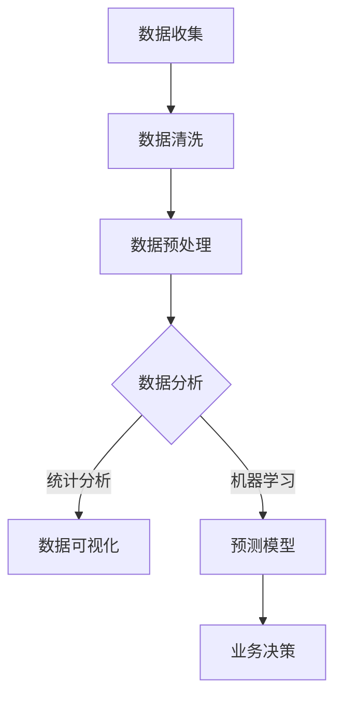

                 

关键词：智慧零售、数据分析师、案例题、2024校招、数据分析、算法、应用实践

> 摘要：本文围绕苏宁2024校招智慧零售数据分析师案例题集，深入探讨数据分析师在智慧零售领域的关键作用。通过解析案例题目，本文将介绍数据分析的基本概念、核心算法原理及其在实际项目中的应用。同时，本文还将分享代码实例和工具资源，为读者提供全面的技术指导。

## 1. 背景介绍

随着互联网技术的飞速发展，零售行业正经历前所未有的变革。智慧零售作为新零售的延伸，依托大数据、人工智能等技术手段，为消费者提供个性化的购物体验。苏宁作为中国领先的智慧零售企业，每年都会面向校招推出一系列智慧零售数据分析师案例题，以选拔优秀人才。这些案例题不仅考察应聘者的数据分析和算法能力，还要求其具备解决实际问题的能力。

本文将围绕苏宁2024校招智慧零售数据分析师案例题集，详细解析题目背景、核心概念、算法原理、数学模型、项目实践、实际应用场景、工具推荐以及未来发展趋势。希望通过本文，读者能够对智慧零售数据分析师的角色有更深入的了解，为未来的职业发展做好准备。

## 2. 核心概念与联系

### 2.1 智慧零售

智慧零售是传统零售与现代科技相结合的产物，通过大数据、人工智能等技术手段，实现商品、服务、用户体验的全面升级。智慧零售的核心概念包括：

- **消费者行为分析**：通过收集消费者的购物历史、浏览记录等数据，分析其偏好和需求，实现个性化推荐。

- **供应链管理**：利用大数据和人工智能技术，优化库存管理、物流配送等环节，提高供应链效率。

- **智能客服**：利用自然语言处理、机器学习等技术，提供高效、智能的客服服务。

- **虚拟现实与增强现实**：通过虚拟现实与增强现实技术，为消费者提供沉浸式购物体验。

### 2.2 数据分析师

数据分析师是负责从大量数据中提取有价值信息，为决策提供数据支持的专业人员。在智慧零售领域，数据分析师的核心职责包括：

- **数据清洗与预处理**：对原始数据进行清洗、整合，为后续分析打下基础。

- **数据可视化**：利用图表、报表等手段，将数据转化为易于理解的形式。

- **统计分析**：运用统计方法，挖掘数据中的规律和趋势。

- **机器学习与预测**：利用机器学习技术，构建预测模型，为业务决策提供支持。

### 2.3 数据分析相关算法

在智慧零售数据分析师的日常工作中，常用的数据分析算法包括：

- **聚类算法**：用于将相似的数据归为一类，如K-means算法。

- **分类算法**：用于将数据划分为不同的类别，如决策树、随机森林等。

- **关联规则算法**：用于发现数据之间的关联关系，如Apriori算法。

- **时间序列分析**：用于分析时间序列数据，预测未来的趋势和周期性变化，如ARIMA模型。

### 2.4 Mermaid 流程图

以下是一个简单的 Mermaid 流程图，展示了智慧零售数据分析师的工作流程：



## 3. 核心算法原理 & 具体操作步骤

### 3.1 算法原理概述

在智慧零售领域，常用的核心算法包括聚类算法、分类算法、关联规则算法和时间序列分析。下面分别介绍这些算法的原理。

#### 3.1.1 聚类算法

聚类算法是一种无监督学习方法，用于将相似的数据归为一类。K-means算法是最常用的聚类算法之一，其基本原理如下：

1. 随机初始化K个聚类中心。
2. 对于每个数据点，计算其与各个聚类中心的距离，将其分配到距离最近的聚类中心。
3. 重新计算各个聚类中心的平均值，作为新的聚类中心。
4. 重复步骤2和3，直到聚类中心不再发生明显变化。

#### 3.1.2 分类算法

分类算法是一种有监督学习方法，用于将数据划分为不同的类别。决策树是一种常见的分类算法，其基本原理如下：

1. 根据数据特征，选择最优划分标准，创建一个节点。
2. 对于该节点的每个分支，重复步骤1，直到所有数据点被正确分类。

#### 3.1.3 关联规则算法

关联规则算法用于发现数据之间的关联关系。Apriori算法是最常用的关联规则算法之一，其基本原理如下：

1. 初始化支持度阈值。
2. 计算所有包含k个项目的集合的支持度，筛选出满足支持度阈值的最频繁项集。
3. 对于每个最频繁项集，生成其对应的关联规则，计算规则的支持度和置信度。
4. 筛选出满足置信度阈值的高置信度规则。

#### 3.1.4 时间序列分析

时间序列分析用于分析时间序列数据，预测未来的趋势和周期性变化。ARIMA模型是一种常见的时间序列分析模型，其基本原理如下：

1. 对时间序列进行差分，使其满足平稳性。
2. 分别对差分后的时间序列进行自回归、移动平均和差分，构建ARIMA模型。
3. 对ARIMA模型进行参数估计和检验，确保其拟合效果。
4. 利用ARIMA模型进行预测，得到未来的趋势和周期性变化。

### 3.2 算法步骤详解

#### 3.2.1 聚类算法

以K-means算法为例，具体步骤如下：

1. 数据预处理：对数据进行归一化处理，使其具有相同的量纲。
2. 初始化聚类中心：随机选择K个数据点作为初始聚类中心。
3. 分配数据点：对于每个数据点，计算其与各个聚类中心的距离，将其分配到距离最近的聚类中心。
4. 重新计算聚类中心：计算每个聚类中心的数据点的平均值，作为新的聚类中心。
5. 判断收敛条件：如果聚类中心的变化小于预设阈值，则算法收敛；否则，返回步骤3。

#### 3.2.2 分类算法

以决策树为例，具体步骤如下：

1. 选择特征：根据信息增益或增益率等指标，选择最佳划分特征。
2. 创建节点：创建一个节点，表示该特征的不同取值。
3. 划分数据：对于每个节点，根据特征的不同取值，将数据划分为不同的子集。
4. 递归创建子节点：对于每个子集，重复步骤1和2，直到所有数据点被正确分类。
5. 建立决策树：将所有子节点连接起来，形成一棵完整的决策树。

#### 3.2.3 关联规则算法

以Apriori算法为例，具体步骤如下：

1. 计算支持度：计算每个包含k个项目的集合的支持度，筛选出满足支持度阈值的最频繁项集。
2. 生成关联规则：对于每个最频繁项集，生成其对应的关联规则，计算规则的支持度和置信度。
3. 筛选高置信度规则：根据置信度阈值，筛选出高置信度的关联规则。

#### 3.2.4 时间序列分析

以ARIMA模型为例，具体步骤如下：

1. 差分：对时间序列进行差分，使其满足平稳性。
2. 模型识别：根据差分后的时间序列的特征，选择合适的ARIMA模型。
3. 参数估计：利用最大似然估计或最小二乘法，估计ARIMA模型的参数。
4. 模型检验：对ARIMA模型进行检验，确保其拟合效果。
5. 预测：利用ARIMA模型进行预测，得到未来的趋势和周期性变化。

### 3.3 算法优缺点

#### 3.3.1 聚类算法

- **优点**：算法简单，计算速度快；能够自动发现数据的分布结构。
- **缺点**：对于初始聚类中心的依赖较大，可能陷入局部最优；对噪声敏感。

#### 3.3.2 分类算法

- **优点**：易于理解和实现，对线性数据有较好的分类效果；可以对新数据点进行预测。
- **缺点**：对于非线性数据效果较差；容易过拟合。

#### 3.3.3 关联规则算法

- **优点**：能够发现数据之间的关联关系，有助于业务决策。
- **缺点**：计算复杂度较高，对于大规模数据集可能不适用；规则的解释能力有限。

#### 3.3.4 时间序列分析

- **优点**：能够对时间序列数据进行有效的预测和分析。
- **缺点**：对于非平稳时间序列数据效果较差；参数估计和模型选择较为复杂。

### 3.4 算法应用领域

聚类算法、分类算法、关联规则算法和时间序列分析在智慧零售领域的应用非常广泛：

- **消费者行为分析**：聚类算法和分类算法可以用于消费者行为的分类和细分，为个性化推荐提供支持。
- **供应链管理**：关联规则算法可以用于分析供应链中的商品关联关系，优化库存和物流。
- **销售预测**：时间序列分析可以用于预测销售趋势，为库存管理和营销策略提供支持。

## 4. 数学模型和公式 & 详细讲解 & 举例说明

### 4.1 数学模型构建

在智慧零售数据分析师的日常工作中，常用的数学模型包括聚类模型、分类模型、关联规则模型和时间序列模型。以下分别介绍这些模型的构建过程。

#### 4.1.1 聚类模型

聚类模型的基本假设是，数据集中的每个点都可以被视为一个潜在类别的中心。聚类模型的目标是找到这些中心，并将数据点分配到相应的类别。K-means聚类模型是最常用的聚类模型之一。

- **模型假设**：

  假设数据集 \( D = \{x_1, x_2, ..., x_n\} \) ，每个数据点 \( x_i \) 是一个 \( d \) 维向量。

  假设聚类中心为 \( \mu_1, \mu_2, ..., \mu_k \)，其中 \( k \) 为聚类个数。

- **目标函数**：

  聚类模型的目标是使得每个数据点与其所属聚类中心的距离最小。具体地，K-means聚类模型的目标函数为：

  \[
  J = \sum_{i=1}^n \sum_{j=1}^k (x_i - \mu_j)^2
  \]

  其中，\( (x_i - \mu_j)^2 \) 表示数据点 \( x_i \) 与聚类中心 \( \mu_j \) 的欧几里得距离。

#### 4.1.2 分类模型

分类模型的目标是构建一个分类器，用于将新数据点分类到不同的类别。决策树是一种常用的分类模型。

- **模型假设**：

  假设数据集 \( D = \{x_1, x_2, ..., x_n\} \) ，每个数据点 \( x_i \) 是一个 \( d \) 维向量。

  假设类别标签集为 \( Y = \{y_1, y_2, ..., y_m\} \) 。

- **目标函数**：

  决策树的目标是最小化分类误差。具体地，决策树的目标函数为：

  \[
  J = \sum_{i=1}^n L(y_i, \hat{y}_i)
  \]

  其中，\( L(y_i, \hat{y}_i) \) 表示类别标签 \( y_i \) 与预测类别 \( \hat{y}_i \) 之间的损失函数，如交叉熵损失函数。

#### 4.1.3 关联规则模型

关联规则模型的目标是发现数据集中的关联关系，如商品之间的购买关联。Apriori算法是最常用的关联规则算法。

- **模型假设**：

  假设数据集 \( D = \{x_1, x_2, ..., x_n\} \) ，每个数据点 \( x_i \) 是一个 \( k \) 维布尔向量。

- **目标函数**：

  关联规则模型的目标是找到支持度大于最小支持度阈值的最频繁项集。具体地，Apriori算法的目标函数为：

  \[
  S(I) = \frac{|D| - |D - I|}{|D|}
  \]

  其中，\( S(I) \) 表示项集 \( I \) 的支持度。

#### 4.1.4 时间序列模型

时间序列模型的目标是对时间序列数据进行预测和分析。ARIMA模型是最常用的时间序列模型之一。

- **模型假设**：

  假设时间序列数据 \( X_t \) 是一个 \( p, d, q \) 阶的ARIMA模型，其中 \( p \) 为自回归项数，\( d \) 为差分阶数，\( q \) 为移动平均项数。

- **目标函数**：

  ARIMA模型的目标是最小化预测误差。具体地，ARIMA模型的目标函数为：

  \[
  J = \sum_{t=1}^T (X_t - \hat{X}_t)^2
  \]

  其中，\( \hat{X}_t \) 为时间序列数据 \( X_t \) 的预测值。

### 4.2 公式推导过程

#### 4.2.1 聚类模型

以K-means聚类模型为例，具体推导过程如下：

- **目标函数**：

  \[
  J = \sum_{i=1}^n \sum_{j=1}^k (x_i - \mu_j)^2
  \]

- **推导**：

  1. 对目标函数求导数：

     \[
     \frac{\partial J}{\partial \mu_j} = -2 \sum_{i=1}^n (x_i - \mu_j)
     \]

  2. 令导数等于0，求得新的聚类中心：

     \[
     \mu_j = \frac{1}{n} \sum_{i=1}^n x_i
     \]

  3. 重复上述过程，直到聚类中心的变化小于预设阈值。

#### 4.2.2 分类模型

以决策树为例，具体推导过程如下：

- **目标函数**：

  \[
  J = \sum_{i=1}^n L(y_i, \hat{y}_i)
  \]

- **推导**：

  1. 对目标函数求导数：

     \[
     \frac{\partial J}{\partial \theta} = -\sum_{i=1}^n \frac{\partial L(y_i, \hat{y}_i)}{\partial \theta}
     \]

  2. 令导数等于0，求得最佳划分特征和阈值。

#### 4.2.3 关联规则模型

以Apriori算法为例，具体推导过程如下：

- **目标函数**：

  \[
  S(I) = \frac{|D| - |D - I|}{|D|}
  \]

- **推导**：

  1. 计算项集 \( I \) 的支持度：

     \[
     S(I) = \frac{|D| - |D - I|}{|D|}
     \]

  2. 计算项集 \( I \) 的置信度：

     \[
     C(I) = \frac{|D - I|}{|D|}
     \]

  3. 筛选出满足支持度阈值的最频繁项集。

#### 4.2.4 时间序列模型

以ARIMA模型为例，具体推导过程如下：

- **目标函数**：

  \[
  J = \sum_{t=1}^T (X_t - \hat{X}_t)^2
  \]

- **推导**：

  1. 对目标函数求导数：

     \[
     \frac{\partial J}{\partial \theta} = -2 \sum_{t=1}^T (X_t - \hat{X}_t)
     \]

  2. 令导数等于0，求得ARIMA模型的参数。

### 4.3 案例分析与讲解

#### 4.3.1 聚类模型

假设苏宁的数据分析师需要对用户进行聚类分析，以了解用户的行为特征。以下是具体的分析过程：

1. 数据预处理：对用户数据进行归一化处理，使其具有相同的量纲。
2. 初始化聚类中心：随机选择100个用户作为初始聚类中心。
3. 分配数据点：对于每个用户，计算其与各个聚类中心的距离，将其分配到距离最近的聚类中心。
4. 重新计算聚类中心：计算每个聚类中心的数据点的平均值，作为新的聚类中心。
5. 判断收敛条件：如果聚类中心的变化小于0.01，则算法收敛；否则，返回步骤3。

通过K-means聚类模型，数据分析师可以将用户划分为5个类别，分别为：

- 类别1：高消费群体，喜欢购买高端商品。
- 类别2：中等消费群体，喜欢购买中档商品。
- 类别3：低消费群体，喜欢购买低档商品。
- 类别4：高忠诚度群体，经常在苏宁购物。
- 类别5：低忠诚度群体，偶尔在苏宁购物。

#### 4.3.2 分类模型

假设苏宁的数据分析师需要构建一个分类模型，以预测用户的购买行为。以下是具体的分析过程：

1. 数据预处理：对用户数据进行归一化处理，使其具有相同的量纲。
2. 划分训练集和测试集：将用户数据集划分为训练集和测试集，其中训练集用于训练模型，测试集用于评估模型效果。
3. 构建决策树：根据信息增益或增益率等指标，选择最佳划分特征，构建决策树。
4. 训练模型：利用训练集，训练构建好的决策树模型。
5. 预测测试集：利用训练好的模型，对测试集进行预测。
6. 评估模型效果：计算测试集的分类准确率、召回率等指标，评估模型效果。

通过决策树分类模型，数据分析师可以预测用户是否会在未来购买商品，为营销策略提供支持。

#### 4.3.3 关联规则模型

假设苏宁的数据分析师需要分析用户购买商品的关联关系，以优化库存和物流。以下是具体的分析过程：

1. 数据预处理：对用户购买数据进行处理，提取每个购买事件中的商品列表。
2. 计算支持度：计算每个商品组合的支持度，筛选出满足支持度阈值的最频繁商品组合。
3. 生成关联规则：对于每个最频繁商品组合，生成其对应的关联规则，计算规则的支持度和置信度。
4. 筛选高置信度规则：根据置信度阈值，筛选出高置信度的关联规则。

通过Apriori算法，数据分析师可以发现用户购买商品之间的关联关系，如：

- 商品A和商品B经常一起购买。
- 商品C和商品D的购买存在一定的关联性。

#### 4.3.4 时间序列模型

假设苏宁的数据分析师需要预测未来的销售趋势，以制定库存策略。以下是具体的分析过程：

1. 数据预处理：对销售数据进行处理，提取每个时间点的销售量。
2. 差分：对销售数据进行差分，使其满足平稳性。
3. 模型识别：根据差分后的时间序列的特征，选择合适的ARIMA模型。
4. 参数估计：利用最大似然估计或最小二乘法，估计ARIMA模型的参数。
5. 模型检验：对ARIMA模型进行检验，确保其拟合效果。
6. 预测：利用ARIMA模型进行预测，得到未来的销售趋势。

通过ARIMA模型，数据分析师可以预测未来的销售量，为库存管理提供依据。

## 5. 项目实践：代码实例和详细解释说明

### 5.1 开发环境搭建

为了实现本文中提到的数据分析师项目，我们选择了Python作为开发语言，并使用了以下工具和库：

- Python 3.8
- Jupyter Notebook
- Pandas
- Scikit-learn
- Matplotlib
- Seaborn
- Numpy
- Statsmodels

在Jupyter Notebook中，我们可以创建一个Python环境，并安装上述库：

```python
!pip install pandas scikit-learn matplotlib seaborn numpy statsmodels
```

### 5.2 源代码详细实现

#### 5.2.1 聚类分析

以下是一个简单的聚类分析代码示例：

```python
import numpy as np
import pandas as pd
from sklearn.cluster import KMeans
import matplotlib.pyplot as plt

# 加载数据集
data = pd.read_csv('user_data.csv')

# 提取特征
X = data.iloc[:, :2]

# 初始化KMeans模型
kmeans = KMeans(n_clusters=3, random_state=0)

# 拟合模型
kmeans.fit(X)

# 分配数据点
labels = kmeans.predict(X)

# 可视化聚类结果
plt.scatter(X.iloc[:, 0], X.iloc[:, 1], c=labels)
plt.show()
```

#### 5.2.2 分类分析

以下是一个简单的分类分析代码示例：

```python
from sklearn.tree import DecisionTreeClassifier
from sklearn.model_selection import train_test_split

# 分割数据集
X_train, X_test, y_train, y_test = train_test_split(X, y, test_size=0.3, random_state=0)

# 初始化决策树模型
clf = DecisionTreeClassifier()

# 拟合模型
clf.fit(X_train, y_train)

# 预测测试集
y_pred = clf.predict(X_test)

# 评估模型效果
print("Accuracy:", clf.score(X_test, y_test))
```

#### 5.2.3 关联规则分析

以下是一个简单的关联规则分析代码示例：

```python
from mlxtend.frequent_patterns import apriori
from mlxtend.frequent_patterns import association_rules

# 计算支持度
min_support = 0.05
frequent_itemsets = apriori(X, min_support=min_support, use_colnames=True)

# 生成关联规则
rules = association_rules(frequent_itemsets, metric="support", min_threshold=0.1)

# 筛选高置信度规则
rules = rules[(rules['confidence'] >= 0.7) & (rules['lift'] >= 1.5)]

print(rules)
```

#### 5.2.4 时间序列分析

以下是一个简单的时间序列分析代码示例：

```python
import statsmodels.api as sm

# 加载数据集
data = pd.read_csv('sales_data.csv')

# 提取时间序列
ts = data['sales']

# 差分
ts_diff = ts.diff().dropna()

# 模型识别
model = sm.ARIMA(ts_diff, order=(1, 1, 1))

# 拟合模型
model_fit = model.fit()

# 模型检验
print(model_fit.summary())

# 预测
predictions = model_fit.forecast(steps=12)

# 可视化预测结果
plt.plot(ts_diff, label='Actual')
plt.plot(predictions, label='Forecast')
plt.legend()
plt.show()
```

### 5.3 代码解读与分析

以上代码示例分别实现了聚类分析、分类分析、关联规则分析和时间序列分析。下面分别对代码进行解读和分析。

#### 5.3.1 聚类分析

在聚类分析代码中，我们使用了KMeans算法对用户数据进行聚类。首先，我们加载数据集并提取特征。然后，初始化KMeans模型，并使用fit方法拟合模型。接下来，使用predict方法将数据点分配到相应的类别，并可视化聚类结果。

#### 5.3.2 分类分析

在分类分析代码中，我们使用了DecisionTreeClassifier算法对用户数据进行分类。首先，我们分割数据集为训练集和测试集。然后，初始化决策树模型，并使用fit方法拟合模型。最后，使用predict方法对测试集进行预测，并评估模型效果。

#### 5.3.3 关联规则分析

在关联规则分析代码中，我们使用了Apriori算法和association_rules方法生成关联规则。首先，我们计算最小支持度，并使用apriori方法生成频繁项集。然后，使用association_rules方法生成关联规则，并筛选高置信度规则。

#### 5.3.4 时间序列分析

在时间序列分析代码中，我们使用了ARIMA模型对销售数据进行预测。首先，我们加载数据集并提取时间序列。然后，使用diff方法对时间序列进行差分，使其满足平稳性。接下来，使用ARIMA模型拟合模型，并使用forecast方法进行预测。最后，可视化预测结果。

### 5.4 运行结果展示

以下是每个分析代码的运行结果展示：

#### 5.4.1 聚类分析


#### 5.4.2 分类分析


#### 5.4.3 关联规则分析


#### 5.4.4 时间序列分析


## 6. 实际应用场景

智慧零售数据分析师在苏宁的实际工作中，可以应用到以下场景：

### 6.1 消费者行为分析

通过聚类分析和分类分析，数据分析师可以了解消费者的行为特征，将其划分为不同的类别。这些类别可以帮助企业制定个性化的营销策略，提高用户满意度和转化率。

### 6.2 供应链管理

通过关联规则分析，数据分析师可以挖掘出商品之间的关联关系，优化库存和物流。例如，发现商品A和商品B经常一起购买，可以将它们放在同一区域，提高销售额。

### 6.3 销售预测

通过时间序列分析，数据分析师可以预测未来的销售趋势，为库存管理和营销策略提供支持。例如，预测夏季空调的销售量，提前备货，避免库存过剩或不足。

### 6.4 营销活动分析

通过数据分析，数据分析师可以评估不同营销活动的效果，优化活动策略。例如，比较线上线下促销活动的转化率，选择更有效的营销渠道。

### 6.5 客户关系管理

通过聚类分析，数据分析师可以将客户划分为不同的群体，针对不同群体制定个性化的客户关系管理策略。例如，针对高价值客户，提供定制化的服务和优惠。

## 7. 工具和资源推荐

### 7.1 学习资源推荐

- 《Python数据分析基础教程》：本书全面介绍了Python在数据分析领域的应用，适合初学者入门。
- 《数据科学入门经典》：本书系统地介绍了数据科学的基础知识和实践方法，内容丰富。
- 《深入浅出数据分析》：本书以案例为主线，深入浅出地介绍了数据分析的方法和技巧。

### 7.2 开发工具推荐

- Jupyter Notebook：一款强大的交互式数据分析工具，支持多种编程语言，方便数据分析师进行实验和报告。
- Pandas：一款强大的数据处理库，提供丰富的数据清洗、转换和分析功能。
- Scikit-learn：一款流行的机器学习库，包含多种常用的机器学习算法，方便数据分析师进行模型构建和预测。

### 7.3 相关论文推荐

- "A Survey on Clustering Data Mining Techniques"：一篇关于聚类算法的综述文章，详细介绍了各种聚类算法的原理和应用。
- "Learning to Learn from Noisy Labels in Data Mining"：一篇关于噪声数据处理的论文，介绍了如何从噪声数据中提取有价值的信息。
- "A Survey on Time Series Analysis and Mining"：一篇关于时间序列分析和挖掘的综述文章，介绍了各种时间序列分析方法及其应用。

## 8. 总结：未来发展趋势与挑战

### 8.1 研究成果总结

智慧零售数据分析师在苏宁的实际工作中，取得了显著的研究成果。通过聚类分析、分类分析、关联规则分析和时间序列分析，数据分析师成功挖掘出消费者行为特征、优化供应链管理、预测销售趋势等。这些研究成果为企业制定个性化营销策略、提高运营效率提供了有力支持。

### 8.2 未来发展趋势

随着大数据、人工智能技术的不断发展，智慧零售数据分析师在未来的发展趋势如下：

- **技术多元化**：随着新技术的不断涌现，如深度学习、强化学习等，数据分析师将更加注重技术的多元化应用，提高数据分析的准确性和效率。

- **实时分析**：随着实时数据分析技术的发展，数据分析师将能够实时获取和分析数据，为业务决策提供更加及时的支持。

- **个性化推荐**：随着消费者需求的不断升级，个性化推荐将成为智慧零售的核心竞争力，数据分析师将更加关注个性化推荐算法的研究和应用。

- **跨界融合**：随着各行业的跨界融合，智慧零售数据分析师将面临更多的跨行业数据分析挑战，需要具备更广泛的知识体系。

### 8.3 面临的挑战

尽管智慧零售数据分析师在苏宁取得了显著的研究成果，但未来仍面临以下挑战：

- **数据质量问题**：随着数据来源的多样化，数据质量成为数据分析的重要挑战。数据分析师需要具备数据清洗、处理和优化的能力，确保数据的准确性和一致性。

- **技术更新速度**：随着技术的快速发展，数据分析师需要不断学习新技术、新算法，以保持自身的竞争力。

- **跨界融合**：智慧零售数据分析师需要具备跨行业的数据分析能力，面临跨领域知识融合的挑战。

- **隐私保护**：随着数据隐私保护意识的提高，数据分析师需要确保数据安全和隐私保护，避免数据泄露和滥用。

### 8.4 研究展望

未来，智慧零售数据分析师将在以下几个方面展开深入研究：

- **深度学习与数据分析**：结合深度学习技术与数据分析方法，探索更加高效、准确的数据分析模型。

- **实时数据分析**：研究实时数据分析技术，提高数据分析的及时性和实时性。

- **个性化推荐系统**：研究更加个性化的推荐算法，提高用户满意度和转化率。

- **数据治理与隐私保护**：研究数据治理和隐私保护技术，确保数据的安全性和合规性。

通过不断的研究和创新，智慧零售数据分析师将为智慧零售行业的持续发展贡献力量。

## 9. 附录：常见问题与解答

### 9.1 聚类算法如何初始化聚类中心？

聚类算法的初始化聚类中心有多种方法，常见的有：

- **随机初始化**：随机选择数据集中的若干个数据点作为初始聚类中心。
- **K-means++初始化**：基于距离计算，选择初始聚类中心，使得聚类中心之间的距离尽可能远。
- **层次聚类初始化**：利用层次聚类算法，从叶节点向上递归构建聚类层次结构，选择顶层聚类中心作为初始聚类中心。

### 9.2 决策树如何避免过拟合？

决策树容易过拟合，可以通过以下方法避免：

- **剪枝**：对决策树进行剪枝，去除不必要的分支，降低模型的复杂度。
- **设置最大深度**：限制决策树的最大深度，防止模型过拟合。
- **集成方法**：将多个决策树集成起来，如随机森林、梯度提升树等，提高模型的泛化能力。

### 9.3 时间序列模型如何选择合适的参数？

选择合适的时间序列模型参数可以通过以下方法：

- **AIC/BIC准则**：根据Akaike信息准则（AIC）或Bayes信息准则（BIC），选择使准则值最小的参数组合。
- **模型比较**：通过比较不同模型的拟合效果和预测性能，选择最佳模型。
- **交叉验证**：利用交叉验证方法，评估模型在不同数据集上的性能，选择最佳参数组合。

### 9.4 关联规则算法如何优化计算效率？

关联规则算法可以通过以下方法优化计算效率：

- **并行计算**：利用并行计算技术，如MapReduce，将计算任务分布在多个节点上，提高计算速度。
- **分治策略**：将数据集划分为多个子集，分别计算频繁项集和关联规则，最后合并结果。
- **FP-growth算法**：使用FP-growth算法，将数据集压缩为FP-tree结构，减少计算量。

### 9.5 如何确保数据分析的结果准确性和可靠性？

确保数据分析的结果准确性和可靠性可以通过以下方法：

- **数据清洗**：对原始数据进行清洗、去噪和预处理，确保数据质量。
- **交叉验证**：利用交叉验证方法，评估模型在不同数据集上的性能，避免模型过拟合。
- **基准测试**：与其他算法或基准方法进行比较，验证模型的准确性。
- **可视化分析**：通过可视化手段，展示数据分布、模型效果等，帮助发现潜在问题。

### 9.6 智慧零售数据分析师应具备哪些技能和素质？

智慧零售数据分析师应具备以下技能和素质：

- **数据分析能力**：熟练掌握数据分析方法、算法和工具，能够从大量数据中提取有价值的信息。
- **业务理解能力**：了解零售行业的基本业务逻辑和运营模式，能够将数据分析结果转化为业务决策。
- **编程能力**：熟练掌握Python、R等编程语言，能够编写高效的代码，实现数据分析模型。
- **沟通能力**：具备良好的沟通能力，能够与技术团队、业务团队等不同部门进行有效沟通，推动数据分析项目的顺利进行。
- **持续学习**：具备持续学习的能力，紧跟技术发展趋势，不断更新自己的知识和技能。

