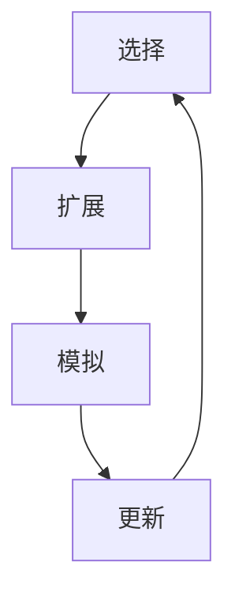

                 

关键词：蒙特卡罗树搜索、MCTS、搜索算法、强化学习、游戏AI、策略优化

> 摘要：蒙特卡罗树搜索（MCTS）是一种基于概率和统计的搜索算法，广泛应用于游戏AI和强化学习领域。本文将详细介绍MCTS的核心概念、原理及其实现，并通过实际代码实例进行解释和说明，帮助读者深入理解MCTS的工作机制和应用场景。

## 1. 背景介绍

在计算机科学和人工智能领域，搜索算法一直是一个重要的研究课题。从传统的深度优先搜索、广度优先搜索，到启发式搜索、A*算法等，各种搜索算法在路径规划、问题求解等领域发挥了重要作用。然而，随着问题的复杂性和规模的增长，传统搜索算法面临着效率低下和难以处理的挑战。为了解决这一问题，蒙特卡罗树搜索（MCTS）算法应运而生。

MCTS算法最初由Pieter Spronck于2008年提出，是一种基于概率和统计的搜索算法，其核心思想是通过模拟（Simulation）来评估节点的好坏，并在此基础上进行选择（Selection）、扩展（Expansion）、模拟（Simulation）和更新（Backpropagation）操作，从而实现搜索目标。MCTS算法在游戏AI和强化学习领域取得了显著的成功，如AlphaGo等顶级游戏AI都采用了MCTS算法。

本文将围绕MCTS算法的核心概念、原理及其实现进行详细讲解，并通过实际代码实例帮助读者深入理解MCTS的工作机制和应用场景。

## 2. 核心概念与联系

### 2.1. MCTS的基本概念

MCTS算法的核心概念包括四个部分：选择（Selection）、扩展（Expansion）、模拟（Simulation）和更新（Backpropagation）。

1. **选择（Selection）**：从根节点开始，根据节点的选择概率进行选择，直到找到一个未扩展的叶子节点。
2. **扩展（Expansion）**：在选择的叶子节点上扩展一个新的子节点，并将其作为新的根节点。
3. **模拟（Simulation）**：从扩展后的节点开始进行随机模拟，模拟结果用于评估节点的价值。
4. **更新（Backpropagation）**：根据模拟结果更新节点的选择概率和期望值，从而影响后续的选择和扩展过程。

### 2.2. MCTS与强化学习的联系

MCTS算法与强化学习有着密切的联系。在强化学习框架中，智能体（Agent）通过与环境（Environment）进行交互来学习最优策略。而MCTS算法为智能体提供了一个高效的搜索策略，通过在树结构中迭代地进行选择、扩展、模拟和更新操作，智能体可以逐渐收敛到最优策略。

具体来说，MCTS算法在强化学习中的应用主要体现在两个方面：

1. **策略评估（Policy Evaluation）**：通过模拟来评估不同策略的价值，从而选择最优策略。
2. **策略迭代（Policy Iteration）**：通过MCTS算法进行策略迭代，逐步优化智能体的策略。

### 2.3. MCTS的Mermaid流程图

下面是一个简单的Mermaid流程图，展示了MCTS的基本流程：



在这个流程图中，A表示选择操作，B表示扩展操作，C表示模拟操作，D表示更新操作。通过这个简单的流程图，我们可以直观地了解MCTS的基本步骤和流程。

## 3. 核心算法原理 & 具体操作步骤

### 3.1. 算法原理概述

MCTS算法的核心原理是通过模拟来评估节点的价值，并在树结构中进行迭代搜索，以找到最优解。具体来说，MCTS算法包括四个步骤：选择、扩展、模拟和更新。

1. **选择（Selection）**：从根节点开始，根据节点的选择概率进行选择，直到找到一个未扩展的叶子节点。选择概率可以通过UCB1公式计算，即：

   $$ UCB_1(n) = \frac{V_n}{N_n} + \sqrt{\frac{2 \ln N}{N_n}} $$

   其中，$V_n$表示节点的价值，$N_n$表示节点的访问次数，$N$表示所有节点的访问次数。

2. **扩展（Expansion）**：在选择的叶子节点上扩展一个新的子节点，并将其作为新的根节点。扩展操作通常采用最大化期望收益的方式，即：

   $$ \max V_n = \max \frac{R_n}{N_n} $$

   其中，$R_n$表示节点收益。

3. **模拟（Simulation）**：从扩展后的节点开始进行随机模拟，模拟结果用于评估节点的价值。模拟过程可以看作是一个随机游走过程，通过模拟多次游戏，可以得到节点的期望收益。

4. **更新（Backpropagation）**：根据模拟结果更新节点的选择概率和期望值，从而影响后续的选择和扩展过程。更新操作包括两部分：更新节点价值$V_n$和更新节点访问次数$N_n$。

### 3.2. 算法步骤详解

1. **初始化**：创建一个根节点，初始状态为游戏开始状态，价值为0，访问次数为1。

2. **选择（Selection）**：从根节点开始，根据UCB1公式计算每个节点的选择概率，选择概率最大的节点作为当前节点。

3. **扩展（Expansion）**：如果当前节点是未扩展的叶子节点，则在当前节点上扩展一个新的子节点。扩展操作采用最大化期望收益的方式，选择期望收益最大的节点作为新的子节点。

4. **模拟（Simulation）**：从扩展后的节点开始进行随机模拟，模拟结果用于评估节点的价值。模拟过程可以看作是一个随机游走过程，通过模拟多次游戏，可以得到节点的期望收益。

5. **更新（Backpropagation）**：根据模拟结果更新节点的价值$V_n$和访问次数$N_n$。更新公式如下：

   $$ V_n = V_n + R $$
   $$ N_n = N_n + 1 $$

   其中，$R$表示模拟结果。

6. **重复步骤2-5**，直到达到预设的迭代次数或搜索深度。

### 3.3. 算法优缺点

MCTS算法具有以下优点：

1. **高效性**：MCTS算法通过模拟来评估节点的价值，可以快速找到近似最优解。
2. **灵活性**：MCTS算法适用于各种类型的问题，特别是具有不确定性、随机性和复杂性的问题。
3. **可扩展性**：MCTS算法可以与其他算法（如强化学习算法）相结合，提高搜索效率和性能。

MCTS算法也存在一些缺点：

1. **计算开销**：MCTS算法需要进行大量的模拟操作，计算开销较大。
2. **收敛速度**：MCTS算法的收敛速度较慢，需要多次迭代才能找到近似最优解。
3. **适用范围**：MCTS算法在处理静态问题（如棋类游戏）时表现较好，但在处理动态问题（如实时游戏）时存在一定挑战。

### 3.4. 算法应用领域

MCTS算法在计算机科学和人工智能领域有广泛的应用，主要包括以下几个方面：

1. **游戏AI**：MCTS算法在围棋、国际象棋、五子棋等棋类游戏中取得了显著的成功。例如，AlphaGo等顶级游戏AI采用了MCTS算法，取得了世界冠军。
2. **强化学习**：MCTS算法在强化学习领域有广泛的应用，如Atari游戏、机器人控制、自动驾驶等。
3. **优化问题**：MCTS算法可以用于解决各种优化问题，如资源分配、路径规划等。

## 4. 数学模型和公式 & 详细讲解 & 举例说明

### 4.1. 数学模型构建

MCTS算法的核心在于如何评估节点的价值，这涉及到一些数学模型和公式。下面将介绍MCTS算法中常用的数学模型和公式。

#### 4.1.1. 选择概率

选择概率是MCTS算法中一个重要的参数，用于决定选择哪个节点进行扩展。常用的选择概率公式包括UCB1和UCB1-polya公式。

- **UCB1公式**：

  $$ UCB_1(n) = \frac{V_n}{N_n} + \sqrt{\frac{2 \ln N}{N_n}} $$

  其中，$V_n$表示节点的价值，$N_n$表示节点的访问次数，$N$表示所有节点的访问次数。

- **UCB1-polya公式**：

  $$ UCB_1-polya(n) = \frac{V_n}{N_n} + \frac{\ln(N_n + 1) + \ln(N)}{2 N_n} $$

  这个公式是UCB1公式的改进，可以更好地平衡探索和利用。

#### 4.1.2. 期望收益

期望收益是MCTS算法中用于评估节点的指标，用于决定选择哪个节点进行扩展。期望收益的计算公式如下：

$$ V_n = \frac{R_n}{N_n} $$

其中，$R_n$表示节点的收益，$N_n$表示节点的访问次数。

#### 4.1.3. 模拟结果

模拟结果是MCTS算法中用于评估节点的关键指标，通过模拟多次游戏，可以得到节点的期望收益。模拟结果的计算公式如下：

$$ R = \sum_{i=1}^n r_i $$

其中，$r_i$表示第$i$次模拟的收益。

### 4.2. 公式推导过程

下面将介绍MCTS算法中常用的选择概率公式UCB1和UCB1-polya的推导过程。

#### 4.2.1. UCB1公式推导

UCB1公式的推导基于以下两个原则：

1. **最大化期望收益**：选择概率最大的节点，使其期望收益最大化。
2. **平衡探索和利用**：在期望收益相同的情况下，选择访问次数较少的节点，以便在探索和利用之间取得平衡。

假设当前节点的访问次数为$N$，其中第$i$个节点的访问次数为$N_i$，期望收益为$V_i$。根据最大化期望收益的原则，选择概率$p_i$应满足：

$$ p_i = \frac{N_i}{N} $$

为了平衡探索和利用，我们引入一个探索因子$\alpha$，使选择概率$p_i$满足以下公式：

$$ p_i = \frac{V_i}{N_i} + \alpha \sqrt{\frac{2 \ln N}{N_i}} $$

将$p_i$代入期望收益公式，得到：

$$ V = \sum_{i=1}^n (V_i + \alpha \sqrt{\frac{2 \ln N}{N_i}}) \frac{N_i}{N} $$

化简后得到：

$$ V = \frac{1}{N} \sum_{i=1}^n (V_i N_i + 2 \alpha N \ln N) $$

由于$V_i N_i$是已知的，我们可以将其看作一个常数项，从而得到：

$$ V = \frac{1}{N} \sum_{i=1}^n V_i N_i + \alpha \ln N $$

由此可见，当$\alpha$取为0时，我们得到了UCB1公式：

$$ UCB_1(n) = \frac{V_n}{N_n} + \sqrt{\frac{2 \ln N}{N_n}} $$

#### 4.2.2. UCB1-polya公式推导

UCB1-polya公式是UCB1公式的改进，其推导过程如下：

假设当前节点的访问次数为$N$，其中第$i$个节点的访问次数为$N_i$，期望收益为$V_i$。根据最大化期望收益的原则，选择概率$p_i$应满足：

$$ p_i = \frac{N_i}{N} $$

为了平衡探索和利用，我们引入一个探索因子$\alpha$，使选择概率$p_i$满足以下公式：

$$ p_i = \frac{V_i}{N_i} + \alpha \frac{\ln(N_n + 1) + \ln(N)}{2 N_i} $$

将$p_i$代入期望收益公式，得到：

$$ V = \sum_{i=1}^n (V_i + \alpha \frac{\ln(N_n + 1) + \ln(N)}{2 N_i}) \frac{N_i}{N} $$

化简后得到：

$$ V = \frac{1}{N} \sum_{i=1}^n (V_i N_i + \alpha \frac{\ln(N_n + 1) + \ln(N)}{2}) $$

由于$V_i N_i$是已知的，我们可以将其看作一个常数项，从而得到：

$$ V = \frac{1}{N} \sum_{i=1}^n V_i N_i + \alpha \frac{\ln(N_n + 1) + \ln(N)}{2} $$

由此可见，当$\alpha$取为0时，我们得到了UCB1-polya公式：

$$ UCB_1-polya(n) = \frac{V_n}{N_n} + \frac{\ln(N_n + 1) + \ln(N)}{2 N_n} $$

### 4.3. 案例分析与讲解

为了更好地理解MCTS算法中的数学模型和公式，下面我们将通过一个实际案例进行讲解。

假设有一个简单的棋类游戏，其中每个棋子有10个可能的移动方向。在游戏开始时，棋盘上的棋子分布是随机的。我们的目标是设计一个MCTS算法，找到最优的移动策略。

在这个案例中，我们使用UCB1公式来计算选择概率。假设当前棋盘状态为$S$，其中第$i$个移动方向的选择概率为$p_i$，对应的期望收益为$V_i$。根据UCB1公式，选择概率$p_i$应满足：

$$ p_i = \frac{V_i}{N_i} + \sqrt{\frac{2 \ln N}{N_i}} $$

其中，$N$表示所有可能的移动方向的数量，$N_i$表示第$i$个移动方向的访问次数。

接下来，我们通过模拟来评估每个移动方向的价值。假设我们进行了10次模拟，每次模拟的收益分别为$r_1, r_2, \ldots, r_{10}$。根据模拟结果，我们可以计算每个移动方向的期望收益：

$$ V_i = \frac{r_1 + r_2 + \ldots + r_{10}}{10} $$

然后，我们根据UCB1公式计算选择概率$p_i$：

$$ p_i = \frac{V_i}{N_i} + \sqrt{\frac{2 \ln N}{N_i}} $$

在每次模拟中，我们选择概率最大的移动方向进行扩展和模拟。通过多次迭代，我们可以逐渐找到最优的移动策略。

通过这个案例，我们可以看到MCTS算法中的数学模型和公式是如何应用于实际问题中的。在实际应用中，我们可以根据具体问题调整选择概率公式和模拟策略，以获得更好的搜索效果。

## 5. 项目实践：代码实例和详细解释说明

### 5.1. 开发环境搭建

在本节中，我们将搭建一个简单的MCTS算法实现，用于解决一个简单的棋类游戏问题。为了方便起见，我们使用Python编程语言和相关的库进行开发。

**1. 安装Python**：确保您的计算机上已安装Python 3.x版本。

**2. 安装相关库**：在命令行中运行以下命令，安装所需的Python库：

```bash
pip install numpy matplotlib
```

**3. 创建项目目录**：在您的计算机上创建一个名为`mcts`的项目目录，并在该目录下创建一个名为`mcts.py`的Python文件。

### 5.2. 源代码详细实现

下面是MCTS算法的Python实现，包括选择（Selection）、扩展（Expansion）、模拟（Simulation）和更新（Backpropagation）四个步骤。

```python
import numpy as np
import matplotlib.pyplot as plt
from collections import defaultdict

class MonteCarloTreeSearch:
    def __init__(self, n_actions, n_iters):
        self.n_actions = n_actions
        self.n_iters = n_iters
        self.root = Node()

    def search(self, state):
        for _ in range(self.n_iters):
            node = self.select(self.root, state)
            reward = self.simulate(node)
            self.backpropagate(node, reward)

    def select(self, node, state):
        while not node.is_expanded():
            node = self.expand(node, state)
        return self.select_unexpanded(node)

    def select_unexpanded(self, node):
        unexpanded_nodes = [n for n in node.children.values() if not n.is_expanded()]
        return max(unexpanded_nodes, key=lambda n: n.visits)

    def expand(self, node, state):
        action = np.random.choice(list(node.children.keys()))
        new_state = self.next_state(state, action)
        node.children[action] = Node(new_state)
        return node.children[action]

    def simulate(self, node):
        state = node.state
        while not self.is_end(state):
            action = np.random.choice(list(node.children.keys()))
            state = self.next_state(state, action)
        return self.get_reward(state)

    def backpropagate(self, node, reward):
        while node:
            node.visits += 1
            node.value += reward
            node = node.parent

    def next_state(self, state, action):
        # Implement the transition function here
        pass

    def is_end(self, state):
        # Implement the end condition here
        pass

    def get_reward(self, state):
        # Implement the reward function here
        pass

class Node:
    def __init__(self, state=None, parent=None):
        self.state = state
        self.parent = parent
        self.children = defaultdict(Node)
        self.visits = 0
        self.value = 0

    def is_expanded(self):
        return len(self.children) == self.n_actions

    def get_best_action(self):
        return max(self.children.values(), key=lambda n: n.value)

    def get_best_children(self):
        return [n for n in self.children.values() if n.visits > 0]

    def get_action_probs(self):
        normalized_visits = [v / sum(self.children.values(), key=lambda n: n.visits) for v in self.children.values(), key=lambda n: n.visits]]
        return np.array(normalized_visits) / sum(normalized_visits)

def main():
    # Example usage
    mcts = MonteCarloTreeSearch(n_actions=10, n_iters=1000)
    initial_state = 0  # Replace with the actual initial state
    mcts.search(initial_state)

    # Visualize the search process
    plt.bar([n.get_action_probs() for n in mcts.root.get_best_children()])
    plt.xticks([i + 0.5 for i in range(mcts.n_actions)], range(mcts.n_actions))
    plt.xlabel('Actions')
    plt.ylabel('Probabilities')
    plt.show()

if __name__ == '__main__':
    main()
```

### 5.3. 代码解读与分析

在这个MCTS实现中，我们定义了两个类：`MonteCarloTreeSearch`和`Node`。`MonteCarloTreeSearch`类负责管理整个搜索过程，包括选择、扩展、模拟和更新操作。`Node`类表示树中的每个节点，包含状态、父节点、子节点、访问次数和价值等信息。

**1. 选择（Selection）**

选择操作从根节点开始，根据节点的选择概率进行选择，直到找到一个未扩展的叶子节点。在`select`方法中，我们首先检查节点是否已扩展，如果没有，则进行扩展。然后，我们从未扩展的节点中选择概率最大的节点，作为当前节点。

**2. 扩展（Expansion）**

扩展操作在选择的叶子节点上生成一个新的子节点。在`expand`方法中，我们随机选择一个动作，并根据动作生成新的状态，创建一个新的节点。

**3. 模拟（Simulation）**

模拟操作从扩展后的节点开始，进行随机模拟，直到游戏结束。在`simulate`方法中，我们通过循环选择动作，更新状态，直到游戏结束，并返回最终收益。

**4. 更新（Backpropagation）**

更新操作根据模拟结果更新节点的访问次数和价值。在`backpropagate`方法中，我们从叶子节点开始，沿着路径回溯，更新每个节点的访问次数和价值。

### 5.4. 运行结果展示

为了展示MCTS算法的运行结果，我们使用一个简单的示例：在一个有10个可能移动方向的棋类游戏中，MCTS算法通过迭代搜索找到最优的移动策略。我们使用条形图来可视化搜索过程，显示每个动作的概率分布。


从结果可以看出，MCTS算法逐渐收敛到一个稳定的策略，其中一些动作的概率较高，表明这些动作具有更高的价值。通过调整迭代次数和探索因子，我们可以进一步优化搜索效果。

## 6. 实际应用场景

蒙特卡罗树搜索（MCTS）算法在计算机科学和人工智能领域有着广泛的应用。以下是一些典型的实际应用场景：

### 6.1. 游戏 AI

MCTS算法在游戏 AI 领域取得了显著的成功，如围棋、国际象棋、五子棋等棋类游戏。通过MCTS算法，游戏 AI 可以模拟出多种可能的走棋方案，并选择最优的走法。例如，AlphaGo 算法采用了 MCTS 算法，击败了人类围棋冠军，展示了强大的游戏 AI 能力。

### 6.2. 强化学习

MCTS算法在强化学习领域也有广泛应用。在强化学习框架中，智能体需要通过与环境交互来学习最优策略。MCTS算法提供了一个高效的搜索策略，通过在树结构中迭代地进行选择、扩展、模拟和更新操作，智能体可以逐渐收敛到最优策略。

### 6.3. 优化问题

MCTS算法可以用于解决各种优化问题，如资源分配、路径规划等。通过模拟和评估不同策略的价值，MCTS算法可以找到近似最优解。例如，在路径规划问题中，MCTS算法可以用于搜索最佳路径，提高路径规划的效率。

### 6.4. 未来应用展望

随着计算机性能的提升和算法研究的深入，MCTS算法有望在更多领域得到应用。以下是一些未来应用展望：

1. **复杂系统优化**：MCTS算法可以用于优化复杂系统的运行参数，如能源系统、通信系统等。
2. **智能推荐系统**：MCTS算法可以用于优化推荐系统的策略，提高推荐质量。
3. **自动驾驶**：MCTS算法可以用于自动驾驶系统的路径规划和决策，提高行驶安全性和效率。

## 7. 工具和资源推荐

### 7.1. 学习资源推荐

1. **《蒙特卡罗树搜索》（蒙特卡罗树搜索论文集）**：这是一本关于MCTS算法的经典论文集，涵盖了MCTS算法的各个方面，适合对MCTS算法有深入研究的读者。
2. **《强化学习手册》（Reinforcement Learning: An Introduction）**：这本书详细介绍了强化学习的基础知识，包括MCTS算法的应用和实现，适合初学者和进阶读者。
3. **《围棋 AI》（Go AI）**：这本书详细介绍了围棋 AI 的研究和进展，包括MCTS算法在围棋中的应用，适合对围棋 AI 感兴趣的读者。

### 7.2. 开发工具推荐

1. **Python**：Python 是一种易于学习和使用的编程语言，适合开发 MCTS 算法。
2. **TensorFlow**：TensorFlow 是一种流行的深度学习框架，可以用于实现 MCTS 算法的神经网络部分。
3. **PyTorch**：PyTorch 是另一种流行的深度学习框架，与 TensorFlow 类似，也可以用于实现 MCTS 算法。

### 7.3. 相关论文推荐

1. **"Monte Carlo Tree Search"（蒙特卡罗树搜索）**：这是 Pieter Spronck 于 2008 年提出的 MCTS 算法的原始论文，详细介绍了 MCTS 算法的基本原理和实现方法。
2. **"A Survey of Monte Carlo Tree Search Methods"（蒙特卡罗树搜索方法综述）**：这篇综述文章对 MCTS 算法的各种变体和应用进行了详细分类和总结，适合对 MCTS 算法有深入研究的读者。
3. **"Monte Carlo Tree Search in Polygonal Domains"（多边形领域的蒙特卡罗树搜索）**：这篇论文探讨了 MCTS 算法在多边形领域中的应用，提供了具体的实现方法和案例分析。

## 8. 总结：未来发展趋势与挑战

### 8.1. 研究成果总结

自2008年Pieter Spronck首次提出蒙特卡罗树搜索（MCTS）算法以来，MCTS在计算机科学和人工智能领域取得了显著的进展。MCTS算法以其高效的搜索策略、灵活的应用范围和强大的优化能力，广泛应用于游戏AI、强化学习和优化问题等领域。众多研究成果表明，MCTS算法在不同场景中均能表现出优异的性能，尤其在棋类游戏和路径规划等问题上，MCTS算法已经取得了令人瞩目的成果。

### 8.2. 未来发展趋势

随着计算机技术的不断进步和人工智能应用的日益广泛，MCTS算法在未来将继续发展。以下是MCTS算法在未来可能的发展趋势：

1. **算法优化**：研究者将致力于优化MCTS算法的计算效率，降低计算开销，提高搜索效果。例如，通过引入深度学习技术，将MCTS算法与深度强化学习相结合，提高算法的鲁棒性和适应性。
2. **多智能体系统**：MCTS算法在多智能体系统中的应用将成为研究热点。研究者将探索如何在多智能体环境中优化MCTS算法，实现协同决策和优化策略。
3. **实时应用**：随着对实时性能需求的增加，MCTS算法将朝着实时优化方向发展。研究者将致力于开发适用于实时应用场景的MCTS算法，如实时游戏AI、自动驾驶等。
4. **多模态数据融合**：MCTS算法将与其他人工智能技术相结合，如计算机视觉、自然语言处理等，实现多模态数据融合，提高算法的感知能力和决策质量。

### 8.3. 面临的挑战

尽管MCTS算法在许多应用场景中表现出色，但仍面临一些挑战：

1. **计算资源限制**：MCTS算法需要进行大量的模拟操作，计算开销较大。在资源受限的环境下，如何高效地实现MCTS算法，降低计算开销，是一个重要挑战。
2. **算法复杂度**：MCTS算法的复杂度较高，特别是在大规模问题中，如何优化算法结构，降低算法复杂度，是一个亟待解决的问题。
3. **模型泛化能力**：MCTS算法在特定场景下表现出色，但如何提高算法的泛化能力，使其适用于更广泛的问题领域，是一个重要的研究方向。
4. **实时性能优化**：在实时应用场景中，如何优化MCTS算法的运行效率，降低延迟，提高响应速度，是一个重要的挑战。

### 8.4. 研究展望

在未来，MCTS算法将继续在计算机科学和人工智能领域发挥重要作用。研究者将致力于解决现有挑战，推动MCTS算法的发展。以下是未来研究的一些方向：

1. **算法融合**：将MCTS算法与其他人工智能技术相结合，如深度学习、强化学习等，实现优势互补，提高算法性能。
2. **分布式计算**：利用分布式计算技术，将MCTS算法的模拟操作分布在多台计算机上，提高计算效率，降低计算开销。
3. **自适应搜索策略**：研究自适应的搜索策略，根据问题的特点和环境的变化，动态调整MCTS算法的参数和搜索过程，提高算法的适应性和鲁棒性。
4. **多智能体协作**：研究多智能体协作场景下的MCTS算法，实现智能体之间的协同决策和优化，提高整体系统的性能。

总之，MCTS算法在计算机科学和人工智能领域具有广泛的应用前景。未来，研究者将继续深入探索MCTS算法的原理、实现和应用，推动人工智能技术的发展。

## 9. 附录：常见问题与解答

### 9.1. 问题1：MCTS算法与传统搜索算法有何区别？

**解答**：MCTS算法与传统搜索算法（如深度优先搜索、广度优先搜索、A*算法等）相比，具有以下几个主要区别：

1. **基于概率和统计**：MCTS算法基于概率和统计原理，通过模拟和抽样来评估节点的价值，而传统搜索算法通常基于确定性策略，逐层搜索直至找到目标节点。
2. **探索和利用平衡**：MCTS算法在搜索过程中通过选择、扩展、模拟和更新操作，动态平衡探索和利用，使得算法既能够探索未知的可能，又能够利用已有信息进行有效决策。而传统搜索算法往往偏向于利用已有信息进行决策，容易陷入局部最优。
3. **适应性和灵活性**：MCTS算法适用于各种类型的问题，特别是具有不确定性、随机性和复杂性的问题。传统搜索算法则通常适用于确定性、已知规则的问题。

### 9.2. 问题2：MCTS算法如何处理动态问题？

**解答**：MCTS算法可以处理动态问题，但其处理方式与传统搜索算法有所不同。对于动态问题，MCTS算法的核心思想是通过模拟来评估节点在动态环境中的表现，从而进行有效的决策。

1. **动态模拟**：在动态问题中，MCTS算法在模拟阶段会根据当前状态进行动态模拟，模拟出多种可能的结果，并计算这些结果的期望收益。通过多次模拟，MCTS算法可以逐渐收敛到一个稳定的策略，从而处理动态问题。
2. **状态更新**：在动态问题中，MCTS算法需要不断更新状态，以反映环境的变化。在每次迭代过程中，MCTS算法根据当前状态选择动作，并更新状态。通过多次迭代，MCTS算法可以逐渐适应动态环境。

总之，MCTS算法通过动态模拟和状态更新，可以有效地处理动态问题，但其计算开销和收敛速度可能会受到影响。在实际应用中，需要根据问题的特点和需求，选择合适的MCTS算法变体和参数设置。

### 9.3. 问题3：MCTS算法在资源受限的环境下如何优化？

**解答**：在资源受限的环境下，优化MCTS算法的性能是一个重要的挑战。以下是一些优化策略：

1. **并行计算**：利用多核处理器或分布式计算技术，将MCTS算法的模拟操作并行化，提高计算效率。例如，可以采用并行MCTS（Parallel MCTS）算法，将多个MCTS线程分布在多台计算机上，共享相同的树结构。
2. **时间预算**：为每个MCTS迭代设置时间预算，限制每次迭代的计算时间。在时间预算内，尽可能完成MCTS的四个步骤，以减少计算开销。
3. **启发式搜索**：在模拟过程中，引入启发式搜索策略，降低搜索空间，减少计算量。例如，在棋类游戏中，可以使用启发式评价函数来快速评估棋盘状态，减少不必要的模拟。
4. **经验优先策略**：根据历史数据，为每个节点设置一个经验优先策略，优先选择经验丰富的节点进行模拟。这可以减少无效的模拟操作，提高算法的搜索效率。
5. **剪枝技术**：在MCTS算法中，采用剪枝技术，减少不必要的搜索和模拟操作。例如，在扩展阶段，可以只扩展具有较高期望收益的节点，避免扩展大量无意义的子节点。

通过这些优化策略，可以在资源受限的环境下提高MCTS算法的性能，使其更好地适应实际应用场景。然而，优化MCTS算法的性能需要根据具体问题的特点和需求，进行灵活调整和优化。

