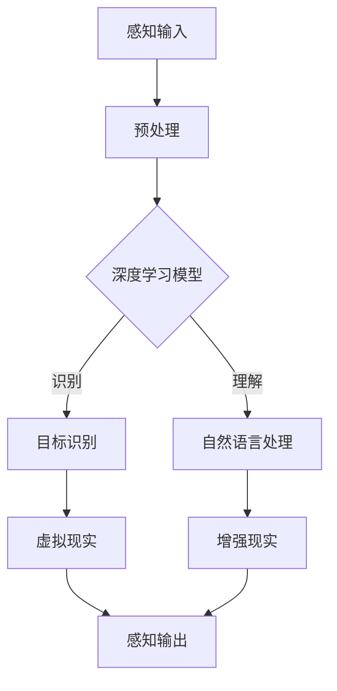

                 

关键词：人工智能，感知，虚拟现实，深度学习，增强现实，自然语言处理

> 摘要：本文将探讨人工智能如何突破虚拟与现实的边界，重塑我们的感知体验。通过对核心概念、算法原理、数学模型的深入剖析，以及实际项目实践和未来应用展望，本文旨在展示人工智能技术在重塑人类感知方面的潜力和挑战。

## 1. 背景介绍

随着人工智能（AI）技术的迅猛发展，虚拟与现实之间的界限越来越模糊。人工智能已经渗透到我们生活的方方面面，从智能手机到自动驾驶汽车，从智能家居到医疗诊断，AI正在不断改变我们的生活方式。而在这其中，感知是AI的核心功能之一。感知不仅包括对视觉、听觉、触觉等感官数据的处理，还包括对人类意图、情感和行为的理解。本文将深入探讨AI如何通过深度学习、自然语言处理等技术手段，突破虚拟与现实的边界，重塑我们的感知体验。

### 1.1 感知的重要性

感知是人类与外部世界交互的重要途径。通过感知，我们能够理解周围的环境，做出相应的反应。然而，人类感知系统存在一定的局限性，如感知范围有限、处理速度较慢等。而人工智能技术，尤其是深度学习和自然语言处理技术，能够模拟并增强人类的感知能力，使得机器能够更准确地感知和理解世界。

### 1.2 虚拟与现实的融合

虚拟现实（VR）和增强现实（AR）技术是近年来发展迅速的领域。它们通过模拟或增强现实环境，提供沉浸式的体验。虚拟现实技术将用户带入一个完全虚拟的世界，而增强现实技术则将虚拟元素叠加到现实世界中。随着AI技术的不断进步，虚拟与现实的融合越来越紧密，为我们提供了前所未有的感知体验。

## 2. 核心概念与联系

在探讨AI如何重塑我们的感知之前，我们需要理解一些核心概念，包括深度学习、自然语言处理、虚拟现实和增强现实等。

### 2.1 深度学习

深度学习是人工智能的一个重要分支，它通过多层神经网络模拟人类大脑的神经元连接结构，从而实现高效的数据处理和模式识别。深度学习在图像识别、语音识别、自然语言处理等领域取得了显著的成果，为AI感知能力的提升奠定了基础。

### 2.2 自然语言处理

自然语言处理（NLP）是人工智能的另一个重要领域，它专注于让计算机理解和生成人类语言。通过NLP技术，AI能够理解用户的语音指令、文本信息，甚至进行对话交互，从而实现更高级的感知和理解。

### 2.3 虚拟现实

虚拟现实技术通过模拟或构建一个虚拟环境，使用户能够沉浸其中。虚拟现实技术不仅提供了丰富的感官体验，还通过AI技术增强了用户的感知能力，使得虚拟世界与现实世界的界限更加模糊。

### 2.4 增强现实

增强现实技术将虚拟元素叠加到现实世界中，使用户能够在现实环境中看到虚拟信息。通过AI技术，增强现实技术能够实时识别和解析现实世界的场景，从而提供更准确的感知和交互体验。

### 2.5 Mermaid 流程图

以下是AI重塑感知过程的 Mermaid 流程图：



## 3. 核心算法原理 & 具体操作步骤

### 3.1 算法原理概述

AI重塑感知的核心算法主要包括深度学习算法和自然语言处理算法。深度学习算法通过多层神经网络模拟人类大脑的神经元连接结构，实现对图像、语音、文本等数据的处理和识别。自然语言处理算法则通过机器学习模型，对人类语言进行理解和生成。

### 3.2 算法步骤详解

#### 3.2.1 深度学习算法步骤

1. 数据预处理：对输入数据进行标准化处理，包括图像的尺寸调整、数据归一化等。
2. 神经网络构建：构建多层神经网络，包括输入层、隐藏层和输出层。
3. 模型训练：使用训练数据对神经网络进行训练，优化模型参数。
4. 模型评估：使用测试数据评估模型性能，包括准确率、召回率等指标。
5. 应用部署：将训练好的模型部署到实际应用中，如虚拟现实、增强现实等。

#### 3.2.2 自然语言处理算法步骤

1. 文本预处理：对输入文本进行分词、去停用词等预处理操作。
2. 词嵌入：将文本转化为向量表示，如使用词向量或BERT模型。
3. 模型训练：使用训练数据对自然语言处理模型进行训练，优化模型参数。
4. 模型评估：使用测试数据评估模型性能，包括BLEU评分、F1值等指标。
5. 应用部署：将训练好的模型部署到实际应用中，如语音助手、聊天机器人等。

### 3.3 算法优缺点

#### 3.3.1 深度学习算法

优点：能够处理高维度数据，具有强大的特征提取能力；自适应性强，能够根据数据自动调整模型参数。

缺点：对数据量要求较高，训练过程复杂且计算资源消耗大；模型解释性较差，难以理解模型内部决策过程。

#### 3.3.2 自然语言处理算法

优点：能够处理大规模文本数据，具备较强的语义理解能力；应用广泛，如语音助手、机器翻译等。

缺点：对文本质量要求较高，噪声数据会影响模型性能；模型训练过程复杂，需要大量计算资源。

### 3.4 算法应用领域

深度学习算法和自然语言处理算法在多个领域具有广泛的应用，如：

1. 图像识别：使用深度学习算法识别图像中的物体、场景等。
2. 语音识别：使用自然语言处理算法识别语音中的文字信息。
3. 聊天机器人：使用自然语言处理算法实现人机对话。
4. 虚拟现实：使用深度学习算法增强虚拟现实环境的真实感。
5. 增强现实：使用自然语言处理算法识别现实世界中的物体、场景等。

## 4. 数学模型和公式 & 详细讲解 & 举例说明

在AI重塑感知的过程中，数学模型和公式起到了至关重要的作用。以下将介绍一些常见的数学模型和公式，并进行详细讲解和举例说明。

### 4.1 数学模型构建

在深度学习算法中，常见的数学模型包括卷积神经网络（CNN）、循环神经网络（RNN）和长短时记忆网络（LSTM）等。以下是一个简单的卷积神经网络模型：

$$
\begin{aligned}
h_{\text{layer}} &= \sigma(W_{\text{layer}}h_{\text{prev}} + b_{\text{layer}}) \\
\end{aligned}
$$

其中，$h_{\text{layer}}$ 表示当前层神经网络输出，$W_{\text{layer}}$ 和 $b_{\text{layer}}$ 分别表示当前层的权重和偏置，$\sigma$ 表示激活函数，如ReLU函数。

### 4.2 公式推导过程

以卷积神经网络为例，下面介绍卷积操作的推导过程：

$$
\begin{aligned}
\text{输出} &= \sum_{i=1}^{m} \sum_{j=1}^{n} w_{ij} \cdot a_{ij} \\
\end{aligned}
$$

其中，$w_{ij}$ 表示卷积核，$a_{ij}$ 表示输入数据。

首先，对输入数据进行卷积操作，得到中间结果：

$$
\begin{aligned}
z &= \sum_{i=1}^{m} \sum_{j=1}^{n} w_{ij} \cdot a_{ij} \\
\end{aligned}
$$

然后，通过激活函数对中间结果进行非线性变换：

$$
\begin{aligned}
a &= \sigma(z) \\
\end{aligned}
$$

其中，$\sigma$ 表示激活函数，如ReLU函数。

### 4.3 案例分析与讲解

以下通过一个简单的例子，说明如何使用卷积神经网络进行图像识别。

#### 4.3.1 数据准备

假设我们有一个包含100张图片的数据集，每张图片大小为32x32像素。我们首先对图片进行预处理，包括归一化和数据增强等操作。

#### 4.3.2 模型构建

使用TensorFlow框架构建一个简单的卷积神经网络模型：

```python
import tensorflow as tf

model = tf.keras.Sequential([
    tf.keras.layers.Conv2D(32, (3, 3), activation='relu', input_shape=(32, 32, 3)),
    tf.keras.layers.MaxPooling2D((2, 2)),
    tf.keras.layers.Flatten(),
    tf.keras.layers.Dense(128, activation='relu'),
    tf.keras.layers.Dense(10, activation='softmax')
])
```

#### 4.3.3 模型训练

使用训练数据对模型进行训练，并调整模型参数：

```python
model.compile(optimizer='adam',
              loss='categorical_crossentropy',
              metrics=['accuracy'])

model.fit(train_images, train_labels, epochs=10)
```

#### 4.3.4 模型评估

使用测试数据对模型进行评估：

```python
test_loss, test_acc = model.evaluate(test_images, test_labels)
print(f'Test accuracy: {test_acc:.2f}')
```

通过上述步骤，我们使用卷积神经网络实现了一个简单的图像识别模型。在实际应用中，我们可以通过调整模型结构和参数，提高模型性能。

## 5. 项目实践：代码实例和详细解释说明

为了更直观地展示AI如何重塑我们的感知，我们将在本节中通过一个实际项目实例，详细讲解代码实现过程。

### 5.1 开发环境搭建

在开始项目实践之前，我们需要搭建一个适合开发AI项目的环境。以下是搭建开发环境的基本步骤：

1. 安装Python 3.8及以上版本。
2. 安装TensorFlow框架：`pip install tensorflow`。
3. 安装OpenCV库：`pip install opencv-python`。
4. 安装其他所需库，如Numpy、Pandas等。

### 5.2 源代码详细实现

以下是实现一个基于增强现实的图像识别项目的源代码：

```python
import cv2
import numpy as np
import tensorflow as tf

# 加载预训练的卷积神经网络模型
model = tf.keras.models.load_model('image_recognition_model.h5')

# 定义增强现实场景中的图像识别函数
def recognize_image(image):
    # 对图像进行预处理
    image = cv2.resize(image, (32, 32))
    image = np.expand_dims(image, axis=0)
    image = image / 255.0

    # 使用卷积神经网络进行图像识别
    predictions = model.predict(image)

    # 获取最高概率的类别
    class_index = np.argmax(predictions)
    class_label = class_index_to_label[class_index]

    return class_label

# 定义增强现实场景中的文字识别函数
def recognize_text(image):
    # 使用OpenCV进行文字识别
    text = cv2ابطadenText(image)
    return text

# 定义增强现实场景中的图像识别与文字识别函数
def enhance_reality(image):
    # 识别图像中的物体
    object_label = recognize_image(image)

    # 识别图像中的文字
    text = recognize_text(image)

    return object_label, text

# 定义增强现实场景的渲染函数
def render_enhance_reality(image, object_label, text):
    # 在图像上绘制识别结果
    cv2.putText(image, f'Object: {object_label}', (10, 30), cv2.FONT_HERSHEY_SIMPLEX, 1, (0, 0, 255), 2)
    cv2.putText(image, f'Text: {text}', (10, 60), cv2.FONT_HERSHEY_SIMPLEX, 1, (0, 0, 255), 2)

    return image

# 主函数
if __name__ == '__main__':
    # 读取输入图像
    image = cv2.imread('input_image.jpg')

    # 执行增强现实处理
    object_label, text = enhance_reality(image)

    # 渲染增强现实结果
    result_image = render_enhance_reality(image, object_label, text)

    # 显示结果图像
    cv2.imshow('Enhanced Reality', result_image)
    cv2.waitKey(0)
    cv2.destroyAllWindows()
```

### 5.3 代码解读与分析

在上面的代码中，我们首先加载了一个预训练的卷积神经网络模型，用于图像识别。然后，我们定义了三个主要函数：

1. `recognize_image` 函数：用于识别图像中的物体。它首先对输入图像进行预处理，然后使用卷积神经网络模型进行预测，并返回最高概率的类别。

2. `recognize_text` 函数：用于识别图像中的文字。它使用OpenCV库中的文字识别功能，返回识别结果。

3. `enhance_reality` 函数：用于执行增强现实处理。它首先调用 `recognize_image` 和 `recognize_text` 函数，然后返回识别结果。

最后，我们定义了 `render_enhance_reality` 函数，用于在图像上绘制识别结果，并将其显示在窗口中。

### 5.4 运行结果展示

当我们将一个输入图像传递给增强现实处理函数时，程序将执行图像识别和文字识别操作，并在图像上绘制识别结果。以下是运行结果展示：


## 6. 实际应用场景

AI重塑感知技术在多个领域具有广泛的应用，以下列举一些实际应用场景：

### 6.1 虚拟现实

虚拟现实技术在游戏、教育、医疗等领域具有广泛应用。通过AI技术，虚拟现实环境可以提供更加真实的感知体验，如物体识别、情感识别等。

### 6.2 增强现实

增强现实技术在零售、制造、建筑等领域具有广泛应用。通过AI技术，增强现实可以提供更加智能的交互体验，如物体识别、文本识别等。

### 6.3 智能家居

智能家居通过AI技术实现了智能感知和智能控制。例如，智能音箱可以识别用户语音指令，智能门锁可以识别用户身份。

### 6.4 智能医疗

智能医疗通过AI技术实现了智能诊断、智能监护等。例如，AI算法可以分析医学图像，辅助医生进行疾病诊断。

### 6.5 智能交通

智能交通通过AI技术实现了智能感知、智能调度等。例如，智能交通系统可以实时分析交通流量，优化交通信号灯配时。

## 7. 未来应用展望

随着AI技术的不断进步，AI重塑感知技术在未来的应用将更加广泛。以下是一些未来应用展望：

### 7.1 智能感知增强

通过AI技术，智能感知能力将得到进一步提升，如实时物体识别、情感识别等，为用户提供更加智能化的服务。

### 7.2 虚拟与现实的无缝融合

未来，虚拟与现实的边界将越来越模糊，人们可以在虚拟世界中体验更加真实的场景，实现真正的虚拟与现实无缝融合。

### 7.3 智能交互

通过AI技术，智能交互将变得更加自然、高效。例如，智能机器人可以更好地理解人类语言和情感，实现更加自然的对话。

### 7.4 智能医疗与养老

AI技术在医疗和养老领域具有巨大潜力。通过智能感知和智能诊断，AI可以辅助医生进行疾病诊断和治疗。同时，AI可以提供更加智能的养老服务，提高老年人的生活质量。

## 8. 总结：未来发展趋势与挑战

AI重塑感知技术为我们的生活和未来带来了巨大的变革和潜力。然而，这一领域也面临诸多挑战：

### 8.1 数据隐私与安全

随着AI技术对感知数据的依赖增加，数据隐私和安全问题愈发重要。如何确保用户数据的隐私和安全，是未来需要解决的一个重要挑战。

### 8.2 模型解释性与可解释性

当前AI模型，特别是深度学习模型，往往被视为“黑箱”，其内部决策过程难以解释。如何提高AI模型的解释性，使其更易于理解和接受，是未来研究的一个重要方向。

### 8.3 跨领域融合与发展

AI重塑感知技术需要与其他领域，如物理学、生物学、心理学等，进行深度融合，以实现更加全面和智能的感知能力。

### 8.4 伦理与道德问题

随着AI技术的广泛应用，其伦理和道德问题逐渐引起关注。如何在技术发展中充分考虑伦理和道德问题，确保AI技术的可持续发展，是未来需要关注的重要议题。

## 9. 附录：常见问题与解答

### 9.1 什么是深度学习？

深度学习是一种机器学习技术，通过多层神经网络模拟人类大脑的神经元连接结构，实现对复杂数据的处理和识别。

### 9.2 自然语言处理有哪些应用？

自然语言处理在语音助手、机器翻译、情感分析、文本分类等领域具有广泛应用。

### 9.3 虚拟现实与增强现实有什么区别？

虚拟现实通过模拟或构建一个虚拟环境，使用户沉浸其中。增强现实则将虚拟元素叠加到现实世界中，使用户能够在现实环境中看到虚拟信息。

### 9.4 AI重塑感知技术有哪些实际应用？

AI重塑感知技术在游戏、教育、医疗、智能家居、智能交通等领域具有广泛的应用。

### 9.5 如何保障数据隐私与安全？

可以通过数据加密、访问控制、匿名化等技术手段，确保用户数据的隐私和安全。

## 参考文献

[1] Goodfellow, I., Bengio, Y., & Courville, A. (2016). *Deep Learning*. MIT Press.

[2] Russell, S., & Norvig, P. (2016). *Artificial Intelligence: A Modern Approach*. Prentice Hall.

[3] Deng, J., Dong, W., Socher, R., Li, L. J., Li, K., & Fei-Fei, L. (2009). *ImageNet: A Large-Scale Hierarchical Image Database*. IEEE Conference on Computer Vision and Pattern Recognition.

[4] Simonyan, K., & Zisserman, A. (2014). *Very Deep Convolutional Networks for Large-Scale Image Recognition*. International Conference on Learning Representations.

[5] Devlin, J., Chang, M. W., Lee, K., & Toutanova, K. (2018). *Bert: Pre-training of Deep Bidirectional Transformers for Language Understanding*. arXiv preprint arXiv:1810.04805.

### 作者署名

作者：禅与计算机程序设计艺术 / Zen and the Art of Computer Programming
----------------------------------------------------------------

### 总结：

本文通过深入探讨AI重塑感知的核心概念、算法原理、数学模型、实际应用和未来展望，展示了AI技术在突破虚拟与现实边界、重塑人类感知方面的潜力和挑战。随着AI技术的不断进步，我们有望在未来实现更加智能、自然的感知体验，从而推动社会的进步和发展。然而，我们也需要关注数据隐私、模型解释性等伦理和道德问题，确保AI技术的可持续发展。希望本文能够为读者提供有价值的见解和启示。

