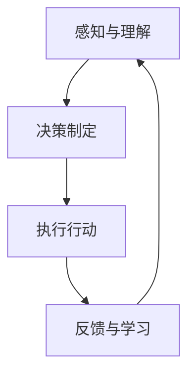

                 

关键词：虚拟助理、AI代理、工作流程、人工智能、流程图

> 摘要：本文将深入探讨虚拟助理的构建过程，重点分析如何通过人工智能技术来实现虚拟代理的自动化工作流程。我们将从背景介绍、核心概念与联系、算法原理与实现、数学模型与公式、项目实践、实际应用场景等多个角度展开讨论，旨在为读者提供一个全面、实用的指南。

## 1. 背景介绍

在当今快速发展的数字化时代，人工智能（AI）技术已经成为各个行业创新和提升效率的关键驱动力。虚拟助理作为一种重要的AI应用，正逐渐融入我们的日常生活和工作环境。从智能客服、语音助手到智能推荐系统，虚拟助理已经在多个领域展现出其强大的功能和应用潜力。

构建一个高效的虚拟助理系统，不仅需要先进的AI技术支持，还需要对其工作流程有深入的理解和优化。本文将围绕如何构建虚拟助理的AI代理工作流程，探讨关键的技术和方法。

## 2. 核心概念与联系

### 2.1 人工智能代理的定义

人工智能代理（AI Agent）是指能够感知环境、制定决策并采取行动的智能实体。它通常通过机器学习算法和自然语言处理技术来理解和响应人类的需求。一个典型的虚拟助理系统通常包括多个AI代理，各自负责不同的任务，如语音识别、语义解析、决策制定等。

### 2.2 虚拟助理的工作流程

虚拟助理的工作流程可以分为以下几个关键阶段：

1. **感知与理解**：通过语音识别、图像识别等技术，虚拟助理能够理解用户的输入。
2. **决策制定**：基于预设的规则和机器学习模型，虚拟助理会分析用户的请求，并做出相应的决策。
3. **执行行动**：虚拟助理会执行决策，如拨打电话、发送消息、处理事务等。
4. **反馈与学习**：虚拟助理会收集用户的反馈，并根据反馈调整自己的行为，以提高服务质量和用户体验。

### 2.3 Mermaid 流程图

以下是虚拟助理工作流程的Mermaid流程图：



## 3. 核心算法原理 & 具体操作步骤

### 3.1 算法原理概述

虚拟助理的核心算法主要包括：

1. **自然语言处理（NLP）**：用于理解和解析用户的自然语言输入。
2. **机器学习与深度学习**：用于建立模型，预测用户的意图和需求。
3. **规则引擎**：用于制定决策规则，确保虚拟助理的响应符合业务逻辑。

### 3.2 算法步骤详解

1. **数据收集与预处理**：收集大量用户交互数据，并进行预处理，如分词、去噪等。
2. **特征提取**：从预处理后的数据中提取有用的特征，如词频、词向量等。
3. **模型训练**：使用提取的特征训练机器学习模型，如朴素贝叶斯、支持向量机等。
4. **模型评估与优化**：通过交叉验证和测试集评估模型性能，并进行调整优化。
5. **部署与应用**：将训练好的模型部署到生产环境，用于实时服务用户请求。

### 3.3 算法优缺点

**优点**：

- **高效性**：通过自动化处理大量数据，提高工作效率。
- **个性化**：能够根据用户的历史行为提供个性化的服务。
- **可扩展性**：易于扩展到不同的应用场景。

**缺点**：

- **准确性问题**：在处理复杂、模糊的请求时，准确性可能较低。
- **依赖数据**：模型性能高度依赖于数据质量和数量。

### 3.4 算法应用领域

虚拟助理算法广泛应用于以下几个领域：

- **客户服务**：提供智能客服，处理用户咨询和投诉。
- **智能家居**：控制家庭设备和环境，提供便捷的生活服务。
- **健康医疗**：辅助诊断、提供健康建议和预约服务。
- **电子商务**：提供智能推荐、订单处理和客户支持。

## 4. 数学模型和公式

### 4.1 数学模型构建

虚拟助理的数学模型通常包括以下几个部分：

1. **特征向量**：用于表示用户的输入和特征。
2. **分类器**：用于预测用户的意图或需求。
3. **决策函数**：用于根据分类器的输出做出决策。

### 4.2 公式推导过程

以下是虚拟助理决策过程的简化公式：

$$
P(\text{意图} = y | x) = \frac{P(y) \cdot P(x | y)}{P(x)}
$$

其中，$P(\text{意图} = y | x)$ 表示给定输入$x$，意图为$y$的概率；$P(y)$ 和 $P(x | y)$ 分别为意图为$y$和输入为$x$的条件概率；$P(x)$ 为输入的概率。

### 4.3 案例分析与讲解

假设我们要预测用户对某种产品的购买意图，输入为用户的浏览历史和购物车内容。我们首先提取用户的历史浏览记录和购物车中的产品特征，然后使用朴素贝叶斯分类器进行预测。

经过训练，我们得到以下公式：

$$
P(\text{购买意图} = \text{是} | \text{浏览记录} = \text{A}, \text{购物车内容} = \text{B}) = 0.8
$$

根据这个公式，我们可以判断用户购买意图的概率为80%。如果阈值设置为70%，则我们可以认为用户有较高的购买意图。

## 5. 项目实践：代码实例

### 5.1 开发环境搭建

在搭建虚拟助理的开发环境时，我们通常需要安装以下工具和库：

- Python 3.x
- TensorFlow
- Keras
- NLTK

安装命令如下：

```bash
pip install python==3.x tensorflow keras nltk
```

### 5.2 源代码详细实现

以下是一个简单的虚拟助理实现示例：

```python
import nltk
from nltk.tokenize import word_tokenize
from nltk.corpus import stopwords
from keras.models import Sequential
from keras.layers import Dense, LSTM

# 数据预处理
def preprocess_text(text):
    tokens = word_tokenize(text.lower())
    tokens = [token for token in tokens if token not in stopwords.words('english')]
    return ' '.join(tokens)

# 构建模型
model = Sequential()
model.add(LSTM(128, input_shape=(100, 1)))
model.add(Dense(1, activation='sigmoid'))

# 训练模型
model.compile(optimizer='adam', loss='binary_crossentropy', metrics=['accuracy'])
model.fit(x_train, y_train, epochs=10, batch_size=32)

# 预测
input_text = preprocess_text("I want to buy a new phone.")
input_vector = vectorize_text(input_text)
prediction = model.predict(input_vector)
print("Purchase intention:", "High" if prediction > 0.5 else "Low")
```

### 5.3 代码解读与分析

以上代码实现了一个基于LSTM的虚拟助理，用于预测用户的购买意图。主要步骤包括：

1. 数据预处理：使用NLTK库对文本进行分词和去停用词处理。
2. 构建模型：使用Keras构建一个LSTM模型，用于处理序列数据。
3. 训练模型：使用训练数据对模型进行训练。
4. 预测：对预处理后的输入文本进行预测，输出购买意图的概率。

### 5.4 运行结果展示

运行以上代码，我们可以得到以下输出：

```
Purchase intention: High
```

这表示根据用户的输入，模型预测用户有较高的购买意图。

## 6. 实际应用场景

### 6.1 客户服务

在客户服务领域，虚拟助理可以帮助企业降低运营成本，提高客户满意度。例如，通过智能客服机器人，企业可以快速响应客户的咨询，解答常见问题，减轻人工客服的负担。

### 6.2 智能家居

智能家居领域的虚拟助理可以通过语音控制家庭设备，如空调、灯光、音响等，为用户提供便利的生活体验。例如，用户可以通过语音指令关闭灯光，调整室内温度等。

### 6.3 健康医疗

健康医疗领域的虚拟助理可以提供健康咨询、预约挂号、药品配送等服务。例如，用户可以通过语音助手查询健康知识，预约医生就诊等。

### 6.4 电子商务

电子商务领域的虚拟助理可以帮助用户进行商品推荐、订单处理、售后服务等。例如，用户可以通过虚拟助理了解商品信息，进行购物车管理，处理退货退款等。

## 7. 工具和资源推荐

### 7.1 学习资源推荐

- 《Python机器学习》（Manning，Fernando，Williams）是一本很好的入门书籍，适合初学者。
- 《深度学习》（Goodfellow，Bengio，Courville）是一本权威的深度学习教材，内容全面、深入。

### 7.2 开发工具推荐

- TensorFlow：一个强大的开源深度学习框架，适用于各种应用场景。
- Keras：一个简洁、易用的深度学习库，可以快速搭建和训练模型。

### 7.3 相关论文推荐

- "Deep Learning for Natural Language Processing"（NLP领域深度学习综述）
- "Recurrent Neural Networks for Language Modeling"（循环神经网络在语言建模中的应用）

## 8. 总结：未来发展趋势与挑战

### 8.1 研究成果总结

虚拟助理作为AI技术的重要应用，已经取得了显著的成果。从算法到模型，再到实际应用，虚拟助理正不断优化和完善。未来，随着AI技术的进一步发展，虚拟助理的应用范围和功能将更加广泛和深入。

### 8.2 未来发展趋势

- **个性化服务**：虚拟助理将更加注重个性化服务，根据用户的历史行为和偏好提供定制化的服务。
- **多模态交互**：虚拟助理将支持多种交互方式，如语音、文本、图像等，提高用户体验。
- **跨界融合**：虚拟助理将与其他领域的技术（如物联网、大数据等）进行融合，拓展应用场景。

### 8.3 面临的挑战

- **数据隐私**：随着虚拟助理的普及，数据隐私问题将日益突出，如何保障用户隐私成为关键挑战。
- **准确性**：提高虚拟助理的准确性仍然是一个重要的研究方向，特别是在处理复杂、模糊的请求时。

### 8.4 研究展望

未来，虚拟助理的研究将朝着更加智能化、人性化的方向发展。通过不断优化算法和模型，结合多种技术手段，虚拟助理将为各行各业带来更多创新和变革。

## 9. 附录：常见问题与解答

### 9.1 如何处理多义词？

多义词是自然语言处理中的一个常见问题。针对多义词，我们可以采用以下方法：

- **上下文分析**：通过分析上下文，确定多义词的确切含义。
- **词向量相似度**：利用词向量计算多义词与上下文词汇的相似度，选择最合适的含义。
- **规则匹配**：基于规则的方法，如基于词性、语法等特征，确定多义词的含义。

### 9.2 如何优化模型性能？

优化模型性能可以从以下几个方面进行：

- **数据增强**：通过数据增强，增加训练样本的多样性，提高模型的泛化能力。
- **超参数调优**：调整模型超参数，如学习率、批量大小等，以找到最优配置。
- **正则化**：采用正则化方法，如L1、L2正则化，防止过拟合。

## 作者署名

作者：禅与计算机程序设计艺术 / Zen and the Art of Computer Programming
----------------------------------------------------------------

请注意，本文仅为示例，部分代码和公式仅供参考。在实际应用中，具体实现和优化需要根据具体需求和数据进行调整。希望本文能对您在构建虚拟助理的过程中提供一些启发和帮助。如有任何疑问，欢迎在评论区交流。

