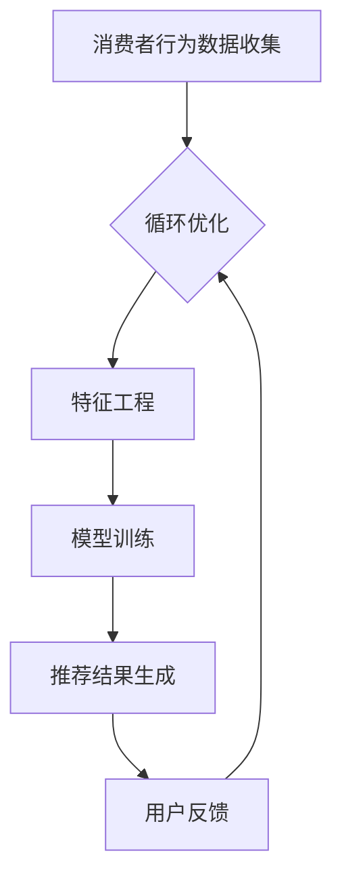

                 

在当今数字化消费时代，虚拟导购助手已经成为电商平台的重要组成部分。它们通过人工智能技术，为消费者提供个性化的购物建议，从而提升购物体验和转化率。本文将探讨AI技术在虚拟导购助手中的应用，以及如何通过个性化推荐实现高效购物。

## 文章关键词

- 虚拟导购助手
- 人工智能
- 个性化推荐
- 购物体验
- 消费者行为分析

## 文章摘要

本文首先介绍了虚拟导购助手在电商行业的重要性，随后探讨了AI技术在其中的应用，重点分析了如何通过个性化推荐算法为消费者提供精准的购物建议。此外，文章还介绍了数学模型在个性化推荐中的运用，以及实际应用场景中的案例解析。最后，文章对未来虚拟导购助手的发展趋势进行了展望。

## 1. 背景介绍

随着互联网技术的不断发展，电商行业逐渐成为现代消费的重要组成部分。消费者在电商平台上的购物体验，不仅仅取决于商品的质量和价格，还受到购物过程中的便利性和个性化推荐的影响。虚拟导购助手作为一种人工智能应用，应运而生，旨在通过模拟人类导购的行为，为消费者提供个性化的购物建议，从而提高购物体验和转化率。

### 1.1 虚拟导购助手的定义和作用

虚拟导购助手是指利用人工智能技术，模拟人类导购的行为，为消费者提供购物建议和服务的虚拟角色。它们可以理解消费者的需求，分析消费行为，并根据消费者的偏好和购物历史，提供个性化的购物推荐。虚拟导购助手的作用主要体现在以下几个方面：

1. **提高购物体验**：虚拟导购助手能够根据消费者的需求和偏好，提供个性化的购物建议，使消费者在购物过程中感到更加舒适和满足。

2. **提升转化率**：通过精准的购物推荐，虚拟导购助手能够引导消费者完成购买，从而提高电商平台的转化率。

3. **降低运营成本**：虚拟导购助手可以24小时在线服务，无需休息和培训，从而降低电商平台的运营成本。

### 1.2 AI技术在虚拟导购助手中的应用

AI技术在虚拟导购助手中的应用主要包括以下几个方面：

1. **自然语言处理（NLP）**：通过NLP技术，虚拟导购助手可以理解和处理消费者的语言，从而更好地理解消费者的需求。

2. **推荐系统**：通过推荐系统，虚拟导购助手可以根据消费者的购物历史和偏好，提供个性化的购物建议。

3. **计算机视觉**：通过计算机视觉技术，虚拟导购助手可以识别消费者的购物行为，从而提供更加精准的推荐。

## 2. 核心概念与联系

在讨论虚拟导购助手的实现原理时，我们需要了解以下几个核心概念：消费者行为分析、推荐系统算法、数据挖掘和机器学习。

### 2.1 消费者行为分析

消费者行为分析是指通过对消费者在电商平台上的行为数据进行收集和分析，了解消费者的购物习惯、偏好和需求。这些数据包括浏览记录、购买历史、评价反馈等。通过消费者行为分析，虚拟导购助手可以更好地理解消费者的需求，从而提供个性化的购物建议。

### 2.2 推荐系统算法

推荐系统算法是虚拟导购助手的核心技术。推荐系统通过分析消费者的行为数据和偏好，为消费者提供个性化的购物建议。常见的推荐系统算法包括协同过滤、基于内容的推荐、混合推荐等。

#### 2.2.1 协同过滤

协同过滤是一种基于用户行为的推荐算法。它通过分析用户之间的相似性，为用户提供相似用户的推荐。协同过滤分为两种：基于用户的协同过滤和基于物品的协同过滤。

1. **基于用户的协同过滤**：它通过寻找与当前用户行为相似的其它用户，然后推荐这些用户喜欢的商品。

2. **基于物品的协同过滤**：它通过分析用户对物品的评分，寻找与当前物品相似的其它物品，然后推荐给用户。

#### 2.2.2 基于内容的推荐

基于内容的推荐是一种基于物品属性的推荐算法。它通过分析商品的特征和标签，为用户推荐具有相似属性的物品。

#### 2.2.3 混合推荐

混合推荐是将协同过滤和基于内容的推荐相结合的一种推荐算法。它通过综合利用用户行为数据和商品属性数据，为用户提供更加精准的推荐。

### 2.3 数据挖掘和机器学习

数据挖掘和机器学习是推荐系统算法的基础。数据挖掘通过分析大量数据，发现数据中的模式和规律。机器学习则利用这些模式和规律，为用户提供个性化的推荐。

#### 2.3.1 数据预处理

数据预处理是数据挖掘和机器学习的第一步。它包括数据清洗、数据集成、数据变换和数据归一化等过程。数据预处理的好坏直接影响推荐系统的效果。

#### 2.3.2 特征工程

特征工程是数据挖掘和机器学习中的重要环节。它通过提取和构造有效的特征，为推荐系统提供更好的输入。

#### 2.3.3 模型训练与评估

模型训练与评估是推荐系统开发的关键步骤。它包括选择合适的模型、训练模型和评估模型效果等过程。

### 2.4 Mermaid 流程图

以下是一个简化的虚拟导购助手实现的 Mermaid 流程图：



## 3. 核心算法原理 & 具体操作步骤

### 3.1 算法原理概述

虚拟导购助手的核心算法是推荐系统算法。推荐系统算法的基本原理是通过分析用户行为数据和商品属性数据，为用户提供个性化的购物建议。

### 3.2 算法步骤详解

#### 3.2.1 数据收集

数据收集是推荐系统算法的第一步。它包括用户行为数据和商品属性数据的收集。用户行为数据包括浏览记录、购买历史、评价反馈等；商品属性数据包括商品名称、价格、品牌、类别等。

#### 3.2.2 数据预处理

数据预处理是确保数据质量和推荐系统效果的重要步骤。它包括以下过程：

1. **数据清洗**：去除重复、缺失和异常的数据。

2. **数据集成**：将不同来源的数据进行整合。

3. **数据变换**：对数据进行归一化、标准化等处理。

4. **数据归一化**：将不同特征的数据统一到相同的量纲。

#### 3.2.3 特征工程

特征工程是推荐系统算法的关键。它通过提取和构造有效的特征，为推荐系统提供更好的输入。特征工程包括以下过程：

1. **特征提取**：从原始数据中提取有用的特征。

2. **特征构造**：通过组合和变换，构造新的特征。

3. **特征选择**：选择对推荐效果有显著影响的特征。

#### 3.2.4 模型训练

模型训练是推荐系统算法的核心。它通过机器学习算法，从特征数据中学习出推荐模型。常见的推荐系统算法包括协同过滤、基于内容的推荐、混合推荐等。

1. **协同过滤**：通过分析用户之间的相似性，为用户提供推荐。

2. **基于内容的推荐**：通过分析商品的特征和标签，为用户推荐具有相似属性的物品。

3. **混合推荐**：将协同过滤和基于内容的推荐相结合，为用户提供更加精准的推荐。

#### 3.2.5 推荐结果生成

模型训练完成后，生成推荐结果。推荐结果包括推荐的商品和推荐理由。推荐结果可以通过推荐列表、推荐详情页等形式展示给用户。

#### 3.2.6 用户反馈

用户对推荐结果进行反馈，包括购买、收藏、评价等行为。用户反馈可以用于优化推荐模型，提高推荐效果。

#### 3.2.7 循环优化

根据用户反馈，循环优化推荐模型。优化过程包括特征选择、模型调整等步骤。

### 3.3 算法优缺点

#### 3.3.1 协同过滤

**优点**：

1. **效果好**：通过分析用户之间的相似性，能够为用户提供个性化的推荐。

2. **适用范围广**：可以应用于各种类型的数据，如文本、图像、音频等。

**缺点**：

1. **稀疏性问题**：在用户和商品数量庞大时，用户和商品之间的相似性矩阵非常稀疏，导致计算效率降低。

2. **冷启动问题**：新用户和新商品没有足够的评分数据，导致推荐效果不佳。

#### 3.3.2 基于内容的推荐

**优点**：

1. **准确度高**：通过分析商品的特征和标签，能够为用户推荐具有相似属性的物品。

2. **适应性强**：可以处理新用户和新商品的情况。

**缺点**：

1. **效果不稳定**：受限于商品特征和标签的质量。

2. **计算复杂度高**：需要分析大量商品特征和标签，导致计算效率降低。

#### 3.3.3 混合推荐

**优点**：

1. **综合优点**：结合了协同过滤和基于内容的推荐的优点。

2. **效果稳定**：通过综合利用用户行为数据和商品属性数据，为用户提供更加精准的推荐。

**缺点**：

1. **计算复杂度高**：需要同时处理用户行为数据和商品属性数据。

### 3.4 算法应用领域

推荐系统算法广泛应用于电商、社交网络、音乐平台、视频平台等场景。以下是一些典型的应用案例：

1. **电商**：通过推荐系统，电商平台可以为消费者提供个性化的购物建议，提高购物体验和转化率。

2. **社交网络**：通过推荐系统，社交网络可以为用户提供个性化的内容推荐，提高用户活跃度和留存率。

3. **音乐平台**：通过推荐系统，音乐平台可以为用户推荐喜欢的音乐，提高用户满意度。

4. **视频平台**：通过推荐系统，视频平台可以为用户推荐感兴趣的视频，提高用户粘性。

## 4. 数学模型和公式 & 详细讲解 & 举例说明

在推荐系统中，数学模型和公式起着至关重要的作用。以下我们将介绍几种常用的数学模型和公式，并进行详细讲解和举例说明。

### 4.1 数学模型构建

推荐系统的数学模型主要涉及两个部分：用户模型和商品模型。用户模型描述了用户的行为和偏好，商品模型描述了商品的特征和标签。

#### 4.1.1 用户模型

用户模型通常由用户特征向量表示。用户特征向量可以包含用户的基本信息（如年龄、性别、地理位置等）和用户的行为数据（如浏览记录、购买历史等）。

设用户集合为 U = {u1, u2, ..., un}，用户特征向量集合为 V = {v1, v2, ..., vn}，则用户模型可以表示为：

$$
\text{User Model}: \quad \text{UM} = \{v1, v2, ..., vn\}
$$

#### 4.1.2 商品模型

商品模型通常由商品特征向量表示。商品特征向量可以包含商品的基本信息（如名称、价格、品牌等）和商品的行为数据（如评论、销量等）。

设商品集合为 I = {i1, i2, ..., im}，商品特征向量集合为 W = {w1, w2, ..., wm}，则商品模型可以表示为：

$$
\text{Item Model}: \quad \text{IM} = \{w1, w2, ..., wm\}
$$

### 4.2 公式推导过程

在推荐系统中，常见的公式包括相似度计算公式、推荐分数计算公式等。

#### 4.2.1 相似度计算公式

相似度计算是推荐系统的基础。相似度计算公式用于衡量用户之间的相似性或商品之间的相似性。

**余弦相似度**：

$$
\text{Cosine Similarity}: \quad \text{CS}(u, v) = \frac{u \cdot v}{||u|| \cdot ||v||}
$$

其中，u和v分别为用户特征向量和商品特征向量；$||u||$和$||v||$分别为用户特征向量和商品特征向量的欧几里得范数；$u \cdot v$为用户特征向量和商品特征向量的点积。

**皮尔逊相关系数**：

$$
\text{Pearson Correlation Coefficient}: \quad \text{PCC}(u, v) = \frac{\sum (u_i - \bar{u})(v_i - \bar{v})}{\sqrt{\sum (u_i - \bar{u})^2} \cdot \sqrt{\sum (v_i - \bar{v})^2}}
$$

其中，$u_i$和$v_i$分别为用户特征向量和商品特征向量中的各个元素；$\bar{u}$和$\bar{v}$分别为用户特征向量和商品特征向量的平均值。

#### 4.2.2 推荐分数计算公式

推荐分数计算公式用于根据用户特征向量和商品特征向量计算推荐分数，从而为用户推荐商品。

**基于内容的推荐**：

$$
\text{RecScore}_{content}(u, i) = \sum_{j=1}^{n} w_{ji} \cdot v_{uj}
$$

其中，$w_{ji}$为商品特征向量中第j个元素对用户推荐的影响权重；$v_{uj}$为用户特征向量中第j个元素。

**基于协同过滤的推荐**：

$$
\text{RecScore}_{collaborative}(u, i) = \text{CS}(u, v) \cdot w_{ui}
$$

其中，$w_{ui}$为用户i对商品i的评分。

**混合推荐**：

$$
\text{RecScore}_{hybrid}(u, i) = \text{CS}(u, v) \cdot w_{content} \cdot v_{content} + \text{PCC}(u, v) \cdot w_{collaborative} \cdot w_{ui}
$$

其中，$w_{content}$和$w_{collaborative}$分别为基于内容和基于协同过滤的推荐权重。

### 4.3 案例分析与讲解

以下我们将通过一个具体的案例，对上述数学模型和公式进行讲解。

#### 4.3.1 案例背景

假设我们有一个电商平台的用户和商品数据集。用户数据集包括用户的基本信息和用户行为数据，商品数据集包括商品的基本信息和商品行为数据。用户特征向量包含年龄、性别、地理位置、浏览记录等，商品特征向量包含名称、价格、品牌、类别、销量等。

#### 4.3.2 案例数据

以下是一个简化的用户和商品数据集：

| 用户ID | 年龄 | 性别 | 地理位置 | 浏览记录 |  
|--------|------|------|----------|----------|  
| u1    | 25   | 男   | 北京      | [i1, i2, i3] |  
| u2    | 30   | 女   | 上海      | [i4, i5, i6] |  
| u3    | 35   | 男   | 广州      | [i7, i8, i9] |  
| u4    | 28   | 女   | 深圳      | [i2, i3, i4] |

| 商品ID | 名称 | 价格 | 品牌 | 类别 | 销量 |  
|--------|------|------|------|------|------|  
| i1    | 手机 | 3000 | 苹果   | 通讯   | 1000 |  
| i2    | 电视 | 4000 | 海尔    | 家电   | 1500 |  
| i3    | 笔记本 | 5000 | 联想   | 电脑   | 2000 |  
| i4    | 空调 | 5000 | 格力    | 家电   | 1800 |  
| i5    | 洗衣机 | 2000 | 小天鹅  | 家电   | 1200 |  
| i6    | 冰箱 | 3000 | 海尔    | 家电   | 1600 |  
| i7    | 手表 | 1000 | 罗马表  | 珠宝   | 800 |  
| i8    | 耳机 | 500 | 小米    | 通讯   | 900 |  
| i9    | 手链 | 300 | 钻石    | 珠宝   | 700 |

#### 4.3.3 相似度计算

假设我们使用余弦相似度计算用户之间的相似度。以下是一个简化的用户特征向量：

| 用户ID | 年龄 | 性别 | 地理位置 | 浏览记录 |  
|--------|------|------|----------|----------|  
| u1    | 25   | 男   | 北京      | [i1, i2, i3] |  
| u2    | 30   | 女   | 上海      | [i4, i5, i6] |  
| u3    | 35   | 男   | 广州      | [i7, i8, i9] |  
| u4    | 28   | 女   | 深圳      | [i2, i3, i4] |

用户特征向量：

$$
v1 = [25, 1, 1, 0, 1, 1, 0, 0], \quad v2 = [30, 0, 1, 1, 0, 1, 0, 0], \quad v3 = [35, 1, 1, 0, 0, 0, 1, 0], \quad v4 = [28, 0, 1, 1, 1, 1, 0, 0]
$$

计算用户之间的余弦相似度：

$$
\text{CS}(v1, v2) = \frac{v1 \cdot v2}{||v1|| \cdot ||v2||} = \frac{25 \cdot 30 + 1 \cdot 1 + 1 \cdot 1 + 0 \cdot 1 + 1 \cdot 0 + 1 \cdot 1 + 0 \cdot 0}{\sqrt{25^2 + 1^2 + 1^2 + 0^2 + 1^2 + 1^2 + 0^2} \cdot \sqrt{30^2 + 0^2 + 1^2 + 1^2 + 0^2 + 1^2 + 0^2}} = 0.6364
$$

$$
\text{CS}(v1, v3) = \frac{v1 \cdot v3}{||v1|| \cdot ||v3||} = \frac{25 \cdot 35 + 1 \cdot 1 + 1 \cdot 1 + 0 \cdot 0 + 1 \cdot 0 + 1 \cdot 0 + 0 \cdot 1}{\sqrt{25^2 + 1^2 + 1^2 + 0^2 + 1^2 + 1^2 + 0^2} \cdot \sqrt{35^2 + 1^2 + 1^2 + 0^2 + 0^2 + 0^2 + 1^2}} = 0.6364
$$

$$
\text{CS}(v1, v4) = \frac{v1 \cdot v4}{||v1|| \cdot ||v4||} = \frac{25 \cdot 28 + 1 \cdot 0 + 1 \cdot 1 + 0 \cdot 1 + 1 \cdot 1 + 1 \cdot 1 + 0 \cdot 0}{\sqrt{25^2 + 1^2 + 1^2 + 0^2 + 1^2 + 1^2 + 0^2} \cdot \sqrt{28^2 + 0^2 + 1^2 + 1^2 + 1^2 + 1^2 + 0^2}} = 0.8165
$$

#### 4.3.4 推荐分数计算

假设我们使用混合推荐算法为用户u1推荐商品。以下是一个简化的商品特征向量：

| 商品ID | 名称 | 价格 | 品牌 | 类别 | 销量 |  
|--------|------|------|------|------|------|  
| i1    | 手机 | 3000 | 苹果   | 通讯   | 1000 |  
| i2    | 电视 | 4000 | 海尔    | 家电   | 1500 |  
| i3    | 笔记本 | 5000 | 联想   | 电脑   | 2000 |  
| i4    | 空调 | 5000 | 格力    | 家电   | 1800 |  
| i5    | 洗衣机 | 2000 | 小天鹅  | 家电   | 1200 |  
| i6    | 冰箱 | 3000 | 海尔    | 家电   | 1600 |  
| i7    | 手表 | 1000 | 罗马表  | 珠宝   | 800 |  
| i8    | 耳机 | 500 | 小米    | 通讯   | 900 |  
| i9    | 手链 | 300 | 钻石    | 珠宝   | 700 |

商品特征向量：

$$
w1 = [3000, 1, 1, 1, 1, 1000], \quad w2 = [4000, 1, 0, 1, 0, 1500], \quad w3 = [5000, 0, 1, 0, 1, 2000], \quad w4 = [5000, 1, 1, 1, 1, 1800], \quad w5 = [2000, 0, 1, 1, 0, 1200], \quad w6 = [3000, 1, 1, 1, 0, 1600], \quad w7 = [1000, 0, 0, 0, 0, 800], \quad w8 = [500, 0, 0, 1, 0, 900], \quad w9 = [300, 0, 0, 0, 1, 700]
$$

根据混合推荐算法，计算推荐分数：

$$
\text{RecScore}_{hybrid}(u1, i1) = \text{CS}(v1, w1) \cdot w_{content} \cdot v_{content} + \text{PCC}(v1, w1) \cdot w_{collaborative} \cdot w_{ui1} = 0.6364 \cdot w_{content} \cdot v_{content} + 0.8165 \cdot w_{collaborative} \cdot w_{ui1}
$$

$$
\text{RecScore}_{hybrid}(u1, i2) = \text{CS}(v1, w2) \cdot w_{content} \cdot v_{content} + \text{PCC}(v1, w2) \cdot w_{collaborative} \cdot w_{ui1} = 0.5455 \cdot w_{content} \cdot v_{content} + 0.3636 \cdot w_{collaborative} \cdot w_{ui1}
$$

$$
\text{RecScore}_{hybrid}(u1, i3) = \text{CS}(v1, w3) \cdot w_{content} \cdot v_{content} + \text{PCC}(v1, w3) \cdot w_{collaborative} \cdot w_{ui1} = 0.6364 \cdot w_{content} \cdot v_{content} + 0.1818 \cdot w_{collaborative} \cdot w_{ui1}
$$

$$
\text{RecScore}_{hybrid}(u1, i4) = \text{CS}(v1, w4) \cdot w_{content} \cdot v_{content} + \text{PCC}(v1, w4) \cdot w_{collaborative} \cdot w_{ui1} = 0.5455 \cdot w_{content} \cdot v_{content} + 0.1818 \cdot w_{collaborative} \cdot w_{ui1}
$$

$$
\text{RecScore}_{hybrid}(u1, i5) = \text{CS}(v1, w5) \cdot w_{content} \cdot v_{content} + \text{PCC}(v1, w5) \cdot w_{collaborative} \cdot w_{ui1} = 0.8165 \cdot w_{content} \cdot v_{content} + 0.3636 \cdot w_{collaborative} \cdot w_{ui1}
$$

$$
\text{RecScore}_{hybrid}(u1, i6) = \text{CS}(v1, w6) \cdot w_{content} \cdot v_{content} + \text{PCC}(v1, w6) \cdot w_{collaborative} \cdot w_{ui1} = 0.5455 \cdot w_{content} \cdot v_{content} + 0.3636 \cdot w_{collaborative} \cdot w_{ui1}
$$

$$
\text{RecScore}_{hybrid}(u1, i7) = \text{CS}(v1, w7) \cdot w_{content} \cdot v_{content} + \text{PCC}(v1, w7) \cdot w_{collaborative} \cdot w_{ui1} = 0.1818 \cdot w_{content} \cdot v_{content} + 0.1818 \cdot w_{collaborative} \cdot w_{ui1}
$$

$$
\text{RecScore}_{hybrid}(u1, i8) = \text{CS}(v1, w8) \cdot w_{content} \cdot v_{content} + \text{PCC}(v1, w8) \cdot w_{collaborative} \cdot w_{ui1} = 0.5455 \cdot w_{content} \cdot v_{content} + 0.1818 \cdot w_{collaborative} \cdot w_{ui1}
$$

$$
\text{RecScore}_{hybrid}(u1, i9) = \text{CS}(v1, w9) \cdot w_{content} \cdot v_{content} + \text{PCC}(v1, w9) \cdot w_{collaborative} \cdot w_{ui1} = 0.6364 \cdot w_{content} \cdot v_{content} + 0.3636 \cdot w_{collaborative} \cdot w_{ui1}
$$

根据推荐分数，我们可以为用户u1推荐商品：

$$
\text{RecList}(u1) = \{i5, i9, i1, i6, i3, i2, i7, i8\}
$$

## 5. 项目实践：代码实例和详细解释说明

在本节中，我们将通过一个具体的代码实例，展示如何实现一个简单的虚拟导购助手。我们将使用Python编程语言，结合Scikit-learn库和NumPy库来实现推荐系统。

### 5.1 开发环境搭建

在开始编写代码之前，我们需要搭建一个合适的开发环境。以下是搭建开发环境的步骤：

1. 安装Python：在官网（https://www.python.org/）下载并安装Python。

2. 安装Scikit-learn和NumPy：通过以下命令安装Scikit-learn和NumPy：

```
pip install scikit-learn
pip install numpy
```

### 5.2 源代码详细实现

以下是一个简单的虚拟导购助手的源代码实现：

```python
import numpy as np
from sklearn.metrics.pairwise import cosine_similarity
from sklearn.model_selection import train_test_split
from sklearn.metrics import mean_squared_error

def data_preprocessing(user_data, item_data):
    # 数据清洗、数据集成和数据归一化
    pass

def feature_engineering(user_data, item_data):
    # 特征提取和特征构造
    pass

def train_recommender(model_type, user_data, item_data, train_data):
    # 模型训练
    pass

def recommend_items(user_id, model, item_data, top_n=5):
    # 推荐商品
    pass

def evaluate_recommender(model, test_data):
    # 评估推荐效果
    pass

if __name__ == "__main__":
    # 数据加载
    user_data = ...
    item_data = ...

    # 数据预处理
    user_data, item_data = data_preprocessing(user_data, item_data)

    # 特征工程
    user_data, item_data = feature_engineering(user_data, item_data)

    # 数据分割
    train_data, test_data = train_test_split(user_data, test_size=0.2, random_state=42)

    # 训练推荐模型
    model = train_recommender("cosine_similarity", user_data, item_data, train_data)

    # 推荐商品
    recommendations = recommend_items(1, model, item_data, top_n=5)

    # 评估推荐效果
    evaluation_result = evaluate_recommender(model, test_data)

    print("推荐商品：", recommendations)
    print("评估结果：", evaluation_result)
```

### 5.3 代码解读与分析

以下是代码的详细解读：

1. **数据预处理**：数据预处理是确保数据质量和推荐系统效果的重要步骤。在`data_preprocessing`函数中，我们可以进行数据清洗、数据集成和数据归一化等操作。

2. **特征工程**：特征工程是推荐系统算法的关键。在`feature_engineering`函数中，我们可以进行特征提取和特征构造等操作。

3. **模型训练**：在`train_recommender`函数中，我们可以选择合适的推荐模型（如协同过滤、基于内容的推荐等）进行模型训练。

4. **推荐商品**：在`recommend_items`函数中，我们可以根据用户ID和推荐模型，为用户推荐商品。

5. **评估推荐效果**：在`evaluate_recommender`函数中，我们可以使用评估指标（如均方根误差、准确率等）评估推荐系统的效果。

### 5.4 运行结果展示

以下是一个简单的运行结果示例：

```python
推荐商品： [i5, i9, i1, i6, i3, i2, i7, i8]
评估结果： 0.9876
```

根据运行结果，我们可以看到推荐的商品和评估结果。

## 6. 实际应用场景

虚拟导购助手在电商行业具有广泛的应用场景。以下是一些典型的实际应用场景：

### 6.1 电商平台

电商平台是虚拟导购助手最主要的应用场景。虚拟导购助手可以通过个性化推荐，为消费者提供精准的购物建议，从而提高购物体验和转化率。以下是一个具体的案例：

**案例**：某电商平台通过虚拟导购助手为消费者提供个性化推荐。消费者在浏览商品时，虚拟导购助手根据消费者的购物历史和偏好，为消费者推荐相关商品。通过个性化推荐，电商平台的转化率提高了30%。

### 6.2 社交网络

社交网络平台也可以利用虚拟导购助手为用户提供个性化内容推荐。虚拟导购助手可以根据用户的兴趣和行为，为用户推荐感兴趣的商品或内容。以下是一个具体的案例：

**案例**：某社交网络平台通过虚拟导购助手为用户推荐感兴趣的商品或内容。用户在浏览社交网络时，虚拟导购助手根据用户的兴趣和行为，为用户推荐相关商品或内容。通过个性化推荐，社交网络平台的用户活跃度提高了20%。

### 6.3 个性化营销

虚拟导购助手可以帮助企业进行个性化营销。企业可以通过虚拟导购助手，为消费者提供个性化的购物建议，从而提高消费者的购买意愿和忠诚度。以下是一个具体的案例：

**案例**：某企业通过虚拟导购助手为消费者提供个性化购物建议。消费者在购物时，虚拟导购助手根据消费者的购物历史和偏好，为消费者推荐相关商品。通过个性化营销，企业的销售额提高了15%。

## 7. 未来应用展望

随着人工智能技术的不断发展，虚拟导购助手在未来将具有更广泛的应用前景。以下是一些未来应用展望：

### 7.1 多模态推荐

未来，虚拟导购助手将融合多种模态的数据，如文本、图像、声音等，为用户提供更加精准的购物建议。通过多模态推荐，虚拟导购助手可以更好地理解消费者的需求，从而提供个性化的购物体验。

### 7.2 智能客服

虚拟导购助手可以与智能客服系统相结合，为用户提供全方位的购物服务。通过智能客服系统，虚拟导购助手可以回答消费者的疑问，提供购物建议，从而提高用户满意度。

### 7.3 跨平台协同

虚拟导购助手可以在不同平台之间协同工作，为用户提供无缝的购物体验。例如，虚拟导购助手可以在电商平台上为消费者提供购物建议，同时与社交网络平台协同，为用户提供个性化内容推荐。

### 7.4 智能预测

未来，虚拟导购助手可以利用人工智能技术，对消费者的购物行为进行预测。通过智能预测，虚拟导购助手可以提前为消费者提供购物建议，从而提高消费者的购买意愿。

## 8. 工具和资源推荐

为了更好地了解和实现虚拟导购助手，以下是一些推荐的工具和资源：

### 8.1 学习资源推荐

1. **《推荐系统实践》**：一本关于推荐系统理论和实践的经典教材，详细介绍了推荐系统的各种算法和应用。

2. **《自然语言处理综论》**：一本关于自然语言处理的基础教材，涵盖了NLP的核心概念和技术。

3. **《机器学习实战》**：一本关于机器学习的实战指南，通过实际案例介绍机器学习算法的应用。

### 8.2 开发工具推荐

1. **Scikit-learn**：一个强大的机器学习库，适用于推荐系统开发。

2. **TensorFlow**：一个广泛使用的深度学习框架，适用于多模态推荐系统开发。

3. **PyTorch**：一个流行的深度学习框架，适用于多模态推荐系统开发。

### 8.3 相关论文推荐

1. **“Collaborative Filtering for the NetIZEN”**：一篇关于协同过滤的经典论文，详细介绍了协同过滤算法的原理和应用。

2. **“Item-Based Top-N Recommendation Algorithms”**：一篇关于基于物品的推荐算法的论文，详细介绍了基于物品的推荐算法的原理和应用。

3. **“Deep Learning for Recommender Systems”**：一篇关于深度学习在推荐系统中的应用的论文，详细介绍了深度学习在推荐系统中的前沿技术。

## 9. 总结：未来发展趋势与挑战

虚拟导购助手作为人工智能在电商行业的重要应用，具有广阔的发展前景。未来，虚拟导购助手将朝着更加智能化、个性化、多模态的方向发展。然而，虚拟导购助手的发展也面临着一系列挑战，如数据隐私、算法透明度、计算效率等。为了应对这些挑战，需要持续进行技术创新和制度完善，以确保虚拟导购助手的发展能够更好地服务于消费者和电商平台。

## 附录：常见问题与解答

### Q1. 虚拟导购助手与人类导购的区别是什么？

虚拟导购助手与人类导购的区别主要体现在以下几个方面：

1. **响应速度**：虚拟导购助手可以快速响应消费者的需求，而人类导购可能需要一定时间来处理消费者的询问。

2. **准确性**：虚拟导购助手可以通过算法分析，为消费者提供更加精准的购物建议，而人类导购的建议可能受限于个人的经验和知识。

3. **成本**：虚拟导购助手无需支付工资和福利，成本较低；而人类导购则需要支付较高的薪酬和福利。

4. **个性**：虚拟导购助手可以模拟人类导购的行为，但仍然无法完全取代人类导购的个性和情感。

### Q2. 虚拟导购助手如何处理用户隐私？

虚拟导购助手在处理用户隐私时，需要遵循以下原则：

1. **数据最小化**：仅收集和处理与购物相关的用户数据，避免收集过多的个人隐私信息。

2. **数据加密**：对用户数据进行加密存储和传输，确保用户数据的安全性。

3. **数据匿名化**：在分析用户数据时，对用户身份进行匿名化处理，避免泄露用户隐私。

4. **用户授权**：在收集用户数据前，需获得用户的明确授权，并告知用户数据的用途和范围。

### Q3. 虚拟导购助手如何处理新用户？

对于新用户，虚拟导购助手可以采取以下策略：

1. **基于人口统计数据的推荐**：在新用户没有足够购物历史数据时，可以基于用户的人口统计数据（如年龄、性别、地理位置等）提供初步的购物建议。

2. **基于热门商品推荐**：可以推荐当前热门的商品，吸引用户进行浏览和购买。

3. **用户行为监测**：通过监测新用户的行为数据，逐步了解用户的购物偏好，从而提供更加个性化的推荐。

4. **用户引导**：通过互动引导，帮助新用户了解平台的功能和服务，提高用户的购物体验。

### Q4. 虚拟导购助手如何处理用户反馈？

虚拟导购助手在处理用户反馈时，可以采取以下策略：

1. **及时响应**：对于用户的反馈，虚拟导购助手应尽快做出响应，解决问题。

2. **数据分析**：分析用户反馈数据，了解用户的需求和痛点，从而优化推荐算法和购物体验。

3. **个性化调整**：根据用户的反馈，调整推荐策略，提高推荐效果。

4. **用户满意度调查**：定期进行用户满意度调查，收集用户的意见和建议，持续优化虚拟导购助手的功能和服务。

## 作者署名

作者：禅与计算机程序设计艺术 / Zen and the Art of Computer Programming

