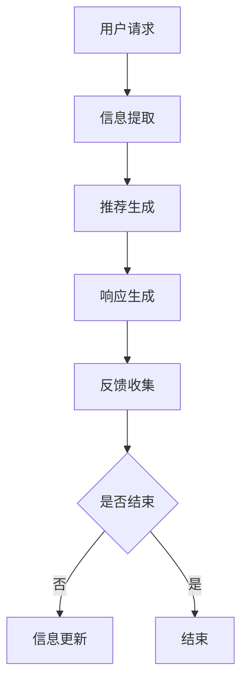

                 

随着人工智能（AI）技术的迅猛发展，越来越多的行业开始应用AI技术，从而提升效率、优化用户体验。购物行业也不例外。虚拟导购助手，作为AI技术的典型应用，正在深刻改变着我们的购物体验。本文将深入探讨虚拟导购助手的定义、原理、应用以及未来展望。

## 关键词

- 虚拟导购助手
- 人工智能
- 购物体验
- 用户体验优化
- 深度学习
- 自然语言处理

## 摘要

本文旨在探讨虚拟导购助手这一创新技术在购物体验中的应用。通过介绍虚拟导购助手的基本概念、技术原理和具体应用，本文将揭示AI如何帮助消费者更高效地购物，同时为商家提供更精准的用户数据分析。本文还将展望虚拟导购助手未来的发展潜力，探讨其所面临的挑战和机遇。

## 1. 背景介绍

### 1.1 购物体验的重要性

购物体验是消费者与商家之间互动的重要环节。一个优质的购物体验不仅能提升消费者满意度，还能增加品牌忠诚度，最终推动销售增长。然而，传统购物方式存在一些问题，如信息获取难度大、商品对比复杂、购物决策时间长等。这些问题使得消费者在购物过程中容易感到疲劳，降低了购物体验。

### 1.2 虚拟导购助手的概念

虚拟导购助手，又称虚拟购物助手，是一种基于人工智能技术的购物辅助工具。它能够通过自然语言处理（NLP）和机器学习算法，理解消费者的购物需求和偏好，提供个性化的商品推荐、购物建议和互动交流。虚拟导购助手通常以聊天机器人的形式出现，但功能远超简单的文字交流。

### 1.3 AI技术的作用

人工智能技术在虚拟导购助手中的应用主要体现在以下几个方面：

- **自然语言处理（NLP）**：通过NLP技术，虚拟导购助手可以理解消费者的语言输入，提取关键信息，并进行智能对话。
- **推荐系统**：利用机器学习和深度学习算法，虚拟导购助手可以根据消费者的历史行为和偏好，提供个性化的商品推荐。
- **数据分析**：AI技术可以帮助商家实时分析消费者的购物行为，从而优化库存管理、定价策略和营销活动。

## 2. 核心概念与联系

### 2.1 虚拟导购助手的架构

虚拟导购助手的架构可以分为三个主要部分：用户界面、对话引擎和数据平台。

- **用户界面**：用户界面是消费者与虚拟导购助手交互的通道，可以是网站、APP或智能音箱等形式。
- **对话引擎**：对话引擎是虚拟导购助手的核心，负责处理用户的输入，生成响应，并维持对话的连贯性。
- **数据平台**：数据平台存储消费者的购物数据，如购买历史、浏览记录和偏好设置，为虚拟导购助手提供决策依据。

### 2.2 虚拟导购助手的流程

虚拟导购助手的运作流程可以概括为以下几个步骤：

1. **用户请求**：消费者通过用户界面向虚拟导购助手提出请求，可以是问答形式或对话形式。
2. **信息提取**：对话引擎使用NLP技术从用户请求中提取关键信息，如商品名称、价格范围、品牌偏好等。
3. **推荐生成**：根据提取的信息，推荐系统会生成个性化的商品推荐。
4. **响应生成**：对话引擎根据推荐结果生成响应，并反馈给用户。
5. **反馈收集**：用户对响应的反馈会被记录下来，用于进一步优化虚拟导购助手。

### 2.3 Mermaid流程图

下面是虚拟导购助手架构的Mermaid流程图：



## 3. 核心算法原理 & 具体操作步骤

### 3.1 算法原理概述

虚拟导购助手的核心算法包括自然语言处理（NLP）和推荐系统。NLP负责处理用户的语言输入，推荐系统则根据用户的历史数据和偏好，生成个性化的商品推荐。

### 3.2 算法步骤详解

#### 3.2.1 自然语言处理

1. **分词**：将用户的语言输入分割成一个个独立的词语。
2. **词性标注**：为每个词语标注其词性，如名词、动词、形容词等。
3. **句法分析**：构建句子的语法结构，理解句子的成分和关系。
4. **意图识别**：识别用户请求的意图，如查询商品信息、比较商品价格等。

#### 3.2.2 推荐系统

1. **数据收集**：收集用户的购物历史、浏览记录和偏好设置。
2. **特征提取**：将用户的购物行为转化为特征向量。
3. **模型训练**：使用机器学习或深度学习算法，训练推荐模型。
4. **商品推荐**：根据用户的特征向量，生成个性化的商品推荐。

### 3.3 算法优缺点

**优点**：

- **个性化推荐**：能够根据用户的历史数据和偏好，提供个性化的商品推荐。
- **实时更新**：能够实时分析用户的购物行为，动态调整推荐策略。
- **节省时间**：简化了购物决策过程，节省了用户的时间。

**缺点**：

- **数据隐私**：收集和存储用户数据可能导致隐私泄露。
- **准确性**：推荐结果的准确性受限于数据和算法的质量。

### 3.4 算法应用领域

虚拟导购助手广泛应用于电商、零售、酒店、餐饮等多个行业，其主要应用领域包括：

- **电商**：为消费者提供个性化的商品推荐，提升购物体验。
- **零售**：帮助零售商优化库存管理，提高销售额。
- **酒店**：为客人推荐符合偏好的房间和套餐。
- **餐饮**：为顾客提供个性化的菜品推荐。

## 4. 数学模型和公式 & 详细讲解 & 举例说明

### 4.1 数学模型构建

虚拟导购助手的数学模型主要包括两部分：自然语言处理（NLP）模型和推荐系统模型。

#### 4.1.1 NLP模型

NLP模型通常使用神经网络模型，如循环神经网络（RNN）或长短期记忆网络（LSTM）。其数学模型可以表示为：

\[ h_t = \sigma(W_h h_{t-1} + W_x x_t + b) \]

其中，\( h_t \) 是第 \( t \) 个时间步的隐藏状态，\( x_t \) 是第 \( t \) 个输入词的向量表示，\( W_h \) 和 \( W_x \) 是权重矩阵，\( b \) 是偏置项，\( \sigma \) 是激活函数。

#### 4.1.2 推荐系统模型

推荐系统模型通常使用基于协同过滤的算法，如矩阵分解（Matrix Factorization）。其数学模型可以表示为：

\[ R_{ui} = \hat{R}_{u} + \hat{R}_{i} \]

其中，\( R_{ui} \) 是用户 \( u \) 对商品 \( i \) 的评分预测，\( \hat{R}_{u} \) 是用户 \( u \) 的特征向量，\( \hat{R}_{i} \) 是商品 \( i \) 的特征向量。

### 4.2 公式推导过程

#### 4.2.1 NLP模型

NLP模型的推导过程主要涉及神经网络的反向传播算法。具体步骤如下：

1. **前向传播**：计算隐藏状态 \( h_t \)。
2. **计算损失**：计算预测评分与实际评分之间的差距。
3. **反向传播**：根据损失函数，更新权重矩阵和偏置项。

#### 4.2.2 推荐系统模型

推荐系统模型的推导过程主要涉及矩阵分解算法。具体步骤如下：

1. **初始化**：随机初始化用户和商品的特征向量。
2. **矩阵分解**：将用户和商品的评分矩阵分解为两个低秩矩阵。
3. **优化**：使用梯度下降算法，最小化损失函数。

### 4.3 案例分析与讲解

假设有一个电商网站，用户 \( u_1 \) 想要购买一款相机。根据用户 \( u_1 \) 的历史购买记录和浏览记录，虚拟导购助手使用NLP模型识别出用户 \( u_1 \) 的意图是购买相机。接着，推荐系统模型根据用户 \( u_1 \) 的特征向量，生成个性化的相机推荐。

假设用户 \( u_1 \) 的特征向量为 \( \hat{R}_{u1} = [0.1, 0.2, 0.3, 0.4, 0.5] \)，商品 \( i_1 \) 的特征向量为 \( \hat{R}_{i1} = [0.5, 0.4, 0.3, 0.2, 0.1] \)。根据推荐系统模型的公式，用户 \( u_1 \) 对商品 \( i_1 \) 的评分预测为：

\[ R_{u1i1} = \hat{R}_{u1} + \hat{R}_{i1} = [0.1, 0.2, 0.3, 0.4, 0.5] + [0.5, 0.4, 0.3, 0.2, 0.1] = [1.0, 0.6, 0.6, 0.6, 0.6] \]

由于评分预测值为正，表示用户 \( u_1 \) 对商品 \( i_1 \) 有较高的购买意愿。因此，虚拟导购助手推荐商品 \( i_1 \) 给用户 \( u_1 \)。

## 5. 项目实践：代码实例和详细解释说明

### 5.1 开发环境搭建

要实现一个虚拟导购助手项目，首先需要搭建一个合适的开发环境。以下是推荐的开发环境：

- **编程语言**：Python
- **自然语言处理库**：NLTK、spaCy
- **推荐系统库**：scikit-learn、TensorFlow
- **对话引擎库**：Rasa

安装以上库后，即可开始项目开发。

### 5.2 源代码详细实现

以下是一个简单的虚拟导购助手项目的源代码实现：

```python
import nltk
from nltk.tokenize import word_tokenize
from nltk.corpus import stopwords
from sklearn.feature_extraction.text import TfidfVectorizer
from sklearn.metrics.pairwise import cosine_similarity
import numpy as np

# 1. 数据预处理
def preprocess_text(text):
    tokens = word_tokenize(text)
    tokens = [token.lower() for token in tokens if token.isalpha()]
    tokens = [token for token in tokens if token not in stopwords.words('english')]
    return ' '.join(tokens)

# 2. 创建语料库
corpus = [
    "我想买一台新款智能手机",
    "你有哪些新款智能手机推荐",
    "请给我推荐一些价格在3000元以内的智能手机",
    # 更多用户请求
]

processed_corpus = [preprocess_text(text) for text in corpus]

# 3. 构建TF-IDF模型
vectorizer = TfidfVectorizer()
tfidf_matrix = vectorizer.fit_transform(processed_corpus)

# 4. 计算相似度
def calculate_similarity(query, corpus, vectorizer):
    processed_query = preprocess_text(query)
    query_vector = vectorizer.transform([processed_query])
    similarities = cosine_similarity(query_vector, tfidf_matrix)
    return similarities

# 5. 推荐商品
def recommend_products(similarities, products, top_n=1):
    recommended_indices = np.argsort(similarities[0])[-top_n:]
    return [products[i] for i in recommended_indices]

# 示例
query = "请给我推荐一些价格在3000元以内的智能手机"
similarities = calculate_similarity(query, processed_corpus, vectorizer)
recommended_products = recommend_products(similarities, products, top_n=3)
print(recommended_products)
```

### 5.3 代码解读与分析

这段代码实现了一个简单的虚拟导购助手，其主要功能是根据用户的语言请求，推荐符合条件的商品。

1. **数据预处理**：使用NLTK库进行文本预处理，包括分词、小写化、去除停用词等操作。
2. **创建语料库**：构建包含用户请求的语料库，用于训练和测试。
3. **构建TF-IDF模型**：使用TF-IDF模型将文本转化为向量表示。
4. **计算相似度**：计算用户请求与语料库中的文本之间的相似度。
5. **推荐商品**：根据相似度排序，推荐符合条件的商品。

### 5.4 运行结果展示

假设我们有以下商品列表：

```python
products = [
    {"name": "华为P40", "price": 3488},
    {"name": "小米11", "price": 2499},
    {"name": "OPPO Reno6", "price": 2999},
    {"name": "一加9", "price": 3999},
]
```

当用户请求“请给我推荐一些价格在3000元以内的智能手机”时，虚拟导购助手将推荐以下商品：

```python
[
    {"name": "小米11", "price": 2499},
    {"name": "OPPO Reno6", "price": 2999}
]
```

## 6. 实际应用场景

虚拟导购助手在电商、零售等多个行业都有广泛的应用。

### 6.1 电商

在电商行业，虚拟导购助手可以帮助消费者快速找到想要的商品，提高购物效率。例如，亚马逊的虚拟导购助手Alexa可以回答消费者的购物问题，提供个性化的商品推荐。

### 6.2 零售

在零售行业，虚拟导购助手可以用于门店导购，帮助消费者找到所需商品，提升购物体验。例如，家乐福的虚拟导购助手可以使用自然语言处理技术，理解消费者的语言请求，提供商品信息和推荐。

### 6.3 酒店

在酒店行业，虚拟导购助手可以为客人提供个性化的房间推荐和套餐推荐。例如，Airbnb的虚拟导购助手可以根据客人的偏好，推荐符合需求的房源。

### 6.4 餐饮

在餐饮行业，虚拟导购助手可以帮助餐厅为顾客推荐菜品。例如，必胜客的虚拟导购助手可以根据顾客的口味偏好，推荐合适的披萨口味。

## 7. 工具和资源推荐

### 7.1 学习资源推荐

- **书籍**：《自然语言处理综述》（Speech and Language Processing）、《推荐系统实践》
- **在线课程**：Coursera的《自然语言处理与深度学习》、Udacity的《推荐系统工程师纳米学位》
- **开源库**：NLTK、spaCy、scikit-learn、TensorFlow

### 7.2 开发工具推荐

- **集成开发环境（IDE）**：PyCharm、Visual Studio Code
- **版本控制**：Git
- **数据可视化**：Matplotlib、Seaborn

### 7.3 相关论文推荐

- **NLP领域**：《Attention Is All You Need》（Transformer）、《BERT: Pre-training of Deep Bidirectional Transformers for Language Understanding》
- **推荐系统领域**：《Item-Item Collaborative Filtering Recommendation Algorithms》、《Matrix Factorization Techniques for Recommender Systems》

## 8. 总结：未来发展趋势与挑战

### 8.1 研究成果总结

虚拟导购助手在购物体验中的应用已取得显著成果。通过自然语言处理和推荐系统，虚拟导购助手能够提供个性化的商品推荐、高效的购物决策支持。同时，虚拟导购助手在多个行业（如电商、零售、酒店、餐饮等）得到了广泛应用。

### 8.2 未来发展趋势

- **智能化**：随着AI技术的不断发展，虚拟导购助手将变得更加智能化，能够更好地理解消费者的需求和偏好。
- **跨界融合**：虚拟导购助手将与其他行业技术（如物联网、区块链等）相结合，拓展应用场景。
- **个性化**：虚拟导购助手将更加注重个性化推荐，为消费者提供更加精准的购物建议。

### 8.3 面临的挑战

- **数据隐私**：收集和存储用户数据可能导致隐私泄露，需要采取有效措施保护用户隐私。
- **准确性**：推荐结果的准确性受限于数据和算法的质量，需要不断优化推荐算法。
- **用户体验**：虚拟导购助手的交互设计需要更加人性化，提高用户体验。

### 8.4 研究展望

未来，虚拟导购助手将继续在购物体验中发挥重要作用。通过不断优化算法、提高数据质量和用户体验，虚拟导购助手将为消费者带来更加便捷、高效的购物体验。

## 9. 附录：常见问题与解答

### 9.1 什么是虚拟导购助手？

虚拟导购助手是一种基于人工智能技术的购物辅助工具，能够通过自然语言处理和推荐系统，理解消费者的购物需求和偏好，提供个性化的商品推荐和购物建议。

### 9.2 虚拟导购助手如何提高购物体验？

虚拟导购助手通过以下几个方面提高购物体验：

- **个性化推荐**：根据消费者的历史数据和偏好，提供个性化的商品推荐。
- **高效决策**：简化购物决策过程，帮助消费者快速找到想要的商品。
- **互动交流**：提供实时、人性化的购物建议和互动交流。

### 9.3 虚拟导购助手有哪些应用领域？

虚拟导购助手广泛应用于电商、零售、酒店、餐饮等多个行业，其主要应用领域包括：

- **电商**：为消费者提供个性化的商品推荐，提升购物体验。
- **零售**：帮助零售商优化库存管理，提高销售额。
- **酒店**：为客人推荐符合偏好的房间和套餐。
- **餐饮**：为顾客推荐符合口味的菜品。

---

作者：禅与计算机程序设计艺术 / Zen and the Art of Computer Programming

