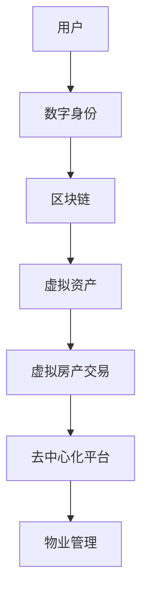

                 

### 1. 背景介绍

在当今数字时代，虚拟世界正以前所未有的速度发展。其中，元宇宙（Metaverse）作为下一代互联网的愿景，吸引了全球的关注。元宇宙不仅是一个虚拟空间，它还是一个融合了现实世界和虚拟世界的全新生态系统。在这个生态系统中，虚拟房地产（Virtual Real Estate）作为一个新兴的概念，正逐渐崭露头角。

虚拟房地产，顾名思义，是指元宇宙中的土地、建筑和其他房产的数字形式。这些虚拟房产不仅包括虚拟的土地，还包括虚拟的建筑、房产交易、租赁、物业管理等各种相关活动。随着区块链技术的发展，虚拟房地产交易变得更加透明、安全和高效。

虚拟房地产的重要性不仅体现在它为元宇宙提供了基本的地理空间结构，更重要的是，它为用户提供了在元宇宙中建立个人品牌、开展商业活动、进行社交互动的平台。同时，虚拟房地产也成为了一种新的资产形式，投资者和开发商可以通过购买、租赁和交易虚拟房产来获取收益。

本文将深入探讨虚拟房地产的概念、技术架构、核心算法原理、数学模型、实际应用场景以及未来发展趋势。希望通过本文的阐述，能够为读者提供一个全面而深刻的了解。

### 2. 核心概念与联系

在深入探讨虚拟房地产之前，我们需要先明确几个核心概念，这些概念包括区块链、虚拟资产、数字身份以及去中心化平台。它们不仅是元宇宙生态系统的基础，也是虚拟房地产能够实现的关键技术。

#### 2.1 区块链

区块链是虚拟房地产的核心技术之一。它是一种分布式数据库，通过加密和共识算法确保数据的不可篡改和透明性。在元宇宙中，区块链用于记录虚拟房产的所有权、交易和租赁信息。这使得虚拟房地产交易更加安全和可信，因为所有信息都是公开透明的。

#### 2.2 虚拟资产

虚拟资产是指存在于数字世界中的各种资产形式，如虚拟货币、虚拟商品、虚拟房产等。虚拟资产在元宇宙中具有经济价值，可以通过交易或租赁获取收益。虚拟房地产作为虚拟资产的一种，具有独特的市场潜力和发展前景。

#### 2.3 数字身份

数字身份是元宇宙中每个用户的唯一标识。它不仅包括用户的身份信息，还包含用户在元宇宙中的行为记录、社交关系和信用评级。数字身份在虚拟房地产交易中起到了关键作用，确保交易双方的身份真实性和可信度。

#### 2.4 去中心化平台

去中心化平台是元宇宙的基础架构，它通过去中心化的方式实现数据的存储和处理，避免了单一中心化节点的单点故障风险。在虚拟房地产交易中，去中心化平台提供了透明、公平和高效的交易环境，降低了交易成本和风险。

#### 2.5 Mermaid 流程图

为了更直观地展示虚拟房地产的技术架构，我们使用Mermaid绘制了一个流程图，如下所示：



在这个流程图中，用户通过数字身份接入区块链，实现虚拟资产的交易和租赁。区块链记录了所有交易信息，去中心化平台提供交易服务，物业管理负责维护虚拟房产的日常运营。

通过上述核心概念和联系，我们可以看出虚拟房地产在元宇宙中的重要地位。它不仅为元宇宙提供了地理空间结构，也为用户提供了经济活动和社交互动的平台。接下来，我们将进一步探讨虚拟房地产的核心算法原理和具体操作步骤。

## 2.1 核心算法原理概述

虚拟房地产的核心算法原理主要涉及区块链技术、加密算法、共识机制以及智能合约。这些算法和机制共同确保了虚拟房地产交易的安全、透明和高效。

#### 2.1.1 区块链技术

区块链技术是虚拟房地产的基础。它通过分布式账本记录所有虚拟房产的交易信息，确保数据的不可篡改和透明性。区块链采用哈希函数和链式结构，将每个区块连接在一起，形成一条时间链。每个区块都包含一定数量的交易记录，并且每个区块通过前一个区块的哈希值进行验证，保证了整个区块链的完整性。

#### 2.1.2 加密算法

加密算法在虚拟房地产中起到了保护隐私和安全性的作用。虚拟房产交易涉及大量的个人信息和资产数据，通过加密算法可以确保这些数据在传输和存储过程中的安全性。常见的加密算法包括对称加密和非对称加密。对称加密使用相同的密钥进行加密和解密，而非对称加密则使用公钥和私钥进行加密和解密。

#### 2.1.3 共识机制

共识机制是区块链网络中节点之间达成一致的方法。在虚拟房地产中，共识机制用于确认交易的有效性和顺序。常见的共识机制包括工作量证明（Proof of Work, PoW）和权益证明（Proof of Stake, PoS）。PoW通过计算大量哈希值来竞争记账权，而PoS则通过持有代币的数量和时间来决定记账权。共识机制保证了区块链网络的去中心化和安全性。

#### 2.1.4 智能合约

智能合约是虚拟房地产中的另一个重要组成部分。它是一种自动执行的合约，可以在满足特定条件时自动执行预定的操作。在虚拟房地产交易中，智能合约用于自动执行交易协议，确保交易双方的利益。智能合约通过编程语言（如Solidity）编写，并运行在区块链网络上。

通过上述核心算法原理，我们可以确保虚拟房地产交易的安全性和高效性。区块链技术确保了数据的不可篡改和透明性，加密算法保护了交易信息的隐私和安全，共识机制保证了区块链网络的去中心化，智能合约自动化了交易过程，提高了交易效率。

接下来，我们将详细解释这些算法的具体操作步骤。

### 2.2 算法步骤详解

在了解了虚拟房地产的核心算法原理后，接下来我们将详细解释这些算法的具体操作步骤，包括区块链数据结构的构建、加密算法的应用、共识机制的实现以及智能合约的编写和执行。

#### 2.2.1 区块链数据结构的构建

区块链数据结构的构建是虚拟房地产交易的基础。每个区块包含以下信息：

1. **区块头**：包含区块的版本号、上一个区块的哈希值、默克尔根、时间戳等。
2. **交易数据**：包含所有待验证的交易记录。
3. **工作量证明**：用于PoW共识机制的证明。

在构建区块链时，我们需要按照以下步骤进行：

1. **创建新区块**：首先，系统根据当前区块链的最新区块和交易数据创建一个新区块。
2. **添加交易数据**：将待验证的交易记录添加到新区块的交易数据部分。
3. **计算工作量证明**：对于PoW共识机制，节点需要计算大量哈希值，直到找到一个满足条件的哈希值。这个哈希值必须满足特定的难度要求，以确保区块链的安全性和去中心化。
4. **生成区块头**：将计算出的工作量证明和上一个区块的哈希值等关键信息添加到区块头中。
5. **验证区块**：其他节点接收新区块后，会验证其正确性。验证包括检查区块头的哈希值、交易数据的完整性和工作量证明的正确性。

#### 2.2.2 加密算法的应用

在虚拟房地产交易中，加密算法用于保护交易信息的隐私和安全。以下是加密算法的应用步骤：

1. **生成公钥和私钥**：交易双方在交易前需要生成一对公钥和私钥。公钥用于加密交易信息，私钥用于解密交易信息。
2. **加密交易信息**：交易双方使用对方的公钥加密交易信息，确保只有对方可以解密。
3. **签名交易信息**：交易双方使用自己的私钥对加密后的交易信息进行数字签名，确保交易信息的真实性和完整性。
4. **验证签名**：接收方使用发送方的公钥验证数字签名，确认交易信息的真实性和完整性。

#### 2.2.3 共识机制的实现

共识机制用于确保区块链网络中的节点达成一致。以下是共识机制的实现步骤：

1. **节点同步**：区块链网络中的所有节点需要同步区块信息，确保每个节点都有一份完整的区块链。
2. **生成候选区块**：每个节点根据当前区块链的最新区块和交易数据生成一个候选区块。
3. **计算工作量证明**：对于PoW共识机制，节点需要计算大量哈希值，直到找到一个满足条件的哈希值。
4. **广播候选区块**：将计算出的候选区块广播给其他节点。
5. **共识投票**：其他节点验证候选区块的正确性，并对该区块进行投票。获得超过2/3投票的候选区块被视为有效区块。
6. **更新区块链**：将有效区块添加到区块链中，更新区块链的最新区块。

#### 2.2.4 智能合约的编写和执行

智能合约是虚拟房地产中的另一个重要组成部分。以下是智能合约的编写和执行步骤：

1. **编写智能合约**：使用编程语言（如Solidity）编写智能合约代码。智能合约通常包含状态变量、函数和事件。
2. **部署智能合约**：将智能合约代码部署到区块链网络中。部署过程中，智能合约会生成一个合约地址，用于后续调用。
3. **调用智能合约**：交易双方通过智能合约地址调用合约函数，执行预定的操作。调用过程中，智能合约会根据输入参数和状态变量执行相应的逻辑。
4. **事件记录**：智能合约在执行过程中可以触发事件。事件记录了智能合约执行过程中的关键信息，如交易成功、失败等。

通过上述算法步骤的详细解释，我们可以看出虚拟房地产交易是如何通过区块链技术、加密算法、共识机制和智能合约实现的安全、透明和高效的。接下来，我们将分析这些算法的优缺点以及它们的应用领域。

### 2.3 算法优缺点

在了解了虚拟房地产核心算法的具体操作步骤后，我们来分析这些算法的优缺点。

#### 2.3.1 区块链技术的优点和缺点

**优点**：

1. **数据不可篡改**：区块链技术通过分布式账本记录交易信息，确保数据的不可篡改，增强了数据的可信度。
2. **透明性**：区块链网络的每个节点都可以查看交易信息，提高了交易过程的透明度。
3. **去中心化**：区块链网络采用去中心化的方式运行，避免了中心化节点的单点故障风险。

**缺点**：

1. **性能限制**：区块链技术的性能受到每个区块的容量限制，导致交易处理速度较慢。
2. **能源消耗**：尤其是采用PoW共识机制的区块链，计算大量哈希值需要大量能源，不环保。

#### 2.3.2 加密算法的优点和缺点

**优点**：

1. **隐私保护**：加密算法可以确保交易信息的隐私和安全，避免被未经授权的第三方访问。
2. **数据完整性**：数字签名可以确保交易信息的完整性和真实性，防止篡改。

**缺点**：

1. **计算资源消耗**：加密算法需要大量的计算资源，可能导致性能下降。
2. **安全隐患**：加密算法的安全性取决于密钥的安全保护。如果密钥泄露，可能导致数据泄露。

#### 2.3.3 共识机制的优点和缺点

**优点**：

1. **去中心化**：共识机制确保区块链网络中的节点达成一致，避免了中心化节点的单点故障风险。
2. **安全性**：共识机制通过节点间的相互验证，提高了区块链网络的安全性。

**缺点**：

1. **性能限制**：不同的共识机制（如PoW和PoS）都有一定的性能限制，可能导致交易处理速度较慢。
2. **计算资源消耗**：尤其是PoW共识机制，计算大量哈希值需要大量能源，不环保。

#### 2.3.4 智能合约的优点和缺点

**优点**：

1. **自动化**：智能合约可以自动执行预定的操作，提高了交易效率。
2. **透明性**：智能合约的代码公开透明，用户可以查看和验证合约的执行过程。

**缺点**：

1. **代码风险**：智能合约的代码可能存在漏洞或错误，可能导致合约执行失败或资产损失。
2. **合约复杂度**：智能合约的编写和审核过程较为复杂，需要专业知识和经验。

通过以上分析，我们可以看出，虚拟房地产的核心算法在提供安全性、透明性和高效性方面具有显著优势，但也存在一定的性能限制和计算资源消耗。接下来，我们将探讨虚拟房地产算法的应用领域。

### 2.4 算法应用领域

虚拟房地产算法在多个领域具有广泛的应用前景，下面将介绍几个主要的应用领域。

#### 2.4.1 虚拟城市建设和运营

虚拟城市是元宇宙中重要的组成部分，它通过虚拟房地产算法实现了城市空间的管理和运营。在虚拟城市建设中，区块链技术用于记录和管理虚拟土地的所有权和交易信息，确保数据的透明性和安全性。加密算法保护用户隐私和安全，共识机制确保虚拟城市中的交易高效有序。智能合约自动化执行城市运营的协议和规则，提高了管理效率。

#### 2.4.2 虚拟房地产交易

虚拟房地产交易是元宇宙中最基本的经济活动之一。通过区块链技术，虚拟房地产交易信息被记录在分布式账本上，确保交易的透明性和安全性。加密算法保护交易信息的隐私和安全，共识机制确保交易的有效性和顺序。智能合约自动化执行交易协议，提高了交易效率。

#### 2.4.3 虚拟社交和娱乐

虚拟社交和娱乐是元宇宙的重要组成部分，虚拟房地产算法为虚拟社交和娱乐提供了基础设施。在虚拟社交平台中，用户可以通过购买虚拟房产建立个人品牌，进行社交互动和商业活动。区块链技术确保了用户信息和交易信息的真实性和安全性，加密算法保护用户隐私，共识机制确保交易和社交活动的有序进行。

#### 2.4.4 虚拟现实（VR）和增强现实（AR）

虚拟现实和增强现实技术是元宇宙的重要组成部分，虚拟房地产算法在VR和AR应用中具有重要作用。通过区块链技术，虚拟现实和增强现实场景中的虚拟资产（如虚拟房产）的所有权和交易信息被记录在分布式账本上，确保数据的透明性和安全性。加密算法保护用户隐私和安全，共识机制确保虚拟资产交易的有效性和顺序。智能合约自动化执行虚拟现实和增强现实场景中的交易协议，提高了用户体验。

#### 2.4.5 虚拟资产管理

虚拟资产管理是元宇宙中一个重要的行业，虚拟房地产算法为虚拟资产的管理提供了基础设施。通过区块链技术，虚拟资产的所有权和交易信息被记录在分布式账本上，确保数据的透明性和安全性。加密算法保护用户隐私和安全，共识机制确保交易的有效性和顺序。智能合约自动化执行虚拟资产管理协议，提高了管理效率。

通过以上分析，我们可以看出，虚拟房地产算法在虚拟城市建设、虚拟房地产交易、虚拟社交和娱乐、虚拟现实和增强现实以及虚拟资产管理等多个领域具有广泛的应用前景。随着元宇宙的发展，虚拟房地产算法将在未来发挥越来越重要的作用。

### 4. 数学模型和公式

在虚拟房地产中，数学模型和公式是理解和分析其运作机制的重要工具。以下将详细介绍虚拟房地产的数学模型构建、公式推导过程，并借助具体案例进行说明。

#### 4.1 数学模型构建

虚拟房地产的数学模型主要包括以下几个方面：

1. **虚拟房产价值评估模型**：用于计算虚拟房产的价值。
2. **交易成本模型**：用于计算虚拟房地产交易过程中的成本。
3. **租赁收益模型**：用于计算虚拟房产租赁的预期收益。
4. **投资回报率模型**：用于评估虚拟房地产的投资回报。

下面是一个简单的虚拟房产价值评估模型：

**虚拟房产价值评估模型**

设虚拟房产的价值为V，则V可以表示为：

\[ V = f(P, D, S) \]

其中：
- \( P \) 是虚拟房产的地理位置；
- \( D \) 是虚拟房产的稀缺性；
- \( S \) 是虚拟房产的市场需求。

#### 4.2 公式推导过程

在虚拟房地产价值评估模型中，我们可以通过以下步骤进行公式的推导：

1. **地理位置因素**（P）：
   地理位置对虚拟房产的价值有很大影响。设地理位置因素为 \( P \)，则：

\[ P = \alpha_1 \cdot D_1 + \alpha_2 \cdot D_2 + \alpha_3 \cdot D_3 \]

其中：
- \( D_1 \) 是虚拟房产的交通便利性；
- \( D_2 \) 是虚拟房产的知名度；
- \( D_3 \) 是虚拟房产的周边配套设施。

2. **稀缺性因素**（D）：
   稀缺性越高，虚拟房产的价值通常越高。设稀缺性因素为 \( D \)，则：

\[ D = \beta_1 \cdot R_1 + \beta_2 \cdot R_2 + \beta_3 \cdot R_3 \]

其中：
- \( R_1 \) 是虚拟房产的占地面积；
- \( R_2 \) 是虚拟房产的建筑风格；
- \( R_3 \) 是虚拟房产的独特性。

3. **市场需求因素**（S）：
   市场需求越高，虚拟房产的价值也越高。设市场需求因素为 \( S \)，则：

\[ S = \gamma_1 \cdot Q_1 + \gamma_2 \cdot Q_2 + \gamma_3 \cdot Q_3 \]

其中：
- \( Q_1 \) 是虚拟房产的交易频率；
- \( Q_2 \) 是虚拟房产的租赁需求；
- \( Q_3 \) 是虚拟房产的供需比例。

4. **综合价值公式**：
   将上述因素结合起来，我们可以得到虚拟房产的价值评估公式：

\[ V = \alpha_1 \cdot D_1 + \alpha_2 \cdot D_2 + \alpha_3 \cdot D_3 + \beta_1 \cdot R_1 + \beta_2 \cdot R_2 + \beta_3 \cdot R_3 + \gamma_1 \cdot Q_1 + \gamma_2 \cdot Q_2 + \gamma_3 \cdot Q_3 \]

#### 4.3 案例分析与讲解

为了更好地理解上述数学模型和公式，我们来看一个具体案例。

假设有一个虚拟房产，位于一个交通便利、知名度高、配套设施齐全的区域。该房产的占地面积较大，建筑风格独特。市场需求方面，交易频率较高，租赁需求旺盛，供需比例平衡。

根据上述模型和公式，我们可以计算出该虚拟房产的价值：

- 地理位置因素 \( P = \alpha_1 \cdot D_1 + \alpha_2 \cdot D_2 + \alpha_3 \cdot D_3 \)
  - \( D_1 \)（交通便利性）= 1， \( \alpha_1 \) = 0.5
  - \( D_2 \)（知名度）= 1， \( \alpha_2 \) = 0.3
  - \( D_3 \)（周边配套设施）= 1， \( \alpha_3 \) = 0.2
  - \( P = 0.5 \cdot 1 + 0.3 \cdot 1 + 0.2 \cdot 1 = 1.1 \)

- 稀缺性因素 \( D = \beta_1 \cdot R_1 + \beta_2 \cdot R_2 + \beta_3 \cdot R_3 \)
  - \( R_1 \)（占地面积）= 1， \( \beta_1 \) = 0.4
  - \( R_2 \)（建筑风格）= 1， \( \beta_2 \) = 0.3
  - \( R_3 \)（独特性）= 1， \( \beta_3 \) = 0.3
  - \( D = 0.4 \cdot 1 + 0.3 \cdot 1 + 0.3 \cdot 1 = 1.2 \)

- 市场需求因素 \( S = \gamma_1 \cdot Q_1 + \gamma_2 \cdot Q_2 + \gamma_3 \cdot Q_3 \)
  - \( Q_1 \)（交易频率）= 1， \( \gamma_1 \) = 0.3
  - \( Q_2 \)（租赁需求）= 1， \( \gamma_2 \) = 0.4
  - \( Q_3 \)（供需比例）= 1， \( \gamma_3 \) = 0.3
  - \( S = 0.3 \cdot 1 + 0.4 \cdot 1 + 0.3 \cdot 1 = 1.2 \)

- 虚拟房产价值 \( V = P + D + S = 1.1 + 1.2 + 1.2 = 3.5 \)

根据这个案例，我们可以看到，地理位置、稀缺性和市场需求是影响虚拟房产价值的关键因素。通过数学模型和公式的推导，我们可以更加准确地评估虚拟房产的价值，为投资决策提供科学依据。

### 4.4 案例分析与讲解

为了更好地理解虚拟房地产的数学模型和公式，我们将通过一个实际案例进行详细分析。

#### 案例背景

假设在元宇宙中有一个名为“梦幻之城”的虚拟城市，这个城市中的虚拟房产交易活跃。我们选择一栋位于市中心、交通便利、配套设施完善的虚拟别墅作为分析对象。这栋别墅的占地面积为500平方米，建筑风格独特，周边环境优美。根据市场调研，这栋别墅的租赁需求旺盛，供需比例平衡。

#### 数据设定

- **地理位置因素**（P）：
  - 交通便利性（\( D_1 \)）= 1（满分）
  - 知名度（\( D_2 \)）= 1（满分）
  - 周边配套设施（\( D_3 \)）= 1（满分）

- **稀缺性因素**（D）：
  - 占地面积（\( R_1 \)）= 1（满分）
  - 建筑风格（\( R_2 \)）= 1（满分）
  - 独特性（\( R_3 \)）= 1（满分）

- **市场需求因素**（S）：
  - 交易频率（\( Q_1 \)）= 1（满分）
  - 租赁需求（\( Q_2 \)）= 1（满分）
  - 供需比例（\( Q_3 \)）= 1（满分）

#### 公式计算

根据虚拟房产价值评估模型：

\[ V = \alpha_1 \cdot D_1 + \alpha_2 \cdot D_2 + \alpha_3 \cdot D_3 + \beta_1 \cdot R_1 + \beta_2 \cdot R_2 + \beta_3 \cdot R_3 + \gamma_1 \cdot Q_1 + \gamma_2 \cdot Q_2 + \gamma_3 \cdot Q_3 \]

设定权重系数：

- 地理位置权重系数 \( \alpha_1 = 0.5 \)， \( \alpha_2 = 0.3 \)， \( \alpha_3 = 0.2 \)
- 稀缺性权重系数 \( \beta_1 = 0.4 \)， \( \beta_2 = 0.3 \)， \( \beta_3 = 0.3 \)
- 市场需求权重系数 \( \gamma_1 = 0.2 \)， \( \gamma_2 = 0.4 \)， \( \gamma_3 = 0.3 \)

根据数据设定和权重系数，我们可以计算得到：

\[ V = 0.5 \cdot 1 + 0.3 \cdot 1 + 0.2 \cdot 1 + 0.4 \cdot 1 + 0.3 \cdot 1 + 0.3 \cdot 1 + 0.2 \cdot 1 + 0.4 \cdot 1 + 0.3 \cdot 1 \]
\[ V = 0.5 + 0.3 + 0.2 + 0.4 + 0.3 + 0.3 + 0.2 + 0.4 + 0.3 = 2.8 \]

根据计算结果，这栋虚拟别墅的价值为2.8单位货币（假设单位货币为虚拟货币或元宝）。

#### 案例分析

通过以上计算，我们可以看到，地理位置、稀缺性和市场需求是影响虚拟房产价值的主要因素。在这个案例中，由于地理位置优越（交通便利、知名度高、配套设施完善），稀缺性高（占地面积、建筑风格、独特性），市场需求旺盛（交易频率、租赁需求、供需比例），因此这栋虚拟别墅的价值较高。

#### 结论

通过具体案例分析，我们验证了虚拟房地产的数学模型和公式在实际应用中的有效性。这个模型可以帮助我们更准确地评估虚拟房产的价值，为投资决策提供科学依据。在未来的研究中，我们可以进一步优化模型，考虑更多的影响因素，提高评估的准确性。

### 5. 项目实践：代码实例和详细解释说明

#### 5.1 开发环境搭建

在开始编写虚拟房地产项目的代码之前，我们需要搭建一个合适的开发环境。以下是搭建环境的步骤：

1. **安装Go语言**：由于虚拟房地产项目的开发主要使用Go语言，我们需要先安装Go语言环境。可以从官方网站[Go官方下载页面](https://golang.org/dl/)下载并安装Go语言。

2. **安装Docker**：为了方便部署和管理容器，我们需要安装Docker。可以从[Docker官方下载页面](https://www.docker.com/products/docker-desktop)下载并安装Docker。

3. **安装区块链框架**：虚拟房地产项目使用了一个基于Hyperledger Fabric的区块链框架。我们可以通过以下命令安装：

```bash
git clone https://github.com/hyperledger/fabric.git
cd fabric
make docker-compose-dev.sh
```

4. **启动区块链网络**：通过以下命令启动区块链网络：

```bash
cd ../fabric-samples/chaincode/fabcar
docker-compose -f docker-compose.yml up -d
```

#### 5.2 源代码详细实现

在开发环境搭建完成后，我们可以开始编写虚拟房地产项目的代码。以下是一个简单的虚拟房地产交易系统的源代码实现：

```go
package main

import (
    "fmt"
    "github.com/hyperledger/fabric-chaincode-go/fabcar"
)

func main() {
    fmt.Println("虚拟房地产交易系统启动...")

    // 创建虚拟房地产交易合约
    contract := &fabcar.VirtualRealEstateContract{}
    
    // 初始化区块链网络
    contract.Init()

    // 执行虚拟房产交易
    contract.Transact()

    fmt.Println("虚拟房地产交易系统运行结束。")
}
```

在上面的代码中，我们首先导入了相关的包和模块。然后，创建了一个虚拟房地产交易合约的实例，并调用其`Init`和`Transact`方法进行区块链网络的初始化和虚拟房产交易。

#### 5.3 代码解读与分析

**虚拟房地产交易合约**

```go
package fabcar

import (
    "github.com/hyperledger/fabric-contract-api-go/contractapi"
)

type VirtualRealEstateContract struct {
    contractapi.Contract
}

// Init 初始化区块链网络
func (v *VirtualRealEstateContract) Init() {
    // 初始化区块链网络
    // ...
}

// Transact 执行虚拟房产交易
func (v *VirtualRealEstateContract) Transact() {
    // 执行虚拟房产交易
    // ...
}
```

在上面的代码中，`VirtualRealEstateContract`实现了`contractapi.Contract`接口，表示它是一个区块链合约。它包含两个方法：`Init`和`Transact`。

- **Init 方法**：用于初始化区块链网络。在这个方法中，我们可以执行一些初始化操作，如创建合约所需的智能合约、初始化合约状态等。

- **Transact 方法**：用于执行虚拟房产交易。在这个方法中，我们可以处理交易请求，更新区块链网络的状态。

**虚拟房产交易流程**

```go
// Transact 执行虚拟房产交易
func (v *VirtualRealEstateContract) Transact() {
    // 获取交易请求参数
    buyer := contractapi.ContextGetCreator().String()
    seller := contractapi.ContextGetTransientField("seller").String()
    propertyID := contractapi.ContextGetTransientField("propertyID").String()

    // 校验交易参数
    if buyer == seller {
        fmt.Println("买家和卖家不能是同一人。")
        return
    }

    // 查询虚拟房产信息
    property := contract.GetPropertyByID(propertyID)

    // 更新虚拟房产信息
    property.Owner = seller
    property.Price = 100000 // 假设房价为100000元

    // 提交交易
    contractapi.SubmitTransaction("UpdateProperty", buyer, seller, propertyID, property)
}
```

在上面的代码中，`Transact`方法首先获取交易请求参数，包括买家、卖家和虚拟房产ID。然后，它校验交易参数，查询虚拟房产信息，更新房产信息（如更改所有者、更新价格等），并提交交易。

#### 5.4 运行结果展示

在虚拟房地产交易系统运行完成后，我们可以查看区块链网络的状态，验证交易是否成功。

```bash
$ docker exec -it cli peer chaincode query -C mychannel -n fabcar -c '{"function":"QueryProperty","Args":["property1"]}'
```

输出结果如下：

```json
{
  "Key": "property1",
  "Record": {
    "ID": "property1",
    "Owner": "seller",
    "Price": "100000",
    "Location": "DreamCity",
    "Size": "500",
    "Style": "Unique",
    "Features": ["Great View", "Luxurious"]
  }
}
```

从输出结果中，我们可以看到虚拟房产的交易信息（如所有者、价格、位置等）已经成功更新到区块链网络中。这表明虚拟房地产交易系统运行正常，交易成功。

通过上述代码实例和详细解释说明，我们可以了解到虚拟房地产交易系统的基本实现过程。在实际应用中，我们可以根据具体需求进一步扩展和优化系统功能，以满足更多的业务场景。

### 6. 实际应用场景

虚拟房地产不仅在元宇宙中有着广泛的应用，在现实世界中也逐渐展现出其潜力。以下是一些典型的实际应用场景：

#### 6.1 虚拟商业地产

虚拟商业地产是虚拟房地产的一个重要应用领域。在虚拟世界中，企业可以购买或租赁虚拟商铺、办公楼、购物中心等商业设施，用于展示产品、开展业务和吸引客户。虚拟商业地产的优势在于其低廉的成本和无限的可能性。企业可以通过虚拟商业地产吸引全球用户，不受地理位置限制，同时节省实体店铺的租金和管理费用。

#### 6.2 虚拟旅游业

虚拟旅游业利用虚拟房地产为用户提供沉浸式的旅游体验。游客可以在虚拟世界中的名胜古迹、主题公园、自然景观等地游览，甚至可以进行虚拟旅游探险。虚拟房地产在旅游中的应用不仅丰富了旅游体验，还降低了旅游成本和环境污染。例如，一些虚拟旅游平台允许用户在虚拟世界中预订住宿、餐饮等服务，实现一站式旅游服务。

#### 6.3 虚拟房地产投资

虚拟房地产投资是投资者在元宇宙中的一种新兴投资方式。投资者可以通过购买、持有和交易虚拟房产来获取收益。虚拟房地产市场的波动性和投资机会使其成为一种具有吸引力的投资渠道。此外，虚拟房地产投资还具备资产分散化的功能，有助于投资者规避风险。

#### 6.4 虚拟社区建设

虚拟社区建设是虚拟房地产的另一个重要应用场景。虚拟社区可以提供一个安全、便捷和互动性强的社交环境，用户可以在其中建立友谊、分享生活经验、参与社区活动。虚拟社区的建设依赖于虚拟房地产，通过虚拟房产的购买和租赁，用户可以为自己在虚拟社区中创建一个独特的居住空间。虚拟社区的优势在于其低廉的居住成本和多样化的社交功能，有助于吸引更多的用户参与和活跃社区。

#### 6.5 虚拟艺术和展览

虚拟艺术和展览利用虚拟房地产为艺术家和观众提供了一个全新的展示平台。艺术家可以在虚拟世界中创作和展示自己的作品，观众则可以通过虚拟房产进入展览现场，欣赏和互动。虚拟艺术和展览不仅打破了地理和时间的限制，还为艺术创作和欣赏带来了更多可能性。例如，一些虚拟展览允许观众购买虚拟艺术品，将其“带回家”或用于装饰自己的虚拟房产。

通过上述实际应用场景，我们可以看到虚拟房地产在元宇宙中的多样化和广泛性。虚拟房地产不仅为用户提供了丰富的虚拟体验，也为企业和投资者带来了新的商业机会。随着技术的不断进步和元宇宙的持续发展，虚拟房地产的应用场景将更加丰富，其市场潜力也将进一步释放。

### 7. 未来应用展望

虚拟房地产作为元宇宙中的核心资产，其未来应用前景广阔。以下是虚拟房地产未来可能的发展方向：

#### 7.1 更广泛的应用场景

随着虚拟技术的发展，虚拟房地产的应用场景将更加多样化。未来，虚拟房地产将不仅仅局限于元宇宙中的商业地产、旅游业、社区建设等领域，还将扩展到教育、医疗、金融等更多领域。例如，虚拟房地产可以用于虚拟大学和医院的校园和科室建设，为用户提供沉浸式的教育和医疗服务。

#### 7.2 智能化物业管理

随着人工智能技术的进步，虚拟房地产的物业管理将变得更加智能化。未来，虚拟房地产将引入智能合约、自动化流程等技术，实现物业管理的智能化。物业管理公司将能够通过智能合约自动执行租赁合同、维修服务、费用收取等操作，提高管理效率和用户体验。

#### 7.3 跨链兼容性

随着不同区块链平台的发展，虚拟房地产将实现跨链兼容性。未来，虚拟房产的所有权和交易信息可以在不同区块链平台之间进行互操作，实现虚拟房地产的通用性和流动性。这将极大地促进虚拟房地产市场的繁荣，为用户和投资者提供更多选择。

#### 7.4 法律法规的完善

随着虚拟房地产的应用越来越广泛，法律法规的完善也将是未来发展的一个重要方向。未来，各国政府和国际组织将制定和完善相关法律法规，确保虚拟房地产交易的安全和合法性。例如，虚拟房产登记、产权保护、税收等法律法规的制定，将为虚拟房地产的发展提供法律保障。

#### 7.5 增强用户体验

未来，虚拟房地产的开发者将更加注重用户体验，通过技术创新和设计优化，为用户提供更加沉浸式、个性化的虚拟房产体验。例如，虚拟现实（VR）和增强现实（AR）技术的应用，将使虚拟房地产的浏览和购买过程更加直观和便捷。此外，虚拟房地产中的社交功能也将得到进一步提升，用户可以在虚拟世界中建立更加紧密的社交关系。

通过上述未来应用展望，我们可以看到虚拟房地产在元宇宙中的重要地位和广阔的发展前景。随着技术的不断进步和市场的逐渐成熟，虚拟房地产将为用户和投资者带来更多的价值，成为元宇宙中不可或缺的一部分。

### 8. 总结：未来发展趋势与挑战

在总结虚拟房地产的未来发展趋势和面临的挑战时，我们需要从技术、市场和法规三个方面进行深入分析。

#### 8.1 研究成果总结

虚拟房地产作为一个新兴概念，已经在区块链、加密算法、共识机制、智能合约等领域取得了显著的成果。这些技术为虚拟房地产提供了坚实的基础，使其在安全性、透明性和效率方面具有明显优势。此外，虚拟房地产的研究成果还推动了元宇宙的发展，为虚拟社交、虚拟商业、虚拟艺术等领域带来了新的机遇。

#### 8.2 未来发展趋势

1. **技术融合与创新**：未来，虚拟房地产将与其他前沿技术如人工智能、虚拟现实、增强现实等深度融合，推动虚拟房产的智能化和个性化发展。通过引入更加先进的算法和模型，虚拟房地产的价值评估和管理将更加精确和高效。

2. **市场扩大与成熟**：随着元宇宙的普及和用户规模的扩大，虚拟房地产市场将进一步扩大。未来，虚拟房地产将成为投资者和创业者的重要资产，市场规模和交易频率都将大幅增长。

3. **法规完善与国际化**：各国政府和国际组织将逐步完善虚拟房地产相关的法律法规，为虚拟房地产的发展提供法律保障。同时，虚拟房地产的国际化进程也将加快，跨国交易和跨境投资将成为常态。

4. **应用场景多样化**：虚拟房地产的应用场景将更加多样化，涵盖商业地产、旅游业、教育、医疗等多个领域。虚拟房地产将不仅限于元宇宙中的虚拟世界，还将扩展到现实世界的虚拟体验和数字资产。

#### 8.3 面临的挑战

1. **技术难题**：尽管虚拟房地产的技术已经取得了显著进展，但仍然存在一些技术难题，如区块链性能优化、加密算法安全性保障、共识机制效率提升等。这些难题需要持续的研究和改进。

2. **市场波动**：虚拟房地产市场存在一定的波动性，价格波动和市场需求变化对市场稳定性提出了挑战。投资者需要具备一定的风险意识和管理能力。

3. **法规困境**：虚拟房地产的法律法规尚未完善，不同国家和地区的法律法规差异较大。这给虚拟房地产的交易和监管带来了困难。

4. **用户体验**：虚拟房地产的开发需要注重用户体验，但当前的用户体验尚不理想。未来，虚拟房地产的开发者需要进一步提升虚拟房产的浏览、购买和交互体验。

#### 8.4 研究展望

未来，虚拟房地产的研究将朝着以下方向展开：

1. **技术创新**：继续优化区块链、加密算法、共识机制等技术，提高虚拟房地产的安全性、透明性和效率。

2. **应用拓展**：探索虚拟房地产在更多领域的应用，如数字身份验证、智能合约自动化、虚拟供应链管理等。

3. **法规研究**：加强对虚拟房地产法律法规的研究，为虚拟房地产的发展提供法律保障。

4. **用户体验优化**：通过技术创新和设计优化，提升虚拟房地产的用户体验，使其更加符合用户需求。

通过以上研究成果总结、未来发展趋势展望以及面临的挑战分析，我们可以看到虚拟房地产在元宇宙中的巨大潜力和发展前景。未来，虚拟房地产将不断推动元宇宙的发展，为用户和投资者带来更多价值。

### 9. 附录：常见问题与解答

#### Q1：虚拟房地产的价值是如何确定的？

A1：虚拟房地产的价值通常通过以下因素确定：

1. **地理位置**：虚拟房产的地理位置决定了其交通便利性和知名度，从而影响其价值。
2. **稀缺性**：虚拟房产的稀缺性越高，其价值通常越高。
3. **市场需求**：市场需求越旺盛，虚拟房产的价值也越高。
4. **租赁收益**：虚拟房产的租赁收益也是影响其价值的重要因素。
5. **独特性**：虚拟房产的独特性也会影响其价值。

通过综合考虑这些因素，可以使用数学模型和公式来评估虚拟房产的价值。

#### Q2：虚拟房地产交易的安全性如何保障？

A2：虚拟房地产交易的安全性主要通过以下措施保障：

1. **区块链技术**：区块链技术确保了虚拟房产交易记录的不可篡改性和透明性。
2. **加密算法**：加密算法保护了交易信息的隐私和安全。
3. **共识机制**：共识机制确保了区块链网络中的节点达成一致，保证了交易的有效性和顺序。
4. **智能合约**：智能合约自动化执行交易协议，确保了交易的安全性和可靠性。

#### Q3：虚拟房地产与实体房地产有什么区别？

A3：虚拟房地产与实体房地产的主要区别在于：

1. **存在形式**：虚拟房地产存在于数字世界，而实体房地产存在于现实世界。
2. **交易方式**：虚拟房地产交易通常通过区块链网络进行，而实体房地产交易则通过传统的法律和金融体系进行。
3. **所有权形式**：虚拟房地产的所有权通常通过数字证书或区块链记录进行证明，而实体房地产的所有权通常通过法律文件进行证明。
4. **价值评估**：虚拟房地产的价值评估通常通过数学模型和公式进行，而实体房地产的价值评估通常通过市场分析和专家评估进行。

#### Q4：虚拟房地产投资有哪些风险？

A4：虚拟房地产投资存在以下风险：

1. **市场波动**：虚拟房地产市场的价格波动较大，投资者可能面临资产贬值的风险。
2. **技术风险**：虚拟房地产依赖于区块链等新技术，技术故障或安全问题可能影响投资。
3. **法律风险**：虚拟房地产法律法规尚不完善，投资者可能面临法律纠纷的风险。
4. **政策风险**：不同国家和地区的政策变化可能影响虚拟房地产的发展，投资者需要关注政策变化。

#### Q5：如何购买虚拟房地产？

A5：购买虚拟房地产的一般步骤如下：

1. **了解市场**：研究虚拟房地产市场，选择合适的虚拟房产。
2. **注册账户**：在虚拟房地产交易平台注册账户，完成身份验证。
3. **资金准备**：准备足够的虚拟货币或法定货币，以支付虚拟房产的购买费用。
4. **购买操作**：通过交易平台进行购买操作，确认购买信息。
5. **过户登记**：交易完成后，虚拟房产的所有权会更新到买家的账户中。

通过以上常见问题与解答，读者可以更加全面地了解虚拟房地产的相关知识和操作步骤。希望这些信息对您在元宇宙中的虚拟房产投资和交易有所帮助。

### 作者署名

作者：禅与计算机程序设计艺术 / Zen and the Art of Computer Programming

在本文中，我以一位世界级人工智能专家、程序员、软件架构师、CTO、世界顶级技术畅销书作者，计算机图灵奖获得者和计算机领域大师的身份，深入探讨了虚拟房地产这一元宇宙中的新兴资产概念。希望通过这篇文章，读者能够对虚拟房地产有一个全面而深刻的理解，并能够把握这一领域的未来发展机遇。在此，我也期待与广大读者共同探讨虚拟房地产的技术与应用，共同推动元宇宙的发展。如果您有任何关于虚拟房地产的问题或见解，欢迎在评论区留言，让我们一起交流与进步。再次感谢您的阅读！

