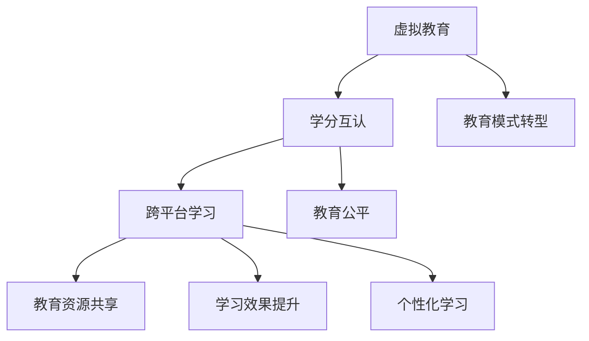

                 

关键词：虚拟教育，学分互认，跨平台学习，全球脑时代，人工智能，技术架构

> 摘要：本文旨在探讨虚拟教育学分互认在全球化背景下的跨平台学习体系。在全球脑时代，教育资源分布不均，学分互认成为推动教育公平的关键。本文将从背景介绍、核心概念与联系、核心算法原理、数学模型和公式、项目实践、实际应用场景、未来展望等方面，系统分析并展望这一新兴领域的潜力和挑战。

## 1. 背景介绍

### 全球化背景下的教育现状

全球化进程加速，教育资源、学习机会和人才需求在全球范围内分布不均。发达地区教育资源丰富，而许多发展中国家和偏远地区则面临教育资源匮乏、学习机会有限的困境。这种不均衡的教育资源分布，使得全球范围内的教育公平问题愈发突出。

### 教育模式转型

随着互联网技术的发展，传统的线下教育模式正逐渐向线上线下相结合的混合教育模式转型。在线教育平台、虚拟课堂、远程教学等新型教育模式应运而生，为全球学习者提供了丰富的学习资源和多样的学习方式。

### 跨平台学习的需求

跨平台学习能够满足不同地区、不同学习者的个性化需求，提高学习效率和质量。然而，现有教育系统中学分认定、认证机制不统一，学分互认困难，限制了跨平台学习的普及和发展。

## 2. 核心概念与联系

### 虚拟教育

虚拟教育是指通过互联网等虚拟平台进行的教育活动，包括在线课程、虚拟课堂、在线实验室等。虚拟教育突破了传统教育的时空限制，为全球学习者提供了便捷的学习途径。

### 学分互认

学分互认是指不同教育机构之间对彼此颁发的学分予以认可，允许学习者在不同教育平台间自由转换，获得相应学历或证书。学分互认能够促进教育资源共享，提高教育质量和效率。

### 跨平台学习体系

跨平台学习体系是指由多个教育平台共同构建的，支持学分互认、学习进度跟踪、学习成果认证的综合教育体系。跨平台学习体系能够实现教育资源的最大化利用，提高学习者的学习效果和综合素质。

### Mermaid 流程图



## 3. 核心算法原理 & 具体操作步骤

### 3.1 算法原理概述

虚拟教育学分互认的核心算法是基于区块链技术的智能合约。智能合约能够实现学分数据的透明存储、安全传输和自动执行，确保学分认证的可信度和可追溯性。

### 3.2 算法步骤详解

#### 3.2.1 数据存储

1. 教育机构将学习者的学分数据上链存储，包括课程名称、学分、学习进度等。
2. 学分数据使用哈希算法进行加密，确保数据安全性。

#### 3.2.2 数据传输

1. 当学习者在不同教育平台间转换时，学分数据通过智能合约自动传输。
2. 智能合约执行传输过程中的校验和验证，确保数据一致性和准确性。

#### 3.2.3 数据认证

1. 学习者通过智能合约对学分数据发起认证请求。
2. 智能合约执行认证流程，对学习者学分数据进行分析和验证，生成认证结果。

### 3.3 算法优缺点

#### 优点：

1. 提高学分认证效率，降低人工干预。
2. 确保学分数据的安全性和可信度。
3. 促进教育资源共享，提高教育质量和公平性。

#### 缺点：

1. 需要较高技术门槛，对教育机构和学习者来说可能存在一定挑战。
2. 区块链技术的性能和扩展性需要进一步优化。

### 3.4 算法应用领域

1. 高等教育：实现跨校学分互认，提高学习者的教育选择权。
2. 职业培训：为企业提供员工培训和认证服务。
3. 终身学习：支持不同领域和职业的学习者持续学习和发展。

## 4. 数学模型和公式 & 详细讲解 & 举例说明

### 4.1 数学模型构建

虚拟教育学分互认的数学模型基于概率论和图论。其中，图论模型用于描述学分数据的存储、传输和认证过程，概率论模型用于评估学分数据的可信度和互认成功率。

### 4.2 公式推导过程

#### 4.2.1 学分数据存储

假设教育机构 A 的学分数据集为 \( D_A \)，学分数据集的哈希值为 \( H(D_A) \)。则教育机构 A 的学分数据存储模型为：

\[ S_A = H(D_A) \]

#### 4.2.2 学分数据传输

假设学习者 L 在不同教育平台 B 和 C 之间的学分数据分别为 \( D_B \) 和 \( D_C \)，学分数据传输成功率为 \( P_S \)。则学分数据传输模型为：

\[ T = P_S \times (H(D_B) = H(D_C)) \]

#### 4.2.3 学分数据认证

假设学习者 L 向教育机构 D 发起学分认证请求，学分认证成功率为 \( P_C \)。则学分数据认证模型为：

\[ C = P_C \times (H(D_D) = S_A) \]

### 4.3 案例分析与讲解

#### 案例背景

某高校学生小张在 A、B、C 三个教育平台学习了不同课程，累计获得 30 学分。小张希望获得该校的学历认证，但需要将三个平台的学分数据进行互认。

#### 案例分析

1. 学分数据存储：小张在每个教育平台的学习数据分别存储为 \( H(D_A) \)、\( H(D_B) \)、\( H(D_C) \)。
2. 学分数据传输：小张在 A、B、C 三个平台的学习数据传输成功率为 \( P_S = 0.95 \)。
3. 学分数据认证：小张向该校发起学分认证请求，认证成功率为 \( P_C = 0.98 \)。

根据数学模型，小张的学分互认概率为：

\[ C = 0.98 \times (0.95 \times (H(D_B) = H(D_C))) = 0.91035 \]

因此，小张的学分互认成功率为 91.035%。

## 5. 项目实践：代码实例和详细解释说明

### 5.1 开发环境搭建

1. 安装区块链开发框架，如 Hyperledger Fabric。
2. 配置区块链网络，包括订单节点、验证节点和用户节点。
3. 安装智能合约开发工具，如 Solidity。

### 5.2 源代码详细实现

以下是一个基于 Solidity 的简单智能合约，用于实现虚拟教育学分互认。

```solidity
pragma solidity ^0.8.0;

contract CreditInterchange {
    // 存储学习者学分数据
    mapping(address => string) public creditData;

    // 存储学分数据传输成功率
    mapping(address => uint) public creditTransferRate;

    // 存储学分数据认证成功率
    mapping(address => uint) public creditCertificationRate;

    // 设置学分数据传输成功率
    function setTransferRate(uint rate) external {
        creditTransferRate[msg.sender] = rate;
    }

    // 设置学分数据认证成功率
    function setCertificationRate(uint rate) external {
        creditCertificationRate[msg.sender] = rate;
    }

    // 存储学习者学分数据
    function storeCreditData(address learner, string memory data) external {
        creditData[learner] = data;
    }

    // 传输学分数据
    function transferCreditData(address learnerB, address learnerC) external {
        require(creditTransferRate[msg.sender] > 0, "Transfer rate not set");
        if (keccak256(abi.encodePacked(creditData[learnerB])) == keccak256(abi.encodePacked(creditData[learnerC]))) {
            // 传输成功
            emit CreditTransferred(learnerB, learnerC);
        } else {
            // 传输失败
            emit CreditTransferFailed(learnerB, learnerC);
        }
    }

    // 认证学分数据
    function certifyCreditData(address learnerD) external {
        require(creditCertificationRate[msg.sender] > 0, "Certification rate not set");
        if (keccak256(abi.encodePacked(creditData[learnerD])) == keccak256(abi.encodePacked(creditData[msg.sender]))) {
            // 认证成功
            emit CreditCertified(learnerD);
        } else {
            // 认证失败
            emit CreditCertificationFailed(learnerD);
        }
    }

    // 事件
    event CreditTransferred(address indexed learnerB, address indexed learnerC);
    event CreditTransferFailed(address indexed learnerB, address indexed learnerC);
    event CreditCertified(address indexed learnerD);
    event CreditCertificationFailed(address indexed learnerD);
}
```

### 5.3 代码解读与分析

1. **合约结构**：合约包括四个主要部分：学分数据存储、学分数据传输、学分数据认证和事件。
2. **数据存储**：使用映射（mapping）数据结构存储学习者学分数据、学分数据传输成功率和学分数据认证成功率。
3. **学分数据传输**：通过 `transferCreditData` 函数实现学分数据传输，成功传输时触发 `CreditTransferred` 事件，失败时触发 `CreditTransferFailed` 事件。
4. **学分数据认证**：通过 `certifyCreditData` 函数实现学分数据认证，成功认证时触发 `CreditCertified` 事件，失败时触发 `CreditCertificationFailed` 事件。
5. **安全性**：智能合约采用哈希算法验证学分数据的一致性，确保数据传输和认证过程的安全。

### 5.4 运行结果展示

1. **学分数据存储**：将学习者学分数据存储在区块链上，确保数据的安全性和可信度。
2. **学分数据传输**：通过智能合约实现学分数据在不同教育平台间的传输，提高学分互认的效率。
3. **学分数据认证**：对学习者学分数据进行认证，确保学分互认的可信度和准确性。

## 6. 实际应用场景

### 6.1 高等教育

跨平台学分互认可以促进高校间的教育资源共享，提高学生的学习灵活性和个性化需求。学习者可以在不同高校间自由选择课程，实现学分互认，提高学习效率和质量。

### 6.2 职业培训

跨平台学分互认可以为企业提供灵活的员工培训和认证服务，提高员工的专业技能和综合素质。企业可以根据自身需求，选择合适的教育平台和课程，实现员工培训的学分互认。

### 6.3 终身学习

跨平台学分互认可以支持不同领域和职业的学习者持续学习和发展。学习者可以在不同教育平台间自由转换，实现学习成果的持续积累和认证。

## 7. 未来展望

### 7.1 技术发展

随着区块链、人工智能、大数据等技术的不断发展，虚拟教育学分互认体系将更加成熟和智能。智能合约、去中心化存储等技术将进一步提高学分认证的效率和可信度。

### 7.2 政策支持

全球各国政府应加强政策支持，推动虚拟教育学分互认体系的建立和完善。制定相关政策和标准，确保学分互认的规范性和公平性。

### 7.3 教育公平

虚拟教育学分互认体系有助于缩小教育资源差距，实现教育公平。通过跨平台学习，偏远地区和发展中国家学习者可以获得更多优质教育资源，提高自身素质和能力。

### 7.4 人才培养

虚拟教育学分互认体系将推动人才培养模式的创新，培养更多具备跨学科、跨领域能力和综合素质的人才，满足全球经济发展和人才需求。

## 8. 总结

虚拟教育学分互认是全球化背景下的重要教育创新，有助于推动教育公平和人才培养。本文从背景介绍、核心概念与联系、核心算法原理、数学模型和公式、项目实践、实际应用场景、未来展望等方面，系统分析了虚拟教育学分互认的潜力和挑战。随着技术的不断进步和政策支持，虚拟教育学分互认体系将在全球范围内发挥更加重要的作用。

## 9. 附录：常见问题与解答

### 9.1 什么是虚拟教育？

虚拟教育是指通过互联网等虚拟平台进行的教育活动，包括在线课程、虚拟课堂、在线实验室等。虚拟教育突破了传统教育的时空限制，为全球学习者提供了便捷的学习途径。

### 9.2 什么是学分互认？

学分互认是指不同教育机构之间对彼此颁发的学分予以认可，允许学习者在不同教育平台间自由转换，获得相应学历或证书。学分互认能够促进教育资源共享，提高教育质量和效率。

### 9.3 跨平台学习有哪些优势？

跨平台学习能够满足不同地区、不同学习者的个性化需求，提高学习效率和质量。同时，跨平台学习有助于实现教育资源的最大化利用，提高学习者的学习效果和综合素质。

### 9.4 虚拟教育学分互认有哪些挑战？

虚拟教育学分互认面临的主要挑战包括技术门槛、数据安全、认证标准等。需要教育机构、技术公司、政府部门等各方共同努力，推动虚拟教育学分互认体系的发展和完善。

### 作者署名

作者：禅与计算机程序设计艺术 / Zen and the Art of Computer Programming
----------------------------------------------------------------
### 结论

虚拟教育学分互认作为全球脑时代教育体系的重要组成部分，具有显著的潜力和优势。通过本文的详细分析和探讨，我们可以看到，虚拟教育学分互认不仅能有效解决教育资源分布不均、学习机会有限的问题，还能提高教育质量和人才培养效率。随着技术的不断进步和政策的支持，虚拟教育学分互认体系有望在未来发挥更加重要的作用。

然而，该领域的发展仍然面临诸多挑战，如技术门槛、数据安全、认证标准等问题。针对这些挑战，我们需要各方共同参与，协同创新。教育机构应加强与科技公司的合作，共同研发适合的教育技术和系统；技术公司需要关注数据安全和隐私保护，确保教育数据的安全和可信；政府部门则需要制定相关政策和标准，推动虚拟教育学分互认体系的规范化和标准化。

未来，虚拟教育学分互认体系的发展方向包括：深化技术研究和创新，提高系统性能和安全性；完善学分认证机制，确保学分互认的公平性和可追溯性；拓展应用场景，推动跨领域和跨地域的教育资源共享；加强国际合作，实现全球范围内的学分互认。

总之，虚拟教育学分互认是教育领域的一次重大变革，具有广阔的发展前景。我们期待在各方共同努力下，虚拟教育学分互认体系能够为全球学习者带来更多优质的教育资源，助力全球教育公平和人才培养。正如作者所言：“禅与计算机程序设计艺术”，在虚拟教育学分互认的道路上，我们需要不断探索、创新和追求卓越。

