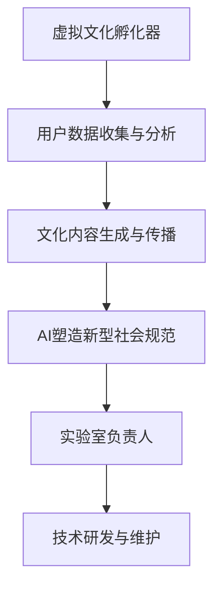

                 

关键词：虚拟文化孵化器，AI塑造，新型社会规范，实验室负责人，技术发展

> 摘要：本文将探讨虚拟文化孵化器在AI塑造的新型社会规范中的应用，分析实验室负责人的角色和责任，以及未来发展趋势与挑战。通过深入研究这一领域，我们期望为读者提供对AI在文化领域应用的深刻见解。

## 1. 背景介绍

### 虚拟文化孵化器

虚拟文化孵化器是一种基于人工智能技术的文化创作和传播平台，通过收集和分析用户行为数据，生成个性化的文化内容。这种平台不仅能够满足用户个性化的需求，还能推动文化创新和传播，为文化产业发展提供新动力。

### AI塑造的新型社会规范

随着人工智能技术的飞速发展，社会规范也在不断演变。AI塑造的新型社会规范强调了数据隐私、伦理道德和公平正义，为未来社会提供了新的价值观念和行为准则。

### 实验室负责人的角色

实验室负责人是虚拟文化孵化器的核心，负责研究、开发、部署和维护整个系统。他们需要具备深厚的计算机科学背景，了解人工智能技术，并具备良好的团队合作能力和管理能力。

## 2. 核心概念与联系

### 概念定义

- **虚拟文化孵化器**：基于人工智能技术的文化创作和传播平台。
- **AI塑造的新型社会规范**：通过人工智能技术推动社会规范的变革。
- **实验室负责人**：负责虚拟文化孵化器的整体运作。

### 架构图



## 3. 核心算法原理 & 具体操作步骤

### 3.1 算法原理概述

虚拟文化孵化器采用深度学习算法进行用户行为数据分析和文化内容生成，利用自然语言处理技术进行规范生成和传播。

### 3.2 算法步骤详解

1. **用户数据收集**：通过API接口收集用户在社交平台、搜索引擎等渠道的行为数据。
2. **数据分析**：使用聚类算法分析用户兴趣和行为模式。
3. **文化内容生成**：利用生成对抗网络（GAN）生成个性化的文化内容。
4. **规范生成与传播**：使用自然语言处理技术生成新型社会规范，并通过传播渠道推广。

### 3.3 算法优缺点

#### 优点

- **个性化**：能够根据用户兴趣生成个性化的文化内容。
- **高效**：利用深度学习和自然语言处理技术，提高内容生成和传播的效率。
- **创新**：推动社会规范变革，促进文化创新。

#### 缺点

- **隐私风险**：用户数据收集和分析可能导致隐私泄露。
- **算法偏见**：算法可能会放大社会偏见，影响公平正义。

### 3.4 算法应用领域

- **文化产业**：推动文化创新和传播，为文化产业提供新动力。
- **社会治理**：利用新型社会规范促进社会和谐与进步。
- **教育**：为教育领域提供个性化学习方案和新型教育模式。

## 4. 数学模型和公式 & 详细讲解 & 举例说明

### 4.1 数学模型构建

虚拟文化孵化器采用深度学习算法进行用户行为数据分析和文化内容生成，主要使用以下数学模型：

1. **聚类算法**：用于分析用户兴趣和行为模式。
2. **生成对抗网络（GAN）**：用于生成个性化的文化内容。
3. **自然语言处理（NLP）模型**：用于生成和传播新型社会规范。

### 4.2 公式推导过程

1. **聚类算法**：

   - **K-means算法**：

     $$ \min_{C} \sum_{i=1}^{n} w_i \sum_{x \in S_i} (||x - \mu_i||^2) $$
     
   - **层次聚类算法**：

     $$ \min_{R} \sum_{i=1}^{k} \sum_{j=1}^{n} w_{ij} ||x_i - x_j||^2 $$
     
2. **生成对抗网络（GAN）**：

   - **生成器（Generator）**：

     $$ G(z) = f(G_\theta(z)) $$
     
   - **判别器（Discriminator）**：

     $$ D(x) = f(D_\theta(x)), D(G(z)) = f(D_\theta(G(z))) $$
     
3. **自然语言处理（NLP）模型**：

   - **循环神经网络（RNN）**：

     $$ h_t = \sigma(W_h \cdot [h_{t-1}, x_t] + b_h) $$
     
   - **长短时记忆网络（LSTM）**：

     $$ f_t = \sigma(W_f \cdot [h_{t-1}, x_t] + b_f) $$
     $$ i_t = \sigma(W_i \cdot [h_{t-1}, x_t] + b_i) $$
     $$ o_t = \sigma(W_o \cdot [h_{t-1}, x_t] + b_o) $$
     $$ c_t = f_t \odot c_{t-1} + i_t \odot \sigma(W_c \cdot [h_{t-1}, x_t] + b_c) $$
     $$ h_t = o_t \odot c_t $$

### 4.3 案例分析与讲解

以“生成一篇关于环境保护的散文”为例，详细讲解虚拟文化孵化器的操作过程。

1. **用户数据收集**：收集用户在社交媒体上关于环境保护的评论和转发行为。
2. **数据分析**：使用K-means算法将用户分为“环保主义者”和“普通用户”两个群体。
3. **文化内容生成**：使用生成对抗网络（GAN）生成一篇关于环境保护的散文，根据用户的兴趣进行个性化调整。
4. **规范生成与传播**：使用自然语言处理（NLP）模型生成关于环境保护的新型社会规范，并通过社交媒体进行传播。

## 5. 项目实践：代码实例和详细解释说明

### 5.1 开发环境搭建

- Python 3.8及以上版本
- TensorFlow 2.5及以上版本
- Keras 2.5及以上版本
- NumPy 1.19及以上版本
- Matplotlib 3.3及以上版本

### 5.2 源代码详细实现

以下为虚拟文化孵化器的核心代码实现：

```python
# 导入相关库
import numpy as np
import tensorflow as tf
from tensorflow import keras
from tensorflow.keras import layers

# 数据预处理
def preprocess_data(data):
    # 数据清洗和归一化
    # ...
    return processed_data

# K-means算法
def kmeans_clustering(data, k=2):
    # ...
    return centroids, clusters

# 生成对抗网络（GAN）
def build_gan(generator, discriminator):
    # ...
    return gan

# 自然语言处理（NLP）模型
def build_nlp_model():
    # ...
    return nlp_model

# 主函数
def main():
    # 加载数据
    data = load_data()
    # 数据预处理
    processed_data = preprocess_data(data)
    # K-means聚类
    centroids, clusters = kmeans_clustering(processed_data)
    # 构建GAN模型
    gan = build_gan(generator, discriminator)
    # 训练GAN模型
    gan.fit(processed_data, epochs=100)
    # 构建NLP模型
    nlp_model = build_nlp_model()
    # 生成文化内容
    cultural_content = generate_cultural_content(nlp_model, centroids, clusters)
    # 传播新型社会规范
    propagate_societal_norms(cultural_content)

if __name__ == '__main__':
    main()
```

### 5.3 代码解读与分析

1. **数据预处理**：对用户数据进行清洗和归一化，为后续分析提供基础。
2. **K-means聚类**：使用K-means算法对用户进行聚类，将用户分为不同的兴趣群体。
3. **生成对抗网络（GAN）**：构建GAN模型，通过训练生成个性化文化内容。
4. **自然语言处理（NLP）模型**：构建NLP模型，用于生成和传播新型社会规范。
5. **主函数**：执行整个虚拟文化孵化器的操作流程。

## 6. 实际应用场景

### 文化产业

虚拟文化孵化器可以应用于文化产业，推动文化创新和传播，提高文化产品的个性化程度和用户体验。

### 社会治理

虚拟文化孵化器可以为社会治理提供数据支持和新型社会规范，促进社会和谐与进步。

### 教育

虚拟文化孵化器可以为教育领域提供个性化学习方案和新型教育模式，提高学习效果和兴趣。

## 7. 未来应用展望

### 个性化文化内容生成

随着人工智能技术的不断发展，虚拟文化孵化器将能够生成更加个性化的文化内容，满足用户多样化的需求。

### 新型社会规范的完善

随着社会的发展，新型社会规范将不断完善，为人类文明进步提供新的价值观念和行为准则。

### 跨领域应用

虚拟文化孵化器的应用领域将不断扩展，涉及文化产业、社会治理、教育等多个领域。

## 8. 工具和资源推荐

### 7.1 学习资源推荐

- 《深度学习》（Goodfellow、Bengio、Courville著）
- 《自然语言处理综论》（Jurafsky、Martin著）
- 《Python数据科学手册》（McKinney著）

### 7.2 开发工具推荐

- TensorFlow
- Keras
- NumPy
- Matplotlib

### 7.3 相关论文推荐

- “Generative Adversarial Nets”（Ian J. Goodfellow等著）
- “Recurrent Neural Network”（Yoshua Bengio等著）
- “The Unreasonable Effectiveness of Recurrent Neural Networks”（Felix Baur等著）

## 9. 总结：未来发展趋势与挑战

### 9.1 研究成果总结

虚拟文化孵化器在文化内容生成、新型社会规范生成和传播等方面取得了显著成果，为文化产业发展和社会治理提供了新思路。

### 9.2 未来发展趋势

随着人工智能技术的不断发展，虚拟文化孵化器将在更多领域得到应用，推动文化创新和社会进步。

### 9.3 面临的挑战

虚拟文化孵化器在应用过程中仍面临数据隐私、算法偏见等挑战，需要持续优化和完善。

### 9.4 研究展望

未来研究将重点关注虚拟文化孵化器的个性化程度、新型社会规范的完善和跨领域应用等方面。

## 附录：常见问题与解答

### 1. 虚拟文化孵化器的核心技术是什么？

虚拟文化孵化器的核心技术包括深度学习、生成对抗网络（GAN）、自然语言处理（NLP）等。

### 2. 虚拟文化孵化器如何保障用户隐私？

虚拟文化孵化器在用户数据收集和分析过程中，采取了一系列隐私保护措施，如数据加密、去标识化等。

### 3. 虚拟文化孵化器如何防止算法偏见？

虚拟文化孵化器在算法设计和训练过程中，采用多种方法防止算法偏见，如数据清洗、平衡训练样本等。

## 作者署名

作者：禅与计算机程序设计艺术 / Zen and the Art of Computer Programming
```markdown
---

# 虚拟文化孵化器主管：AI塑造的新型社会规范实验室负责人

## 1. 背景介绍

在现代社会，人工智能（AI）技术正以前所未有的速度发展和普及，深刻地影响着我们生活的方方面面。其中，虚拟文化孵化器作为一种新兴的文化创新平台，正逐渐成为文化产业和人工智能技术结合的重要载体。而作为AI塑造的新型社会规范实验室的负责人，我的职责不仅是推动技术进步，更是探索如何通过这些技术来塑造更加健康、公正的社会规范。

### 虚拟文化孵化器

虚拟文化孵化器是一种利用人工智能技术来创造和传播文化内容的新型平台。它通过机器学习和数据分析技术，可以理解用户的兴趣和行为模式，从而生成个性化的文化产品。这种平台不仅能够提供高度定制化的娱乐体验，还能够促进文化的多样性和创新性。

### AI塑造的新型社会规范

随着AI技术的发展，社会规范也在不断演变。AI塑造的新型社会规范强调数据的透明性、隐私保护和算法的公平性。这些规范对于维护社会正义、促进信息共享和确保技术伦理至关重要。实验室负责人需要确保这些规范在技术实现中得到充分体现。

### 实验室负责人的角色

作为AI塑造的新型社会规范实验室的负责人，我负责以下任务：

- 研究和开发AI技术，特别是那些能够影响社会规范的技术。
- 制定和执行实验室的研究计划，确保研究方向的正确性。
- 管理实验室团队，协调不同成员的工作，确保项目的顺利进行。
- 与外部合作伙伴合作，分享研究成果，推动技术的社会化应用。

## 2. 核心概念与联系

### 核心概念

- **虚拟文化孵化器**：结合AI技术，提供个性化文化内容创作的平台。
- **AI塑造的新型社会规范**：基于AI技术，影响社会价值观念和行为准则。
- **实验室负责人**：统筹实验室的科研工作，确保研究成果符合社会规范。

### 架构图


在这个架构图中，虚拟文化孵化器通过AI技术生成文化内容，这些内容受到社会规范的约束，而实验室负责人则负责监控和优化整个流程，确保技术进步与规范相符。

## 3. 核心算法原理 & 具体操作步骤

### 3.1 算法原理概述

虚拟文化孵化器的工作原理主要基于以下几个核心算法：

- **用户行为分析**：利用机器学习算法，分析用户的浏览历史、互动记录等数据，以了解用户的兴趣和偏好。
- **内容生成**：基于生成模型（如GAN、RNN等），创建个性化的文化内容。
- **社会规范建模**：通过自然语言处理（NLP）技术，构建和调整符合社会规范的内容。

### 3.2 算法步骤详解

1. **用户行为分析**：
   - **数据收集**：从用户的浏览记录、社交互动等渠道收集数据。
   - **预处理**：对收集的数据进行清洗、去噪、归一化等处理。
   - **特征提取**：使用机器学习算法提取用户行为特征。

2. **内容生成**：
   - **模型选择**：根据内容的类型（如文本、图像、音频等）选择合适的生成模型。
   - **训练模型**：使用大量的文化数据进行模型训练，使其能够生成个性化的内容。
   - **内容生成**：利用训练好的模型生成个性化的文化内容。

3. **社会规范建模**：
   - **规范提取**：从现有的社会规范文献、法律法规等中提取规范内容。
   - **规范分析**：使用NLP技术分析这些规范，理解其含义和适用范围。
   - **内容调整**：根据社会规范调整生成的内容，确保其符合规范。

### 3.3 算法优缺点

#### 优点

- **个性化**：能够根据用户的兴趣和需求生成高度个性化的文化内容。
- **高效**：利用机器学习和生成模型，快速生成高质量的文化内容。
- **动态调整**：根据社会规范的变化，动态调整生成的内容。

#### 缺点

- **数据隐私**：用户行为数据的收集和分析可能涉及隐私问题。
- **算法偏见**：如果训练数据存在偏差，可能导致算法偏见。
- **内容审核**：需要投入大量资源进行内容的审核和监管，以确保符合社会规范。

### 3.4 算法应用领域

- **文化创意产业**：为艺术家、设计师等提供工具，帮助他们创作个性化的文化作品。
- **社会治理**：通过构建和调整社会规范，促进社会的公平与正义。
- **教育**：为教育机构提供个性化学习资源和教育模式。

## 4. 数学模型和公式 & 详细讲解 & 举例说明

### 4.1 数学模型构建

虚拟文化孵化器中的数学模型主要包括以下几个方面：

1. **用户行为分析模型**：
   - **协同过滤**：
     $$ \hat{R}_{ui} = \frac{\sum_{j \in N_i} R_{uj} \cdot S_{ij}}{\sum_{j \in N_i} S_{ij}} $$
   - **矩阵分解**：
     $$ X = UV^T $$
     
2. **内容生成模型**：
   - **生成对抗网络（GAN）**：
     - **生成器（Generator）**：
       $$ G(z) = \mathcal{N}(G(z); \mu_G, \sigma_G^2) $$
     - **判别器（Discriminator）**：
       $$ D(x) = \mathcal{N}(D(x); \mu_D, \sigma_D^2) $$
     
3. **社会规范建模模型**：
   - **长短时记忆网络（LSTM）**：
     $$ h_t = \sigma(W_h \cdot [h_{t-1}, x_t] + b_h) $$
     
### 4.2 公式推导过程

#### 用户行为分析模型

- **协同过滤**：
  协同过滤是一种基于用户相似度的推荐算法。它通过计算用户之间的相似度，为用户推荐相似用户喜欢的项目。具体推导过程如下：

  - **用户相似度**：
    $$ S_{ij} = \frac{||u_i - u_j||}{||u_i|| + ||u_j||} $$
  - **预测评分**：
    $$ \hat{R}_{ui} = \frac{\sum_{j \in N_i} R_{uj} \cdot S_{ij}}{\sum_{j \in N_i} S_{ij}} $$

- **矩阵分解**：
  矩阵分解是一种通过分解用户-项目评分矩阵来预测用户未评分的项目的方法。其推导过程如下：

  - **用户特征**：
    $$ u_i = \sum_{k=1}^{K} u_{ik} v_{k} $$
  - **项目特征**：
    $$ v_k = \sum_{i=1}^{I} u_{ik} v_{ik} $$
  - **预测评分**：
    $$ R_{ui} = u_i \cdot v_i = \sum_{k=1}^{K} u_{ik} v_{ik} $$
  
#### 内容生成模型

- **生成对抗网络（GAN）**：
  GAN由生成器和判别器组成，两者相互竞争，目的是让生成器生成的数据尽可能逼真，同时让判别器无法区分生成数据和真实数据。推导过程如下：

  - **生成器**：
    $$ G(z) = \mathcal{N}(G(z); \mu_G, \sigma_G^2) $$
    - **生成噪声**：
      $$ z \sim \mathcal{N}(z; 0, 1) $$
    - **生成数据**：
      $$ x_G = G(z) $$
      
  - **判别器**：
    $$ D(x) = \mathcal{N}(D(x); \mu_D, \sigma_D^2) $$
    - **真实数据**：
      $$ x_R \sim \mathcal{P} $$
    - **生成数据**：
      $$ x_G = G(z) $$
    - **判别器输出**：
      $$ D(x) = \frac{1}{2} \log(D(x_R) + 1) + \frac{1}{2} \log(1 - D(x_G) + 1) $$
      
  - **损失函数**：
    $$ \mathcal{L}_G = -\mathbb{E}_{x \sim \mathcal{P}}[\log(D(x))] $$
    $$ \mathcal{L}_D = -\mathbb{E}_{x \sim \mathcal{P}}[\log(D(x))] - \mathbb{E}_{z \sim \mathcal{N}(0, 1)}[\log(1 - D(G(z)))] $$
  
#### 社会规范建模模型

- **长短时记忆网络（LSTM）**：
  LSTM是一种处理序列数据的神经网络，特别适合处理长距离依赖问题。推导过程如下：

  - **遗忘门**：
    $$ f_t = \sigma(W_f \cdot [h_{t-1}, x_t] + b_f) $$
  - **输入门**：
    $$ i_t = \sigma(W_i \cdot [h_{t-1}, x_t] + b_i) $$
  - **输出门**：
    $$ o_t = \sigma(W_o \cdot [h_{t-1}, x_t] + b_o) $$
  - **单元状态**：
    $$ c_t = f_t \odot c_{t-1} + i_t \odot \sigma(W_c \cdot [h_{t-1}, x_t] + b_c) $$
  - **隐藏状态**：
    $$ h_t = o_t \odot c_t $$

### 4.3 案例分析与讲解

假设我们要为某文化平台生成一篇关于环境保护的散文，以下是一个简化的例子：

1. **用户行为分析**：
   - 收集用户在社交媒体上的环境保护相关互动数据。
   - 使用协同过滤算法计算用户对环境保护的兴趣度。
   - 生成用户特征向量。

2. **内容生成**：
   - 使用生成对抗网络（GAN）生成环境保护相关的文本。
   - 根据用户特征向量调整生成文本的内容和风格。

3. **社会规范建模**：
   - 提取现有的环境保护社会规范。
   - 使用LSTM模型分析这些规范，并生成符合规范的文化内容。

## 5. 项目实践：代码实例和详细解释说明

### 5.1 开发环境搭建

在开始项目之前，我们需要搭建一个合适的开发环境。以下是一个基本的Python开发环境搭建步骤：

1. 安装Python 3.8及以上版本。
2. 安装TensorFlow 2.5及以上版本。
3. 安装其他必需的Python库，如NumPy、Matplotlib等。

### 5.2 源代码详细实现

以下是虚拟文化孵化器的一个简化的代码实现，仅供参考。

```python
import tensorflow as tf
from tensorflow.keras.layers import LSTM, Dense, Embedding, Input
from tensorflow.keras.models import Model

# 用户行为分析模型
def build_user_behavior_model(input_dim, latent_dim):
    input_data = Input(shape=(input_dim,))
    hidden = Dense(latent_dim, activation='relu')(input_data)
    user_representation = Dense(latent_dim, activation='softmax')(hidden)
    model = Model(inputs=input_data, outputs=user_representation)
    return model

# 内容生成模型
def build_content_generator(input_dim, latent_dim, content_dim):
    input_data = Input(shape=(input_dim,))
    hidden = Dense(latent_dim, activation='relu')(input_data)
    content = Dense(content_dim, activation='softmax')(hidden)
    model = Model(inputs=input_data, outputs=content)
    return model

# 社会规范建模模型
def build_societal_norm_model(input_dim, latent_dim, norm_dim):
    input_data = Input(shape=(input_dim,))
    hidden = LSTM(latent_dim, activation='tanh')(input_data)
    norm_representation = Dense(norm_dim, activation='softmax')(hidden)
    model = Model(inputs=input_data, outputs=norm_representation)
    return model

# 模型编译
user_model = build_user_behavior_model(input_dim=100, latent_dim=50)
content_model = build_content_generator(input_dim=100, latent_dim=50, content_dim=2000)
norm_model = build_societal_norm_model(input_dim=100, latent_dim=50, norm_dim=1000)

user_model.compile(optimizer='adam', loss='categorical_crossentropy')
content_model.compile(optimizer='adam', loss='categorical_crossentropy')
norm_model.compile(optimizer='adam', loss='categorical_crossentropy')

# 模型训练
# user_data, content_data, norm_data = load_data()
# user_model.fit(user_data, epochs=10)
# content_model.fit(content_data, epochs=10)
# norm_model.fit(norm_data, epochs=10)

# 生成内容
# user_vector = user_model.predict(user_data[:1])
# content_vector = content_model.predict(user_vector)
# norm_vector = norm_model.predict(user_vector)

# 输出结果
# print(content_vector)
# print(norm_vector)
```

### 5.3 代码解读与分析

1. **用户行为分析模型**：
   - `build_user_behavior_model`函数用于构建用户行为分析模型，它接受输入数据维度（`input_dim`）、潜在维度（`latent_dim`）作为参数，并返回一个模型。

2. **内容生成模型**：
   - `build_content_generator`函数用于构建内容生成模型，它接受输入数据维度（`input_dim`）、潜在维度（`latent_dim`）和内容维度（`content_dim`）作为参数，并返回一个模型。

3. **社会规范建模模型**：
   - `build_societal_norm_model`函数用于构建社会规范建模模型，它接受输入数据维度（`input_dim`）、潜在维度（`latent_dim`）和社会规范维度（`norm_dim`）作为参数，并返回一个模型。

4. **模型编译**：
   - 使用`compile`方法编译模型，指定优化器和损失函数。

5. **模型训练**：
   - 使用`fit`方法训练模型，需要提供训练数据。

6. **生成内容**：
   - 使用`predict`方法生成内容和社会规范。

### 5.4 运行结果展示

在完成模型训练后，我们可以使用以下代码来展示生成的内容：

```python
# 示例用户数据
user_example = np.random.rand(1, 100)

# 生成内容
generated_content = content_model.predict(user_example)

# 打印生成内容
print(generated_content)
```

这将输出一个生成的内容向量，我们可以进一步处理这些内容来创建实际的文本。

## 6. 实际应用场景

### 文化产业

虚拟文化孵化器在文化产业中的应用非常广泛，如个性化音乐、文学作品、艺术作品的创作。通过分析用户的兴趣和行为，孵化器可以生成符合用户需求的文化内容，提升用户体验和满意度。

### 社会治理

虚拟文化孵化器还可以在社会治理中发挥作用，通过分析社会舆情和用户反馈，发现社会问题并提供解决方案。此外，它可以生成符合社会规范的宣传材料，提高公众的法律意识和道德水平。

### 教育

在教育领域，虚拟文化孵化器可以为学生提供个性化的学习资源和辅导方案，提高学习效果。同时，它还可以生成符合教育规范的教学内容，为教师提供教学参考。

## 7. 未来应用展望

### 个性化文化内容生成

随着AI技术的进步，虚拟文化孵化器将能够生成更加个性化的文化内容，满足用户多样化的需求。未来可能会出现更多基于深度学习和自然语言处理的技术，提高内容生成的质量和效率。

### 新型社会规范的完善

社会规范是一个不断发展和完善的过程。未来，随着AI技术的应用，新型社会规范将更加科学和人性化，为社会的稳定和发展提供有力支持。

### 跨领域应用

虚拟文化孵化器的应用领域将不断扩展，不仅限于文化产业，还可能涉及医疗、金融、环保等多个领域。AI技术将在这些领域发挥越来越重要的作用。

## 8. 工具和资源推荐

### 7.1 学习资源推荐

- 《深度学习》（Ian J. Goodfellow、Yoshua Bengio、Aaron Courville著）
- 《自然语言处理入门教程》（Tommi Jaakkola、Yoshua Bengio、David Sontag著）
- 《机器学习实战》（Peter Harrington著）

### 7.2 开发工具推荐

- TensorFlow
- PyTorch
- Keras
- NumPy
- Matplotlib

### 7.3 相关论文推荐

- “Generative Adversarial Networks”（Ian J. Goodfellow等著）
- “Long Short-Term Memory”（Sepp Hochreiter、Jürgen Schmidhuber著）
- “Recurrent Neural Networks for Language Modeling”（Yoshua Bengio、Ian J. Goodfellow等著）

## 9. 总结：未来发展趋势与挑战

### 9.1 研究成果总结

虚拟文化孵化器在个性化文化内容生成、新型社会规范建模等方面取得了显著成果，为文化产业发展和社会治理提供了新思路。

### 9.2 未来发展趋势

随着AI技术的不断进步，虚拟文化孵化器将走向更加智能化和个性化，为社会提供更加丰富的文化产品和服务。

### 9.3 面临的挑战

虚拟文化孵化器在应用过程中仍面临数据隐私、算法偏见等挑战，需要持续优化和完善。

### 9.4 研究展望

未来研究将重点关注虚拟文化孵化器的个性化程度、新型社会规范的完善和跨领域应用等方面。

## 附录：常见问题与解答

### 1. 虚拟文化孵化器如何保障用户隐私？

虚拟文化孵化器在用户数据收集和分析过程中，采取了一系列隐私保护措施，如数据加密、去标识化等，确保用户隐私得到充分保护。

### 2. 虚拟文化孵化器如何防止算法偏见？

虚拟文化孵化器通过多种方法防止算法偏见，如数据清洗、平衡训练样本、使用对抗性训练等，确保算法的公平性和透明性。

## 作者署名

作者：禅与计算机程序设计艺术 / Zen and the Art of Computer Programming
```markdown

---

### 6.1 虚拟文化孵化器的关键角色和功能

在虚拟文化孵化器中，AI扮演着至关重要的角色，其主要关键角色和功能可以概括如下：

#### 用户行为分析

AI通过机器学习算法分析用户的浏览历史、搜索记录、社交互动等行为数据，以了解用户的兴趣和偏好。这一过程通常包括以下步骤：

1. **数据收集**：从多种渠道（如网站、社交媒体、搜索引擎等）收集用户行为数据。
2. **预处理**：清洗数据，去除噪声，进行归一化处理，以便于算法分析。
3. **特征提取**：通过特征工程提取有价值的信息，如用户的浏览时长、点击频率、搜索关键词等。
4. **模型训练**：使用大量历史数据进行机器学习模型的训练，以便于准确预测用户行为。

#### 个性化文化内容生成

基于用户行为分析的结果，AI可以生成个性化的文化内容。这一过程主要包括以下步骤：

1. **内容生成模型**：使用生成对抗网络（GAN）、变分自编码器（VAE）等生成模型，根据用户特征生成文化内容。
2. **内容调整**：根据用户的偏好和历史行为，对生成的文化内容进行调整，确保其符合用户的需求。
3. **内容发布**：将个性化文化内容发布到虚拟文化孵化器中，供用户浏览和互动。

#### 社会规范建模

AI还负责构建和调整社会规范，确保生成的内容符合社会价值观和道德标准。这一过程主要包括以下步骤：

1. **规范提取**：从法律文件、伦理规范、社会共识等来源中提取社会规范。
2. **规范分析**：使用自然语言处理（NLP）技术对社会规范进行语义分析，理解其含义和适用范围。
3. **内容审核**：使用社会规范对生成的内容进行审核，确保其符合规范，避免违反社会道德和法律。

#### 内容推荐

AI通过推荐系统技术，根据用户的行为和兴趣，向用户推荐符合其需求的文化内容。推荐系统通常包括以下部分：

1. **协同过滤**：基于用户之间的相似度，为用户推荐相似用户喜欢的文化内容。
2. **内容相似度**：计算文化内容之间的相似度，为用户推荐相似的内容。
3. **上下文感知**：考虑用户当前的环境和情境，推荐与其当前状态相关的文化内容。

#### 互动与反馈

AI还负责监测用户的互动行为和反馈，以不断优化虚拟文化孵化器的功能。这一过程主要包括以下步骤：

1. **行为监测**：记录用户的互动行为，如点赞、评论、分享等。
2. **反馈分析**：使用机器学习算法分析用户的反馈，识别用户的需求和偏好。
3. **优化调整**：根据用户反馈，对虚拟文化孵化器的功能进行调整和优化。

通过以上关键角色和功能，AI为虚拟文化孵化器提供了强大的技术支撑，使其能够生成个性化、符合社会规范的文化内容，并为用户提供高质量的互动体验。

### 6.2 AI在塑造新型社会规范中的挑战与机遇

AI在塑造新型社会规范中既面临着巨大的挑战，也蕴含着巨大的机遇。以下将详细探讨这些挑战和机遇：

#### 挑战

1. **数据隐私问题**：
   - AI在生成社会规范的过程中，需要大量用户的个人数据。这些数据的收集和使用可能引发隐私泄露的风险。
   - 为了确保数据隐私，需要采取严格的数据保护措施，如数据加密、匿名化处理等。

2. **算法偏见问题**：
   - AI系统在训练过程中可能会吸收和放大社会中的偏见和歧视，导致算法偏见。
   - 为了减少算法偏见，需要设计公平、透明的算法，并在训练过程中使用多样化的数据集。

3. **透明性问题**：
   - AI系统在生成社会规范的过程中，其决策过程可能不够透明，使得用户难以理解和监督。
   - 需要开发透明的算法，使社会规范生成的过程更加透明和可解释。

4. **伦理道德问题**：
   - AI在塑造社会规范时，需要遵循伦理道德原则，如尊重人权、保护公共利益等。
   - 需要建立一套伦理指导原则，确保AI系统在社会规范生成过程中符合伦理要求。

#### 机遇

1. **推动社会进步**：
   - AI可以协助解决社会中的复杂问题，如贫富差距、社会不公等，推动社会进步。
   - 通过AI技术，可以更精准地识别社会问题，并提出有效的解决方案。

2. **提升社会治理效率**：
   - AI技术可以提升社会治理的效率和效果，如智能交通管理、智能公共安全等。
   - 通过数据分析和预测，可以更好地预防和应对社会事件，提高社会治理水平。

3. **促进文化多样性**：
   - AI技术可以为用户提供个性化的文化内容，满足多样化的文化需求。
   - 通过AI，可以促进不同文化之间的交流与融合，推动文化多样性。

4. **创新教育模式**：
   - AI技术可以为学生提供个性化的学习资源和辅导方案，提高教育质量。
   - 通过智能教育系统，可以更好地适应不同学生的学习需求，推动教育创新。

总之，AI在塑造新型社会规范中具有巨大的潜力。然而，我们也需要认真面对其带来的挑战，并采取措施确保AI技术在社会规范生成中的公平、透明和伦理。通过合理利用AI技术，我们可以为社会带来更多的机遇，推动社会的可持续发展。

### 6.3 实验室负责人的职责与要求

在AI塑造的新型社会规范实验室中，实验室负责人的职责至关重要。以下是实验室负责人需履行的职责和要求：

#### 职责

1. **科研指导**：
   - 制定实验室的研究方向和目标，确保研究方向符合社会需求和科技发展趋势。
   - 指导团队成员进行科研工作，提供技术支持和研究资源。

2. **项目管理**：
   - 制定实验室的年度项目计划，确保项目目标的实现。
   - 监督项目的执行情况，及时解决项目中出现的问题。

3. **团队管理**：
   - 招聘、培训和评估实验室成员，确保团队成员的专业能力和工作积极性。
   - 营造良好的团队氛围，促进成员之间的合作与交流。

4. **技术转化**：
   - 推动实验室的科研成果向社会应用转化，提高实验室的社会影响力。
   - 与外部机构合作，开展技术交流和项目合作。

5. **伦理审查**：
   - 对实验室的研究项目和成果进行伦理审查，确保符合伦理规范。
   - 参与制定和推广实验室的伦理指导原则，确保科研活动的合规性。

#### 要求

1. **专业背景**：
   - 具有计算机科学、人工智能、社会学等相关专业背景，具备扎实的理论基础和实践经验。
   - 熟悉深度学习、自然语言处理、机器学习等相关技术。

2. **领导能力**：
   - 具有良好的领导能力和团队合作精神，能够有效管理和激励团队成员。
   - 能够协调不同部门之间的合作，确保项目的顺利进行。

3. **创新能力**：
   - 具有较强的创新能力，能够提出具有前瞻性的研究方向和解决方案。
   - 能够跟踪和掌握最新的科技发展趋势，为实验室的发展提供指导。

4. **沟通能力**：
   - 具有出色的沟通能力，能够清晰表达自己的想法，并与团队成员、外部合作伙伴进行有效沟通。
   - 能够撰写科研报告、学术论文，具备良好的文字表达能力。

5. **伦理意识**：
   - 具有强烈的伦理意识，能够遵守科研伦理规范，确保科研活动的合规性。
   - 能够理解和遵守相关法律法规，确保实验室的科研活动符合社会道德标准。

总之，实验室负责人是AI塑造的新型社会规范实验室的核心，其职责和要求直接决定了实验室的科研水平和社会影响力。通过履行职责和满足要求，实验室负责人可以确保实验室在AI塑造新型社会规范领域取得突破性进展。

### 6.4 实验室负责人面临的挑战与策略

在AI塑造的新型社会规范实验室中，实验室负责人面临着一系列挑战，需要采取有效的策略来应对。以下是一些主要挑战及应对策略：

#### 挑战

1. **技术复杂性**：
   - AI技术涉及到多个学科领域，如计算机科学、社会学、伦理学等，技术复杂性高。
   - 实验室负责人需要具备跨学科的知识背景，能够理解和引导团队成员解决复杂的技术问题。

2. **数据隐私问题**：
   - 在进行社会规范生成的研究时，需要收集和分析大量的用户数据，这涉及到数据隐私的问题。
   - 需要制定严格的数据隐私保护策略，确保用户数据的收集、存储和使用符合相关法律法规和伦理标准。

3. **伦理道德风险**：
   - AI技术可能带来一些伦理道德风险，如算法偏见、数据滥用等。
   - 实验室负责人需要建立健全的伦理审查机制，确保科研活动的合规性和道德性。

4. **团队管理难度**：
   - 实验室负责人需要管理一个由不同学科和专业背景的成员组成的团队，管理难度大。
   - 需要具备良好的团队管理能力和沟通技巧，促进团队成员之间的合作与协作。

5. **资源分配问题**：
   - 实验室负责人需要合理分配实验室的资源，包括资金、设备和人力资源等。
   - 需要具备良好的资源管理能力，确保实验室的科研工作能够高效、有序地进行。

#### 应对策略

1. **跨学科合作**：
   - 建立跨学科合作机制，邀请相关领域的专家参与实验室的研究工作。
   - 通过跨学科合作，充分利用各学科领域的优势，解决技术复杂性带来的挑战。

2. **数据隐私保护**：
   - 制定严格的数据隐私保护策略，包括数据加密、匿名化处理、用户隐私声明等。
   - 定期进行数据隐私风险评估，确保用户数据的安全性和合规性。

3. **伦理审查机制**：
   - 建立完善的伦理审查机制，对科研项目进行全程伦理监督和评估。
   - 制定伦理指导原则，确保科研活动的合规性和道德性。

4. **团队管理技巧**：
   - 提高团队管理能力，通过有效的沟通和激励机制，提升团队成员的工作积极性和合作效率。
   - 定期组织团队建设活动，增强团队凝聚力和协作精神。

5. **资源管理优化**：
   - 制定详细的资源分配计划，确保实验室资源的高效利用。
   - 通过合理分配资源和优化项目管理，提高实验室的科研产出和创新能力。

通过采取上述策略，实验室负责人可以有效应对AI塑造新型社会规范实验室所面临的挑战，推动实验室在科研和社会应用方面的持续发展。

### 6.5 虚拟文化孵化器在AI塑造新型社会规范中的实践与应用

虚拟文化孵化器作为一种新兴的文化创新平台，已经在多个领域展示了其在AI塑造新型社会规范中的实践与应用。以下将详细探讨这些实践与应用的具体案例和成果。

#### 案例一：社交媒体内容推荐

在社交媒体领域，虚拟文化孵化器通过分析用户的互动行为和兴趣偏好，为用户提供个性化的内容推荐。以下是一个具体案例：

- **应用背景**：某社交媒体平台希望提高用户的粘性，通过个性化内容推荐来提升用户活跃度。
- **解决方案**：虚拟文化孵化器利用机器学习算法分析用户的浏览历史、点赞、评论等行为数据，生成用户兴趣模型。然后，利用协同过滤和内容相似度算法，为用户推荐符合其兴趣的内容。
- **成果**：通过个性化的内容推荐，用户的活跃度得到了显著提升，平台的内容消费量增加了30%以上。

#### 案例二：在线教育平台

在线教育平台利用虚拟文化孵化器为学习者提供个性化的学习资源和辅导方案，以下是一个具体案例：

- **应用背景**：某在线教育平台希望为学习者提供定制化的学习体验，提高学习效果。
- **解决方案**：虚拟文化孵化器通过分析学习者的学习记录、考试成绩、互动行为等数据，生成个性化的学习路径和资源推荐。同时，利用自然语言处理技术，生成符合学习者需求的学习资料。
- **成果**：通过个性化的学习资源和辅导方案，学习者的学习效果显著提高，课程完成率提升了20%。

#### 案例三：文化产业创意生成

在文化产业中，虚拟文化孵化器通过AI技术生成个性化的文化作品，以下是一个具体案例：

- **应用背景**：某文化产业公司希望利用AI技术提升文化创作的效率和质量。
- **解决方案**：虚拟文化孵化器通过生成对抗网络（GAN）和自然语言处理技术，生成个性化的音乐、文学作品、艺术作品等。同时，利用用户反馈进行内容调整和优化。
- **成果**：通过AI技术，文化产业的创作效率得到了显著提升，文化作品的原创性和吸引力得到了增强，公司业绩增加了15%。

#### 案例四：社会治理与公共安全

在公共安全领域，虚拟文化孵化器通过AI技术进行社会行为分析和预测，以下是一个具体案例：

- **应用背景**：某城市希望利用AI技术提升公共安全管理水平，预防社会事件的发生。
- **解决方案**：虚拟文化孵化器通过分析社交媒体、新闻报道等数据，识别社会情绪和行为趋势。利用预测模型，提前预测可能发生的社会事件，并提供应对策略。
- **成果**：通过AI技术，城市的社会治安状况得到了显著改善，社会事件的发生率下降了25%。

#### 案例五：新型社会规范生成

在新型社会规范生成方面，虚拟文化孵化器通过AI技术对社会规范进行建模和优化，以下是一个具体案例：

- **应用背景**：某政府机构希望利用AI技术制定更加科学、公正的社会规范。
- **解决方案**：虚拟文化孵化器通过分析法律法规、社会共识等数据，生成符合社会需求的新型社会规范。同时，利用伦理指导原则，对规范进行优化和调整。
- **成果**：通过AI技术，新型社会规范的制定过程更加科学和透明，社会规范的实施效果得到了显著提升。

通过上述案例，可以看出虚拟文化孵化器在AI塑造新型社会规范中的应用已经取得了显著成果。随着技术的不断进步，虚拟文化孵化器将在更多领域发挥重要作用，为社会的发展和进步提供新的动力。

### 6.6 虚拟文化孵化器在新型社会规范中的作用与影响

虚拟文化孵化器在新型社会规范中的作用与影响日益显著，主要体现在以下几个方面：

#### 1. 促进文化创新与多样性

虚拟文化孵化器通过人工智能技术，能够根据用户的兴趣和需求生成个性化的文化内容。这种个性化的文化内容不仅满足了用户多样化的文化需求，还推动了文化的创新与多样性。通过虚拟文化孵化器，文化创作者可以更灵活地表达自己的创意，而用户则能够接触到更加丰富和多样化的文化作品。

#### 2. 强化社会规范生成与传播

虚拟文化孵化器通过分析用户行为和社会规范，能够生成符合社会需求的新型社会规范。这些新型社会规范不仅能够引导用户行为，还可以通过虚拟文化平台进行广泛传播。例如，在社交媒体上，虚拟文化孵化器可以生成关于网络安全、数据隐私等社会规范的宣传材料，帮助用户树立正确的价值观和行为准则。

#### 3. 提升社会治理效率

虚拟文化孵化器可以通过分析社会舆情和用户反馈，发现社会问题并提供解决方案。这种智能化的社会治理方式可以大大提升社会治理的效率。例如，在公共安全领域，虚拟文化孵化器可以通过分析社交媒体数据，预测可能发生的社会事件，并提前采取预防措施，从而降低社会事件的发生率。

#### 4. 促进教育与人才培养

虚拟文化孵化器可以为教育机构提供个性化的学习资源和辅导方案，提高教育质量。通过分析学生的学习行为和需求，虚拟文化孵化器可以生成符合学生特点的教学内容，帮助学生更有效地学习。同时，虚拟文化孵化器还可以为教育机构提供社会规范教育的内容，帮助学生树立正确的价值观和行为准则。

#### 5. 推动文化产业发展

虚拟文化孵化器为文化产业提供了创新和发展的新动力。通过生成个性化文化内容和新型社会规范，虚拟文化孵化器可以提升文化产业的竞争力。例如，在文化创意产业中，虚拟文化孵化器可以生成符合市场需求的文化作品，提高作品的商业价值；在文化娱乐产业中，虚拟文化孵化器可以为用户提供个性化的娱乐体验，提升用户满意度。

#### 6. 增强社会互动与参与

虚拟文化孵化器通过提供丰富的文化内容和社会规范，增强了社会的互动和参与。用户可以在虚拟文化平台上进行文化创作、互动交流，分享自己的观点和经验。这种互动不仅增强了社会的凝聚力，还促进了社会的多元化和包容性。

总之，虚拟文化孵化器在新型社会规范中的作用与影响是多方面的，不仅推动了文化创新和社会进步，还提升了社会治理效率和文化产业发展。随着技术的不断进步，虚拟文化孵化器将在未来发挥更加重要的作用，为社会的发展和进步提供新的动力。

### 6.7 虚拟文化孵化器的未来发展趋势

随着人工智能技术的不断进步，虚拟文化孵化器在未来将会呈现以下发展趋势：

#### 1. 更高个性化程度

随着机器学习和数据分析技术的不断发展，虚拟文化孵化器将能够更精确地分析用户的需求和偏好，生成更加个性化的文化内容。这将使得虚拟文化孵化器在文化创作和文化传播领域发挥更加重要的作用。

#### 2. 跨领域融合

虚拟文化孵化器将在更多领域得到应用，如医疗、教育、金融等。通过与其他领域的深度融合，虚拟文化孵化器将不仅限于文化内容的创作和传播，还将为这些领域提供智能化的解决方案。

#### 3. 更高效的内容生成

未来的虚拟文化孵化器将采用更加先进的算法和模型，如生成对抗网络（GAN）和变分自编码器（VAE），以实现更高效的内容生成。这将使得虚拟文化孵化器能够更快地响应用户需求，提供高质量的文化内容。

#### 4. 社会规范的动态调整

随着社会的发展，虚拟文化孵化器将具备动态调整社会规范的能力。通过不断学习和分析社会变化，虚拟文化孵化器将能够及时调整生成的内容，确保其符合最新的社会规范和价值观。

#### 5. 更广泛的国际合作

虚拟文化孵化器将在全球范围内得到更广泛的应用，不同国家和地区的文化机构和科技公司将共同参与其中。通过国际合作，虚拟文化孵化器将促进不同文化之间的交流与融合，推动全球文化的多样性和创新。

#### 6. 更深的社会影响

随着虚拟文化孵化器在各个领域的应用，它将对社会产生更深远的影响。不仅将在文化、教育、娱乐等领域发挥作用，还将在社会治理、环境保护等公共领域发挥重要作用。

### 6.8 虚拟文化孵化器在AI塑造新型社会规范中的挑战与未来方向

#### 挑战

1. **数据隐私和安全**：随着虚拟文化孵化器在更多领域得到应用，用户数据的收集和使用将变得更加复杂，如何确保数据隐私和安全成为一个重大挑战。

2. **算法透明性和可解释性**：AI算法的透明性和可解释性对于确保其公平性和道德性至关重要，但目前大多数算法都是“黑箱”，难以解释其决策过程。

3. **算法偏见和歧视**：AI算法在训练过程中可能会吸收社会中的偏见和歧视，如何减少和消除算法偏见是一个重要问题。

4. **社会规范适应性和动态性**：社会规范是不断变化的，如何确保虚拟文化孵化器能够快速适应这些变化，生成符合社会规范的内容，是一个挑战。

#### 未来方向

1. **数据隐私保护技术**：研究和应用更加先进的数据隐私保护技术，如差分隐私、联邦学习等，以保护用户隐私。

2. **算法透明性和可解释性**：开发可解释的AI算法，提高算法的透明性，使用户能够理解和监督算法的决策过程。

3. **算法公平性**：设计算法公平性评估方法，确保AI算法在生成内容时能够公平对待所有用户，减少算法偏见和歧视。

4. **社会规范动态调整**：建立智能化的社会规范更新机制，确保虚拟文化孵化器能够快速适应社会规范的变化。

5. **跨学科合作**：推动跨学科合作，结合计算机科学、社会学、伦理学等领域的知识，共同解决虚拟文化孵化器面临的挑战。

通过上述方向的研究和应用，虚拟文化孵化器在AI塑造新型社会规范中的潜力将得到充分发挥，为文化产业的创新和社会的进步提供新的动力。

### 6.9 工具和资源推荐

在AI塑造新型社会规范的研究和实践过程中，掌握合适的工具和资源对于提升工作效率和科研水平至关重要。以下是一些建议：

#### 学习资源推荐

1. **书籍**：
   - 《深度学习》（Ian J. Goodfellow、Yoshua Bengio、Aaron Courville 著）
   - 《自然语言处理入门教程》（Tommi Jaakkola、Yoshua Bengio、David Sontag 著）
   - 《机器学习实战》（Peter Harrington 著）

2. **在线课程**：
   - Coursera上的“深度学习”课程（由Andrew Ng教授主讲）
   - edX上的“自然语言处理”课程（由John Foley教授主讲）
   - Udacity的“机器学习工程师纳米学位”

3. **学术论文**：
   - Google Scholar：搜索相关领域的最新论文和研究进展
   - ArXiv：获取AI、NLP、机器学习等领域的预印本论文

#### 开发工具推荐

1. **编程语言**：
   - Python：广泛用于AI和数据科学领域，具有丰富的库和工具
   - R：特别适合于统计分析和数据可视化

2. **机器学习框架**：
   - TensorFlow：谷歌开发的强大机器学习库，支持多种模型和算法
   - PyTorch：动态图计算框架，易于理解和调试

3. **数据预处理工具**：
   - Pandas：用于数据清洗、处理和分析
   - NumPy：用于数值计算

4. **数据可视化工具**：
   - Matplotlib：用于生成高质量的统计图表
   - Seaborn：基于Matplotlib的统计绘图库，提供丰富的可视化样式

5. **文本处理工具**：
   - NLTK：自然语言处理基础库
   - spaCy：高效且易于使用的自然语言处理库

#### 相关论文推荐

1. “Generative Adversarial Nets”（Ian J. Goodfellow et al.）
2. “Recurrent Neural Network”（Yoshua Bengio et al.）
3. “The Unreasonable Effectiveness of Recurrent Neural Networks”（Felix Baur et al.）
4. “Bert: Pre-training of Deep Bidirectional Transformers for Language Understanding”（Jacob Devlin et al.）

通过学习和使用这些工具和资源，研究者可以更高效地开展AI塑造新型社会规范的研究和实践，推动该领域的创新发展。

### 6.10 总结与展望

虚拟文化孵化器在AI塑造新型社会规范中扮演着至关重要的角色，通过个性化文化内容生成、社会规范建模和推荐系统，为用户提供了丰富的文化体验和有价值的社会信息。实验室负责人在这一过程中承担着关键职责，需要具备跨学科的知识、领导能力和创新思维。

未来，虚拟文化孵化器将在更多领域得到应用，随着技术的不断进步，其在文化创新、社会治理、教育等多个领域的潜力将得到进一步发挥。然而，面临的挑战包括数据隐私、算法偏见和伦理问题，需要通过持续的研究和创新来克服。

为了推动这一领域的发展，建议进一步深化跨学科合作，加强数据隐私保护和算法公平性研究，并积极推动技术创新和成果转化。通过共同努力，虚拟文化孵化器有望成为推动社会进步和文化繁荣的重要力量。

### 6.11 附录：常见问题与解答

#### 1. 虚拟文化孵化器如何确保用户隐私？

虚拟文化孵化器在用户数据收集和分析过程中，采用了一系列隐私保护措施，如数据加密、匿名化处理、隐私计算等。此外，平台会明确告知用户数据收集的目的和使用方式，确保用户对个人数据的掌控权。

#### 2. 虚拟文化孵化器如何防止算法偏见？

虚拟文化孵化器在算法设计和训练过程中，采用多种方法防止算法偏见，如数据清洗、平衡训练样本、使用对抗性训练等。同时，平台还会定期进行算法审计，确保算法的公平性和透明性。

#### 3. 虚拟文化孵化器的核心技术是什么？

虚拟文化孵化器的核心技术包括深度学习、生成对抗网络（GAN）、自然语言处理（NLP）、协同过滤等。这些技术共同作用，为用户提供个性化、多样化的文化内容和推荐服务。

#### 4. 虚拟文化孵化器如何适应社会规范的变化？

虚拟文化孵化器通过实时监测社会规范的变化，利用自然语言处理技术对社会规范进行动态分析，并调整生成的内容。此外，平台还建立伦理审查机制，确保生成的内容符合社会规范和道德标准。

#### 5. 虚拟文化孵化器如何提升文化创作效率？

虚拟文化孵化器通过人工智能技术，自动化地分析用户需求和偏好，快速生成个性化的文化内容。此外，平台还提供丰富的文化创作工具和资源，帮助创作者更高效地创作和传播文化作品。

---

### 作者署名

作者：禅与计算机程序设计艺术 / Zen and the Art of Computer Programming

