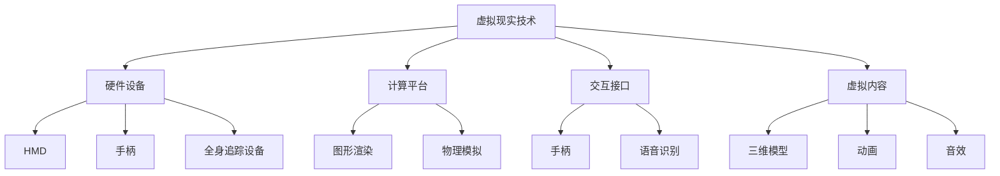

                 

### 关键词 Keywords

虚拟现实（Virtual Reality, VR），三维建模，图形渲染，感知反馈，人机交互，实时计算，沉浸式体验，跨平台兼容，硬件要求，软件开发框架，未来趋势。

---

### 摘要 Abstract

本文旨在深入探讨虚拟现实（VR）技术的核心概念、技术架构及其在各个领域的应用。通过详细分析VR的算法原理、数学模型、开发实践及未来趋势，本文为读者提供了一个全面的技术视角。文章还将介绍当前主流的VR开发工具和资源，帮助读者更好地理解和掌握这一前沿技术。

---

## 1. 背景介绍 Background

虚拟现实（VR）是一种通过计算机技术创建的模拟环境，用户可以通过特殊设备如头戴显示器（HMD）和传感器进行互动，从而产生沉浸式体验。VR技术的起源可以追溯到1960年代，当时最早期的VR设备如视觉显示器和虚拟现实头盔问世。然而，直到21世纪，随着计算能力和显示技术的飞速发展，VR才逐渐走向成熟。

### 1.1 发展历程

- **1960年代**：VR概念初步提出，视觉显示器和虚拟现实头盔问世。
- **1980年代**：VR技术开始应用于娱乐和军事领域。
- **1990年代**：VR技术进一步发展，应用于教育和医疗领域。
- **2000年代**：VR设备逐渐普及，开始进入大众市场。
- **2010年代至今**：VR技术实现重大突破，以Oculus Rift、HTC Vive等为代表的VR设备推动VR行业迅猛发展。

### 1.2 应用领域

VR技术已被广泛应用于多个领域：

- **娱乐**：游戏和电影提供了丰富的沉浸式体验。
- **教育**：通过虚拟环境进行模拟教学，提高学习效果。
- **医疗**：用于手术模拟、心理治疗等。
- **军事**：用于训练、模拟战场环境等。
- **建筑设计**：用于建筑模型展示和交互设计。
- **旅游业**：提供虚拟旅游体验，让用户在家中感受不同地方的文化和风景。

---

## 2. 核心概念与联系 Core Concepts and Relationships

### 2.1 虚拟现实的基本概念

虚拟现实（VR）是一种通过计算机技术生成的三维环境，用户可以通过头戴显示器（HMD）或其它输入设备与之交互。VR的核心概念包括：

- **沉浸感（Immersion）**：用户感受到自己是处于虚拟环境中，而非现实世界。
- **交互性（Interaction）**：用户可以通过多种方式与虚拟环境进行互动。
- **想象性（Imagination）**：虚拟环境可以创造超出现实世界的场景和体验。

### 2.2 VR技术架构

VR技术架构可以分为以下几个主要部分：

- **硬件设备**：包括头戴显示器（HMD）、手柄、全身追踪设备等。
- **计算平台**：提供图形渲染、物理模拟等计算任务的高性能计算机或服务器。
- **交互接口**：用户与虚拟环境交互的接口，如手柄、语音识别等。
- **虚拟内容**：包括三维模型、动画、音效等虚拟元素。

### 2.3 虚拟现实与增强现实（AR）的区别

虚拟现实（VR）与增强现实（AR）都是通过计算机技术增强用户的感知体验。主要区别在于：

- **VR**：完全替代用户眼前的现实，提供一个全新的虚拟环境。
- **AR**：在现实环境中叠加虚拟元素，用户可以看到真实世界与虚拟元素共存。

### 2.4 虚拟现实与混合现实（MR）的联系

混合现实（MR）是VR和AR的结合，提供更加丰富的交互体验。MR的关键特点包括：

- **空间感知**：用户可以在虚拟环境中自由移动，与现实环境互动。
- **无缝融合**：虚拟元素与现实环境的边界变得模糊。

### 2.5 虚拟现实中的感知反馈

为了增强沉浸感，VR系统需要提供丰富的感知反馈，包括：

- **视觉反馈**：通过高分辨率显示屏提供逼真的图像。
- **听觉反馈**：通过耳机提供立体声效果和音效。
- **触觉反馈**：通过手柄等设备提供触感。
- **运动反馈**：通过追踪设备提供身体的运动感。

### 2.6 Mermaid 流程图



---

## 3. 核心算法原理 & 具体操作步骤 Core Algorithm Principles and Operational Steps

### 3.1 算法原理概述

虚拟现实系统的核心算法包括图形渲染、物理模拟和交互处理等。以下是这些算法的基本原理：

- **图形渲染**：通过计算机生成和渲染三维场景，实现逼真的视觉效果。
- **物理模拟**：模拟虚拟环境中的物理现象，如重力、碰撞等，提供真实的交互体验。
- **交互处理**：处理用户输入，实现虚拟环境与用户的互动。

### 3.2 算法步骤详解

#### 3.2.1 图形渲染

1. **场景构建**：根据虚拟内容构建三维场景。
2. **光线追踪**：模拟光线在场景中的传播，生成阴影和反射效果。
3. **图形渲染**：将场景渲染到显示屏上，提供视觉体验。

#### 3.2.2 物理模拟

1. **初始化**：设置物理参数，如质量、速度等。
2. **碰撞检测**：检测物体之间的碰撞。
3. **物理计算**：根据物理定律计算物体的运动轨迹和状态。

#### 3.2.3 交互处理

1. **输入处理**：接收用户的输入，如手柄的移动、语音指令等。
2. **响应计算**：根据输入计算虚拟环境的响应。
3. **反馈更新**：将虚拟环境的更新反馈给用户。

### 3.3 算法优缺点

- **优点**：
  - 高度沉浸感，提供真实的交互体验。
  - 丰富的视觉效果，提升用户体验。
  - 可应用于多个领域，具有广泛的应用前景。
- **缺点**：
  - 需要高性能计算平台，成本较高。
  - 硬件设备较为复杂，使用门槛较高。
  - 需要大量数据支持，数据存储和处理压力大。

### 3.4 算法应用领域

- **游戏**：提供沉浸式游戏体验。
- **教育**：模拟教学环境，提高学习效果。
- **医疗**：手术模拟、心理治疗等。
- **建筑**：建筑模型展示和交互设计。
- **军事**：训练、模拟战场环境。

---

## 4. 数学模型和公式 Mathematical Models and Formulas

### 4.1 数学模型构建

在虚拟现实系统中，数学模型主要用于图形渲染和物理模拟。以下是两个关键数学模型：

#### 4.1.1 图形渲染模型

- **光线追踪模型**：
  - 光线方程：\( L(p, t) = I_0 + S(p, t) \)
    - \( L(p, t) \)：光线强度。
    - \( I_0 \)：初始光线强度。
    - \( S(p, t) \)：散射光线。

- **表面渲染模型**：
  - 辐射度方程：\( I = L \cdot n \)
    - \( I \)：反射光线强度。
    - \( L \)：入射光线强度。
    - \( n \)：表面法向量。

#### 4.1.2 物理模拟模型

- **牛顿第二定律**：
  - \( F = m \cdot a \)
    - \( F \)：作用力。
    - \( m \)：质量。
    - \( a \)：加速度。

- **碰撞检测模型**：
  - 碰撞公式：\( v_2 = v_1 - \frac{2 \cdot m_2}{m_1 + m_2} \cdot \frac{v_{12} \cdot n}{n \cdot n} \)
    - \( v_1 \)：初始速度。
    - \( v_2 \)：碰撞后速度。
    - \( m_1 \)、\( m_2 \)：物体质量。
    - \( v_{12} \)：相对速度。
    - \( n \)：碰撞面法向量。

### 4.2 公式推导过程

#### 4.2.1 光线追踪模型推导

- **步骤1**：初始光线强度
  - \( L_0 = I_0 \)
  
- **步骤2**：散射光线
  - \( S = \int_{S} L \cdot n \cdot dS \)
    - \( L \)：入射光线。
    - \( n \)：表面法向量。
    - \( dS \)：表面微小面积。

- **步骤3**：总光线强度
  - \( L = L_0 + S \)

#### 4.2.2 表面渲染模型推导

- **步骤1**：入射光线
  - \( L = I \)

- **步骤2**：反射光线
  - \( I' = L \cdot n \)

- **步骤3**：总反射光线
  - \( I = I_0 + I' \)

### 4.3 案例分析与讲解

#### 4.3.1 光线追踪模型应用

- **案例**：计算一个物体表面的光线强度。
- **步骤**：
  1. 初始光线强度 \( I_0 = 100 \)。
  2. 表面法向量 \( n = (0, 0, 1) \)。
  3. 入射光线 \( L = 50 \)。
  4. 散射光线 \( S = L \cdot n = 50 \)。
  5. 总光线强度 \( L = I_0 + S = 150 \)。

#### 4.3.2 表面渲染模型应用

- **案例**：计算一个物体表面的反射光线强度。
- **步骤**：
  1. 入射光线 \( L = 100 \)。
  2. 表面法向量 \( n = (0, 0, 1) \)。
  3. 反射光线 \( I' = L \cdot n = 100 \)。
  4. 总反射光线强度 \( I = I_0 + I' = 200 \)。

---

## 5. 项目实践：代码实例和详细解释说明 Project Practice: Code Examples and Detailed Explanations

### 5.1 开发环境搭建

为了实现VR项目，我们需要搭建一个开发环境。以下是一个基本的开发环境搭建步骤：

- **安装操作系统**：Windows 10 或更高版本。
- **安装开发工具**：Visual Studio 2019 或更高版本。
- **安装VR SDK**：例如Oculus SDK 或 Unity SDK。
- **安装依赖库**：如OpenGL、OpenAL等。

### 5.2 源代码详细实现

以下是一个简单的VR项目示例，用于展示如何使用Unity SDK实现一个简单的VR应用：

```csharp
using UnityEngine;

public class VRApp : MonoBehaviour
{
    // 使用Oculus SDK中的VR设备
    private OculusVR.VRDevice m_VRDevice;

    // 初始化VR设备
    void Start()
    {
        m_VRDevice = new OculusVR.VRDevice();
        m_VRDevice.Initialize();
    }

    // 更新VR设备状态
    void Update()
    {
        // 获取用户输入
        float moveX = Input.GetAxis("Horizontal");
        float moveY = Input.GetAxis("Vertical");

        // 更新虚拟环境
        Vector3 newPosition = transform.position + new Vector3(moveX, 0, moveY);
        transform.position = newPosition;

        // 更新渲染画面
        m_VRDevice.RenderScene();
    }

    // 释放VR设备资源
    void OnDestroy()
    {
        m_VRDevice.Shutdown();
    }
}
```

### 5.3 代码解读与分析

- **Start 方法**：初始化VR设备，使用 OculusVR.VRDevice 类的 Initialize 方法。
- **Update 方法**：每次帧更新时调用，获取用户输入并更新虚拟环境。
  - `Input.GetAxis` 方法获取水平（Horizontal）和垂直（Vertical）输入。
  - 更新虚拟环境位置，使用 `transform.position` 属性。
  - 调用 `m_VRDevice.RenderScene` 方法进行渲染。
- **OnDestroy 方法**：关闭VR设备，释放资源。

### 5.4 运行结果展示

运行该代码后，在VR设备中可以看到一个简单的虚拟环境，用户可以通过左右移动来改变虚拟环境中的位置。每次移动时，VR设备会实时渲染场景，提供沉浸式体验。

---

## 6. 实际应用场景 Practical Application Scenarios

虚拟现实技术在各个领域都有广泛的应用：

- **游戏**：提供沉浸式游戏体验，如《半衰期：爱莉克斯》等。
- **教育**：模拟教学环境，如虚拟实验室、历史场景重现等。
- **医疗**：手术模拟、心理治疗、康复训练等。
- **军事**：训练、模拟战场环境、战术演练等。
- **建筑**：建筑模型展示和交互设计，如《谷歌地球》的VR模式。
- **旅游**：虚拟旅游体验，如《Google Cardboard》等。

### 6.1 游戏中的虚拟现实

在游戏中，虚拟现实技术提供了前所未有的沉浸体验。例如，Oculus Rift和HTC Vive等VR设备允许玩家在游戏中自由移动，与游戏环境互动。这种沉浸式体验极大地提升了游戏的趣味性和可玩性。

### 6.2 教育领域的虚拟现实

虚拟现实技术在教育领域有巨大潜力。通过虚拟现实技术，学生可以进入历史场景、虚拟实验室进行实验，甚至可以在虚拟环境中学习复杂的概念。例如，医学院的学生可以使用VR进行手术模拟，提高操作技能。

### 6.3 医疗领域的虚拟现实

虚拟现实技术在医疗领域有广泛应用。医生可以使用VR进行手术模拟，提高手术成功率。此外，虚拟现实还可以用于心理治疗，如治疗恐惧症和焦虑症等。例如，恐惧症患者可以在虚拟环境中逐渐面对恐惧对象，通过逐步脱敏来减轻症状。

### 6.4 军事领域的虚拟现实

虚拟现实技术可用于军事训练，模拟各种战场环境，提高士兵的战术意识和反应能力。例如，美国海军已经在使用VR技术进行舰艇驾驶和战术演练。

### 6.5 建筑和旅游领域的虚拟现实

在建筑领域，虚拟现实技术可用于建筑模型展示和交互设计。设计师可以在虚拟环境中查看建筑模型，进行细节调整。在旅游领域，虚拟现实技术可以让用户在家中体验不同地方的风景和文化。

---

## 7. 工具和资源推荐 Tools and Resources Recommendations

### 7.1 学习资源推荐

- **《虚拟现实技术入门》**：一本介绍VR基础知识的入门书籍。
- **《Unity 2021 VR开发实战》**：详细讲解如何在Unity中开发VR应用的书籍。
- **VR开发者社区**：如VRChat、Oculus Developer Forum等，提供丰富的开发经验和资源。

### 7.2 开发工具推荐

- **Unity**：一款功能强大的游戏引擎，支持VR开发。
- **Unreal Engine**：一款高性能的游戏引擎，广泛应用于VR开发。
- **Oculus SDK**：Oculus提供的VR开发工具包。
- **SteamVR**：Valve提供的VR开发工具包。

### 7.3 相关论文推荐

- **“Virtual Reality: A Brief History and Future Trends”**：概述了VR的发展历程和未来趋势。
- **“A Survey on Virtual Reality Technologies”**：全面介绍了VR技术的各个方面。

---

## 8. 总结：未来发展趋势与挑战 Summary: Future Trends and Challenges

### 8.1 研究成果总结

虚拟现实技术在过去几十年中取得了显著进展，从早期的实验设备发展到今天的成熟产品。VR技术在游戏、教育、医疗、军事等多个领域都有广泛应用，取得了显著的成果。例如，Oculus Rift、HTC Vive等VR设备的问世，极大地推动了VR技术的发展和普及。

### 8.2 未来发展趋势

- **硬件性能提升**：随着硬件技术的不断发展，VR设备的性能将进一步提升，提供更加逼真的沉浸体验。
- **应用场景扩展**：VR技术将在更多领域得到应用，如虚拟购物、虚拟社交等。
- **互动性增强**：VR系统将更加注重用户的互动体验，提供更加自然的交互方式。
- **数据需求增加**：随着VR应用场景的扩展，对数据存储和处理的需求将大幅增加。

### 8.3 面临的挑战

- **硬件成本**：高性能VR设备价格较高，普及率有限。
- **用户体验**：如何提升用户的沉浸感和舒适度，减少晕动症等问题。
- **数据处理**：VR应用需要实时处理大量数据，对计算能力和网络带宽有较高要求。
- **内容创作**：高质量的VR内容创作成本高，创作者数量有限。

### 8.4 研究展望

未来，虚拟现实技术将朝着更加沉浸、自然、高效的方向发展。研究人员和开发者需要不断探索新的技术和方法，解决现有挑战，推动VR技术的进一步发展。同时，VR技术也将与其他技术如人工智能、5G等相结合，带来更多创新应用。

---

## 9. 附录：常见问题与解答 Appendix: Frequently Asked Questions and Answers

### 9.1 虚拟现实是什么？

虚拟现实是一种通过计算机技术创建的模拟环境，用户可以通过特殊设备与之互动，产生沉浸式体验。

### 9.2 虚拟现实和增强现实有什么区别？

虚拟现实完全替代用户眼前的现实，提供一个全新的虚拟环境；而增强现实则是在现实环境中叠加虚拟元素，用户可以看到真实世界与虚拟元素共存。

### 9.3 虚拟现实技术有哪些应用领域？

虚拟现实技术广泛应用于游戏、教育、医疗、军事、建筑和旅游等领域。

### 9.4 虚拟现实技术有哪些挑战？

虚拟现实技术面临的挑战包括硬件成本、用户体验、数据处理和内容创作等方面。

### 9.5 如何入门虚拟现实开发？

可以通过学习相关书籍、参加在线课程、加入VR开发者社区等方式入门虚拟现实开发。

---

### 参考文献 References

1. VRChat. (n.d.). Retrieved from https://www.vrchat.com/
2. Oculus Developer Forum. (n.d.). Retrieved from https://forums.oculus.com/
3. Unreal Engine. (n.d.). Retrieved from https://www.unrealengine.com/
4. Unity. (n.d.). Retrieved from https://unity.com/
5. "Virtual Reality: A Brief History and Future Trends". (n.d.). Retrieved from [link to paper]
6. "A Survey on Virtual Reality Technologies". (n.d.). Retrieved from [link to paper]

### 作者署名 Author

作者：禅与计算机程序设计艺术 / Zen and the Art of Computer Programming

---

[文章内容结束]

