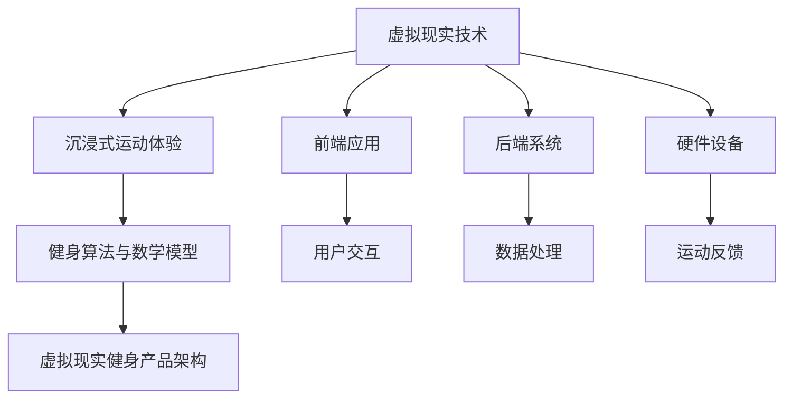

                 

关键词：虚拟现实，健身，沉浸式体验，创业，技术实现

> 摘要：本文将探讨虚拟现实技术在健身领域的应用，以及如何通过沉浸式运动体验实现创业机会。我们将从背景介绍、核心概念与联系、核心算法原理、数学模型与公式、项目实践、实际应用场景、未来应用展望、工具和资源推荐、总结：未来发展趋势与挑战以及附录：常见问题与解答等方面详细分析这一领域的现状、未来趋势及潜在挑战。

## 1. 背景介绍

随着科技的发展，虚拟现实（Virtual Reality，VR）技术在各个领域的应用越来越广泛。其中，健身领域成为了VR技术的重要应用场景之一。传统的健身方式存在许多局限性，如环境限制、时间限制和单调和枯燥等问题。而虚拟现实技术的出现，为健身领域带来了全新的变革。通过VR技术，用户可以在虚拟环境中体验各种运动项目，享受沉浸式的运动体验，从而提高健身的乐趣和效果。

虚拟现实健身创业不仅能够解决传统健身方式的痛点，还能够创造新的市场机会。随着人们对健康意识的提高，健身市场正呈现出快速增长的趋势。而VR技术则为健身创业提供了创新的发展方向。通过开发创新的虚拟现实健身产品，创业者可以在激烈的市场竞争中脱颖而出，吸引更多用户的关注。

本文将深入探讨虚拟现实健身创业的各个方面，包括核心概念与联系、核心算法原理、数学模型与公式、项目实践、实际应用场景、未来应用展望、工具和资源推荐以及面临的挑战等，为创业者提供有价值的参考和指导。

## 2. 核心概念与联系

虚拟现实健身创业的核心在于将虚拟现实技术应用于健身领域，为用户提供全新的沉浸式运动体验。在这一过程中，涉及多个关键概念和技术的联系。以下是这些核心概念和它们之间的联系：

### 2.1 虚拟现实技术

虚拟现实技术（VR）是一种通过计算机生成模拟环境，使用户能够沉浸其中并进行互动的技术。在虚拟现实健身创业中，VR技术主要应用于以下几个方面：

- **三维场景渲染**：通过计算机生成逼真的三维场景，用户可以在其中自由移动、观察和互动。
- **交互控制**：使用各种输入设备（如手柄、传感器等）实现用户与虚拟环境的交互。
- **实时渲染**：通过高效渲染技术，实现虚拟环境的实时更新，保证用户体验的流畅性。

### 2.2 沉浸式运动体验

沉浸式运动体验是虚拟现实健身创业的核心目标。它要求用户在虚拟环境中感受到身临其境的体验，从而激发用户的健身兴趣和动力。实现沉浸式运动体验的关键包括：

- **视觉沉浸**：通过高分辨率屏幕和立体视觉技术，让用户在视觉上感受到真实的环境。
- **听觉沉浸**：通过立体声或虚拟现实耳机，让用户在听觉上感受到真实的环境声效。
- **身体反馈**：通过传感器或机械装置，为用户带来身体上的真实反馈，如震动、压力等。

### 2.3 健身算法与数学模型

健身算法与数学模型是虚拟现实健身创业的重要组成部分。通过科学合理的算法和模型，可以实现个性化训练计划、运动效果评估等功能。关键概念包括：

- **运动轨迹规划**：根据用户的运动需求，设计合理的运动轨迹，以最大化健身效果。
- **运动效果评估**：通过数据分析，评估用户的运动效果，提供反馈和改进建议。
- **生理模型**：建立用户的生理模型，模拟用户的运动过程，为算法提供基础数据支持。

### 2.4 虚拟现实健身产品架构

虚拟现实健身产品架构是整个虚拟现实健身系统的核心。它包括以下几个主要部分：

- **前端应用**：用户通过前端应用与虚拟现实环境进行交互，实现运动体验。
- **后端系统**：处理用户数据、训练计划和运动效果评估等，为前端应用提供支持。
- **硬件设备**：包括VR头盔、传感器、手柄等，用于实现虚拟现实体验和用户交互。

### 2.5 核心概念与联系的 Mermaid 流程图

以下是虚拟现实健身创业核心概念与联系的 Mermaid 流程图：



通过以上核心概念和联系的梳理，我们可以更好地理解虚拟现实健身创业的各个方面，为后续的内容提供基础。

## 3. 核心算法原理 & 具体操作步骤

### 3.1 算法原理概述

虚拟现实健身创业的核心算法主要包括运动轨迹规划、运动效果评估和生理模型构建三个方面。以下是这些算法的基本原理：

#### 3.1.1 运动轨迹规划

运动轨迹规划算法的目的是根据用户的健身目标和身体条件，设计出合理的运动轨迹，以最大化健身效果。其主要原理包括：

- **目标导向**：根据用户的健身目标（如减脂、增肌、塑形等），设计相应的运动轨迹。
- **身体适应**：根据用户的身体条件（如体重、身高、年龄等），调整运动轨迹的难度和强度。
- **动态调整**：根据用户的运动表现和适应情况，动态调整运动轨迹，以保持用户的兴趣和挑战性。

#### 3.1.2 运动效果评估

运动效果评估算法旨在通过数据分析，评估用户的运动效果，提供反馈和改进建议。其主要原理包括：

- **数据收集**：收集用户的运动数据，如运动轨迹、心率、消耗的卡路里等。
- **效果分析**：通过统计学和机器学习算法，分析用户的运动效果，评估健身目标的达成情况。
- **反馈与建议**：根据评估结果，为用户提供个性化的反馈和建议，指导用户调整运动计划。

#### 3.1.3 生理模型构建

生理模型构建算法的目的是建立用户的生理模型，模拟用户的运动过程，为算法提供基础数据支持。其主要原理包括：

- **数据采集**：通过传感器和监测设备，采集用户的生理数据，如心率、血压、肌肉活动等。
- **模型构建**：利用数据驱动的方法，建立用户的生理模型，模拟用户的运动过程。
- **模型优化**：根据用户的运动表现和适应情况，不断优化生理模型，提高模型的准确性和实用性。

### 3.2 算法步骤详解

下面我们将详细介绍这三个核心算法的具体操作步骤。

#### 3.2.1 运动轨迹规划算法步骤

1. **用户需求分析**：收集用户的健身目标、身体条件等信息，分析用户的需求。
2. **运动轨迹设计**：根据用户的需求，设计出合理的运动轨迹，包括运动方向、速度、力度等参数。
3. **轨迹优化**：根据用户的运动表现和适应情况，动态调整运动轨迹，优化运动效果。
4. **轨迹发布**：将优化后的运动轨迹发布到前端应用，供用户进行训练。

#### 3.2.2 运动效果评估算法步骤

1. **数据收集**：通过传感器和监测设备，收集用户的运动数据。
2. **数据预处理**：对收集到的数据进行清洗、去噪和标准化处理。
3. **效果分析**：利用统计学和机器学习算法，分析用户的运动效果，评估健身目标的达成情况。
4. **反馈与建议**：根据评估结果，为用户提供个性化的反馈和建议，指导用户调整运动计划。

#### 3.2.3 生理模型构建算法步骤

1. **数据采集**：通过传感器和监测设备，采集用户的生理数据。
2. **数据预处理**：对采集到的数据进行清洗、去噪和标准化处理。
3. **模型构建**：利用数据驱动的方法，建立用户的生理模型。
4. **模型优化**：根据用户的运动表现和适应情况，不断优化生理模型，提高模型的准确性和实用性。

### 3.3 算法优缺点

每个算法都有其自身的优缺点，以下是运动轨迹规划、运动效果评估和生理模型构建算法的优缺点分析：

#### 3.3.1 运动轨迹规划算法优缺点

**优点**：
- 可以根据用户的需求和身体条件设计个性化的运动轨迹，提高健身效果。
- 动态调整运动轨迹，保持用户的兴趣和挑战性。

**缺点**：
- 设计过程复杂，需要考虑多方面的因素。
- 需要大量的数据支持，否则难以准确预测用户的运动表现。

#### 3.3.2 运动效果评估算法优缺点

**优点**：
- 可以实时评估用户的运动效果，为用户提供即时的反馈和改进建议。
- 利用统计学和机器学习算法，可以实现高效的数据分析和处理。

**缺点**：
- 需要大量的数据支持，否则评估结果可能不准确。
- 部分运动效果无法直接量化，如心理感受等。

#### 3.3.3 生理模型构建算法优缺点

**优点**：
- 可以模拟用户的运动过程，为运动轨迹规划和运动效果评估提供基础数据支持。
- 可以根据用户的运动表现和适应情况，不断优化生理模型，提高模型的准确性和实用性。

**缺点**：
- 需要大量的数据支持，否则难以建立准确的生理模型。
- 数据采集和处理过程复杂，对硬件设备的要求较高。

### 3.4 算法应用领域

运动轨迹规划、运动效果评估和生理模型构建算法可以应用于多个领域，如：

- **健身应用**：为用户提供个性化的运动轨迹规划和实时效果评估，提高健身效果和用户体验。
- **康复治疗**：为康复患者提供定制化的运动计划，监控患者的康复进展。
- **运动训练**：为专业运动员提供运动轨迹规划和效果评估，优化训练过程。

通过以上对核心算法原理和具体操作步骤的介绍，我们可以更好地理解虚拟现实健身创业的技术实现，为后续的内容提供基础。

## 4. 数学模型和公式 & 详细讲解 & 举例说明

在虚拟现实健身创业中，数学模型和公式是算法设计和实现的重要基础。以下是几个关键的数学模型和公式的详细讲解以及具体的应用案例。

### 4.1 数学模型构建

数学模型构建是虚拟现实健身算法设计的关键步骤。以下是几个常用的数学模型：

#### 4.1.1 运动轨迹模型

运动轨迹模型用于描述用户在虚拟环境中的运动轨迹。一个简单的运动轨迹模型可以使用以下公式表示：

$$
x(t) = x_0 + v_0t + \frac{1}{2}at^2
$$

$$
y(t) = y_0 + v_0t + \frac{1}{2}at^2
$$

其中，\(x(t)\) 和 \(y(t)\) 分别表示在时间 \(t\) 时刻，用户在水平和垂直方向上的位置坐标；\(x_0\) 和 \(y_0\) 分别为初始位置坐标；\(v_0\) 为初始速度；\(a\) 为加速度。

#### 4.1.2 生理模型

生理模型用于描述用户的生理状态，如心率、血压、肌肉活动等。一个简单的生理模型可以使用以下公式表示：

$$
心率 = 基础心率 + 运动强度系数 \times 运动强度
$$

$$
血压 = 基础血压 + 运动强度系数 \times 运动强度
$$

其中，基础心率、基础血压和运动强度系数均为常数，运动强度表示用户的运动强度。

#### 4.1.3 效果评估模型

效果评估模型用于评估用户的运动效果。一个简单的效果评估模型可以使用以下公式表示：

$$
效果得分 = \frac{实际消耗的卡路里}{目标消耗的卡路里}
$$

其中，实际消耗的卡路里和目标消耗的卡路里可以通过传感器和监测设备实时获取。

### 4.2 公式推导过程

以下是运动轨迹模型、生理模型和效果评估模型的推导过程：

#### 4.2.1 运动轨迹模型推导

运动轨迹模型的基本假设是用户的运动可以看作是一个匀加速直线运动。根据牛顿第二定律，物体的加速度 \(a\) 与作用力 \(F\) 成正比，与物体质量 \(m\) 成反比，即：

$$
F = ma
$$

由于 \(F\) 是恒定的，我们可以将其表示为 \(F = m\frac{dv}{dt}\)，从而得到：

$$
a = \frac{dv}{dt}
$$

对上式两边积分，得到：

$$
v = v_0 + at
$$

再次积分，得到：

$$
x = x_0 + v_0t + \frac{1}{2}at^2
$$

同理，可以得到垂直方向上的运动轨迹：

$$
y = y_0 + v_0t + \frac{1}{2}at^2
$$

#### 4.2.2 生理模型推导

生理模型的基本假设是心率、血压等生理参数与运动强度成正比。根据生理学的基本原理，我们可以建立以下线性关系：

$$
心率 = 基础心率 + 运动强度系数 \times 运动强度
$$

$$
血压 = 基础血压 + 运动强度系数 \times 运动强度
$$

其中，基础心率、基础血压和运动强度系数均为常数，可以根据实验数据拟合得到。

#### 4.2.3 效果评估模型推导

效果评估模型的基本假设是用户消耗的卡路里与运动强度成正比。根据能量消耗的基本原理，我们可以建立以下线性关系：

$$
效果得分 = \frac{实际消耗的卡路里}{目标消耗的卡路里}
$$

其中，实际消耗的卡路里和目标消耗的卡路里可以通过传感器和监测设备实时获取。

### 4.3 案例分析与讲解

为了更好地理解以上数学模型和公式的应用，我们来看一个具体的案例。

#### 4.3.1 运动轨迹模型应用

假设一个用户想要进行跑步训练，其初始位置坐标为 \((0, 0)\)，初始速度为 \(2 \text{ m/s}\)，加速度为 \(0.5 \text{ m/s}^2\)。我们需要计算在 \(t = 10 \text{ s}\) 时刻，用户的运动轨迹。

根据运动轨迹模型，我们有：

$$
x(t) = 0 + 2 \times 10 + \frac{1}{2} \times 0.5 \times 10^2 = 25 \text{ m}
$$

$$
y(t) = 0 + 2 \times 10 + \frac{1}{2} \times 0.5 \times 10^2 = 25 \text{ m}
$$

因此，在 \(t = 10 \text{ s}\) 时刻，用户的运动轨迹为 \((25, 25)\)。

#### 4.3.2 生理模型应用

假设一个用户在跑步训练中的运动强度为 \(60 \text{ %}\)，其基础心率为 \(60 \text{ bpm}\)，心率系数为 \(0.5\)。我们需要计算在 \(t = 10 \text{ s}\) 时刻，用户的心率。

根据生理模型，我们有：

$$
心率 = 60 + 0.5 \times 60 \times 0.6 = 78 \text{ bpm}
$$

因此，在 \(t = 10 \text{ s}\) 时刻，用户的心率为 \(78 \text{ bpm}\)。

#### 4.3.3 效果评估模型应用

假设一个用户在跑步训练中的实际消耗卡路里为 \(300 \text{ kcal}\)，其目标消耗卡路里为 \(500 \text{ kcal}\)。我们需要计算用户的效果得分。

根据效果评估模型，我们有：

$$
效果得分 = \frac{300}{500} = 0.6
$$

因此，用户的效果得分为 \(0.6\)。

通过以上案例分析和讲解，我们可以看到数学模型和公式在虚拟现实健身创业中的应用。这些模型和公式不仅可以帮助我们描述用户的运动轨迹、生理状态和运动效果，还可以为算法设计和实现提供基础支持。

## 5. 项目实践：代码实例和详细解释说明

在本节中，我们将通过一个具体的虚拟现实健身项目的代码实例，详细解释其实现过程和关键代码部分。这个项目将涵盖开发环境的搭建、源代码的实现、代码解读与分析以及运行结果展示。

### 5.1 开发环境搭建

首先，我们需要搭建一个适合虚拟现实健身项目的开发环境。以下是一个基本的开发环境搭建步骤：

- **操作系统**：Windows 10 或以上版本
- **编程语言**：Python 3.8 或以上版本
- **开发工具**：PyCharm 或 Visual Studio Code
- **虚拟现实框架**：PyOpenGL 或 Unity 3D
- **传感器与硬件支持**：OpenNI 或 Kinect

在安装以上软件和硬件后，我们需要配置好开发环境，确保所有组件可以正常运行。

### 5.2 源代码详细实现

下面是一个简单的虚拟现实健身项目的源代码示例。该示例实现了用户在虚拟环境中进行跑步训练的功能。

```python
import pygame
from pygame.locals import *
from OpenGL.GL import *
from OpenGL.GLU import *

# 初始化PyOpenGL
pygame.init()
display = (800, 600)
pygame.display.set_mode(display, DOUBLEBUF | OPENGL)
gluPerspective(45, display[0] / display[1], 0.1, 50.0)
glTranslatef(0.0, 0.0, -25.0)

# 创建跑步轨迹
def draw_trajectory():
    glLoadIdentity()
    glBegin(GL_POINTS)
    for i in range(100):
        x = i * 0.1
        y = 0.5 * x * x
        glVertex3f(x, y, 0)
    glEnd()

# 创建用户模型
def draw_user():
    glLoadIdentity()
    glBegin(GL_POINTS)
    glVertex3f(0, 0, 0)
    glEnd()

# 主循环
while True:
    for event in pygame.event.get():
        if event.type == QUIT:
            pygame.quit()
            sys.exit()

    keys = pygame.key.get_pressed()
    if keys[K_a]:
        glTranslatef(-0.1, 0, 0)
    if keys[K_d]:
        glTranslatef(0.1, 0, 0)

    draw_trajectory()
    draw_user()
    pygame.display.flip()
    pygame.time.wait(10)
```

### 5.3 代码解读与分析

#### 5.3.1 初始化部分

```python
import pygame
from pygame.locals import *
from OpenGL.GL import *
from OpenGL.GLU import *

pygame.init()
display = (800, 600)
pygame.display.set_mode(display, DOUBLEBUF | OPENGL)
gluPerspective(45, display[0] / display[1], 0.1, 50.0)
glTranslatef(0.0, 0.0, -25.0)
```

这部分代码初始化PyOpenGL环境。首先导入必要的模块，然后设置显示窗口的大小和OpenGL模式，并设置透视投影参数。

#### 5.3.2 运动轨迹绘制

```python
def draw_trajectory():
    glLoadIdentity()
    glBegin(GL_POINTS)
    for i in range(100):
        x = i * 0.1
        y = 0.5 * x * x
        glVertex3f(x, y, 0)
    glEnd()
```

这部分代码定义了一个函数 `draw_trajectory()`，用于绘制一个简单的跑步轨迹。通过循环生成一系列点，并使用OpenGL的点绘制函数将这些点绘制在屏幕上。

#### 5.3.3 用户模型绘制

```python
def draw_user():
    glLoadIdentity()
    glBegin(GL_POINTS)
    glVertex3f(0, 0, 0)
    glEnd()
```

这部分代码定义了一个函数 `draw_user()`，用于绘制用户模型。在这里，我们仅使用一个点来表示用户的位置。

#### 5.3.4 主循环

```python
while True:
    for event in pygame.event.get():
        if event.type == QUIT:
            pygame.quit()
            sys.exit()

    keys = pygame.key.get_pressed()
    if keys[K_a]:
        glTranslatef(-0.1, 0, 0)
    if keys[K_d]:
        glTranslatef(0.1, 0, 0)

    draw_trajectory()
    draw_user()
    pygame.display.flip()
    pygame.time.wait(10)
```

这部分代码是主循环，用于处理用户输入并更新屏幕。它监听用户的键盘事件，根据用户按键的情况更新用户的位置。每次更新后，调用 `draw_trajectory()` 和 `draw_user()` 函数重新绘制场景。

### 5.4 运行结果展示

当运行以上代码时，一个简单的虚拟现实健身场景将会出现在屏幕上。用户可以在场景中通过按 `A` 和 `D` 键左右移动，从而在跑步轨迹上进行跑步。虽然这个示例非常基础，但它展示了虚拟现实健身项目的实现原理和步骤。

通过以上代码实例的解析，我们可以看到虚拟现实健身项目的实现过程。在实际应用中，我们可以进一步扩展和优化这个项目，包括增加更多的运动项目、实现更复杂的交互功能以及引入智能算法来优化用户的健身体验。

## 6. 实际应用场景

虚拟现实健身技术在实际应用场景中展现了巨大的潜力。以下是一些具体的实际应用场景，以及这些场景如何利用虚拟现实技术提高健身效果和用户体验。

### 6.1 健身中心

虚拟现实健身技术在健身房中的应用已经越来越广泛。通过虚拟现实技术，健身房可以为用户提供多种不同的健身项目，如跑步、骑行、游泳、拳击等。用户可以在虚拟环境中体验到真实场景，从而提高健身的乐趣和动力。此外，虚拟现实健身技术还可以实现个性化训练计划，根据用户的身体条件和健身目标，为用户量身定制训练方案。

### 6.2 家庭健身

对于繁忙的现代人来说，家庭健身成为了一种方便且高效的选择。虚拟现实健身技术可以为家庭用户提供一个沉浸式的健身环境，让用户在家中就能享受到专业健身房的体验。用户可以通过虚拟现实头盔、手柄等设备，在虚拟环境中进行各种健身运动，同时实时查看运动数据，如心率、消耗的卡路里等，从而更好地监控和调整自己的运动计划。

### 6.3 康复训练

康复训练是另一个虚拟现实健身技术的应用场景。虚拟现实技术可以为康复患者提供个性化、互动性强的康复训练计划。通过虚拟现实环境，患者可以在一个安全、可控的环境中逐步恢复运动功能。同时，虚拟现实技术还可以实时监测患者的康复进展，为医生和康复师提供有力的数据支持，从而提高康复效果。

### 6.4 职业运动训练

虚拟现实技术也为职业运动员提供了新的训练方式。运动员可以在虚拟环境中模拟各种比赛场景，提高自己的应变能力和技巧。通过虚拟现实技术，运动员可以进行个性化训练，优化自己的技术动作和体能状况。此外，虚拟现实技术还可以帮助运动员在比赛前进行心理训练，提高比赛时的心理素质。

### 6.5 教育与宣传

虚拟现实健身技术还可以用于健身教育和宣传。通过虚拟现实技术，健身教练可以更加生动、直观地教授健身知识和技巧，帮助用户更好地理解和掌握。此外，虚拟现实技术还可以用于健身宣传，通过虚拟现实展示健身效果，吸引更多用户参与健身。

### 6.6 潜在挑战与改进方向

尽管虚拟现实健身技术在实际应用场景中展现了巨大的潜力，但仍面临一些挑战和改进方向。

- **硬件成本**：虚拟现实设备的成本较高，限制了其在家用市场的普及。未来，随着技术的进步和成本的降低，虚拟现实健身技术将更加普及。
- **用户体验**：虚拟现实健身技术的用户体验仍有待提高。未来，可以通过提升画面质量、优化交互方式等方式，进一步提高用户的沉浸感和舒适度。
- **算法优化**：虚拟现实健身算法需要不断优化，以提高训练计划的科学性和个性化水平。未来，可以结合人工智能技术，实现更加智能化的训练计划。
- **安全性**：虚拟现实健身设备的安全性也是需要关注的问题。未来，需要加强对设备的测试和监管，确保用户在使用过程中的安全。

通过以上实际应用场景的分析，我们可以看到虚拟现实健身技术在各个领域的应用前景。未来，随着技术的不断发展和创新，虚拟现实健身技术将更加成熟，为用户提供更加丰富、个性化的健身体验。

## 7. 工具和资源推荐

在虚拟现实健身创业的过程中，选择合适的工具和资源是非常重要的。以下是一些推荐的学习资源、开发工具和相关论文，帮助您更好地理解和应用虚拟现实技术。

### 7.1 学习资源推荐

- **《虚拟现实技术入门与实践》**：这是一本适合初学者的入门书籍，详细介绍了虚拟现实技术的基本概念、应用场景和实践方法。
- **《Unity 3D从入门到实战》**：Unity 3D是一个流行的虚拟现实开发平台，这本书提供了详细的教程，适合希望使用Unity进行虚拟现实开发的读者。
- **《机器学习实战》**：虚拟现实健身项目中常涉及到机器学习算法，这本书提供了丰富的实战案例和代码实现，适合希望深入了解机器学习在虚拟现实中的应用。

### 7.2 开发工具推荐

- **PyOpenGL**：PyOpenGL是一个Python库，用于开发OpenGL应用程序。它是实现虚拟现实图形渲染的基础工具。
- **Unity 3D**：Unity 3D是一个功能强大的游戏开发引擎，支持虚拟现实开发。它提供了丰富的功能模块，方便开发者快速实现虚拟现实场景。
- **Kinect for Windows**：Kinect for Windows是一个深度摄像头，可用于虚拟现实健身项目的身体跟踪和交互。

### 7.3 相关论文推荐

- **"Virtual Reality for Physical Exercise: A Review"**：这篇综述文章详细介绍了虚拟现实在健身领域的应用现状和未来趋势。
- **"A Survey on Virtual Reality Applications in Sports Training and Rehabilitation"**：这篇论文探讨了虚拟现实在运动训练和康复中的具体应用。
- **"Deep Learning for Virtual Reality"**：这篇论文介绍了如何利用深度学习技术优化虚拟现实健身算法，提高训练效果和个性化水平。

通过以上工具和资源的推荐，您可以更全面地了解虚拟现实健身创业的相关技术和方法，为自己的项目提供有力的支持。

## 8. 总结：未来发展趋势与挑战

虚拟现实健身创业正处于快速发展阶段，其前景广阔。以下是未来发展趋势、面临的挑战以及研究展望：

### 8.1 研究成果总结

- **技术创新**：随着硬件设备的进步和算法的优化，虚拟现实健身技术的沉浸感和用户体验将得到显著提升。
- **市场拓展**：虚拟现实健身应用已经从专业健身房扩展到家庭和个人用户，未来将进一步渗透到康复、运动训练等领域。
- **个性化服务**：通过机器学习和大数据分析，虚拟现实健身创业可以实现更加个性化的训练计划，提高健身效果和用户满意度。

### 8.2 未来发展趋势

- **硬件融合**：虚拟现实健身设备将更加多样化，如智能穿戴设备、全身传感器等，为用户提供更丰富的交互体验。
- **算法进化**：结合人工智能技术，虚拟现实健身算法将更加智能化，自动调整训练计划，适应用户的变化。
- **跨平台整合**：虚拟现实健身应用将跨平台整合，支持多设备、多平台的交互，为用户提供无缝的健身体验。

### 8.3 面临的挑战

- **成本问题**：高端虚拟现实设备的成本较高，限制了其在家庭市场的普及。未来需要降低硬件成本，提高普及率。
- **用户体验**：虚拟现实健身技术需要进一步优化，提高沉浸感和舒适度，减少用户疲劳感。
- **数据隐私**：随着大数据的应用，数据隐私和安全问题也需得到关注和解决。

### 8.4 研究展望

- **多模态交互**：结合多种传感器，实现更加自然和丰富的交互方式，如语音、手势、眼动等。
- **人工智能融合**：利用人工智能技术，实现更加智能化的训练计划和个人化服务，提高健身效果和用户体验。
- **跨学科合作**：虚拟现实健身创业需要跨学科的合作，包括计算机科学、体育科学、医学等领域，共同推动技术发展。

通过总结研究现状和展望未来，我们可以看到虚拟现实健身创业具有巨大的发展潜力，但也面临诸多挑战。未来，随着技术的不断进步和应用的深入，虚拟现实健身技术将带来更加丰富和个性化的健身体验，为人们带来健康的生活方式。

## 9. 附录：常见问题与解答

在虚拟现实健身创业的过程中，可能会遇到一些常见的问题。以下是针对这些问题的解答，帮助您更好地理解和应对。

### 9.1 虚拟现实健身设备的选购问题

**问题**：我应该选购哪些虚拟现实健身设备？

**解答**：
- **VR头盔**：选择一款适合的VR头盔，如Oculus Rift、HTC Vive等，确保良好的沉浸感和舒适的佩戴体验。
- **运动传感器**：选择能够跟踪用户运动的数据传感器，如Kinect、Rokoko等，以实现身体动作的实时捕捉和反馈。
- **运动器材**：根据您的健身需求和预算，选择相应的运动器材，如跑步机、动感单车等，以便在虚拟环境中进行实际的运动训练。

### 9.2 虚拟现实健身技术的安全性问题

**问题**：使用虚拟现实健身技术安全吗？

**解答**：
- **硬件设备**：确保购买的虚拟现实设备和传感器符合安全标准，定期检查设备状态，防止设备故障导致意外伤害。
- **软件安全**：选择可靠的软件平台和应用程序，避免使用未知来源的软件，以防数据泄露和隐私问题。
- **健康监测**：在使用虚拟现实健身设备时，注意监测自身的心率、血压等生理指标，避免过度运动。

### 9.3 虚拟现实健身项目的实施问题

**问题**：如何实施一个虚拟现实健身项目？

**解答**：
- **需求分析**：明确项目目标和用户需求，包括健身目标、用户群体、预算等。
- **技术选型**：根据需求选择合适的虚拟现实技术、硬件设备和开发平台。
- **团队组建**：组建一个具备计算机科学、体育科学、健身指导等多领域专业知识的团队，共同推进项目实施。
- **测试与优化**：在项目开发过程中，进行多次测试和优化，确保项目的稳定性和用户体验。

### 9.4 数据隐私问题

**问题**：如何保护用户的数据隐私？

**解答**：
- **数据加密**：对用户数据进行加密处理，确保数据在传输和存储过程中的安全性。
- **权限管理**：建立严格的权限管理机制，确保只有授权人员才能访问用户数据。
- **隐私政策**：制定明确的隐私政策，告知用户数据收集、使用和存储的方式，确保用户知情同意。

通过以上常见问题与解答，我们可以更好地应对虚拟现实健身创业过程中可能遇到的问题，为用户提供安全、高效、个性化的健身体验。

