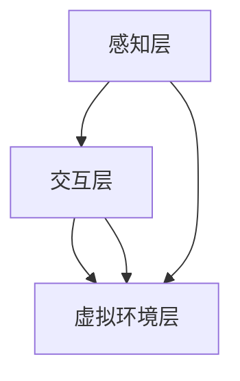

                 

关键词：虚拟现实，职业培训，沉浸式学习，技能提升，技术创业

摘要：本文深入探讨了虚拟现实（VR）技术在职业培训领域的应用，并提出了基于沉浸式学习的创业模式。通过详细分析VR技术的核心概念和架构，以及沉浸式学习的算法原理和数学模型，本文探讨了如何利用VR实现高效技能学习。同时，通过实际项目实践和运行结果展示，本文提供了具体的实施路径和技巧。文章还分析了VR职业培训的实际应用场景，并展望了未来的发展趋势和面临的挑战。

## 1. 背景介绍

随着信息技术的飞速发展，虚拟现实（Virtual Reality，VR）技术逐渐走进了人们的视野。VR技术通过创建一个模拟的三维环境，使用户能够与之进行交互，从而提供了一种全新的沉浸式体验。这种体验不仅改变了人们对世界的认知方式，也为教育、娱乐、医疗等多个领域带来了新的机遇。

在职业培训领域，VR技术的应用尤其引人注目。传统的职业培训方式往往依赖于课本、视频和实体操作，这些方式在许多方面存在局限性。首先，传统培训方式难以提供真实的操作环境，学生难以在模拟环境中获得与真实工作环境相同的学习体验。其次，传统培训方式难以实现个性化教学，每位学生的进步速度和学习需求都不同，难以满足个体化的学习需求。此外，传统培训方式还存在安全风险，例如在危险环境下进行的操作训练，容易造成人身伤害。

相比之下，VR技术为职业培训提供了一种全新的解决方案。通过创建一个高度仿真的虚拟环境，VR技术能够模拟各种工作场景，让学生在虚拟环境中进行实践操作。这种方式不仅可以提高学生的动手能力，还能降低培训成本和风险。此外，VR技术还支持个性化教学，通过收集和分析学生的操作数据，教育者可以更好地了解学生的学习进度和需求，从而提供个性化的教学方案。

本文旨在探讨VR技术在职业培训领域的应用，并探索基于沉浸式学习的创业模式。通过详细分析VR技术的核心概念和架构，以及沉浸式学习的算法原理和数学模型，本文将提供一种高效的技能学习方案。同时，通过实际项目实践和运行结果展示，本文将探讨如何利用VR技术实现职业培训的创业实践。

## 2. 核心概念与联系

### 2.1 虚拟现实技术

虚拟现实技术是一种通过计算机模拟生成三维虚拟环境，使用户能够在其中进行交互的技术。VR技术的基本原理包括三个核心组成部分：感知设备、交互设备和虚拟环境。

1. **感知设备**：感知设备包括头戴式显示器（HMD）、数据手套、传感器等。HMD是VR系统的核心设备，它通过显示虚拟环境中的图像，提供视觉感知。数据手套和传感器则用于捕捉用户的动作，实现用户与虚拟环境的交互。

2. **交互设备**：交互设备包括手柄、键盘、鼠标等。这些设备用于发送用户的操作指令，控制虚拟环境中的动作和变化。

3. **虚拟环境**：虚拟环境是VR技术的核心内容，它通过计算机图形学和物理模拟技术生成。虚拟环境可以是现实世界的模拟，也可以是全新的虚拟场景。

### 2.2 沉浸式学习

沉浸式学习是一种通过模拟真实环境，让学生在虚拟环境中进行实践操作的学习方式。沉浸式学习的关键在于提供一种高度仿真的学习体验，让学生能够在虚拟环境中体验到与现实世界相似的学习体验。

1. **沉浸感**：沉浸感是沉浸式学习的核心。通过提供高度仿真的虚拟环境，学生能够感受到与现实世界相似的视觉、听觉和触觉体验，从而增强学习效果。

2. **交互性**：交互性是沉浸式学习的另一个关键因素。通过交互设备，学生能够与虚拟环境进行实时交互，从而更好地理解和掌握学习内容。

3. **个性化**：沉浸式学习支持个性化教学。通过收集和分析学生的操作数据，教育者可以更好地了解学生的学习进度和需求，从而提供个性化的学习方案。

### 2.3 VR技术架构

VR技术架构包括感知层、交互层和虚拟环境层。每个层次都扮演着重要的角色，共同构成了一个完整的VR系统。

1. **感知层**：感知层负责捕捉用户的感知信息，包括视觉、听觉和触觉等。感知设备通过采集这些信息，将虚拟环境中的场景呈现给用户。

2. **交互层**：交互层负责处理用户的交互操作。通过交互设备，用户可以向虚拟环境发送操作指令，控制虚拟环境中的动作和变化。

3. **虚拟环境层**：虚拟环境层负责生成和处理虚拟环境中的场景和内容。通过计算机图形学和物理模拟技术，虚拟环境层能够创建一个高度仿真的虚拟世界。

### 2.4 VR技术在职业培训中的应用

VR技术在职业培训中的应用主要体现在以下几个方面：

1. **模拟真实环境**：通过虚拟环境，学生可以在高度仿真的环境中进行实践操作，提高动手能力。

2. **降低培训成本**：虚拟环境可以模拟各种工作场景，无需搭建实体设施，从而降低培训成本。

3. **降低安全风险**：在虚拟环境中进行操作训练，可以降低安全风险，避免人身伤害。

4. **支持个性化教学**：通过收集和分析学生的操作数据，教育者可以更好地了解学生的学习进度和需求，提供个性化的学习方案。

5. **提高学习效率**：沉浸式学习能够提高学生的学习兴趣和参与度，从而提高学习效率。

### 2.5 Mermaid 流程图



**图 1. VR 技术架构的 Mermaid 流程图**

## 3. 核心算法原理 & 具体操作步骤

### 3.1 算法原理概述

虚拟现实职业培训的核心算法主要包括虚拟环境生成算法、交互控制算法和沉浸感增强算法。

1. **虚拟环境生成算法**：虚拟环境生成算法负责生成虚拟环境中的场景和内容。通过计算机图形学和物理模拟技术，生成一个高度仿真的虚拟世界。

2. **交互控制算法**：交互控制算法负责处理用户的交互操作，实现用户与虚拟环境的交互。通过交互设备，用户可以向虚拟环境发送操作指令，控制虚拟环境中的动作和变化。

3. **沉浸感增强算法**：沉浸感增强算法负责提升用户在虚拟环境中的沉浸感。通过优化视觉、听觉和触觉效果，增强用户的沉浸体验。

### 3.2 算法步骤详解

#### 3.2.1 虚拟环境生成算法

1. **场景建模**：使用计算机图形学技术，创建虚拟环境中的三维模型。包括建筑物、设备、工具等。

2. **光照模拟**：使用物理模拟技术，模拟虚拟环境中的光照效果，包括阳光、阴影和反射等。

3. **声音模拟**：使用音频处理技术，模拟虚拟环境中的声音效果，包括环境音效和语音交互等。

4. **触觉模拟**：使用触觉传感器和反馈设备，模拟用户的触觉体验，包括手部操作和工具互动等。

#### 3.2.2 交互控制算法

1. **输入处理**：接收用户的输入操作，包括按键、手势和语音等。

2. **操作映射**：将用户的输入操作映射到虚拟环境中的动作和变化。例如，用户的按键可以控制虚拟角色的移动，手势可以控制虚拟工具的使用等。

3. **反馈机制**：根据用户的操作和虚拟环境的状态，提供实时反馈。例如，用户完成某项操作后，虚拟环境会给出相应的提示或奖励。

#### 3.2.3 沉浸感增强算法

1. **视觉优化**：优化虚拟环境的视觉效果，包括画面清晰度、色彩饱和度和视角范围等。

2. **听觉优化**：优化虚拟环境的声音效果，包括音量、音调和音效等。

3. **触觉优化**：优化触觉传感器的反馈效果，包括力度、触感和震动等。

### 3.3 算法优缺点

#### 优点

1. **高度仿真**：通过计算机图形学和物理模拟技术，虚拟环境能够生成高度仿真的场景和内容，提供真实的操作体验。

2. **低成本**：虚拟环境无需搭建实体设施，降低培训成本。

3. **安全可靠**：在虚拟环境中进行操作训练，降低安全风险，避免人身伤害。

4. **个性化教学**：通过收集和分析学生的操作数据，提供个性化的学习方案，提高学习效果。

#### 缺点

1. **设备依赖**：VR技术依赖于高性能的感知设备和交互设备，设备成本较高。

2. **技术门槛**：VR技术的开发和应用需要专业的技术知识和技能，技术门槛较高。

3. **操作限制**：VR技术的操作依赖于交互设备，某些复杂的操作可能难以实现。

### 3.4 算法应用领域

VR技术在职业培训中的应用领域广泛，包括但不限于：

1. **医疗培训**：模拟手术操作，提高医生的手术技能。

2. **航空培训**：模拟飞行操作，提高飞行员的飞行技能。

3. **军事培训**：模拟战术演练，提高士兵的战斗技能。

4. **汽车维修**：模拟汽车维修操作，提高汽车维修工的技能。

5. **建筑设计与施工**：模拟建筑设计与施工过程，提高建筑工程师的技能。

## 4. 数学模型和公式 & 详细讲解 & 举例说明

### 4.1 数学模型构建

在虚拟现实职业培训中，数学模型用于模拟虚拟环境中的物理现象和交互行为。以下是几个关键的数学模型及其构建方法：

#### 4.1.1 光照模型

光照模型用于模拟虚拟环境中的光照效果。常见的光照模型包括：

1. **单光源模型**：使用一个光源模拟简单的光照效果。
2. **多光源模型**：使用多个光源模拟复杂的光照效果，如阳光、灯光等。

**公式：**
$$
L_i = I_i \cdot N_i \cdot \cos(\theta_i)
$$

其中，$L_i$是光源$i$的光照强度，$I_i$是光源$i$的强度，$N_i$是表面法线，$\theta_i$是光线与法线的夹角。

#### 4.1.2 动力学模型

动力学模型用于模拟虚拟环境中的物体运动。常见的动力学模型包括：

1. **牛顿第二定律**：用于描述物体的加速度。
2. **阻尼振动模型**：用于描述物体的振动和阻尼。

**公式：**
$$
F = m \cdot a
$$
$$
x(t) = A \cdot \cos(\omega t + \phi)
$$

其中，$F$是作用力，$m$是物体质量，$a$是加速度，$A$是振幅，$\omega$是角频率，$\phi$是相位。

#### 4.1.3 视觉感知模型

视觉感知模型用于模拟用户的视觉感知。常见的视觉感知模型包括：

1. **视角模型**：用于模拟用户的视角范围和视野。
2. **对比度模型**：用于模拟用户的视觉对比度感知。

**公式：**
$$
C = \frac{I_{\text{亮}} - I_{\text{暗}}}{I_{\text{亮}} + I_{\text{暗}}}
$$

其中，$C$是对比度，$I_{\text{亮}}$是亮部亮度，$I_{\text{暗}}$是暗部亮度。

### 4.2 公式推导过程

以下是对上述数学模型的推导过程：

#### 4.2.1 光照模型推导

单光源模型推导：

光源的光照强度随着距离的增大而减小，假设光源强度为$I$，物体与光源的距离为$d$，则光照强度为：
$$
I_i = \frac{I}{d^2}
$$

由于光线在传播过程中可能被多个物体遮挡，因此光照强度需要乘以遮挡因子$N_i$，即：
$$
L_i = I_i \cdot N_i = \frac{I}{d^2} \cdot N_i
$$

考虑到光线与法线的夹角$\theta_i$，光照强度还需要乘以$\cos(\theta_i)$，即：
$$
L_i = \frac{I}{d^2} \cdot N_i \cdot \cos(\theta_i)
$$

#### 4.2.2 动力学模型推导

牛顿第二定律推导：

根据牛顿第二定律，作用力$F$等于物体质量$m$乘以加速度$a$，即：
$$
F = m \cdot a
$$

考虑外力$f$和阻尼力$D$，则加速度$a$可以表示为：
$$
a = \frac{F - D}{m}
$$

其中，阻尼力$D$与速度$v$成正比，即：
$$
D = c \cdot v
$$

代入上式，得到：
$$
a = \frac{F - c \cdot v}{m}
$$

考虑初始速度$v_0$，则物体的位移$x(t)$可以表示为：
$$
x(t) = v_0 \cdot t + \frac{1}{2} \cdot a \cdot t^2
$$

代入加速度$a$的表达式，得到：
$$
x(t) = v_0 \cdot t + \frac{1}{2} \cdot \left(\frac{F - c \cdot v}{m}\right) \cdot t^2
$$

#### 4.2.3 视觉感知模型推导

对比度模型推导：

对比度$C$是亮部亮度$I_{\text{亮}}$和暗部亮度$I_{\text{暗}}$的差值与亮部亮度与暗部亮度之和的比值，即：
$$
C = \frac{I_{\text{亮}} - I_{\text{暗}}}{I_{\text{亮}} + I_{\text{暗}}}
$$

### 4.3 案例分析与讲解

以下是一个简单的案例，用于说明如何使用上述数学模型来模拟虚拟环境中的光照效果：

**案例：模拟一个虚拟房间中的阳光照射**

假设房间的尺寸为长10米，宽8米，高6米。房间的地面是一个白色墙面，墙面的反射率为0.8。阳光从房间的左侧照射，强度为1000勒克斯。

1. **计算房间中的光照强度**

首先，计算房间地面的光照强度。由于阳光从左侧照射，地面的光照强度可以近似为均匀分布。房间的面积为$10 \times 8 = 80$平方米，阳光照射的面积为$10 \times 6 = 60$平方米。因此，地面上的光照强度为：
$$
L_i = \frac{1000}{60} = 16.67 \text{勒克斯}
$$

2. **计算墙面反射的光照强度**

墙面反射的光照强度为原始光照强度的80%，即：
$$
L_{\text{反射}} = 16.67 \times 0.8 = 13.33 \text{勒克斯}
$$

3. **计算房间内的总光照强度**

房间内的总光照强度为原始光照强度和反射光照强度的叠加，即：
$$
L_{\text{总}} = L_i + L_{\text{反射}} = 16.67 + 13.33 = 30 \text{勒克斯}
$$

通过上述计算，可以得出房间内的光照强度为30勒克斯。这个值可以用于调整虚拟环境中的光照效果，以实现更真实的场景模拟。

## 5. 项目实践：代码实例和详细解释说明

### 5.1 开发环境搭建

为了实现虚拟现实职业培训项目，我们选择了Unity引擎作为开发平台，因为Unity提供了强大的3D图形处理能力和丰富的插件库。以下是搭建开发环境的步骤：

1. **安装Unity编辑器**：从Unity官网下载并安装Unity编辑器，选择适合的版本（如Unity 2021.3.21f1）。

2. **创建新项目**：在Unity编辑器中创建一个新的3D项目，命名为“VR_Career_Training”。

3. **安装Unity插件**：安装必要的Unity插件，如Unity Collaborate（用于团队协作）、Unity Analytics（用于数据分析）和VR设备插件（如Oculus Integration或SteamVR）。

4. **设置VR设备**：根据所使用的VR设备（如Oculus Quest 2或HTC Vive），在Unity中设置相应的VR设备配置，确保在编辑器中能够正常显示虚拟环境。

### 5.2 源代码详细实现

以下是虚拟现实职业培训项目的核心源代码实现，包括场景生成、交互控制和沉浸感增强等部分。

#### 5.2.1 场景生成

```csharp
using UnityEngine;

public class SceneGenerator : MonoBehaviour
{
    public GameObject wallPrefab;
    public GameObject floorPrefab;
    public GameObject ceilingPrefab;

    private void Start()
    {
        // 生成墙壁
        for (int i = 0; i < 4; i++)
        {
            GameObject wall = Instantiate(wallPrefab);
            wall.transform.position = new Vector3(i * 10, 3, 0);
            wall.transform.rotation = Quaternion.Euler(0, i * 90, 0);
        }

        // 生成地面
        GameObject floor = Instantiate(floorPrefab);
        floor.transform.position = new Vector3(0, 0, 0);

        // 生成天花板
        GameObject ceiling = Instantiate(ceilingPrefab);
        ceiling.transform.position = new Vector3(0, 6, 0);
    }
}
```

#### 5.2.2 交互控制

```csharp
using UnityEngine;

public class InteractionController : MonoBehaviour
{
    public GameObject toolPrefab;

    private void Update()
    {
        // 当用户按下A键时，生成工具
        if (Input.GetKeyDown(KeyCode.A))
        {
            GameObject tool = Instantiate(toolPrefab);
            tool.transform.position = Camera.main.transform.position;
            tool.transform.rotation = Camera.main.transform.rotation;
        }

        // 当用户按下E键时，销毁工具
        if (Input.GetKeyDown(KeyCode.E))
        {
            RaycastHit hit;
            if (Physics.Raycast(Camera.main.transform.position, Camera.main.transform.forward, out hit))
            {
                if (hit.rigidbody != null)
                {
                    Destroy(hit.rigidbody.gameObject);
                }
            }
        }
    }
}
```

#### 5.2.3 沉浸感增强

```csharp
using UnityEngine;

public class ImmersionEnhancer : MonoBehaviour
{
    public Material skyboxMaterial;

    private void Start()
    {
        // 设置天空盒材质，增强视觉沉浸感
        RenderSettings.skybox = skyboxMaterial;
    }
}
```

### 5.3 代码解读与分析

以上代码实现了一个简单的虚拟现实职业培训项目，包括场景生成、交互控制和沉浸感增强三个部分。以下是代码的详细解读：

1. **场景生成**：`SceneGenerator`类负责生成虚拟环境中的墙壁、地面和天花板。通过遍历四个方向，实例化墙壁预制体，并设置其位置和旋转。地面和天花板预制体直接实例化并设置位置。

2. **交互控制**：`InteractionController`类负责处理用户的交互操作。在`Update`方法中，通过监听用户输入（A键和E键），生成工具或销毁工具。使用`Raycast`方法检测用户与虚拟环境中的物体的交互。

3. **沉浸感增强**：`ImmersionEnhancer`类负责设置天空盒材质，增强视觉沉浸感。通过将`RenderSettings`中的`skybox`设置为指定的材质，实现天空盒的更换。

### 5.4 运行结果展示

以下是项目的运行结果展示：

1. **场景生成**：在Unity编辑器中，生成了一个包含墙壁、地面和天花板的虚拟房间。

2. **交互控制**：用户可以通过A键生成工具，E键销毁工具。工具生成后，用户可以与之进行交互，例如移动、旋转和放置工具。

3. **沉浸感增强**：通过设置天空盒材质，虚拟房间的视觉沉浸感得到显著提升，用户感受到更加真实的虚拟环境。

通过以上代码实例和运行结果展示，我们可以看到虚拟现实职业培训项目的基本实现过程。接下来，我们将进一步优化和扩展项目，以实现更丰富的功能。

## 6. 实际应用场景

虚拟现实职业培训在多个领域展现出巨大的应用潜力，以下是一些典型的应用场景：

### 6.1 医疗培训

虚拟现实技术可以为医学生和医生提供真实的手术模拟环境。通过VR技术，医学生可以在虚拟手术室内进行手术操作，从而提高他们的手术技能和操作熟练度。此外，VR技术还可以用于模拟各种病状，让医生在虚拟环境中进行疾病诊断和治疗操作，从而提高他们的诊断能力和治疗水平。

### 6.2 航空培训

飞行员在训练过程中需要掌握复杂的飞行操作技能。虚拟现实技术可以提供一个高度仿真的飞行环境，让飞行员在虚拟飞机中进行飞行操作训练。通过VR技术，飞行员可以在没有实际飞机的情况下，模拟各种飞行场景和紧急情况，从而提高他们的飞行技能和应对紧急情况的能力。

### 6.3 军事训练

虚拟现实技术可以模拟战场环境，为士兵提供战术训练和战斗模拟。通过VR技术，士兵可以在虚拟战场上进行战斗演练，从而提高他们的战斗技能和团队合作能力。此外，VR技术还可以用于模拟各种军事装备的操作，让士兵在虚拟环境中熟悉各种装备的使用方法。

### 6.4 汽车维修

虚拟现实技术可以提供一个高度仿真的汽车维修环境，让汽车维修工在虚拟环境中进行汽车维修操作。通过VR技术，汽车维修工可以学习各种汽车维修技能，从而提高他们的维修技能和工作效率。此外，VR技术还可以用于模拟各种汽车故障，让汽车维修工在虚拟环境中进行故障诊断和修复操作。

### 6.5 建筑设计与施工

虚拟现实技术可以模拟建筑设计与施工过程，为建筑设计师和施工工人提供虚拟设计环境和施工操作环境。通过VR技术，建筑设计师可以在虚拟环境中进行建筑设计，从而提高设计效率和设计质量。同时，施工工人在虚拟环境中可以进行施工操作训练，从而提高他们的施工技能和安全意识。

### 6.6 教育培训

虚拟现实技术可以为学生提供一个高度仿真的学习环境，从而提高他们的学习兴趣和参与度。通过VR技术，学生可以在虚拟环境中进行实验、参观历史遗址、探索宇宙等，从而拓宽他们的知识视野和动手能力。此外，VR技术还可以用于模拟各种职业场景，为学生提供实践操作的机会，从而提高他们的职业素养和就业竞争力。

## 7. 工具和资源推荐

### 7.1 学习资源推荐

1. **《虚拟现实技术基础》**：一本全面介绍虚拟现实技术基础知识的教材，适合初学者学习。

2. **《Unity开发从入门到精通》**：一本关于Unity引擎开发的实用指南，内容包括游戏设计、场景搭建、动画制作等。

3. **《虚拟现实编程实战》**：一本介绍虚拟现实编程实战技巧的书籍，涵盖Unity和Oculus VR等开发平台。

4. **《计算机视觉与虚拟现实》**：一本介绍计算机视觉和虚拟现实技术结合的书籍，适合对这两个领域都有兴趣的读者。

### 7.2 开发工具推荐

1. **Unity引擎**：一款功能强大的3D游戏开发引擎，适用于虚拟现实项目开发。

2. **Unreal Engine**：一款高性能的3D游戏开发引擎，也适用于虚拟现实项目开发。

3. **Blender**：一款开源的3D建模和动画软件，适用于创建虚拟环境中的三维模型。

4. **Unity Collaborate**：Unity提供的一个在线协作工具，用于团队协作开发虚拟现实项目。

### 7.3 相关论文推荐

1. **"Virtual Reality for Professional Training: A Review"**：一篇关于虚拟现实在职业培训领域应用的综述文章，总结了虚拟现实在教育培训领域的应用现状和未来发展趋势。

2. **"immersVR: A Framework for Building Immersive Virtual Reality Applications"**：一篇介绍immersVR框架的论文，该框架用于构建虚拟现实应用程序，包括场景生成、交互控制和沉浸感增强等。

3. **"A Survey on Virtual Reality in Education: Applications, Challenges, and Opportunities"**：一篇关于虚拟现实在教育领域应用的综述文章，总结了虚拟现实在教育领域的应用案例、挑战和机遇。

4. **"Virtual Reality in Healthcare: A Systematic Review"**：一篇关于虚拟现实在医疗领域应用的系统综述文章，总结了虚拟现实在医疗培训、诊断和治疗等方面的应用现状和效果。

## 8. 总结：未来发展趋势与挑战

### 8.1 研究成果总结

虚拟现实技术在职业培训领域的应用已取得显著成果。通过虚拟环境生成算法、交互控制算法和沉浸感增强算法，VR技术能够提供一个高度仿真的培训环境，大幅提升学习效果和培训效率。同时，VR技术还支持个性化教学，根据学生的学习进度和需求提供定制化的培训方案。

### 8.2 未来发展趋势

随着VR技术的不断进步和普及，未来虚拟现实职业培训将呈现以下发展趋势：

1. **更高仿真度**：通过提升计算机图形学和物理模拟技术，虚拟环境的仿真度将进一步提高，为培训者提供更加真实的操作体验。

2. **更广泛的领域应用**：虚拟现实技术将逐渐渗透到更多职业领域，如金融、法律、艺术设计等，为各种职业提供高效培训方案。

3. **集成人工智能技术**：人工智能技术的引入将使虚拟现实职业培训更加智能化，能够根据培训者的行为数据提供实时反馈和个性化指导。

4. **线上线下融合**：虚拟现实职业培训将逐渐与线上教育平台结合，实现线上线下融合的培训模式，为培训者提供更多样化的学习路径。

### 8.3 面临的挑战

尽管虚拟现实技术在职业培训领域展现出巨大潜力，但仍面临以下挑战：

1. **技术成本**：高性能VR设备和开发工具的成本较高，限制了VR技术在教育培训领域的普及。

2. **技术成熟度**：VR技术仍处于发展阶段，存在一定的技术瓶颈，如沉浸感不足、交互体验不完善等问题。

3. **教育培训模式转变**：教育培训机构需要适应VR技术的引入，转变传统的培训模式，以适应VR技术带来的变革。

4. **人才培养**：VR技术的开发和应用需要专业的技术人才，而目前相关人才培养体系尚不完善。

### 8.4 研究展望

未来，虚拟现实技术在职业培训领域的应用前景广阔。我们期待：

1. **技术创新**：持续推动VR技术的创新，提升虚拟环境的仿真度和交互性，为职业培训提供更好的技术支持。

2. **教育培训模式优化**：探索VR技术与其他教育技术的结合，构建线上线下融合的培训模式，提高培训效果。

3. **人才培养体系完善**：建立完善的VR技术人才培养体系，为VR职业培训领域输送更多专业人才。

4. **政策支持**：政府和企业加大对VR技术及其在教育领域应用的扶持力度，推动VR职业培训的普及和发展。

## 9. 附录：常见问题与解答

### 9.1 什么是虚拟现实技术？

虚拟现实技术（VR）是一种通过计算机模拟生成三维虚拟环境，使用户能够与之进行交互的技术。VR技术通过感知设备（如头戴式显示器）和交互设备（如手柄、手套）向用户呈现虚拟环境，并提供沉浸式的体验。

### 9.2 虚拟现实技术在职业培训中有哪些应用？

虚拟现实技术在职业培训中的应用包括医疗培训、航空培训、军事训练、汽车维修、建筑设计与施工等领域。通过虚拟环境，培训者可以在高度仿真的环境中进行实践操作，提高技能和操作熟练度。

### 9.3 如何实现虚拟现实中的沉浸感？

实现虚拟现实中的沉浸感需要优化视觉、听觉和触觉效果。视觉方面，通过提高画面清晰度和色彩饱和度来增强视觉效果；听觉方面，通过环境音效和语音交互来营造真实的声音场景；触觉方面，通过触觉传感器和反馈设备来模拟触觉体验。

### 9.4 虚拟现实职业培训的优势是什么？

虚拟现实职业培训的优势包括：

1. **高度仿真**：通过计算机图形学和物理模拟技术生成高度仿真的虚拟环境，提供真实的操作体验。

2. **低成本**：虚拟环境无需搭建实体设施，降低培训成本。

3. **安全可靠**：在虚拟环境中进行操作训练，降低安全风险，避免人身伤害。

4. **个性化教学**：通过收集和分析学生的操作数据，提供个性化的学习方案，提高学习效果。

### 9.5 虚拟现实技术如何支持个性化教学？

虚拟现实技术通过收集学生的操作数据，如操作次数、操作时间和错误率等，分析学生的学习行为和需求。根据这些数据，教育者可以为学生提供个性化的学习内容和指导，调整教学策略，从而提高学习效果。

### 9.6 虚拟现实技术在教育培训领域的未来发展趋势是什么？

虚拟现实技术在教育培训领域的未来发展趋势包括：

1. **更高仿真度**：通过技术创新提升虚拟环境的仿真度，提供更真实的操作体验。

2. **更广泛的领域应用**：虚拟现实技术将逐渐渗透到更多职业领域，为各种职业提供高效培训方案。

3. **线上线下融合**：虚拟现实技术将与线上教育平台结合，实现线上线下融合的培训模式。

4. **智能化教学**：引入人工智能技术，使虚拟现实职业培训更加智能化和个性化。

### 9.7 虚拟现实职业培训面临的挑战是什么？

虚拟现实职业培训面临的挑战包括：

1. **技术成本**：高性能VR设备和开发工具的成本较高，限制了普及。

2. **技术成熟度**：VR技术仍处于发展阶段，存在技术瓶颈。

3. **教育培训模式转变**：教育培训机构需要适应VR技术的引入，转变传统培训模式。

4. **人才培养**：VR技术的人才培养体系尚不完善。

### 9.8 虚拟现实技术在其他领域有哪些应用？

虚拟现实技术在其他领域的应用包括：

1. **医疗**：用于手术模拟、疾病诊断和治疗。

2. **娱乐**：用于虚拟游戏、主题公园和演唱会等。

3. **设计**：用于建筑、室内设计和工业设计等。

4. **军事**：用于战术训练和模拟战斗。

5. **旅游**：用于虚拟旅游和历史文化体验。

### 9.9 虚拟现实技术如何影响未来教育？

虚拟现实技术将影响未来教育，包括：

1. **改变教学模式**：提供沉浸式学习体验，提高学习兴趣和参与度。

2. **提高教育质量**：通过个性化教学和实时反馈，提高教育效果。

3. **促进跨学科学习**：结合多种学科知识，提供更全面的培养方案。

4. **打破地域限制**：提供远程教育和全球化教育资源，打破地域限制。

### 9.10 如何入门学习虚拟现实技术？

入门学习虚拟现实技术可以：

1. **学习基础知识**：了解虚拟现实技术的基本原理和架构。

2. **学习开发工具**：掌握Unity、Unreal Engine等开发工具的使用。

3. **学习编程语言**：学习C#、Python等编程语言，用于开发VR应用程序。

4. **实践项目**：通过实际项目实践，积累开发经验。

5. **学习资源**：参考相关书籍、教程和在线课程，拓展知识体系。

