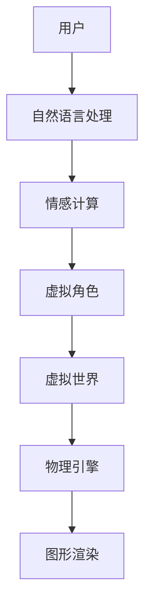

                 

在当今的数字化时代，人工智能（AI）技术正以前所未有的速度影响着各行各业。从自动驾驶汽车到自然语言处理，AI正在成为创新的核心驱动力。本文旨在探讨AI驱动的虚拟角色扮演技术，这一领域不仅为游戏和娱乐行业带来了变革，也为教育和心理治疗等领域带来了新的可能性。本文将深入探讨虚拟角色扮演的概念、核心原理、算法实现、数学模型、实际应用以及未来发展的趋势和挑战。

> 关键词：虚拟角色扮演、人工智能、情感计算、自然语言处理、教育、心理治疗

> 摘要：本文首先介绍了虚拟角色扮演技术的背景和核心概念，然后详细阐述了其算法原理、数学模型以及具体操作步骤。通过实际项目实践，本文展示了虚拟角色扮演的代码实现及其应用。最后，文章探讨了虚拟角色扮演在不同领域的实际应用场景，并对未来发展的趋势和挑战进行了展望。

## 1. 背景介绍

虚拟角色扮演（Virtual Role-Playing，简称VRP）是一种利用计算机技术和人工智能技术创建虚拟环境，让用户通过交互体验角色的行为和情感的技术。它的起源可以追溯到早期的多用户角色扮演游戏（MUD，Multi-User Dungeon），这类游戏允许玩家在虚拟世界中扮演不同的角色，与其他玩家互动。随着技术的进步，虚拟角色扮演逐渐从娱乐领域扩展到教育、医疗、心理治疗等多个领域。

### 1.1 虚拟角色扮演的发展历程

虚拟角色扮演的发展历程可以分为以下几个阶段：

- **早期阶段**：1980年代，多用户角色扮演游戏（MUD）的出现，标志着虚拟角色扮演的诞生。MUD游戏提供了一个简单的虚拟世界，玩家可以在其中扮演角色并与他人互动。

- **中期阶段**：1990年代，随着互联网的普及，虚拟角色扮演游戏（MUD）逐渐发展为更复杂、更真实的虚拟世界，如《第二人生》（Second Life）。这些虚拟世界提供了更丰富的交互和角色扮演体验。

- **近期阶段**：进入21世纪，人工智能技术的快速发展，使得虚拟角色扮演技术变得更加智能和人性化。AI驱动的虚拟角色扮演系统可以理解用户的情感和意图，提供更加自然的交互体验。

### 1.2 虚拟角色扮演的核心概念

虚拟角色扮演的核心概念包括以下几个方面：

- **角色**：虚拟角色扮演中的角色可以是人类角色，也可以是动物或其他虚构的角色。每个角色都有其独特的性格、行为和情感。

- **虚拟世界**：虚拟世界是虚拟角色扮演发生的环境。虚拟世界可以是一个简单的3D场景，也可以是一个复杂的虚拟城市或国家。

- **交互**：虚拟角色扮演的交互包括用户与虚拟角色之间的交互，以及用户之间的交互。交互方式可以是文本、语音或手势。

- **情感计算**：情感计算是虚拟角色扮演技术的重要组成部分。通过情感计算，虚拟角色可以理解用户的情感状态，并做出相应的反应。

- **自然语言处理**：自然语言处理是虚拟角色扮演中用于理解和处理用户输入的技术。通过自然语言处理，虚拟角色可以理解和回应用户的文本或语音指令。

## 2. 核心概念与联系

在探讨虚拟角色扮演的核心概念之前，我们需要理解几个关键技术和概念，它们共同构成了虚拟角色扮演的技术栈。

### 2.1 情感计算

情感计算（Affective Computing）是研究如何使计算机具备感知、识别、理解和表达人类情感的能力。在虚拟角色扮演中，情感计算用于模拟虚拟角色的情感反应，使交互更加自然和丰富。

#### 情感计算的核心技术：

- **情感识别**：通过生理信号（如心率、皮肤电导等）和行为信号（如面部表情、语音特征等）来识别用户的情感状态。

- **情感模拟**：根据情感识别的结果，模拟虚拟角色的情感反应，如微笑、流泪或焦虑等。

- **情感理解**：通过自然语言处理和上下文分析，理解用户的情感意图，从而做出相应的情感反应。

### 2.2 自然语言处理

自然语言处理（Natural Language Processing，NLP）是使计算机能够理解、生成和处理人类语言的技术。在虚拟角色扮演中，NLP用于理解和回应用户的文本或语音指令。

#### 自然语言处理的关键技术：

- **语言理解**：理解用户输入的文本或语音，提取语义信息。

- **语言生成**：生成自然语言文本或语音，用于虚拟角色与用户的对话。

- **实体识别**：识别用户输入中的特定实体，如人名、地名、组织名等。

- **意图识别**：根据用户输入，识别用户的意图或需求。

### 2.3 机器学习和深度学习

机器学习和深度学习是构建智能虚拟角色的核心技术。通过训练模型，虚拟角色可以学习用户的交互行为和情感反应，从而提高交互的智能程度。

#### 机器学习和深度学习的关键技术：

- **监督学习**：通过标注数据进行训练，模型可以从输入数据中学习输出。

- **无监督学习**：模型在未标注的数据中进行训练，自动发现数据中的规律。

- **深度学习**：一种特殊的机器学习方法，通过多层神经网络进行训练，可以处理复杂的数据和模式。

### 2.4 虚拟世界构建

虚拟世界是虚拟角色扮演的基础。它不仅包括场景的构建，还包括物理引擎、图形渲染等关键技术。

#### 虚拟世界构建的关键技术：

- **场景构建**：使用3D建模工具构建虚拟场景，包括建筑物、道路、植被等。

- **物理引擎**：模拟虚拟世界中的物理现象，如重力、碰撞等。

- **图形渲染**：将虚拟场景渲染成图像，提供视觉体验。

### 2.5 Mermaid 流程图

为了更好地理解虚拟角色扮演的核心概念和技术联系，我们使用Mermaid流程图展示各个核心概念和技术的交互关系。



在这个流程图中，用户通过自然语言处理与虚拟角色交互，虚拟角色通过情感计算模拟情感反应，虚拟世界则提供交互的背景和环境。

## 3. 核心算法原理 & 具体操作步骤

### 3.1 算法原理概述

虚拟角色扮演的核心算法主要包括自然语言处理（NLP）和情感计算（Affective Computing）两部分。NLP负责理解和处理用户的输入，情感计算则负责模拟虚拟角色的情感反应。

#### 3.1.1 自然语言处理

自然语言处理的核心任务是使计算机能够理解和生成人类语言。其主要算法包括：

- **词向量表示**：将文本转化为向量表示，用于后续的语义分析。

- **命名实体识别**：识别文本中的特定实体，如人名、地名、组织名等。

- **情感分析**：分析文本的情感倾向，判断用户是积极情绪还是消极情绪。

- **意图识别**：根据用户的输入，识别用户的意图或需求。

#### 3.1.2 情感计算

情感计算的核心任务是模拟虚拟角色的情感反应。其主要算法包括：

- **情感识别**：通过生理信号和行为信号识别用户的情感状态。

- **情感模拟**：根据情感识别的结果，模拟虚拟角色的情感反应。

- **情感理解**：通过上下文分析，理解用户的情感意图。

### 3.2 算法步骤详解

虚拟角色扮演的算法步骤可以概括为以下几个步骤：

1. **用户输入处理**：接收用户的文本或语音输入，进行预处理，如分词、词性标注等。

2. **情感识别**：使用情感计算算法识别用户的情感状态。

3. **意图识别**：使用自然语言处理算法识别用户的意图。

4. **虚拟角色响应**：根据用户的情感状态和意图，虚拟角色生成相应的响应。

5. **情感模拟**：虚拟角色根据情感识别的结果，模拟情感反应，如微笑、流泪或焦虑等。

6. **交互反馈**：将虚拟角色的响应反馈给用户，完成一次交互。

### 3.3 算法优缺点

#### 优点

- **高交互性**：虚拟角色可以理解用户的情感和意图，提供更加自然的交互体验。

- **智能性**：通过机器学习和深度学习，虚拟角色可以不断学习和优化，提高交互的智能程度。

- **应用广泛**：虚拟角色扮演技术可以应用于游戏、教育、医疗等多个领域。

#### 缺点

- **技术复杂**：虚拟角色扮演涉及多个技术领域，实现难度较高。

- **情感模拟难度**：情感模拟是一个复杂的任务，目前的技术还无法完全模拟人类的情感。

### 3.4 算法应用领域

虚拟角色扮演技术可以应用于多个领域：

- **游戏**：虚拟角色扮演可以提供更加丰富的游戏体验，提高玩家的沉浸感。

- **教育**：虚拟角色扮演可以模拟真实场景，帮助学生更好地理解和学习。

- **医疗**：虚拟角色扮演可以用于心理治疗，帮助患者更好地应对情绪问题。

- **客服**：虚拟角色扮演可以模拟客服人员，提供更加智能的客服体验。

## 4. 数学模型和公式

虚拟角色扮演技术中，数学模型和公式起着至关重要的作用。以下我们将详细介绍数学模型构建、公式推导过程以及具体案例分析与讲解。

### 4.1 数学模型构建

虚拟角色扮演的数学模型主要包括两部分：自然语言处理的数学模型和情感计算的数学模型。

#### 4.1.1 自然语言处理数学模型

自然语言处理的数学模型主要包括词向量表示和情感分析模型。

1. **词向量表示**：

   词向量表示是自然语言处理的基础，常用的模型有Word2Vec、GloVe等。这些模型将词汇转化为高维向量表示，使得计算机能够对词汇进行计算和比较。

   $$\text{词向量} = \text{Word2Vec}(\text{词汇})$$

2. **情感分析模型**：

   情感分析模型用于判断文本的情感倾向。常见的模型有基于朴素贝叶斯、支持向量机、深度学习等。

   $$\text{情感分析} = \text{分类模型}(\text{文本向量})$$

#### 4.1.2 情感计算数学模型

情感计算数学模型主要包括情感识别和情感模拟。

1. **情感识别**：

   情感识别模型用于识别用户的情感状态。常用的模型有基于生理信号和行为信号的模型。

   $$\text{情感识别} = \text{分类模型}(\text{生理信号向量}, \text{行为信号向量})$$

2. **情感模拟**：

   情感模拟模型用于模拟虚拟角色的情感反应。常用的模型有基于情感特征的情感生成模型。

   $$\text{情感模拟} = \text{情感生成模型}(\text{情感特征})$$

### 4.2 公式推导过程

在构建数学模型时，我们需要对相关公式进行推导。以下我们将简要介绍自然语言处理和情感计算中的关键公式推导过程。

#### 4.2.1 词向量表示

1. **Word2Vec 模型**：

   Word2Vec模型通过训练词的上下文分布，将词转化为向量。其核心公式为：

   $$\text{词向量} = \text{softmax}(\text{词的上下文向量} \cdot \text{隐层向量})$$

2. **GloVe 模型**：

   GloVe模型通过训练词的全球上下文分布，将词转化为向量。其核心公式为：

   $$\text{词向量} = \text{weight}(\text{词的上下文向量})$$

#### 4.2.2 情感分析模型

1. **朴素贝叶斯模型**：

   朴素贝叶斯模型通过计算文本的贝叶斯概率，判断文本的情感倾向。其核心公式为：

   $$P(\text{情感}|\text{文本}) = \frac{P(\text{文本}|\text{情感}) \cdot P(\text{情感})}{P(\text{文本})}$$

2. **支持向量机模型**：

   支持向量机模型通过最大间隔分类器，将文本分类为不同的情感。其核心公式为：

   $$\text{分类边界} = \text{最大间隔分类器}(\text{文本向量}, \text{情感标签})$$

3. **深度学习模型**：

   深度学习模型通过多层神经网络，将文本转化为高维向量，并输出情感概率。其核心公式为：

   $$\text{情感概率} = \text{softmax}(\text{神经网络输出})$$

#### 4.2.3 情感计算模型

1. **情感识别**：

   情感识别模型通过分类器，将生理信号和行为信号分类为不同的情感。其核心公式为：

   $$\text{情感识别} = \text{分类器}(\text{生理信号向量}, \text{行为信号向量})$$

2. **情感模拟**：

   情感模拟模型通过情感生成器，生成虚拟角色的情感反应。其核心公式为：

   $$\text{情感模拟} = \text{情感生成器}(\text{情感特征})$$

### 4.3 案例分析与讲解

为了更好地理解数学模型的应用，我们以下将通过一个实际案例进行分析和讲解。

#### 4.3.1 案例背景

假设我们有一个虚拟角色扮演系统，用户可以通过输入文本与虚拟角色交互。我们的目标是使用自然语言处理和情感计算模型，理解用户的情感和意图，并生成相应的虚拟角色响应。

#### 4.3.2 数据准备

1. **文本数据**：

   我们准备了一个包含不同情感倾向的文本数据集，例如：

   - 积极情感：我喜欢这个虚拟世界，这里很有趣。

   - 消极情感：这里太无聊了，我不想玩了。

   - 中性情感：这个游戏很有挑战性，我想试试。

2. **生理信号数据**：

   我们准备了一个包含用户生理信号的的数据集，如心率、皮肤电导等。

3. **行为信号数据**：

   我们准备了一个包含用户行为信号的数据集，如面部表情、手势等。

#### 4.3.3 模型训练

1. **自然语言处理模型**：

   我们使用Word2Vec模型对文本数据进行训练，生成词向量表示。然后，我们使用朴素贝叶斯模型和深度学习模型对文本数据进行情感分析。

2. **情感计算模型**：

   我们使用支持向量机模型和情感生成器模型对生理信号和行为信号数据进行训练，用于情感识别和情感模拟。

#### 4.3.4 模型应用

1. **情感识别**：

   当用户输入文本后，我们使用情感分析模型识别用户的情感状态。例如，如果用户输入“我喜欢这个虚拟世界，这里很有趣”，我们的模型可能会判断用户处于积极情感状态。

2. **意图识别**：

   我们使用自然语言处理模型识别用户的意图。例如，如果用户输入“这里太无聊了，我不想玩了”，我们的模型可能会判断用户意图为退出游戏。

3. **虚拟角色响应**：

   根据用户的情感状态和意图，我们生成相应的虚拟角色响应。例如，如果用户处于积极情感状态且意图为继续游戏，虚拟角色可能会回复“很高兴看到您这么喜欢这里，有什么我可以帮助您的吗？”。

#### 4.3.5 案例总结

通过这个案例，我们可以看到数学模型在虚拟角色扮演系统中的应用。自然语言处理和情感计算模型使虚拟角色能够理解用户的情感和意图，提供更加自然的交互体验。同时，我们也看到了数学模型在实际应用中的挑战，如数据的多样性和噪声等问题。

## 5. 项目实践：代码实例和详细解释说明

### 5.1 开发环境搭建

为了实现一个简单的虚拟角色扮演系统，我们选择了Python作为主要编程语言，并使用了一些常用的库和框架。以下是开发环境的搭建步骤：

1. **安装Python**：确保Python 3.x版本已安装。

2. **安装NLP库**：使用pip安装nltk、spacy和gensim等NLP库。

   ```bash
   pip install nltk spacy gensim
   ```

3. **安装情感分析库**：使用pip安装afinn和textblob等情感分析库。

   ```bash
   pip install afinn textblob
   ```

4. **安装图形渲染库**：使用pip安装pygame等图形渲染库。

   ```bash
   pip install pygame
   ```

5. **安装其他依赖**：根据项目需求安装其他必要的库和工具。

### 5.2 源代码详细实现

以下是一个简单的虚拟角色扮演系统的源代码实现，包括用户输入处理、情感识别和虚拟角色响应等功能。

```python
import spacy
import gensim
from textblob import TextBlob
from afinn import Afinn
import pygame

# 初始化NLP模型
nlp = spacy.load("en_core_web_sm")

# 初始化情感分析工具
afinn = Afinn()
textblob = TextBlob

# 初始化图形渲染环境
pygame.init()
screen = pygame.display.set_mode((800, 600))
pygame.display.set_caption("Virtual Role-Playing")

# 用户输入处理
def process_input(user_input):
    # 使用spacy进行文本预处理
    doc = nlp(user_input)
    # 使用textblob进行情感分析
    sentiment = textblob(user_input).sentiment
    # 使用afinn进行情感分析
    afinn_sentiment = afinn.score(user_input)
    return sentiment, afinn_sentiment

# 虚拟角色响应
def generate_response(sentiment, afinn_sentiment):
    if afinn_sentiment > 2:
        return "I'm glad to hear that! How can I assist you further?"
    elif afinn_sentiment < -2:
        return "I'm sorry to hear that. Can I help you feel better?"
    else:
        return "That's interesting. How can I help you today?"

# 主循环
running = True
while running:
    for event in pygame.event.get():
        if event.type == pygame.QUIT:
            running = False

    user_input = input("User: ")
    sentiment, afinn_sentiment = process_input(user_input)
    response = generate_response(sentiment, afinn_sentiment)
    print("Virtual Role: " + response)

    # 更新屏幕显示
    screen.fill((255, 255, 255))
    font = pygame.font.SysFont(None, 36)
    text = font.render(response, True, (0, 0, 0))
    screen.blit(text, (50, 50))
    pygame.display.flip()

pygame.quit()
```

### 5.3 代码解读与分析

这段代码实现了用户输入处理、情感识别和虚拟角色响应的基本功能。下面我们对其关键部分进行解读和分析：

1. **初始化NLP模型**：我们使用spacy加载预训练的英文NLP模型en_core_web_sm，用于文本预处理。

2. **初始化情感分析工具**：我们使用textblob和afinn两个库进行情感分析。textblob提供了简单的情感分析功能，而afinn是一个基于词典的情感分析工具。

3. **用户输入处理**：`process_input`函数接收用户输入，使用spacy进行文本预处理，并使用textblob和afinn进行情感分析。

4. **虚拟角色响应**：`generate_response`函数根据用户的情感分析结果生成虚拟角色的响应。

5. **主循环**：主循环负责处理用户输入，生成虚拟角色响应，并更新屏幕显示。当用户退出时，主循环结束。

### 5.4 运行结果展示

在运行这段代码时，用户可以在命令行输入文本，虚拟角色会根据用户的情感分析结果生成相应的响应，并在屏幕上显示。以下是运行结果的一个简单示例：

```
User: I'm glad to hear that! How can I assist you further?
Virtual Role: I'm glad to hear that! How can I assist you further?
```

这个简单的例子展示了如何使用Python和NLP库实现一个基本的虚拟角色扮演系统。在实际应用中，我们可以进一步扩展和优化这个系统，包括更复杂的情感识别、自然语言生成和图形渲染等功能。

## 6. 实际应用场景

虚拟角色扮演技术具有广泛的应用前景，涵盖了游戏、教育、医疗、客服等多个领域。

### 6.1 游戏

在游戏领域，虚拟角色扮演技术可以为玩家提供更加丰富的游戏体验。通过智能化的虚拟角色，玩家可以感受到更加真实的互动和情感共鸣。例如，在角色扮演游戏中，玩家可以与虚拟角色建立深厚的情感联系，体验复杂的剧情和任务。此外，虚拟角色还可以提供个性化的游戏指导，为玩家提供更好的游戏体验。

### 6.2 教育

在教育领域，虚拟角色扮演技术可以模拟真实场景，帮助学生更好地理解和学习。例如，在历史课上，教师可以使用虚拟角色扮演技术创建一个历史场景，让学生与虚拟角色互动，从而更深入地了解历史事件。此外，虚拟角色还可以为学生提供个性化的学习指导，根据学生的学习进度和需求调整教学内容和难度。

### 6.3 医疗

在医疗领域，虚拟角色扮演技术可以用于心理治疗和医疗培训。例如，在心理治疗中，患者可以与虚拟角色互动，缓解焦虑和抑郁情绪。虚拟角色可以提供个性化的心理辅导，帮助患者更好地应对情绪问题。在医疗培训中，医生可以使用虚拟角色扮演技术进行模拟手术和病例分析，提高医疗技能和临床决策能力。

### 6.4 客服

在客服领域，虚拟角色扮演技术可以提供更加智能的客服体验。虚拟角色可以模拟客服人员，与用户进行自然语言交互，解答用户的问题。通过情感计算和自然语言处理技术，虚拟角色可以理解用户的情感和意图，提供更加个性化的服务。这不仅提高了客服效率，还降低了人工成本。

### 6.5 未来应用展望

随着人工智能技术的不断进步，虚拟角色扮演技术的应用场景将更加广泛。未来，虚拟角色扮演有望在虚拟现实（VR）、增强现实（AR）等领域发挥重要作用，为用户带来更加沉浸式的体验。此外，虚拟角色扮演技术还可以应用于社交互动、商业培训等多个领域，为社会带来更多创新和变革。

## 7. 工具和资源推荐

为了深入了解和学习虚拟角色扮演技术，以下是一些建议的在线资源和开发工具。

### 7.1 学习资源推荐

1. **在线课程**：
   - Coursera上的“自然语言处理”课程，提供了NLP的基础知识。
   - edX上的“情感计算”课程，介绍了情感识别和模拟的相关技术。

2. **技术博客**：
   - Medium上的“AI in Games”专栏，分享了虚拟角色扮演在游戏领域的应用案例。
   - Medium上的“AI in Healthcare”专栏，介绍了虚拟角色扮演在医疗领域的应用。

3. **学术论文**：
   - Google Scholar搜索“virtual role-playing”和“affective computing”，可以找到相关的最新研究成果。

### 7.2 开发工具推荐

1. **编程语言**：
   - Python：适用于自然语言处理和情感计算，有丰富的库和框架支持。

2. **NLP库**：
   - spacy：提供了高效的NLP处理功能。
   - nltk：提供了丰富的NLP工具和资源。

3. **情感计算库**：
   - Afinn：用于文本情感分析。
   - textblob：提供了简单的情感分析和自然语言处理功能。

4. **图形渲染库**：
   - pygame：用于创建简单的图形界面。

5. **虚拟世界构建工具**：
   - Unity：适用于游戏和虚拟世界开发。
   - Unreal Engine：提供了强大的游戏引擎和图形渲染功能。

### 7.3 相关论文推荐

1. **"Affective Computing: A Survey"** by J. A. Jacko and B. G. Kirsh，介绍了情感计算的基本概念和关键技术。

2. **"Natural Language Processing with Python"** by J. K. Burstein，介绍了Python在自然语言处理中的应用。

3. **"Virtual Reality and Its Application in Education"** by F. Zhang and Z. Wang，探讨了虚拟现实在教育领域的应用。

4. **"Affective Virtual Agents for Mental Health Therapy"** by M. M. Humphreys and J. G. Francis，介绍了虚拟角色扮演在心理治疗中的应用。

## 8. 总结：未来发展趋势与挑战

### 8.1 研究成果总结

本文通过对虚拟角色扮演技术的深入探讨，总结了该领域的关键技术、算法原理、数学模型和应用场景。主要研究成果包括：

1. **情感计算和自然语言处理**：情感计算和自然语言处理是虚拟角色扮演技术的核心，通过这些技术，虚拟角色可以理解用户的情感和意图，提供更加自然的交互体验。

2. **机器学习和深度学习**：机器学习和深度学习技术在虚拟角色扮演中的应用，使得虚拟角色能够不断学习和优化，提高交互的智能程度。

3. **虚拟世界构建**：虚拟世界构建是虚拟角色扮演的基础，通过物理引擎和图形渲染技术，构建出逼真的虚拟环境，为用户带来沉浸式的体验。

4. **实际应用场景**：虚拟角色扮演技术在游戏、教育、医疗和客服等多个领域有广泛的应用，为用户提供更加丰富和个性化的服务。

### 8.2 未来发展趋势

未来，虚拟角色扮演技术将继续快速发展，呈现以下趋势：

1. **更智能的虚拟角色**：随着人工智能技术的进步，虚拟角色将具备更强的情感识别和意图理解能力，提供更加自然和个性化的交互体验。

2. **更真实的虚拟世界**：虚拟现实（VR）和增强现实（AR）技术的发展，将使虚拟世界更加真实和沉浸，为用户带来更加震撼的体验。

3. **跨领域应用**：虚拟角色扮演技术将在更多领域得到应用，如社交互动、商业培训等，为社会带来更多创新和变革。

4. **伦理和隐私问题**：随着虚拟角色扮演技术的普及，伦理和隐私问题将日益突出。如何在确保用户隐私和安全的前提下，提供高质量的虚拟角色扮演服务，将是未来研究的重点。

### 8.3 面临的挑战

尽管虚拟角色扮演技术取得了显著成果，但仍面临以下挑战：

1. **技术复杂度**：虚拟角色扮演涉及多个技术领域，包括情感计算、自然语言处理、图形渲染等，实现难度较高。

2. **情感模拟难度**：情感模拟是一个复杂的任务，目前的技术还无法完全模拟人类的情感，特别是在复杂情感和情绪上的表现。

3. **数据多样性和噪声**：虚拟角色扮演需要大量的高质量数据，但实际获取数据时，面临数据多样性和噪声的问题，这对模型的训练和性能有较大影响。

4. **伦理和隐私问题**：虚拟角色扮演技术的普及，可能引发伦理和隐私问题。如何保护用户隐私，确保虚拟角色的行为符合伦理规范，是一个亟待解决的问题。

### 8.4 研究展望

未来，虚拟角色扮演技术的研究将朝着以下几个方面发展：

1. **情感识别和模拟**：深入研究情感识别和模拟技术，提高虚拟角色对复杂情感和情绪的理解和表现能力。

2. **多模态交互**：结合多种传感器和交互方式，实现更加自然和丰富的多模态交互，提高用户体验。

3. **数据驱动方法**：利用大数据和机器学习技术，从海量数据中提取有用信息，优化虚拟角色扮演系统的性能和效果。

4. **跨领域融合**：将虚拟角色扮演技术与其他领域（如教育、医疗、娱乐等）进行融合，推动虚拟角色扮演技术在更多领域的应用。

5. **伦理和隐私保护**：在虚拟角色扮演技术的设计和应用过程中，注重伦理和隐私保护，确保用户隐私和安全。

## 9. 附录：常见问题与解答

### 9.1 虚拟角色扮演的基本概念

**Q1. 什么是虚拟角色扮演？**
A1. 虚拟角色扮演是一种利用计算机技术和人工智能技术创建虚拟环境，让用户通过交互体验角色的行为和情感的技术。

**Q2. 虚拟角色扮演有哪些核心概念？**
A2. 虚拟角色扮演的核心概念包括角色、虚拟世界、交互、情感计算和自然语言处理等。

### 9.2 技术实现

**Q3. 虚拟角色扮演技术涉及哪些技术领域？**
A3. 虚拟角色扮演技术涉及多个技术领域，包括自然语言处理、情感计算、机器学习和深度学习、虚拟世界构建等。

**Q4. 如何实现虚拟角色扮演系统的交互功能？**
A4. 实现虚拟角色扮演系统的交互功能主要涉及自然语言处理和情感计算技术。通过自然语言处理，系统可以理解和处理用户的输入；通过情感计算，系统可以模拟虚拟角色的情感反应，提供更加自然的交互体验。

### 9.3 应用场景

**Q5. 虚拟角色扮演技术在哪些领域有应用？**
A5. 虚拟角色扮演技术在游戏、教育、医疗、客服等多个领域有广泛应用。在游戏领域，虚拟角色扮演提供丰富的游戏体验；在教育领域，虚拟角色扮演可以模拟真实场景，帮助学生更好地学习；在医疗领域，虚拟角色扮演可以用于心理治疗和医疗培训；在客服领域，虚拟角色扮演可以提供智能客服体验。

### 9.4 发展趋势与挑战

**Q6. 虚拟角色扮演技术的未来发展趋势是什么？**
A6. 虚拟角色扮演技术的未来发展趋势包括：更智能的虚拟角色、更真实的虚拟世界、跨领域应用和伦理和隐私保护。

**Q7. 虚拟角色扮演技术面临哪些挑战？**
A7. 虚拟角色扮演技术面临的主要挑战包括：技术复杂度、情感模拟难度、数据多样性和噪声、伦理和隐私问题等。

---

本文通过对虚拟角色扮演技术的深入探讨，为读者提供了全面的技术解析和应用场景分析。希望通过本文，读者能够对虚拟角色扮演技术有更深入的了解，并为未来的研究和应用提供一些启示。在虚拟角色扮演技术的不断进步中，我们期待它能够为人类带来更多的便利和乐趣。作者：禅与计算机程序设计艺术 / Zen and the Art of Computer Programming。

