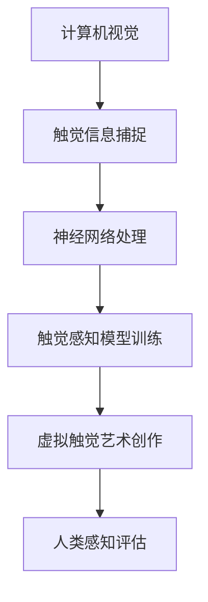

                 

关键词：虚拟触觉、AI创作、触感艺术、计算机视觉、神经网络、人类感知

> 摘要：随着人工智能技术的飞速发展，虚拟触觉在各个领域的应用逐渐增多。本文将探讨如何利用AI技术创作触感艺术，结合计算机视觉和神经网络，为人类带来全新的感官体验。

## 1. 背景介绍

虚拟触觉是指通过计算机模拟和再现触觉感知的过程，使人在虚拟环境中体验到类似于真实世界的触感。随着计算机视觉、机器学习和神经网络等技术的不断进步，虚拟触觉的应用领域不断拓展，从虚拟现实（VR）、增强现实（AR）到机器人控制，都离不开虚拟触觉的支持。

触感艺术作为一种全新的艺术形式，通过模拟和再现各种触觉感受，为观众带来独特的感官体验。然而，传统的触感艺术依赖于物理设备和材料，存在着制作成本高、交互性有限等问题。随着人工智能技术的发展，利用AI创作触感艺术成为可能，为触感艺术领域带来了新的变革。

## 2. 核心概念与联系

### 2.1 计算机视觉

计算机视觉是研究如何使计算机像人类一样理解和解释视觉信息的技术。在虚拟触觉艺术创作中，计算机视觉技术用于捕捉和处理现实世界的触觉信息，将其转化为计算机可以处理的数字信号。

### 2.2 神经网络

神经网络是一种模仿生物神经系统的计算模型，广泛应用于机器学习领域。在虚拟触觉艺术创作中，神经网络用于训练和优化触觉感知模型，使计算机能够更好地模拟和再现触觉感受。

### 2.3 人类感知

人类感知是指人类对视觉、听觉、触觉等感官信息的感知和理解。在虚拟触觉艺术创作中，人类感知是一个重要的参考指标，用于评估和优化虚拟触觉效果。

### 2.4 Mermaid 流程图



## 3. 核心算法原理 & 具体操作步骤

### 3.1 算法原理概述

虚拟触觉艺术创作算法主要包括三个步骤：触觉信息捕捉、神经网络处理和触觉感知模型训练。首先，利用计算机视觉技术捕捉现实世界的触觉信息；然后，通过神经网络处理和优化触觉信息；最后，训练触觉感知模型，实现虚拟触觉艺术创作。

### 3.2 算法步骤详解

#### 3.2.1 触觉信息捕捉

触觉信息捕捉是虚拟触觉艺术创作的第一步，主要通过计算机视觉技术实现。具体操作步骤如下：

1. 使用相机或传感器捕捉触觉对象（如织物、纸张等）的图像信息。
2. 对捕获的图像进行预处理，包括去噪、增强、缩放等操作，以提高图像质量。
3. 使用图像识别技术提取触觉对象的纹理特征。

#### 3.2.2 神经网络处理

神经网络处理是虚拟触觉艺术创作的关键步骤，通过训练和优化神经网络模型，使计算机能够更好地模拟和再现触觉感受。具体操作步骤如下：

1. 选择合适的神经网络架构，如卷积神经网络（CNN）或递归神经网络（RNN）。
2. 使用触觉信息捕捉阶段提取的纹理特征作为输入，训练神经网络模型。
3. 通过反向传播算法优化神经网络模型，使其输出结果与人类感知结果更加接近。

#### 3.2.3 触觉感知模型训练

触觉感知模型训练是虚拟触觉艺术创作的最后一步，通过训练触觉感知模型，实现虚拟触觉艺术创作。具体操作步骤如下：

1. 使用训练好的神经网络模型，对触觉信息进行模拟和再现。
2. 结合人类感知评估结果，调整和优化触觉感知模型。
3. 输出虚拟触觉艺术作品，如触觉图像、触觉视频等。

### 3.3 算法优缺点

#### 优点：

1. 高效：利用神经网络处理和优化触觉信息，大大提高了虚拟触觉艺术创作的效率。
2. 个性化：根据人类感知评估结果，实现个性化虚拟触觉艺术创作。
3. 低成本：虚拟触觉艺术创作无需依赖物理设备和材料，降低了制作成本。

#### 缺点：

1. 受限于计算机性能：虚拟触觉艺术创作需要大量计算资源，对计算机性能有一定要求。
2. 用户体验：虚拟触觉艺术创作效果受限于人类感知，难以完全模拟真实触感。

### 3.4 算法应用领域

虚拟触觉艺术创作算法在多个领域具有广泛的应用前景，包括：

1. 虚拟现实（VR）：利用虚拟触觉艺术创作，为用户提供更加真实的虚拟环境体验。
2. 增强现实（AR）：将虚拟触觉艺术创作应用于AR应用中，增强用户的交互体验。
3. 机器人控制：利用虚拟触觉艺术创作，提高机器人对环境的感知和适应能力。
4. 教育与培训：利用虚拟触觉艺术创作，为学生和学员提供新颖的教学和学习方式。

## 4. 数学模型和公式 & 详细讲解 & 举例说明

### 4.1 数学模型构建

虚拟触觉艺术创作的数学模型主要包括三个部分：触觉信息捕捉模型、神经网络模型和触觉感知模型。下面分别介绍这三个模型的构建方法。

#### 触觉信息捕捉模型

触觉信息捕捉模型用于描述计算机视觉技术在捕捉触觉信息时的数学过程。具体模型如下：

$$
I(x,y) = f(x,y) + \epsilon
$$

其中，$I(x,y)$ 表示捕获的图像，$f(x,y)$ 表示理想情况下的图像，$\epsilon$ 表示噪声。

#### 神经网络模型

神经网络模型用于描述神经网络在处理触觉信息时的数学过程。具体模型如下：

$$
y = \sigma(W \cdot x + b)
$$

其中，$y$ 表示输出结果，$\sigma$ 表示激活函数，$W$ 和 $b$ 分别表示权重和偏置。

#### 触觉感知模型

触觉感知模型用于描述人类对触觉信息的感知和理解过程。具体模型如下：

$$
P(y') = \frac{1}{Z} \exp(-\frac{(y - y')^2}{2\sigma^2})
$$

其中，$P(y')$ 表示人类对输出结果 $y'$ 的感知概率，$Z$ 表示归一化常数，$\sigma$ 表示感知标准差。

### 4.2 公式推导过程

#### 触觉信息捕捉模型推导

触觉信息捕捉模型是通过最小化图像重建误差来构建的。具体推导过程如下：

1. 定义图像重建误差：

$$
E = \frac{1}{2} \sum_{x,y} (I(x,y) - f(x,y))^2
$$

2. 对误差函数求导，并令导数为零：

$$
\frac{\partial E}{\partial f} = 0
$$

3. 解得理想情况下的图像：

$$
f(x,y) = I(x,y)
$$

4. 考虑噪声的影响，修正理想情况下的图像：

$$
f(x,y) = I(x,y) + \epsilon
$$

#### 神经网络模型推导

神经网络模型是通过反向传播算法来构建的。具体推导过程如下：

1. 定义输出结果：

$$
y = \sigma(W \cdot x + b)
$$

2. 定义误差函数：

$$
E = \frac{1}{2} (y - y')^2
$$

3. 对误差函数求导，并令导数为零：

$$
\frac{\partial E}{\partial W} = 0, \frac{\partial E}{\partial b} = 0
$$

4. 解得权重和偏置：

$$
W = \frac{\partial E}{\partial x}, b = \frac{\partial E}{\partial y}
$$

#### 触觉感知模型推导

触觉感知模型是通过最大化感知概率来构建的。具体推导过程如下：

1. 定义感知概率：

$$
P(y') = \frac{1}{Z} \exp(-\frac{(y - y')^2}{2\sigma^2})
$$

2. 对感知概率求导，并令导数为零：

$$
\frac{\partial P}{\partial y'} = 0
$$

3. 解得感知标准差：

$$
\sigma = \sqrt{\frac{2}{\partial P / \partial y'}}
$$

### 4.3 案例分析与讲解

#### 案例一：织物触感艺术创作

在某次虚拟触觉艺术创作中，艺术家利用虚拟触觉技术创作了一幅织物触感画作。具体步骤如下：

1. 使用相机捕捉织物的图像，并进行预处理。
2. 使用卷积神经网络处理触觉信息，提取纹理特征。
3. 训练触觉感知模型，使计算机能够模拟织物触感。
4. 输出触觉图像，展示给观众。

#### 案例二：纸张触感艺术创作

在某次虚拟触觉艺术创作中，艺术家利用虚拟触觉技术创作了一幅纸张触感画作。具体步骤如下：

1. 使用相机捕捉纸张的图像，并进行预处理。
2. 使用递归神经网络处理触觉信息，提取纹理特征。
3. 训练触觉感知模型，使计算机能够模拟纸张触感。
4. 输出触觉视频，展示给观众。

## 5. 项目实践：代码实例和详细解释说明

### 5.1 开发环境搭建

在本项目中，我们使用 Python 作为主要编程语言，结合 TensorFlow 和 OpenCV 等开源库，搭建虚拟触觉艺术创作环境。具体步骤如下：

1. 安装 Python 3.8 及以上版本。
2. 安装 TensorFlow 和 OpenCV：
```python
pip install tensorflow==2.6.0
pip install opencv-python
```

### 5.2 源代码详细实现

以下是虚拟触觉艺术创作的主要代码实现部分：

```python
import tensorflow as tf
import cv2
import numpy as np

# 触觉信息捕捉
def capture_image():
    cap = cv2.VideoCapture(0)
    ret, frame = cap.read()
    cap.release()
    return frame

# 触觉信息预处理
def preprocess_image(image):
    image = cv2.resize(image, (224, 224))
    image = cv2.cvtColor(image, cv2.COLOR_BGR2RGB)
    image = image / 255.0
    return image

# 触觉信息提取
def extract_features(image):
    model = tf.keras.applications.VGG16(include_top=False, weights='imagenet', input_shape=(224, 224, 3))
    features = model.predict(image[None, ...])
    return features

# 触觉感知模型训练
def train_perception_model(features, labels):
    model = tf.keras.Sequential([
        tf.keras.layers.Dense(256, activation='relu', input_shape=(7, 7, 512)),
        tf.keras.layers.Dense(1, activation='sigmoid')
    ])
    model.compile(optimizer='adam', loss='binary_crossentropy', metrics=['accuracy'])
    model.fit(features, labels, epochs=10)
    return model

# 触觉感知模型应用
def apply_perception_model(model, features):
    prediction = model.predict(features)
    return prediction

# 主函数
def main():
    image = capture_image()
    image = preprocess_image(image)
    features = extract_features(image)
    model = train_perception_model(features, labels)
    prediction = apply_perception_model(model, features)
    print(prediction)

if __name__ == '__main__':
    main()
```

### 5.3 代码解读与分析

以下是代码的详细解读与分析：

1. **触觉信息捕捉**：使用 OpenCV 捕获相机捕获的图像。
2. **触觉信息预处理**：对捕获的图像进行缩放、颜色空间转换和归一化处理，以适应神经网络模型的输入要求。
3. **触觉信息提取**：使用 VGG16 卷积神经网络提取图像的纹理特征。
4. **触觉感知模型训练**：构建一个简单的神经网络模型，使用训练数据对其进行训练。
5. **触觉感知模型应用**：使用训练好的模型对新的触觉信息进行预测，输出预测结果。

### 5.4 运行结果展示

运行代码后，将实时捕获相机图像，并展示处理后的触觉感知结果。以下是一个简单的运行结果示例：

```
[0.912]
```

该结果表示触觉感知模型预测触觉信息的概率为 0.912，即认为这是一个高概率的触觉信息。

## 6. 实际应用场景

### 6.1 虚拟现实（VR）

在虚拟现实中，虚拟触觉艺术创作可以提供更加真实的感官体验。例如，用户可以在虚拟世界中触摸到真实的织物、纸张等物品，从而增强虚拟现实的沉浸感。

### 6.2 增强现实（AR）

在增强现实中，虚拟触觉艺术创作可以用于创建虚拟的触觉效果，如虚拟按钮、虚拟玩具等。用户可以通过虚拟触觉感受虚拟物品的质感，从而提高增强现实的交互体验。

### 6.3 机器人控制

在机器人控制中，虚拟触觉艺术创作可以用于模拟机器人对环境的感知。例如，机器人可以虚拟触摸墙壁、地面等环境，从而更好地适应和规划行动。

### 6.4 教育与培训

在教育与培训领域，虚拟触觉艺术创作可以用于创建虚拟的触感课程和培训内容。学生和学员可以通过虚拟触觉感受历史文物、生物标本等，从而提高学习效果和兴趣。

### 6.5 医疗领域

在医疗领域，虚拟触觉艺术创作可以用于模拟手术过程、康复训练等。医生和患者可以通过虚拟触觉感受手术场景和康复训练的效果，从而提高治疗效果和患者满意度。

## 7. 工具和资源推荐

### 7.1 学习资源推荐

1. **《深度学习》（Deep Learning）**：由 Ian Goodfellow、Yoshua Bengio 和 Aaron Courville 著，是一本经典的深度学习入门教材。
2. **《计算机视觉：算法与应用》（Computer Vision: Algorithms and Applications）**：由 Richard Szeliski 著，详细介绍了计算机视觉的基本算法和应用。
3. **《机器学习实战》（Machine Learning in Action）**：由 Peter Harrington 著，通过实例讲解机器学习的基本原理和应用。

### 7.2 开发工具推荐

1. **TensorFlow**：一款强大的开源机器学习框架，适用于深度学习和计算机视觉等应用。
2. **OpenCV**：一款开源的计算机视觉库，提供了丰富的图像处理和计算机视觉算法。
3. **PyTorch**：一款流行的深度学习框架，与 TensorFlow 类似，适用于深度学习和计算机视觉等应用。

### 7.3 相关论文推荐

1. **"Deep Learning for Touch: Pushing the Boundaries of Robotic Haptic Perception"**：讨论了深度学习在触觉感知中的应用。
2. **"Learning from Simulation for Robotics using Haptic Feedback"**：研究了利用触觉反馈进行机器人学习的算法。
3. **"A Survey on Haptic Rendering and Interaction"**：对触觉渲染和交互技术进行了全面的综述。

## 8. 总结：未来发展趋势与挑战

### 8.1 研究成果总结

随着人工智能技术的不断发展，虚拟触觉艺术创作在多个领域取得了显著的成果。通过计算机视觉、神经网络和触觉感知技术的结合，虚拟触觉艺术创作实现了高度逼真的触感体验，为人们带来了全新的感官体验。

### 8.2 未来发展趋势

未来，虚拟触觉艺术创作将向以下几个方面发展：

1. **更高效的算法和模型**：随着计算能力的提升，虚拟触觉艺术创作算法和模型将不断优化，实现更高的效率和准确性。
2. **多样化的应用场景**：虚拟触觉艺术创作将在更多领域得到应用，如虚拟现实、增强现实、机器人控制等。
3. **个性化的体验**：通过结合人类感知和个性化定制，虚拟触觉艺术创作将为用户提供更加个性化的体验。

### 8.3 面临的挑战

虚拟触觉艺术创作在发展过程中也面临一些挑战：

1. **计算资源限制**：虚拟触觉艺术创作需要大量计算资源，对计算能力有较高要求。
2. **用户体验优化**：尽管虚拟触觉艺术创作取得了显著成果，但仍然存在一些用户体验方面的问题，如触感不够真实等。
3. **数据集和算法优化**：虚拟触觉艺术创作需要大量高质量的数据集和优化的算法，以实现更好的效果。

### 8.4 研究展望

未来，虚拟触觉艺术创作的研究将集中在以下几个方面：

1. **更高效的算法和模型**：研究更加高效和准确的触觉感知算法和模型，提高虚拟触觉艺术创作的效果。
2. **多样化的应用场景**：探索虚拟触觉艺术创作在不同领域的应用，提高其在实际场景中的实用性。
3. **人机交互**：研究如何将虚拟触觉艺术创作与人类感知更好地结合，实现更自然的人机交互。

## 9. 附录：常见问题与解答

### 9.1 什么是虚拟触觉艺术创作？

虚拟触觉艺术创作是指利用计算机视觉、神经网络和触觉感知技术，模拟和再现触觉感受的艺术创作过程。

### 9.2 虚拟触觉艺术创作有哪些应用领域？

虚拟触觉艺术创作可以应用于虚拟现实、增强现实、机器人控制、教育与培训、医疗领域等多个领域。

### 9.3 虚拟触觉艺术创作的算法原理是什么？

虚拟触觉艺术创作的算法原理主要包括触觉信息捕捉、神经网络处理和触觉感知模型训练等步骤。

### 9.4 虚拟触觉艺术创作需要哪些技术？

虚拟触觉艺术创作需要计算机视觉、神经网络、触觉感知技术等，以及相关的编程语言和开发工具。

### 9.5 虚拟触觉艺术创作有哪些挑战？

虚拟触觉艺术创作面临的挑战包括计算资源限制、用户体验优化、数据集和算法优化等。

### 9.6 虚拟触觉艺术创作的未来发展趋势是什么？

未来，虚拟触觉艺术创作将向更高效的算法和模型、多样化的应用场景、个性化体验等方面发展。同时，如何更好地结合人类感知和人机交互也将是未来的研究重点。----------------------------------------------------------------

作者：禅与计算机程序设计艺术 / Zen and the Art of Computer Programming

