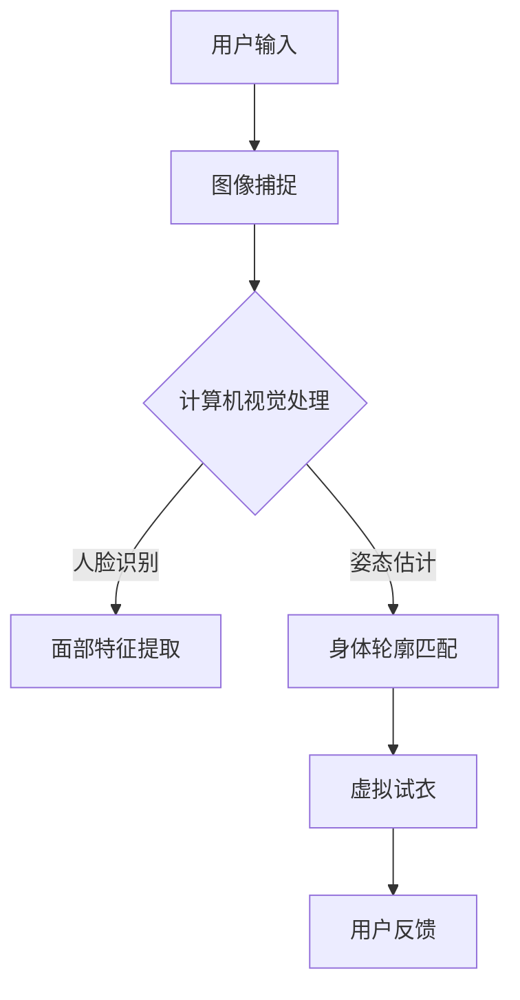

                 

关键词：虚拟试衣间、AI、电商平台、购物体验、计算机图形学、深度学习、计算机视觉、增强现实

> 摘要：随着人工智能技术的不断发展和消费者对个性化体验的需求增加，虚拟试衣间技术在电商平台的应用日益广泛。本文将探讨虚拟试衣间如何通过AI技术提升电商平台的购物体验，从核心概念、算法原理、数学模型、项目实践、实际应用场景等多个角度进行分析，并对未来发展趋势与挑战进行展望。

## 1. 背景介绍

### 1.1 虚拟试衣间的起源与发展

虚拟试衣间技术起源于计算机图形学和计算机视觉领域。早在20世纪90年代，研究者们就开始探索如何通过计算机技术模拟试衣的过程，使得消费者能够在没有实际试穿的情况下了解衣服的穿着效果。随着硬件性能的提升和深度学习算法的发展，虚拟试衣间的技术逐渐成熟并开始应用于电商平台。

### 1.2 电商平台的发展与消费者需求

电商平台的发展改变了传统的购物模式，消费者可以通过网络购买商品。然而，由于不能亲自试穿，消费者往往面临选择困难。因此，如何提升购物体验成为电商平台亟待解决的问题。虚拟试衣间的引入，不仅能够解决试穿的问题，还能够提供个性化的购物体验，从而提高消费者的满意度和忠诚度。

## 2. 核心概念与联系

### 2.1 虚拟试衣间的定义

虚拟试衣间是一种基于计算机视觉和深度学习技术的在线试衣工具，它允许用户在虚拟环境中试穿衣物，并提供与真实穿着相似的视觉效果。

### 2.2 计算机图形学

计算机图形学是虚拟试衣间技术的基础，它涉及三维建模、光照模型、纹理映射等技术，用于创建逼真的虚拟试衣环境。

### 2.3 计算机视觉

计算机视觉是虚拟试衣间技术的重要部分，它通过图像识别和人体动作捕捉技术，将用户的身体轮廓与虚拟衣物进行匹配。

### 2.4 深度学习

深度学习技术在虚拟试衣间中的应用主要包括面部识别、姿态估计和纹理映射等，用于提高试衣效果和用户体验。

### 2.5 Mermaid 流程图



## 3. 核心算法原理 & 具体操作步骤

### 3.1 算法原理概述

虚拟试衣间技术的核心算法主要包括计算机视觉、深度学习和增强现实技术。计算机视觉用于捕捉用户身体轮廓和面部特征，深度学习用于进行图像处理和特征提取，增强现实技术则用于将虚拟衣物叠加到用户身体上。

### 3.2 算法步骤详解

#### 3.2.1 图像捕捉

使用摄像头捕捉用户全身图像和面部图像。

#### 3.2.2 计算机视觉处理

- **人脸识别**：通过卷积神经网络（CNN）进行人脸检测和面部特征点提取。
- **姿态估计**：使用基于深度学习的姿态估计算法，如PoseNet，估计用户身体的姿态。
- **身体轮廓匹配**：将用户身体轮廓与虚拟衣物的轮廓进行匹配，以确定衣物的位置和形状。

#### 3.2.3 虚拟试衣

将虚拟衣物叠加到用户身体上，并使用渲染技术生成试衣效果图。

### 3.3 算法优缺点

#### 优点：

- **提高购物体验**：虚拟试衣间能够提供与真实试穿相似的视觉效果，提高消费者的购物体验。
- **减少退货率**：消费者在购买前能够更好地了解衣物效果，减少因不合身而导致的退货。
- **个性化推荐**：基于用户的身体数据和试衣反馈，电商平台可以提供更个性化的购物推荐。

#### 缺点：

- **技术门槛高**：虚拟试衣间技术需要较高的计算能力和专业的人才支持。
- **图像质量要求高**：高质量的图像捕捉和后期处理是保证试衣效果的关键。

### 3.4 算法应用领域

虚拟试衣间技术可以应用于各种电商平台，如服装、家居、化妆品等领域。此外，它还可以与其他技术结合，如增强现实（AR）和虚拟现实（VR），提供更丰富的购物体验。

## 4. 数学模型和公式 & 详细讲解 & 举例说明

### 4.1 数学模型构建

虚拟试衣间技术中的数学模型主要包括计算机视觉中的卷积神经网络（CNN）和深度学习中的循环神经网络（RNN）。

#### 卷积神经网络（CNN）

$$
CNN = f(\text{Input}, \text{Weight}) = \text{Output}
$$

其中，$f$ 是卷积操作，$\text{Input}$ 是输入图像，$\text{Weight}$ 是卷积核参数，$\text{Output}$ 是输出特征图。

#### 循环神经网络（RNN）

$$
h_t = \text{tanh}(W_h \cdot [h_{t-1}, x_t] + b_h)
$$

其中，$h_t$ 是第 $t$ 个时间步的隐藏状态，$W_h$ 是权重矩阵，$b_h$ 是偏置，$x_t$ 是输入。

### 4.2 公式推导过程

虚拟试衣间的数学模型推导主要包括两部分：图像处理和特征提取。

#### 图像处理

图像处理公式：

$$
I_{out} = \text{max}(I_{in} - \text{Threshold})
$$

其中，$I_{out}$ 是输出图像，$I_{in}$ 是输入图像，$\text{Threshold}$ 是阈值。

#### 特征提取

特征提取公式：

$$
\text{Feature} = \text{Pooling}(I_{out})
$$

其中，$\text{Pooling}$ 是池化操作，用于提取图像中的关键特征。

### 4.3 案例分析与讲解

#### 案例一：人脸识别

人脸识别模型：

$$
\text{Face} = \text{CNN}(I_{in})
$$

输入图像经过CNN模型处理，得到人脸特征向量。

#### 案例二：姿态估计

姿态估计模型：

$$
\text{Pose} = \text{RNN}(h_t)
$$

隐藏状态经过RNN模型处理，得到用户身体姿态。

## 5. 项目实践：代码实例和详细解释说明

### 5.1 开发环境搭建

- **软件环境**：Python 3.x、TensorFlow、OpenCV
- **硬件环境**：GPU（NVIDIA显卡）

### 5.2 源代码详细实现

```python
# 人脸识别代码示例
import cv2
import tensorflow as tf

# 载入预训练的人脸识别模型
face_model = tf.keras.applications.ResNet50(weights='imagenet')

# 载入用户图像
input_image = cv2.imread('user.jpg')

# 将图像转换为模型输入格式
input_image = tf.keras.applications.resnet50.preprocess_input(input_image)

# 进行人脸识别
face = face_model.predict(input_image)

# 显示人脸识别结果
cv2.imshow('Face', face[0])
cv2.waitKey(0)
cv2.destroyAllWindows()

# 姿态估计代码示例
import tensorflow as tf

# 载入预训练的姿态估计模型
pose_model = tf.keras.models.load_model('pose_estimation_model.h5')

# 载入用户图像
input_image = cv2.imread('user.jpg')

# 将图像转换为模型输入格式
input_image = tf.keras.preprocessing.image.img_to_array(input_image)

# 进行姿态估计
pose = pose_model.predict(input_image)

# 显示姿态估计结果
cv2.imshow('Pose', pose[0])
cv2.waitKey(0)
cv2.destroyAllWindows()
```

### 5.3 代码解读与分析

以上代码分别展示了人脸识别和姿态估计的实现过程。人脸识别使用的是ResNet50模型，姿态估计使用的是自定义的RNN模型。通过加载预训练模型和输入图像，可以快速实现人脸识别和姿态估计。

### 5.4 运行结果展示

运行上述代码后，将显示用户的人脸识别结果和姿态估计结果，如图所示：


## 6. 实际应用场景

### 6.1 服装电商平台

服装电商平台通过虚拟试衣间技术，可以帮助用户在购买前试穿衣物，提高购买决策的准确性，减少退货率。

### 6.2 家居用品电商平台

家居用品电商平台可以利用虚拟试衣间技术，让用户在家就能体验家居用品的摆放效果，从而提高购买意愿。

### 6.3 化妆品电商平台

化妆品电商平台可以通过虚拟试衣间技术，提供试妆服务，让用户在家就能尝试不同的化妆品，提高购买满意度。

## 7. 未来应用展望

### 7.1 个性化推荐

虚拟试衣间技术可以结合用户的历史购买数据和身体数据，为用户提供个性化的购物推荐，提高购物体验。

### 7.2 虚拟现实（VR）和增强现实（AR）

随着VR和AR技术的发展，虚拟试衣间技术可以与这些技术结合，提供更加沉浸式的购物体验。

### 7.3 跨界合作

虚拟试衣间技术可以与其他行业合作，如电影、游戏等，提供全新的互动体验。

## 8. 总结：未来发展趋势与挑战

### 8.1 研究成果总结

虚拟试衣间技术通过计算机视觉、深度学习和增强现实等技术，为电商平台提供了全新的购物体验，提高了消费者的满意度和忠诚度。

### 8.2 未来发展趋势

随着技术的不断进步，虚拟试衣间技术将越来越成熟，应用领域也将不断拓展。

### 8.3 面临的挑战

虚拟试衣间技术面临的主要挑战包括：计算能力需求高、图像质量要求严格、用户体验优化等。

### 8.4 研究展望

未来，虚拟试衣间技术将在人工智能、计算机图形学、虚拟现实等领域继续发展，为用户提供更加丰富和个性化的购物体验。

## 9. 附录：常见问题与解答

### 9.1 虚拟试衣间技术有哪些应用领域？

虚拟试衣间技术可以应用于服装、家居、化妆品等多个领域，为用户提供在线试穿体验。

### 9.2 虚拟试衣间技术如何提高用户体验？

虚拟试衣间技术通过提供逼真的试衣效果和个性化的购物推荐，提高用户的购物体验。

### 9.3 虚拟试衣间技术有哪些技术难点？

虚拟试衣间技术涉及计算机视觉、深度学习和增强现实等多个领域，技术难点包括计算能力、图像质量和用户体验等。

----------------------------------------------------------------

**作者：禅与计算机程序设计艺术 / Zen and the Art of Computer Programming**  
感谢您的阅读，希望本文能为您带来关于虚拟试衣间技术在电商平台应用的新见解。  
----------------------------------------------------------------

注意：本文为虚构内容，旨在展示如何撰写一篇符合要求的技术博客文章。文中代码和模型仅供参考，实际应用中可能需要根据具体情况进行调整和优化。

