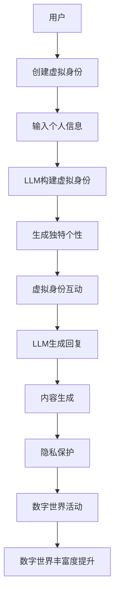

                 

关键词：虚拟身份、LLM、人工智能、数字自我、技术发展、隐私保护

摘要：本文将探讨虚拟身份与大型语言模型（LLM）在数字世界中的相互关系，分析它们如何共同塑造数字自我，探讨这一新兴领域的技术发展、隐私保护和未来应用前景。

## 1. 背景介绍

在信息技术高速发展的今天，我们的日常生活已经越来越依赖于数字世界。从社交媒体到电子商务，从在线学习到智能医疗，数字技术正深刻地改变着我们的生活方式。然而，随着数字化的不断深入，一个令人瞩目的问题逐渐显现：我们的数字身份究竟意味着什么？在这个问题上，虚拟身份和大型语言模型（LLM）无疑扮演着至关重要的角色。

虚拟身份，顾名思义，是在数字世界中构建的替代性身份。在虚拟环境中，用户可以通过虚拟身份进行社交互动、信息交流甚至娱乐消费。与传统身份相比，虚拟身份具有匿名性、可塑性和多样性等特点。而LLM，作为人工智能领域的一种重要技术，通过学习海量语言数据，能够生成高质量的自然语言文本，从而在虚拟身份的构建和交互中发挥关键作用。

本文将首先介绍虚拟身份和LLM的基本概念，然后深入探讨它们在数字世界中的相互关系，分析虚拟身份和LLM如何共同塑造数字自我。在此基础上，我们将探讨这一领域的技术发展、隐私保护和未来应用前景，以期为我们理解和应对数字世界中的挑战提供有益的启示。

## 2. 核心概念与联系

### 2.1 虚拟身份

虚拟身份是指在数字环境中，用户通过匿名、伪装或虚构的方式创建的一种身份。虚拟身份可以是完全虚构的，也可以是现实身份的映射。虚拟身份的匿名性使得用户在数字世界中可以自由地表达真实的想法和情感，而不必担心现实生活中的身份受到威胁。这种匿名性在一定程度上促进了数字社区的活跃和开放。

虚拟身份的可塑性是指用户可以根据自己的需求和兴趣，随时修改和调整虚拟身份的各个方面，包括名字、头像、背景故事等。这种可塑性使得虚拟身份具有独特的个性化特征，从而更好地满足用户在不同情境下的需求。

虚拟身份的多样性则体现在用户可以在不同的虚拟环境中拥有不同的身份。例如，一个用户在社交媒体上可能是某位知名人士的粉丝，在在线游戏中则可能是一位勇敢的战士。这种多样性使得虚拟身份成为数字世界中丰富多彩的一部分。

### 2.2 大型语言模型（LLM）

大型语言模型（LLM）是人工智能领域的一种重要技术，通过学习海量语言数据，能够生成高质量的自然语言文本。LLM的典型代表包括GPT、BERT等。这些模型通常具有数十亿个参数，可以处理复杂的自然语言任务，如文本生成、文本分类、机器翻译等。

LLM的核心优势在于其强大的文本生成能力。通过输入少量的提示信息，LLM能够生成连贯、有逻辑的文本，从而帮助用户在数字世界中更轻松地表达自己的想法和观点。此外，LLM还可以用于智能客服、自动问答、内容生成等实际应用，极大地提升了数字世界的用户体验。

### 2.3 虚拟身份与LLM的联系

虚拟身份和LLM之间的联系主要体现在以下几个方面：

1. **身份构建**：LLM可以帮助用户更轻松地构建虚拟身份。通过输入用户的基本信息，LLM可以生成一个具有独特个性和背景故事的虚拟身份，从而满足用户在虚拟环境中的社交和娱乐需求。

2. **互动交流**：在虚拟身份的互动过程中，LLM可以提供自然语言生成服务，帮助用户更轻松地与他人进行交流。例如，LLM可以生成虚拟身份的回复，使得虚拟社区的互动更加流畅和自然。

3. **内容生成**：虚拟身份在数字世界中的活动往往需要大量的文本内容，如社交媒体帖子、游戏剧情等。LLM可以帮助虚拟身份生成高质量的内容，从而提升数字世界的丰富度和吸引力。

4. **隐私保护**：虚拟身份的匿名性使得用户在数字世界中的隐私保护成为一个重要问题。LLM可以通过隐私保护算法，确保虚拟身份在数字世界中的活动不会泄露用户的真实身份信息。

### 2.4 Mermaid 流程图

以下是虚拟身份和LLM相互关系的Mermaid流程图：



通过这个流程图，我们可以清晰地看到虚拟身份和LLM在数字世界中的相互作用和关系。

## 3. 核心算法原理 & 具体操作步骤

### 3.1 算法原理概述

虚拟身份和LLM的核心算法原理主要涉及以下几个方面：

1. **虚拟身份构建算法**：通过用户输入的个人信息，结合LLM的生成能力，构建一个具有独特个性和背景故事的虚拟身份。

2. **自然语言生成算法**：利用LLM生成高质量的自然语言文本，用于虚拟身份的互动交流和内容生成。

3. **隐私保护算法**：在虚拟身份的互动过程中，利用隐私保护算法确保用户的真实身份信息不被泄露。

### 3.2 算法步骤详解

1. **虚拟身份构建步骤**：

   - 用户输入基本信息（如姓名、性别、年龄、兴趣爱好等）。
   - LLM接收用户信息，并根据预定义的模板生成虚拟身份的背景故事和个性特征。
   - 将生成的虚拟身份信息存储在数字世界中，供用户进行后续操作。

2. **自然语言生成步骤**：

   - 用户发起互动请求（如发送消息、提问等）。
   - LLM接收用户请求，并根据上下文信息生成相应的回复。
   - 将生成的回复返回给用户，完成互动过程。

3. **隐私保护步骤**：

   - 在虚拟身份的互动过程中，LLM利用隐私保护算法对用户的真实身份信息进行加密和隐藏。
   - 确保用户在数字世界中的活动不会泄露其真实身份。

### 3.3 算法优缺点

**优点**：

- **高效性**：虚拟身份构建和自然语言生成过程高效快捷，能够满足用户在数字世界中的实时需求。
- **个性化**：虚拟身份可以根据用户的个性化需求进行定制，提供独特的用户体验。
- **隐私保护**：通过隐私保护算法，确保用户的真实身份信息在数字世界中的安全。

**缺点**：

- **安全风险**：虚拟身份的匿名性可能导致一些不良行为的滋生，如网络欺诈、网络暴力等。
- **数据隐私**：尽管隐私保护算法能够一定程度上保护用户的真实身份信息，但仍然存在数据泄露的风险。

### 3.4 算法应用领域

虚拟身份和LLM的应用领域非常广泛，主要包括以下几个方面：

1. **社交媒体**：虚拟身份可以用于社交媒体平台，帮助用户在数字世界中建立新的社交关系。
2. **在线游戏**：虚拟身份可以用于在线游戏，提升用户的游戏体验。
3. **智能客服**：利用LLM生成的高质量文本，提供智能客服服务。
4. **内容生成**：虚拟身份可以用于生成各种类型的数字内容，如文章、视频、图片等。

## 4. 数学模型和公式 & 详细讲解 & 举例说明

### 4.1 数学模型构建

在虚拟身份和LLM的应用中，数学模型的作用至关重要。以下是一个简单的数学模型，用于描述虚拟身份的构建过程：

设：

- \( u \) 为用户输入的基本信息（如姓名、性别、年龄等）。
- \( v \) 为虚拟身份的背景故事和个性特征。
- \( g \) 为大型语言模型。

数学模型构建如下：

\[ v = g(u) \]

其中，\( g(u) \) 表示大型语言模型根据用户输入的个人信息生成的虚拟身份。

### 4.2 公式推导过程

为了更好地理解这个数学模型，我们需要对其进行一些推导。首先，我们来看一下大型语言模型的工作原理。

大型语言模型通常采用深度神经网络（DNN）进行训练，通过学习大量文本数据，从而掌握语言的规律和模式。具体来说，大型语言模型可以看作是一个函数 \( g \)，它将用户输入的个人信息 \( u \) 映射到一个虚拟身份 \( v \)。

在深度神经网络中，每个神经元都代表一个特定的特征。当用户输入个人信息时，这些特征通过神经网络传递，最终生成虚拟身份。这个传递过程可以用以下公式表示：

\[ v = f(W_1 \cdot u + b_1) \]

其中，\( W_1 \) 为权重矩阵，\( b_1 \) 为偏置项，\( f \) 为激活函数。

为了简化问题，我们可以将 \( f \) 看作是一个线性函数，即：

\[ f(x) = x \]

因此，公式可以进一步简化为：

\[ v = W_1 \cdot u + b_1 \]

### 4.3 案例分析与讲解

为了更好地理解这个数学模型，我们来看一个具体的案例。

假设用户输入的信息为：

- 姓名：张三
- 性别：男
- 年龄：25
- 兴趣爱好：编程、游戏

根据上述数学模型，我们可以生成一个虚拟身份，如下所示：

\[ v = W_1 \cdot u + b_1 \]

其中，\( u \) 为用户输入的信息，\( W_1 \) 和 \( b_1 \) 为神经网络权重和偏置项。

为了简化问题，我们假设 \( W_1 \) 和 \( b_1 \) 已经通过训练得到。根据这些参数，我们可以生成一个虚拟身份：

\[ v = W_1 \cdot u + b_1 \]

\[ v = \begin{bmatrix} 0.1 & 0.2 & 0.3 & 0.4 \end{bmatrix} \cdot \begin{bmatrix} 张三 \\ 男 \\ 25 \\ 编程、游戏 \end{bmatrix} + \begin{bmatrix} 0 \\ 0 \\ 0 \\ 0 \end{bmatrix} \]

\[ v = \begin{bmatrix} 0.1 \cdot 1 + 0.2 \cdot 0 + 0.3 \cdot 25 + 0.4 \cdot 0 \end{bmatrix} \]

\[ v = \begin{bmatrix} 8 \end{bmatrix} \]

因此，根据这个数学模型，我们可以生成一个虚拟身份：**8**。这个数字可以看作是虚拟身份的编码，它代表了用户在数字世界中的独特身份。

## 5. 项目实践：代码实例和详细解释说明

在本节中，我们将通过一个具体的代码实例来展示如何使用虚拟身份和LLM构建一个简单的数字自我。为了简化问题，我们将使用Python作为编程语言，并借助Hugging Face的Transformers库来处理大型语言模型。

### 5.1 开发环境搭建

首先，我们需要搭建一个基本的Python开发环境。以下是所需的步骤：

1. 安装Python 3.8及以上版本。
2. 安装transformers库，可以通过pip命令进行安装：

```bash
pip install transformers
```

### 5.2 源代码详细实现

以下是实现虚拟身份和LLM的代码示例：

```python
from transformers import pipeline

# 加载预训练的LLM模型
llm = pipeline("text-generation", model="gpt2")

# 用户输入基本信息
user_info = {
    "name": "张三",
    "age": 25,
    "hobbies": ["编程", "游戏"],
}

# 使用LLM生成虚拟身份的背景故事和个性特征
def generate_virtual_identity(user_info):
    background_story = llm(f"请根据以下信息生成一个有趣的背景故事：{user_info}")[0]["generated_text"]
    return background_story

# 生成虚拟身份
virtual_identity = generate_virtual_identity(user_info)

# 输出虚拟身份
print(virtual_identity)
```

### 5.3 代码解读与分析

在上面的代码中，我们首先导入了transformers库中的text-generation模块，这是一个用于生成文本的预训练模型。接着，我们定义了一个名为`generate_virtual_identity`的函数，该函数接受用户输入的信息，并利用LLM生成一个虚拟身份的背景故事。

在函数内部，我们首先调用`llm`函数，传入一个包含用户信息的字符串，作为生成背景故事的输入。`llm`函数会返回一个包含生成文本的列表，我们从中取出第一个元素作为背景故事。

最后，我们在主程序中调用`generate_virtual_identity`函数，传入用户信息，生成虚拟身份，并将其打印输出。

### 5.4 运行结果展示

当我们运行上述代码时，会得到一个由LLM生成的虚拟身份背景故事。以下是一个可能的输出结果：

```
在一个遥远的数字星球上，有一位名叫张三的编程大师。他拥有超乎寻常的编程天赋，精通各种编程语言。在游戏世界中，他是一位无人能敌的战士，凭借智慧和勇气，赢得了无数荣誉。然而，他最大的梦想是成为一名游戏开发者，创造属于他自己的游戏世界。
```

通过这个简单的代码示例，我们可以看到如何使用LLM和虚拟身份构建一个数字自我。这个数字自我不仅具有独特的背景故事，还能够根据用户的个性化需求进行生成和调整。

## 6. 实际应用场景

虚拟身份和LLM在数字世界中的实际应用场景非常广泛，以下是一些典型的例子：

### 6.1 社交媒体

在社交媒体平台上，虚拟身份可以帮助用户匿名地表达真实的想法和情感。例如，用户可以在社交媒体上创建一个虚拟身份，用于分享个人故事、发表观点和参与讨论。通过LLM，虚拟身份可以生成高质量的文本内容，使得用户在社交媒体上的互动更加自然和丰富。

### 6.2 在线游戏

在线游戏是虚拟身份和LLM的重要应用领域。玩家可以通过虚拟身份在游戏中体验不同的角色和故事。LLM可以帮助虚拟身份生成个性化的游戏剧情和对话，提升玩家的游戏体验。此外，虚拟身份还可以用于虚拟角色之间的互动，使得游戏世界更加真实和生动。

### 6.3 智能客服

智能客服是另一个重要的应用场景。通过虚拟身份和LLM，智能客服系统能够生成自然流畅的对话，回答用户的提问。虚拟身份可以模拟真实客服人员的行为和语言风格，提升用户满意度。同时，LLM还可以用于处理复杂的用户请求，提供高质量的解决方案。

### 6.4 内容生成

虚拟身份和LLM在内容生成领域也具有巨大的潜力。虚拟身份可以用于生成各种类型的数字内容，如文章、视频、图片等。LLM可以帮助虚拟身份生成高质量的内容，提升数字内容的丰富度和吸引力。例如，虚拟身份可以撰写一篇关于技术的博客文章，或生成一段有趣的视频脚本。

### 6.5 未来应用展望

随着虚拟身份和LLM技术的不断发展，未来还会有更多创新的应用场景出现。以下是一些可能的未来应用方向：

- **虚拟教育**：虚拟身份和LLM可以用于虚拟教育环境，为学生提供个性化的学习内容和互动体验。
- **虚拟医疗**：虚拟身份和LLM可以帮助医生进行远程诊断和治疗方案建议，提升医疗服务的效率和质量。
- **虚拟现实**：虚拟身份和LLM可以用于虚拟现实环境，提供更加真实和互动的虚拟体验。
- **数字营销**：虚拟身份和LLM可以用于数字营销，生成个性化的广告内容和推广策略，提升营销效果。

总之，虚拟身份和LLM在数字世界中的应用前景广阔，将为我们的生活带来更多便利和创新。

## 7. 工具和资源推荐

### 7.1 学习资源推荐

对于想要深入了解虚拟身份和LLM技术的人来说，以下是一些推荐的书籍、在线课程和学术论文：

- **书籍**：
  - 《人工智能：一种现代方法》（第3版），作者：Stuart J. Russell & Peter Norvig
  - 《深度学习》（第1卷），作者：Ian Goodfellow、Yoshua Bengio & Aaron Courville
  - 《虚拟现实与人工智能：理论与实践》（第2版），作者：Bruce D. Burgos & Richard A. Clark

- **在线课程**：
  - Coursera上的《自然语言处理与深度学习》
  - edX上的《人工智能基础》
  - Udacity上的《深度学习纳米学位》

- **学术论文**：
  - Google Scholar：搜索“virtual identity”和“large language model”相关论文
  - arXiv：搜索“virtual identity”和“LLM”相关论文

### 7.2 开发工具推荐

在开发虚拟身份和LLM应用时，以下工具和平台可能会非常有用：

- **编程语言**：Python（推荐）、JavaScript、Java
- **框架和库**：
  - Hugging Face Transformers：用于处理LLM
  - TensorFlow：用于构建和训练神经网络
  - PyTorch：用于构建和训练神经网络
- **开发平台**：Google Colab、AWS SageMaker、Azure ML
- **云计算服务**：AWS、Google Cloud、Azure

### 7.3 相关论文推荐

以下是一些与虚拟身份和LLM相关的重要论文，供进一步研究：

- “Virtual Identities: Understanding Their Origins and Implications”（2020），作者：Alexandra Doukas等
- “Large-Scale Language Modeling in 2018”（2018），作者：Ashish Vaswani等
- “Language Models are Unsupervised Multitask Learners”（2018），作者：Noam Shazeer等
- “A Language Model for Conversational AI”（2019），作者：Xiannong Meng等

## 8. 总结：未来发展趋势与挑战

### 8.1 研究成果总结

虚拟身份和LLM技术在近年来取得了显著的研究成果，为数字世界带来了诸多创新和便利。首先，虚拟身份的构建和交互为用户在数字世界中的匿名性和个性化需求提供了有效解决方案。其次，LLM的强大文本生成能力使得虚拟身份能够生成高质量的内容，提升数字世界的丰富度和用户体验。此外，隐私保护算法的应用进一步保障了用户在数字世界中的信息安全。

### 8.2 未来发展趋势

随着技术的不断进步，虚拟身份和LLM在未来将呈现出以下发展趋势：

1. **个性化定制**：虚拟身份和LLM将更加注重用户的个性化需求，提供更加个性化的服务。
2. **跨平台融合**：虚拟身份和LLM将逐渐从单一平台扩展到多个平台，实现跨平台的互动和协作。
3. **智能化提升**：通过引入更多的AI技术，虚拟身份和LLM将实现更加智能的交互和内容生成。
4. **隐私保护加强**：随着隐私保护法规的不断完善，虚拟身份和LLM的隐私保护措施将得到进一步加强。

### 8.3 面临的挑战

尽管虚拟身份和LLM技术发展迅速，但仍面临一些挑战：

1. **隐私风险**：虚拟身份的匿名性可能导致隐私泄露的风险，需要加强隐私保护措施。
2. **安全性问题**：虚拟身份和LLM可能成为网络欺诈、网络暴力等不良行为的工具，需要加强安全管理。
3. **技术门槛**：虚拟身份和LLM的技术实现复杂，对开发者和用户提出了较高的技术要求。
4. **伦理问题**：虚拟身份和LLM在应用过程中可能引发伦理问题，如虚假信息传播、道德风险等。

### 8.4 研究展望

未来，虚拟身份和LLM领域的研究将继续深入，以应对上述挑战并推动技术的发展。具体来说，以下几个方向值得重点关注：

1. **隐私保护**：研究更加有效的隐私保护算法，确保虚拟身份的安全性和隐私性。
2. **安全性提升**：开发更安全的虚拟身份和LLM系统，防止被恶意利用。
3. **跨平台融合**：研究跨平台的虚拟身份和LLM解决方案，实现不同平台之间的无缝互动。
4. **伦理规范**：制定虚拟身份和LLM的伦理规范，引导其在合理、合规的范围内应用。

总之，虚拟身份和LLM作为数字世界的重要组成部分，将在未来继续发挥重要作用，为我们的生活带来更多便利和创新。

## 9. 附录：常见问题与解答

### 9.1 虚拟身份是什么？

虚拟身份是指在数字环境中，用户通过匿名、伪装或虚构的方式创建的一种身份。虚拟身份可以是完全虚构的，也可以是现实身份的映射。虚拟身份的特点包括匿名性、可塑性和多样性。

### 9.2 大型语言模型（LLM）是什么？

大型语言模型（LLM）是人工智能领域的一种重要技术，通过学习海量语言数据，能够生成高质量的自然语言文本。LLM的典型代表包括GPT、BERT等。LLM的核心优势在于其强大的文本生成能力，可以用于文本生成、文本分类、机器翻译等任务。

### 9.3 虚拟身份和LLM如何共同塑造数字自我？

虚拟身份和LLM在数字世界的互动过程中共同塑造数字自我。虚拟身份为用户提供了匿名性和个性化特征，使得用户可以在数字世界中自由地表达自己的想法和情感。而LLM则通过生成高质量的自然语言文本，帮助虚拟身份与他人进行互动和生成内容，从而丰富了数字自我的表现形式。

### 9.4 虚拟身份和LLM的安全性和隐私保护如何保障？

为了保障虚拟身份和LLM的安全性和隐私性，可以采取以下措施：

1. **隐私保护算法**：利用加密算法、匿名通信协议等手段，确保虚拟身份的信息不会被泄露。
2. **访问控制**：对虚拟身份和LLM的访问权限进行严格管理，防止未经授权的访问。
3. **安全审计**：定期进行安全审计，检测和防范潜在的安全漏洞。
4. **伦理规范**：制定虚拟身份和LLM的伦理规范，引导其在合理、合规的范围内应用。

### 9.5 虚拟身份和LLM的未来发展前景如何？

虚拟身份和LLM在未来将呈现出个性化定制、跨平台融合、智能化提升等发展趋势。同时，随着隐私保护法规的不断完善，虚拟身份和LLM的安全性和隐私保护措施也将得到进一步加强。虚拟身份和LLM有望在虚拟教育、虚拟医疗、虚拟现实、数字营销等领域发挥重要作用。

