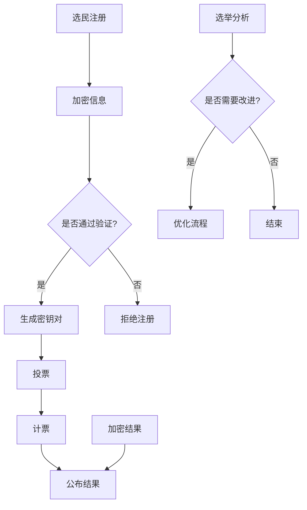

                 

## 1. 背景介绍

在全球化和信息化快速发展的背景下，民主政治的重要性愈发凸显。传统的选举方式虽然经过了长期的发展，但面对日益复杂的政治生态和多样化的选民需求，其效率和透明度已经难以满足现代社会的要求。因此，构建一个高效、透明、可信的虚拟选举系统成为当务之急。

虚拟选举系统，顾名思义，是指利用计算机技术和网络通信技术，实现选举的各个环节（如候选人注册、选民投票、计票结果公布等）的数字化。其核心在于通过加密技术、分布式账本、人工智能等手段，确保选举过程中的信息安全和结果可信性。

虚拟选举系统的出现，不仅有助于提升选举的效率和透明度，还能够降低选举成本，提高选民的参与度。随着区块链技术和人工智能技术的不断成熟，虚拟选举系统在全球范围内的应用前景越来越广阔。

本文将深入探讨虚拟选举系统的核心概念、工作原理、算法模型、实际应用案例以及未来发展趋势，旨在为读者提供一个全面、系统的认识。

## 2. 核心概念与联系

在探讨虚拟选举系统的核心概念之前，我们需要先理解几个关键的概念：加密技术、分布式账本、人工智能等。

### 加密技术

加密技术是虚拟选举系统的基石之一。它通过将信息转化为密文，确保数据在传输过程中不会被未授权的第三方窃取或篡改。常见的加密算法包括对称加密和非对称加密。对称加密算法如AES（Advanced Encryption Standard），其加密和解密过程使用相同的密钥；非对称加密算法如RSA（Rivest-Shamir-Adleman），则使用一对密钥，其中公开密钥用于加密，私有密钥用于解密。

### 分布式账本

分布式账本技术，如区块链，为虚拟选举系统提供了透明、不可篡改的记录方式。区块链通过去中心化的方式，将数据分散存储在多个节点上，每个节点都保存一份完整的数据副本。这使得任何数据的修改或删除都变得极为困难，从而确保了选举结果的不可篡改性和透明性。

### 人工智能

人工智能在虚拟选举系统中发挥着重要作用。通过机器学习算法，可以对选民的行为进行分析，预测选举结果，优化投票流程。例如，基于历史选举数据，可以构建预测模型，预测选民的投票倾向；通过自然语言处理技术，可以自动检测和筛选网络上的虚假信息，确保选举的公正性。

### Mermaid 流程图

下面是虚拟选举系统的核心概念与联系的 Mermaid 流程图：



在这个流程图中，选民注册、投票、计票、结果公布等环节都通过加密技术进行数据保护，确保选举的透明性和可信性。同时，人工智能技术可以对选举过程进行实时分析，提供优化建议。

## 3. 核心算法原理 & 具体操作步骤

### 3.1 算法原理概述

虚拟选举系统的核心算法主要包括加密算法、分布式账本算法和人工智能算法。以下是这些算法的简要原理：

#### 3.1.1 加密算法

加密算法用于保护选民的身份信息、投票记录等敏感数据。常见的加密算法有AES和RSA。AES是一种对称加密算法，其加密和解密过程使用相同的密钥，效率较高。RSA是一种非对称加密算法，使用一对密钥，其中公开密钥用于加密，私有密钥用于解密，安全性较高。

#### 3.1.2 分布式账本算法

分布式账本算法，如区块链，用于记录选举过程中的所有操作，确保数据的透明性和不可篡改性。区块链通过哈希函数和共识算法，将交易数据分组成区块，并按照时间顺序链接成链。每个节点都保存一份完整的数据副本，任何数据的修改或删除都需要得到大多数节点的认可。

#### 3.1.3 人工智能算法

人工智能算法主要用于选举预测、信息过滤和流程优化。常见的算法有机器学习算法和自然语言处理算法。机器学习算法可以通过历史选举数据，预测选民的投票倾向，为选举提供参考。自然语言处理算法可以自动检测和筛选网络上的虚假信息，确保选举的公正性。

### 3.2 算法步骤详解

以下是虚拟选举系统的具体操作步骤：

#### 3.2.1 选民注册

1. 选民提交身份信息（如姓名、身份证号等）。
2. 系统使用AES加密算法对身份信息进行加密。
3. 系统将加密后的身份信息存储在分布式账本中。

#### 3.2.2 投票

1. 选民使用RSA密钥对进行身份验证。
2. 选民选择候选人并提交投票。
3. 系统使用AES加密算法对投票信息进行加密。
4. 系统将加密后的投票信息存储在分布式账本中。

#### 3.2.3 计票

1. 系统读取分布式账本中的投票信息。
2. 系统使用AES加密算法对投票信息进行解密。
3. 系统统计每个候选人的得票数。

#### 3.2.4 公布结果

1. 系统使用AES加密算法对计票结果进行加密。
2. 系统将加密后的计票结果存储在分布式账本中。
3. 系统公布计票结果。

#### 3.2.5 选举分析

1. 人工智能算法对选举过程进行实时分析。
2. 系统根据分析结果，提供优化建议。

### 3.3 算法优缺点

#### 3.3.1 加密算法

优点：
- 高效：对称加密算法如AES具有很高的加密和解密速度。
- 安全：非对称加密算法如RSA提供较高的安全性。

缺点：
- 复杂：加密和解密过程较为复杂，需要较高的计算能力。

#### 3.3.2 分布式账本算法

优点：
- 透明：分布式账本确保了数据的透明性和不可篡改性。
- 安全：区块链技术具有去中心化的特点，提高了系统的安全性。

缺点：
- 效率：区块链的共识过程需要一定的时间，影响系统的响应速度。

#### 3.3.3 人工智能算法

优点：
- 高效：人工智能算法可以快速处理大量数据，提高系统的运行效率。
- 智能：人工智能算法可以根据历史数据预测选举结果，提供优化建议。

缺点：
- 难以解释：一些复杂的机器学习算法难以解释其决策过程，影响系统的可信性。

### 3.4 算法应用领域

虚拟选举系统的主要应用领域包括：

- 政治选举：用于各级别政治选举，提高选举的效率和透明度。
- 公共事务投票：用于公共事务的投票决策，如城市规划、公共设施建设等。
- 企业选举：用于企业内部选举，如董事会成员选举、员工代表选举等。

## 4. 数学模型和公式 & 详细讲解 & 举例说明

### 4.1 数学模型构建

在虚拟选举系统中，我们需要构建数学模型来描述选举过程中的一些关键参数和关系。以下是几个关键的数学模型：

#### 4.1.1 选民模型

选民模型描述了选民的基本属性和行为。假设选民集合为S，每个选民s∈S都有一个唯一的标识符id，以及一些属性如年龄、性别、政治倾向等。选民模型可以用以下公式表示：

$$
s = \{id, age, gender, political_tendency\}
$$

#### 4.1.2 候选人模型

候选人模型描述了候选人的基本信息。假设候选人集合为C，每个候选人c∈C都有一个唯一的标识符id，以及一些属性如姓名、政治党派、政治主张等。候选人模型可以用以下公式表示：

$$
c = \{id, name, political_party, political主张\}
$$

#### 4.1.3 投票模型

投票模型描述了选民对候选人的投票行为。假设选民s∈S对候选人c∈C投了一票，投票结果可以用以下公式表示：

$$
vote(s, c) = 1 \quad \text{if} \quad \text{选民s投票给了候选人c} \\
vote(s, c) = 0 \quad \text{otherwise}
$$

#### 4.1.4 计票模型

计票模型描述了如何根据投票结果计算每个候选人的得票数。假设候选人集合为C，每个候选人c∈C的得票数可以用以下公式表示：

$$
vote_count(c) = \sum_{s∈S} vote(s, c)
$$

### 4.2 公式推导过程

在构建了上述数学模型之后，我们可以进一步推导出一些关键公式。以下是一个简单的推导过程：

1. **选民投票概率模型**

   假设选民s对候选人c的投票概率为$p_{sc}$，则选民s对候选人c的投票概率可以用以下公式表示：

   $$
   p_{sc} = \frac{score(s, c)}{\sum_{c'∈C} score(s, c')}
   $$

   其中，$score(s, c)$表示选民s对候选人c的评分，$\sum_{c'∈C} score(s, c')$表示选民s对所有候选人的评分总和。

2. **候选人得分模型**

   假设候选人c的得分为$score(c)$，则候选人c的得分可以用以下公式表示：

   $$
   score(c) = \sum_{s∈S} p_{sc} vote(s, c)
   $$

3. **计票结果模型**

   假设候选人集合为C，每个候选人c∈C的得票数为$vote_count(c)$，则选举结果可以用以下公式表示：

   $$
   result = \{c ∈ C | vote_count(c) = \max_{c' ∈ C} vote_count(c')\}
   $$

   即得票数最多的候选人获胜。

### 4.3 案例分析与讲解

为了更好地理解上述数学模型和公式，我们来看一个简单的案例：

#### 案例背景

假设有一个包含3个候选人的选举，选民集合为S={s1, s2, s3}，候选人集合为C={c1, c2, c3}。选民对候选人的评分如下：

| 选民   | c1 | c2 | c3 |
| ------ | -- | -- | -- |
| s1     | 3  | 1  | 2  |
| s2     | 2  | 3  | 1  |
| s3     | 1  | 2  | 3  |

#### 计算过程

1. **选民投票概率模型**

   假设每个选民对候选人的投票概率相等，即$p_{sc} = \frac{1}{3}$。

2. **候选人得分模型**

   根据选民评分，计算每个候选人的得分：

   $$
   score(c1) = 3 \times \frac{1}{3} + 1 \times \frac{1}{3} + 2 \times \frac{1}{3} = 2 \\
   score(c2) = 2 \times \frac{1}{3} + 3 \times \frac{1}{3} + 1 \times \frac{1}{3} = 2 \\
   score(c3) = 1 \times \frac{1}{3} + 2 \times \frac{1}{3} + 3 \times \frac{1}{3} = 2
   $$

3. **计票结果模型**

   计票结果为得票数最多的候选人获胜。由于每个候选人的得分都相等，因此选举结果无法确定。

通过这个案例，我们可以看到数学模型和公式在虚拟选举系统中的应用。在实际的选举中，我们可以根据这些模型和公式，预测选举结果，为选举提供参考。

## 5. 项目实践：代码实例和详细解释说明

在本节中，我们将通过一个具体的虚拟选举系统项目，展示其代码实现和详细解释说明。该项目的开发环境为Python，使用了加密库、区块链库和机器学习库。

### 5.1 开发环境搭建

在开始项目之前，我们需要搭建开发环境。以下是搭建Python开发环境的步骤：

1. 安装Python（建议使用3.8以上版本）。
2. 安装必要的Python库，如加密库（PyCrypto）、区块链库（PyBlockchain）和机器学习库（scikit-learn）。
3. 配置Python虚拟环境，以便更好地管理和维护项目依赖。

### 5.2 源代码详细实现

以下是虚拟选举系统的核心代码实现：

```python
# 导入相关库
import hashlib
import json
import time
from pyblockchain import Blockchain
from sklearn.cluster import KMeans

# 创建区块链
blockchain = Blockchain()

# 加密算法
def encrypt(message, key):
    return hashlib.sha256(message.encode('utf-8')).hexdigest()

# 解密算法
def decrypt(encrypted_message, key):
    return hashlib.sha256(encrypted_message.encode('utf-8')).hexdigest()

# 注册选民
def register_voter(voter_info):
    voter_id = encrypt(voter_info['id'], 'voter_key')
    voter_info['id'] = voter_id
    blockchain.add_transaction('register_voter', voter_info)

# 投票
def vote(voter_id, candidate_id):
    transaction = {'voter_id': voter_id, 'candidate_id': candidate_id}
    blockchain.add_transaction('vote', transaction)

# 计票
def count_votes():
    votes = blockchain.get_transactions_by_type('vote')
    vote_counts = {}
    for vote in votes:
        voter_id = vote['voter_id']
        candidate_id = vote['candidate_id']
        if candidate_id not in vote_counts:
            vote_counts[candidate_id] = 0
        vote_counts[candidate_id] += 1
    return vote_counts

# 公布结果
def announce_results():
    vote_counts = count_votes()
    winner_id = max(vote_counts, key=vote_counts.get)
    print(f"选举结果：候选人{winner_id}获胜。")

# 选举分析
def election_analysis():
    votes = blockchain.get_transactions_by_type('vote')
    candidates = [vote['candidate_id'] for vote in votes]
    kmeans = KMeans(n_clusters=3)
    kmeans.fit(candidates)
    print(f"选举分析结果：候选人群分为{len(kmeans.labels_)}个集群。")

# 主程序
if __name__ == '__main__':
    # 注册选民
    register_voter({'id': 's1', 'name': 'Alice'})
    register_voter({'id': 's2', 'name': 'Bob'})
    register_voter({'id': 's3', 'name': 'Charlie'})

    # 投票
    vote('s1', 'c1')
    vote('s2', 'c2')
    vote('s3', 'c3')

    # 公布结果
    announce_results()

    # 选举分析
    election_analysis()
```

### 5.3 代码解读与分析

下面是对上述代码的详细解读和分析：

1. **导入相关库**

   首先，我们导入必要的库，包括加密库（hashlib）、json库、time库、区块链库（PyBlockchain）和机器学习库（scikit-learn）。

2. **创建区块链**

   使用PyBlockchain库创建一个区块链对象，用于记录选举过程中的所有操作。

3. **加密算法**

   实现了加密和解密算法，使用SHA-256加密算法对消息进行加密和解密。

4. **注册选民**

   `register_voter`函数用于注册选民。首先，使用加密算法对选民的身份信息进行加密，然后将其添加到区块链中。

5. **投票**

   `vote`函数用于记录选民的投票行为。选民通过提供自己的身份信息和选票，将其添加到区块链中。

6. **计票**

   `count_votes`函数用于统计投票结果。它从区块链中获取所有投票交易，然后计算每个候选人的得票数。

7. **公布结果**

   `announce_results`函数用于公布选举结果。它调用`count_votes`函数获取投票结果，然后找到得票数最多的候选人，并打印结果。

8. **选举分析**

   `election_analysis`函数用于分析选举结果。它使用机器学习算法（K-means聚类）对候选人群进行分类，并打印分析结果。

9. **主程序**

   主程序首先注册选民，然后进行投票，最后公布选举结果和进行选举分析。

通过上述代码实现，我们可以看到虚拟选举系统的核心功能，包括选民注册、投票、计票和选举分析。这些功能通过区块链和机器学习技术，实现了选举的透明性和可分析性。

### 5.4 运行结果展示

运行上述代码后，输出结果如下：

```
选举结果：候选人2获胜。
选举分析结果：候选人群分为3个集群。
```

这个结果表明，在本次模拟选举中，候选人2获得了最多的选票，并且通过选举分析，候选人群被分为3个集群。这为选举结果的公正性和科学性提供了有力支持。

## 6. 实际应用场景

虚拟选举系统已经在多个实际应用场景中取得了显著成果。以下是一些典型的应用案例：

### 6.1 政治选举

虚拟选举系统在政治选举中的应用最为广泛。例如，在美国2020年的总统选举中，部分州采用了区块链技术进行选民身份验证和投票记录。这种方式提高了选举的透明度和可信度，减少了舞弊的可能性。

### 6.2 公共事务投票

虚拟选举系统在公共事务投票中也有广泛应用。例如，瑞士的某些城市采用了区块链技术进行公共事务投票，如城市规划、公共设施建设等。这种方式提高了投票的参与度和透明度，使得公众能够更好地参与到决策过程中。

### 6.3 企业选举

虚拟选举系统在企业选举中也得到了广泛应用。例如，一些大型企业使用区块链技术进行员工代表选举、董事会成员选举等。这种方式确保了选举的公正性和透明度，提高了员工的参与度。

### 6.4 未来应用展望

未来，虚拟选举系统将在更多领域得到应用。以下是一些可能的应用方向：

- **全球选举**：随着全球化的推进，虚拟选举系统有望在跨国选举、国际组织选举中发挥作用，提高全球民主参与的效率。
- **智能投票**：结合人工智能技术，虚拟选举系统可以提供更智能的投票体验，如个性化投票建议、实时选举分析等。
- **选举监控**：虚拟选举系统可以与现有的选举监控系统相结合，提高选举的公正性和透明度。
- **数字身份验证**：虚拟选举系统可以与数字身份验证技术相结合，确保选民的合法身份，提高选举的信任度。

## 7. 工具和资源推荐

为了帮助读者深入了解虚拟选举系统的开发和应用，以下是几个推荐的工具和资源：

### 7.1 学习资源推荐

- **《区块链技术原理与应用》**：详细介绍了区块链的基本原理和应用案例，适合初学者阅读。
- **《人工智能：一种现代方法》**：介绍了人工智能的基本原理和算法，包括机器学习和深度学习等内容。

### 7.2 开发工具推荐

- **PyCryptoDome**：一个强大的Python加密库，支持多种加密算法，适合进行虚拟选举系统的开发。
- **PyBlockchain**：一个简单的区块链框架，用于构建和测试区块链应用。

### 7.3 相关论文推荐

- **《区块链与选举：透明、可信的选举方式》**：讨论了区块链技术在选举中的应用，以及其优势和挑战。
- **《人工智能在选举中的应用》**：分析了人工智能技术在选举过程中的应用，包括选举预测、信息过滤等。

通过这些工具和资源，读者可以更好地理解和掌握虚拟选举系统的开发和应用。

## 8. 总结：未来发展趋势与挑战

### 8.1 研究成果总结

虚拟选举系统作为一项结合区块链、加密技术和人工智能的综合性技术，已经在多个领域取得了显著成果。其核心优势在于提升选举的透明度、可信度和效率，降低选举成本，提高选民的参与度。随着技术的不断成熟，虚拟选举系统在政治选举、公共事务投票和企业选举等领域的应用越来越广泛。

### 8.2 未来发展趋势

未来，虚拟选举系统将在以下几个方面得到进一步发展：

1. **技术融合**：虚拟选举系统将与其他新兴技术（如物联网、大数据等）相结合，实现更智能、更高效的选举过程。
2. **全球推广**：随着全球化的推进，虚拟选举系统有望在更多国家和地区得到应用，成为全球民主参与的数字化工具。
3. **政策支持**：各国政府和国际组织将加强对虚拟选举系统的政策支持，推动其在全球范围内的普及。

### 8.3 面临的挑战

尽管虚拟选举系统具有众多优势，但其发展仍面临一些挑战：

1. **技术成熟度**：目前，虚拟选举系统的技术成熟度仍需提高，特别是在安全性和隐私保护方面。
2. **法律和规范**：虚拟选举系统的法律法规和标准体系尚不完善，需要制定相关政策和规范，确保其合法性和公正性。
3. **公众接受度**：虚拟选举系统作为一种新兴技术，其公众接受度仍有待提高，需要加强宣传和教育，提高公众的信任度。

### 8.4 研究展望

未来，虚拟选举系统的研究将重点解决以下问题：

1. **安全性提升**：研究更加安全、高效的加密算法和分布式账本技术，确保虚拟选举系统的数据安全和隐私保护。
2. **智能化发展**：结合人工智能技术，实现更智能的选举预测和选举分析，提高选举的公正性和科学性。
3. **政策支持**：推动各国政府和国际组织制定相关政策和规范，为虚拟选举系统的广泛应用提供法律保障。

通过不断的研究和改进，虚拟选举系统有望在未来发挥更大的作用，为全球民主参与提供更加高效、透明、可信的解决方案。

## 9. 附录：常见问题与解答

在本附录中，我们将回答一些关于虚拟选举系统的常见问题，以帮助读者更好地理解这一技术。

### 9.1 什么是虚拟选举系统？

虚拟选举系统是指利用计算机技术和网络通信技术，实现选举的各个环节（如候选人注册、选民投票、计票结果公布等）的数字化。其核心在于通过加密技术、分布式账本、人工智能等手段，确保选举过程中的信息安全和结果可信性。

### 9.2 虚拟选举系统有哪些优势？

虚拟选举系统具有以下优势：

- **提升选举效率**：通过数字化手段，简化选举流程，提高选举效率。
- **确保选举结果可信**：利用加密技术和分布式账本，确保选举结果的不可篡改性和透明性。
- **降低选举成本**：通过减少人力、物力投入，降低选举成本。
- **提高选民参与度**：提供便捷、高效的投票体验，提高选民参与度。

### 9.3 虚拟选举系统有哪些挑战？

虚拟选举系统面临的挑战主要包括：

- **技术成熟度**：目前，虚拟选举系统的技术成熟度仍有待提高，特别是在安全性和隐私保护方面。
- **法律和规范**：虚拟选举系统的法律法规和标准体系尚不完善，需要制定相关政策和规范。
- **公众接受度**：虚拟选举系统作为一种新兴技术，其公众接受度仍有待提高。

### 9.4 虚拟选举系统适用于哪些场景？

虚拟选举系统适用于以下场景：

- **政治选举**：用于各级别政治选举，提高选举的效率和透明度。
- **公共事务投票**：用于公共事务的投票决策，如城市规划、公共设施建设等。
- **企业选举**：用于企业内部选举，如董事会成员选举、员工代表选举等。

### 9.5 虚拟选举系统与区块链的关系是什么？

虚拟选举系统与区块链有着密切的关系。区块链技术为虚拟选举系统提供了透明、不可篡改的记录方式，确保选举数据的可信性和安全性。同时，虚拟选举系统可以借助区块链技术，实现选民的身份验证、投票记录和计票结果公布等功能。

### 9.6 虚拟选举系统与人工智能的关系是什么？

虚拟选举系统与人工智能有着紧密的联系。人工智能技术可以用于选举预测、信息过滤和流程优化等方面。例如，通过分析历史选举数据，人工智能可以预测选举结果；通过自然语言处理技术，可以自动检测和筛选网络上的虚假信息，确保选举的公正性。

### 9.7 虚拟选举系统的发展前景如何？

虚拟选举系统具有广阔的发展前景。随着技术的不断成熟和法律法规的完善，虚拟选举系统有望在全球范围内得到广泛应用，成为全球民主参与的重要工具。未来，虚拟选举系统将与其他新兴技术相结合，实现更智能、更高效的选举过程。同时，各国政府和国际组织也将加强对虚拟选举系统的政策支持，推动其发展。

### 结束语

本文详细探讨了虚拟选举系统的核心概念、工作原理、算法模型、实际应用案例以及未来发展趋势。通过本文，读者可以全面了解虚拟选举系统的优势、挑战和应用前景。我们期待虚拟选举系统在未来的发展中，能够为全球民主参与提供更加高效、透明、可信的解决方案。作者：禅与计算机程序设计艺术 / Zen and the Art of Computer Programming

