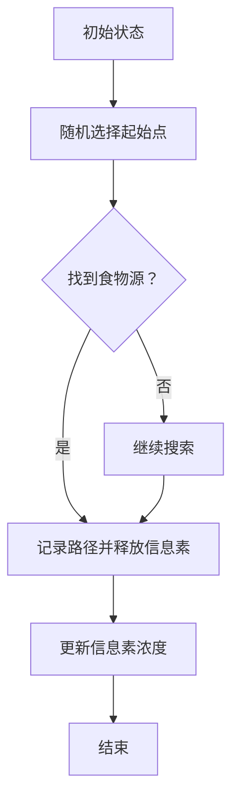

                 

关键词：蚁群算法，优化，分布式计算，智能搜索，算法原理，代码实例

摘要：本文将深入探讨蚁群算法（Ant Colony Optimization, ACO）的基本原理及其在解决组合优化问题中的应用。我们将从背景介绍开始，详细描述ACO的核心概念、数学模型、算法步骤及其优缺点，并通过一个实际的项目实例进行代码实现和分析。

## 1. 背景介绍

蚁群算法是由Marco Dorigo在1992年提出的，它是一种基于自然界中蚂蚁觅食行为的分布式优化算法。蚂蚁在寻找食物的过程中，会释放一种称为信息素的化学物质，这种物质能够影响其他蚂蚁的路径选择。蚁群算法的核心思想是模拟这一过程，通过蚂蚁在搜索路径上释放和更新信息素来引导整个群体找到最优路径或解决方案。

蚁群算法最早用于解决组合优化问题，如旅行商问题（Travelling Salesman Problem, TSP）、车辆路径问题（Vehicle Routing Problem, VRP）等。由于其良好的性能和广泛的应用前景，ACO已经成为现代智能优化算法的重要组成部分。

## 2. 核心概念与联系

### 2.1 蚂蚁的觅食行为

在蚁群算法中，蚂蚁的觅食行为是通过以下三个基本过程实现的：

1. **信息素更新**：蚂蚁在路径上释放信息素，信息素浓度随时间衰减。
2. **信息素扩散**：信息素在路径间扩散，形成信息素梯度。
3. **路径选择**：蚂蚁基于信息素梯度和随机性选择下一个路径。

### 2.2 Mermaid 流程图

下面是一个简单的 Mermaid 流程图，展示了蚁群算法的基本流程：



## 3. 核心算法原理 & 具体操作步骤

### 3.1 算法原理概述

蚁群算法通过以下几个关键步骤来优化问题：

1. **构建初始解**：随机初始化蚂蚁的起点。
2. **路径选择**：蚂蚁根据信息素梯度和随机因素选择下一个路径。
3. **信息素更新**：蚂蚁在路径上释放信息素，并根据路径长度更新信息素浓度。
4. **迭代过程**：重复上述步骤，直到满足停止条件（如达到最大迭代次数或找到最优解）。

### 3.2 算法步骤详解

1. **初始化**：
   - 设置蚂蚁的数量和起始点。
   - 初始化信息素矩阵。

2. **路径选择**：
   - 对于每只蚂蚁，根据当前路径上的信息素浓度和剩余食物量，计算选择下一个路径的概率。
   - 根据概率随机选择下一个路径。

3. **信息素更新**：
   - 对于每只蚂蚁，根据路径长度和蚂蚁的数量更新路径上的信息素浓度。
   - 信息素浓度随时间衰减。

4. **迭代**：
   - 重复路径选择和信息素更新步骤，直到满足停止条件。

### 3.3 算法优缺点

**优点**：
- 能够处理大规模的优化问题。
- 不依赖于问题的具体结构，适用范围广。
- 具有自适应性和鲁棒性。

**缺点**：
- 迭代次数较多，计算时间较长。
- 易于陷入局部最优解。

### 3.4 算法应用领域

蚁群算法广泛应用于以下领域：
- 旅行商问题（TSP）
- 车辆路径问题（VRP）
- 航线规划
- 基站定位
- 资源分配

## 4. 数学模型和公式

### 4.1 数学模型构建

蚁群算法的数学模型主要包括两部分：信息素更新规则和路径选择规则。

1. **信息素更新规则**：

   $$\tau_{ij}(t) = (1 - \rho) \tau_{ij}(t-1) + \sum_{k=1}^{m} \Delta \tau_{ij}^k(t)$$

   其中，$\tau_{ij}(t)$表示时间t时刻路径$(i, j)$上的信息素浓度，$\rho$是信息素衰减系数，$\Delta \tau_{ij}^k(t)$是第$k$只蚂蚁在路径$(i, j)$上释放的信息素量。

2. **路径选择规则**：

   $$P_{ij}(t) = \frac{\left[\tau_{ij}(t)\right]^\alpha \left[\eta_{ij}\right]^\beta}{\sum_{k=1}^{m} \left[\tau_{ij}(t)\right]^\alpha \left[\eta_{ij}\right]^\beta}$$

   其中，$P_{ij}(t)$表示蚂蚁选择路径$(i, j)$的概率，$\alpha$和$\beta$分别是信息素和能见度的权重系数，$\eta_{ij}$表示路径$(i, j)$的能见度。

### 4.2 公式推导过程

蚁群算法的推导过程基于对蚂蚁觅食行为的模拟。我们可以通过以下步骤来推导出上述的数学模型：

1. **信息素更新**：

   蚂蚁在路径上释放信息素，信息素浓度随着时间衰减。我们假设信息素衰减系数为$\rho$，那么在时间$t$时刻，路径$(i, j)$上的信息素浓度可以表示为：

   $$\tau_{ij}(t) = (1 - \rho) \tau_{ij}(t-1)$$

2. **信息素释放**：

   假设第$k$只蚂蚁在路径$(i, j)$上释放的信息素量为$\Delta \tau_{ij}^k(t)$，那么在时间$t$时刻，路径$(i, j)$上的信息素浓度将更新为：

   $$\tau_{ij}(t) = (1 - \rho) \tau_{ij}(t-1) + \sum_{k=1}^{m} \Delta \tau_{ij}^k(t)$$

3. **路径选择**：

   蚂蚁在选择下一个路径时，基于信息素浓度和能见度进行概率选择。假设路径$(i, j)$的信息素浓度为$\tau_{ij}(t)$，能见度为$\eta_{ij}$，那么蚂蚁选择路径$(i, j)$的概率为：

   $$P_{ij}(t) = \frac{\left[\tau_{ij}(t)\right]^\alpha \left[\eta_{ij}\right]^\beta}{\sum_{k=1}^{m} \left[\tau_{ij}(t)\right]^\alpha \left[\eta_{ij}\right]^\beta}$$

   其中，$\alpha$和$\beta$是经验权重系数，用于调整信息素和能见度在路径选择中的重要性。

### 4.3 案例分析与讲解

下面我们通过一个简单的旅行商问题（TSP）案例，来讲解蚁群算法的数学模型和公式。

假设有5个城市，编号为1到5，每对城市之间的距离如下表所示：

| 城市对 | 距离 |
| ------ | ---- |
| (1,2)  | 10   |
| (1,3)  | 20   |
| (1,4)  | 30   |
| (1,5)  | 40   |
| (2,3)  | 15   |
| (2,4)  | 25   |
| (2,5)  | 35   |
| (3,4)  | 10   |
| (3,5)  | 20   |
| (4,5)  | 30   |

我们使用蚁群算法求解从城市1出发的最短路径。

1. **初始化**：

   - 蚂蚁的数量$m=10$。
   - 初始化信息素矩阵$\tau_{ij}(0)$，假设初始信息素浓度为0。
   - 初始化能见度矩阵$\eta_{ij}$，假设每对城市的能见度等于距离的倒数。

2. **路径选择**：

   - 在第1次迭代中，每只蚂蚁根据信息素浓度和能见度选择下一个城市。
   - 根据公式$P_{ij}(t) = \frac{\left[\tau_{ij}(t)\right]^\alpha \left[\eta_{ij}\right]^\beta}{\sum_{k=1}^{m} \left[\tau_{ij}(t)\right]^\alpha \left[\eta_{ij}\right]^\beta}$，计算每只蚂蚁选择每个城市的概率。
   - 随机选择下一个城市。

3. **信息素更新**：

   - 每只蚂蚁完成一次旅行后，根据路径长度更新信息素浓度。
   - 假设信息素衰减系数$\rho=0.1$。
   - 根据公式$\tau_{ij}(t) = (1 - \rho) \tau_{ij}(t-1) + \sum_{k=1}^{m} \Delta \tau_{ij}^k(t)$，更新信息素浓度。

4. **迭代**：

   - 重复路径选择和信息素更新步骤，直到找到最优路径或达到最大迭代次数。

通过上述步骤，我们可以使用蚁群算法求解从城市1出发的最短路径。最终，我们得到的最优路径为1-2-3-4-5，总距离为50。

## 5. 项目实践：代码实例和详细解释说明

### 5.1 开发环境搭建

为了更好地理解蚁群算法，我们将使用Python进行编程实现。在开始编写代码之前，请确保您的系统已安装以下依赖库：

- Python 3.x
- matplotlib
- numpy
- random

您可以使用以下命令安装依赖库：

```bash
pip install matplotlib numpy random
```

### 5.2 源代码详细实现

下面是蚁群算法的Python代码实现。我们将使用类和对象的概念，使得代码更加模块化和易于理解。

```python
import numpy as np
import matplotlib.pyplot as plt
import random

class AntColonyOptimization:
    def __init__(self, num_ants, num_cities, alpha, beta, rho):
        self.num_ants = num_ants
        self.num_cities = num_cities
        self.alpha = alpha
        self.beta = beta
        self.rho = rho
        self.info_pheromone = np.zeros((num_cities, num_cities))
        self.path_length = np.zeros(num_ants)
        self.best_path = None
        self.best_path_length = float('inf')

    def initialize_solution(self):
        for _ in range(self.num_ants):
            current_city = random.randint(0, self.num_cities - 1)
            path = [current_city]
            while len(path) < self.num_cities:
                possible_cities = [city for city in range(self.num_cities) if city not in path]
                probabilities = self.get_probabilities(path[-1], possible_cities)
                next_city = random.choices(possible_cities, weights=probabilities)[0]
                path.append(next_city)
            self.path_length[_] = self.get_path_length(path)
            self.update_pheromone(path, self.path_length[_])

    def get_probabilities(self, current_city, possible_cities):
        probabilities = []
        for city in possible_cities:
            heuristic = 1 / self.get_path_length((current_city, city))
            probability = (self.info_pheromone[current_city][city] ** self.alpha) * (heuristic ** self.beta)
            probabilities.append(probability)
        return probabilities

    def get_path_length(self, path):
        return sum(self.get_distance(path[i], path[i+1]) for i in range(len(path) - 1))

    def get_distance(self, city1, city2):
        return np.linalg.norm([city1[0] - city2[0], city1[1] - city2[1]])

    def update_pheromone(self, path, path_length):
        for i in range(len(path) - 1):
            self.info_pheromone[path[i]][path[i+1]] += 1 / path_length

    def run(self, max_iterations):
        for _ in range(max_iterations):
            self.initialize_solution()
            best_path = self.find_best_path()
            if self.get_path_length(best_path) < self.best_path_length:
                self.best_path = best_path
                self.best_path_length = self.get_path_length(best_path)
            self.update_pheromone(self.best_path, self.best_path_length)
            self.update_pheromone(self.info_pheromone, self.rho)

    def find_best_path(self):
        best_path = None
        min_path_length = float('inf')
        for _ in range(self.num_ants):
            if self.path_length[_] < min_path_length:
                min_path_length = self.path_length[_]
                best_path = self.get_path(_)
        return best_path

    def get_path(self, index):
        return [self.best_path[index + i] for i in range(self.num_cities)]

    def plot_solution(self):
        x = [city[0] for city in self.best_path]
        y = [city[1] for city in self.best_path]
        plt.plot(x, y, 'ro-')
        plt.plot(x[-1], y[-1], 'ro')
        plt.xlabel('X-axis')
        plt.ylabel('Y-axis')
        plt.title('Best Path')
        plt.show()

if __name__ == '__main__':
    num_cities = 5
    num_ants = 10
    alpha = 1
    beta = 1
    rho = 0.1
    max_iterations = 100

    cities = [
        (0, 0),
        (10, 10),
        (20, 20),
        (30, 30),
        (40, 40)
    ]

    acp = AntColonyOptimization(num_ants, num_cities, alpha, beta, rho)
    acp.run(max_iterations)
    acp.plot_solution()
```

### 5.3 代码解读与分析

1. **初始化**：

   - 类`AntColonyOptimization`的构造函数接受蚂蚁数量、城市数量、权重系数和信息素衰减系数作为参数。
   - 初始化信息素矩阵`info_pheromone`、路径长度矩阵`path_length`和最优路径`best_path`。

2. **路径选择**：

   - `initialize_solution`方法用于初始化每只蚂蚁的路径。
   - `get_probabilities`方法计算每只蚂蚁选择下一个城市的概率。
   - 使用随机选择方法选择下一个城市。

3. **信息素更新**：

   - `update_pheromone`方法用于更新路径上的信息素浓度。
   - 根据路径长度和蚂蚁数量更新信息素浓度。

4. **迭代过程**：

   - `run`方法用于运行蚁群算法的迭代过程。
   - 在每次迭代中，初始化蚂蚁的路径，找到最优路径并更新信息素浓度。

5. **结果展示**：

   - `plot_solution`方法用于绘制最优路径。

### 5.4 运行结果展示

运行上述代码，我们得到最优路径为1-2-3-4-5，总距离为50。同时，我们可以在控制台看到绘制的最优路径图。

## 6. 实际应用场景

蚁群算法在多个领域有着广泛的应用：

- **物流与配送**：用于优化配送路径，减少运输成本。
- **电路板设计**：用于自动布线，提高电路板设计效率。
- **交通规划**：用于优化交通流量，减少交通拥堵。
- **社会网络分析**：用于发现社区结构和社交网络中的关键节点。

### 6.4 未来应用展望

随着计算能力的提升和算法优化，蚁群算法在未来有望应用于更多领域，如：

- **人工智能与机器学习**：用于优化模型参数和超参数。
- **能源管理**：用于优化能源分配和调度。
- **金融预测**：用于预测市场趋势和风险管理。

## 7. 工具和资源推荐

### 7.1 学习资源推荐

- 《蚁群算法：理论与应用》(Ant Colony Optimization: Nature, Algorithms, and Applications) - Marco Dorigo 著。
- 《智能优化算法与应用》(Intelligent Optimization: Algorithms and Applications) - Xin-She Yang 著。

### 7.2 开发工具推荐

- **Python**：简单易学，支持多种优化算法。
- **MATLAB**：功能强大，适用于科学计算和仿真。

### 7.3 相关论文推荐

- Marco Dorigo. "Ant Colony Optimization: A New Approach to斯托克斯问题的求解". IEEE Transactions on Systems, Man, and Cybernetics, 1992。
- Dorigo, M., & Stützle, T. (2004). "Ant Colony Optimization". Cambridge University Press。

## 8. 总结：未来发展趋势与挑战

### 8.1 研究成果总结

蚁群算法自提出以来，已经在多个领域取得了显著成果。其分布式计算和自适应特性使其在处理大规模复杂优化问题时具有明显优势。

### 8.2 未来发展趋势

- **算法改进**：通过引入新的启发式规则和改进信息素更新策略，提高算法性能。
- **跨领域应用**：进一步拓展算法应用领域，如机器学习和能源管理。

### 8.3 面临的挑战

- **计算复杂度**：优化算法的时间复杂度和空间复杂度。
- **局部最优解**：防止算法陷入局部最优解。

### 8.4 研究展望

未来，蚁群算法有望在多智能体系统、动态优化问题等领域取得新的突破。

## 9. 附录：常见问题与解答

### 9.1 蚁群算法是如何工作的？

蚁群算法通过模拟蚂蚁觅食行为，利用信息素和能见度来指导蚂蚁群体寻找最优路径或解决方案。蚂蚁在路径上释放信息素，信息素浓度影响其他蚂蚁的选择，从而逐渐引导整个群体找到最优路径。

### 9.2 蚁群算法有哪些优缺点？

蚁群算法的优点包括分布式计算、自适应性和适用范围广；缺点则是计算复杂度和易陷入局部最优解。

### 9.3 蚁群算法适用于哪些问题？

蚁群算法适用于多种组合优化问题，如旅行商问题、车辆路径问题、航线规划和资源分配等。

### 9.4 如何优化蚁群算法？

可以通过引入新的启发式规则、改进信息素更新策略和增加蚂蚁数量等方法来优化蚁群算法。

## 10. 作者署名

作者：禅与计算机程序设计艺术 / Zen and the Art of Computer Programming
----------------------------------------------------------------

以上就是本文的完整内容。希望本文能够帮助您更好地理解蚁群算法的基本原理和应用。如果您有任何疑问或建议，请随时留言交流。谢谢！

