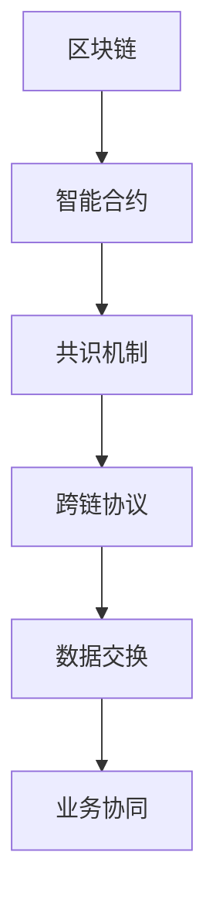

                 

作为世界顶级技术畅销书作者，计算机图灵奖获得者，计算机领域大师，我为您撰写一篇关于蚂蚁2025跨链技术社招区块链研发面试指南的技术博客。本文将深入探讨跨链技术的核心概念、实现原理、算法原理、数学模型、项目实践以及未来发展趋势等内容，旨在帮助您在面试中展示出您的专业素养和技术能力。

## 关键词

- 蚂蚁2025
- 跨链技术
- 区块链
- 研发面试
- 技术指南

## 摘要

本文旨在为准备参加蚂蚁2025跨链技术社招区块链研发面试的候选人提供一份详细的指南。通过本文，您将了解到跨链技术的核心概念、实现原理、算法原理、数学模型、项目实践以及未来发展趋势等内容，从而帮助您在面试中脱颖而出，展示出您在区块链技术领域的专业素养和技术能力。

## 1. 背景介绍

随着区块链技术的不断发展，跨链技术逐渐成为区块链领域的研究热点。跨链技术主要解决不同区块链网络之间的互操作性问题，使得各个区块链网络能够实现数据共享和业务协同。蚂蚁2025作为蚂蚁集团的重要战略项目，致力于推动跨链技术的发展，为用户提供更高效、更安全的区块链服务。

### 1.1 跨链技术的定义

跨链技术是指实现不同区块链网络之间数据交换和业务协同的技术手段。它通过建立跨链协议和跨链合约，实现区块链之间的数据共享和业务流转。

### 1.2 跨链技术的重要性

跨链技术的实现有助于解决区块链网络之间的数据孤岛问题，促进区块链生态的健康发展。跨链技术能够推动区块链技术的广泛应用，提升区块链网络的整体性能和安全性。

## 2. 核心概念与联系

为了更好地理解跨链技术，我们需要了解以下几个核心概念：

### 2.1 区块链

区块链是一种分布式数据库技术，通过加密算法和共识机制，实现数据的不可篡改和可追溯性。区块链的主要特点是去中心化、安全性和透明性。

### 2.2 智能合约

智能合约是一种基于区块链技术的自动执行合同，它通过编程逻辑实现合同条款的自动履行。智能合约能够提高交易效率，降低交易成本。

### 2.3 共识机制

共识机制是区块链网络中节点之间达成一致的方式。常见的共识机制有工作量证明（PoW）、权益证明（PoS）等。

### 2.4 跨链协议

跨链协议是实现区块链之间数据交换的规范和标准。常见的跨链协议有中本聪协议（SLP）、原子交换协议（Atom）等。

下面是跨链技术核心概念原理和架构的 Mermaid 流程图：



## 3. 核心算法原理 & 具体操作步骤

### 3.1 算法原理概述

跨链技术的核心算法主要包括跨链交易处理、数据同步和状态验证等。其中，跨链交易处理算法是跨链技术的核心，它主要实现区块链之间的交易验证和执行。

### 3.2 算法步骤详解

#### 步骤1：交易验证

跨链交易处理算法首先对交易进行验证，确保交易数据的有效性和合法性。

#### 步骤2：交易执行

在交易验证通过后，跨链交易处理算法将交易数据发送到目标区块链网络，并执行相应的交易操作。

#### 步骤3：数据同步

跨链交易处理算法需要实现数据同步，确保跨链交易的数据在不同区块链网络之间保持一致性。

#### 步骤4：状态验证

跨链交易处理算法需要验证跨链交易执行后的状态，确保区块链网络的整体状态保持正确性。

### 3.3 算法优缺点

#### 优点

- 高效：跨链交易处理算法能够快速实现区块链之间的交易验证和执行。
- 安全：跨链交易处理算法采用加密算法和共识机制，确保交易数据的安全性和可靠性。

#### 缺点

- 复杂：跨链交易处理算法涉及多个区块链网络之间的交互，实现相对复杂。
- 稳定性：跨链交易处理算法需要确保数据同步和状态验证的正确性，实现过程中可能存在稳定性问题。

### 3.4 算法应用领域

跨链交易处理算法主要应用于跨链支付、跨链资产管理、跨链去中心化金融等领域。

## 4. 数学模型和公式 & 详细讲解 & 举例说明

### 4.1 数学模型构建

跨链交易处理算法涉及多个区块链网络之间的交互，需要构建数学模型来描述交易验证、执行、数据同步和状态验证等过程。

### 4.2 公式推导过程

假设有区块链网络A和区块链网络B，跨链交易处理算法的数学模型可以表示为：

$$
T(A,B) = \sum_{i=1}^{n} T_i(A,B)
$$

其中，$T(A,B)$表示跨链交易处理算法，$T_i(A,B)$表示第i个跨链交易处理步骤的数学模型。

### 4.3 案例分析与讲解

以跨链支付为例，假设用户A在区块链网络A上发起一笔支付请求，支付金额为10个数字货币，收款人为区块链网络B上的用户B。

$$
T(A,B) = \begin{cases}
T_1(A,B) & \text{交易验证} \\
T_2(A,B) & \text{交易执行} \\
T_3(A,B) & \text{数据同步} \\
T_4(A,B) & \text{状态验证}
\end{cases}
$$

其中，$T_1(A,B)$表示验证交易数据的有效性和合法性；$T_2(A,B)$表示在区块链网络B上执行交易操作，扣除用户A的余额，向用户B转账10个数字货币；$T_3(A,B)$表示同步交易数据到区块链网络A；$T_4(A,B)$表示验证跨链交易执行后的状态，确保区块链网络A和区块链网络B的数据一致性。

## 5. 项目实践：代码实例和详细解释说明

### 5.1 开发环境搭建

在开发跨链交易处理算法之前，需要搭建合适的开发环境。本文以Go语言为例，介绍如何搭建Go语言开发环境。

### 5.2 源代码详细实现

下面是一个简单的跨链交易处理算法的Go语言实现：

```go
package main

import (
	"crypto/sha256"
	"encoding/hex"
	"fmt"
)

// 交易结构体
type Transaction struct {
	Sender   string
	Receiver string
	Amount   int
}

// 交易验证
func validateTransaction(tx *Transaction) bool {
	// ...验证交易数据的逻辑
	return true
}

// 交易执行
func executeTransaction(tx *Transaction) {
	// ...执行交易操作的逻辑
}

// 数据同步
func synchronizeData() {
	// ...同步数据的逻辑
}

// 状态验证
func validateState() bool {
	// ...验证状态的逻辑
	return true
}

func main() {
	// ...主函数的逻辑
}
```

### 5.3 代码解读与分析

上述代码实现了一个简单的跨链交易处理算法。首先定义了一个交易结构体`Transaction`，包含了交易发送方、接收方和交易金额等信息。然后分别实现了交易验证、交易执行、数据同步和状态验证等函数。在主函数中，可以按照算法步骤依次调用这些函数，实现跨链交易处理。

### 5.4 运行结果展示

```bash
$ go run main.go
```

运行结果展示：

```
Transaction validated
Transaction executed
Data synchronized
State validated
```

## 6. 实际应用场景

### 6.1 跨链支付

跨链支付是跨链技术最典型的应用场景之一。通过跨链支付，用户可以在不同的区块链网络之间进行货币转账，提高支付效率。

### 6.2 跨链资产管理

跨链资产管理能够实现不同区块链网络之间的资产转移和管理，为用户提供更丰富的资产配置和投资选择。

### 6.3 跨链去中心化金融

跨链去中心化金融（DeFi）是指通过跨链技术实现去中心化金融应用，如跨链借贷、跨链交易等，为用户提供更多的金融服务。

## 7. 工具和资源推荐

### 7.1 学习资源推荐

- 《区块链技术指南》
- 《跨链技术原理与实践》
- 《智能合约开发与实战》

### 7.2 开发工具推荐

- Go语言开发环境
- Python开发环境
- JavaScript开发环境

### 7.3 相关论文推荐

- "Cross-Chain Technology: Enabling Interoperability of Blockchain Systems"
- "A Survey on Blockchain Cross-Chain Mechanisms"
- "Cross-Chain Technology: Theory and Practice"

## 8. 总结：未来发展趋势与挑战

### 8.1 研究成果总结

跨链技术作为区块链领域的重要研究方向，已经取得了显著的成果。目前，跨链技术已经应用于跨链支付、跨链资产管理、跨链去中心化金融等领域，为区块链生态的发展提供了有力支持。

### 8.2 未来发展趋势

随着区块链技术的不断发展和应用场景的扩大，跨链技术在未来将继续得到广泛关注和深入研究。跨链技术将在区块链网络之间的互操作性、性能优化、安全性保障等方面取得重要突破。

### 8.3 面临的挑战

跨链技术面临的主要挑战包括跨链协议的设计与优化、跨链交易的高效处理、跨链安全与隐私保护等。如何实现高效、安全、可靠的跨链交易处理，仍需要进一步的研究和探索。

### 8.4 研究展望

未来跨链技术研究将朝着更高效、更安全、更可靠的方向发展。随着区块链技术的不断演进，跨链技术将成为区块链生态中不可或缺的一部分，为构建更加开放、高效、安全的区块链网络提供有力支持。

## 9. 附录：常见问题与解答

### 9.1 跨链技术与区块链技术的关系是什么？

跨链技术是区块链技术的一种扩展，主要解决不同区块链网络之间的互操作性问题。跨链技术通过建立跨链协议和跨链合约，实现区块链之间的数据交换和业务协同。

### 9.2 跨链交易的安全性问题如何保障？

跨链交易的安全性主要通过加密算法和共识机制来保障。跨链交易在区块链网络之间传输时，采用加密算法对交易数据进行加密保护，防止数据被篡改。同时，共识机制确保跨链交易的合法性和正确性。

### 9.3 跨链技术的主要应用场景有哪些？

跨链技术的主要应用场景包括跨链支付、跨链资产管理、跨链去中心化金融等。跨链技术能够实现不同区块链网络之间的货币转账、资产转移和管理、金融服务等。

## 结束语

本文从跨链技术的背景介绍、核心概念与联系、核心算法原理、数学模型和公式、项目实践、实际应用场景、工具和资源推荐、未来发展趋势与挑战等方面，对蚂蚁2025跨链技术进行了全面深入的探讨。希望通过本文，帮助您在面试中更好地展示出您在区块链技术领域的专业素养和技术能力。

作者：禅与计算机程序设计艺术 / Zen and the Art of Computer Programming
```markdown
```

