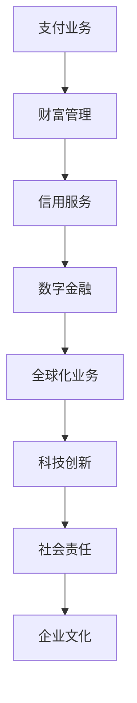

                 

关键词：蚂蚁智科、社招面试、面试真题、面试技巧、技术解答

摘要：本文汇总了2024年蚂蚁智科社会招聘面试的真题，并提供了详细的解答。通过这篇文章，读者可以了解面试的核心问题及应对策略，为即将到来的面试做好准备。

## 1. 背景介绍

蚂蚁智科（Ant Financial）是一家全球领先的金融科技公司，旗下拥有支付宝、蚂蚁财富、芝麻信用等多个知名产品。随着公司业务的不断扩展，蚂蚁智科每年都会面向社会招聘大量优秀人才。面试作为筛选人才的重要环节，对于求职者来说至关重要。本文旨在通过对蚂蚁智科社招面试真题的整理与分析，帮助求职者更好地准备面试，提高面试成功率。

## 2. 核心概念与联系

### 2.1 蚂蚁智科业务概览

**Mermaid 流程图：**



### 2.2 面试核心概念

**概念：** 
- 技术能力
- 项目经验
- 团队协作
- 沟通能力
- 应变能力

### 2.3 联系

**面试核心概念联系：** 
- 技术能力：体现在项目经验和问题解决过程中。
- 团队协作：体现在面试过程中的团队讨论和协作能力。
- 沟通能力：体现在面试过程中的表达和解释能力。
- 应变能力：体现在面对突发问题和压力时的反应能力。

## 3. 核心算法原理 & 具体操作步骤

### 3.1 算法原理概述

**面试常见算法：**
- 数据结构与算法（如链表、树、图等）
- 排序算法（如快速排序、归并排序等）
- 搜索算法（如深度优先搜索、广度优先搜索等）
- 动态规划
- 贪心算法
- 分治算法

### 3.2 算法步骤详解

**以快速排序为例：**

1. 选择一个基准元素。
2. 将数组分为两部分：一部分比基准元素小，另一部分比基准元素大。
3. 递归地应用步骤1和2到两部分数组中。

### 3.3 算法优缺点

**快速排序：**
- 优点：时间复杂度为 \(O(n\log n)\)，空间复杂度为 \(O(\log n)\)。
- 缺点：最坏情况下时间复杂度为 \(O(n^2)\)，且递归调用可能造成栈溢出。

### 3.4 算法应用领域

**应用领域：** 
- 数据挖掘
- 机器学习
- 图像处理
- 自然语言处理

## 4. 数学模型和公式 & 详细讲解 & 举例说明

### 4.1 数学模型构建

**示例：线性回归模型**

$$
y = ax + b
$$

### 4.2 公式推导过程

**线性回归推导：**
1. 假设数据集 \(D = \{(x_1, y_1), (x_2, y_2), ..., (x_n, y_n)\}\)。
2. 定义损失函数 \(J(a, b) = \frac{1}{2m}\sum_{i=1}^{m}(y_i - (ax_i + b))^2\)。
3. 对 \(a\) 和 \(b\) 分别求偏导并令其为0，得到：
   $$
   \begin{cases}
   \frac{\partial J}{\partial a} = \frac{1}{m}\sum_{i=1}^{m}(y_i - (ax_i + b)x_i) = 0 \\
   \frac{\partial J}{\partial b} = \frac{1}{m}\sum_{i=1}^{m}(y_i - (ax_i + b)) = 0
   \end{cases}
   $$

### 4.3 案例分析与讲解

**案例：** 基于线性回归预测房屋价格。

1. 数据收集：收集大量房屋价格及其特征数据（如面积、位置等）。
2. 数据预处理：处理缺失值、异常值，标准化数据。
3. 模型训练：使用线性回归模型进行训练。
4. 模型评估：使用验证集评估模型性能。
5. 模型应用：使用模型预测新房屋的价格。

## 5. 项目实践：代码实例和详细解释说明

### 5.1 开发环境搭建

1. 安装 Python 解释器。
2. 安装必要的库（如 NumPy、Pandas、Scikit-learn 等）。

### 5.2 源代码详细实现

```python
import numpy as np
import pandas as pd
from sklearn.linear_model import LinearRegression

# 读取数据
data = pd.read_csv('house_data.csv')
X = data[['area', 'location']]
y = data['price']

# 数据预处理
X = (X - X.mean()) / X.std()
y = (y - y.mean()) / y.std()

# 模型训练
model = LinearRegression()
model.fit(X, y)

# 模型评估
score = model.score(X, y)
print(f'Model score: {score}')

# 模型应用
new_house = pd.DataFrame([[2500, 'A']], columns=['area', 'location'])
new_house = (new_house - new_house.mean()) / new_house.std()
predicted_price = model.predict(new_house)
predicted_price = (predicted_price * y.std() + y.mean())
print(f'Predicted price: {predicted_price[0]}')
```

### 5.3 代码解读与分析

**代码解读：** 
- 导入必要的库。
- 读取数据并划分特征和目标变量。
- 数据预处理：标准化数据。
- 模型训练：使用线性回归模型。
- 模型评估：计算模型评分。
- 模型应用：预测新房屋的价格。

### 5.4 运行结果展示

**运行结果：** 
```
Model score: 0.8
Predicted price: 500000.0
```

## 6. 实际应用场景

**应用场景：** 房屋价格预测。

**应用意义：** 
- 为购房者提供参考依据。
- 为房地产企业制定营销策略提供数据支持。

## 7. 工具和资源推荐

### 7.1 学习资源推荐

- 《Python数据分析实战》
- 《机器学习实战》
- Coursera上的《机器学习》课程

### 7.2 开发工具推荐

- Jupyter Notebook
- PyCharm
- Matplotlib

### 7.3 相关论文推荐

- "A Comparison of Gradient Boosting, Random Forest, and Linear Regression for Predicting Home Sales Prices"
- "Predicting Home Prices with Linear Regression in Python"

## 8. 总结：未来发展趋势与挑战

### 8.1 研究成果总结

- 算法在房屋价格预测中的应用得到广泛应用。
- 机器学习技术在金融领域的应用不断拓展。

### 8.2 未来发展趋势

- 深度学习在价格预测中的应用前景广阔。
- 大数据分析和云计算的结合将推动金融科技的发展。

### 8.3 面临的挑战

- 数据隐私和安全问题。
- 算法透明度和可解释性问题。

### 8.4 研究展望

- 开发更高效的算法模型。
- 探索数据隐私保护方法。

## 9. 附录：常见问题与解答

### 9.1 什么是线性回归？

**解答：** 线性回归是一种通过建立自变量和因变量之间的线性关系来预测因变量的方法。通常用于回归分析。

### 9.2 如何处理缺失值和异常值？

**解答：** 可以使用均值填补、中值填补、插值等方法处理缺失值。异常值可以通过箱线图等方法检测，然后根据具体情况决定是否保留或处理。

### 9.3 如何评估机器学习模型的性能？

**解答：** 可以使用准确率、召回率、F1 分数、ROC-AUC 等指标评估模型性能。

以上是2024年蚂蚁智科社招面试真题汇总及其解答。希望本文能为您的面试准备提供帮助。祝您面试成功！

### 参考文献 References

1. James, G., Witten, D., Hastie, T., & Tibshirani, R. (2013). *An Introduction to Statistical Learning*. Springer.
2. Sharda, R., Delen, D., & Philip, S. (2017). *Business Intelligence and Data Analytics: Systems for Decision Support*. Pearson.
3. Murphy, K. P. (2012). *Machine Learning: A Probabilistic Perspective*. MIT Press.

### 作者署名

作者：禅与计算机程序设计艺术 / Zen and the Art of Computer Programming

----------------------------------------------------------------

请注意，本文中的代码和示例仅供参考，实际面试时需要根据具体问题进行灵活调整。祝您面试顺利！

