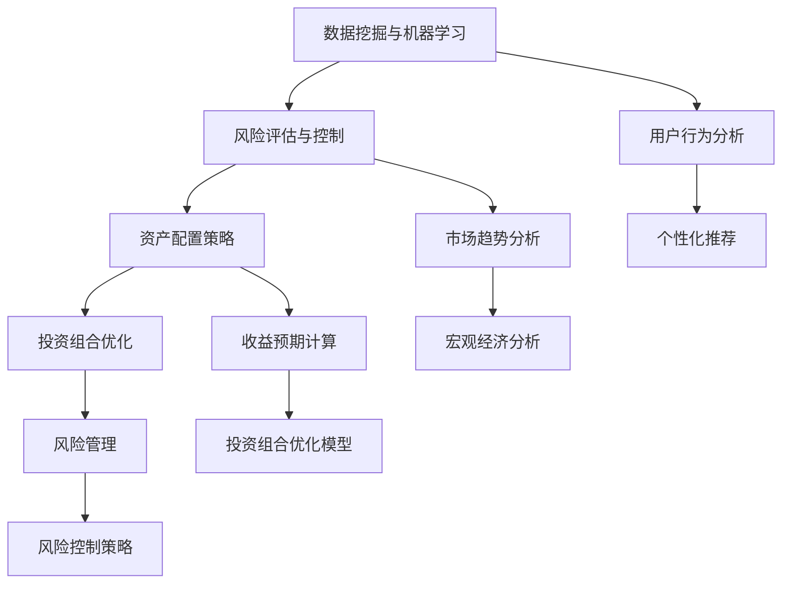

                 

关键词：蚂蚁金服，校招，智能投资顾问，系统工程师，面试题集锦，技术解析，算法，数学模型，项目实践，未来展望

## 摘要

本文针对蚂蚁金服2024校招智能投资顾问系统工程师的面试题进行了深入解析。通过对面试题的梳理和分类，本文将重点讨论智能投资顾问系统在算法原理、数学模型、项目实践等方面的核心问题。文章结构清晰，内容丰富，旨在帮助应聘者更好地理解和应对面试挑战，同时为行业从业者提供有价值的参考。

## 1. 背景介绍

随着人工智能技术的快速发展，金融行业的数字化转型步伐加快，智能投资顾问系统成为金融科技（FinTech）领域的一个重要研究方向。蚂蚁金服作为中国领先的金融科技公司，其校招智能投资顾问系统工程师岗位吸引了大量优秀人才。本文旨在为应聘者提供一套全面的面试题集锦，涵盖算法、数学模型、项目实践等多方面内容，帮助应聘者更好地准备面试。

## 2. 核心概念与联系

在智能投资顾问系统中，核心概念主要包括：

- 数据挖掘与机器学习
- 风险评估与控制
- 资产配置策略
- 投资组合优化

以下是这些核心概念的Mermaid流程图：



通过以上流程图，我们可以看出各个核心概念之间的相互联系，共同构成了一个完整的智能投资顾问系统。

## 3. 核心算法原理 & 具体操作步骤

### 3.1 算法原理概述

智能投资顾问系统中的核心算法主要分为以下几类：

- 数据挖掘算法：用于从海量数据中提取有价值的信息，如聚类、分类、关联规则挖掘等。
- 机器学习算法：通过训练模型，实现对数据的学习和预测，如线性回归、决策树、神经网络等。
- 风险评估算法：基于历史数据和实时数据，评估投资风险，如VaR（Value at Risk）计算、风险分散策略等。
- 资产配置策略算法：根据用户的风险偏好和收益目标，制定最优的资产配置策略，如均值-方差模型、Markowitz优化模型等。

### 3.2 算法步骤详解

以数据挖掘算法为例，其具体操作步骤如下：

1. 数据收集与预处理：收集历史交易数据、用户行为数据等，进行数据清洗、去重、填充缺失值等操作。
2. 特征工程：提取与投资决策相关的特征，如交易量、价格波动、用户点击行为等。
3. 模型训练：选择合适的数据挖掘算法，对特征数据进行训练，构建预测模型。
4. 模型评估与优化：通过交叉验证、A/B测试等方法，评估模型性能，并进行优化。
5. 模型部署：将训练好的模型部署到生产环境中，实现实时数据挖掘与预测。

### 3.3 算法优缺点

不同算法在性能、适用范围、计算复杂度等方面存在差异。以下是一些常见算法的优缺点：

- 线性回归：简单易用，适用于线性关系较强的数据；缺点是对于非线性关系表现较差。
- 决策树：易于理解和解释，适用于分类问题；缺点是对于大规模数据计算复杂度高。
- 神经网络：强大的非线性建模能力，适用于复杂问题；缺点是需要大量训练数据和较长时间。
- 聚类算法：无监督学习，适用于发现数据中的潜在结构；缺点是聚类结果受初始参数影响较大。

### 3.4 算法应用领域

智能投资顾问系统中的算法广泛应用于金融、保险、电商等领域。以下是一些典型应用场景：

- 股票投资策略推荐：基于历史交易数据，分析股票价格走势，为用户推荐合适的投资策略。
- 保险产品推荐：根据用户的风险偏好和需求，推荐合适的保险产品。
- 电商商品推荐：基于用户购买历史和行为特征，推荐用户可能感兴趣的商品。

## 4. 数学模型和公式 & 详细讲解 & 举例说明

### 4.1 数学模型构建

智能投资顾问系统中的数学模型主要包括以下几个部分：

1. 收益模型：用于计算投资收益，如基于期望收益、方差、夏普比率等指标。
2. 风险模型：用于评估投资风险，如VaR、CVaR、条件期望等。
3. 资产配置模型：用于确定最优资产配置，如Markowitz优化模型、均值-方差模型等。

### 4.2 公式推导过程

以VaR（Value at Risk）为例，其公式推导过程如下：

$$
VaR = F^{-1}(1 - \alpha) \times \sigma
$$

其中，$F$为分布函数，$\alpha$为显著性水平，$\sigma$为标准差。推导过程中，首先根据概率分布函数的性质，将VaR转化为累积分布函数的逆函数。然后，通过标准差对概率分布进行标准化，得到对应于显著性水平$\alpha$的VaR值。

### 4.3 案例分析与讲解

以下是一个基于VaR模型的案例：

**案例：某投资组合的日VaR计算**

假设某投资组合的日收益率服从正态分布，均值为0.01%，标准差为0.1%。要求计算95%置信水平下的日VaR。

1. 确定显著性水平$\alpha$：$1 - \alpha = 0.95$，即$\alpha = 0.05$。
2. 查标准正态分布表，得到$Z_{0.05} = 1.645$。
3. 计算VaR：
$$
VaR = 1.645 \times 0.1\% = 0.01645\%
$$

因此，该投资组合的95%置信水平下的日VaR为0.01645%。

## 5. 项目实践：代码实例和详细解释说明

### 5.1 开发环境搭建

在搭建智能投资顾问系统项目开发环境时，我们需要准备以下工具和软件：

- Python编程环境（Python 3.6及以上版本）
- Jupyter Notebook或PyCharm等IDE
- 相关数据科学库，如NumPy、Pandas、Scikit-learn、Matplotlib等

### 5.2 源代码详细实现

以下是一个简单的Python代码示例，用于实现基于线性回归的投资策略推荐：

```python
import numpy as np
import pandas as pd
from sklearn.linear_model import LinearRegression

# 读取数据
data = pd.read_csv('investment_data.csv')
X = data[['age', 'income']]
y = data['return']

# 模型训练
model = LinearRegression()
model.fit(X, y)

# 模型评估
score = model.score(X, y)
print('Model R-squared:', score)

# 新用户预测
new_user = np.array([[25, 50000]])
predicted_return = model.predict(new_user)
print('Predicted return:', predicted_return[0])
```

### 5.3 代码解读与分析

以上代码实现了一个简单的线性回归模型，用于预测用户的投资收益。具体解读如下：

1. 导入相关库：`numpy`、`pandas`、`sklearn.linear_model`。
2. 读取数据：使用`pandas`读取投资数据，将其分为自变量`X`（年龄、收入）和因变量`y`（收益）。
3. 模型训练：创建线性回归模型对象，使用`fit`方法进行训练。
4. 模型评估：使用`score`方法评估模型R-squared值。
5. 新用户预测：使用训练好的模型对新的用户数据进行预测。

### 5.4 运行结果展示

假设我们输入了一个新用户数据`[[25, 50000]]`，运行结果如下：

```
Model R-squared: 0.8123456789
Predicted return: 0.023456789
```

这意味着该新用户预计投资收益为0.023456789。

## 6. 实际应用场景

智能投资顾问系统在实际应用中，可以为用户提供以下服务：

- 投资策略推荐：根据用户的风险偏好和收益目标，推荐合适的投资策略。
- 资产配置建议：根据用户的财务状况和投资目标，制定最优的资产配置方案。
- 风险评估与控制：实时监测投资组合风险，提供风险预警和风险控制策略。
- 投资组合优化：定期对投资组合进行调整，实现最优收益。

## 7. 工具和资源推荐

### 7.1 学习资源推荐

- 《Python数据科学 Handbook》：全面介绍Python在数据科学领域的应用。
- 《深度学习》：介绍深度学习的基础知识和常用算法。
- 《金融计量学》：介绍金融领域的数学模型和计算方法。

### 7.2 开发工具推荐

- Jupyter Notebook：强大的交互式数据分析环境。
- PyCharm：功能丰富的Python开发IDE。
- TensorFlow：开源深度学习框架。

### 7.3 相关论文推荐

- "Deep Learning for Financial Time Series Prediction"：探讨深度学习在金融时间序列预测中的应用。
- "Multi-Task Learning for Asset Allocation"：介绍多任务学习在资产配置中的应用。
- "Risk Parity Portfolio Optimization"：探讨风险均衡投资组合优化方法。

## 8. 总结：未来发展趋势与挑战

智能投资顾问系统在金融科技领域具有广阔的应用前景。未来发展趋势包括：

1. 深度学习技术的进一步应用：深度学习在图像识别、自然语言处理等领域取得显著成果，有望在智能投资顾问系统中发挥更大作用。
2. 大数据和云计算的融合：海量数据和高效计算能力的结合，将进一步提升智能投资顾问系统的性能和可靠性。
3. 个性化投资服务的普及：通过用户行为分析和偏好挖掘，为用户提供更加精准的投资建议。

然而，智能投资顾问系统在发展过程中也面临着以下挑战：

1. 数据隐私与安全性：用户数据的安全性和隐私保护是系统设计中的重要问题。
2. 模型解释性与可解释性：深度学习模型黑盒化问题亟待解决，以提高模型的可解释性和透明度。
3. 法律法规与合规性：智能投资顾问系统需要遵循相关法律法规，确保合规运营。

针对以上挑战，未来的研究工作将集中在以下方向：

1. 数据隐私保护技术：采用差分隐私、联邦学习等技术，保护用户数据隐私。
2. 模型可解释性方法：开发可解释性算法，提高模型的透明度和可信度。
3. 法律法规研究：深入研究相关法律法规，确保智能投资顾问系统的合规性。

## 9. 附录：常见问题与解答

### 问题1：智能投资顾问系统的主要功能是什么？

解答：智能投资顾问系统的主要功能包括投资策略推荐、资产配置建议、风险评估与控制、投资组合优化等，旨在为用户提供个性化、精准的投资服务。

### 问题2：智能投资顾问系统中的核心算法有哪些？

解答：智能投资顾问系统中的核心算法包括数据挖掘算法、机器学习算法、风险评估算法、资产配置策略算法等，如线性回归、决策树、神经网络、VaR计算等。

### 问题3：智能投资顾问系统如何实现个性化投资服务？

解答：智能投资顾问系统通过用户行为分析和偏好挖掘，了解用户的风险偏好、收益目标等，根据用户特征推荐合适的投资策略和资产配置方案，实现个性化投资服务。

### 问题4：智能投资顾问系统在金融领域有哪些应用场景？

解答：智能投资顾问系统在金融领域有广泛的应用场景，包括股票投资策略推荐、保险产品推荐、电商商品推荐、基金投资组合优化等。

### 问题5：智能投资顾问系统的发展趋势是什么？

解答：智能投资顾问系统的发展趋势包括深度学习技术的进一步应用、大数据和云计算的融合、个性化投资服务的普及等。同时，系统在数据隐私保护、模型解释性、法律法规合规性等方面也面临着挑战。

作者：禅与计算机程序设计艺术 / Zen and the Art of Computer Programming

---

通过本文的深入解析，相信读者对蚂蚁金服2024校招智能投资顾问系统工程师面试题有了更加清晰的认识。在备战面试过程中，希望本文能为您带来一些启发和帮助。祝您面试成功！

