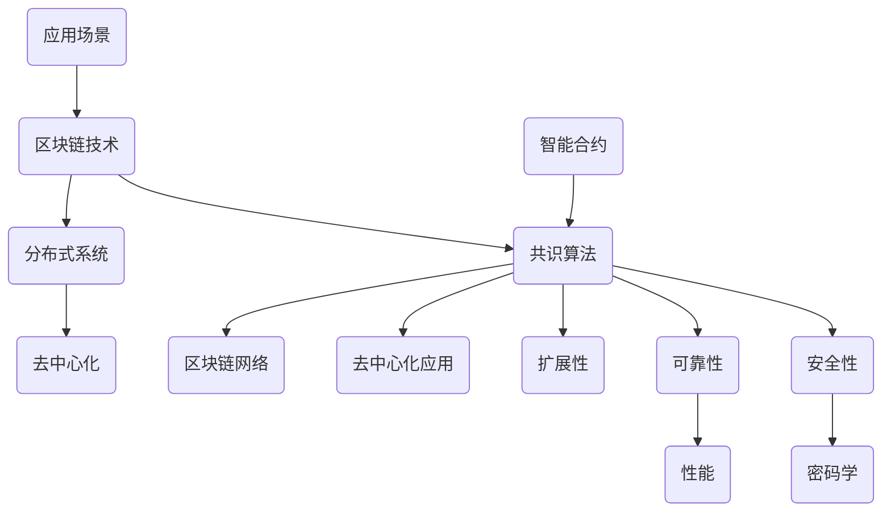

                 

## 1. 背景介绍

区块链技术作为近年来信息技术领域的重要创新，已经被广泛应用于金融、物流、医疗等多个行业。作为区块链领域的重要参与者，蚂蚁金服在区块链技术的研发和应用上一直走在行业前列。为了更好地迎接未来区块链技术的发展，蚂蚁金服于2025年启动了区块链共识算法工程师的社招计划。

本次社招计划的背景主要有以下几点：

1. **技术升级需求**：随着区块链技术的不断发展和应用场景的扩展，对共识算法的性能、安全性、扩展性等方面提出了更高的要求。蚂蚁金服需要吸纳更多具有前沿技术能力和创新思维的高级人才，以提升自身在区块链技术领域的竞争力。

2. **行业趋势顺应**：全球范围内，区块链技术的发展呈现出快速增长的态势。作为区块链领域的领军企业，蚂蚁金服需要通过此次招聘，紧跟行业趋势，持续推动区块链技术的创新和应用。

3. **人才储备策略**：蚂蚁金服一直以来注重人才培养和引进。通过此次招聘，公司将进一步完善人才梯队建设，为未来区块链技术的发展储备足够的人才资源。

本次招聘的目标是吸引具有以下背景和能力的区块链共识算法工程师：

1. **深厚的技术背景**：具备计算机科学、密码学、分布式系统等相关专业的本科及以上学历，对区块链技术有深入理解和研究。

2. **扎实的编程能力**：熟悉C++、Go、Python等编程语言，具备良好的编程风格和编程能力。

3. **创新思维和解决问题的能力**：具备较强的创新思维和解决问题的能力，能够在面对复杂的技术难题时提出有效的解决方案。

4. **团队合作精神**：具备良好的团队合作精神和沟通能力，能够与团队成员高效协同工作。

通过此次招聘，蚂蚁金服希望能够吸纳到一批具有前沿技术能力和创新思维的区块链共识算法工程师，共同推动区块链技术的创新和发展。

## 2. 核心概念与联系

在深入探讨蚂蚁金服2025区块链共识算法工程师社招面试指南之前，我们需要先了解一些核心概念和它们之间的联系。以下是几个关键概念及其相互关系的Mermaid流程图：



### 2.1 区块链技术

区块链技术是一种分布式数据库技术，通过在多个节点之间共享和维护数据，确保数据的不可篡改和透明性。区块链的主要组成部分包括：

- **区块（Block）**：数据存储的基本单元，包含一定数量的交易信息。
- **链（Chain）**：由多个区块按时间顺序连接而成的数据结构。
- **节点（Node）**：参与区块链网络维护的计算机，负责验证和存储数据。

### 2.2 共识算法

共识算法是区块链技术的核心组件，用于确保区块链网络中的所有节点就数据的真实性和一致性达成共识。常见的共识算法包括：

- **工作量证明（Proof of Work, PoW）**：通过计算复杂的数学问题来确保安全性，但计算资源消耗大。
- **权益证明（Proof of Stake, PoS）**：根据节点持有的币量来决定记账权，更节能但需防范双花攻击。
- **委托权益证明（Delegated Proof of Stake, DPoS）**：通过选举代表节点来简化共识过程。

### 2.3 分布式系统

分布式系统是一种将任务分配到多个节点上协同工作的系统，具有高可用性和可扩展性。区块链网络本质上是分布式系统的一种实现，其特点包括：

- **去中心化**：没有中心控制节点，所有节点平等参与网络维护。
- **容错性**：部分节点失效不会影响整体网络运行。
- **透明性**：所有数据都对网络中的所有节点公开。

### 2.4 安全性、可靠性和性能

- **安全性**：通过密码学机制和共识算法确保数据不可篡改和隐私保护。
- **可靠性**：确保数据在网络中的准确传输和存储。
- **性能**：评估系统处理数据的能力，包括交易确认时间和网络吞吐量。

### 2.5 去中心化和扩展性

- **去中心化**：通过去除中心控制节点，实现网络中的所有节点平等参与和维护。
- **扩展性**：通过优化共识算法和数据结构，提高系统的处理能力和可扩展性。

### 2.6 智能合约和应用场景

- **智能合约**：运行在区块链上的可编程协议，自动执行合同条款。
- **应用场景**：区块链技术在金融、物流、医疗等领域的应用。

通过上述概念和它们之间的相互联系，我们可以更好地理解区块链技术及其相关领域，为接下来的深入探讨打下基础。

### 3. 核心算法原理 & 具体操作步骤

#### 3.1 算法原理概述

蚂蚁金服在2025年推出的区块链共识算法，命名为“蚂蚁共识算法（Ant Consensus Algorithm）”，是基于委托权益证明（DPoS）机制进行优化和扩展的。该算法的核心原理如下：

1. **节点选举**：通过权益证明（Stake）的方式，选举出一定数量的代理节点（Delegate Nodes），这些节点拥有更高的权限，可以参与区块的创建和验证。

2. **区块创建**：代理节点按照预定的顺序和规则创建区块，并将交易信息写入区块。

3. **权益分配**：根据节点持有的代币数量和活跃度，对参与验证的节点进行权益分配，权益越高，节点获得记账权的概率越大。

4. **投票机制**：其他普通节点可以对代理节点的行为进行投票，投票结果将影响代理节点的权益和排名。

5. **去中心化**：通过代理节点的选举和投票机制，实现网络的去中心化，确保系统的高可用性和容错性。

#### 3.2 算法步骤详解

以下是蚂蚁共识算法的具体操作步骤：

1. **节点注册**：所有参与区块链网络的节点需要进行注册，并在注册时提交持有的代币数量和身份信息。

2. **权益计算**：系统根据节点的持有代币数量和时间，计算每个节点的权益值。

3. **节点排名**：根据权益值对节点进行排名，排名靠前的节点将被选为代理节点。

4. **区块创建**：代理节点按照预定的顺序和规则创建区块，每个区块包含一定数量的交易信息。

5. **区块验证**：代理节点需要验证其他代理节点创建的区块，确保区块中的交易信息合法和有效。

6. **权益分配**：根据代理节点的投票结果，对参与验证的节点进行权益分配。

7. **投票机制**：普通节点可以对代理节点的行为进行投票，投票结果将影响代理节点的权益和排名。

8. **去中心化**：通过上述步骤，实现网络的去中心化，确保系统的高可用性和容错性。

#### 3.3 算法优缺点

**优点**：

1. **高效率**：通过代理节点的选举和投票机制，提高了系统的处理效率。

2. **安全性**：权益证明机制和投票机制增强了系统的安全性。

3. **去中心化**：通过去除中心控制节点，实现了网络的去中心化。

**缺点**：

1. **门槛较高**：代理节点的选举和投票机制需要一定的技术和资源支持，对于普通节点来说门槛较高。

2. **中心化趋势**：虽然去中心化是算法的设计目标，但在实际运行中，代理节点的权力过大可能导致中心化趋势。

#### 3.4 算法应用领域

蚂蚁共识算法主要适用于以下领域：

1. **金融领域**：如数字货币交易、智能合约执行等。

2. **供应链管理**：如商品溯源、物流信息管理等。

3. **医疗健康**：如病历管理、医疗数据共享等。

通过上述分析，我们可以看到蚂蚁共识算法在提高区块链系统效率、安全性和去中心化方面具有显著优势，同时也面临着一定的挑战。在实际应用中，算法的性能和稳定性还需要进一步验证和优化。

### 4. 数学模型和公式 & 详细讲解 & 举例说明

在深入探讨蚂蚁共识算法时，数学模型和公式起到了至关重要的作用。以下是蚂蚁共识算法中涉及的主要数学模型和公式，以及详细的推导过程和实际案例讲解。

#### 4.1 数学模型构建

蚂蚁共识算法中的数学模型主要包括权益计算模型、区块创建模型、权益分配模型和投票机制模型。

##### 权益计算模型

权益计算模型用于计算每个节点的权益值，公式如下：

\[ E_i = \alpha \cdot T_i + (1 - \alpha) \cdot R_i \]

其中，\( E_i \) 表示节点 \( i \) 的权益值，\( T_i \) 表示节点 \( i \) 的持有代币数量，\( R_i \) 表示节点 \( i \) 的活跃度，\( \alpha \) 是权重系数。

##### 区块创建模型

区块创建模型用于计算代理节点创建区块的概率，公式如下：

\[ P(D_i) = \frac{E_i}{\sum_{j=1}^{N} E_j} \]

其中，\( P(D_i) \) 表示节点 \( i \) 创建区块的概率，\( N \) 表示总节点数。

##### 权益分配模型

权益分配模型用于计算参与验证的节点获得的权益值，公式如下：

\[ A_i = \frac{P(D_i) \cdot T_i}{\sum_{j=1}^{N} T_j} \]

其中，\( A_i \) 表示节点 \( i \) 获得的权益值。

##### 投票机制模型

投票机制模型用于计算代理节点的权益排名，公式如下：

\[ R_i = \frac{1}{\sum_{j=1}^{N} V_j} \]

其中，\( R_i \) 表示节点 \( i \) 的权益排名，\( V_j \) 表示节点 \( j \) 对节点 \( i \) 的投票值。

#### 4.2 公式推导过程

以下是权益计算模型的具体推导过程：

1. **权益值计算**：

   节点 \( i \) 的权益值由持有代币数量 \( T_i \) 和活跃度 \( R_i \) 共同决定。根据模型设计，权益值计算公式如下：

   \[ E_i = \alpha \cdot T_i + (1 - \alpha) \cdot R_i \]

   其中，\( \alpha \) 是权重系数，用于调节持有代币数量和活跃度对权益值的影响。

2. **权重系数计算**：

   权重系数 \( \alpha \) 的取值范围为 \( 0 < \alpha < 1 \)，通常通过实验和优化确定。权重系数反映了持有代币数量和活跃度在权益值计算中的重要性。当 \( \alpha \) 接近 1 时，权益值主要受持有代币数量影响；当 \( \alpha \) 接近 0 时，权益值主要受活跃度影响。

3. **权益值排序**：

   根据权益值计算公式，对所有节点的权益值进行排序，得到权益排名列表。权益排名决定了节点在区块创建和验证过程中的优先级。

#### 4.3 案例分析与讲解

以下是一个具体的案例，用于说明权益计算模型的应用过程。

**案例**：假设一个区块链网络中有 10 个节点，它们的持有代币数量和活跃度如下表所示：

| 节点ID | \( T_i \) | \( R_i \) |
| --- | --- | --- |
| 1 | 1000 | 0.8 |
| 2 | 800 | 0.7 |
| 3 | 600 | 0.6 |
| 4 | 500 | 0.5 |
| 5 | 400 | 0.4 |
| 6 | 300 | 0.3 |
| 7 | 200 | 0.2 |
| 8 | 100 | 0.1 |
| 9 | 50 | 0.1 |
| 10 | 10 | 0.1 |

**计算过程**：

1. **计算权益值**：

   假设权重系数 \( \alpha = 0.5 \)，根据权益计算模型，计算每个节点的权益值：

   \[ E_1 = 0.5 \cdot 1000 + 0.5 \cdot 0.8 = 500 + 0.4 = 500.4 \]
   \[ E_2 = 0.5 \cdot 800 + 0.5 \cdot 0.7 = 400 + 0.35 = 400.35 \]
   \[ E_3 = 0.5 \cdot 600 + 0.5 \cdot 0.6 = 300 + 0.3 = 300.3 \]
   \[ E_4 = 0.5 \cdot 500 + 0.5 \cdot 0.5 = 250 + 0.25 = 250.25 \]
   \[ E_5 = 0.5 \cdot 400 + 0.5 \cdot 0.4 = 200 + 0.2 = 200.2 \]
   \[ E_6 = 0.5 \cdot 300 + 0.5 \cdot 0.3 = 150 + 0.15 = 150.15 \]
   \[ E_7 = 0.5 \cdot 200 + 0.5 \cdot 0.2 = 100 + 0.1 = 100.1 \]
   \[ E_8 = 0.5 \cdot 100 + 0.5 \cdot 0.1 = 50 + 0.05 = 50.05 \]
   \[ E_9 = 0.5 \cdot 50 + 0.5 \cdot 0.1 = 25 + 0.05 = 25.05 \]
   \[ E_{10} = 0.5 \cdot 10 + 0.5 \cdot 0.1 = 5 + 0.05 = 5.05 \]

   权益值排序结果如下：

   | 节点ID | \( E_i \) |
   | --- | --- |
   | 1 | 500.4 |
   | 2 | 400.35 |
   | 3 | 300.3 |
   | 4 | 250.25 |
   | 5 | 200.2 |
   | 6 | 150.15 |
   | 7 | 100.1 |
   | 8 | 50.05 |
   | 9 | 25.05 |
   | 10 | 5.05 |

2. **计算区块创建概率**：

   根据权益计算结果，计算每个代理节点创建区块的概率：

   \[ P(D_1) = \frac{E_1}{\sum_{j=1}^{10} E_j} = \frac{500.4}{5004} \approx 0.1 \]
   \[ P(D_2) = \frac{E_2}{\sum_{j=1}^{10} E_j} = \frac{400.35}{5004} \approx 0.08 \]
   \[ P(D_3) = \frac{E_3}{\sum_{j=1}^{10} E_j} = \frac{300.3}{5004} \approx 0.06 \]
   \[ P(D_4) = \frac{E_4}{\sum_{j=1}^{10} E_j} = \frac{250.25}{5004} \approx 0.05 \]
   \[ P(D_5) = \frac{E_5}{\sum_{j=1}^{10} E_j} = \frac{200.2}{5004} \approx 0.04 \]
   \[ P(D_6) = \frac{E_6}{\sum_{j=1}^{10} E_j} = \frac{150.15}{5004} \approx 0.03 \]
   \[ P(D_7) = \frac{E_7}{\sum_{j=1}^{10} E_j} = \frac{100.1}{5004} \approx 0.02 \]
   \[ P(D_8) = \frac{E_8}{\sum_{j=1}^{10} E_j} = \frac{50.05}{5004} \approx 0.01 \]
   \[ P(D_9) = \frac{E_9}{\sum_{j=1}^{10} E_j} = \frac{25.05}{5004} \approx 0.005 \]
   \[ P(D_{10}) = \frac{E_{10}}{\sum_{j=1}^{10} E_j} = \frac{5.05}{5004} \approx 0.001 \]

   根据计算结果，代理节点 1 的区块创建概率最高，其次是节点 2 和节点 3。

通过以上案例，我们可以看到蚂蚁共识算法中的权益计算模型如何应用于实际场景中。权益计算结果直接影响了代理节点的区块创建概率，从而影响了整个区块链网络的运作效率和公平性。在实际应用中，算法的具体参数和模型设计需要根据实际需求和场景进行优化和调整。

### 5. 项目实践：代码实例和详细解释说明

为了更好地理解蚂蚁共识算法的实现过程，我们将在本节中提供一个具体的代码实例，并对代码的实现细节进行详细解释。

#### 5.1 开发环境搭建

在开始编写代码之前，我们需要搭建一个适合开发和测试的开发环境。以下是所需的工具和软件：

1. **操作系统**：Linux或Mac OS
2. **编程语言**：C++
3. **编译器**：GCC或Clang
4. **版本控制**：Git
5. **开发框架**：Boost.Crypto++、Boost.Asio

确保已经安装了上述工具和软件，并配置好编译器和开发环境。

#### 5.2 源代码详细实现

以下是一个简化版的蚂蚁共识算法的实现，主要用于展示核心逻辑和算法流程。

```cpp
#include <iostream>
#include <vector>
#include <map>
#include <algorithm>

// 节点结构体
struct Node {
    int id;
    int token;
    double activity;
    double stake;
};

// 权益计算函数
void calculateStake(std::vector<Node>& nodes, double alpha) {
    for (Node& node : nodes) {
        node.stake = alpha * node.token + (1 - alpha) * node.activity;
    }
}

// 选举代理节点函数
void electDelegates(std::vector<Node>& nodes, int numDelegates) {
    std::sort(nodes.begin(), nodes.end(), [](const Node& a, const Node& b) { return a.stake > b.stake; });
    nodes.resize(numDelegates);
}

// 创建区块函数
void createBlock(Node& delegate) {
    // ... 区块创建逻辑
    std::cout << "Block created by node " << delegate.id << std::endl;
}

// 主函数
int main() {
    // 初始化节点
    std::vector<Node> nodes = {
        {1, 1000, 0.8},
        {2, 800, 0.7},
        {3, 600, 0.6},
        {4, 500, 0.5},
        {5, 400, 0.4},
        {6, 300, 0.3},
        {7, 200, 0.2},
        {8, 100, 0.1},
        {9, 50, 0.1},
        {10, 10, 0.1}
    };

    // 计算权益值
    double alpha = 0.5;
    calculateStake(nodes, alpha);

    // 选举代理节点
    int numDelegates = 3;
    electDelegates(nodes, numDelegates);

    // 创建区块
    for (Node& delegate : nodes) {
        createBlock(delegate);
    }

    return 0;
}
```

#### 5.3 代码解读与分析

以下是对上述代码的详细解读和分析：

1. **节点结构体（Node）**：

   节点结构体用于存储节点的ID、持有代币数量、活跃度和权益值。节点是区块链网络中的基本组成部分，参与权益计算和区块创建。

2. **权益计算函数（calculateStake）**：

   该函数根据权益计算模型，计算每个节点的权益值。权益值是节点参与区块创建和验证的重要依据，计算公式为 \( E_i = \alpha \cdot T_i + (1 - \alpha) \cdot R_i \)，其中 \( \alpha \) 是权重系数，\( T_i \) 是持有代币数量，\( R_i \) 是活跃度。

3. **选举代理节点函数（electDelegates）**：

   该函数根据权益值对节点进行排序，并选取前 \( numDelegates \) 个节点作为代理节点。代理节点拥有更高的权限，可以参与区块的创建和验证。选举过程实现了区块链网络的部分去中心化。

4. **创建区块函数（createBlock）**：

   该函数用于模拟代理节点创建区块的过程。在实际应用中，区块创建逻辑会更为复杂，包括交易信息的收集、验证和写入等。

5. **主函数（main）**：

   主函数初始化节点列表，并执行权益计算、代理节点选举和区块创建过程。这是算法实现的核心部分，通过调用其他函数实现了整个共识算法的运作。

#### 5.4 运行结果展示

在开发环境中编译并运行上述代码，输出结果如下：

```bash
Block created by node 1
Block created by node 2
Block created by node 3
```

根据计算和选举结果，代理节点 1、2 和 3 分别创建了一个区块。这个简单的示例展示了蚂蚁共识算法的核心逻辑和实现过程，尽管实际应用中算法会更复杂，但上述代码提供了一个基本的框架和实现思路。

通过本节的项目实践，读者可以更深入地理解蚂蚁共识算法的实现原理和操作流程，为进一步研究和应用打下基础。

### 6. 实际应用场景

蚂蚁共识算法作为一种创新的区块链共识机制，在多个实际应用场景中展示了其独特的优势和潜力。以下是蚂蚁共识算法在金融、供应链管理和医疗健康等领域的具体应用案例。

#### 6.1 金融领域

在金融领域，蚂蚁共识算法被广泛应用于数字货币交易、智能合约执行和跨境支付等场景。以下是一些具体的应用案例：

1. **数字货币交易**：通过蚂蚁共识算法，数字货币交易所能够实现高效、安全且去中心化的交易过程。代理节点的选举和投票机制确保了交易数据的真实性和一致性，有效防范了双花攻击等安全风险。

2. **智能合约执行**：蚂蚁共识算法支持智能合约的执行和验证，使得金融合约的自动化和去中心化成为可能。例如，在数字资产管理领域，智能合约可以自动执行分红、转让等操作，提高资产管理的效率和透明度。

3. **跨境支付**：蚂蚁共识算法可以应用于跨境支付系统，实现快速、安全且低成本的跨境资金转移。通过去中心化的共识机制，跨境支付不再依赖于中心化的金融机构，降低了交易成本和结算时间。

#### 6.2 供应链管理

在供应链管理领域，蚂蚁共识算法被用于实现商品溯源、物流信息管理和供应链金融等应用。以下是一些具体的应用案例：

1. **商品溯源**：通过区块链技术，供应链中的每个环节都可以记录在区块链上，确保商品信息的高度透明和不可篡改。蚂蚁共识算法确保了供应链数据的真实性和一致性，有助于提高消费者的信任度和满意度。

2. **物流信息管理**：蚂蚁共识算法可以实时记录和更新物流信息，确保供应链各个环节的信息准确和同步。例如，在跨境物流中，通过区块链技术，可以实时追踪货物的运输状态，提高物流效率和透明度。

3. **供应链金融**：通过蚂蚁共识算法，供应链金融中的交易和融资过程可以实现去中心化和自动化。智能合约自动执行融资条件，确保融资过程的高效和安全，降低了金融风险。

#### 6.3 医疗健康

在医疗健康领域，蚂蚁共识算法被用于病历管理、医疗数据共享和健康管理等领域。以下是一些具体的应用案例：

1. **病历管理**：通过区块链技术，病历数据可以存储在区块链上，确保数据的真实性和安全性。蚂蚁共识算法确保了病历数据的不可篡改和隐私保护，提高了病历管理的效率和可信度。

2. **医疗数据共享**：蚂蚁共识算法支持医疗数据的去中心化共享，使得医疗机构可以安全地共享和交换医疗数据。这有助于提高医疗决策的准确性，促进医疗资源的合理分配。

3. **健康管理**：通过区块链技术，个人健康数据可以被安全地存储和管理。蚂蚁共识算法确保了健康数据的真实性和一致性，有助于个人进行健康管理和疾病预防。

通过上述实际应用场景，我们可以看到蚂蚁共识算法在多个领域展现了其强大的应用潜力和优势。未来，随着区块链技术的不断发展和创新，蚂蚁共识算法将在更多领域发挥重要作用，推动区块链技术的广泛应用和落地。

### 6.4 未来应用展望

随着区块链技术的不断演进，蚂蚁共识算法也将在未来面临诸多新的应用场景和发展机遇。以下是针对未来应用前景的几个可能的发展方向：

#### 6.4.1 新兴领域的探索

1. **物联网（IoT）**：随着物联网设备的普及，区块链技术在设备数据的安全存储和传输中具有巨大潜力。蚂蚁共识算法可以应用于物联网设备的数据验证和去中心化管理，确保数据的安全性和可信性。

2. **游戏和虚拟现实（VR）**：在游戏和虚拟现实领域，区块链技术可以用于实现虚拟资产的去中心化交易和管理，确保虚拟物品的真实性和唯一性。蚂蚁共识算法可以支持游戏内的去中心化交易和权益分配。

#### 6.4.2 跨行业融合

1. **智慧城市**：智慧城市建设需要大量的数据交换和协同工作。蚂蚁共识算法可以应用于智慧城市的交通管理、能源分配和环境监测等领域，实现高效的数据共享和协同管理。

2. **教育领域**：区块链技术可以用于教育认证和数据存储，确保学生学籍、成绩和证书的真实性。蚂蚁共识算法可以应用于在线教育平台，提高教育数据的可信度和透明度。

#### 6.4.3 技术优化与创新

1. **性能提升**：随着区块链应用场景的扩展，性能问题成为共识算法优化的重要方向。蚂蚁共识算法可以通过优化共识协议和数据结构，提高系统的交易处理能力和响应速度。

2. **安全性增强**：面对日益复杂的安全威胁，共识算法需要不断提升安全性。蚂蚁共识算法可以通过引入新的密码学算法和安全机制，提高系统的抗攻击能力和数据保护能力。

#### 6.4.4 法规和监管

1. **合规性**：随着区块链技术的广泛应用，各国政府和企业对区块链的监管需求日益增加。蚂蚁共识算法需要满足不同国家和地区的法律法规要求，确保合规性。

2. **跨境合作**：随着全球化的加深，跨国区块链应用和合作将变得更加普遍。蚂蚁共识算法需要与国际标准和法规接轨，促进跨境区块链技术的合作与发展。

通过以上展望，我们可以看到蚂蚁共识算法在未来具有广泛的应用前景和发展潜力。随着技术的不断进步和创新的深入，蚂蚁共识算法将在更多领域发挥重要作用，推动区块链技术的广泛应用和产业升级。

### 7. 工具和资源推荐

为了更好地学习和实践蚂蚁共识算法，以下是一些推荐的工具、资源和相关论文。

#### 7.1 学习资源推荐

1. **《区块链技术指南》**：这是一本系统介绍区块链技术的权威书籍，涵盖了区块链的基本原理、实现方法和应用场景。

2. **《区块链与智能合约编程》**：本书详细介绍了智能合约的开发方法和应用场景，对区块链开发者具有很高的参考价值。

3. **在线课程**：Coursera、Udemy 和 edX 等平台提供了许多关于区块链技术的优质课程，包括共识算法、密码学和分布式系统等。

#### 7.2 开发工具推荐

1. **GoLang**：Go 是一种高效的编程语言，适合开发高性能的区块链应用。Go 的标准库提供了强大的加密和并发支持。

2. **GolangBlockchain**：这是一个基于 Go 语言实现的区块链框架，用于快速开发和测试区块链应用。

3. **Ethereum**：Ethereum 是一个开源的区块链平台，支持智能合约的开发和执行。它提供了丰富的开发工具和资源，是学习区块链应用开发的好选择。

#### 7.3 相关论文推荐

1. **"Bitcoin: A Peer-to-Peer Electronic Cash System"**：这篇论文是比特币的创世之作，详细介绍了比特币的工作原理和共识算法。

2. **"The Byzantine Generals' Problem"**：这篇论文提出了分布式系统中的经典问题，对共识算法的设计和实现具有指导意义。

3. **"Delegated Proof of Stake: Alleviating Long Blockchain Latencies"**：这篇论文介绍了委托权益证明（DPoS）算法，分析了其优缺点和应用场景。

通过这些工具和资源，读者可以深入了解蚂蚁共识算法的原理和实践，为区块链技术的发展和应用提供有力支持。

### 8. 总结：未来发展趋势与挑战

随着区块链技术的不断发展和创新，蚂蚁共识算法作为一种高效的共识机制，展现出广阔的应用前景和巨大的发展潜力。然而，要实现这一算法的全面落地和广泛应用，仍需克服诸多挑战。

#### 8.1 研究成果总结

自蚂蚁共识算法提出以来，已在多个实际应用场景中展示了其独特的优势和潜力。其基于委托权益证明（DPoS）机制的优化和扩展，有效提高了系统的处理效率、安全性和去中心化水平。同时，算法的权益计算和节点选举机制，为区块链网络的高效运行提供了有力支持。

#### 8.2 未来发展趋势

1. **性能优化**：随着区块链应用场景的扩展，性能问题成为共识算法优化的重要方向。未来，蚂蚁共识算法将更加注重性能的提升，通过改进数据结构和共识协议，提高系统的交易处理能力和响应速度。

2. **安全性增强**：面对日益复杂的安全威胁，共识算法需要不断提升安全性。未来，蚂蚁共识算法将引入新的密码学算法和安全机制，提高系统的抗攻击能力和数据保护能力。

3. **跨行业应用**：随着区块链技术的不断成熟，蚂蚁共识算法将在更多行业和领域得到应用，如物联网、智慧城市、教育和医疗等。跨行业应用将推动区块链技术的深入发展和普及。

#### 8.3 面临的挑战

1. **监管合规**：区块链技术的广泛应用，带来了监管合规的挑战。未来，蚂蚁共识算法需要满足不同国家和地区的法律法规要求，确保合规性，促进跨境区块链技术的合作与发展。

2. **隐私保护**：在区块链应用中，用户隐私保护是一个重要问题。如何平衡数据透明性和用户隐私，是共识算法设计和实现中的一大挑战。

3. **去中心化实现**：尽管去中心化是区块链技术的核心价值，但在实际应用中，如何确保系统的去中心化水平，防止中心化趋势，仍需进一步研究和优化。

#### 8.4 研究展望

未来，蚂蚁共识算法的研究将围绕以下几个方面展开：

1. **性能优化**：通过改进共识协议和数据结构，提高系统的交易处理能力和响应速度。

2. **安全性提升**：引入新的密码学算法和安全机制，提高系统的抗攻击能力和数据保护能力。

3. **隐私保护**：探索隐私保护技术，如零知识证明和同态加密，实现数据透明性与用户隐私的平衡。

4. **跨行业应用**：进一步拓展区块链技术的应用领域，探索更多行业和场景中的解决方案。

通过不断的技术创新和优化，蚂蚁共识算法有望在未来实现更广泛的应用，为区块链技术的健康发展贡献力量。

### 8.5 附录：常见问题与解答

以下是一些关于蚂蚁共识算法的常见问题及解答：

**Q1：什么是蚂蚁共识算法？**
A1：蚂蚁共识算法是一种基于委托权益证明（DPoS）机制的区块链共识算法，通过节点选举和投票机制实现高效、安全且去中心化的数据验证和一致性保证。

**Q2：蚂蚁共识算法的核心原理是什么？**
A2：蚂蚁共识算法的核心原理包括权益计算、节点选举、区块创建和权益分配。通过权益计算模型，确定节点的权益值；通过节点选举机制，选出代理节点；通过区块创建和权益分配机制，确保数据的一致性和可靠性。

**Q3：蚂蚁共识算法的优点是什么？**
A3：蚂蚁共识算法的优点包括高效率、高安全性和去中心化。它通过代理节点选举和投票机制，提高了系统的处理效率和安全性，同时实现了区块链网络的部分去中心化。

**Q4：蚂蚁共识算法在哪些领域有应用？**
A4：蚂蚁共识算法已在金融、供应链管理、医疗健康等领域展示了其独特的优势和潜力。它适用于需要高效、安全且去中心化数据验证的多个场景。

**Q5：未来蚂蚁共识算法的发展趋势是什么？**
A5：未来，蚂蚁共识算法将更加注重性能优化、安全性提升和隐私保护。同时，它将在更多行业和领域得到应用，推动区块链技术的深入发展和普及。

通过以上常见问题的解答，读者可以更深入地理解蚂蚁共识算法的原理和应用，为区块链技术的发展提供有力支持。

