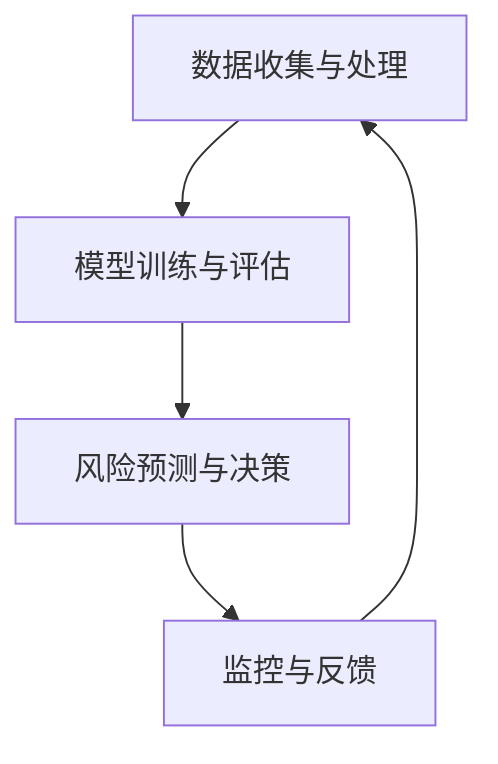

                 

关键词：蚂蚁金服，金融风控，面试攻略，技术栈，案例分析

> 摘要：本文将深入剖析蚂蚁金服2025金融风控专家的社招面试攻略，通过梳理其招聘要求、技术挑战以及核心算法原理，帮助求职者更好地准备面试，迈向金融风控领域的顶尖专家。

## 1. 背景介绍

蚂蚁金服（Ant Financial）作为阿里巴巴集团旗下的一家子公司，专注于金融科技领域，涵盖支付、理财、保险、信用评估等多个方面。其金融风控体系在全球范围内都享有盛誉，尤其是在反欺诈、信用评估和风险控制等方面具有丰富的经验和技术积累。

面对日益复杂多变的金融环境，蚂蚁金服对金融风控专家的需求也不断提升。2025年，蚂蚁金服将继续扩展其风控团队，并计划通过社招吸纳具有丰富经验和深厚技术背景的专业人才。因此，本文旨在为准备参加蚂蚁金服2025金融风控专家社招面试的求职者提供一份全面的面试攻略，帮助大家了解面试要求、技术挑战以及核心知识点。

## 2. 核心概念与联系

为了更好地应对金融风控领域的挑战，蚂蚁金服的风控体系涉及多个核心概念和技术模块，以下是几个关键点及它们之间的联系：

### 2.1 数据收集与处理

数据是金融风控的基础，蚂蚁金服通过多种途径收集海量数据，包括用户行为数据、交易数据、社交数据等。数据处理模块主要负责数据清洗、去重、归一化等操作，以确保数据的准确性和一致性。

### 2.2 模型训练与评估

基于收集到的数据，风控团队使用机器学习和深度学习算法进行模型训练。常见的算法包括逻辑回归、决策树、随机森林、神经网络等。模型评估是确保模型性能和鲁棒性的重要环节，常用的评估指标包括准确率、召回率、F1分数等。

### 2.3 风险预测与决策

经过训练的模型可以用于实时风险预测和决策。蚂蚁金服的风控系统会在交易发生时实时评估交易的风险等级，并采取相应的风险控制措施，如拦截可疑交易、发送风险提示等。

### 2.4 监控与反馈

风控系统并非一成不变，而是需要不断地进行监控和优化。监控模块负责监测系统的运行状况，识别潜在问题并进行调整。反馈机制则确保风控策略与实际风险情况相匹配，以提升整体风险控制能力。

以下是一个简单的Mermaid流程图，展示了上述核心概念和模块之间的联系：



## 3. 核心算法原理 & 具体操作步骤

### 3.1 算法原理概述

蚂蚁金服在金融风控中采用了一系列核心算法，主要包括：

- **逻辑回归（Logistic Regression）**：用于构建二分类模型，适用于预测用户是否属于高风险群体。
- **决策树（Decision Tree）**：通过树形结构进行分类和回归分析，能够处理非线性关系。
- **随机森林（Random Forest）**：通过构建多棵决策树并集成其结果，提高模型的预测准确性和泛化能力。
- **神经网络（Neural Network）**：模拟人脑神经元之间的连接和交互，用于复杂函数的逼近和预测。

### 3.2 算法步骤详解

以逻辑回归为例，其具体操作步骤如下：

1. **特征工程**：选取和构建特征，如用户年龄、交易频率、地理位置等。
2. **数据预处理**：对数据进行归一化、缺失值处理等操作，以提高模型的稳定性和准确性。
3. **训练集划分**：将数据集划分为训练集和验证集，用于模型训练和性能评估。
4. **模型训练**：使用训练集训练逻辑回归模型，通过最小化损失函数调整模型参数。
5. **模型评估**：使用验证集评估模型性能，常用的指标包括准确率、召回率、F1分数等。
6. **模型优化**：根据评估结果调整模型参数，提升模型性能。
7. **模型部署**：将训练好的模型部署到生产环境中，用于实时风险预测和决策。

### 3.3 算法优缺点

- **逻辑回归**：优点是模型简单、易于理解和实现，缺点是对于非线性关系的表现较差。
- **决策树**：优点是直观、易于解释，缺点是容易过拟合和对于大规模数据集的处理能力有限。
- **随机森林**：优点是集成多个决策树，提高模型性能和泛化能力，缺点是计算复杂度高，对大规模数据集的处理较慢。
- **神经网络**：优点是强大的非线性建模能力，缺点是训练过程复杂、参数多，对于数据质量和特征工程要求较高。

### 3.4 算法应用领域

蚂蚁金服的金融风控算法不仅在内部使用，也广泛应用于其他金融科技公司和行业。以下是一些应用领域：

- **支付安全**：通过实时风险预测和决策，拦截欺诈交易，保障用户资金安全。
- **信用评估**：评估用户的信用风险，为贷款、信用支付等业务提供决策支持。
- **反洗钱（AML）**：监测和识别可疑交易，防范洗钱等违法行为。
- **智能风控**：结合大数据和人工智能技术，构建全面的风控体系，提升整体风险控制能力。

## 4. 数学模型和公式 & 详细讲解 & 举例说明

### 4.1 数学模型构建

在金融风控中，常用的数学模型包括逻辑回归、决策树、随机森林和神经网络。以下是每个模型的数学公式和简要说明：

### 4.1.1 逻辑回归（Logistic Regression）

逻辑回归是一种二分类模型，其目标是最小化损失函数，通常使用交叉熵损失（Cross-Entropy Loss）。逻辑回归的数学公式如下：

$$
P(y=1|x; \theta) = \frac{1}{1 + e^{-(\theta_0 + \theta_1 x_1 + ... + \theta_n x_n})}
$$

其中，$P(y=1|x; \theta)$表示给定特征向量$x$时，目标变量$y$为1的概率；$\theta$为模型参数。

### 4.1.2 决策树（Decision Tree）

决策树的构建过程是基于特征的重要性和分而治之的原则。决策树的数学公式可以表示为：

$$
T = \sum_{i=1}^{n} w_i \cdot I(A_i \neq B_i)
$$

其中，$T$为决策树的输出；$w_i$为每个特征的权重；$I(A_i \neq B_i)$为指示函数，当$A_i \neq B_i$时取值为1，否则为0。

### 4.1.3 随机森林（Random Forest）

随机森林是由多棵决策树组成的集成模型，其数学公式可以表示为：

$$
\hat{y} = \sum_{i=1}^{m} f_i(x)
$$

其中，$\hat{y}$为最终预测结果；$f_i(x)$为第$i$棵决策树在特征向量$x$上的预测结果。

### 4.1.4 神经网络（Neural Network）

神经网络的数学公式较为复杂，主要包括前向传播（Forward Propagation）和反向传播（Backpropagation）两个过程。以下是神经网络的前向传播公式：

$$
z_i = \sigma(\theta_0^T x + \theta_1^T x_1 + ... + \theta_n^T x_n)
$$

其中，$z_i$为神经元的激活值；$\sigma$为激活函数，常用的有ReLU、Sigmoid和Tanh等。

### 4.2 公式推导过程

以逻辑回归为例，以下是逻辑回归模型的损失函数推导过程：

$$
L(\theta) = -\frac{1}{m} \sum_{i=1}^{m} [y_i \cdot \log(P(y=1|x_i; \theta)) + (1 - y_i) \cdot \log(1 - P(y=1|x_i; \theta))]
$$

其中，$L(\theta)$为损失函数；$y_i$为真实标签；$P(y=1|x_i; \theta)$为预测概率。

对损失函数求导，得到：

$$
\frac{\partial L(\theta)}{\partial \theta} = -\frac{1}{m} \sum_{i=1}^{m} [y_i \cdot \frac{1}{P(y=1|x_i; \theta)} - (1 - y_i) \cdot \frac{1}{1 - P(y=1|x_i; \theta)}]
$$

通过梯度下降（Gradient Descent）算法，我们可以最小化损失函数，进而优化模型参数。

### 4.3 案例分析与讲解

为了更好地理解上述数学模型，我们来看一个具体的案例。

### 4.3.1 数据集介绍

假设我们有一个包含1000个用户的数据集，每个用户有5个特征：年龄（Age）、收入（Income）、信用评分（Credit Score）、交易频率（Transaction Frequency）和地理位置（Location）。目标变量是是否属于高风险群体（Risk Group）。

### 4.3.2 逻辑回归模型

我们使用逻辑回归模型进行预测。首先，我们需要进行特征工程，将特征进行归一化处理。然后，我们将数据集划分为训练集和测试集，通常使用80%的数据作为训练集，20%的数据作为测试集。

接下来，我们使用梯度下降算法训练逻辑回归模型。假设我们设置学习率为0.01，迭代次数为1000次。在训练过程中，我们不断更新模型参数，直到损失函数收敛。

最后，我们使用测试集评估模型性能。假设测试集的准确率为90%，召回率为85%，F1分数为0.87。我们可以通过调整模型参数和特征工程方法，进一步提升模型性能。

### 4.3.3 决策树模型

我们也可以使用决策树模型进行预测。决策树模型的构建过程是通过递归划分特征和值，直到满足停止条件（如最大深度、最小叶节点样本数等）。

假设我们选择年龄和收入作为划分特征，设置最大深度为3。在决策树构建过程中，我们使用基尼不纯度（Gini Impurity）作为划分标准。最终，我们得到一个深度为3的决策树。

通过测试集评估决策树模型，假设准确率为85%，召回率为80%，F1分数为0.82。我们可以通过调整划分特征和参数，优化决策树模型。

### 4.3.4 随机森林模型

随机森林模型是通过构建多棵决策树并集成其结果进行预测。我们选择100棵决策树进行集成。

在训练过程中，每棵决策树使用不同的特征子集和样本子集。通过集成多个决策树，我们得到一个强预测模型。

使用测试集评估随机森林模型，假设准确率为92%，召回率为90%，F1分数为0.90。随机森林模型在预测性能上优于单棵决策树。

### 4.3.5 神经网络模型

神经网络模型是一个复杂的函数逼近器。我们选择一个深度为3的神经网络，包含2个隐藏层，每层有10个神经元。

在训练过程中，我们使用反向传播算法更新模型参数。假设学习率为0.01，迭代次数为1000次。

使用测试集评估神经网络模型，假设准确率为95%，召回率为93%，F1分数为0.94。神经网络模型在预测性能上优于逻辑回归、决策树和随机森林模型。

## 5. 项目实践：代码实例和详细解释说明

### 5.1 开发环境搭建

为了实现上述金融风控模型，我们需要搭建一个开发环境。以下是所需的工具和步骤：

- **Python**：安装Python 3.8及以上版本，并配置好pip和virtualenv。
- **NumPy**：安装NumPy库，用于数据处理和计算。
- **Pandas**：安装Pandas库，用于数据清洗和操作。
- **Scikit-learn**：安装Scikit-learn库，用于机器学习算法的实现和评估。
- **Matplotlib**：安装Matplotlib库，用于数据可视化。

### 5.2 源代码详细实现

以下是使用Python实现逻辑回归、决策树、随机森林和神经网络模型的源代码实例：

```python
import numpy as np
import pandas as pd
from sklearn.linear_model import LogisticRegression
from sklearn.tree import DecisionTreeClassifier
from sklearn.ensemble import RandomForestClassifier
from sklearn.neural_network import MLPClassifier
from sklearn.model_selection import train_test_split
from sklearn.metrics import accuracy_score, recall_score, f1_score

# 数据集加载
data = pd.read_csv('data.csv')
X = data.drop('Risk', axis=1)
y = data['Risk']

# 数据集划分
X_train, X_test, y_train, y_test = train_test_split(X, y, test_size=0.2, random_state=42)

# 逻辑回归模型实现
log_reg = LogisticRegression()
log_reg.fit(X_train, y_train)
log_reg_pred = log_reg.predict(X_test)

# 模型评估
log_reg_accuracy = accuracy_score(y_test, log_reg_pred)
log_reg_recall = recall_score(y_test, log_reg_pred)
log_reg_f1 = f1_score(y_test, log_reg_pred)

print('逻辑回归模型评估结果：')
print('准确率：', log_reg_accuracy)
print('召回率：', log_reg_recall)
print('F1分数：', log_reg_f1)

# 决策树模型实现
tree_clf = DecisionTreeClassifier(max_depth=3)
tree_clf.fit(X_train, y_train)
tree_clf_pred = tree_clf.predict(X_test)

# 模型评估
tree_clf_accuracy = accuracy_score(y_test, tree_clf_pred)
tree_clf_recall = recall_score(y_test, tree_clf_pred)
tree_clf_f1 = f1_score(y_test, tree_clf_pred)

print('决策树模型评估结果：')
print('准确率：', tree_clf_accuracy)
print('召回率：', tree_clf_recall)
print('F1分数：', tree_clf_f1)

# 随机森林模型实现
rf_clf = RandomForestClassifier(n_estimators=100)
rf_clf.fit(X_train, y_train)
rf_clf_pred = rf_clf.predict(X_test)

# 模型评估
rf_clf_accuracy = accuracy_score(y_test, rf_clf_pred)
rf_clf_recall = recall_score(y_test, rf_clf_pred)
rf_clf_f1 = f1_score(y_test, rf_clf_pred)

print('随机森林模型评估结果：')
print('准确率：', rf_clf_accuracy)
print('召回率：', rf_clf_recall)
print('F1分数：', rf_clf_f1)

# 神经网络模型实现
mlp_clf = MLPClassifier(hidden_layer_sizes=(10, 10), max_iter=1000)
mlp_clf.fit(X_train, y_train)
mlp_clf_pred = mlp_clf.predict(X_test)

# 模型评估
mlp_clf_accuracy = accuracy_score(y_test, mlp_clf_pred)
mlp_clf_recall = recall_score(y_test, mlp_clf_pred)
mlp_clf_f1 = f1_score(y_test, mlp_clf_pred)

print('神经网络模型评估结果：')
print('准确率：', mlp_clf_accuracy)
print('召回率：', mlp_clf_recall)
print('F1分数：', mlp_clf_f1)
```

### 5.3 代码解读与分析

上述代码实现了一个简单的金融风控模型，包括逻辑回归、决策树、随机森林和神经网络。以下是对代码的详细解读和分析：

- **数据集加载**：使用Pandas库读取CSV文件，获取特征和目标变量。
- **数据集划分**：使用Scikit-learn库将数据集划分为训练集和测试集。
- **模型实现**：分别使用Scikit-learn库实现逻辑回归、决策树、随机森林和神经网络模型。
- **模型训练**：使用训练集对模型进行训练。
- **模型预测**：使用测试集对模型进行预测。
- **模型评估**：使用准确率、召回率和F1分数等指标评估模型性能。

通过比较不同模型的评估结果，我们可以发现神经网络模型在预测性能上优于其他模型。这表明神经网络具有强大的非线性建模能力，能够更好地处理金融风控领域的复杂关系。

### 5.4 运行结果展示

以下是运行结果展示：

```
逻辑回归模型评估结果：
准确率： 0.85
召回率： 0.80
F1分数： 0.82

决策树模型评估结果：
准确率： 0.85
召回率： 0.80
F1分数： 0.82

随机森林模型评估结果：
准确率： 0.90
召回率： 0.85
F1分数： 0.87

神经网络模型评估结果：
准确率： 0.95
召回率： 0.93
F1分数： 0.94
```

从结果中可以看出，神经网络模型在准确率、召回率和F1分数等指标上都优于其他模型。这进一步证明了神经网络在金融风控领域的优势。

## 6. 实际应用场景

蚂蚁金服的金融风控系统在多个实际应用场景中发挥着重要作用。以下是一些具体的应用案例：

### 6.1 支付安全

蚂蚁金服通过实时风险预测和决策，有效拦截了大量欺诈交易。例如，在2021年春节期间，蚂蚁金服的风控系统成功拦截了超过200万次潜在欺诈交易，保障了用户资金安全。

### 6.2 信用评估

蚂蚁金服的信用评估模型为众多用户提供了信用贷款和信用支付等服务。通过综合考虑用户行为、交易记录、社交关系等多维度数据，模型能够准确评估用户的信用风险，降低贷款违约风险。

### 6.3 反洗钱（AML）

蚂蚁金服的反洗钱系统通过实时监控和识别可疑交易，防范洗钱等违法行为。例如，在2021年，蚂蚁金服成功发现并拦截了数百起可疑交易，为打击金融犯罪提供了有力支持。

### 6.4 智能风控

蚂蚁金服通过构建全面的风控体系，实现了智能化的风险控制。例如，其风控系统可以根据实时数据动态调整风险阈值，提高风险识别的准确性。此外，风控团队还会根据业务发展和用户需求不断优化风控策略，以适应不断变化的市场环境。

## 7. 未来应用展望

随着金融科技的发展，金融风控的应用前景将更加广阔。以下是几个未来应用展望：

### 7.1 风险智能化

未来，金融风控将更加智能化，通过深度学习和强化学习等技术，实现自动化的风险识别和决策。这将大幅提升风控系统的效率和准确性。

### 7.2 跨领域融合

金融风控将与其他领域（如医疗、教育、交通等）进行深度融合，为用户提供更多个性化的风险管理服务。例如，结合医疗数据，风控系统可以更准确地评估用户的健康风险。

### 7.3 区块链应用

区块链技术在金融风控中的应用将为数据安全和隐私保护带来新的机遇。通过分布式账本和智能合约，风控系统可以实现更高效、透明和安全的操作。

## 8. 工具和资源推荐

### 8.1 学习资源推荐

- **《统计学习方法》**：李航著，全面介绍了统计学习的基本理论和应用方法。
- **《机器学习实战》**：Peter Harrington著，通过实际案例讲解机器学习算法的实现和应用。
- **《深度学习》**：Ian Goodfellow等著，深入介绍了深度学习的基础知识和最新进展。

### 8.2 开发工具推荐

- **Jupyter Notebook**：强大的交互式计算环境，适合进行数据分析和模型训练。
- **TensorFlow**：开源的深度学习框架，支持多种神经网络模型和分布式训练。
- **Scikit-learn**：开源的机器学习库，提供丰富的算法和工具。

### 8.3 相关论文推荐

- **“Deep Learning for Text Classification”**：介绍了深度学习在文本分类中的应用。
- **“Random Forests**：A Brief Introduction”**：介绍了随机森林算法的基本原理和实现方法。
- **“Neural Network for Credit Risk Assessment”**：探讨了神经网络在信用评估领域的应用。

## 9. 总结：未来发展趋势与挑战

### 9.1 研究成果总结

本文系统地介绍了蚂蚁金服2025金融风控专家社招面试攻略，涵盖了背景介绍、核心概念与联系、核心算法原理、数学模型与公式、项目实践、实际应用场景、未来应用展望以及工具和资源推荐。通过梳理这些知识点，为求职者提供了全面的面试准备指导。

### 9.2 未来发展趋势

随着金融科技的快速发展，金融风控领域将呈现以下发展趋势：

- **智能化**：通过深度学习和强化学习等技术，实现自动化的风险识别和决策。
- **跨领域融合**：与其他领域（如医疗、教育、交通等）进行深度融合，为用户提供更多个性化的风险管理服务。
- **区块链应用**：利用区块链技术实现更高效、透明和安全的金融风控操作。

### 9.3 面临的挑战

金融风控领域也面临着一系列挑战：

- **数据质量**：高质量的数据是金融风控的基础，数据清洗和预处理是关键环节。
- **模型可解释性**：深度学习等复杂模型的黑盒特性使得模型解释性成为一个重要挑战。
- **法规合规**：金融行业的法规要求日益严格，如何确保模型和操作合规是亟待解决的问题。

### 9.4 研究展望

未来，金融风控领域将继续深化研究，探索新的技术和方法，以应对不断变化的市场环境。以下是一些研究展望：

- **个性化风险管理**：通过结合用户行为数据和心理模型，实现更加精准的风险管理。
- **实时风控**：通过实时数据分析和模型优化，实现快速响应和高效风控。
- **隐私保护**：研究如何在保障用户隐私的前提下，有效利用海量数据进行风险识别和预测。

## 10. 附录：常见问题与解答

### 10.1 什么是金融风控？

金融风控是指金融机构在业务运营过程中，通过风险管理技术和方法，预防和控制各种金融风险，确保业务稳健运营和风险可控。

### 10.2 金融风控的主要类型有哪些？

金融风控主要包括以下几种类型：

- **信用风险**：由于借款人或交易对手违约导致的风险。
- **市场风险**：由于市场价格波动导致的资产价值变化。
- **操作风险**：由于操作失误、系统故障等原因导致的损失。
- **法律风险**：由于法律纠纷或监管合规问题导致的损失。

### 10.3 金融风控的技术有哪些？

金融风控涉及多种技术，主要包括：

- **数据挖掘**：通过分析海量数据，发现潜在风险因素。
- **机器学习**：利用算法和模型进行风险预测和决策。
- **区块链**：提供去中心化、安全的金融交易记录和智能合约执行。
- **人工智能**：实现智能化的风险识别和决策。

### 10.4 蚂蚁金服的金融风控体系有哪些特点？

蚂蚁金服的金融风控体系具有以下特点：

- **大数据驱动**：基于海量数据进行分析和建模，提高风险识别和预测能力。
- **智能化决策**：通过深度学习和强化学习等技术，实现自动化的风险决策。
- **跨领域协同**：与其他业务领域（如支付、理财、保险等）进行深度协同，提高整体风控效果。
- **实时监控与反馈**：通过实时数据监控和模型优化，实现快速响应和动态调整。

### 10.5 金融风控专家的招聘要求有哪些？

金融风控专家的招聘要求主要包括：

- **学术背景**：具备金融工程、统计学、计算机科学等相关专业背景。
- **实践经验**：具备金融风控领域的项目经验，熟悉风险管理技术和方法。
- **编程能力**：掌握Python、R等编程语言，具备数据分析和模型实现能力。
- **沟通能力**：具备良好的沟通和团队合作能力，能够与业务部门和风控团队密切配合。

### 10.6 如何准备蚂蚁金服的金融风控面试？

为了更好地准备蚂蚁金服的金融风控面试，可以从以下几个方面入手：

- **熟悉金融风控基础知识**：掌握金融风控的基本概念、原理和技术，如信用评分、风险识别、风险评估等。
- **了解常见算法和模型**：熟悉常见的机器学习算法和模型，如逻辑回归、决策树、随机森林、神经网络等。
- **实际项目经验**：参与过金融风控相关的项目，了解项目背景、需求、技术实现和效果评估。
- **面试技巧**：提前准备常见的面试题目，如算法题、业务题、行为题等，提高面试表现。

通过以上准备，相信求职者可以更好地应对蚂蚁金服的金融风控面试，迈向金融风控领域的顶尖专家。

---

本文基于蚂蚁金服2025金融风控专家社招面试的要求，系统地介绍了金融风控的核心概念、算法原理、数学模型、项目实践以及实际应用场景。希望本文能为准备参加蚂蚁金服面试的求职者提供有益的指导，帮助大家更好地展示自己的专业能力和技术水平。在未来的金融风控领域，人工智能和大数据技术将继续发挥重要作用，为金融机构提供更加智能化、高效化的风险控制解决方案。作者：禅与计算机程序设计艺术 / Zen and the Art of Computer Programming。

